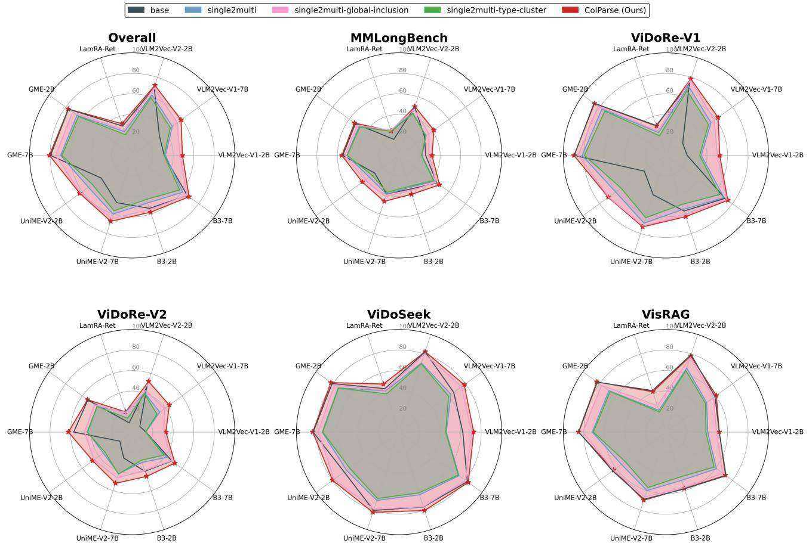
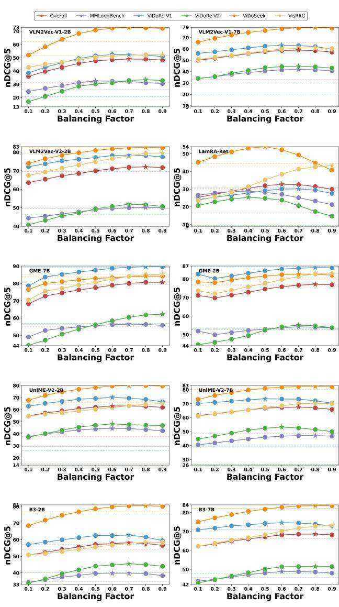

# References

Blecher, L., Cucurull, G., Scialom, T., and Stojnic, R. Nougat: Neural optical understanding for academic documents. arXiv preprint arXiv:2308.13418, 2023.

Chen, J., Xiao, S., Zhang, P., Luo, K., Lian, D., and Liu, Z. M3-embedding: Multi-linguality, multifunctionality, multi-granularity text embeddings through self-knowledge distillation. In Findings of the Association for Computational Linguistics ACL 2024, pp. 2318–2335, 2024.

Faysse, M., Sibille, H., Wu, T., Omrani, B., Viaud, G., Hudelot, C., and Colombo, P. Colpali: Efficient document retrieval with vision language models. arXiv preprint arXiv:2407.01449, 2024.

Feng, H., Wei, S., Fei, X., Shi, W., Han, Y., Liao, L., Lu, J., Wu, B., Liu, Q., Lin, C., et al. Dolphin: Document image parsing via heterogeneous anchor prompting. arXiv preprint arXiv:2505.14059, 2025.

Gu, T., Yang, K., Zhang, K., An, X., Feng, Z., Zhang, Y., Cai, W., Deng, J., and Bing, L. Unime-v2: Mllm-as-ajudge for universal multimodal embedding learning, 2025. URL https://arxiv.org/abs/2510.13515.

Gunther, M., Sturua, S., Akram, M. K., Mohr, I., Ungureanu, ¨ A., Wang, B., Eslami, S., Martens, S., Werk, M., Wang, N., et al. jina-embeddings-v4: Universal embeddings for multimodal multilingual retrieval. arXiv preprint arXiv:2506.18902, 2025.   
Huo, J., Huang, Y., Yan, Y., Pan, Y., Cao, Y., Ou, M., Yu, P. S., and Hu, X. Causalembed: Auto-regressive multivector generation in latent space for visual document embedding. arXiv preprint arXiv:2601.21262, 2026.   
ILLUIN. ViDoRe V3: a comprehensive evaluation of retrieval for enterprise use-cases, nov 2025. URL https://huggingface.co/blog/ QuentinJG/introducing-vidore-v3.   
Jayaram, R., Dhulipala, L., Hadian, M., Lee, J. D., and Mirrokni, V. Muvera: Multi-vector retrieval via fixed dimensional encoding. Advances in Neural Information Processing Systems, 37:101042–101073, 2024.   
Jha, R., Wang, B., Gunther, M., Mastrapas, G., Sturua, ¨ S., Mohr, I., Koukounas, A., Akram, M. K., Wang, N., and Xiao, H. Jina-colbert-v2: A general-purpose multilingual late interaction retriever. arXiv preprint arXiv:2408.16672, 2024.   
Jiang, Z., Meng, R., Yang, X., Yavuz, S., Zhou, Y., and Chen, W. Vlm2vec: Training vision-language models for massive multimodal embedding tasks. arXiv preprint arXiv:2410.05160, 2024.   
Khattab, O. and Zaharia, M. Colbert: Efficient and effective passage search via contextualized late interaction over bert. In Proceedings of the 43rd International ACM SIGIR conference on research and development in Information Retrieval, pp. 39–48, 2020.   
Kim, G., Hong, T., Yim, M., Nam, J., Park, J., Yim, J., Hwang, W., Yun, S., Han, D., and Park, S. Ocr-free document understanding transformer. In European Conference on Computer Vision, pp. 498–517. Springer, 2022.   
Lee, J., Dai, Z., Duddu, S. M. K., Lei, T., Naim, I., Chang, M.-W., and Zhao, V. Rethinking the role of token retrieval in multi-vector retrieval. Advances in Neural Information Processing Systems, 36:15384–15405, 2023.   
Liu, Q. and Mao, J. Understanding the multi-vector dense retrieval models. In Proceedings of the 32nd ACM International Conference on Information and Knowledge Management, pp. 4110–4114, 2023.   
Liu, Y., Zhang, Y., Cai, J., Jiang, X., Hu, Y., Yao, J., Wang, Y., and Xie, W. Lamra: Large multimodal model as your advanced retrieval assistant. In Proceedings of the Computer Vision and Pattern Recognition Conference, pp. 4015–4025, 2025a.

Liu, Z., Liu, Z., Liang, Z., Zhou, J., Xiao, S., Gao, C., Zhang, C. J., and Lian, D. Any information is just worth one single screenshot: Unifying search with visualized information retrieval. In Proceedings of the 63rd Annual Meeting of the Association for Computational Linguistics (Volume 1: Long Papers), pp. 19238–19261, 2025b.

Ma, X., Lin, S.-C., Li, M., Chen, W., and Lin, J. Unifying multimodal retrieval via document screenshot embedding. In Al-Onaizan, Y., Bansal, M., and Chen, Y.-N. (eds.), Proceedings of the 2024 Conference on Empirical Methods in Natural Language Processing, pp. 6492–6505, Miami, Florida, USA, November 2024a. Association for Computational Linguistics. doi: 10.18653/v1/2024. emnlp-main.373. URL https://aclanthology. org/2024.emnlp-main.373/.

Ma, Y., Zang, Y., Chen, L., Chen, M., Jiao, Y., Li, X., Lu, X., Liu, Z., Ma, Y., Dong, X., et al. Mmlongbenchdoc: Benchmarking long-context document understanding with visualizations. Advances in Neural Information Processing Systems, 37:95963–96010, 2024b.

Ma, Y., Li, J., Zang, Y., Wu, X., Dong, X., Zhang, P., Cao, Y., Duan, H., Wang, J., Cao, Y., et al. Towards storage-efficient visual document retrieval: An empirical study on reducing patch-level embeddings. arXiv preprint arXiv:2506.04997, 2025.

Mace, Q., Loison, A., and Faysse, M. Vidore benchmark ´ v2: Raising the bar for visual retrieval. arXiv preprint arXiv:2505.17166, 2025.

Mei, L., Mo, S., Yang, Z., and Chen, C. A survey of multimodal retrieval-augmented generation. arXiv preprint arXiv:2504.08748, 2025.

Meng, R., Jiang, Z., Liu, Y., Su, M., Yang, X., Fu, Y., Qin, C., Chen, Z., Xu, R., Xiong, C., et al. Vlm2vec-v2: Advancing multimodal embedding for videos, images, and visual documents. arXiv preprint arXiv:2507.04590, 2025.

Most, A., Winjum, J., Bhattarai, M., Jones, S., Ranasinghe, N. R., Biswas, A., and O’Malley, D. Lost in ocr translation? vision-based approaches to robust document retrieval. In Proceedings of the 2025 ACM Symposium on Document Engineering, pp. 1–10, 2025.

Niu, J., Liu, Z., Gu, Z., Wang, B., Ouyang, L., Zhao, Z., Chu, T., He, T., Wu, F., Zhang, Q., et al. Mineru2. 5: A decoupled vision-language model for efficient high-resolution document parsing. arXiv preprint arXiv:2509.22186, 2025.

Ouyang, L., Qu, Y., Zhou, H., Zhu, J., Zhang, R., Lin, Q., Wang, B., Zhao, Z., Jiang, M., Zhao, X., et al. Omnidocbench: Benchmarking diverse pdf document parsing with comprehensive annotations. In Proceedings of the Computer Vision and Pattern Recognition Conference, pp. 24838–24848, 2025.

Park, C., Jeong, S., Kim, M., Lim, K., and Lee, Y.-H. Scv: Light and effective multi-vector retrieval with sequence compressive vectors. In Proceedings of the 31st International Conference on Computational Linguistics: Industry Track, pp. 760–770, 2025.

Qian, Y., Lee, J., Duddu, S. M. K., Dai, Z., Brahma, S., Naim, I., Lei, T., and Zhao, V. Y. Multi-vector retrieval as sparse alignment. arXiv preprint arXiv:2211.01267, 2022.

Santhanam, K., Khattab, O., Saad-Falcon, J., Potts, C., and Zaharia, M. Colbertv2: Effective and efficient retrieval via lightweight late interaction. In Proceedings of the 2022 Conference of the North American Chapter of the Association for Computational Linguistics: Human Language Technologies, pp. 3715–3734, 2022.

Shrestha, S., Reddy, N., and Li, Z. Espn: Memory-efficient multi-vector information retrieval. In Proceedings of the 2024 ACM SIGPLAN International Symposium on Memory Management, pp. 95–107, 2024.

Team, N. Nomic embed multimodal: Interleaved text, image, and screenshots for visual document retrieval, 2025. URL https://nomic.ai/blog/posts/ nomic-embed-multimodal.

Teiletche, P., Mace, Q., Conti, M., Loison, A., Viaud, ´ G., Colombo, P., and Faysse, M. Modernvbert: Towards smaller visual document retrievers. arXiv preprint arXiv:2510.01149, 2025.

Thirukovalluru, R., Meng, R., Liu, Y., Su, M., Nie, P., Yavuz, S., Zhou, Y., Chen, W., Dhingra, B., et al. Breaking the batch barrier (b3) of contrastive learning via smart batch mining. arXiv preprint arXiv:2505.11293, 2025.

Tishby, N., Pereira, F. C., and Bialek, W. The information bottleneck method. arXiv preprint physics/0004057, 2000.

Wang, Q., Ding, R., Chen, Z., Wu, W., Wang, S., Xie, P., and Zhao, F. Vidorag: Visual document retrieval-augmented generation via dynamic iterative reasoning agents. arXiv preprint arXiv:2502.18017, 2025.

Wasserman, N., Pony, R., Naparstek, O., Goldfarb, A. R., Schwartz, E., Barzelay, U., and Karlinsky, L. Real-mmrag: A real-world multi-modal retrieval benchmark. arXiv preprint arXiv:2502.12342, 2025.

Xiao, Z., Ma, Q., Gu, M., Chen, C.-c. J., Chen, X., Ordonez, V., and Mohan, V. Metaembed: Scaling multimodal retrieval at test-time with flexible late interaction. arXiv preprint arXiv:2509.18095, 2025.

Xu, M., Moreira, G., Ak, R., Osmulski, R., Babakhin, Y., Yu, Z., Schifferer, B., and Oldridge, E. Llama nemoretriever colembed: Top-performing text-image retrieval model. arXiv preprint arXiv:2507.05513, 2025.

Yan, Y., Xu, G., Zou, X., Liu, S., Kwok, J., and Hu, X. Docpruner: A storage-efficient framework for multivector visual document retrieval via adaptive patch-level embedding pruning. arXiv preprint arXiv:2509.23883, 2025.

Yan, Y., Huo, J., Feng, G., Ou, M., Cao, Y., Zou, X., Liu, S., Lyu, Y., Huang, Y., Li, J., et al. Unlocking multimodal document intelligence: From current triumphs to future frontiers of visual document retrieval. arXiv preprint arXiv:2602.19961, 2026a.

Yan, Y., Ou, M., Cao, Y., Zou, X., Huo, J., Liu, S., Kwok, J., and Hu, X. Sculpting the vector space: Towards efficient multi-vector visual document retrieval via prunethen-merge framework. arXiv preprint arXiv:2602.19549, 2026b.

Yu, S., Tang, C., Xu, B., Cui, J., Ran, J., Yan, Y., Liu, Z., Wang, S., Han, X., Liu, Z., et al. Visrag: Visionbased retrieval-augmented generation on multi-modality documents. arXiv preprint arXiv:2410.10594, 2024.

Zhang, J., Liu, Y., Wu, Z., Pang, G., Ye, Z., Zhong, Y., Ma, J., Wei, T., Xu, H., Chen, W., et al. Monkeyocr v1. 5 technical report: Unlocking robust document parsing for complex patterns. arXiv preprint arXiv:2511.10390, 2025a.

Zhang, J., Zhang, Q., Wang, B., Ouyang, L., Wen, Z., Li, Y., Chow, K.-H., He, C., and Zhang, W. Ocr hinders rag: Evaluating the cascading impact of ocr on retrievalaugmented generation. In Proceedings of the IEEE/CVF International Conference on Computer Vision, pp. 17443– 17453, 2025b.

Zhang, Q., Wang, B., Huang, V. S.-J., Zhang, J., Wang, Z., Liang, H., He, C., and Zhang, W. Document parsing unveiled: Techniques, challenges, and prospects for structured information extraction. arXiv preprint arXiv:2410.21169, 2024a.

Zhang, Q., Zhang, J., Ren, Z., Ouyang, L., Wen, Z., Niu, J., Qu, Y., Wang, B., Chow, K.-H., He, C., et al. Docr-inspector: Fine-grained and automated evaluation of document parsing with vlm. arXiv preprint arXiv:2512.10619, 2025c.

Zhang, X., Zhang, Y., Xie, W., Li, M., Dai, Z., Long, D., Xie, P., Zhang, M., Li, W., and Zhang, M. Gme: Improving universal multimodal retrieval by multimodal llms. arXiv preprint arXiv:2412.16855, 2024b.

# A. Algorithm Workflow

We formalize the complete workflow of our proposed ColParse framework in two distinct algorithms. Algorithm 1 details the offline indexing process, where ColParse generates a highly compact set of document embeddings through its sequential three-stage process. Subsequently, Algorithm 2 illustrates the online retrieval phase, where the final relevance score is efficiently computed via a $\mathtt { M a x S i m }$ operation using this compressed set of embeddings.

# Algorithm 1 The Offline Indexing Process of ColParse

Input : A document image d ∈ RH×W×3; A document parser model $\Psi _ { \mathrm { p a r s e } }$ ; A single-vector encoder $\begin{array} { r } { \Phi _ { \mathrm { e n c } } : \mathbb { R } ^ { H ^ { \prime } \times W ^ { \prime } \times 3 }  \mathbb { R } ^ { D } } \end{array}$   
Output : A compact multi-vector representation DColParse ⊂ Rk×D   
/\* Stage 1: Layout-Informed Document Parsing \*/   
$[ \{ b _ { j } , c _ { j } \} ] _ { j = 1 } ^ { k }  \Psi _ { \mathrm { p a r s e } } ( d )$ ; // Get $k$ bboxes and content   
types   
${ \cal S } _ { d } \gets \emptyset$ for $j  1$ to $k$ do $s _ { j } \gets \mathbf { C r o p } ( d , b _ { j } )$ ; // Crop doc image $d$ using bbox $b _ { j }$ $S _ { d } \gets S _ { d } \cup \{ s _ { j } \}$   
end

$$
\mathbf { D } _ { \mathrm { l o c a l } }  \mathbf { D } _ { \mathrm { l o c a l } } \cup \{ \mathbf { v } _ { \mathrm { l o c a l } } ^ { ( j ) } \}
$$

# end

$\mathbf { D } _ { \mathsf { C o l P a r s e } }  \emptyset$ for each local vector $\mathbf { v } _ { l o c a l } ^ { ( j ) } \in \mathbf { D } _ { l o c a l }$ do $\mathbf { d } _ { \mathrm { f u s e d } } ^ { ( j ) }  \mathbf { v } _ { \mathrm { l o c a l } } ^ { ( j ) } + \mathbf { v } _ { \mathrm { g l o b a l } }$ ; // Fuse by element-wise addition $\mathbf { D } _ { \mathsf { C o l P a r s e } }  \mathbf { D } _ { \mathsf { C o l P a r s e } } \cup \{ \mathbf { d } _ { \mathsf { f u s e d } } ^ { ( j ) } \}$

end

return DColParse

# B. More Theoretical Analysis

This section provides a detailed theoretical exposition of the concepts introduced in Section 3, grounding the ColParse framework in fundamental principles of information theory.

# B.1. Information-Theoretic Preliminaries

We begin by defining the core concepts used in our analysis.

Definition B.1 (Mutual Information). The mutual information $I ( X ; Y )$ between two random variables $X$ and $Y$

# Algorithm 2 The Online Retrieval Process with ColParse

Input : A textual query $q$ ;   
$\mathbf { D } _ { \mathtt { C o l P a r s e } } = \{ \mathbf { d } _ { \mathrm { f u s e d } } ^ { ( j ) } \} _ { j = 1 } ^ { k }$ A pre-computed ; compact representation An encoder $\Phi _ { \mathrm { e n c } }$   
Output : The relevance score $s _ { \tt C o l P a r s e } ( q , d )$   
$/ { } ^ { * }$ Step 1: Encode Query $^ { * }$   
$\mathbf { Q }  \Phi _ { \mathrm { e n c } } ( q )$ ; // Encode $q$ into $N _ { q }$ token vectors $\left\{ \mathbf { q } _ { i } \right\}$   
$/ { } ^ { * }$ Step 2: Late-Interaction Scoring (MaxSim) $^ { * }$   
$s c o r e \gets 0$ for each query vector $\mathbf { q } _ { i } \in \mathbf { Q }$ do $m a x _ { - } s i m \gets - \infty$ for each fused document vector $\mathbf { d } _ { f u s e d } ^ { ( j ) } \in \mathbf { D } _ { C o l P a r s e } \mathbf { d o }$ $s i m  { \bf q } _ { i } ^ { \top } { \bf d } _ { \mathrm { f u s e d } } ^ { ( j ) }$ // Assuming L2-normalized vectors $m a x \mathrm { - } s i m \gets \operatorname* { m a x } ( m a x \mathrm { - } s i m , s i m )$ end $s c o r e \gets s c o r e + m a x _ { - } s i m$ ; // Aggregate max similarity   
end

# return score

measures their mutual dependence. It is defined as:

$$
I ( X ; Y ) = \sum _ { x \in { \mathcal { X } } } \sum _ { y \in { \mathcal { Y } } } p ( x , y ) \log { \frac { p ( x , y ) } { p ( x ) p ( y ) } } .
$$

where $p ( x , y )$ is the joint probability distribution, and $p ( x )$ and $p ( y )$ are the marginal distributions. $I ( X ; Y ) = 0$ if and only if $X$ and $Y$ are independent.

Definition B.2 (Conditional Mutual Information). The conditional mutual information $I ( X ; Y | Z )$ measures the mutual information between $X$ and $Y$ given that a third variable $Z$ is known:

$$
I ( X ; Y | Z ) = \mathbb { E } _ { z \sim p ( z ) } [ I ( X ; Y | Z = z ) ] .
$$

Theorem B.3 (Chain Rule for Mutual Information). For a set of random variables $\{ X _ { 1 } , \ldots , X _ { n } \}$ and another variable $Y$ , the chain rule states:

$$
I ( X _ { 1 } , \ldots , X _ { n } ; Y ) = \sum _ { i = 1 } ^ { n } I ( X _ { i } ; Y | X _ { 1 } , \ldots , X _ { i - 1 } ) .
$$

This rule is fundamental for decomposing the information content of a complex system.

Theorem B.4 (Data Processing Inequality (DPI)). For any Markov chain of random variables $X  Y  Z$ , where $Z$ is conditionally independent of $X$ given $Y$ , the following inequality holds:

$$
I ( X ; Z ) \leq I ( X ; Y ) a n d I ( X ; Z ) \leq I ( Y ; Z ) .
$$

This theorem formalizes the notion that post-processing (the step from $Y$ to $Z$ ) cannot increase information about the original source $X$ .

# B.2. The Information Bottleneck (IB) Principle in VDR

As stated in Section 3.3, the VDR compression task can be framed as an IB problem (Tishby et al., 2000). The objective is to find a compressed representation $Z$ of a document $D$ that maximizes information about a relevance variable $R$ , while minimizing information about the source $D$ itself.

Proof of Intractability. The IB Lagrangian (Eq. 3 in the main text) requires computing an expectation over the distribution of all possible queries, $P ( Q )$ .

$$
\mathcal { L } ( Z ) = I ( Z ; D ) - \beta \int _ { q \in \mathcal { Q } } P ( q ) I ( Z ; R ( D , q ) ) d q .
$$

Since $P ( Q )$ is unknown and potentially infinite at the time of document indexing, this objective cannot be directly optimized. Therefore, practical methods must rely on principled approximations or surrogates for this ideal objective. ColParse provides such a surrogate.

# B.3. Justification for Structural Disentanglement

ColParse’s parsing stage, $\Psi _ { \mathrm { p a r s e } } ( D ) = \{ S _ { 1 } , . . . , S _ { k } \}$ , is justified by the Semantic Concentration Axiom. We now provide a more formal justification.

Axiom B.5 (Semantic Concentration). For a given query $Q = q$ , there exists a primary semantic region $S _ { j ^ { * } } \in \{ S _ { j } \}$ that contains almost all the information required to determine relevance. The remaining regions $S _ { \lnot j ^ { * } } = \{ S _ { j } \} _ { j \ne j ^ { * } }$ provide negligible additional information.

$$
I ( S _ { \neg j ^ { * } } ; R | S _ { j ^ { * } } , Q = q ) \approx 0 .
$$

Justification. This axiom is an empirical assumption about the nature of user queries and documents. For a query “What were the revenues in Q3 2023?”, the answer is almost certainly contained entirely within a single financial table. Information in other regions (e.g., the abstract, a methodology figure) is conditionally irrelevant once the correct table is identified. □

Corollary B.6 (Information Equivalence of Decomposed Representation). Under the Semantic Concentration Axiom, the mutual information between the entire document and the relevance variable is approximately equal to the maximum information contained in any single semantic region.

$$
I ( D ; R ) \approx \operatorname* { m a x } _ { j \in \{ 1 , . . . , k \} } I ( S _ { j } ; R ) .
$$

Proof. From the chain rule, $I ( D ; R ) = I ( S _ { 1 } , \ldots , S _ { k } ; R )$ . For a specific query $q$ , let $j ^ { * }$ be the index of the primary region. We have:

$$
I ( D ; R | Q = q ) = I ( S _ { j ^ { * } } ; R | Q = q ) + I ( S _ { \neg j ^ { * } } ; R | S _ { j ^ { * } } , Q = q ) .
$$

Applying Axiom B.5, the second term vanishes: $I ( D ; R | Q = q ) \approx I ( S _ { j ^ { * } } ; R | Q = q )$ . Taking the expectation over $P ( Q )$ , and using the property that $\mathbb { E } [ \operatorname* { m a x } ( X _ { i } ) ] \geq$ $\operatorname* { m a x } ( \mathbb { E } [ X _ { i } ] )$ , we arrive at the approximation that the total information is well-represented by the information in the best possible channel, justifying the multi-vector approach.

# B.4. Justification for Synergistic Fusion

The fusion stage combines local vectors $\{ V _ { j } = \Phi _ { \mathrm { e n c } } ( S _ { j } ) \}$ with a global vector $V _ { \mathrm { g l o b a l } } = \Phi _ { \mathrm { e n c } } ( D )$ to produce the final representation $\{ Z _ { j } = V _ { j } + V _ { \mathrm { g l o b a l } } \}$ .

Definition B.7 (Contextual Information Gain). The contextual information gain for region $j$ is the additional information about relevance $R$ provided by the global context $V _ { \mathrm { g l o b a l } }$ , given that the local information $V _ { j }$ is already known.

$$
G _ { j } ^ { \mathrm { c o n t e x t } } \triangleq I ( V _ { \mathrm { g l o b a l } } ; R | V _ { j } ) .
$$

Theorem B.8 (Information in the Fused Representation). The information contained in the fused vector $Z _ { j } = V _ { j } +$ $V _ { g l o b a l }$ is upper-bounded by the joint information of its components.

$$
I ( Z _ { j } ; R ) \le I ( V _ { j } , V _ { g l o b a l } ; R ) .
$$

Proof. The fused vector $Z _ { j }$ is a deterministic function of $V _ { j }$ and $V _ { \mathrm { g l o b a l } }$ . This forms the Markov chain $( V _ { j } , V _ { \mathrm { g l o b a l } } ) $ $Z _ { j } \to R$ . Applying the Data Processing Inequality (Theorem B.4) to this chain directly yields the result. □

Corollary B.9 (Condition for Information Improvement). The fusion step is beneficial (i.e., $Z _ { j }$ is more informative than $V _ { j }$ alone) if and only if the fusion function successfully captures a non-zero portion of the contextual information gain.

$$
\Delta I _ { j } = I ( Z _ { j } ; R ) - I ( V _ { j } ; R ) > 0 \iff I ( Z _ { j } ; R | V _ { j } ) > 0 .
$$

Proof. From the chain rule, $I ( Z _ { j } , V _ { j } ; R ) \ = \ I ( V _ { j } ; R ) \ +$ $I ( Z _ { j } ; R | V _ { j } )$ . Since $Z _ { j }$ is a function of $V _ { j }$ and $V _ { \mathrm { g l o b a l } }$ , knowing $V _ { j }$ does not make $Z _ { j }$ fully determined. The term $I ( Z _ { j } ; R | V _ { j } )$ represents the information that the variation in $Z _ { j }$ (caused by $V _ { \mathrm { g l o b a l } } )$ provides about $R$ , even when $V _ { j }$ is fixed. A positive net improvement $\Delta I _ { j } > 0$ directly requires this conditional term to be positive, which in turn means the fusion must have encoded some of the contextual gain $G _ { j } ^ { \mathrm { c o n t e x t } }$ . The vector addition $V _ { j } + V _ { \mathrm { g l o b a l } }$ is a simple, effective function for this purpose, as it non-linearly interacts with the query vector during the dot product scoring: $\mathbf { q } ^ { \top } ( \mathbf { v } _ { j } + \mathbf { v } _ { \mathrm { g l o b a l } } )$ , allowing the model to utilize both local and global signals.

# C. More Experimental Analysis

# C.1. Benchmark Details

To ensure a comprehensive and robust evaluation of our framework, we anchor our experiments on five mainstream benchmark suites for VDR, all of which are integrated within the visdoc section of the MMEB (Meng et al., 2025). The following benchmarks collectively cover a diverse range of document types, query complexities, and retrieval scenarios, providing a multifaceted view of model performance.

▶ ViDoRe-V1 (Faysse et al., ${ \bf 2 0 2 4 } ) ^ { 3 }$ : As a foundational benchmark for page-level VDR, ViDoRe-V1 was one of the first to systematically evaluate systems on visuallyrich documents. It combines repurposed academic VQA datasets with practical, topic-specific tasks, highlighting the inherent shortcomings of traditional text-only retrieval systems on documents containing complex layouts, tables, and figures.

▶ ViDoRe-V2 (Mace et al. ´ , ${ \bf 2 0 2 5 } ) ^ { 4 }$ : As a successor to ViDoRe-V1, ViDoRe-V2 aims to raise the bar by introducing more challenging and realistic retrieval scenarios to address the performance saturation observed on the original. Its core contributions include the use of long-form, cross-document, and multilingual queries generated via a hybrid synthetic and human-in-the-loop process, which reduces extractive bias and more accurately reflects real-world user interactions.

▶ VisRAG (Yu et al., 2024)5: The VisRAG benchmark is constructed to specifically evaluate vision-based RAG pipelines by aggregating and refining multiple existing VQA datasets. Its primary contribution is the unification of a wide spectrum of document types—including scientific figures, charts, infographics, and presentation slides—under a single evaluation framework, coupled with a crucial filtering process to remove contextdependent questions and ensure its suitability for openretrieval tasks.

▶ ViDoSeek (Wang et al., ${ \bf 2 0 2 5 } ) ^ { 6 }$ : ViDoSeek is a novel benchmark designed to evaluate end-to-end RAG systems on visually-rich documents that require complex reasoning. Its main contribution lies in providing a large document corpus where each query corresponds to a unique answer, which allows for a more realistic and rigorous evaluation of both the retrieval and subsequent reasoning stages in a large-scale setting.

MMLongBench (Ma et al., 2024b)7: MMLongBench is specifically designed to assess the long-context, multimodal understanding capabilities of LVLMs. It stands out by using lengthy documents (averaging 47.5 pages) and featuring a significant portion of cross-page questions that require multi-hop reasoning, as well as unanswerable questions to probe for model hallucination, thus rigorously testing a model’s ability to locate and synthesize information from extensive contexts.

# C.2. Model Details

We select ten representative single-vector multimodal retrieval models from recent literature to serve as the base models for our experiments. These models, built upon various architectures and pre-training paradigms, provide a comprehensive testbed for evaluating the versatility and effectiveness of our proposed framework.

▶ VLM2Vec-V1-2B/7B (Jiang et al., $2 0 2 4 ) ^ { 8 }$ : As a pioneering work in universal multimodal embeddings, VLM2Vec introduces a contrastive training framework to adapt any VLM for a wide range of tasks. Its core contribution is reformulating diverse multimodal tasks (e.g., classification, VQA, retrieval) into a unified instructionfollowing ranking problem, enabling the model to learn general-purpose embeddings for both images and text.

▶ VLM2Vec-V2-2B (Meng et al., ${ \bf 2 0 2 5 ) ^ { 9 } }$ : This model extends its predecessor by broadening the scope of multimodal embeddings to include videos and visual documents, in addition to images and text. Its primary contribution is the introduction of a more comprehensive benchmark and a unified training strategy that allows a single model to effectively learn representations across static, temporal, and structured visual data formats.

▶ LamRA-Ret-7B (Liu et al., ${ \bf 2 0 2 5 a ) ^ { 1 0 } }$ : LamRA explores repurposing generative Large Multimodal Models for retrieval tasks, unifying diverse retrieval scenarios under a single instruction-following framework. Its key innovation is a two-stage training strategy that first pretrains the model on language-only tasks before multimodal instruction tuning, progressively adapting the generative model for retrieval.

▶ GME-2B/7B (Zhang et al., 2024b)11: The General Multimodal Embedder (GME) framework focuses on improving universal multimodal retrieval by leveraging a more diverse mix of training data, including singlemodal, cross-modal, and fused-modal examples. Its core contribution is a novel data synthesis pipeline for creating large-scale, high-quality fused-modal data, which significantly enhances the model’s ability to handle complex queries and retrieve visual documents.

▶ UniME-V2-2B/7B (Gu et al., 2025)12: UniME-V2 enhances representation learning by leveraging an MLLM as a ”judge” to generate soft semantic matching scores for query-candidate pairs. This MLLM-as-a-Judge mechanism facilitates more effective hard negative mining and allows the embedding model to learn finergrained semantic distinctions, significantly improving its discriminative capacity.

▶ B3-2B/7B (Thirukovalluru et al., 2025)13: Breaking the Batch Barrier (B3) introduces a novel batch construction strategy for contrastive learning that curates high-quality batches rich in hard negatives. Instead of random sampling, it uses a teacher model and graphbased community detection to group mutually challenging examples together, thereby improving training efficiency and achieving state-of-the-art performance even with significantly smaller batch sizes.

# C.3. MinerU2.5 Details

To resolve the trade-off between the immense computational overhead $( O ( N ^ { 2 } )$ complexity) and information loss associated with directly processing high-resolution document images, MinerU2.5 innovatively employs a decoupled, coarse-to-fine two-stage strategy:

1. Stage I: Global Layout Analysis. In this stage, the model first resizes the input document image to a medium-resolution thumbnail (e.g., $1 0 3 6 \times 1 0 3 6$ pixels). It then performs a fast, global layout analysis on this thumbnail to identify all structural elements (such as paragraphs, tables, formulas, and figures) and their positions at a low computational cost.

2. Stage II: Local Content Recognition. Guided by the layout information detected in the first stage, the model precisely crops the respective semantic regions from the original high-resolution image. Subsequently, it performs parallel, fine-grained content recognition (e.g., text OCR, table structuring, formula transcription) on these native-resolution cropped patches. This preserves high recognition accuracy while avoiding redundant computations on the entire high-resolution image.

Algorithm 3 details the layout-informed image splitting

process used in ColParse.

Algorithm 3 Layout-Informed Image Splitting for ColParse

Input : A document image d ∈ RH×W×3;

A layout detector model $\Psi _ { \mathrm { s p l i t } }$ (e.g., DocLayoutY-OLO); Minimum area ratio threshold $\tau$ (default 0.01); Maximum sub-images count $N _ { \mathrm { m a x } }$ (default 20); Grid fallback parameters: $R _ { \mathrm { g r i d } } , C _ { \mathrm { g r i d } }$

Output : A list of cropped sub-images $\textstyle { \mathcal { S } } _ { d }$ ; A list of content type labels $\mathcal { C } _ { d }$ (optional)

$/ { } ^ { * }$ Step 1: Semantic Layout Detection \*/   
TotalArea $ H \times W$ $\boldsymbol { B } \gets \boldsymbol { \emptyset } , \mathcal { C } _ { d } \gets \boldsymbol { \emptyset }$   
if $\Psi _ { s p l i t }$ is available then $\mathcal { R }  \Psi _ { \mathrm { s p l i t } }$ .predict $( d )$ ; // Returns list of $\{ { \sf b b o x }$ , category, score} if $\mathcal { R }$ is not empty then for each region $r \in \mathcal { R }$ do $\begin{array} { r l r } { b } & { { }  } & { ( x _ { 1 } , y _ { 1 } , x _ { 2 } , y _ { 2 } ) } \end{array}$ from $r$ .poly $c \gets$ MapCategoryID(r.category id) $\textit { B }  \textit { B } \cup$ $\{ ( b , c , \operatorname { c e n t e r Y } ( b ) , \operatorname { c e n t e r X } ( b ) ) \}$ end end   
end   
/\* Step 2: Fallback & Sorting Mechanism \*/   
if $\boldsymbol { B }$ is empty then $B \gets$ GridBasedSplit $( H , W , R _ { \mathrm { g r i d } } , C _ { \mathrm { g r i d } } )$ ; // Fallback to grid   
else $B  { } S$ ortByReadingOrder $( B )$ ; // Sort by vertical bands, then horizontal

# end

$/ { } ^ { * }$ Step 3: Filtering, Cropping and Output \*/ ${ \cal S } _ { d } \gets \emptyset$ , $\mathrm { c o u n t } \gets 0$ for each $( b , c ) \in B$ do

if count $\geq N _ { m a x }$ then break end Area $ \mathrm { w i d t h } ( b ) \times \mathrm { h e i g h t } ( b )$ if Area/TotalArea ≥ τ then $s \gets \mathbf { C r o p } ( d , b )$ ; // Extract region from original image $S _ { d } \gets S _ { d } \cup \{ s \} \ \mathcal { C } _ { d } \gets \mathcal { C } _ { d } \cup \{ c \} \ \mathrm { c o u n t } \gets \mathrm { c o u n t } + 1$ end end

return Sd, Cd

# C.4. Main Results

Refer to Table 2 and Table 3 for all results of ColParse and baselines across five benchmarks.

Table 2. Performance comparison on MMLongBench and ViDoRe-V1 benchmarks. For each model block, we bold the best-performing optimization method in each column (except for the base result). The average scores for optimizations are shown with relative gains $( \uparrow / \downarrow )$ compared to the base model.   

<table><tr><td rowspan=1 colspan=1>Method</td><td rowspan=1 colspan=2>MMLongBench</td><td rowspan=1 colspan=11>ViDoRe-V1</td></tr><tr><td rowspan=1 colspan=1></td><td rowspan=1 colspan=1>Doc Page</td><td rowspan=1 colspan=1> Avg.</td><td rowspan=1 colspan=10>Arxiv DocV InfoV ShiftTabF TatD S-AI S-En S-HC S-Gov</td><td rowspan=1 colspan=1>Avg.</td></tr><tr><td rowspan=1 colspan=1>VLM2Vec-V1-2B</td><td rowspan=1 colspan=1>25.62 26.23</td><td rowspan=1 colspan=1>25.93</td><td rowspan=1 colspan=10>17.8013.9839.419.1836.3210.5616.3915.96 23.5624.11</td><td rowspan=1 colspan=1>20.73</td></tr><tr><td rowspan=1 colspan=1>s2m-add</td><td rowspan=1 colspan=1>21.54 15.08</td><td rowspan=1 colspan=1>18.31↓7.62</td><td rowspan=1 colspan=10>35.0715.6152.156.6236.51 10.39 26.23 31.22 30.29）33.61</td><td rowspan=1 colspan=1>27.7717.04</td></tr><tr><td rowspan=1 colspan=1>s2m-mul</td><td rowspan=1 colspan=1>22.07 15.10</td><td rowspan=1 colspan=1>18.59↓7.34</td><td rowspan=1 colspan=10>34.9116.1252.616.5736.65 10.34 23.90 30.89 28.8833.60</td><td rowspan=1 colspan=1>27.45个6.72</td></tr><tr><td rowspan=1 colspan=1>cl-t-c</td><td rowspan=1 colspan=1>16.57 10.59</td><td rowspan=1 colspan=1>13.58↓12.35</td><td rowspan=1 colspan=10>13.973.9721.628.7323.20 11.56 12.94 28.27 19.1626.72</td><td rowspan=1 colspan=1>17.01↓3.72</td></tr><tr><td rowspan=1 colspan=1>cl-t-m</td><td rowspan=1 colspan=1>14.358.67</td><td rowspan=1 colspan=1>11.51↓14.42</td><td rowspan=1 colspan=10>16.472.9826.9716.27 18.48 8.59 14.40 23.03 18.7113.10</td><td rowspan=1 colspan=1>15.90↓4.83</td></tr><tr><td rowspan=1 colspan=1>cl-s-c</td><td rowspan=1 colspan=1>18.29 11.54</td><td rowspan=1 colspan=1>14.92↓11.01</td><td rowspan=1 colspan=5>18.834.8722.80</td><td rowspan=1 colspan=1>12.63</td><td rowspan=1 colspan=4>20.85</td><td rowspan=1 colspan=1>17.92↓2.81</td></tr><tr><td rowspan=1 colspan=1>cl-s-m</td><td rowspan=1 colspan=1>15.459.06</td><td rowspan=1 colspan=1>12.26↓13.67</td><td rowspan=1 colspan=5>15.732.54</td><td rowspan=1 colspan=1>9.76</td><td rowspan=1 colspan=2>13.52 24.73</td><td rowspan=1 colspan=2>20.72</td><td rowspan=1 colspan=1>17.17↓3.56</td></tr><tr><td rowspan=1 colspan=1>c-sem</td><td rowspan=1 colspan=1>18.76 13.88</td><td rowspan=1 colspan=1>16.32↓9.61</td><td rowspan=1 colspan=4>29.33 5.87</td><td rowspan=1 colspan=1>35.38</td><td rowspan=1 colspan=1>13.95</td><td rowspan=1 colspan=1>23.98</td><td rowspan=1 colspan=1>37.88</td><td rowspan=1 colspan=1>33.91</td><td rowspan=1 colspan=1>30.44</td><td rowspan=1 colspan=1>26.88个6.15</td></tr><tr><td rowspan=1 colspan=1>multi-img</td><td rowspan=1 colspan=1>23.61 15.85</td><td rowspan=1 colspan=1>19.73↓6.20</td><td rowspan=1 colspan=4>37.78 13.96 54.20 11.35</td><td rowspan=1 colspan=1>40.50</td><td rowspan=1 colspan=1>9.10</td><td rowspan=1 colspan=1>20.36</td><td rowspan=1 colspan=1>32.15</td><td rowspan=1 colspan=1>36.75</td><td rowspan=1 colspan=1>32.04</td><td rowspan=1 colspan=1>28.82个8.09</td></tr><tr><td rowspan=1 colspan=1>ColParse</td><td rowspan=1 colspan=1>34.31 29.83</td><td rowspan=1 colspan=1>32.07个6.14</td><td rowspan=1 colspan=4>47.6628.12</td><td rowspan=1 colspan=1>57.05</td><td rowspan=1 colspan=1>20.43</td><td rowspan=1 colspan=3>62.24 63.77 65.51</td><td rowspan=1 colspan=1>62.54</td><td rowspan=1 colspan=1>52.3731.64</td></tr><tr><td rowspan=1 colspan=1>VLM2Vec-V1-7B</td><td rowspan=1 colspan=1>23.85 37.63</td><td rowspan=1 colspan=1>30.74</td><td rowspan=1 colspan=3>28.0717.9344.47</td><td rowspan=1 colspan=1>2.06</td><td rowspan=1 colspan=1>16.78</td><td rowspan=1 colspan=1>5.86</td><td rowspan=1 colspan=1>17.93</td><td rowspan=1 colspan=2>25.0428.90</td><td rowspan=1 colspan=1>14.59</td><td rowspan=1 colspan=1>20.16</td></tr><tr><td rowspan=1 colspan=1>s2m-add</td><td rowspan=1 colspan=1>34.57 28.11</td><td rowspan=1 colspan=1>31.34↑0.60</td><td rowspan=1 colspan=2>50.3025.66</td><td rowspan=1 colspan=1>66.73</td><td rowspan=1 colspan=1>38.21</td><td rowspan=1 colspan=1>63.75</td><td rowspan=1 colspan=1>23.49</td><td rowspan=1 colspan=1>70.27</td><td rowspan=1 colspan=1>61.87</td><td rowspan=1 colspan=1>70.68</td><td rowspan=1 colspan=1>66.38</td><td rowspan=1 colspan=1>53.73个33.57</td></tr><tr><td rowspan=1 colspan=1>s2m-mul</td><td rowspan=1 colspan=1>35.29 28.49</td><td rowspan=1 colspan=1>31.89个1.15</td><td rowspan=1 colspan=2>50.46 26.34（</td><td rowspan=1 colspan=1>67.28</td><td rowspan=1 colspan=1>36.45</td><td rowspan=1 colspan=1>64.13</td><td rowspan=1 colspan=1>23.84</td><td rowspan=1 colspan=1>69.43</td><td rowspan=1 colspan=1>61.94</td><td rowspan=1 colspan=1>68.35</td><td rowspan=1 colspan=1>66.99</td><td rowspan=1 colspan=1>53.52↑33.36</td></tr><tr><td rowspan=1 colspan=1>cl-t-c</td><td rowspan=1 colspan=1>18.75 14.31</td><td rowspan=1 colspan=1>16.53↓14.21</td><td rowspan=1 colspan=2>17.10 7.71</td><td rowspan=1 colspan=1>26.41</td><td rowspan=1 colspan=1>21.58</td><td rowspan=1 colspan=1>29.62</td><td rowspan=1 colspan=1>14.61</td><td rowspan=1 colspan=1>18.52</td><td rowspan=1 colspan=1>27.98</td><td rowspan=1 colspan=1>26.09</td><td rowspan=1 colspan=1>）26.65</td><td rowspan=1 colspan=1>21.63个1.47</td></tr><tr><td rowspan=1 colspan=1>cl-t-m</td><td rowspan=1 colspan=1>25.34 20.46</td><td rowspan=1 colspan=1>22.90↓7.84</td><td rowspan=1 colspan=2>28.067.00</td><td rowspan=1 colspan=1>47.43</td><td rowspan=1 colspan=1>29.48</td><td rowspan=1 colspan=1>45.92</td><td rowspan=1 colspan=1>19.42</td><td rowspan=1 colspan=1>27.66</td><td rowspan=1 colspan=1>47.56</td><td rowspan=1 colspan=1>44.96</td><td rowspan=1 colspan=1>52.94</td><td rowspan=1 colspan=1>35.04个14.88</td></tr><tr><td rowspan=1 colspan=1>cl-s-c</td><td rowspan=1 colspan=1>22.25 14.48</td><td rowspan=1 colspan=1>18.37↓12.37</td><td rowspan=1 colspan=2>21.808.11</td><td rowspan=1 colspan=1>30.92</td><td rowspan=1 colspan=1>28.36</td><td rowspan=1 colspan=1>25.91</td><td rowspan=1 colspan=1>19.61</td><td rowspan=1 colspan=1>27.40</td><td rowspan=1 colspan=1>40.30</td><td rowspan=1 colspan=1>36.25</td><td rowspan=1 colspan=1>32.58</td><td rowspan=1 colspan=1>27.12↑6.96</td></tr><tr><td rowspan=1 colspan=1>cl-s-m</td><td rowspan=1 colspan=1>26.31 20.38</td><td rowspan=1 colspan=1>23.35↓7.39</td><td rowspan=1 colspan=2>28.588.85</td><td rowspan=1 colspan=1>49.12</td><td rowspan=1 colspan=1>32.67</td><td rowspan=1 colspan=1>46.07</td><td rowspan=1 colspan=1>20.85</td><td rowspan=1 colspan=1>31.96</td><td rowspan=1 colspan=1>50.86</td><td rowspan=1 colspan=1>50.85</td><td rowspan=1 colspan=1>49.99</td><td rowspan=1 colspan=1>36.98†16.82</td></tr><tr><td rowspan=1 colspan=1>c-sem</td><td rowspan=1 colspan=1>31.36 26.16</td><td rowspan=1 colspan=1>28.76↓1.98</td><td rowspan=1 colspan=2>45.7715.38</td><td rowspan=1 colspan=1>59.20</td><td rowspan=1 colspan=1>37.46</td><td rowspan=1 colspan=1>57.05</td><td rowspan=1 colspan=1>30.17</td><td rowspan=1 colspan=1>47.00</td><td rowspan=1 colspan=1>60.89</td><td rowspan=1 colspan=1>64.22</td><td rowspan=1 colspan=1>66.76</td><td rowspan=1 colspan=1>48.39个28.23</td></tr><tr><td rowspan=1 colspan=1>multi-img</td><td rowspan=1 colspan=1>33.77 25.60</td><td rowspan=1 colspan=1>29.69↓1.05</td><td rowspan=1 colspan=2>49.40 19.55</td><td rowspan=1 colspan=1>62.09</td><td rowspan=1 colspan=1>28.19</td><td rowspan=1 colspan=1>66.34</td><td rowspan=1 colspan=1>17.19</td><td rowspan=1 colspan=1>41.89</td><td rowspan=1 colspan=1>51.44</td><td rowspan=1 colspan=1>60.84</td><td rowspan=1 colspan=1>48.89</td><td rowspan=1 colspan=1>44.58个24.42</td></tr><tr><td rowspan=1 colspan=1>ColParse</td><td rowspan=1 colspan=1>43.34 40.58</td><td rowspan=1 colspan=1>41.96个11.22</td><td rowspan=1 colspan=3>60.47 34.42</td><td rowspan=1 colspan=1>53.67</td><td rowspan=1 colspan=1>77.12</td><td rowspan=1 colspan=1> 31.33</td><td rowspan=1 colspan=1>74.81</td><td rowspan=1 colspan=1>69.64</td><td rowspan=1 colspan=1>80.79</td><td rowspan=1 colspan=1>75.89</td><td rowspan=1 colspan=1>62.85个42.69</td></tr><tr><td rowspan=1 colspan=1>VLM2Vec-V2-2B</td><td rowspan=1 colspan=1>48.55 50.34</td><td rowspan=1 colspan=1>49.45</td><td rowspan=1 colspan=3>78.98 38.5182.21</td><td rowspan=1 colspan=1>64.57</td><td rowspan=1 colspan=1>87.64</td><td rowspan=1 colspan=1>44.68</td><td rowspan=1 colspan=1>85.06</td><td rowspan=1 colspan=1>82.99</td><td rowspan=1 colspan=1>89.89</td><td rowspan=1 colspan=1>87.08</td><td rowspan=1 colspan=1>74.16</td></tr><tr><td rowspan=1 colspan=1>s2m-add</td><td rowspan=1 colspan=1>43.33 39.00</td><td rowspan=1 colspan=1>41.17↓8.28</td><td rowspan=1 colspan=2>66.6038.47</td><td rowspan=1 colspan=1>72.80</td><td rowspan=1 colspan=1>58.28</td><td rowspan=1 colspan=1>65.85</td><td rowspan=1 colspan=1> 54.50</td><td rowspan=1 colspan=1>90.10</td><td rowspan=1 colspan=1>84.97</td><td rowspan=1 colspan=1>83.93</td><td rowspan=1 colspan=1>80.36</td><td rowspan=1 colspan=1>69.59↓4.57</td></tr><tr><td rowspan=1 colspan=1>s2m-mul</td><td rowspan=1 colspan=1>45.72 40.66</td><td rowspan=1 colspan=1>43.19↓6.26</td><td rowspan=1 colspan=1>68.04</td><td rowspan=1 colspan=1>39.80</td><td rowspan=1 colspan=1>75.45</td><td rowspan=1 colspan=1>58.87</td><td rowspan=1 colspan=1>69.90</td><td rowspan=1 colspan=1>54.31</td><td rowspan=1 colspan=1>90.93</td><td rowspan=1 colspan=1>84.53</td><td rowspan=1 colspan=1>84.56</td><td rowspan=1 colspan=1>82.40</td><td rowspan=1 colspan=1>70.88↓3.28</td></tr><tr><td rowspan=1 colspan=1>cl-t-c</td><td rowspan=1 colspan=1>20.08 18.48</td><td rowspan=1 colspan=1>19.28↓30.17</td><td rowspan=1 colspan=1>28.47</td><td rowspan=1 colspan=1>6.46</td><td rowspan=1 colspan=1>29.32</td><td rowspan=1 colspan=1>20.51</td><td rowspan=1 colspan=1>40.06</td><td rowspan=1 colspan=1>17.75</td><td rowspan=1 colspan=1>20.23</td><td rowspan=1 colspan=1>35.23</td><td rowspan=1 colspan=1>27.90</td><td rowspan=1 colspan=1>22.54</td><td rowspan=1 colspan=1>24.85↓49.31</td></tr><tr><td rowspan=1 colspan=1>cl-t-m</td><td rowspan=1 colspan=1>25.04 21.94</td><td rowspan=1 colspan=1>23.49↓25.96</td><td rowspan=1 colspan=1>44.82</td><td rowspan=1 colspan=1>7.28</td><td rowspan=1 colspan=1>42.98</td><td rowspan=1 colspan=1>31.23</td><td rowspan=1 colspan=1>38.96</td><td rowspan=1 colspan=1>21.19</td><td rowspan=1 colspan=1>26.38</td><td rowspan=1 colspan=1>47.14</td><td rowspan=1 colspan=1>45.34</td><td rowspan=1 colspan=1>37.44</td><td rowspan=1 colspan=1>34.28139.88</td></tr><tr><td rowspan=1 colspan=1>cl-s-c</td><td rowspan=1 colspan=1>23.25 18.43</td><td rowspan=1 colspan=1>20.84↓28.61</td><td rowspan=1 colspan=1>29.34</td><td rowspan=1 colspan=1>8.76</td><td rowspan=1 colspan=1>27.77</td><td rowspan=1 colspan=1>22.92</td><td rowspan=1 colspan=1>40.48</td><td rowspan=1 colspan=1>21.16</td><td rowspan=1 colspan=1>20.26</td><td rowspan=1 colspan=1>30.91</td><td rowspan=1 colspan=1>24.61</td><td rowspan=1 colspan=1>27.64</td><td rowspan=1 colspan=1>25.39148.77</td></tr><tr><td rowspan=1 colspan=1>cl-s-m</td><td rowspan=1 colspan=1>26.08 22.30</td><td rowspan=1 colspan=1>24.19↓25.26</td><td rowspan=1 colspan=1>44.95</td><td rowspan=1 colspan=1>7.16</td><td rowspan=1 colspan=1>45.42</td><td rowspan=1 colspan=1>19.48</td><td rowspan=1 colspan=1>39.29</td><td rowspan=1 colspan=1>25.44</td><td rowspan=1 colspan=1>31.57</td><td rowspan=1 colspan=1>47.18</td><td rowspan=1 colspan=1>48.84</td><td rowspan=1 colspan=1>40.13</td><td rowspan=1 colspan=1>34.95↓39.21</td></tr><tr><td rowspan=1 colspan=1>c-sem</td><td rowspan=1 colspan=1>29.94 27.99</td><td rowspan=1 colspan=1>28.97↓20.48</td><td rowspan=1 colspan=1>61.30</td><td rowspan=1 colspan=1>17.28</td><td rowspan=1 colspan=1>62.19</td><td rowspan=1 colspan=1>40.55</td><td rowspan=1 colspan=1>55.53</td><td rowspan=1 colspan=1>33.02</td><td rowspan=1 colspan=1>56.52</td><td rowspan=1 colspan=1>62.33</td><td rowspan=1 colspan=1>68.54</td><td rowspan=1 colspan=1>70.10</td><td rowspan=1 colspan=1>52.74↓21.42</td></tr><tr><td rowspan=1 colspan=1>multi-img</td><td rowspan=1 colspan=1>38.69 29.00</td><td rowspan=1 colspan=1>33.85↓15.60</td><td rowspan=1 colspan=1>65.39</td><td rowspan=1 colspan=1>25.80</td><td rowspan=1 colspan=1>70.54</td><td rowspan=1 colspan=1>27.92</td><td rowspan=1 colspan=1>71.56</td><td rowspan=1 colspan=1>33.79</td><td rowspan=1 colspan=1>55.93</td><td rowspan=1 colspan=1>62.93</td><td rowspan=1 colspan=1>72.27</td><td rowspan=1 colspan=1>53.14</td><td rowspan=1 colspan=1>53.93↓20.23</td></tr><tr><td rowspan=1 colspan=1>ColParse</td><td rowspan=1 colspan=1>49.49 50.53</td><td rowspan=1 colspan=1>50.01个0.56</td><td rowspan=1 colspan=2>80.1746.33</td><td rowspan=1 colspan=1>83.53</td><td rowspan=1 colspan=1>72.76</td><td rowspan=1 colspan=1>86.74</td><td rowspan=1 colspan=1>52.40</td><td rowspan=1 colspan=1>91.36</td><td rowspan=1 colspan=1>85.83</td><td rowspan=1 colspan=1>95.47</td><td rowspan=1 colspan=1>89.52</td><td rowspan=1 colspan=1>78.41个4.25</td></tr><tr><td rowspan=1 colspan=1>LamRA-Ret</td><td rowspan=1 colspan=1>19.78 13.24</td><td rowspan=1 colspan=1>16.51</td><td rowspan=1 colspan=2>29.3119.56</td><td rowspan=1 colspan=1>63.00</td><td rowspan=1 colspan=1>15.83</td><td rowspan=1 colspan=1>51.44</td><td rowspan=1 colspan=1>7.70</td><td rowspan=1 colspan=1>21.10</td><td rowspan=1 colspan=1>29.81</td><td rowspan=1 colspan=1>37.18</td><td rowspan=1 colspan=1>31.95</td><td rowspan=1 colspan=1>30.69</td></tr><tr><td rowspan=1 colspan=1>s2m-add</td><td rowspan=1 colspan=1>32.18 17.82</td><td rowspan=1 colspan=1>25.00个8.49</td><td rowspan=1 colspan=1>9.80</td><td rowspan=1 colspan=1>14.37</td><td rowspan=1 colspan=1>46.06</td><td rowspan=1 colspan=1>19.49</td><td rowspan=1 colspan=1>28.13</td><td rowspan=1 colspan=1>19.16</td><td rowspan=1 colspan=1>22.79</td><td rowspan=1 colspan=1>30.98</td><td rowspan=1 colspan=1>37.98</td><td rowspan=1 colspan=1>24.81</td><td rowspan=1 colspan=1>25.36↓5.33</td></tr><tr><td rowspan=1 colspan=1>s2m-mul</td><td rowspan=1 colspan=1>30.52 16.37</td><td rowspan=1 colspan=1>23.45个6.94</td><td rowspan=1 colspan=1>9.71</td><td rowspan=1 colspan=1>14.98</td><td rowspan=1 colspan=1>45.61</td><td rowspan=1 colspan=1>17.37</td><td rowspan=1 colspan=1>27.91</td><td rowspan=1 colspan=1>17.20</td><td rowspan=1 colspan=1>20.45</td><td rowspan=1 colspan=1>28.32</td><td rowspan=1 colspan=1>38.60</td><td rowspan=1 colspan=1>）23.01</td><td rowspan=1 colspan=1>24.32↓6.37</td></tr><tr><td rowspan=1 colspan=1>cl-t-c</td><td rowspan=1 colspan=1>14.88 8.09</td><td rowspan=1 colspan=1>11.49↓5.02</td><td rowspan=1 colspan=1>5.57</td><td rowspan=1 colspan=1>2.22</td><td rowspan=1 colspan=1>19.76</td><td rowspan=1 colspan=1>13.94</td><td rowspan=1 colspan=1>17.55</td><td rowspan=1 colspan=1>6.59</td><td rowspan=1 colspan=1>14.23</td><td rowspan=1 colspan=1>20.69</td><td rowspan=1 colspan=1>17.83</td><td rowspan=1 colspan=1>20.52</td><td rowspan=1 colspan=1>13.89↓16.80</td></tr><tr><td rowspan=1 colspan=1>cl-t-m</td><td rowspan=1 colspan=1>20.43 13.28</td><td rowspan=1 colspan=1>16.86个0.35</td><td rowspan=1 colspan=2>7.473.85</td><td rowspan=1 colspan=1>30.91</td><td rowspan=1 colspan=1>17.54</td><td rowspan=1 colspan=1>13.41</td><td rowspan=1 colspan=1>12.37</td><td rowspan=1 colspan=1>27.06</td><td rowspan=1 colspan=1>35.63</td><td rowspan=1 colspan=1>39.20</td><td rowspan=1 colspan=1>31.88</td><td rowspan=1 colspan=1>21.93↓8.76</td></tr><tr><td rowspan=1 colspan=1>cl-s-c</td><td rowspan=1 colspan=1>15.32 9.05</td><td rowspan=1 colspan=1>12.19↓4.32</td><td rowspan=1 colspan=2>6.782.62</td><td rowspan=1 colspan=1>20.53</td><td rowspan=1 colspan=1>13.79</td><td rowspan=1 colspan=1>18.30</td><td rowspan=1 colspan=1>9.11</td><td rowspan=1 colspan=1>17.05</td><td rowspan=1 colspan=1>27.03</td><td rowspan=1 colspan=1>25.60</td><td rowspan=1 colspan=1>22.25</td><td rowspan=1 colspan=1>16.31↓14.38</td></tr><tr><td rowspan=1 colspan=1>cl-s-m</td><td rowspan=1 colspan=1>19.84 12.91</td><td rowspan=1 colspan=1>16.38↓0.13</td><td rowspan=1 colspan=2>7.754.82</td><td rowspan=1 colspan=1>32.16</td><td rowspan=1 colspan=1>15.61</td><td rowspan=1 colspan=1>14.02</td><td rowspan=1 colspan=1>10.23</td><td rowspan=1 colspan=1>24.81</td><td rowspan=1 colspan=1>34.66</td><td rowspan=1 colspan=1>37.31</td><td rowspan=1 colspan=1>27.20</td><td rowspan=1 colspan=1>20.86↓9.83</td></tr><tr><td rowspan=1 colspan=1>c-sem</td><td rowspan=1 colspan=1>19.62 10.69</td><td rowspan=1 colspan=1>15.16↓1.35</td><td rowspan=1 colspan=2>13.515.91</td><td rowspan=1 colspan=1>34.43</td><td rowspan=1 colspan=1>9.13</td><td rowspan=1 colspan=1>32.30</td><td rowspan=1 colspan=1>15.94</td><td rowspan=1 colspan=1>26.32</td><td rowspan=1 colspan=1>36.02</td><td rowspan=1 colspan=1>39.82</td><td rowspan=1 colspan=1>37.01</td><td rowspan=1 colspan=1>25.0415.65</td></tr><tr><td rowspan=1 colspan=1>multi-img</td><td rowspan=1 colspan=1>23.32 7.71</td><td rowspan=1 colspan=1>15.52↓0.99</td><td rowspan=1 colspan=3>6.906.1021.26</td><td rowspan=1 colspan=1>8.00</td><td rowspan=1 colspan=1>22.26</td><td rowspan=1 colspan=1>13.60</td><td rowspan=1 colspan=1>13.91</td><td rowspan=1 colspan=1>15.91</td><td rowspan=1 colspan=1>20.30</td><td rowspan=1 colspan=1>9.67</td><td rowspan=1 colspan=1>13.79↓16.90</td></tr><tr><td rowspan=1 colspan=1>ColParse</td><td rowspan=1 colspan=1>30.74 19.50</td><td rowspan=1 colspan=1>25.12个8.61</td><td rowspan=1 colspan=3>17.27 20.61</td><td rowspan=1 colspan=2>21.39 39.69</td><td rowspan=1 colspan=1>13.34</td><td rowspan=1 colspan=1>25.57</td><td rowspan=1 colspan=1>35.27</td><td rowspan=1 colspan=1>43.21</td><td rowspan=1 colspan=1>26.29</td><td rowspan=1 colspan=1>30.10↓0.59</td></tr><tr><td rowspan=1 colspan=1>GME-2B</td><td rowspan=1 colspan=1>52.07 53.14</td><td rowspan=1 colspan=1>52.61</td><td rowspan=1 colspan=9>82.5956.4688.9789.72 93.20 70.33 98.49 92.15 98.15</td><td rowspan=1 colspan=1>95.65</td><td rowspan=1 colspan=1>86.57</td></tr><tr><td rowspan=1 colspan=1>s2m-add</td><td rowspan=1 colspan=1>50.92 46.52</td><td rowspan=1 colspan=1>48.7213.89</td><td rowspan=1 colspan=2>71.85 43.00</td><td rowspan=1 colspan=1>83.58</td><td rowspan=1 colspan=1>72.17</td><td rowspan=1 colspan=1>77.65</td><td rowspan=1 colspan=1>69.45</td><td rowspan=1 colspan=1>93.29</td><td rowspan=1 colspan=1>89.80</td><td rowspan=1 colspan=1>89.92</td><td rowspan=1 colspan=1>90.50</td><td rowspan=1 colspan=1>78.12↓8.45</td></tr><tr><td rowspan=1 colspan=1>s2m-mul</td><td rowspan=1 colspan=1>53.82 50.06</td><td rowspan=1 colspan=1>51.94↓0.67</td><td rowspan=1 colspan=2>76.8747.23</td><td rowspan=1 colspan=1>85.49</td><td rowspan=1 colspan=1>81.53</td><td rowspan=1 colspan=1>84.77</td><td rowspan=1 colspan=1>74.63</td><td rowspan=1 colspan=1>95.72</td><td rowspan=1 colspan=1>93.07</td><td rowspan=1 colspan=1>93.85</td><td rowspan=1 colspan=1>92.18</td><td rowspan=1 colspan=1>82.53↓4.04</td></tr><tr><td rowspan=1 colspan=1>cl-t-c</td><td rowspan=1 colspan=1>15.54 10.26</td><td rowspan=1 colspan=1>12.90↓39.71</td><td rowspan=1 colspan=2>14.96 4.70</td><td rowspan=1 colspan=1>25.32</td><td rowspan=1 colspan=1>16.93</td><td rowspan=1 colspan=1>24.97</td><td rowspan=1 colspan=1>12.01</td><td rowspan=1 colspan=1>12.02</td><td rowspan=1 colspan=1>19.02</td><td rowspan=1 colspan=1>19.26</td><td rowspan=1 colspan=1>19.34</td><td rowspan=1 colspan=1>16.85↓69.72</td></tr><tr><td rowspan=1 colspan=1>cl-t-m</td><td rowspan=1 colspan=1>17.95 13.61</td><td rowspan=1 colspan=1>15.78136.83</td><td rowspan=1 colspan=4>30.203.58</td><td rowspan=1 colspan=1>31.16</td><td rowspan=1 colspan=1>16.11</td><td rowspan=1 colspan=1>22.27</td><td rowspan=1 colspan=1>33.99</td><td rowspan=1 colspan=1>36.32</td><td rowspan=1 colspan=1>33.28</td><td rowspan=1 colspan=1>27.0159.56</td></tr><tr><td rowspan=1 colspan=1>cl-s-c</td><td rowspan=1 colspan=1>16.03 12.59</td><td rowspan=1 colspan=1>14.31j38.30</td><td rowspan=1 colspan=4>15.90 5.88</td><td rowspan=1 colspan=1>26.16</td><td rowspan=1 colspan=1>15.36</td><td rowspan=1 colspan=4>20.67 18.52 25.26 22.00</td><td rowspan=1 colspan=1>19.84↓66.73</td></tr></table>

Continued on next page

<table><tr><td rowspan=1 colspan=14>Table 2 - Continued from previous page</td></tr><tr><td rowspan=1 colspan=1>Method</td><td rowspan=1 colspan=2>MMLongBench</td><td rowspan=1 colspan=11>ViDoRe-V1</td></tr><tr><td rowspan=1 colspan=1></td><td rowspan=1 colspan=1>Doc Page</td><td rowspan=1 colspan=1> Avg.</td><td rowspan=1 colspan=10>Arxiv DocV InfoV Shift TabF TatD S-AI S-En S-HC S-Gov</td><td rowspan=1 colspan=1>Avg.</td></tr><tr><td rowspan=1 colspan=1>c1-s-m</td><td rowspan=1 colspan=1>16.3912.39</td><td rowspan=1 colspan=1>14.39138.22</td><td rowspan=2 colspan=10>31.794.0130.5519.79 31.61 14.18 24.92 30.34 34.2428.5045.19 11.4951.57 25.34 42.78 27.26 51.26 44.73 49.30 53.58</td><td rowspan=3 colspan=1>24.99↓61.5840.25↓46.3259.95↓26.62</td></tr><tr><td rowspan=1 colspan=1>c-sem</td><td rowspan=1 colspan=1>23.78 17.15</td><td rowspan=1 colspan=1>20.47↓32.14</td><td rowspan=1 colspan=6>45.19 11.49</td></tr><tr><td rowspan=1 colspan=1>multi-img</td><td rowspan=1 colspan=1>45.10 32.87</td><td rowspan=1 colspan=1>38.9913.62</td><td rowspan=1 colspan=10>67.63 27.89 74.78 47.02 78.34 43.20 59.99 63.76 73.68363.19</td></tr><tr><td rowspan=1 colspan=1>ColParse</td><td rowspan=1 colspan=1>53.06 54.24</td><td rowspan=1 colspan=1>53.65个1.04</td><td rowspan=1 colspan=10>82.39 54.1188.93 88.59 92.33 70.65 97.75 92.30 97.9196.10</td><td rowspan=1 colspan=1>86.110.46</td></tr><tr><td rowspan=1 colspan=1>GME-7B</td><td rowspan=1 colspan=1>54.01 55.80</td><td rowspan=1 colspan=1>54.91</td><td rowspan=1 colspan=10>87.5956.0591.9694.25 93.72 76.26 99.63 95.45 99.63399.06</td><td rowspan=1 colspan=1>89.36</td></tr><tr><td rowspan=1 colspan=1>s2m-add</td><td rowspan=1 colspan=1>53.57 49.76</td><td rowspan=1 colspan=1>51.67↓3.24</td><td rowspan=1 colspan=10>75.91 46.4185.01 80.64 83.47 74.66 95.72 92.93 94.3592.17</td><td rowspan=1 colspan=1>82.13↓7.23</td></tr><tr><td rowspan=1 colspan=1>s2m-mul</td><td rowspan=1 colspan=1>50.73 45.95</td><td rowspan=1 colspan=1>48.34↓6.57</td><td rowspan=1 colspan=7>72.29 43.38 83.23 72.85 78.28 69.64 92.92 90.23 90.05 90.17</td><td rowspan=1 colspan=3>90.2390.0590.17</td><td rowspan=2 colspan=1>78.30↓11.0614.21↓75.15</td></tr><tr><td rowspan=1 colspan=1>cl-t-c</td><td rowspan=1 colspan=1>12.538.39</td><td rowspan=1 colspan=1>10.46↓44.45</td><td rowspan=1 colspan=5>7.325.16</td><td rowspan=1 colspan=2>12.83 13.28</td><td rowspan=1 colspan=1>16.18</td><td rowspan=1 colspan=2>）13.97</td></tr><tr><td rowspan=1 colspan=1>cl-t-m</td><td rowspan=1 colspan=1>14.649.03</td><td rowspan=1 colspan=1>11.84↓43.07</td><td rowspan=1 colspan=4>6.7833.80</td><td rowspan=1 colspan=1>17.82</td><td rowspan=1 colspan=1>15.52</td><td rowspan=1 colspan=1>19.12</td><td rowspan=1 colspan=1>26.65</td><td rowspan=1 colspan=2>24.7428.60</td><td rowspan=1 colspan=1>19.41↓69.95</td></tr><tr><td rowspan=1 colspan=1>cl-s-c</td><td rowspan=1 colspan=1>13.08 8.93</td><td rowspan=1 colspan=1>11.01↓43.90</td><td rowspan=1 colspan=3>7.253.85</td><td rowspan=1 colspan=1>17.08</td><td rowspan=1 colspan=1>18.68</td><td rowspan=1 colspan=1>13.51</td><td rowspan=1 colspan=1>19.17</td><td rowspan=1 colspan=1>20.53</td><td rowspan=1 colspan=1>19.15</td><td rowspan=1 colspan=1>21.64</td><td rowspan=1 colspan=1>15.77↓73.59</td></tr><tr><td rowspan=1 colspan=1>cl-s-m</td><td rowspan=1 colspan=1>13.62 7.93</td><td rowspan=1 colspan=1>10.78144.13</td><td rowspan=1 colspan=3>6.884.73</td><td rowspan=1 colspan=1>18.40</td><td rowspan=1 colspan=1>18.43</td><td rowspan=1 colspan=1>10.43</td><td rowspan=1 colspan=1>16.80</td><td rowspan=1 colspan=1>21.03</td><td rowspan=1 colspan=1>26.40</td><td rowspan=1 colspan=1>20.86</td><td rowspan=1 colspan=1>16.67↓72.69</td></tr><tr><td rowspan=1 colspan=1>c-sem</td><td rowspan=1 colspan=1>15.42 9.22</td><td rowspan=1 colspan=1>12.32142.59</td><td rowspan=1 colspan=3>15.02 6.13</td><td rowspan=1 colspan=1>18.27</td><td rowspan=1 colspan=1>36.39</td><td rowspan=1 colspan=1>22.53</td><td rowspan=1 colspan=1>20.40</td><td rowspan=1 colspan=1>28.91</td><td rowspan=1 colspan=1>30.81</td><td rowspan=1 colspan=1>26.13</td><td rowspan=1 colspan=1>23.21↓66.15</td></tr><tr><td rowspan=1 colspan=1>multi-img</td><td rowspan=1 colspan=1>47.50 36.01</td><td rowspan=1 colspan=1>41.76↓13.15</td><td rowspan=1 colspan=3>72.4833.71</td><td rowspan=1 colspan=1>45.50</td><td rowspan=1 colspan=1>84.88</td><td rowspan=1 colspan=1>45.65</td><td rowspan=1 colspan=1>64.59</td><td rowspan=1 colspan=1>68.82</td><td rowspan=1 colspan=1>75.90</td><td rowspan=1 colspan=1>69.50</td><td rowspan=1 colspan=1>63.99↓25.37</td></tr><tr><td rowspan=1 colspan=1>ColParse</td><td rowspan=1 colspan=1>54.96 56.51</td><td rowspan=1 colspan=1>55.74个0.83</td><td rowspan=1 colspan=3>87.35 57.91</td><td rowspan=1 colspan=1>95.35</td><td rowspan=1 colspan=1>95.44</td><td rowspan=1 colspan=1>75.92</td><td rowspan=1 colspan=1>99.63</td><td rowspan=1 colspan=1>94.67</td><td rowspan=1 colspan=1>99.63</td><td rowspan=1 colspan=1>98.89</td><td rowspan=1 colspan=1>89.56个0.20</td></tr><tr><td rowspan=1 colspan=1>UniME-V2-2B</td><td rowspan=1 colspan=1>18.52 40.10</td><td rowspan=1 colspan=1>29.31</td><td rowspan=1 colspan=3>36.5212.4342.41</td><td rowspan=1 colspan=2>14.09 51.11</td><td rowspan=1 colspan=1>7.39</td><td rowspan=1 colspan=1>20.23</td><td rowspan=1 colspan=3>7.3920.2332.96 24.2119.25</td><td rowspan=1 colspan=1>26.06</td></tr><tr><td rowspan=1 colspan=1>s2m-add</td><td rowspan=1 colspan=1>36.66 30.03</td><td rowspan=1 colspan=1>33.35个4.04</td><td rowspan=1 colspan=2>50.78 25.04</td><td rowspan=1 colspan=1>58.61</td><td rowspan=1 colspan=1>37.71</td><td rowspan=1 colspan=1>54.90</td><td rowspan=1 colspan=1>36.67</td><td rowspan=1 colspan=1>68.00</td><td rowspan=1 colspan=1>68.50</td><td rowspan=1 colspan=1>69.21</td><td rowspan=1 colspan=1>68.39</td><td rowspan=1 colspan=1>53.78↑27.72</td></tr><tr><td rowspan=1 colspan=1>s2m-mul</td><td rowspan=1 colspan=1>36.06 28.97</td><td rowspan=1 colspan=1>32.52个3.21</td><td rowspan=1 colspan=2>50.76 23.93</td><td rowspan=1 colspan=1>58.23</td><td rowspan=1 colspan=1>32.85</td><td rowspan=1 colspan=1>54.90</td><td rowspan=1 colspan=1>34.94</td><td rowspan=1 colspan=1>63.01</td><td rowspan=1 colspan=1>64.67</td><td rowspan=1 colspan=1>66.31</td><td rowspan=1 colspan=1>161.07</td><td rowspan=1 colspan=1>51.07个25.01</td></tr><tr><td rowspan=1 colspan=1>cl-t-c</td><td rowspan=1 colspan=1>19.45 14.04</td><td rowspan=1 colspan=1>16.75↓12.56</td><td rowspan=1 colspan=2>19.037.04</td><td rowspan=1 colspan=1>25.79</td><td rowspan=1 colspan=1>22.55</td><td rowspan=1 colspan=1>30.85</td><td rowspan=1 colspan=1>14.57</td><td rowspan=1 colspan=1>13.25</td><td rowspan=1 colspan=1>21.82</td><td rowspan=1 colspan=1>32.30</td><td rowspan=1 colspan=1>）26.67</td><td rowspan=1 colspan=1>21.39↓4.67</td></tr><tr><td rowspan=1 colspan=1>cl-t-m</td><td rowspan=1 colspan=1>16.70 12.63</td><td rowspan=1 colspan=1>14.67↓14.64</td><td rowspan=1 colspan=1>21.88</td><td rowspan=1 colspan=1>4.30</td><td rowspan=1 colspan=1>33.79</td><td rowspan=1 colspan=1>26.88</td><td rowspan=1 colspan=1>20.47</td><td rowspan=1 colspan=1>9.65</td><td rowspan=1 colspan=1>15.83</td><td rowspan=1 colspan=1>36.40</td><td rowspan=1 colspan=1>34.18</td><td rowspan=1 colspan=1>27.10</td><td rowspan=1 colspan=1>23.05↓3.01</td></tr><tr><td rowspan=1 colspan=1>cl-s-c</td><td rowspan=1 colspan=1>19.23 16.02</td><td rowspan=1 colspan=1>17.63↓11.68</td><td rowspan=1 colspan=1>19.53</td><td rowspan=1 colspan=1>6.89</td><td rowspan=1 colspan=1>23.75</td><td rowspan=1 colspan=1>21.96</td><td rowspan=1 colspan=1>28.29</td><td rowspan=1 colspan=1>15.97</td><td rowspan=1 colspan=1>17.34</td><td rowspan=1 colspan=1>31.06</td><td rowspan=1 colspan=1>33.58</td><td rowspan=1 colspan=1>327.73</td><td rowspan=1 colspan=1>22.61↓3.45</td></tr><tr><td rowspan=1 colspan=1>cl-s-m</td><td rowspan=1 colspan=1>17.77 13.19</td><td rowspan=1 colspan=1>15.48↓13.83</td><td rowspan=1 colspan=1>23.67</td><td rowspan=1 colspan=1>5.33</td><td rowspan=1 colspan=1>36.60</td><td rowspan=1 colspan=1>32.03</td><td rowspan=1 colspan=1>20.17</td><td rowspan=1 colspan=1>11.46</td><td rowspan=1 colspan=1>19.46</td><td rowspan=1 colspan=1>37.16</td><td rowspan=1 colspan=1>36.87</td><td rowspan=1 colspan=1>26.76</td><td rowspan=1 colspan=1>24.95↓1.11</td></tr><tr><td rowspan=1 colspan=1>c-sem</td><td rowspan=1 colspan=1>25.11 20.89</td><td rowspan=1 colspan=1>23.00↓6.31</td><td rowspan=1 colspan=2>38.2413.31</td><td rowspan=1 colspan=1>51.27</td><td rowspan=1 colspan=1>38.76</td><td rowspan=1 colspan=1>40.04</td><td rowspan=1 colspan=1>21.25</td><td rowspan=1 colspan=1>33.42</td><td rowspan=1 colspan=1>51.86</td><td rowspan=1 colspan=1>60.03</td><td rowspan=1 colspan=1>52.80</td><td rowspan=1 colspan=1>40.10个14.04</td></tr><tr><td rowspan=1 colspan=1>multi-img</td><td rowspan=1 colspan=1>33.9924.39</td><td rowspan=1 colspan=1>29.19↓0.12</td><td rowspan=1 colspan=2>50.7919.08</td><td rowspan=1 colspan=1>60.61</td><td rowspan=1 colspan=1>30.15</td><td rowspan=1 colspan=1>58.91</td><td rowspan=1 colspan=1>24.36</td><td rowspan=1 colspan=1>43.08</td><td rowspan=1 colspan=1>46.76</td><td rowspan=1 colspan=1>61.06</td><td rowspan=1 colspan=1>50.79</td><td rowspan=1 colspan=1>44.56个18.50</td></tr><tr><td rowspan=1 colspan=1>ColParse</td><td rowspan=1 colspan=1>44.22 44.19</td><td rowspan=1 colspan=1>44.21个14.90</td><td rowspan=1 colspan=3>62.39 37.69</td><td rowspan=1 colspan=1>72.35</td><td rowspan=1 colspan=1>77.45</td><td rowspan=1 colspan=1>38.83</td><td rowspan=1 colspan=1>82.50</td><td rowspan=1 colspan=1>75.80</td><td rowspan=1 colspan=1> 89.35</td><td rowspan=1 colspan=1>85.84</td><td rowspan=1 colspan=1>69.55个43.49</td></tr><tr><td rowspan=1 colspan=1>UniME-V2-7B</td><td rowspan=1 colspan=1>33.19 45.72</td><td rowspan=1 colspan=1>39.46</td><td rowspan=1 colspan=1>63.23</td><td rowspan=1 colspan=2>24.91 65.25</td><td rowspan=1 colspan=1>11.16</td><td rowspan=1 colspan=1>41.54</td><td rowspan=1 colspan=1>14.18</td><td rowspan=1 colspan=1>41.89</td><td rowspan=1 colspan=1>40.56</td><td rowspan=1 colspan=1>57.44</td><td rowspan=1 colspan=1>42.78</td><td rowspan=1 colspan=1>40.29</td></tr><tr><td rowspan=1 colspan=1>s2m-add</td><td rowspan=1 colspan=1>40.28 37.61</td><td rowspan=1 colspan=1>38.95↓0.51</td><td rowspan=1 colspan=1>55.17</td><td rowspan=1 colspan=2>55.17 32.79（</td><td rowspan=1 colspan=1>58.54</td><td rowspan=1 colspan=1>65.47</td><td rowspan=1 colspan=1>45.46</td><td rowspan=1 colspan=1>84.23</td><td rowspan=1 colspan=1>81.72</td><td rowspan=1 colspan=1>87.38</td><td rowspan=1 colspan=1>89.16</td><td rowspan=1 colspan=1>66.97†26.68</td></tr><tr><td rowspan=1 colspan=1>s2m-mul</td><td rowspan=1 colspan=1>40.57 38.14</td><td rowspan=1 colspan=1>39.3610.10</td><td rowspan=1 colspan=1>55.29</td><td rowspan=1 colspan=1>33.72</td><td rowspan=1 colspan=1>70.38</td><td rowspan=1 colspan=1>56.55</td><td rowspan=1 colspan=1>65.82</td><td rowspan=1 colspan=1>44.48</td><td rowspan=1 colspan=1>84.10</td><td rowspan=1 colspan=1>81.55</td><td rowspan=1 colspan=1>86.00</td><td rowspan=1 colspan=1>89.89</td><td rowspan=1 colspan=1>66.78个26.49</td></tr><tr><td rowspan=1 colspan=1>cl-t-c</td><td rowspan=1 colspan=1>20.22 13.70</td><td rowspan=1 colspan=1>16.96↓22.50</td><td rowspan=1 colspan=1>24.63</td><td rowspan=1 colspan=1>5.79</td><td rowspan=1 colspan=1>29.62</td><td rowspan=1 colspan=1>27.36</td><td rowspan=1 colspan=1>21.81</td><td rowspan=1 colspan=1>15.81</td><td rowspan=1 colspan=1>17.79</td><td rowspan=1 colspan=1>34.01</td><td rowspan=1 colspan=1>27.97</td><td rowspan=1 colspan=1>28.61</td><td rowspan=1 colspan=1>23.34↓16.95</td></tr><tr><td rowspan=1 colspan=1>cl-t-m</td><td rowspan=1 colspan=1>23.20 19.90</td><td rowspan=1 colspan=1>21.5517.91</td><td rowspan=1 colspan=1>34.15</td><td rowspan=1 colspan=1>5.21</td><td rowspan=1 colspan=1>49.47</td><td rowspan=1 colspan=1>34.87</td><td rowspan=1 colspan=1>32.02</td><td rowspan=1 colspan=1>18.91</td><td rowspan=1 colspan=1>35.36</td><td rowspan=1 colspan=1>47.97</td><td rowspan=1 colspan=1>43.55</td><td rowspan=1 colspan=1>56.22</td><td rowspan=1 colspan=1>35.774.52</td></tr><tr><td rowspan=1 colspan=1>cl-s-c</td><td rowspan=1 colspan=1>20.91 18.25</td><td rowspan=1 colspan=1>19.58↓19.88</td><td rowspan=1 colspan=1>23.98</td><td rowspan=1 colspan=1>8.28</td><td rowspan=1 colspan=1>28.30</td><td rowspan=1 colspan=1>26.59</td><td rowspan=1 colspan=1>28.51</td><td rowspan=1 colspan=1>21.08</td><td rowspan=1 colspan=1>25.63</td><td rowspan=1 colspan=1>32.59</td><td rowspan=1 colspan=1>30.66</td><td rowspan=1 colspan=1>43.46</td><td rowspan=1 colspan=1>26.91↓13.38</td></tr><tr><td rowspan=1 colspan=1>cl-s-m</td><td rowspan=1 colspan=1>24.81 19.71</td><td rowspan=1 colspan=1>22.2617.20</td><td rowspan=1 colspan=1>35.09</td><td rowspan=1 colspan=1>6.60</td><td rowspan=1 colspan=1>49.60</td><td rowspan=1 colspan=1>36.77</td><td rowspan=1 colspan=1>33.75</td><td rowspan=1 colspan=1>20.75</td><td rowspan=1 colspan=1>37.45</td><td rowspan=1 colspan=1>48.31</td><td rowspan=1 colspan=1>55.85</td><td rowspan=1 colspan=1>60.28</td><td rowspan=1 colspan=1>38.45↓1.84</td></tr><tr><td rowspan=1 colspan=1>c-sem</td><td rowspan=1 colspan=1>31.71 29.01</td><td rowspan=1 colspan=1>30.3619.10</td><td rowspan=1 colspan=1>59.37</td><td rowspan=1 colspan=1>19.84</td><td rowspan=1 colspan=1>64.17</td><td rowspan=1 colspan=1>42.06</td><td rowspan=1 colspan=1>50.69</td><td rowspan=1 colspan=1>34.28</td><td rowspan=1 colspan=1>70.63</td><td rowspan=1 colspan=1>66.71</td><td rowspan=1 colspan=1>72.14</td><td rowspan=1 colspan=1>475.85</td><td rowspan=1 colspan=1>55.57个15.28</td></tr><tr><td rowspan=1 colspan=1>multi-img</td><td rowspan=1 colspan=1>34.79 28.05</td><td rowspan=1 colspan=1>31.4218.04</td><td rowspan=1 colspan=1>53.99</td><td rowspan=1 colspan=1>23.06</td><td rowspan=1 colspan=1>67.47</td><td rowspan=1 colspan=1>40.81</td><td rowspan=1 colspan=1>70.58</td><td rowspan=1 colspan=1>30.36</td><td rowspan=1 colspan=1>52.38</td><td rowspan=1 colspan=1>65.49</td><td rowspan=1 colspan=1>72.19</td><td rowspan=1 colspan=1>62.65</td><td rowspan=1 colspan=1>53.90个13.61</td></tr><tr><td rowspan=1 colspan=1>ColParse</td><td rowspan=1 colspan=1>45.90 48.26</td><td rowspan=1 colspan=1>47.08个7.62</td><td rowspan=1 colspan=2>64.78 37.43</td><td rowspan=1 colspan=1>78.51</td><td rowspan=1 colspan=1>76.74</td><td rowspan=1 colspan=1>81.47</td><td rowspan=1 colspan=1>43.69</td><td rowspan=1 colspan=1>89.32</td><td rowspan=1 colspan=1>82.68</td><td rowspan=1 colspan=1>92.74</td><td rowspan=1 colspan=1>88.13</td><td rowspan=1 colspan=1>73.55个33.26</td></tr><tr><td rowspan=1 colspan=1>B3-2B</td><td rowspan=1 colspan=1>37.10 32.07</td><td rowspan=1 colspan=1>34.59</td><td rowspan=1 colspan=3>57.0029.38</td><td rowspan=1 colspan=1>48.31</td><td rowspan=1 colspan=1>71.55</td><td rowspan=1 colspan=1>18.09</td><td rowspan=1 colspan=1>74.13</td><td rowspan=1 colspan=1>64.64</td><td rowspan=1 colspan=2>63.13</td><td rowspan=1 colspan=1>56.98</td></tr><tr><td rowspan=1 colspan=1>s2m-add</td><td rowspan=1 colspan=1>35.86 27.36</td><td rowspan=1 colspan=1>31.61↓2.98</td><td rowspan=1 colspan=1>47.93</td><td rowspan=1 colspan=2>47.93 24.57</td><td rowspan=1 colspan=1>39.99</td><td rowspan=1 colspan=1>50.16</td><td rowspan=1 colspan=1>33.16</td><td rowspan=1 colspan=1>66.24</td><td rowspan=1 colspan=1>63.90</td><td rowspan=1 colspan=1>69.75</td><td rowspan=1 colspan=1>65.45</td><td rowspan=1 colspan=1>52.60↓4.38</td></tr><tr><td rowspan=1 colspan=1>s2m-mul</td><td rowspan=1 colspan=1>35.66 26.97</td><td rowspan=1 colspan=1>31.32↓3.27</td><td rowspan=1 colspan=1>47.89</td><td rowspan=1 colspan=2>24.47 64.82</td><td rowspan=1 colspan=1>35.42</td><td rowspan=1 colspan=1>49.59</td><td rowspan=1 colspan=1>32.43</td><td rowspan=1 colspan=1>63.95</td><td rowspan=1 colspan=1>63.09</td><td rowspan=1 colspan=1>66.79</td><td rowspan=1 colspan=1>64.47</td><td rowspan=1 colspan=1>51.29↓5.69</td></tr><tr><td rowspan=1 colspan=1>cl-t-c</td><td rowspan=1 colspan=1>17.88 13.56</td><td rowspan=1 colspan=1>15.7218.87</td><td rowspan=1 colspan=1>19.64</td><td rowspan=1 colspan=1>4.53</td><td rowspan=1 colspan=1>32.73</td><td rowspan=1 colspan=1>10.60</td><td rowspan=1 colspan=1>20.15</td><td rowspan=1 colspan=1>9.10</td><td rowspan=1 colspan=1>12.68</td><td rowspan=1 colspan=1>26.80</td><td rowspan=1 colspan=1>30.88</td><td rowspan=1 colspan=1>318.64</td><td rowspan=1 colspan=1>18.58↓38.40</td></tr><tr><td rowspan=1 colspan=1>cl-t-m</td><td rowspan=1 colspan=1>18.36 14.95</td><td rowspan=1 colspan=1>16.6617.93</td><td rowspan=1 colspan=2>18.385.34</td><td rowspan=1 colspan=1>33.44</td><td rowspan=1 colspan=1>13.13</td><td rowspan=1 colspan=1>19.91</td><td rowspan=1 colspan=1>12.42</td><td rowspan=1 colspan=1>14.05</td><td rowspan=1 colspan=1>32.81</td><td rowspan=1 colspan=1>30.84</td><td rowspan=1 colspan=1>26.31</td><td rowspan=1 colspan=1>20.66↓36.32</td></tr><tr><td rowspan=1 colspan=1>cl-s-c</td><td rowspan=1 colspan=1>20.70 16.46</td><td rowspan=1 colspan=1>18.58↓16.01</td><td rowspan=1 colspan=2>16.92 5.67</td><td rowspan=1 colspan=1>34.77</td><td rowspan=1 colspan=1>16.79</td><td rowspan=1 colspan=1>22.56</td><td rowspan=1 colspan=1>13.04</td><td rowspan=1 colspan=1>22.41</td><td rowspan=1 colspan=1>34.47</td><td rowspan=1 colspan=1>37.31</td><td rowspan=1 colspan=1>36.75</td><td rowspan=1 colspan=1>24.07↓32.91</td></tr><tr><td rowspan=1 colspan=1>cl-s-m</td><td rowspan=1 colspan=1>20.41 17.63</td><td rowspan=1 colspan=1>19.02↓15.57</td><td rowspan=1 colspan=2>19.744.723</td><td rowspan=1 colspan=1>35.90</td><td rowspan=1 colspan=1>17.36</td><td rowspan=1 colspan=1>20.74</td><td rowspan=1 colspan=1>15.77</td><td rowspan=1 colspan=1>19.76</td><td rowspan=1 colspan=1>38.43</td><td rowspan=1 colspan=1>36.44</td><td rowspan=1 colspan=1>33.89</td><td rowspan=1 colspan=1>24.28↓32.70</td></tr><tr><td rowspan=1 colspan=1>c-sem</td><td rowspan=1 colspan=1>23.80 21.20</td><td rowspan=1 colspan=1>22.5012.09</td><td rowspan=1 colspan=3>34.98 11.15</td><td rowspan=1 colspan=2>21.98 37.45</td><td rowspan=1 colspan=1>19.41</td><td rowspan=1 colspan=1>29.16</td><td rowspan=1 colspan=1>49.03</td><td rowspan=1 colspan=2>246.73</td><td rowspan=1 colspan=1>35.58↓21.40</td></tr><tr><td rowspan=1 colspan=1>multi-img</td><td rowspan=1 colspan=1>28.9316.01</td><td rowspan=1 colspan=1>22.4712.12</td><td rowspan=1 colspan=3>41.03 13.38 46.20</td><td rowspan=1 colspan=2>20.46 46.89</td><td rowspan=1 colspan=1>10.26</td><td rowspan=1 colspan=1>31.74</td><td rowspan=1 colspan=1>38.83</td><td rowspan=1 colspan=2>432.80</td><td rowspan=1 colspan=1>31.40↓25.58</td></tr><tr><td rowspan=1 colspan=1>ColParse</td><td rowspan=1 colspan=1>42.06 37.60</td><td rowspan=1 colspan=1>39.83个5.24</td><td rowspan=1 colspan=5>56.47 30.91</td><td rowspan=1 colspan=5>66.69 67.42 69.33 29.42 79.88 72.67 83.2471.41</td><td rowspan=1 colspan=1>62.74个5.76</td></tr><tr><td rowspan=1 colspan=1>B3-7B</td><td rowspan=1 colspan=1>46.09 45.10</td><td rowspan=1 colspan=1>45.60</td><td rowspan=1 colspan=5>68.9543.3879.86 66.56 84.12 37.06 81.01 81.25 88.57</td><td rowspan=1 colspan=5>781.30</td><td rowspan=1 colspan=1>71.21</td></tr><tr><td rowspan=1 colspan=1>s2m-add</td><td rowspan=1 colspan=1>44.95 40.38</td><td rowspan=1 colspan=1>42.67↓2.93</td><td rowspan=1 colspan=2>59.11 38.45</td><td rowspan=1 colspan=1>75.42</td><td rowspan=1 colspan=1>69.63</td><td rowspan=1 colspan=1>70.95</td><td rowspan=1 colspan=1>51.71</td><td rowspan=1 colspan=1>88.55</td><td rowspan=1 colspan=1>81.68</td><td rowspan=1 colspan=2>86.10 86.34</td><td rowspan=1 colspan=1>70.79↓0.42</td></tr><tr><td rowspan=1 colspan=1>s2m-mul</td><td rowspan=1 colspan=1>45.11 40.61</td><td rowspan=1 colspan=1>42.86↓2.74</td><td rowspan=1 colspan=2>59.50 38.63</td><td rowspan=1 colspan=1>75.74</td><td rowspan=1 colspan=1>69.25</td><td rowspan=1 colspan=1>71.18</td><td rowspan=1 colspan=1>51.72</td><td rowspan=1 colspan=1>87.36</td><td rowspan=1 colspan=1>82.07</td><td rowspan=1 colspan=2>85.17 86.23</td><td rowspan=1 colspan=1>70.69↓0.52</td></tr><tr><td rowspan=1 colspan=1>cl-t-c</td><td rowspan=1 colspan=1>23.9619.73</td><td rowspan=1 colspan=1>21.85↓23.75</td><td rowspan=1 colspan=4>25.538.0547.76 13.93</td><td rowspan=1 colspan=1>32.90</td><td rowspan=1 colspan=3>19.17 29.29 44.67</td><td rowspan=1 colspan=2>45.0233.61</td><td rowspan=1 colspan=1>29.99↓41.22</td></tr></table>

Continued on next page

<table><tr><td rowspan=1 colspan=5>Table 2- Continued from previous page</td></tr><tr><td rowspan=1 colspan=1>Method</td><td rowspan=1 colspan=2> MMLongBench</td><td rowspan=1 colspan=2>ViDoRe-V1</td></tr><tr><td rowspan=1 colspan=1></td><td rowspan=1 colspan=1>Doc Page</td><td rowspan=1 colspan=1> Avg.</td><td rowspan=1 colspan=1>Arxiv DocV InfoV Shift TabF TatD S-AI S-En S-HC S-Gov</td><td rowspan=1 colspan=1> Avg.</td></tr><tr><td rowspan=1 colspan=1>cl-t-m</td><td rowspan=1 colspan=1>24.7921.29</td><td rowspan=1 colspan=1>23.04↓22.56</td><td rowspan=1 colspan=1>31.729.2152.6318.92 28.84 22.25 31.48 47.83 51.7143.89</td><td rowspan=1 colspan=1>33.85137.36</td></tr><tr><td rowspan=1 colspan=1>cl-s-c</td><td rowspan=1 colspan=1>25.66 21.29</td><td rowspan=1 colspan=1>23.48↓22.12</td><td rowspan=1 colspan=1>24.40 11.69 48.70 23.29 33.17 25.56 34.54 42.09 55.93 52.12</td><td rowspan=1 colspan=1>35.15↓36.06</td></tr><tr><td rowspan=1 colspan=1>cl-s-m</td><td rowspan=1 colspan=1>25.52 20.72</td><td rowspan=1 colspan=1>23.12↓22.48</td><td rowspan=1 colspan=1>24.78 11.3149.68 26.51 32.71 26.20 37.63 46.29 51.5344.47</td><td rowspan=1 colspan=1>35.11↓36.10</td></tr><tr><td rowspan=1 colspan=1>c-sem</td><td rowspan=1 colspan=1>29.88 25.98</td><td rowspan=1 colspan=1>27.93↓17.67</td><td rowspan=1 colspan=1>56.08 24.05 65.81 25.04 52.18 33.15 59.78 57.76 67.14 70.35</td><td rowspan=1 colspan=1>51.13↓20.08</td></tr><tr><td rowspan=1 colspan=1>multi-img</td><td rowspan=1 colspan=1>35.37 22.45</td><td rowspan=1 colspan=1>28.91↓16.69</td><td rowspan=1 colspan=1>52.60 22.38 56.80 27.96 65.24 16.05 53.57 47.96 43.69 51.39</td><td rowspan=1 colspan=1>43.76↓27.45</td></tr><tr><td rowspan=1 colspan=1>ColParse</td><td rowspan=1 colspan=1>49.11 48.39</td><td rowspan=1 colspan=1>48.75个3.15</td><td rowspan=1 colspan=1>67.68 42.17 79.02 78.06 81.64 47.60 85.17 82.04 92.00 88.73</td><td rowspan=1 colspan=1>74.41个3.20</td></tr></table>

Table 3. Performance comparison on ViDoRe-V2, ViDoSeek, and VisRAG benchmarks. For each model block, we bold the bestperforming optimization method in each column (except for the base result). The average scores for optimizations are shown with relative gains $( \uparrow / \downarrow )$ compared to the base model.

<table><tr><td rowspan=1 colspan=1>Method</td><td rowspan=1 colspan=3></td><td rowspan=1 colspan=3>ViDoSeek</td><td rowspan=1 colspan=7></td></tr><tr><td rowspan=1 colspan=1></td><td rowspan=1 colspan=2>Bio-L Eco-RESG-HESG-M</td><td rowspan=1 colspan=1></td><td rowspan=1 colspan=2>DocPage</td><td rowspan=1 colspan=1></td><td rowspan=1 colspan=5>ArxivChart InfoV MP-DocPlotSlide</td><td rowspan=1 colspan=2>Avg.</td></tr><tr><td rowspan=1 colspan=1>VLM2Vec-V1-2B</td><td rowspan=1 colspan=2>6.8814.1512.2520.54</td><td rowspan=1 colspan=1></td><td rowspan=1 colspan=2>56.4067.73</td><td rowspan=1 colspan=1>62.07</td><td rowspan=1 colspan=5>41.6858.2170.7942.7423.8374.07</td><td rowspan=1 colspan=2>51.89</td></tr><tr><td rowspan=1 colspan=1></td><td rowspan=1 colspan=2>10.408.594.683.46</td><td rowspan=1 colspan=1>6.78,6.68</td><td rowspan=1 colspan=2>40.7831.23</td><td rowspan=1 colspan=1>36.0126.06</td><td></td><td></td><td></td><td></td><td></td><td rowspan=1 colspan=2>38.94,12.95</td></tr><tr><td rowspan=1 colspan=1></td><td rowspan=1 colspan=2>10.008.405.093.51</td><td rowspan=1 colspan=1>6.75,,6.71</td><td rowspan=1 colspan=2>40.6331.00</td><td rowspan=1 colspan=1>35.82,26.25</td><td></td><td></td><td></td><td></td><td></td><td rowspan=1 colspan=2>38.98,12.91</td></tr><tr><td rowspan=1 colspan=1></td><td rowspan=1 colspan=2>14.8614.494.144.48</td><td rowspan=1 colspan=1>9.49 13.97</td><td rowspan=1 colspan=2>42.1731.65</td><td rowspan=1 colspan=1>36.9125.16</td><td></td><td></td><td></td><td></td><td></td><td rowspan=1 colspan=2>17.36134.53</td></tr><tr><td rowspan=1 colspan=1></td><td rowspan=1 colspan=2>13.344.608.785.15</td><td rowspan=1 colspan=1></td><td rowspan=1 colspan=2>36.7126.80</td><td rowspan=1 colspan=1>31.7630.31</td><td rowspan=1 colspan=5>18.2737.74 11.85 1.1332.46</td><td rowspan=1 colspan=2>18.29↓33.60</td></tr><tr><td rowspan=1 colspan=1>cl-s-c</td><td rowspan=1 colspan=2>16.3810.03 4.93  4.64</td><td rowspan=1 colspan=1>9.00↓4.46</td><td rowspan=1 colspan=2>43.8931.95</td><td rowspan=1 colspan=1>37.92124.15</td><td rowspan=1 colspan=5>13.0327.0128.61  18.82 1.5431.31</td><td rowspan=1 colspan=2>20.05⊥31.84</td></tr><tr><td rowspan=1 colspan=1>cl-s-m</td><td rowspan=1 colspan=2>13.46 6.50  6.89  3.74</td><td rowspan=1 colspan=1>7.65↓5.81</td><td rowspan=1 colspan=2>37.2026.86</td><td rowspan=1 colspan=1>32.03130.04</td><td rowspan=1 colspan=5>8.2122.0437.37  12.65 1.1533.31</td><td rowspan=1 colspan=2>19.12132.77</td></tr><tr><td rowspan=1 colspan=1>c-sem</td><td rowspan=1 colspan=2>20.3211.01 11.86  10.44</td><td rowspan=1 colspan=1>13.41↓0.05</td><td rowspan=1 colspan=2>56.1947.96</td><td rowspan=1 colspan=1>52.08↓9.99</td><td rowspan=1 colspan=5>16.5344.3943.88 24.77  3.8654.32</td><td rowspan=1 colspan=2>31.29↓20.60</td></tr><tr><td rowspan=1 colspan=1>multi-img</td><td rowspan=1 colspan=2>15.59 14.90 5.70  5.95</td><td rowspan=1 colspan=1>10.54↓2.92</td><td rowspan=1 colspan=1>45.24</td><td rowspan=1 colspan=1>34.26</td><td rowspan=1 colspan=1>39.75122.32</td><td rowspan=1 colspan=5>30.2041.5360.40 29.53  8.4460.10</td><td rowspan=1 colspan=2>38.37↓13.52</td></tr><tr><td rowspan=1 colspan=1>ColParse</td><td rowspan=1 colspan=2>30.3329.55 33.21  38.33</td><td rowspan=1 colspan=1>32.86个19.40</td><td rowspan=1 colspan=1>75.23</td><td rowspan=1 colspan=1>70.19</td><td rowspan=1 colspan=1>72.71个10.64</td><td rowspan=1 colspan=5>38.1860.0969.44 48.29 18.8376.95</td><td rowspan=1 colspan=2>51.96个0.07</td></tr><tr><td rowspan=1 colspan=1>VLM2Vec-V1-7B</td><td rowspan=1 colspan=2>4.93 13.74  6.82  11.27</td><td rowspan=1 colspan=1>9.19</td><td rowspan=1 colspan=2>54.2677.39</td><td rowspan=1 colspan=1>65.83</td><td rowspan=1 colspan=5>52.5869.8371.43 52.86 34.2473.22</td><td rowspan=1 colspan=2>59.03</td></tr><tr><td rowspan=1 colspan=1>s2m-add</td><td rowspan=1 colspan=2>29.4938.26 31.73  22.80</td><td rowspan=1 colspan=1>30.57个21.38</td><td rowspan=1 colspan=2>62.5053.64</td><td rowspan=1 colspan=1>58.077.76</td><td rowspan=1 colspan=5>45.5648.9868.39 49.01 11.0170.61</td><td rowspan=1 colspan=2>48.93,10.10</td></tr><tr><td rowspan=1 colspan=1>s2m-mul</td><td rowspan=1 colspan=2>28.7937.40 29.66 21.43</td><td rowspan=1 colspan=1>29.32个20.13</td><td rowspan=1 colspan=1>62.34</td><td rowspan=1 colspan=1>52.73</td><td rowspan=1 colspan=1> 57.54↓8.29</td><td rowspan=1 colspan=2>45.2950.21</td><td rowspan=1 colspan=2>69.10 49.54 11.02</td><td rowspan=1 colspan=1>70.82</td><td rowspan=1 colspan=2>49.33↓9.70</td></tr><tr><td rowspan=1 colspan=1>cl-t-c</td><td rowspan=1 colspan=2>17.52 18.22 11.68  8.82</td><td rowspan=1 colspan=1>14.06个4.87</td><td rowspan=1 colspan=1>49.02</td><td rowspan=1 colspan=1>40.25</td><td rowspan=1 colspan=1>44.64↓21.19</td><td rowspan=1 colspan=1>15.12</td><td rowspan=1 colspan=1>21.70</td><td rowspan=1 colspan=2>36.61  19.07 2.22</td><td rowspan=1 colspan=1>37.89</td><td rowspan=1 colspan=1>22.10</td><td rowspan=1 colspan=1></td></tr><tr><td rowspan=1 colspan=1></td><td rowspan=1 colspan=2>22.0814.23 24.74  15.61</td><td rowspan=1 colspan=1>19.17*9.98</td><td rowspan=1 colspan=1>58.38</td><td rowspan=1 colspan=1>51.13</td><td rowspan=1 colspan=1>54.7611.07</td><td rowspan=1 colspan=1>18.75</td><td rowspan=1 colspan=1>30.49</td><td rowspan=1 colspan=2>58.40 22.24 3.90</td><td rowspan=1 colspan=1>52.32</td><td rowspan=1 colspan=1>31.02</td><td rowspan=1 colspan=1></td></tr><tr><td rowspan=1 colspan=1>cl-s-c</td><td rowspan=1 colspan=2>19.7422.03 14.36  12.74</td><td rowspan=1 colspan=1>17.22个8.03</td><td rowspan=1 colspan=1>51.57</td><td rowspan=1 colspan=1>41.97</td><td rowspan=1 colspan=1>46.77↓19.06</td><td rowspan=1 colspan=1>15.24</td><td rowspan=1 colspan=1>17.35</td><td rowspan=1 colspan=2>36.59 24.24 1.79</td><td rowspan=1 colspan=1>35.59</td><td rowspan=1 colspan=1>21.80</td><td rowspan=1 colspan=1></td></tr><tr><td rowspan=1 colspan=1>cl-s-m</td><td rowspan=1 colspan=2>23.0816.08 20.53  14.47</td><td rowspan=1 colspan=1>18.54个9.35</td><td rowspan=1 colspan=1>58.59</td><td rowspan=1 colspan=1>50.84</td><td rowspan=1 colspan=1>54.72↓11.11</td><td rowspan=1 colspan=2>18.7631.65</td><td rowspan=1 colspan=2>58.91  24.90 3.10</td><td rowspan=1 colspan=1>52.63</td><td rowspan=1 colspan=1>31.66</td><td rowspan=1 colspan=1></td></tr><tr><td rowspan=1 colspan=1>c-sem</td><td rowspan=1 colspan=2>29.8831.92 30.24 20.34</td><td rowspan=1 colspan=1>28.10个18.91</td><td rowspan=1 colspan=1>72.03</td><td rowspan=1 colspan=1>66.00</td><td rowspan=1 colspan=1>69.02↑3.19</td><td rowspan=1 colspan=1>39.77</td><td rowspan=1 colspan=1>57.94</td><td rowspan=1 colspan=2>63.94 41.41 14.39</td><td rowspan=1 colspan=1>69.66</td><td rowspan=1 colspan=1>47.85</td><td rowspan=1 colspan=1></td></tr><tr><td rowspan=1 colspan=1>multi-img</td><td rowspan=1 colspan=2>30.9139.93 23.80  17.07</td><td rowspan=1 colspan=1>27.93个18.74</td><td rowspan=1 colspan=1>62.03</td><td rowspan=1 colspan=1>49.71</td><td rowspan=1 colspan=1>55.8719.96</td><td rowspan=1 colspan=1>45.32</td><td rowspan=1 colspan=4>44.8464.95 40.71 10.5567.95</td><td rowspan=1 colspan=2>45.72↓13.31</td></tr><tr><td rowspan=1 colspan=1>ColParse</td><td rowspan=1 colspan=2>42.63 42.89 50.55  42.86</td><td rowspan=1 colspan=1> 44.73个35.54</td><td rowspan=1 colspan=1>78.34</td><td rowspan=1 colspan=1>78.61</td><td rowspan=1 colspan=1>78.48个12.65</td><td rowspan=1 colspan=5>54.4370.3069.27 58.49 33.4677.98</td><td rowspan=1 colspan=2>60.66个1.63</td></tr><tr><td rowspan=1 colspan=1>VLM2Vec-V2-2B</td><td rowspan=1 colspan=2>44.4545.77 48.77  46.98</td><td rowspan=1 colspan=1>46.49</td><td rowspan=1 colspan=1>80.88</td><td rowspan=1 colspan=1>83.68</td><td rowspan=1 colspan=1>82.28</td><td rowspan=1 colspan=5>77.3882.3086.27 71.60 66.9692.04</td><td rowspan=1 colspan=2>79.43</td></tr><tr><td rowspan=1 colspan=1>s2m-add</td><td rowspan=1 colspan=2>41.0249.68 41.29  20.26</td><td rowspan=1 colspan=1>38.0618.43</td><td rowspan=1 colspan=1>69.01</td><td rowspan=1 colspan=1>64.83</td><td rowspan=1 colspan=1>66.92,15.36</td><td rowspan=1 colspan=1>62.37</td><td rowspan=1 colspan=1>73.06</td><td rowspan=1 colspan=2>78.41  75.52 22.67</td><td rowspan=1 colspan=1>85.73</td><td rowspan=1 colspan=2>66.29]13.14</td></tr><tr><td rowspan=1 colspan=1>s2m-mul</td><td rowspan=1 colspan=2>42.4350.96 42.90  21.91</td><td rowspan=1 colspan=1>39.55↓6.94</td><td rowspan=1 colspan=1>71.66</td><td rowspan=1 colspan=1>66.41</td><td rowspan=1 colspan=1>69.04↓13.24</td><td rowspan=1 colspan=1>63.30</td><td rowspan=1 colspan=1>73.50</td><td rowspan=1 colspan=2>79.84 76.41 23.36</td><td rowspan=1 colspan=1>87.29</td><td rowspan=1 colspan=1>67.28</td><td rowspan=1 colspan=1></td></tr><tr><td rowspan=1 colspan=1>cl-t-c</td><td rowspan=1 colspan=2>19.8421.50 12.92  9.75</td><td rowspan=1 colspan=1>16.00↓30.49</td><td rowspan=1 colspan=1>48.48</td><td rowspan=1 colspan=1>49.99</td><td rowspan=1 colspan=1>49.24↓33.04</td><td rowspan=1 colspan=1>25.86</td><td rowspan=1 colspan=1>22.73</td><td rowspan=1 colspan=2>34.54 19.89 10.59</td><td rowspan=1 colspan=1>36.62</td><td rowspan=1 colspan=1>25.04</td><td rowspan=1 colspan=1></td></tr><tr><td rowspan=1 colspan=1>cl-t-m</td><td rowspan=1 colspan=2>25.1018.29 15.42  12.37</td><td rowspan=1 colspan=1>17.80128.69</td><td rowspan=1 colspan=1>57.69</td><td rowspan=1 colspan=1>59.96</td><td rowspan=1 colspan=1>58.83123.45</td><td rowspan=1 colspan=1>37.64</td><td rowspan=1 colspan=1>42.56</td><td rowspan=1 colspan=2>56.47 24.76 11.54</td><td rowspan=1 colspan=1>51.93</td><td rowspan=1 colspan=1>37.48</td><td rowspan=1 colspan=1></td></tr><tr><td rowspan=1 colspan=1>cl-s-c</td><td rowspan=1 colspan=1>23.22</td><td rowspan=1 colspan=1>18.36 10.47  12.71</td><td rowspan=1 colspan=1>16.19↓30.30</td><td rowspan=1 colspan=1>49.73</td><td rowspan=1 colspan=1>51.97</td><td rowspan=1 colspan=1>50.85↓31.43</td><td rowspan=1 colspan=1>28.13</td><td rowspan=1 colspan=1>27.93</td><td rowspan=1 colspan=2>34.99 25.08 10.77</td><td rowspan=1 colspan=1>40.66</td><td rowspan=1 colspan=1>27.93</td><td rowspan=1 colspan=1></td></tr><tr><td rowspan=1 colspan=1>cl-s-m</td><td rowspan=1 colspan=1>27.68</td><td rowspan=1 colspan=1>18.68 17.65  9.93</td><td rowspan=1 colspan=1>18.49↓28.00</td><td rowspan=1 colspan=1>57.31</td><td rowspan=1 colspan=1>61.50</td><td rowspan=1 colspan=1>59.41↓22.87</td><td rowspan=1 colspan=1>37.55</td><td rowspan=1 colspan=1>43.07</td><td rowspan=1 colspan=2>55.65 26.56 11.74</td><td rowspan=1 colspan=1>52.27</td><td rowspan=1 colspan=1>37.81</td><td rowspan=1 colspan=1></td></tr><tr><td rowspan=1 colspan=1> c-sem</td><td rowspan=1 colspan=1>36.74</td><td rowspan=1 colspan=1>31.11 20.49  21.25</td><td rowspan=1 colspan=1>27.40↓19.09</td><td rowspan=1 colspan=1>71.91</td><td rowspan=1 colspan=1>71.47</td><td rowspan=1 colspan=1>71.69↓10.59</td><td rowspan=1 colspan=1>53.17</td><td rowspan=1 colspan=1>61.34</td><td rowspan=1 colspan=2>67.94 53.96 23.78</td><td rowspan=1 colspan=1>74.81</td><td rowspan=1 colspan=1>55.83</td><td rowspan=1 colspan=1></td></tr><tr><td rowspan=1 colspan=1>multi-img</td><td rowspan=1 colspan=2>30.0145.94 23.58  17.56</td><td rowspan=1 colspan=1>29.27↓17.22</td><td rowspan=1 colspan=1>63.17</td><td rowspan=1 colspan=1>50.95</td><td rowspan=1 colspan=1>57.06125.22</td><td rowspan=1 colspan=1>62.83</td><td rowspan=1 colspan=3>61.3875.92 54.34 24.62</td><td rowspan=1 colspan=1>75.43</td><td rowspan=1 colspan=2>59.09↓20.34</td></tr><tr><td rowspan=1 colspan=1>ColParse</td><td rowspan=1 colspan=2>50.0653.76 57.41  46.40</td><td rowspan=1 colspan=1>51.91个5.42</td><td rowspan=1 colspan=1>80.94</td><td rowspan=1 colspan=1>83.87</td><td rowspan=1 colspan=1>82.41个0.13</td><td rowspan=1 colspan=1>77.18</td><td rowspan=1 colspan=4>78.0584.37 78.07 58.7491.95</td><td rowspan=1 colspan=2>78.06↓1.37</td></tr><tr><td rowspan=1 colspan=1>LamRA-Ret</td><td rowspan=1 colspan=2>10.75 9.65  6.32  11.18</td><td rowspan=1 colspan=1>9.48</td><td rowspan=1 colspan=1>60.17</td><td rowspan=1 colspan=1>28.81</td><td rowspan=1 colspan=1>44.49</td><td rowspan=1 colspan=1>11.17</td><td rowspan=1 colspan=4>63.5059.78 33.57 29.4257.59</td><td rowspan=1 colspan=2>42.51</td></tr><tr><td rowspan=1 colspan=1>s2m-add</td><td rowspan=1 colspan=2>12.3621.34 18.02  21.30</td><td rowspan=1 colspan=1>18.26↑8.78</td><td rowspan=1 colspan=1>55.39</td><td rowspan=1 colspan=1>27.91</td><td rowspan=1 colspan=1>41.65↓2.84</td><td rowspan=1 colspan=1>2.75</td><td rowspan=1 colspan=1>33.31</td><td rowspan=1 colspan=2>44.51 28.61  4.86</td><td rowspan=1 colspan=1>49.08</td><td rowspan=1 colspan=2>27.19↓15.32</td></tr><tr><td rowspan=1 colspan=1>s2m-mul</td><td rowspan=1 colspan=2>9.91 17.36 21.00 20.88</td><td rowspan=1 colspan=1>17.29个7.81</td><td rowspan=1 colspan=1>52.53</td><td rowspan=1 colspan=1>25.95</td><td rowspan=1 colspan=1>39.24↓5.25</td><td rowspan=1 colspan=1>2.75</td><td rowspan=1 colspan=1>33.53</td><td rowspan=1 colspan=1>43.10 28.28</td><td rowspan=1 colspan=1>5.19</td><td rowspan=1 colspan=1>49.10</td><td rowspan=1 colspan=1>26.99</td><td rowspan=1 colspan=1></td></tr><tr><td rowspan=1 colspan=1>cl-t-c</td><td rowspan=1 colspan=2>6.69 7.44  5.85   1.05</td><td rowspan=1 colspan=1> 5.26↓4.22</td><td rowspan=1 colspan=1>39.52</td><td rowspan=1 colspan=1>30.63</td><td rowspan=1 colspan=1>35.08↓9.41</td><td rowspan=1 colspan=1>4.26</td><td rowspan=1 colspan=1>19.69</td><td rowspan=1 colspan=1>21.94  9.90</td><td rowspan=1 colspan=1>1.53</td><td rowspan=1 colspan=1>26.54</td><td rowspan=1 colspan=1>13.98</td><td rowspan=1 colspan=1></td></tr><tr><td rowspan=1 colspan=1>cl-t-m</td><td rowspan=1 colspan=2>7.75 10.84  8.20  3.97</td><td rowspan=1 colspan=1>7.69↓1.79</td><td rowspan=1 colspan=1>44.87</td><td rowspan=1 colspan=1>38.69</td><td rowspan=1 colspan=1>41.782.71</td><td rowspan=1 colspan=1>5.46</td><td rowspan=1 colspan=1>22.85</td><td rowspan=1 colspan=1>38.15  17.45</td><td rowspan=1 colspan=1>2.13</td><td rowspan=1 colspan=1>35.03</td><td rowspan=1 colspan=1>20.18</td><td rowspan=1 colspan=1></td></tr><tr><td rowspan=1 colspan=1>cl-s-c</td><td rowspan=1 colspan=2>7.57 6.57  6.90  1.97</td><td rowspan=1 colspan=1> 5.75↓3.73</td><td rowspan=1 colspan=1>38.41</td><td rowspan=1 colspan=1>30.98</td><td rowspan=1 colspan=1>34.70↓9.79</td><td rowspan=1 colspan=1>5.19</td><td rowspan=1 colspan=1>17.67</td><td rowspan=1 colspan=2>21.50  11.02 1.52</td><td rowspan=1 colspan=1>25.81</td><td rowspan=1 colspan=1>13.79</td><td rowspan=1 colspan=1></td></tr><tr><td rowspan=1 colspan=1>cl-s-m</td><td rowspan=1 colspan=2>8.55 10.98 7.70  4.07</td><td rowspan=1 colspan=1>7.83↓1.65</td><td rowspan=1 colspan=1>45.50</td><td rowspan=1 colspan=1>38.86</td><td rowspan=1 colspan=1>42.18↓2.31</td><td rowspan=1 colspan=1>5.45</td><td rowspan=1 colspan=1>23.56</td><td rowspan=1 colspan=2>37.71  17.17 2.24</td><td rowspan=1 colspan=1>35.58</td><td rowspan=1 colspan=1>20.29</td><td rowspan=1 colspan=1></td></tr><tr><td rowspan=1 colspan=1>c-sem</td><td rowspan=1 colspan=2>8.67 9.41  8.69  4.43</td><td rowspan=1 colspan=1>7.80↓1.68</td><td rowspan=1 colspan=1>53.12</td><td rowspan=1 colspan=1>38.51</td><td rowspan=1 colspan=1>45.82个1.33</td><td rowspan=1 colspan=1>9.07</td><td rowspan=1 colspan=1>40.44</td><td rowspan=1 colspan=2>41.90 18.39 3.92</td><td rowspan=1 colspan=1>44.45</td><td rowspan=1 colspan=1>26.36</td><td rowspan=1 colspan=1></td></tr><tr><td rowspan=1 colspan=1>multi-img</td><td rowspan=1 colspan=2>3.36 10.48 13.43  6.24</td><td rowspan=1 colspan=1>8.38↓1.10</td><td rowspan=1 colspan=1>28.18</td><td rowspan=1 colspan=1>10.96</td><td rowspan=1 colspan=1>19.57↓24.92</td><td rowspan=1 colspan=1>1.22</td><td rowspan=1 colspan=4>23.9035.05  16.83 5.7118.51</td><td rowspan=1 colspan=2>16.87125.64</td></tr><tr><td rowspan=1 colspan=1>ColParse</td><td rowspan=1 colspan=2>15.81 17.65 23.75  25.48</td><td rowspan=1 colspan=1>20.67个11.19</td><td rowspan=1 colspan=1>58.55</td><td rowspan=1 colspan=1>39.99</td><td rowspan=1 colspan=1>49.27个4.78</td><td rowspan=1 colspan=1>5.91</td><td rowspan=1 colspan=4>60.7654.91 38.77 25.2762.34</td><td rowspan=1 colspan=2>41.33↓1.18</td></tr><tr><td rowspan=1 colspan=1>GME-2B</td><td rowspan=1 colspan=2>54.2550.65 59.44 49.15</td><td rowspan=1 colspan=1>53.37</td><td rowspan=1 colspan=1>81.44</td><td rowspan=1 colspan=1>79.62</td><td rowspan=1 colspan=1>80.53</td><td rowspan=1 colspan=1>81.37</td><td rowspan=1 colspan=4>81.7091.31 85.03 63.8193.60</td><td rowspan=1 colspan=2>82.80</td></tr><tr><td rowspan=1 colspan=1>s2m-add</td><td rowspan=1 colspan=2>48.3346.46 40.98  30.02</td><td rowspan=1 colspan=1>41.45↓11.92</td><td rowspan=1 colspan=1>82.20</td><td rowspan=1 colspan=1>63.50</td><td rowspan=1 colspan=1>72.85 ,7.68</td><td rowspan=1 colspan=1>70.43</td><td rowspan=1 colspan=1>77.10</td><td rowspan=1 colspan=2>85.04 80.94 20.83</td><td rowspan=1 colspan=1>89.96</td><td rowspan=1 colspan=2>70.72,12.08</td></tr><tr><td rowspan=1 colspan=1>s2m-mul</td><td rowspan=1 colspan=2>51.1549.41 46.69  28.65</td><td rowspan=1 colspan=1>43.9819.39</td><td rowspan=1 colspan=1>83.64</td><td rowspan=1 colspan=1>67.99</td><td rowspan=1 colspan=1>75.8214.71</td><td rowspan=1 colspan=1>74.25</td><td rowspan=1 colspan=1>77.91</td><td rowspan=1 colspan=2>88.07 84.75 22.40</td><td rowspan=1 colspan=1>92.99</td><td rowspan=1 colspan=2>73.40↓9.40</td></tr><tr><td rowspan=1 colspan=1>cl-t-c</td><td rowspan=1 colspan=2>17.0418.20 2.88  5.79</td><td rowspan=1 colspan=1>10.98↓42.39</td><td rowspan=1 colspan=1>34.72</td><td rowspan=1 colspan=1>28.03</td><td rowspan=1 colspan=1>31.38↓49.15</td><td rowspan=1 colspan=1>14.40</td><td rowspan=1 colspan=1>18.17</td><td rowspan=1 colspan=2>30.07 14.03 4.30</td><td rowspan=1 colspan=1>26.48</td><td rowspan=1 colspan=1>17.91</td><td rowspan=1 colspan=1></td></tr><tr><td rowspan=1 colspan=1>cl-t-m</td><td rowspan=1 colspan=2>18.6012.72 12.39  7.72</td><td rowspan=1 colspan=1>12.86↓40.51</td><td rowspan=1 colspan=1>45.17</td><td rowspan=1 colspan=1>40.84</td><td rowspan=1 colspan=1>43.01↓37.52</td><td rowspan=1 colspan=1>25.41</td><td rowspan=1 colspan=1>31.73</td><td rowspan=1 colspan=2>44.53 16.56 2.77</td><td rowspan=1 colspan=1>40.18</td><td rowspan=1 colspan=1>26.86</td><td rowspan=1 colspan=1></td></tr><tr><td rowspan=1 colspan=1>cl-s-c</td><td rowspan=1 colspan=2>17.4719.49 10.88  5.99</td><td rowspan=1 colspan=1>13.46↓39.91</td><td rowspan=1 colspan=1>34.42</td><td rowspan=1 colspan=1>29.29</td><td rowspan=1 colspan=1>31.86↓48.67</td><td rowspan=1 colspan=1>15.10</td><td rowspan=1 colspan=1>14.91</td><td rowspan=1 colspan=2>29.78  15.49 3.92</td><td rowspan=1 colspan=1>28.86</td><td rowspan=1 colspan=1>18.01</td><td rowspan=1 colspan=1></td></tr><tr><td rowspan=1 colspan=1>cl-s-m</td><td rowspan=1 colspan=2>21.66 11.82 14.37  5.63</td><td rowspan=1 colspan=1>13.37↓40.00</td><td rowspan=1 colspan=1>42.98</td><td rowspan=1 colspan=1>38.99</td><td rowspan=1 colspan=1>40.99↓39.54</td><td rowspan=1 colspan=1>24.76</td><td rowspan=1 colspan=1>30.32</td><td rowspan=1 colspan=2>45.48  17.41  2.60</td><td rowspan=1 colspan=1>39.35</td><td rowspan=1 colspan=1>26.65</td><td rowspan=1 colspan=1></td></tr><tr><td rowspan=1 colspan=1>c-sem</td><td rowspan=1 colspan=2>24.51 22.71 22.72  18.57</td><td rowspan=1 colspan=1>22.13↓31.24</td><td rowspan=1 colspan=1>65.58</td><td rowspan=1 colspan=1>53.29</td><td rowspan=1 colspan=1>59.44↓21.09</td><td rowspan=1 colspan=1>38.80</td><td rowspan=1 colspan=1>50.88</td><td rowspan=1 colspan=2>52.09 35.27 18.64</td><td rowspan=1 colspan=1>63.25</td><td rowspan=1 colspan=1>43.16</td><td rowspan=1 colspan=1></td></tr><tr><td rowspan=1 colspan=1>multi-img</td><td rowspan=1 colspan=2>32.0041.67 25.86  19.83</td><td rowspan=1 colspan=1>29.8423.53</td><td rowspan=1 colspan=1>73.00</td><td rowspan=1 colspan=1>47.58</td><td rowspan=1 colspan=1>60.29↓20.24</td><td rowspan=1 colspan=1>67.87</td><td rowspan=1 colspan=1>67.77</td><td rowspan=1 colspan=3>81.98 58.54 22.8577.89</td><td rowspan=1 colspan=1>62.82</td><td rowspan=1 colspan=1></td></tr><tr><td rowspan=1 colspan=1>Co1Parse</td><td rowspan=1 colspan=2>55.14 52.08 56.24  51.36</td><td rowspan=1 colspan=1>53.71个0.34</td><td rowspan=1 colspan=1>83.93</td><td rowspan=1 colspan=1>80.16</td><td rowspan=1 colspan=1>82.05个1.52</td><td rowspan=1 colspan=1>81.65</td><td rowspan=1 colspan=1>83.87</td><td rowspan=1 colspan=3>91.06 85.89 63.1793.76</td><td rowspan=1 colspan=2>83.23个0.43</td></tr><tr><td rowspan=1 colspan=1>GME-7B</td><td rowspan=1 colspan=2>53.6654.34 65.38  54.32</td><td rowspan=1 colspan=1>56.93</td><td rowspan=1 colspan=1>83.21</td><td rowspan=1 colspan=1>84.18</td><td rowspan=1 colspan=1>83.70</td><td rowspan=1 colspan=1>87.20</td><td rowspan=1 colspan=1>82.32</td><td rowspan=1 colspan=3>92.92 88.89 63.3694.81</td><td rowspan=1 colspan=2>84.92</td></tr><tr><td rowspan=1 colspan=1>s2m-add</td><td rowspan=1 colspan=2>50.4047.49 47.63 29.02</td><td rowspan=1 colspan=1>43.64↓13.29</td><td rowspan=1 colspan=1>83.22</td><td rowspan=1 colspan=1>67.67</td><td rowspan=1 colspan=1>75.45↓8.25</td><td rowspan=1 colspan=1>73.94</td><td rowspan=1 colspan=1>79.30</td><td rowspan=1 colspan=2>87.84 84.63 22.35</td><td rowspan=1 colspan=1>92.79</td><td rowspan=1 colspan=2>73.48⊥11.44</td></tr><tr><td rowspan=1 colspan=1>s2m-mul</td><td rowspan=1 colspan=2>48.0447.85 39.12  29.60</td><td rowspan=1 colspan=1>41.15↓15.78</td><td rowspan=1 colspan=1>82.30</td><td rowspan=1 colspan=1>63.00</td><td rowspan=1 colspan=1>72.65↓11.05</td><td rowspan=1 colspan=1>70.46</td><td rowspan=1 colspan=1>77.68</td><td rowspan=1 colspan=2>84.96 80.38 21.12</td><td rowspan=1 colspan=1>90.08</td><td rowspan=1 colspan=1>70.78</td><td rowspan=1 colspan=1></td></tr><tr><td rowspan=1 colspan=1>cl-t-c</td><td rowspan=1 colspan=2>10.12 12.81  8.12   4.38</td><td rowspan=1 colspan=1>8.86↓48.07</td><td rowspan=1 colspan=1>29.66</td><td rowspan=1 colspan=1>23.82</td><td rowspan=1 colspan=1>26.74↓56.96</td><td rowspan=1 colspan=1>3.79</td><td rowspan=1 colspan=1>11.21</td><td rowspan=1 colspan=1>21.97  11.20</td><td rowspan=1 colspan=1>2.44</td><td rowspan=1 colspan=1>18.30</td><td rowspan=1 colspan=1>11.49</td><td rowspan=1 colspan=1></td></tr><tr><td rowspan=1 colspan=1>cl-t-m</td><td rowspan=1 colspan=2>9.38 10.36 6.42  4.63</td><td rowspan=1 colspan=1>7.70↓49.23</td><td rowspan=1 colspan=1>35.86</td><td rowspan=1 colspan=1>32.84</td><td rowspan=1 colspan=1>34.3549.35</td><td rowspan=1 colspan=1>3.56</td><td rowspan=1 colspan=1>21.05</td><td rowspan=1 colspan=1>35.14 12.97</td><td rowspan=1 colspan=1>1.45</td><td rowspan=1 colspan=1>24.43</td><td rowspan=1 colspan=1>16.43</td><td rowspan=1 colspan=1></td></tr><tr><td rowspan=1 colspan=1>cl-s-c</td><td rowspan=1 colspan=2>8.58 16.36 5.41  5.20</td><td rowspan=1 colspan=1>8.89↓48.04</td><td rowspan=1 colspan=1>28.62</td><td rowspan=1 colspan=1>23.40</td><td rowspan=1 colspan=1>26.01↓57.69</td><td rowspan=1 colspan=1>5.46</td><td rowspan=1 colspan=1>11.14</td><td rowspan=1 colspan=2>23.14 11.35 1.54</td><td rowspan=1 colspan=1>21.57</td><td rowspan=1 colspan=1>12.37</td><td rowspan=1 colspan=1></td></tr><tr><td rowspan=1 colspan=1>cl-s-m</td><td rowspan=1 colspan=2>10.84 9.96  6.62   2.80</td><td rowspan=1 colspan=1>7.561,49.37</td><td rowspan=1 colspan=1>34.06</td><td rowspan=1 colspan=1>29.69</td><td rowspan=1 colspan=1>31.8851.82</td><td rowspan=1 colspan=1>3.93</td><td rowspan=1 colspan=1>22.24</td><td rowspan=1 colspan=2>33.74 13.14 1.42</td><td rowspan=1 colspan=1>23.76</td><td rowspan=1 colspan=1>16.37</td><td rowspan=1 colspan=1></td></tr><tr><td rowspan=1 colspan=1> c-sem</td><td rowspan=1 colspan=2>16.3013.79 8.34  8.42</td><td rowspan=1 colspan=1>11.71↓45.22</td><td rowspan=1 colspan=1>49.08</td><td rowspan=1 colspan=1>35.41</td><td rowspan=1 colspan=1>42.25↓41.45</td><td rowspan=1 colspan=1>7.40</td><td rowspan=1 colspan=4>29.5732.02  15.54 5.7635.26</td><td rowspan=1 colspan=1>20.93</td><td rowspan=1 colspan=1></td></tr><tr><td rowspan=1 colspan=1>multi-img</td><td rowspan=1 colspan=2>29.3239.47 30.32  16.76</td><td rowspan=1 colspan=1>28.97↓27.96</td><td rowspan=1 colspan=1>75.23</td><td rowspan=1 colspan=1>52.91</td><td rowspan=1 colspan=1>64.07↓19.63</td><td rowspan=1 colspan=5>72.6870.1885.20 63.27 23.7581.21</td><td rowspan=1 colspan=1>66.05</td><td rowspan=1 colspan=1></td></tr><tr><td rowspan=1 colspan=1>ColParse</td><td rowspan=1 colspan=2>62.4059.73 68.43  57.90</td><td rowspan=1 colspan=1>62.12个5.19</td><td rowspan=1 colspan=1>84.30</td><td rowspan=1 colspan=1>83.94</td><td rowspan=1 colspan=1>84.12个0.42</td><td rowspan=1 colspan=5>87.1283.9492.84 89.62 62.5394.97</td><td rowspan=1 colspan=2>85.17个0.25</td></tr><tr><td rowspan=1 colspan=1>UniME-V2-2B</td><td rowspan=1 colspan=2>9.50 15.78 15.51  19.03</td><td rowspan=1 colspan=1>14.96</td><td rowspan=1 colspan=1>54.24</td><td rowspan=1 colspan=1>77.98</td><td rowspan=1 colspan=1>66.11</td><td rowspan=1 colspan=1>61.19</td><td rowspan=1 colspan=1>65.48</td><td rowspan=1 colspan=3>76.76 59.65 45.2577.50</td><td rowspan=1 colspan=2>64.31</td></tr><tr><td rowspan=1 colspan=1>s2m-add</td><td rowspan=1 colspan=2>30.8238.23 23.31  20.59</td><td rowspan=1 colspan=1>28.24个13.28</td><td rowspan=1 colspan=1>58.58</td><td rowspan=1 colspan=1>50.31</td><td rowspan=1 colspan=1>54.4511.66</td><td rowspan=1 colspan=1>45.94</td><td rowspan=1 colspan=1>55.05</td><td rowspan=1 colspan=3>67.28 55.13 12.4372.62</td><td rowspan=1 colspan=2>51.4112.90</td></tr><tr><td rowspan=1 colspan=1>s2m-mul</td><td rowspan=1 colspan=2>29.6734.92 21.62  19.02</td><td rowspan=1 colspan=1>26.31个11.35</td><td rowspan=1 colspan=1>56.92</td><td rowspan=1 colspan=1>48.58</td><td rowspan=1 colspan=1>52.75↓13.36</td><td rowspan=1 colspan=1>45.21</td><td rowspan=1 colspan=1>55.60</td><td rowspan=1 colspan=3>66.84 53.32 12.4971.71</td><td rowspan=1 colspan=1>50.86</td><td rowspan=1 colspan=1></td></tr><tr><td rowspan=1 colspan=1>cl-t-c</td><td rowspan=1 colspan=2>24.0115.49 14.30 12.37</td><td rowspan=1 colspan=1>16.54个1.58</td><td rowspan=1 colspan=1>46.27</td><td rowspan=1 colspan=1>38.93</td><td rowspan=1 colspan=1>42.60↓23.51</td><td rowspan=1 colspan=1>18.00</td><td rowspan=1 colspan=1>24.42</td><td rowspan=1 colspan=3>29.87 16.38 4.2033.42</td><td rowspan=1 colspan=1>21.05</td><td rowspan=1 colspan=1></td></tr><tr><td rowspan=1 colspan=1>cl-t-m</td><td rowspan=1 colspan=2>21.6710.06 13.15  9.43</td><td rowspan=1 colspan=1>13.58↓1.38</td><td rowspan=1 colspan=1>42.79</td><td rowspan=1 colspan=1>35.18</td><td rowspan=1 colspan=1>38.99127.12</td><td rowspan=1 colspan=2>17.1827.33</td><td rowspan=1 colspan=3>42.30 14.99 5.2544.29</td><td rowspan=1 colspan=1>25.22</td><td rowspan=1 colspan=1></td></tr><tr><td rowspan=1 colspan=1>cl-s-c</td><td rowspan=1 colspan=2>23.5615.34 12.00  12.62</td><td rowspan=1 colspan=1>15.88个0.92</td><td rowspan=1 colspan=1>48.96</td><td rowspan=1 colspan=1>39.41</td><td rowspan=1 colspan=1>44.19↓21.92</td><td rowspan=1 colspan=2>19.8024.93</td><td rowspan=1 colspan=3>32.56 21.55 4.3338.90</td><td rowspan=1 colspan=1>23.68</td><td rowspan=1 colspan=1></td></tr><tr><td rowspan=1 colspan=1>cl-s-m</td><td rowspan=1 colspan=2>22.75 13.02 12.48  10.46</td><td rowspan=1 colspan=1>14.6810.28</td><td rowspan=1 colspan=2>43.5137.60</td><td rowspan=1 colspan=1>40.5625.55</td><td rowspan=1 colspan=5>17.2029.5342.92  16.67       47.36</td><td rowspan=1 colspan=2>26.45137.86</td></tr></table>

Continued on next page

<table><tr><td></td><td colspan="9">Table3-Continuedfrompreviouspage</td></tr><tr><td></td><td colspan="4">ViDoRe-V2</td><td colspan="3">ViDoSeek</td><td colspan="7">VisRAG</td></tr><tr><td>Method</td><td>Bio-L</td><td colspan="3">Eco-R ESG-H ESG-M</td><td>Avg.</td><td>Doc</td><td colspan="2">Page Avg.</td><td>Arxiv Chart</td><td colspan="6">InfoV MP-Doc Plot Slide</td></tr><tr><td>c-sem</td><td>35.10</td><td>27.35</td><td>21.50</td><td>28.81</td><td>28.19个13.23</td><td>64.5060.58</td><td></td><td>62.54↓3.57</td><td>32.65 51.23</td><td>57.19</td><td>40.32</td><td>14.91</td><td>64.66</td><td>Avg. 43.49↓20.82</td></tr><tr><td>multi-img</td><td>31.08</td><td>38.51</td><td>16.09</td><td>18.02</td><td>25.93个10.97</td><td>56.06 43.06</td><td>49.56↓16.55</td><td></td><td>46.47 46.80</td><td>65.91</td><td>42.99</td><td>11.82</td><td>63.81</td><td>46.30↓18.01</td></tr><tr><td>ColParse</td><td>44.52</td><td>45.86</td><td>48.15</td><td>51.48</td><td>47.50个32.54</td><td>80.50 79.46</td><td>79.98个13.87</td><td></td><td>58.51 63.17</td><td>74.52</td><td>66.58</td><td>35.57</td><td>80.21</td><td>63.09↓1.22</td></tr><tr><td>UniME-V2-7B</td><td>26.77</td><td>23.69</td><td>24.68</td><td>31.17</td><td>26.58</td><td>78.25 82.25</td><td>80.25</td><td>60.60</td><td>79.43</td><td>80.61</td><td>64.94</td><td>45.35</td><td>82.17</td><td>68.85</td></tr><tr><td>s2m-add</td><td>41.25</td><td>54.38</td><td>36.91</td><td>24.88</td><td>39.36个12.78</td><td>71.49 64.32</td><td>67.91↓12.34</td><td>51.03</td><td>64.77</td><td>75.82</td><td>67.21</td><td>15.38</td><td>81.12</td><td>59.22↓9.63</td></tr><tr><td>s2m-mu1</td><td>41.49</td><td>53.84</td><td>35.49</td><td>23.31 38.53个11.95</td><td></td><td>71.69 64.24</td><td>67.97↓12.28</td><td>50.89</td><td>65.45</td><td>76.45</td><td>67.54</td><td>15.32</td><td>81.68</td><td>59.569.29</td></tr><tr><td>cl-t-c</td><td>22.76</td><td>16.17</td><td>8.68</td><td>14.14 15.44↓11.14</td><td></td><td>49.38 45.31</td><td>47.35↓32.90</td><td>19.44</td><td>24.63</td><td>35.22</td><td>17.75</td><td>4.44</td><td>36.13</td><td>22.94↓45.91</td></tr><tr><td>cl-t-m</td><td>27.93</td><td>14.34</td><td>19.03</td><td>16.99 19.57↓7.01</td><td></td><td>55.94 52.84</td><td>54.39↓25.86</td><td>27.05</td><td>38.47</td><td>62.09</td><td>20.81</td><td>7.64</td><td>55.56</td><td>35.27↓33.58</td></tr><tr><td>cl-s-c</td><td>24.75</td><td>19.62</td><td>12.41</td><td>11.69</td><td>17.12↓9.46</td><td>52.10 48.38</td><td>50.24↓30.01</td><td>20.58</td><td>21.04</td><td>34.39</td><td>23.49</td><td>5.53</td><td>35.42</td><td>23.41↓45.44</td></tr><tr><td>cl-s-m</td><td>30.78</td><td>20.40</td><td>18.14</td><td>15.62</td><td>21.24↓5.34</td><td>56.69 53.63</td><td>55.16↓25.09</td><td>28.73</td><td>37.84</td><td>62.65</td><td>23.01</td><td>6.78</td><td>57.14</td><td>36.03↓32.82</td></tr><tr><td>c-sem</td><td>37.96</td><td>29.51</td><td>27.33</td><td>21.95</td><td>29.19†2.61</td><td>71.01 68.82</td><td>69.92↓10.33</td><td>51.40</td><td>65.80</td><td>72.53</td><td>54.42</td><td>21.98</td><td>76.81</td><td>57.16↓11.69</td></tr><tr><td>multi-img</td><td>35.99</td><td>45.82</td><td>24.74</td><td>14.71</td><td>30.32↑3.74</td><td>65.89 53.21</td><td>59.55↓20.70</td><td>51.79</td><td>62.63</td><td>73.67</td><td>48.06</td><td>17.25</td><td>73.00</td><td>54.40↓14.45</td></tr><tr><td>ColParse</td><td>54.95</td><td>50.07</td><td>54.92</td><td>50.14</td><td>52.52个25.94</td><td>81.16 83.32</td><td>82.24个1.99</td><td>61.90</td><td>77.80</td><td>78.41</td><td>71.89</td><td>44.43</td><td>84.68</td><td>69.85个1.00</td></tr><tr><td>B3-2B</td><td>38.41</td><td>31.80</td><td>45.23</td><td>45.10</td><td>40.14</td><td>78.56 74.87</td><td>76.72</td><td>51.75</td><td>66.86</td><td>70.43</td><td>45.73</td><td>36.69</td><td>77.81</td><td>58.21</td></tr><tr><td>s2m-add</td><td>32.14</td><td>40.97</td><td>22.62</td><td>19.74</td><td>28.87↓11.27</td><td>67.40 56.61</td><td>62.01↓14.71</td><td>43.01</td><td>51.27</td><td>68.01</td><td>50.92</td><td>13.40</td><td>73.78</td><td>50.07↓8.14</td></tr><tr><td>s2m-mul</td><td>30.87</td><td>39.31</td><td>21.36</td><td>19.69</td><td>27.81↓12.33</td><td>66.73 56.12</td><td>61.4315.29</td><td>42.74</td><td>49.75</td><td>68.21</td><td>51.27</td><td>13.31</td><td>73.79</td><td>49.85↓8.36</td></tr><tr><td>cl-t-c</td><td>11.90</td><td>13.53</td><td>9.61</td><td>5.70</td><td>10.19↓29.95</td><td>44.40 ）41.39</td><td>42.90↓33.82</td><td>14.13</td><td>37.31</td><td>41.30</td><td>17.72</td><td>3.32</td><td>44.50</td><td>26.38↓31.83</td></tr><tr><td>cl-t-m</td><td>15.16</td><td>14.20</td><td>13.12</td><td>6.61</td><td>12.27↓27.87</td><td>44.92 44.57</td><td>44.75↓31.97</td><td>14.12</td><td>32.08</td><td>42.61</td><td>19.91</td><td>1.06</td><td>43.03</td><td>25.47↓32.74</td></tr><tr><td>cl-s-c</td><td>16.03</td><td>20.23</td><td>10.10</td><td>8.92</td><td>13.82↓26.32</td><td>48.54 47.73</td><td>48.14↓28.58</td><td>13.09</td><td>36.05</td><td>44.30</td><td>24.60</td><td>2.76</td><td>48.77</td><td>28.26↓29.95</td></tr><tr><td>cl-s-m</td><td>16.43</td><td>16.68</td><td>14.29</td><td>9.21</td><td>14.15↓25.99</td><td>48.08 47.08</td><td>47.58↓29.14</td><td>13.51</td><td>35.91</td><td>44.17</td><td>25.47</td><td>1.20</td><td>45.45</td><td>27.62130.59</td></tr><tr><td>c-sem</td><td>25.26</td><td>25.23</td><td>18.89</td><td>18.29</td><td>21.92↓18.22</td><td>60.79 59.97</td><td>60.38↓16.34</td><td>32.30</td><td>54.90</td><td>61.44</td><td>39.77</td><td>10.80</td><td>61.17</td><td>43.40↓14.81</td></tr><tr><td>multi-img</td><td>21.83</td><td>23.38</td><td>7.29</td><td>11.37</td><td>15.97↓24.17</td><td>52.38 37.41</td><td>44.90↓31.82</td><td>38.52</td><td>41.26</td><td>53.67</td><td>24.33</td><td>7.97</td><td>37.56</td><td>33.89↓24.32</td></tr><tr><td>ColParse</td><td>45.03</td><td>39.23</td><td>48.20</td><td>49.30</td><td>45.44个5.30</td><td>79.98 80.79</td><td>80.39个3.67</td><td>51.00</td><td>62.94</td><td>67.06</td><td>53.86</td><td>32.02</td><td>80.01</td><td>57.82↓0.39</td></tr><tr><td>B3-7B</td><td>47.29</td><td>44.81</td><td>50.84</td><td>48.05</td><td>47.75</td><td>82.07 82.26</td><td>82.17</td><td>65.83</td><td>76.77</td><td>84.54</td><td>68.55</td><td>52.86</td><td>85.75</td><td>72.38</td></tr><tr><td>s2m-add</td><td>44.47</td><td>48.61</td><td>35.86</td><td>28.82</td><td>39.44↓8.31</td><td>75.93</td><td>65.24 70.59↓11.58</td><td></td><td>56.95 69.80</td><td>78.61</td><td>69.19</td><td>19.74</td><td>85.71</td><td>63.339.05</td></tr><tr><td>s2m-mul</td><td>44.79</td><td>49.78</td><td>35.45</td><td>28.68</td><td>39.68↓8.07</td><td>76.17 64.83</td><td>70.50↓11.67</td><td>57.17</td><td>70.52</td><td>79.24</td><td>70.67</td><td>20.17</td><td>85.50</td><td>63.88↓8.50</td></tr><tr><td>cl-t-c cl-t-m</td><td>18.50 22.98</td><td>22.50 22.71</td><td>20.46 22.21</td><td>15.85 14.16</td><td>19.33↓28.42 20.52↓27.23</td><td>66.30 63.26 67.41 67.43</td><td>64.78↓17.39 67.42↓14.75</td><td>18.07 23.92</td><td>43.88</td><td>52.94 62.54</td><td>23.57 28.35</td><td>5.85 7.43</td><td>58.35 61.50</td><td>33.78↓38.60 37.81↓34.57</td></tr></table>

# C.5. Variant Study

# C.5.1. ALGORITHM WORKFLOW

Algorithm 4 presents a unified offline indexing framework for the three variants. After shared layout parsing and dualstream encoding (Stages 1–2), Stage 3 diverges based on the specified variant type: single2multi retains raw subimage vectors; type cluster aggregates vectors by semantic content types via averaging; global inclusion appends the full-document global vector to the local set.

ants   
Input : A document image d ∈ RH×W×3; A document parser model $\Psi _ { \mathrm { p a r s e } }$ ; A single-vector encoder $\Phi _ { \mathrm { e n c } } : \mathbb { R } ^ { H ^ { \prime } \times W ^ { \prime } \times 3 } $   
$\mathbb { R } ^ { D }$ ; Mode $M \in \{ \mathsf { s } 2 \mathsf { m } , \mathsf { s } 2 \mathsf { m } \mathrm { - t } \mathrm { - c } , \mathsf { s } 2 \mathsf { m } \mathrm { - g } \mathrm { - i } \}$   
Output : A multi-vector representation Dvariant   
$/ { } ^ { * }$ Stage 1: Layout-Informed Document Parsing \*/   
$[ \{ b _ { j } , c _ { j } \} ] _ { j = 1 } ^ { k }  \Psi _ { \mathrm { p a r s e } } ( d )$ ; // Get $k$ bboxes and content   
types   
${ \cal S } _ { d } \gets \emptyset$ for $j  1$ to $k$ do $s _ { j } \gets \mathbf { C r o p } ( d , b _ { j } )$ ; // Extract sub-image for each layout component $S _ { d } \gets S _ { d } \cup \{ s _ { j } \}$   
end   
$/ { } ^ { * }$ Stage 2: Regional Encoding \*/   
$\mathbf { D } _ { \mathrm { l o c a l } }  \emptyset$ for each sub-image $s _ { j } \in  { S _ { d } }$ do $\mathbf { v } _ { \mathrm { l o c a l } } ^ { ( j ) }  \Phi _ { \mathrm { e n c } } ( s _ { j } )$ ; // Independent regional encoding $\mathbf { D } _ { \mathrm { l o c a l } }  \mathbf { D } _ { \mathrm { l o c a l } } \cup \{ \mathbf { v } _ { \mathrm { l o c a l } } ^ { ( j ) } \}$   
end   
$/ { } ^ { * }$ Stage 3: Variant-specific Representation Construction $^ { * }$   
if $M = s 2 m$ then $\mathbf { D } _ { \mathrm { v a r i a n t } }  \mathbf { D } _ { \mathrm { l o c a l } }$ ; // Standard layout-decomposed set   
else if $M = s 2 m - t - c$ then $\mathbf { D } _ { \mathrm { v a r i a n t } }  \emptyset \ T  \operatorname { U n i q u e } ( \{ c _ { 1 } , \dots , c _ { k } \} )$ ; // Identify unique content types for each type $t \in \mathcal T$ do $\mathbf { v } _ { \mathrm { a v g } } ^ { ( t ) }  \mathbf { M e a n } ( \{ \mathbf { v } _ { \mathrm { l o c a l } } ^ { ( j ) } \mid c _ { j } = t \} )$ ; // Cluster and average by type $\mathbf { D } _ { \mathrm { v a r i a n t } }  \mathbf { D } _ { \mathrm { v a r i a n t } } \cup \{ \mathbf { v } _ { \mathrm { a v g } } ^ { ( t ) } \}$ end   
end   
else if $M = s 2 m - g - \dot { \bar { \mathcal { T } } }$ then ${ \mathbf { v } } _ { \mathrm { g l o b a l } }  \Phi _ { \mathrm { e n c } } ( d ) $ ; // Encode original page for context $\mathbf D _ { \mathrm { v a r i a n t } }  \mathbf D _ { \mathrm { l o c a l } } \cup \{ \mathbf v _ { \mathrm { g l o b a l } } \}$ ; // Append global vector to the set   
end   
return Dvariant

# C.5.2. MORE ANALYSIS

Due to the limited space of main text, we leave the radar plots of performance comparison between ColParse and its variants in Figure 9.

The introduction of global page-level context is indispensable for resolving semantic ambiguities within isolated layout components. Quantitative results in Table 4 demonstrate that adding global context—even via simple inclusion $( { \mathsf { s } } 2 { \bmod { - } } { \mathsf { g - i } } )$ —dramatically elevates performance over the local-only single2multi baseline, lifting the VLM2Vec-V1-2B score on ViDoRe-V1 from 34.39 to 49.93. Figure 5 highlights that this gap is most pronounced in benchmarks requiring holistic understanding, where local sub-images like tables or charts often lack the necessary contextual headers found elsewhere on the page. We hypothesize that the global vector acts as a “semantic anchor” that provides the overarching topic of the document, which is essential for the late-interaction mechanism to accurately align specific query tokens with relevant sub-regions.

Maintaining the individual spatial and semantic integrity of layout components is superior to heuristic type-level clustering. As evidenced by the performance trends in Table 4 and the comparative bars in Figure 5, the $s 2 \mathrm { m - t - c }$ variant typically results in a performance regression compared to the standard single2multi, such as the 1.56- point drop for VLM2Vec-V1-2B on ViDoRe-V1 benchmark. This trend is echoed across the radar charts in Figure 9, where the type-clustered variants consistently exhibit the narrowest performance profiles. This indicates that spatial locality is a vital semantic carrier in visual documents; by collapsing multiple distinct components into a single typelevel average, the model loses the fine-grained resolution required for the MaxSim operator to distinguish between specific relevant and irrelevant regions of the same type.

  
Figure 9. The performance comparison (evaluated by $\mathrm { n D C G } @ 5$ ) between ColParse and its variants on five VDR benchmarks across ten mainstream single-vector multimodal retrieval models. Refer to Table 4 and Table 5 for detailed result records due to the space limit.

Table 4. Ablation study on MMLongBench and ViDoRe-V1 benchmarks. For each model block, we bold the best-performing method in each column (except for the base result). The average scores are shown with relative gains $( \uparrow / \downarrow )$ compared to the base model.   

<table><tr><td>Method</td><td colspan="2">MMLongBench</td><td colspan="10"></td></tr><tr><td></td><td>Doc Page</td><td>Avg.</td><td>Arxiv DocV InfoV Shift TabF</td><td></td><td></td><td></td><td></td><td>TatD</td><td> S-AI</td><td></td><td> S-En S-HC S-Gov</td><td>Avg.</td></tr><tr><td>VLM2Vec-V1-2B</td><td>25.62 26.23</td><td>25.93</td><td>17.80</td><td>13.9839.41</td><td></td><td>9.18</td><td>36.32</td><td>10.56</td><td>16.39</td><td></td><td>15.96 23.56 24.11</td><td>20.73</td></tr><tr><td>single2multi</td><td>25.19 19.59</td><td>22.39↓3.54</td><td>38.78</td><td>16.38</td><td>56.94</td><td>12.48 41.15</td><td></td><td>9.98</td><td>38.16 46.42 42.66</td><td></td><td>40.94</td><td>34.39个13.66</td></tr><tr><td>s2m-t-c</td><td>25.37 18.43</td><td>21.90↓4.03</td><td>34.95</td><td>15.04</td><td>55.09</td><td>15.31</td><td>40.07</td><td>9.78</td><td>32.83 43.07</td><td>44.84</td><td>37.31</td><td>32.83个12.10</td></tr><tr><td>s2m-g-i</td><td>31.57 26.55</td><td>29.06↑3.13</td><td>48.84</td><td>23.86</td><td>67.91</td><td>39.85</td><td> 62.15</td><td>14.07 55.74</td><td>64.41</td><td>61.67</td><td>60.83</td><td>49.93个29.20</td></tr><tr><td>ColParse</td><td>34.31 29.83</td><td>32.07个6.14</td><td>47.6628.12</td><td></td><td>69.23</td><td> 47.11</td><td>57.05 20.43</td><td></td><td>62.24 63.77</td><td>65.51</td><td>62.54</td><td>52.37个31.64</td></tr><tr><td>VLM2Vec-V1-7B</td><td>23.8537.63</td><td>30.74</td><td>28.07</td><td>17.93</td><td>44.47</td><td>2.06</td><td>16.78</td><td>5.86</td><td>17.93 25.04</td><td>28.90</td><td>14.59</td><td>20.16</td></tr><tr><td>single2multi</td><td>35.75 29.40</td><td>32.58个1.84</td><td>53.54</td><td>26.07</td><td>61.73</td><td>41.43</td><td>67.64 22.37</td><td></td><td>72.54 59.56 73.52</td><td></td><td>64.03</td><td>54.24个34.08</td></tr><tr><td>s2m-t-c</td><td>35.62 28.64</td><td>32.13个1.39</td><td>50.56</td><td>24.08</td><td>59.42</td><td>35.90</td><td>64.84</td><td>18.29</td><td>65.39 58.49</td><td>72.13</td><td>63.75</td><td>51.29个31.13</td></tr><tr><td>s2m-g-i</td><td>37.95 34.08</td><td>36.02个5.28</td><td>62.29</td><td>30.49</td><td>67.54</td><td>41.74</td><td>78.87</td><td>22.99 74.85</td><td>62.78</td><td>77.07</td><td>64.14</td><td>58.28个38.12</td></tr><tr><td>ColParse</td><td>43.34 40.58</td><td>41.96个11.22</td><td>60.47</td><td>34.42</td><td>70.39</td><td>53.67</td><td>77.12</td><td>31.33 74.81</td><td>69.64</td><td>80.79</td><td>75.89</td><td>62.85个42.69</td></tr><tr><td>VLM2Vec-V2-2B</td><td>48.55 50.34</td><td>49.45</td><td>78.98</td><td>38.51</td><td>82.21</td><td>64.57</td><td>87.64</td><td>44.68 85.06</td><td>82.99</td><td>89.89</td><td>87.08</td><td>74.16</td></tr><tr><td>single2multi</td><td>45.89 41.04</td><td>43.47↓5.98</td><td>69.32</td><td>38.09</td><td>77.88</td><td>56.25</td><td>72.60</td><td>52.69 88.14</td><td>83.80</td><td>86.99</td><td>84.09</td><td>70.99↓3.17</td></tr><tr><td>s2m-t-c</td><td>44.99 40.97</td><td>42.98↓6.47</td><td>67.44</td><td>34.25</td><td>74.79</td><td>48.36 71.32</td><td></td><td>43.73 82.22</td><td>81.18</td><td>84.78</td><td>76.42</td><td>66.45↓7.71</td></tr><tr><td>s2m-g-i</td><td>48.03 46.30</td><td>47.17↓2.28</td><td>79.83</td><td> 46.57</td><td>82.19</td><td>66.78</td><td>87.66</td><td>52.85 93.91</td><td>86.02</td><td>91.14</td><td>87.46</td><td>77.44个3.28</td></tr><tr><td>ColParse</td><td>49.49 50.53</td><td>50.01个0.56</td><td>80.17</td><td>46.33</td><td>83.53</td><td>72.768</td><td>86.74</td><td>52.40 91.36</td><td>85.83</td><td>95.47</td><td>89.52</td><td>78.41个4.25</td></tr><tr><td>LamRA-Ret</td><td>19.78 13.24</td><td>16.51</td><td>29.31</td><td>19.56</td><td>63.00</td><td></td><td>15.83 51.44</td><td>7.70</td><td>21.10 29.81</td><td>37.18</td><td>31.95</td><td>30.69</td></tr></table>

Continued on next page

<table><tr><td colspan="14"></td></tr><tr><td rowspan="2">Method</td><td colspan="2">MMLongBench</td><td colspan="2"></td><td>Table 4- Continued from previous page</td></tr><tr><td></td><td></td><td></td><td></td><td></td><td></td><td>Arxiv DocV InfoV Shift TabF TatD</td><td>ViDoRe-V1</td><td> S-AI</td><td>S-En S-HC S-Gov</td><td></td><td></td></tr><tr><td></td><td>Doc Page 33.04 18.56</td><td>Avg. 25.80个9.29</td><td>6.06</td><td></td><td></td><td></td><td></td><td>13.6037.83 18.90 25.46 19.02 23.99 28.27 33.31</td><td></td><td></td><td></td><td>23.45↓7.24</td><td>Avg.</td></tr><tr><td>single2multi s2m-t-c</td><td>31.74 17.49</td><td>24.62个8.11</td><td>6.13</td><td></td><td>10.90</td><td>35.44</td><td>16.81 28.56</td><td>15.77</td><td></td><td>15.45 27.59</td><td>24.45</td><td>28.03 19.65</td><td>20.08↓10.61</td></tr><tr><td>s2m-g-i</td><td>33.16 18.48</td><td>25.82个9.31</td><td></td><td>6.06</td><td>15.79</td><td>37.71</td><td>18.96 38.78</td><td>19.19</td><td></td><td>26.00 28.27</td><td>31.68</td><td>29.03</td><td>25.15↓5.54</td></tr><tr><td>ColParse</td><td>30.74 19.50</td><td></td><td>25.12个8.61</td><td>17.27</td><td>20.61</td><td> 58.35</td><td>21.39 39.69</td><td>13.34</td><td>25.57</td><td>35.27</td><td>43.21</td><td>26.29</td><td>30.10↓0.59</td></tr><tr><td>GME-2B</td><td>52.07 53.14</td><td>52.61</td><td></td><td>82.59</td><td>56.46</td><td>88.97</td><td>89.72 93.20</td><td>70.33</td><td>98.49</td><td>92.15</td><td>98.15</td><td>95.65</td><td>86.57</td></tr><tr><td>single2multi</td><td>50.56 45.68</td><td>48.12↓4.49</td><td></td><td>72.46</td><td>39.99</td><td>79.82</td><td>70.54 80.91</td><td>68.07</td><td>88.91</td><td>91.11</td><td>88.85</td><td>89.86</td><td>77.05↓9.52</td></tr><tr><td>s2m-t-c</td><td>49.51 44.73</td><td>47.12↓5.49</td><td></td><td>70.90</td><td>37.34</td><td>77.92</td><td>67.59 79.85</td><td>59.12</td><td>86.13</td><td>86.87</td><td>87.23</td><td>83.35</td><td>73.63↓12.94</td></tr><tr><td>s2m-g-i</td><td>51.81 48.49</td><td>50.15↓2.46</td><td></td><td>80.89</td><td>46.62</td><td>83.93</td><td>75.78</td><td>92.12 68.33</td><td>93.48</td><td>92.60</td><td>93.36</td><td>90.49</td><td>81.76↓4.81</td></tr><tr><td>ColParse</td><td>53.06 54.24</td><td>53.65个1.04</td><td></td><td>82.39</td><td> 54.11</td><td>88.93</td><td>88.51</td><td>92.33 70.65</td><td>97.75</td><td>92.30</td><td>97.91</td><td>96.10</td><td>86.10↓0.47</td></tr><tr><td>GME-7B</td><td>54.01 55.80</td><td>54.91</td><td></td><td>87.59</td><td>56.05</td><td>91.96</td><td></td><td>94.25 93.72 76.26</td><td></td><td></td><td></td><td>99.06</td><td>89.36</td></tr><tr><td>single2multi</td><td>53.55 48.17</td><td>50.86↓4.05</td><td></td><td>75.57</td><td>45.26</td><td>83.21</td><td>77.90 86.05</td><td>73.97</td><td>94.72</td><td>99.63 95.45 99.63</td><td>95.19</td><td>93.18</td><td>81.71↓7.65</td></tr><tr><td>s2m-t-c</td><td>52.97 48.05</td><td></td><td>50.51↓4.40</td><td>75.21</td><td>44.11</td><td>82.69</td><td>78.44</td><td>86.17 66.14</td><td>91.53</td><td>92.04</td><td>91.38</td><td>88.60</td><td>79.41↓9.95</td></tr><tr><td>s2m-g-i</td><td>54.32 51.14</td><td></td><td>52.73↓2.18</td><td>84.29</td><td>52.98</td><td>87.36</td><td>82.08 94.79</td><td>74.48</td><td>96.65</td><td>89.86</td><td>96.92</td><td>93.70</td><td>85.44↓3.92</td></tr><tr><td>ColParse</td><td>54.96 56.51</td><td>55.74个0.83</td><td></td><td>87.35</td><td>57.91</td><td>90.76</td><td></td><td>95.35 95.44 75.92</td><td></td><td>91.10</td><td>99.63 94.67 99.63</td><td>98.89</td><td>89.56个0.20</td></tr><tr><td>UniME-V2-2B</td><td>18.52 40.10</td><td>29.31</td><td></td><td>36.52</td><td>12.43</td><td>42.41</td><td>14.09 51.11</td><td>7.39</td><td></td><td></td><td></td><td>19.25</td><td>26.06</td></tr><tr><td>single2multi</td><td>38.47 33.34</td><td>35.91个6.60</td><td></td><td>52.64 27.01</td><td></td><td>68.58</td><td></td><td>49.89 61.20 38.92 77.36 73.65 77.92</td><td></td><td>20.2332.96 24.21</td><td></td><td></td><td></td></tr><tr><td>s2m-t-c</td><td>35.13 30.33</td><td>32.73个3.42</td><td></td><td>48.29</td><td>21.24</td><td></td><td>62.26 43.83 58.58 27.37 70.42 66.86 74.85</td><td></td><td></td><td></td><td></td><td>79.30</td><td>60.65↑34.59</td></tr><tr><td>s2m-g-i</td><td>41.90 39.97</td><td>40.94个11.63</td><td></td><td>64.23</td><td>33.32</td><td>74.84</td><td>67.10 78.40 39.00 82.16 79.38 88.43</td><td></td><td></td><td></td><td></td><td>67.57 383.62</td><td>54.13个28.07</td></tr><tr><td>ColParse</td><td>44.22 44.19</td><td>44.21↑14.90</td><td></td><td>62.39</td><td> 37.69</td><td>73.33</td><td>71.19 77.45 38.83 82.50 75.80 89.35</td><td></td><td></td><td></td><td></td><td></td><td>69.05个42.99 69.44个43.38</td></tr><tr><td>UniME-V2-7B</td><td>33.19 45.72</td><td>39.46</td><td></td><td>63.23</td><td>24.91</td><td>65.25</td><td></td><td></td><td></td><td></td><td></td><td>85.84</td><td></td></tr><tr><td>single2multi</td><td>39.83 39.39</td><td>39.61↑0.15</td><td></td><td>57.08</td><td>32.54</td><td>71.38</td><td>11.16 41.54 64.54 71.82</td><td>14.18</td><td>41.89</td><td></td><td>40.5657.44</td><td>42.78</td><td>40.29</td></tr><tr><td>s2m-t-c</td><td>38.66 36.94</td><td>37.80↓1.66</td><td></td><td>54.98</td><td>25.88</td><td>65.87</td><td>56.63 70.76</td><td>49.00</td><td>84.00</td><td>84.26</td><td>91.18</td><td>87.49</td><td>69.33↑29.04</td></tr><tr><td>s2m-g-i</td><td>41.35 43.08</td><td>42.22个2.76</td><td></td><td>64.50</td><td>34.55</td><td>76.81</td><td>66.35 81.95</td><td>41.65 48.84</td><td>80.00</td><td>77.76</td><td>86.67</td><td>77.88</td><td>63.81↑23.52</td></tr><tr><td>ColParse</td><td>45.90 48.26</td><td>47.08个7.62</td><td></td><td>64.78</td><td>37.43</td><td>78.51</td><td>73.56 81.47</td><td>43.69</td><td>85.63 89.32</td><td>85.38</td><td>91.83 92.74</td><td>87.90 88.13</td><td>72.37†32.08</td></tr><tr><td>B3-2B</td><td>37.10 32.07</td><td></td><td>34.59</td><td>57.00</td><td>29.38</td><td>68.09</td><td>48.31 71.55</td><td></td><td></td><td>82.68</td><td></td><td></td><td>73.23↑32.94 56.98</td></tr><tr><td>single2multi</td><td>36.47 29.20</td><td></td><td>32.84↓1.75</td><td>46.63 20.13</td><td></td><td></td><td></td><td>18.09 60.31 51.58 56.45 36.55 70.40 69.80 73.83</td><td></td><td>74.13 64.64</td><td>75.44</td><td>63.13 66.85</td><td>55.25↓1.73</td></tr><tr><td>s2m-t-c</td><td>35.15 28.33</td><td>31.74↓2.85</td><td></td><td>43.88</td><td>18.92</td><td>54.65</td><td>41.90</td><td>54.30 26.86 67.36 61.92</td><td></td><td></td><td>72.05</td><td>60.66</td><td>50.25↓6.73</td></tr><tr><td>s2m-g-i</td><td>38.87 33.51</td><td></td><td>36.19个1.60</td><td>56.06</td><td>22.52</td><td>64.41</td><td>59.98 73.09</td><td>35.98</td><td>78.34 70.48</td><td></td><td>80.13</td><td>67.17</td><td>60.82个3.84</td></tr><tr><td>ColParse</td><td>42.06 37.60</td><td></td><td>39.83个5.24</td><td>56.47</td><td>30.91</td><td>66.69</td><td> 67.42</td><td>69.33 29.42</td><td>79.8872.67</td><td></td><td>83.24</td><td>71.41</td><td>62.74个5.76</td></table>

Table 5. Ablation study on ViDoRe-V2, ViDoSeek, and VisRAG benchmarks. For each model block, we bold the best-performing method in each column (except for the base result). The average scores are shown with relative gains $( ~ / \downarrow )$ compared to the base model.   

<table><tr><td rowspan=1 colspan=1>Method</td><td rowspan=1 colspan=2>ViDoRe-V2</td><td rowspan=1 colspan=2>ViDoSeek</td><td rowspan=1 colspan=2>VisRAG</td></tr><tr><td rowspan=1 colspan=1></td><td rowspan=1 colspan=1>Bio-LEco-RESG-HESG-M</td><td rowspan=1 colspan=1>Avg.</td><td rowspan=1 colspan=1>DocPage</td><td rowspan=1 colspan=1>Avg.</td><td rowspan=1 colspan=1>ArxivChartInfoVMP-Doc PlotSlide</td><td rowspan=1 colspan=1>Avg.</td></tr><tr><td rowspan=1 colspan=1>VLM2Vec-V1-2B</td><td rowspan=1 colspan=1>6.88 14.15 12.25  20.54</td><td rowspan=1 colspan=1>13.46</td><td rowspan=1 colspan=1>56.4067.73</td><td rowspan=1 colspan=1>62.07</td><td rowspan=1 colspan=1>41.6858.2170.79 42.74 23.8374.07</td><td rowspan=1 colspan=1>51.89</td></tr><tr><td rowspan=1 colspan=1>single2multi</td><td rowspan=1 colspan=1>17.15 18.19 10.24  7.44</td><td rowspan=1 colspan=1>13.26↓0.20</td><td rowspan=1 colspan=1>50.5141.52</td><td rowspan=1 colspan=1>46.02↓16.05</td><td rowspan=1 colspan=1>30.1742.91 61.28 37.60 6.8065.76</td><td rowspan=1 colspan=1>40.75↓11.14</td></tr><tr><td rowspan=1 colspan=1>s2m-t-c</td><td rowspan=1 colspan=1>13.4618.31 11.58  8.85</td><td rowspan=1 colspan=1>13.05↓0.41</td><td rowspan=1 colspan=1>50.2240.75</td><td rowspan=1 colspan=1>45.49↓16.58</td><td rowspan=1 colspan=1>27.8741.6459.37 34.82 6.9462.76</td><td rowspan=1 colspan=1>38.90↓12.99</td></tr><tr><td rowspan=1 colspan=1>s2m-g-i</td><td rowspan=1 colspan=1>28.4926.29 29.18  39.15</td><td rowspan=1 colspan=1>30.78个17.32</td><td rowspan=1 colspan=1>73.3868.14</td><td rowspan=1 colspan=1>70.76个8.69</td><td rowspan=1 colspan=1>40.39 52.5470.43 47.82 8.9676.40</td><td rowspan=1 colspan=1>49.42↓2.47</td></tr><tr><td rowspan=1 colspan=1>ColParse</td><td rowspan=1 colspan=1>30.3329.55 33.21  38.33</td><td rowspan=1 colspan=1>32.86个19.40</td><td rowspan=1 colspan=1>75.2370.19</td><td rowspan=1 colspan=1>72.71个10.64</td><td rowspan=1 colspan=1>38.1860.0969.44 48.29 18.8376.95</td><td rowspan=1 colspan=1>51.96个0.07</td></tr><tr><td rowspan=1 colspan=1>VLM2Vec-V1-7B</td><td rowspan=1 colspan=1>4.93 13.74 6.82  11.27</td><td rowspan=1 colspan=1>9.19</td><td rowspan=1 colspan=1>54.2677.39</td><td rowspan=1 colspan=1>65.83</td><td rowspan=1 colspan=1>52.5869.8371.43 52.86 34.2473.22</td><td rowspan=1 colspan=1>59.03</td></tr><tr><td rowspan=1 colspan=1>single2multi</td><td rowspan=1 colspan=1>34.6737.55 33.77  26.91</td><td rowspan=1 colspan=1>33.23个24.04</td><td rowspan=1 colspan=1>66.8858.17</td><td rowspan=1 colspan=1>62.53↓3.30</td><td rowspan=1 colspan=1>45.0650.3063.65 50.23 10.8374.00</td><td rowspan=1 colspan=1>49.01↓10.02</td></tr><tr><td rowspan=1 colspan=1>s2m-t-c</td><td rowspan=1 colspan=1>31.1741.18 26.15 21.07</td><td rowspan=1 colspan=1>29.89个20.70</td><td rowspan=1 colspan=1>64.5354.75</td><td rowspan=1 colspan=1>59.64↓6.19</td><td rowspan=1 colspan=1>43.9852.7561.47 45.75 10.4971.33</td><td rowspan=1 colspan=1>47.63↓11.40</td></tr><tr><td rowspan=1 colspan=1>s2m-g-i</td><td rowspan=1 colspan=1>41.08 37.99 40.11  36.54</td><td rowspan=1 colspan=1>38.93个29.74</td><td rowspan=1 colspan=1>75.4675.28</td><td rowspan=1 colspan=1>75.37个9.54</td><td rowspan=1 colspan=1>53.97 64.14 65.37 55.41 27.9877.07</td><td rowspan=1 colspan=1>57.32↓1.71</td></tr><tr><td rowspan=1 colspan=1>ColParse</td><td rowspan=1 colspan=1>42.63 42.89 50.55  42.86</td><td rowspan=1 colspan=1>44.73个35.54</td><td rowspan=1 colspan=1>78.3478.61</td><td rowspan=1 colspan=1>78.48个12.65</td><td rowspan=1 colspan=1>54.43 70.30 69.27  58.49 33.4677.98</td><td rowspan=1 colspan=1>60.66个1.63</td></tr><tr><td rowspan=1 colspan=1>VLM2Vec-V2-2B</td><td rowspan=1 colspan=1>44.45 45.77 48.77  46.98</td><td rowspan=1 colspan=1>46.49</td><td rowspan=1 colspan=1>80.8883.68</td><td rowspan=1 colspan=1>82.28</td><td rowspan=1 colspan=1>77.3882.3086.27 71.60 66.9692.04</td><td rowspan=1 colspan=1>79.43</td></tr><tr><td rowspan=1 colspan=1>single2multi</td><td rowspan=1 colspan=1>42.1251.08 41.33  24.84</td><td rowspan=1 colspan=1>39.84↓6.65</td><td rowspan=1 colspan=1>73.8167.71</td><td rowspan=1 colspan=1>70.76↓11.52</td><td rowspan=1 colspan=1>65.36 69.1879.34 73.19 19.5986.77</td><td rowspan=1 colspan=1>65.57↓13.86</td></tr><tr><td rowspan=1 colspan=1>s2m-t-c</td><td rowspan=1 colspan=1>41.81 51.83 37.07  25.78</td><td rowspan=1 colspan=1>39.12↓7.37</td><td rowspan=1 colspan=1>73.6966.16</td><td rowspan=1 colspan=1>69.9312.35</td><td rowspan=1 colspan=1>64.18 66.49 77.61  64.32 19.5885.70</td><td rowspan=1 colspan=1>62.98↓16.45</td></tr><tr><td rowspan=1 colspan=1>s2m-g-i</td><td rowspan=1 colspan=1>44.3451.99 40.57  34.53</td><td rowspan=1 colspan=1>42.86↓3.63</td><td rowspan=1 colspan=1>79.2381.01</td><td rowspan=1 colspan=1>80.12↓2.16</td><td rowspan=1 colspan=1>77.0374.8382.98 78.17 54.1390.93</td><td rowspan=1 colspan=1>76.35↓3.08</td></tr><tr><td rowspan=1 colspan=1>ColParse</td><td rowspan=1 colspan=1>50.0653.76 57.41  46.40</td><td rowspan=1 colspan=1>51.91个5.42</td><td rowspan=1 colspan=1>80.9483.87</td><td rowspan=1 colspan=1>82.41个0.13</td><td rowspan=1 colspan=1>77.1878.0584.37 78.07 58.7491.95</td><td rowspan=1 colspan=1>78.06↓1.37</td></tr><tr><td rowspan=1 colspan=1>LamRA-Ret</td><td rowspan=1 colspan=1>10.75 9.65  6.32  11.18</td><td rowspan=1 colspan=1>9.48</td><td rowspan=1 colspan=1>60.1728.81</td><td rowspan=1 colspan=1>44.49</td><td rowspan=1 colspan=1>11.17 63.5059.78 33.57 29.4257.59</td><td rowspan=1 colspan=1>42.51</td></tr><tr><td rowspan=1 colspan=1>single2multi</td><td rowspan=1 colspan=1>11.1126.32 20.54 23.76</td><td rowspan=1 colspan=1>20.43个10.95</td><td rowspan=1 colspan=1>53.7730.82</td><td rowspan=1 colspan=1>42.30↓2.19</td><td rowspan=1 colspan=1>1.94 25.59 30.56 27.49 3.9544.28</td><td rowspan=1 colspan=1>22.30↓20.21</td></tr><tr><td rowspan=1 colspan=1>s2m-t-c</td><td rowspan=1 colspan=1>9.36 15.57 14.49  17.11</td><td rowspan=1 colspan=1>14.13个4.65</td><td rowspan=1 colspan=1>49.0229.38</td><td rowspan=1 colspan=1>39.20↓5.29</td><td rowspan=1 colspan=1>2.03 22.4631.39 21.10 3.9642.90</td><td rowspan=1 colspan=1>20.64↓21.87</td></tr><tr><td rowspan=1 colspan=1>s2m-g-i</td><td rowspan=1 colspan=1>11.11 26.56 18.78  21.76</td><td rowspan=1 colspan=1>19.55个10.07</td><td rowspan=1 colspan=1>53.7431.77</td><td rowspan=1 colspan=1>42.76↓1.73</td><td rowspan=1 colspan=1>1.91 28.5531.15 32.12 25.0944.22</td><td rowspan=1 colspan=1>27.17↓15.34</td></tr><tr><td rowspan=1 colspan=1>ColParse</td><td rowspan=1 colspan=1>15.81 17.65 23.75  25.48</td><td rowspan=1 colspan=1>20.67个11.19</td><td rowspan=1 colspan=1>58.5539.99</td><td rowspan=1 colspan=1>49.27个4.78</td><td rowspan=1 colspan=1>5.91 60.7654.91 38.77 25.2762.34</td><td rowspan=1 colspan=1>41.33↓1.18</td></tr><tr><td rowspan=1 colspan=1>GME-2B</td><td rowspan=1 colspan=1>54.2550.65 59.44  49.15</td><td rowspan=1 colspan=1>53.37</td><td rowspan=1 colspan=1>81.4479.62</td><td rowspan=1 colspan=1>80.53</td><td rowspan=1 colspan=1>81.3781.7091.31 85.03 63.8193.60</td><td rowspan=1 colspan=1>82.80</td></tr><tr><td rowspan=1 colspan=1>single2multi</td><td rowspan=1 colspan=1>47.2543.18 42.80  35.67</td><td rowspan=1 colspan=1>42.23↓11.14</td><td rowspan=1 colspan=1>82.4264.31</td><td rowspan=1 colspan=1>73.37↓7.16</td><td rowspan=1 colspan=1>69.4675.14 82.71  77.65 19.4387.64</td><td rowspan=1 colspan=1>68.67↓14.13</td></tr><tr><td rowspan=1 colspan=1>s2m-t-c</td><td rowspan=1 colspan=1>47.8750.70 39.72  31.03</td><td rowspan=1 colspan=1>42.33↓11.04</td><td rowspan=1 colspan=1>82.0663.82</td><td rowspan=1 colspan=1>72.94↓7.59</td><td rowspan=1 colspan=1>68.2474.5681.25 71.08 20.0687.98</td><td rowspan=1 colspan=1>67.20↓15.60</td></tr><tr><td rowspan=1 colspan=1>s2m-g-i</td><td rowspan=1 colspan=1>49.1943.73 47.90  40.90</td><td rowspan=1 colspan=1>45.43↓7.94</td><td rowspan=1 colspan=1>83.4672.22</td><td rowspan=1 colspan=1>77.84↓2.69</td><td rowspan=1 colspan=1>78.8277.9085.79 81.37 51.0490.55</td><td rowspan=1 colspan=1>77.5815.22</td></tr><tr><td rowspan=1 colspan=1>ColParse</td><td rowspan=1 colspan=1>55.14 52.08 56.24  51.36</td><td rowspan=1 colspan=1>53.71个0.34</td><td rowspan=1 colspan=1>83.9380.16</td><td rowspan=1 colspan=1>82.05个1.52</td><td rowspan=1 colspan=1>81.65 83.87 91.06  85.89 63.1793.76</td><td rowspan=1 colspan=1>83.23个0.43</td></tr><tr><td rowspan=1 colspan=1>GME-7B</td><td rowspan=1 colspan=1>53.6654.34 65.38  54.32</td><td rowspan=1 colspan=1>56.93</td><td rowspan=1 colspan=1>83.2184.18</td><td rowspan=1 colspan=1>83.70</td><td rowspan=1 colspan=1>87.2082.3292.92 88.89 63.3694.81</td><td rowspan=1 colspan=1>84.92</td></tr><tr><td rowspan=1 colspan=1>single2multi</td><td rowspan=1 colspan=1>44.3942.94 50.47  35.10</td><td rowspan=1 colspan=1>43.23：13.70</td><td rowspan=1 colspan=1>83.5166.19</td><td rowspan=1 colspan=1>74.85↓8.85</td><td rowspan=1 colspan=1>75.2477.0884.57 82.41 20.9590.67</td><td rowspan=1 colspan=1>71.82↓13.10</td></tr><tr><td rowspan=1 colspan=1>s2m-t-c</td><td rowspan=1 colspan=1>47.2951.24 46.31  30.35</td><td rowspan=1 colspan=1>43.80↓13.13</td><td rowspan=1 colspan=1>83.0365.61</td><td rowspan=1 colspan=1>74.32↓9.38</td><td rowspan=1 colspan=1>74.4076.8483.60 77.58 21.3590.80</td><td rowspan=1 colspan=1>70.76↓14.16</td></tr><tr><td rowspan=1 colspan=1>s2m-g-i</td><td rowspan=1 colspan=1>45.9942.98 56.63  39.79</td><td rowspan=1 colspan=1>46.3510.58</td><td rowspan=1 colspan=1>84.0473.61</td><td rowspan=1 colspan=1>78.83↓4.87</td><td rowspan=1 colspan=1>84.4580.3588.21 87.03 53.2492.27</td><td rowspan=1 colspan=1>80.93↓3.99</td></tr><tr><td rowspan=1 colspan=1>ColParse</td><td rowspan=1 colspan=1>62.4059.73 68.43  57.90</td><td rowspan=1 colspan=1>62.12个5.19</td><td rowspan=1 colspan=1>84.3083.94</td><td rowspan=1 colspan=1>84.12个0.42</td><td rowspan=1 colspan=1>87.1283.9492.84 89.62 62.5394.97</td><td rowspan=1 colspan=1>85.17个0.25</td></tr><tr><td rowspan=1 colspan=1>UniME-V2-2B</td><td rowspan=1 colspan=1>9.50 15.78 15.51  19.03</td><td rowspan=1 colspan=1>14.96</td><td rowspan=1 colspan=1>54.2477.98</td><td rowspan=1 colspan=1>66.11</td><td rowspan=1 colspan=1>61.1965.4876.76 59.65 45.2577.50</td><td rowspan=1 colspan=1>64.31</td></tr><tr><td rowspan=1 colspan=1>single2multi</td><td rowspan=1 colspan=1>37.4447.15 27.88  26.68</td><td rowspan=1 colspan=1>34.79个19.83</td><td rowspan=1 colspan=1>67.3659.21</td><td rowspan=1 colspan=1>63.29↓2.82</td><td rowspan=1 colspan=1>47.8154.1771.61 61.52 9.4476.72</td><td rowspan=1 colspan=1>53.55↓10.76</td></tr><tr><td rowspan=1 colspan=1>s2m-t-c</td><td rowspan=1 colspan=1>35.3242.69 28.26  25.47</td><td rowspan=1 colspan=1>32.94个17.98</td><td rowspan=1 colspan=1>63.5555.59</td><td rowspan=1 colspan=1>59.57↓6.54</td><td rowspan=1 colspan=1>44.1648.2167.30 52.26 9.7272.55</td><td rowspan=1 colspan=1>49.03↓15.28</td></tr><tr><td rowspan=1 colspan=1>s2m-g-i</td><td rowspan=1 colspan=1>44.6448.14 46.83  44.53</td><td rowspan=1 colspan=1>46.04个31.08</td><td rowspan=1 colspan=1>78.6277.90</td><td rowspan=1 colspan=1>78.26个12.15</td><td rowspan=1 colspan=1>60.30 60.7677.30 68.15 30.6382.23</td><td rowspan=1 colspan=1>63.23↓1.08</td></tr><tr><td rowspan=1 colspan=1>ColParse</td><td rowspan=1 colspan=1>44.5245.86 48.15  51.48</td><td rowspan=1 colspan=1>47.50个32.54</td><td rowspan=1 colspan=1>80.5079.46</td><td rowspan=1 colspan=1>79.98个13.87</td><td rowspan=1 colspan=1>58.51 63.1774.52 66.58 35.5780.21</td><td rowspan=1 colspan=1>63.09↓1.22</td></tr><tr><td rowspan=1 colspan=1>UniME-V2-7B</td><td rowspan=1 colspan=1>26.7723.69 24.68 31.17</td><td rowspan=1 colspan=1>26.58</td><td rowspan=1 colspan=1>78.2582.25</td><td rowspan=1 colspan=1>80.25</td><td rowspan=1 colspan=1>60.60 79.4380.61 64.94 45.3582.17</td><td rowspan=1 colspan=1>68.85</td></tr><tr><td rowspan=1 colspan=1>single2multi</td><td rowspan=1 colspan=1>45.0653.38 44.29  27.79</td><td rowspan=1 colspan=1>42.63个16.05</td><td rowspan=1 colspan=1>72.3067.77</td><td rowspan=1 colspan=1>70.04↓10.21</td><td rowspan=1 colspan=1>52.9964.3574.06 69.25 16.4882.14</td><td rowspan=1 colspan=1>59.88↓8.97</td></tr><tr><td rowspan=1 colspan=1>s2m-t-c</td><td rowspan=1 colspan=1>43.6058.23 42.39  28.00</td><td rowspan=1 colspan=1>43.06个16.48</td><td rowspan=1 colspan=1>70.9265.12</td><td rowspan=1 colspan=1>68.02↓12.23</td><td rowspan=1 colspan=1>52.2859.4769.08 62.67 16.8580.61</td><td rowspan=1 colspan=1>56.83↓12.02</td></tr><tr><td rowspan=1 colspan=1>s2m-g-i</td><td rowspan=1 colspan=1>50.5153.70 46.85  37.13</td><td rowspan=1 colspan=1>47.05个20.47</td><td rowspan=1 colspan=1>77.7880.58</td><td rowspan=1 colspan=1>79.18↓1.07</td><td rowspan=1 colspan=1>60.9968.2576.65 72.59 34.7885.05</td><td rowspan=1 colspan=1>66.39↓2.46</td></tr><tr><td rowspan=1 colspan=1>ColParse</td><td rowspan=1 colspan=1>54.9550.07 54.92  50.14</td><td rowspan=1 colspan=1>52.52个25.94</td><td rowspan=1 colspan=1>81.1683.32</td><td rowspan=1 colspan=1>82.24个1.99</td><td rowspan=1 colspan=1>61.90 77.8078.41 71.89 44.4384.68</td><td rowspan=1 colspan=1>69.85个1.00</td></tr><tr><td rowspan=1 colspan=1>B3-2B</td><td rowspan=1 colspan=1>38.4131.80 45.23  45.10</td><td rowspan=1 colspan=1>40.14</td><td rowspan=1 colspan=1>78.5674.87</td><td rowspan=1 colspan=1>76.72</td><td rowspan=1 colspan=1>51.75 66.8670.43 45.73 36.6977.81</td><td rowspan=1 colspan=1>58.21</td></tr><tr><td rowspan=1 colspan=1>single2multi</td><td rowspan=1 colspan=1>36.9845.67 23.09  18.57</td><td rowspan=1 colspan=1>31.08↓9.06</td><td rowspan=1 colspan=1>67.8860.70</td><td rowspan=1 colspan=1>64.29↓12.43</td><td rowspan=1 colspan=1>42.1556.3160.69 51.81 11.4374.38</td><td rowspan=1 colspan=1>49.46↓8.75</td></tr><tr><td rowspan=1 colspan=1>s2m-t-c</td><td rowspan=1 colspan=1>34.4941.79 18.12  20.80</td><td rowspan=1 colspan=1>28.80↓11.34</td><td rowspan=1 colspan=1>65.7958.75</td><td rowspan=1 colspan=1>62.27↓14.45</td><td rowspan=1 colspan=1>39.4953.5556.26 43.83 11.3371.09</td><td rowspan=1 colspan=1>45.93↓12.28</td></tr><tr><td rowspan=1 colspan=1>s2m-g-i</td><td rowspan=1 colspan=1>40.6444.71 33.32  38.76</td><td rowspan=1 colspan=1>39.36↓0.78</td><td rowspan=1 colspan=1>75.4177.59</td><td rowspan=1 colspan=1>76.50↓0.22</td><td rowspan=1 colspan=1>51.4564.5162.71 55.60 30.1278.04</td><td rowspan=1 colspan=1>57.07↓1.14</td></tr><tr><td rowspan=1 colspan=1>ColParse</td><td rowspan=1 colspan=1>45.0339.23 48.20  49.30</td><td rowspan=1 colspan=1>45.44个5.30</td><td rowspan=1 colspan=1>79.9880.79</td><td rowspan=1 colspan=1>80.39个3.67</td><td rowspan=1 colspan=1>51.0062.94 67.06 53.86 32.0280.01</td><td rowspan=1 colspan=1>57.8210.39</td></tr><tr><td rowspan=1 colspan=1>B3-7B</td><td rowspan=1 colspan=1>47.2944.81 50.84  48.05</td><td rowspan=1 colspan=1>47.75</td><td rowspan=1 colspan=1>82.0782.26</td><td rowspan=1 colspan=1>82.17</td><td rowspan=1 colspan=1>65.8376.77 84.54 68.55 52.8685.75</td><td rowspan=1 colspan=1>72.38</td></tr><tr><td rowspan=1 colspan=1>single2multi</td><td rowspan=1 colspan=1>45.3352.80 39.17  30.33</td><td rowspan=1 colspan=1>41.91↓5.84</td><td rowspan=1 colspan=1>77.5766.96</td><td rowspan=1 colspan=1>72.27↓9.90</td><td rowspan=1 colspan=1>54.91 67.44 72.97  68.97 17.6882.51</td><td rowspan=1 colspan=1>60.75↓11.63</td></tr><tr><td rowspan=1 colspan=1>s2m-t-c</td><td rowspan=1 colspan=1>42.2950.60 34.12  25.95</td><td rowspan=1 colspan=1>38.24↓9.51</td><td rowspan=1 colspan=1>76.4866.12</td><td rowspan=1 colspan=1>71.30↓10.87</td><td rowspan=1 colspan=1>52.9561.9371.13  62.39 18.1981.25</td><td rowspan=1 colspan=1>57.97↓14.41</td></tr><tr><td rowspan=1 colspan=1>s2m-g-i</td><td rowspan=1 colspan=1>49.6853.53 48.27  38.41</td><td rowspan=1 colspan=1>47.47↓0.28</td><td rowspan=1 colspan=1>81.1479.17</td><td rowspan=1 colspan=1>80.16↓2.01</td><td rowspan=1 colspan=1>64.5571.8377.07 72.23 39.1884.84</td><td rowspan=1 colspan=1>68.28↓4.10</td></tr><tr><td rowspan=1 colspan=1>ColParse</td><td rowspan=1 colspan=1>53.7249.50 52.40 50.15</td><td rowspan=1 colspan=1>51.44个3.69</td><td rowspan=1 colspan=1>83.1583.60</td><td rowspan=1 colspan=1>83.38个1.21</td><td rowspan=1 colspan=1>65.9775.9280.19 73.87 48.0586.13</td><td rowspan=1 colspan=1>71.69↓0.69</td></tr></table>

# C.6. Hyperparameter Study

C.6.1. EFFECT OF BALANCING FACTOR

  
Figure 10. The comparison of the model-level performance using ColParse across difference balancing factors. The dash lines refer to the base results; and the star points refer to the best-performing balancing factors.

# C.6.2. EFFECT OF DOCUMENT PARSING MODEL

The evaluation results demonstrate the superior balance of efficiency and accuracy achieved by MinerU2.5 compared to existing specialized vision-language models. Table 6 quantifies inference efficiency on A100 (80G) hardware, utilizing Tokens/sec to measure generation speed and Pages/sec to evaluate end-to-end throughput. The findings show that while the 0.9B MinerU2-VLM maintains the highest processing speed, MinerU2.5 serves as the runnerup with 2422 tokens/s and 2.25 pages/s, both of which significantly outperform 3B-parameter baselines such as dots.ocr and MonkeyOCR-pro. Simultaneously, Table Table 7 benchmarks parsing accuracy across multiple categories on OmniDocBench, employing composite Overall scores, Edit Distances for text and reading order, and structural similarity metrics (CDM and TEDS) for formulas and tables. MinerU2.5 achieves state-of-the-art performance across all six indicators, recording a top Overall score of 90.67 and the lowest error rates in text and layout recognition. MonkeyOCR-pro-3B and dots.ocr alternate as runnerup models across structural and textual tasks, yet MinerU2.5 remains the only method to consistently lead in every evaluated dimension of document parsing quality.

Table 6. Inference efficiency comparison of MinerU2.5. The results for MinerU2.5 and baselines are tested on the A100(80G) machine. The best and runner-up results in each column are bolded and underlined, respectively.   

<table><tr><td>Model</td><td>Para.</td><td>Tokens/sec</td><td>Pages/sec</td></tr><tr><td>MinerU2-VLM</td><td>0.9B</td><td>3089</td><td>2.84</td></tr><tr><td>dots.ocr</td><td>3.0B</td><td>311</td><td>0.28</td></tr><tr><td>MonkeyOCR-pro-3B</td><td>3.7B</td><td>520</td><td>0.47</td></tr><tr><td>MonkeyOCR-pro-1.2B</td><td>1.9B</td><td>589</td><td>0.53</td></tr><tr><td>Nanonets-OCR-s</td><td>3.7B</td><td>605</td><td>0.55</td></tr><tr><td>MinerU2.5</td><td>1.2B</td><td>2422</td><td>2.25</td></tr></table>

# C.6.3. EFFICIENCY ANALYSIS

Table 8 summarizes the average number of parsed vectors per document across 24 datasets in five VDR benchmarks.

Table 7. Document parsing performance on OmniDocBench (Ouyang et al., 2025) across multiple tasks. The best and runner-up results are bolded and underlined, respectively.   

<table><tr><td>Methods</td><td>Para.</td><td>Overall个</td><td>TextEdit</td><td>FormulaCDM个</td><td>Table TEDS个</td><td>Table TEDS-S个</td><td>Read OrderEdit</td></tr><tr><td>MinerU2-VLM</td><td>0.9B</td><td>85.56</td><td>0.078</td><td>80.95</td><td>83.54</td><td>87.66</td><td>0.086</td></tr><tr><td> dots.ocr</td><td>3B</td><td>88.41</td><td>0.048</td><td>83.22</td><td>86.78</td><td>90.62</td><td>0.053</td></tr><tr><td>MonkeyOCR-pro-3B</td><td>3.7B</td><td>88.85</td><td>0.075</td><td>87.25</td><td>86.78</td><td>90.63</td><td>0.128</td></tr><tr><td> MonkeyOCR-pro-1.2B</td><td>1.9B</td><td>86.96</td><td>0.084</td><td>85.02</td><td>84.24</td><td>89.02</td><td>0.130</td></tr><tr><td>Nanonets-OCR-s</td><td>3.7B</td><td>85.59</td><td>0.093</td><td>85.90</td><td>80.14</td><td>85.57</td><td>0.108</td></tr><tr><td>MinerU2.5</td><td>1.2B</td><td>90.67</td><td>0.047</td><td>88.46</td><td>88.22</td><td>92.38</td><td>0.044</td></tr></table>

Table 8. Summary of the average number of parsed vectors per document across 24 datasets in five VDR benchmarks. The values represent the number of layout-informed sub-image embeddings $( k )$ generated by the document parser (MinerU2.5).   

<table><tr><td>Benchmark</td><td>Dataset</td><td>Avg. #Vectors (k)</td></tr><tr><td rowspan="2">MMLongBench</td><td>MMLongBench-doc</td><td>6.04</td></tr><tr><td>MMLongBench-page</td><td>6.04</td></tr><tr><td rowspan="2">ViDoSeek</td><td>ViDoSeek-doc</td><td>5.60</td></tr><tr><td>ViDoSeek-page</td><td>5.77</td></tr><tr><td rowspan="6">VisRAG</td><td>VisRAG_ArxivQA</td><td>1.97</td></tr><tr><td>VisRAG_ChartQA</td><td>2.98</td></tr><tr><td>VisRAG_InfoVQA</td><td>4.20</td></tr><tr><td>VisRAG_MP-DocVQA</td><td>5.82</td></tr><tr><td>VisRAG_PlotQA</td><td>2.06</td></tr><tr><td>VisRAG_SlideVQA</td><td>4.66</td></tr><tr><td rowspan="4">ViDoRe-v2</td><td>ViDoRe_biomedical_lectures_v2</td><td>3.88</td></tr><tr><td>ViDoRe_economics_reports_v2</td><td>5.89</td></tr><tr><td>ViDoRe_esg_reports_human_labeled_v2</td><td>6.92</td></tr><tr><td>ViDoRe_esg_reports_v2_multilingual</td><td>6.91</td></tr><tr><td rowspan="13">ViDoRe-V1</td><td>ViDoRe_arxiviva</td><td>1.99</td></tr><tr><td>ViDoRe_docvqa</td><td>5.64</td></tr><tr><td>ViDoRe_infovqa</td><td>4.52</td></tr><tr><td>ViDoRe_shiftproject</td><td>8.97</td></tr><tr><td>ViDoRe_syntheticDocQA_artificial_intelligence</td><td>5.71</td></tr><tr><td>ViDoRe_syntheticDocQA_energy</td><td>5.07</td></tr><tr><td>ViDoRe_syntheticDocQA-government_reports</td><td>5.98</td></tr><tr><td>ViDoRe_syntheticDocQA_healthcare_industry</td><td>6.11</td></tr><tr><td>ViDoRe_tabfquad</td><td>2.10</td></tr><tr><td>ViDoRe_tatdqa</td><td>8.58</td></tr></table>
