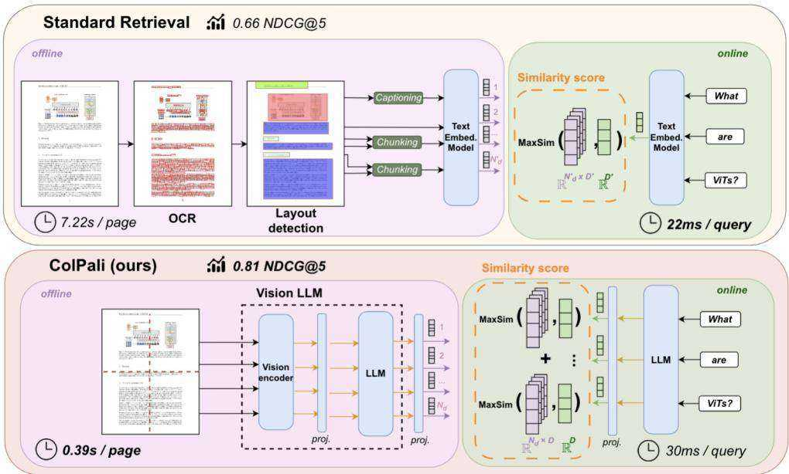
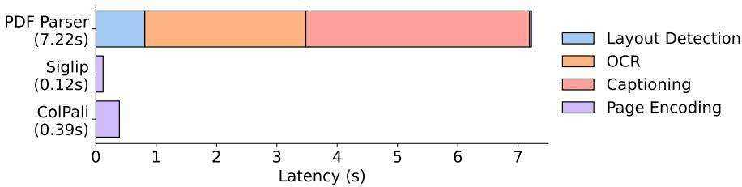
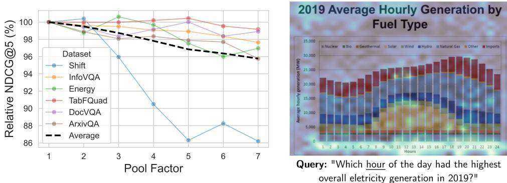

# ColPali: EFFICIENT DOCUMENT RETRIEVAL WITH VISION LANGUAGE MODELS

Manuel Faysse∗1,3 Hugues Sibille∗1,4 Tony $\mathbf { W _ { u } } ^ { * 1 }$ Bilel Omrani1   
Gautier Viaud1 Celine Hudelot´ 3 Pierre Colombo2,3   
1Illuin Technology 2Equall.ai 3CentraleSupelec, Paris-Saclay ´ 4ETH Zurich ¨   
manuel.faysse@centralesupelec.fr

# ABSTRACT

Documents are visually rich structures that convey information through text, but also figures, page layouts, tables, or even fonts. Since modern retrieval systems mainly rely on the textual information they extract from document pages to index documents -often through lengthy and brittle processes-, they struggle to exploit key visual cues efficiently. This limits their capabilities in many practical document retrieval applications such as Retrieval Augmented Generation (RAG). To benchmark current systems on visually rich document retrieval, we introduce the Visual Document Retrieval Benchmark ViDoRe, composed of various page-level retrieval tasks spanning multiple domains, languages, and practical settings. The inherent complexity and performance shortcomings of modern systems motivate a new concept; doing document retrieval by directly embedding the images of the document pages. We release ColPali, a Vision Language Model trained to produce high-quality multi-vector embeddings from images of document pages. Combined with a late interaction matching mechanism, ColPali largely outperforms modern document retrieval pipelines while being drastically simpler, faster and end-to-end trainable. We release models, data, code and benchmarks under open licenses at https://hf.co/vidore.

# 1 INTRODUCTION

Document Retrieval consists of matching a user query to relevant documents in a given corpus. It is central to many widespread industrial applications, either as a standalone ranking system (search engines) or as part of more complex information extraction or Retrieval Augmented Generation (RAG) pipelines.

Over recent years, pretrained language models have enabled large improvements in text embedding models. In practical industrial settings, however, the primary performance bottleneck for efficient document retrieval stems not from embedding model performance but from the prior data ingestion pipeline. Indexing a standard PDF document involves several steps. First, PDF parsers or Optical Character Recognition (OCR) systems are used to extract words from the pages. Document layout detection models can then be run to segment paragraphs, titles, and other page objects such as tables, figures, and headers. A chunking strategy is then defined to group text passages with some semantical coherence, and modern retrieval setups may even integrate a captioning step to describe visually rich elements in a natural language form, more suitable for embedding models. In our experiments (Table 2), we typically find that optimizing the ingestion pipeline yields much better performance on visually rich document retrieval than optimizing the text embedding model.

Contribution 1: ViDoRe. In this work, we argue that document retrieval systems should not be evaluated solely on the capabilities of text embedding models (Bajaj et al., 2016; Thakur et al., 2021; Muennighoff et al., 2022), but should also consider the context and visual elements of the documents to be retrieved. To this end, we create and openly release ViDoRe, a comprehensive benchmark to evaluate systems on page-level document retrieval with a wide coverage of domains, visual elements, and languages. ViDoRe addresses practical document retrieval scenarios, where queries often necessitate both textual and visual understanding for accurate document matching. We highlight the shortcomings of current text-centric systems in these settings.1

  
Figure 1: ColPali simplifies document retrieval w.r.t. standard retrieval methods while achieving stronger performances with better latencies. Latencies and results are detailed in section 5 and subsection B.4.

Contribution 2: ColPali. We propose a novel concept and model architecture based on Vision Language Models (VLMs) to efficiently index documents purely from their visual features, allowing for subsequent fast query matching with late interaction mechanisms (Khattab & Zaharia, 2020). Our method, ColPali, significantly outperforms all other retrieval systems on ViDoRe while being fast and end-to-end trainable. These results demonstrate the potential and the many benefits of this novel Retrieval in Vision Space concept, which could significantly alter the way document retrieval is approached in the industry moving forward. We release all resources at https://hf.co/vidore.

# 2 PROBLEM FORMULATION & RELATED WORK

Problem Setting. In our setting, a retrieval system scores how relevant a document $d$ from corpus $\mathcal { D }$ is with respect to a query $q$ . Computing the similarity score $s ( q , d ) \in \mathbb { R }$ for each of the $| \mathcal D |$ documents in the corpus creates a ranking we can use to extract the most relevant documents. In this work, we focus on page-level retrieval: given a query, is the correct document page retrieved by the system? For coherence with existing literature, we further use the term document to refer to individual pages, i.e. the atomic retrieved elements in our setting. As we focus on practical industrial retrieval applications (RAG, search engines) with potentially large corpora sizes, latency constraints are imposed on scoring systems. Most current retrieval systems can be decomposed into (1) an offline indexation phase in which a document index is built and (2) an online querying phase in which a query is matched to documents from the index and where low latency is vital to the user experience.

Under these industrial constraints, we identify three main properties an efficient document retrieval systems should exhibit: (R1) strong retrieval performance, as measured by standard retrieval metrics; $( R 2 )$ fast online querying, measured through average latencies; (R3) high throughput corpus indexation, ie. the number of pages that can be embedded in a given timeframe.

2.1 TEXTUAL RETRIEVAL METHODS

# Document Retrieval in Text Space.

Statistical methods based on word frequency like TF-IDF (Sparck Jones, 1972) and BM25 (Robertson et al., 1994) are still widely used due to their simplicity and efficiency. More recently, neural embedding models based on fine-tuned large language models display state-of-the-art performance on a variety of text embedding tasks and top the retrieval leaderboards (Muennighoff et al., 2022).

Neural Retrievers. In bi-encoder models (Reimers & Gurevych, 2019; Karpukhin et al., 2020; Wang et al., 2022), documents are independently mapped offline to a dense vector space. Queries are embedded online and matched to documents through a fast cosine distance computation. A slower, but slightly more performant alternative, cross-encoder systems (Wang et al., 2020; Cohere, 2024) concatenate query and document as a single input sequence and iteratively attribute matching scores to each possible combination. This enables full attention computation between query and document terms but comes at the cost of computational efficiency, as $| \mathcal D |$ encoding passes must be done online.

Multi-Vector retrieval via late interaction. In the late interaction paradigm introduced by ColBERT (Khattab & Zaharia, 2020), an embedding is pre-computed and indexed per document token. At runtime, similarity can be computed with individual query token embeddings. The idea is to benefit from the rich interaction between individual query and document terms while taking advantage of the offline computation and fast query matching enabled by bi-encoders. See section E for more details.

Retrieval Evaluation. Although benchmarks and leaderboards have been developed to evaluate text embedding models (Thakur et al., 2021; Muennighoff et al., 2022), much of the performance improvements in industrial use cases of embedding models stem from the prior data ingestion pipeline. While documents often rely on visual elements to more efficiently convey information to human readers, text-only systems barely tap into these visual cues. Other work has also independently studied table or chart retrieval systems through repurposed Question Answering datasets (Zhang et al., 2019; Nowak et al., 2024) but only assessing specialized methods for each task.

To our knowledge, no benchmark evaluates document retrieval systems in practical settings; in an end-to-end manner, across several document types and topics, and by evaluating the use of both textual and visual document features.

# 2.2 INTEGRATING VISUAL FEATURES

Contrastive Vision Language Models. Mapping latent representations of textual content to corresponding representations of visual content has been done by aligning disjoint visual and text encoders through contrastive losses (Radford et al., 2021; Zhai et al., 2023). While some OCR capabilities exist in these models, the visual component is often not optimized for text understanding.

The Fine-grained Interactive Language-Image Pre-training (Yao et al., 2021) framework extends the late interaction mechanism to cross-modal Vision Language Models, relying on max similarity operations between text tokens and image patches.

Visually Rich Document Understanding. To go beyond text, some document-focused models jointly encode text tokens alongside visual or document layout features (Appalaraju et al., 2021; Kim et al., 2021; Huang et al., 2022; Tang et al., 2022). Large Language transformer Models (LLMs) with strong reasoning capabilities have recently been combined with Vision Transformers (ViTs) (Dosovitskiy et al., 2020) to create VLMs (Alayrac et al., 2022; Liu et al., 2023; Bai et al., 2023; Laurenc¸on et al., 2024b) where image patch vectors from contrastively trained ViT models (Zhai et al., 2023) are fed as input embeddings to the LLM and concatenated with the text-token embeddings.

PaliGemma. The PaliGemma-3B model (Beyer et al., 2024) extends concepts from Pali3 (Chen et al., 2023), and projects SigLIP-So400m/14 (Alabdulmohsin et al., 2023) patch embeddings into Gemma-2B’s text vector space (Gemma Team et al., 2024). Along with its reasonable size w.r.t. other performant VLMs, an interesting property of PaliGemma’s text model is that it is fine-tuned with full-block attention on the prefix (instruction text and image tokens). See Appendix E for more details.

VLMs display enhanced capabilities in Visual Question Answering, captioning, and document understanding (Yue et al., 2023), but are not optimized for retrieval tasks.

# 3 THE ViDoRe BENCHMARK

Existing benchmarks for contrastive vision-language models primarily evaluate retrieval for natural images (Lin et al., 2014; Borchmann et al., 2021; Thapliyal et al., 2022). On the other hand, textual retrieval benchmarks (Muennighoff et al., 2022) are evaluated at at textual passage level and are not tailored for document retrieval tasks. We fill the gap with ViDoRe, a comprehensive benchmark for document retrieval using visual features.

# 3.1 BENCHMARK DESIGN

ViDoRe is designed to comprehensively evaluate retrieval systems on their capacity to match queries to relevant documents at the page level. This benchmark encompasses multiple orthogonal subtasks, with focuses on various modalities - text, figures, infographics, tables; thematic domains - medical, business, scientific, administrative; or languages - English, French. Tasks also span varying levels of complexity, in order to capture signals from both weaker and stronger systems. As many systems require large amounts of time to index pages (captioning-based approaches can take dozens of seconds per page for instance), we limit the number of candidate documents for each retrieval task in order to evaluate even complex systems in a reasonable timeframe without sacrificing quality. For trainable retrieval systems, we provide a reference training set that can be used to facilitate comparisons.

Table 1: ViDoRe comprehensively evaluates multimodal retrieval methods.   

<table><tr><td>Dataset</td><td>Language</td><td># Queries</td><td># Documents</td><td>Description</td></tr><tr><td colspan="5">Academic Tasks</td></tr><tr><td>DocVQA</td><td>English</td><td>500</td><td>500</td><td>Scanned documents from UCSF Industry</td></tr><tr><td>InfoVQA</td><td>English</td><td>500</td><td>500</td><td>Infographics scrapped from the web</td></tr><tr><td>TAT-DQA</td><td>English</td><td>1600</td><td>1600</td><td>High-quality financial reports</td></tr><tr><td>arXiVQA</td><td>English</td><td>500</td><td>500</td><td>Scientific Figures from arXiv</td></tr><tr><td>TabFQuAD</td><td>French</td><td>210</td><td>210</td><td>Tables scrapped from the web</td></tr><tr><td colspan="5">Practical Tasks</td></tr><tr><td>Energy</td><td>English</td><td>100</td><td>1000</td><td>Documents about energy</td></tr><tr><td>Government</td><td>English</td><td>100</td><td>1000</td><td>Administrative documents</td></tr><tr><td>Healthcare</td><td>English</td><td>100</td><td>1000</td><td>Medical documents</td></tr><tr><td>AI</td><td>English</td><td>100</td><td>1000</td><td>Scientific documents related to AI</td></tr><tr><td>Shift Project</td><td>French</td><td>100</td><td>1000</td><td>Environmental reports</td></tr></table>

Academic Tasks. We repurpose widely used visual question-answering benchmarks for retrieval tasks: for each page-question-answer triplet, we use the question as the query, and the associated page as the gold document (Table 1). These academic datasets either focus on single specific modalities (Mathew et al., 2020; 2021; Li et al., 2024) or target more varied visually rich documents (Zhu et al., 2022). Moreover, we consider TabFQuAD, a human-labeled dataset on tables extracted from French industrial PDF documents released with this work. Details can be found in subsection A.1.

Practical tasks. We construct topic-specific retrieval benchmarks spanning multiple domains to go beyond repurposed QA datasets and evaluate retrieval in more realistic industrial situations (e.g. RAG). To achieve this, we collect publicly accessible PDF documents and generate queries pertaining to document pages using Claude-3 Sonnet, a high-quality proprietary vision-language model (Anthropic, 2024). In total, we collect 1,000 document pages per topic, which we associate with 100 queries extensively filtered for quality and relevance by human annotators. The corpus topics are intentionally specific to maximize syntactic proximity between documents, creating more challenging retrieval tasks and covering an array of orthogonal domains (Table 1). 2

Evaluation Metrics. We evaluate performance on our benchmark (Requirement R1) using standard metrics from the retrieval literature (nDCG, Recall@K, MRR). We report $\mathrm { n D C G } @ 5$ values as the main performance metric in this work and release the complete sets of results along with the models3.

To validate compliance with practical industrial requirements (section 2), we also consider query latencies (R2) and indexing throughputs (R3).

# 3.2 ASSESSING CURRENT SYSTEMS

Unstructured. We evaluate retrieval systems representative of those found in standard industrial RAG pipelines. As is common practice, we rely on the Unstructured4 off-the-shelf tool in the highest resolution settings to construct high-quality text chunks from PDF documents. Unstructured orchestrates the document parsing pipeline, relying on deep learning vision models to detect titles and document layouts (Ge et al., 2021), OCR engines (Smith, 2007) to extract text in non-native PDFs, specialized methods or models to detect and reconstruct tables, and implements a chunking strategy (by-title) that leverages the detected document structure to preserve section boundaries when concatenating texts. As is common practice, in our simplest Unstructured configuration (text-only), only textual elements are kept and figures, images, and tables are considered noisy information and are filtered out.

Unstructured $\mathbf { \Sigma } + \mathbf { \Sigma } \mathbf { X }$ . While Unstructured is a strong baseline by itself, we further augment Unstructured’s output by integrating the visual elements. In $( + \ O C R )$ , tables, charts, and images are run through an OCR engine, processed by Unstructured, and chunked independently. In $\cdot +$ Captioning), we set up a fully-fledged captioning strategy (Zhao et al., 2023), in which we feed visual elements to a strong proprietary Vision Language Model (Claude-3 Sonnet (Anthropic, 2024)) to obtain highly detailed textual descriptions of the elements. Both strategies aim to integrate visual elements in the retrieval pipeline but incur significant latency and resource costs (subsection 5.2).

Embedding Model. To embed textual chunks, we evaluate Okapi BM25, the de facto standard sparse statistical retrieval method, and the dense encoder of BGE-M3 (Chen et al., 2024), a multilingual neural method with SOTA performance in its size category. Chunks are embedded and scored independently, and page-level scores are obtained by max-pooling over the page’s chunk scores.5

Contrastive VLMs. We also evaluate the strongest available vision-language embedding models; Jina CLIP (Koukounas et al., 2024), Nomic Embed Vision (Nomic, 2024), and SigLIP-So400m/14 (Alabdulmohsin et al., 2023).

Results. From a performance perspective, best results are obtained by combining the Unstructured parser with visual information, either from captioning strategies or by running OCR on the visual elements (Table 2). Little difference is seen between BM25 and BGE-M3 embeddings highlighting the visual information bottleneck. Contrastive VLMs lag behind. Beyond retrieval performance (R1), the indexing latencies (R2) reported in Figure 2 illustrate that PDF parsing pipelines can be very lengthy, especially when incorporating OCR or captioning strategies. Querying latencies at runtime (R3) are very good for all evaluated systems $\leq 2 2  { \mathrm { m s } }$ on a NVIDIA L4) due to fast query encoding and cosine similarity matching.

  
Figure 2: Offline document indexing with ColPali is much simpler and faster compared to standard retrieval methods. The PDF Parser results are obtained following the Unstructured settings with BGE-M3 detailed in subsection 3.2. All indexing speeds are averaged per-page latencies. More details in subsection B.4

# 4 LATE INTERACTION BASED VISION RETRIEVAL

# 4.1 ARCHITECTURE

Vision-Language Models. Encouraged by their strong document understanding capabilities, we propose adapting recent VLMs for retrieval. The key concept is to leverage the alignment between output embeddings of text and image tokens acquired during multi-modal fine-tuning. To this extent, we introduce ColPali, a Paligemma-3B extension that is capable of generating ColBERT-style multivector representations of text and images (Figure 1). PaliGemma-3B is a strong candidate due to its small size, the many released checkpoints fine-tuned for different image resolutions and tasks, and the promising performances on various document understanding benchmarks. We add a projection layer to map each of the language model’s output token embeddings (whether from text or image tokens) to a vector space of reduced dimension $D = 1 2 8$ as used in the ColBERT paper (Khattab & Zaharia, 2020) to keep lightweight bag-of-embedding representations.

Late Interaction. Given query $q$ and document $d$ , we denote as $\mathbf { E _ { q } } \in \mathbb { R } ^ { N _ { q } \times D }$ and $\mathbf { E _ { d } } \in \mathbb { R } ^ { N _ { d } \times D }$ their respective multi-vector representation in the common embedding space $\mathbb { R } ^ { D }$ , where $N _ { q }$ and $N _ { d }$ are respectively the number of vectors in the query and in the document page embeddings. The late interaction operator, $\operatorname { L I } \left( q , d \right)$ , is the sum over all query vectors $\mathbf { E _ { q } } ^ { ( j ) }$ , of its maximum dot product $\langle \cdot | \cdot \rangle$ with each of the $N _ { d }$ document embedding vectors $ { \mathbf { E } } _ {  { \mathbf { d } } ( 1 : N _ { d } ) }$ .

$$
\mathbf { L I } \left( q , d \right) = \sum _ { i \in [ | 1 , N _ { q } | ] } \operatorname* { m a x } _ { j \in \left[ | 1 , N _ { d } | \right] } \langle \mathbf { E _ { q } } ^ { ( i ) } | \mathbf { E _ { d } } ^ { ( j ) } \rangle
$$

Contrastive Loss. The Late Interaction operation is fully differentiable, enabling backpropagation. Let a batch $\{ q _ { k } , d _ { k } \} _ { k \in [ | 1 , b | ] }$ composed of $b$ query-page pairs, where for all $k \in [ | \bar { 1 , \ d b } | ]$ , the document page $d _ { k }$ is the document corresponding to query $q _ { k }$ . Following Khattab & Zaharia (2020), we define our in-batch contrastive loss $\mathcal { L }$ as the softmaxed cross-entropy of the positive scores $s _ { k } ^ { + } = \mathrm { L I } \left( q _ { k } , d _ { k } \right)$ w.r.t. to the maximal in-batch negative scores $s _ { k } ^ { - } = \operatorname* { m a x } _ { l , l \neq k } \quad \mathrm { L I } \left( q _ { k } , d _ { l } \right) ^ { 6 }$ :

$$
\mathcal { L } = - \frac { 1 } { b } \sum _ { k = 1 } ^ { b } \log \left[ \frac { \exp \left( s _ { k } ^ { + } \right) } { \exp \left( s _ { k } ^ { + } \right) + \exp \left( s _ { k } ^ { - } \right) } \right] = \frac { 1 } { b } \sum _ { k = 1 } ^ { b } \log \left( 1 + \exp \left( s _ { k } ^ { - } - s _ { k } ^ { + } \right) \right)
$$

# 4.2 MODEL TRAINING

Dataset. Our training dataset of 118,695 query-page pairs is comprised of train sets of openly available academic datasets $( 6 3 \% )$ and a synthetic dataset made up of pages from web-crawled PDF documents and augmented with VLM-generated (Claude-3 Sonnet) pseudo-questions $( 3 7 \% )$ . Dataset split details are given in subsection A.3. Our training set is fully English by design, enabling us to study zero-shot generalization to non-English languages7. We explicitly verify no multi-page PDF document is used both ViDoRe and in the train set to prevent evaluation contamination. A validation set is created with $2 \%$ of the samples to tune hyperparameters. We openly release the training dataset8 for reproducibility and to encourage further research.

Parameters. All models are trained for 1 epoch on the train set. Unless specified otherwise, we train models in bfloat16 format, use low-rank adapters (LoRA, Hu et al. (2021)) with $\alpha = 3 2$ and $r = 3 2$ on the transformer layers from the language model, as well as the final randomly initialized projection layer, and use a paged adamw 8bit optimizer. We train on an 8 GPU setup with data parallelism, a learning rate of $5 e - 5$ with linear decay with $2 . 5 \%$ warmup steps, and a batch size of 32.

Query Augmentation. As in Khattab & Zaharia (2020), we append 5 <unused0> tokens to the query tokens to serve as a soft, differentiable query expansion or re-weighting mechanism.

# 5 RESULTS

Table 2: Comprehensive evaluation of baseline models and our proposed method on ViDoRe. Results are presented using nDCG $\textcircled { \alpha } 5$ metrics, and illustrate the impact of different components. Text-only metrics are not computed for benchmarks with only visual elements.   

<table><tr><td></td><td>ArxivQDocQ</td><td></td><td>InfoQ</td><td>TabF</td><td>TATQ</td><td>Shift</td><td>AI</td><td>Energy</td><td>Gov.</td><td>Health.</td><td>Avg.</td></tr><tr><td>Unstructured text-only</td><td></td><td></td><td></td><td></td><td></td><td></td><td></td><td></td><td></td><td></td><td></td></tr><tr><td>- BM25</td><td></td><td>34.1</td><td></td><td></td><td>44.0</td><td>59.6</td><td>90.4</td><td>78.3</td><td>78.8</td><td>82.6</td><td></td></tr><tr><td>- BGE-M3</td><td></td><td>28.4↓5.7</td><td></td><td></td><td>36.1↓7.9</td><td>68.5†8.9</td><td>88.4↓2.0</td><td>76.8↓1.5</td><td>77.7↓1.1</td><td>84.6↑2.0</td><td>=</td></tr><tr><td>Unstructured +OCR</td><td></td><td></td><td></td><td></td><td></td><td></td><td></td><td></td><td></td><td></td><td></td></tr><tr><td>- BM25</td><td>31.6</td><td>36.8</td><td>62.9</td><td>46.5</td><td>62.7</td><td>64.3</td><td>92.8</td><td>85.9</td><td>83.9</td><td>87.2</td><td>65.5</td></tr><tr><td>- BGE-M3</td><td>31.4↓0.2</td><td>25.7↓11.1</td><td>60.1↓2.8</td><td></td><td>70.8↑24.3 50.5↓12.2</td><td>73.2†8.9</td><td>90.2↓2.6</td><td>83.6↓2.3</td><td>84.9↑1.0</td><td>91.1↑3.9</td><td>66.1↑0.6</td></tr><tr><td>Unstructured +Captioning</td><td></td><td></td><td></td><td></td><td></td><td></td><td></td><td></td><td></td><td></td><td></td></tr><tr><td>-BM25</td><td>40.1</td><td>38.4</td><td>70.0</td><td>35.4</td><td>61.5</td><td>60.9</td><td>88.0</td><td>84.7</td><td>82.7</td><td>89.2</td><td>65.1</td></tr><tr><td>- BGE-M3</td><td>35.7↓4.4</td><td>32.9↓5.4</td><td>71.9†1.9</td><td>69.1↑33.7</td><td>43.8↓17.7</td><td>73.1↑12.2</td><td>88.8↑0.8</td><td>83.3↓1.4</td><td>80.4↓2.3</td><td>91.3↑2.1</td><td>67.0†1.9</td></tr><tr><td>Contrastive VLMs</td><td></td><td></td><td></td><td></td><td></td><td></td><td></td><td></td><td></td><td></td><td></td></tr><tr><td>Jina-CLIP</td><td>25.4</td><td>11.9</td><td>35.5</td><td>20.2</td><td>3.3</td><td>3.8</td><td>15.2</td><td>19.7</td><td>21.4</td><td>20.8</td><td>17.7</td></tr><tr><td>Nomic-vision</td><td>17.1</td><td>10.7</td><td>30.1</td><td>16.3</td><td>2.7</td><td>1.1</td><td>12.9</td><td>10.9</td><td>11.4</td><td>15.7</td><td>12.9</td></tr><tr><td>SigLIP (vanilla)</td><td>43.2</td><td>30.3</td><td>64.1</td><td>58.1</td><td>26.2</td><td>18.7</td><td>62.5</td><td>65.7</td><td>66.1</td><td>79.1</td><td>51.4</td></tr><tr><td>Ours</td><td></td><td></td><td></td><td></td><td></td><td></td><td></td><td></td><td></td><td></td><td></td></tr><tr><td>SigLIP (Vanilla)</td><td>43.2</td><td>30.3</td><td>64.1</td><td>58.1</td><td>26.2</td><td>18.7</td><td>62.5</td><td>65.7</td><td>66.1</td><td>79.1</td><td>51.4</td></tr><tr><td>BiSigLIP (+fine-tuning)</td><td>58.5↑15.3</td><td>32.9↑2.6</td><td>70.5↑6.4</td><td>62.7↑4.6</td><td>30.5↑4.3</td><td>26.517.8</td><td>74.3†11.8</td><td>73.7†8.0</td><td>74.2 ↑8.1</td><td>82.313.2</td><td>58.6↑7.2</td></tr><tr><td>BiPali (+LLM)</td><td>56.5↓-2.0</td><td>30.0↓-2.9</td><td>67.4↓-3.1</td><td>76.9†14.2</td><td>33.412.9</td><td>43.717.2</td><td>71.2↓-3.1</td><td>61.9↓-11.7</td><td>73.8↓-0.4</td><td>73.6↓-8.8</td><td>58.810.2</td></tr><tr><td>ColPali (+Late Inter.)</td><td>79.1†22.6</td><td>54.4↑24.5</td><td>81.8↑14.4</td><td>83.9↑7.0</td><td>65.8132.4</td><td>73.2个29.5</td><td>96.2个25.0</td><td>91.0↑29.1</td><td>92.7↑18.9</td><td>94.420.8</td><td>81.3个22.5</td></tr></table>

# 5.1 PERFORMANCE (R1)

We show performance is achieved iteratively through the combination of three factors; (1) a carefully crafted task-specific dataset, (2) pairing a pretrained LLM to a vision model to better leverage text semantics from the image, and (3) using multi-vector embeddings rather than a single vector representation to better capture the vast amount of visual information present in a document.

Fine-tuning a Vision Model on a document retrieval oriented dataset: BiSigLIP. SigLIP9 is a strong vision-language bi-encoder producing single vector embeddings, and pretrained on billions of image-text pairs from the English split of WebLI (Chen et al., 2023). Further fine-tuning the textual component of this model on our document-oriented dataset (BiSigLIP) yields clear improvements across the board, particularly on figure retrieval (ArxivQA) and table retrieval tasks (TabFQuAD).

Feeding image patches to a LLM: BiPali. In the PaliGemma model architecture, SigLIP-generated patch embeddings are fed to a text language model and we can obtain LLM contextualized output patch embeddings.10 This technique aligns the image token representations with the text token embeddings in the LLM’s embeddings space, and augments the vision model embeddings with the language model’s text understanding capabilities. We average pool these representations to obtain a single dense vector, effectively creating a PaliGemma bi-encoder model (BiPali). After fine-tuning on the training dataset, we obtain a model that performs slightly worse in English than the tuned BiSigLIP variant.11 However, we see notable improvements in French tasks, indicating that BiPali’s LLM (Gemma 2B) helps multilingual text understanding. This is particularly notable as our training dataset does not contain non-English samples.

Leveraging Multi-Vector Embeddings through Late Interaction: ColPali. One benefit of inputting image patch embeddings through a language model is that they are natively mapped to a latent space similar to the textual input (query). This enables leveraging the ColBERT strategy to construct one embedding per image patch token, and at inference compute all interactions between text tokens and image patches, resulting in a step-change improvement in performance compared to BiPali. Results in Table 2 show that our ColPali model also largely outperforms the strong baselines based on Unstructured and captioning, as well as all evaluated text-image embedding models. The difference is particularly stark on the more visually complex benchmark tasks, such as InfographicVQA, ArxivQA, and TabFQuAD, respectively representing infographics, figures, and tables. However, text-centric documents are also better retrieved by the ColPali models across all evaluated domains and languages, making our approach the overall best-performing document-retrieval model.

Negative Results. For extensiveness, we also train ColSigLIP, a late interaction variant of the BiSigLIP model but obtain abysmal performances. We attribute this to the large gaps w.r.t. SigLIP’s pre-training, in which only a pooled latent representation is used in the contrastive loss, which does not optimize the representations of individual patch and token embeddings. Similarly, we train a $\mathrm { B i S i g L I P } _ { P a l i G e m m a }$ variant, in which we retrieve the image representations from the SigLIP model that has been further updated by PaliGemma fine-tuning, and use the text representations from PaliGemma’s text model. After fine-tuning on our dataset, performance is severely inferior to $\mathrm { S i g L I P } _ { V a n i l l a }$ which simply encodes with SigLIP’s original text and vision components. This indicates a logical misalignment between SigLIP embeddings, and Gemma embeddings after PaliGemma training. We detail these results in subsection C.1.

# 5.2 LATENCIES & MEMORY FOOTPRINT

Online Querying. (R2) Logically, querying latencies differ between ColPali and a BGE-M3 embedding model. For BGE, encoding takes about $2 2 ~ \mathrm { { m s } }$ for 15 tokens, while encoding a query with ColPali’s language model takes about $\mathrm { 3 0 ~ m s ^ { 1 2 } }$ . For smaller corpus sizes, computing the late interaction operation induces marginally small overheads $\approx 1$ ms per 1000 pages in the corpus), and the cosine similarity computation between bi-encoder vectors is even faster. Optimized late interaction engines (Santhanam et al., 2022; Lee et al., 2023) enable to easily scale corpus sizes to millions of documents with reduced latency degradations.

Offline Indexing. (R3) Standard retrieval methods using bi-encoders represent each chunk as a single vector embedding, which is easy to store and fast to compute. However, processing a PDF to get the different chunks is the most time-consuming part (layout detection, OCR, chunking), and using captioning to handle multimodal data will only exacerbate this already lengthy process. On the other hand, ColPali directly encodes pages from their image representation. Although the model is larger than standard retrieval encoders, skipping the preprocessing allows large speedups at indexing13 (Figure 2). As pages are embedded end-to-end in single forward pass, the VRAM usage depends exclusively on the sequence length (number of patches per image) which is fixed as well, enabling efficient batching strategies to fully leverage hardware acceleration. ColPali also benefits from most LLM efficiency improvements introduced in the ecosystem such as Flash Attention (Dao, 2023).

Storage Footprint. Our method requires storing a vector per image patch, along with 6 extra text tokens “Describe the image” concatenated to image patches. We project each PaliGemma vector to a lower dimensional space $D = 1 2 8 ,$ ) to maximize efficiency, leading to a memory footprint of 257.5 KB per page (subsection B.3). Importantly, the memory footprint of the naive ColBERT indexing strategy can be drastically improved through compression and clustering mechanisms (Santhanam et al., 2022; Clavie et al., 2024). ´

Token pooling. Token pooling (Clavie et al., 2024) is a CRUDE-compliant method (document ´ addition/deletion-friendly) that aims amountto reduce the amount of multi-vector embeddings. For ColPali, many image patches share redundant information, e.g. white background patches. By pooling these patches together, we can reduce the amount of embeddings while retaining most information. Retrieval performance with hierarchical mean token pooling on image embeddings is shown in Figure 3 (left). With a pool factor of 3, the total number of vectors is reduced by $6 6 . 7 \%$ while $9 7 . 8 \%$ of the original performance is maintained. We note that the Shift dataset—composed of the most text-dense documents—is a clear outlier, showcasing more information dense documents contain less redundant patches and may be prone to worse performance degradation with such pooling techniques.

  
Figure 3: (Left: Token Pooling) Relative performance degradation when reducing the number of stored embeddings per document. (Right: Interpretability) For each term in a user query, ColPali identifies the most relevant document image patches (highlighted zones) and computes a query-topage matching score.

# 5.3 INTERPRETABILITY

By superimposing the late interaction heatmap on top of the original image, we can visualize the most salient image patches with respect to each term of the query, yielding interpretable insights into model focus zones. As epitomized in Figure 3 (right), we observe ColPali exhibits strong OCR capabilities as both the words “hourly” and “hours” present a high similarity score with the query token < hour>. We also note particular focus on other non-trivial image features such as the $\mathbf { X }$ -axis representing hours being salient. Other visualization examples are shown in Appendix D.

# 6 ABLATION STUDY

We run various ablations to better understand the mechanisms at play. By default, result deltas reported below refer to $\mathrm { n D C G } @ 5$ values averaged over all ViDoRe tasks. Detailed results in C.2.

Tradeoffs between model size and the number of image patches. We train a variant of PaliGemma with half the number of image patches (512). While we observe a clear performance degradation with respects to to the 1024-patch ColPali model $( - 2 4 . 8 \mathrm { n D C G } @ 5 )$ , memory usage is much lower. As an alternative to PaliGemma, we train Idefics2-8B (Laurenc¸on et al., 2024b), a VLM with a similar architecture and based on a Mistral-7B (Jiang et al., 2023) language backbone and a SigLIP vision encoder paired with a perceiver resampler. The most notable differences with PaliGemma lie in the size of the language model (2B and 7B resp.) and the number of image patches (between 512 and 2048 for PaliGemma, and 64 post-resampling for Idefic $\Omega ^ { 1 4 }$ ). Our results suggest better language models enable more efficient representations of image embeddings - ColIdefics2 with 64 patches largely outperforms out ColPali with 512 patches $( + 2 0 . 1 \ \mathrm { n D C G } @ 5 )$ . However ColIdefics2 (64) remains less accurate than ColPali (1024) $( - 4 . 7 \mathrm { n D C G } @ 5 )$ while being about twice as slow in terms of training and inference latency. These results suggest there are tradeoffs between performance (R1), latencies during online querying (R2) and offline indexation phases (R3), and index memory size.

Unfreezing the vision component. We train a ColPali variant by also backpropagating through and updating the vision encoder and the projection layer. This leads to a slight performance degradation $( \bar { - } 0 . 7 \mathrm { n D C G } @ 5 )$ . These conclusions may change with larger scales of training data.

Impact of “query augmentation” tokens. In ColBERT, special tokens are concatenated to the input query to serve as soft query augmentation buffers. Training without these tokens, we observe no significant performance difference in the English benchmarks. However, performance on the French tasks seems to improve $( + 9 . 8 \mathrm { n D C G } @ \mathrm { G }$ on Shift, $+ 6 . 3 \mathrm { n D C G } @ 5 $ on TabFQuAD, Table 7).

Impact of the Pairwise CE loss. Training with an in-batch negative contrastive loss, instead of the pairwise CE loss that only considers the hardest negative sample, leads to a slight performance degradation $( - 1 . 6 \mathrm { n D C G } @ 5 )$ ) on the aggregated benchmark.

Adapting models to new tasks. Contrary to more complex multi-step retrieval pipelines, ColPali can be trained end-to-end, directly optimizing the downstream retrieval task which greatly facilitates fine-tuning to boost performance on specialized domains, multilingual retrieval, or specific visual elements the model struggles with. To demonstrate, we add 1552 samples representing French tables and associated queries to the training set. This represents the only French data in the training set, with all other examples being kept unchanged. We see clear $\mathrm { n D C G } @ 5$ improvements $\left( + 2 . 6 \right)$ and even starker Recall $@ 1$ gains $\left( + 5 \right)$ on the TabFQuAD benchmark, with no performance degradation on the rest of the benchmark tasks $( + 0 . 4 \mathrm { n D C G } @ 5 $ overall).

Better VLMs lead to better visual retrievers. As improved VLMs are released, it is interesting to observe if improved performances on generative tasks translate once these models are adapted for image retrieval tasks through ColPali training strategies. We train the recently released Qwen2-VL 2B (Wang et al., 2024b), a SOTA 2 billion parameter generative VLM, with the same data and training strategy, obtaining ColQwen2-VL. To approximately match ColPali’s memory requirements, we limit the number of image patches to 768, slightly less than ColPali’s 1024 patches. We observe clear performance improvements of $+ 5 . 3 \mathrm { n D C G } @ 5 $ values over ColPali showcasing clear performance correlations between generative benchmarks performance and retrieving metrics.

Out-of-domain generalization. Some of the datasets in the ViDoRe benchmark have train sets, which we have integrated within the ColPali train set (eg. academic tasks). This is standard in embedding models (Wang et al., 2024a; Lee et al., 2024), and while ColPali also exhibits strong performance on tasks in which this is not the case (French data is never seen by the model during training for instance), it remains interesting to evaluate model performance when training is done on a fully disjoint data distribution. We train a ColPali variant solely using the recent DocMatix dataset (Laurenc¸on et al., 2024a), a large scale, synthetically annotated visual document question answering dataset, which we subsample to obtain a comparably-sized train set. Results on ViDoRe show the performance drop is minor $( - 2 . 2 \mathrm { n D C G } @ 5 )$ ), still outperforming the closest baseline method by over 12 points. These results showcase ColPali generalizes well outside of its training distribution, and demonstrate that our results are not unreasonably boosted with respect to baselines (BGE-M3) that cannot be fine-tuned on the same data15

# 7 CONCLUSIONS

In this work, we introduced the Visual Document Retrieval Benchmark (ViDoRe), which evaluates document retrieval systems in realistic settings involving visually complex documents. We demonstrated that current retrieval pipelines and contrastive vision-language models struggle to efficiently exploit visual information embedded in documents, leading to suboptimal performance. To address this, we presented ColPali, a novel retrieval method that leverages Vision-Language Models to create high-quality, multi-vector embeddings purely from visual document features. ColPali largely outperforms the best existing document retrieval methods while enabling faster corpus indexing times and maintaining low querying latencies, thus circumventing many pain points of modern document retrieval applications. We hope to drive industrial adoption, and to encourage future work by publicly releasing the ViDoRe benchmark, the data, the codebase, and all models and baselines from our work.

Future Work. Beyond performance improvements that could be obtained through better data, backbone models or training strategies, our vision at term is to combine visual retrieval systems and visually grounded query answering to create end-to-end RAG systems that purely function from image features. This idea is supported by concurrent work (Ma et al., 2024) showcasing the strong promises of VLMs for visual QA, and may eventually become a new industrial standard for document processing. In this line of work, reliability is key, and confidence estimation techniques for Information Retrieval methods could become central to implement abstention mechanisms (Gisserot-Boukhlef et al., 2024), and are particularly interesting given the information rich multi-vector scoring mechanisms of late interaction systems. Expanding benchmarking efforts to cover more languages, modalities, and tasks is also a crucial future research direction (Jiang et al., 2024).

# REPRODUCIBILITY STATEMENT

For transparency, reproducibility and to foster future work, we release our training data, model checkpoints (adapters), entire codebase, and complete evaluation benchmark under MIT licenses as detailed in the main paper. We also host a public ViDoRe leaderboard16 to foster concurrent work in the space. The supplementary material further details training configurations for our models (also specified in HuggingFace model repositories), and dives into the process we used to generate synthetic data, how latency computations are performed, as well as provides further detailed evaluation results.

# ACKNOWLEDGEMENTS

This work is partially supported by Illuin Technology, and by a grant from ANRT France. This work was performed using HPC resources from the CINES ADASTRA through Grant 2024-AD011015443 and from IDRIS with grant 2024-AD011015724R1. We extend our warm thanks to Jonathan Dong, Caio Corro, Victor Pellegrain and Ender Konukoglu for their valuable feedback on the paper.

