# REFERENCES

Ibrahim Alabdulmohsin, Xiaohua Zhai, Alexander Kolesnikov, and Lucas Beyer. Getting ViT in Shape: Scaling Laws for Compute-Optimal Model Design. 2023. doi: 10.48550/ARXIV.2305. 13035. URL https://arxiv.org/abs/2305.13035. Publisher: arXiv Version Number: 5.

Jean-Baptiste Alayrac, Jeff Donahue, Pauline Luc, Antoine Miech, Iain Barr, Yana Hasson, Karel Lenc, Arthur Mensch, Katie Millican, Malcolm Reynolds, Roman Ring, Eliza Rutherford, Serkan Cabi, Tengda Han, Zhitao Gong, Sina Samangooei, Marianne Monteiro, Jacob Menick, Sebastian Borgeaud, Andrew Brock, Aida Nematzadeh, Sahand Sharifzadeh, Mikolaj Binkowski, Ricardo Barreira, Oriol Vinyals, Andrew Zisserman, and Karen Simonyan. Flamingo: a Visual Language Model for Few-Shot Learning. 2022. doi: 10.48550/ARXIV.2204.14198. URL https://arxiv. org/abs/2204.14198. Publisher: arXiv Version Number: 2.

Anthropic. The Claude 3 Model Family: Opus, Sonnet, Haiku, 2024. URL https://www-cdn.anthropic.com/de8ba9b01c9ab7cbabf5c33b80b7bbc618857627/ Model Card Claude 3.pdf.

Srikar Appalaraju, Bhavan Jasani, Bhargava Urala Kota, Yusheng Xie, and R. Manmatha. DocFormer: End-to-End Transformer for Document Understanding, 2021. URL https://arxiv.org/abs/ 2106.11539. Version Number: 2.

Jinze Bai, Shuai Bai, Shusheng Yang, Shijie Wang, Sinan Tan, Peng Wang, Junyang Lin, Chang Zhou, and Jingren Zhou. Qwen-VL: A Versatile Vision-Language Model for Understanding, Localization, Text Reading, and Beyond. 2023. doi: 10.48550/ARXIV.2308.12966. URL https://arxiv.org/abs/2308.12966. Publisher: arXiv Version Number: 3.

Payal Bajaj, Daniel Campos, Nick Craswell, Li Deng, Jianfeng Gao, Xiaodong Liu, Rangan Majumder, Andrew McNamara, Bhaskar Mitra, Tri Nguyen, Mir Rosenberg, Xia Song, Alina Stoica, Saurabh Tiwary, and Tong Wang. MS MARCO: A Human Generated MAchine Reading COmprehension Dataset, 2016. URL https://arxiv.org/abs/1611.09268. Version Number: 3.

Lucas Beyer, Andreas Steiner, Andre Susano Pinto, Alexander Kolesnikov, Xiao Wang, Daniel Salz, ´ Maxim Neumann, Ibrahim Alabdulmohsin, Michael Tschannen, Emanuele Bugliarello, Thomas Unterthiner, Daniel Keysers, Skanda Koppula, Fangyu Liu, Adam Grycner, Alexey Gritsenko, Neil Houlsby, Manoj Kumar, Keran Rong, Julian Eisenschlos, Rishabh Kabra, Matthias Bauer, Matko Bosnjak, Xi Chen, Matthias Minderer, Paul Voigtlaender, Ioana Bica, Ivana Balazevic, Joan ˇ Puigcerver, Pinelopi Papalampidi, Olivier Henaff, Xi Xiong, Radu Soricut, Jeremiah Harmsen, and Xiaohua Zhai. Paligemma: A versatile 3b vlm for transfer, 2024. URL https://arxiv.org/ abs/2407.07726.

Burton H. Bloom. Space/time trade-offs in hash coding with allowable errors. Commun. ACM, 13(7): 422–426, July 1970. ISSN 0001-0782. doi: 10.1145/362686.362692. URL https://doi.org/ 10.1145/362686.362692. Place: New York, NY, USA Publisher: Association for Computing Machinery.

Łukasz Borchmann, Michał Pietruszka, Tomasz Stanislawek, Dawid Jurkiewicz, Michał Turski, Karolina Szyndler, and Filip Gralinski. DUE: End-to-End Document Understanding Benchmark. ´ In Thirty-fifth Conference on Neural Information Processing Systems Datasets and Benchmarks Track (Round 2), 2021. URL https://openreview.net/forum?id=rNs2FvJGDK.

Jianlv Chen, Shitao Xiao, Peitian Zhang, Kun Luo, Defu Lian, and Zheng Liu. BGE M3-Embedding: Multi-Lingual, Multi-Functionality, Multi-Granularity Text Embeddings Through Self-Knowledge Distillation, 2024. URL https://arxiv.org/abs/2402.03216. Version Number: 3.

Xi Chen, Xiao Wang, Lucas Beyer, Alexander Kolesnikov, Jialin Wu, Paul Voigtlaender, Basil Mustafa, Sebastian Goodman, Ibrahim Alabdulmohsin, Piotr Padlewski, Daniel Salz, Xi Xiong, Daniel Vlasic, Filip Pavetic, Keran Rong, Tianli Yu, Daniel Keysers, Xiaohua Zhai, and Radu Soricut. PaLI-3 Vision Language Models: Smaller, Faster, Stronger, 2023. URL https://arxiv. org/abs/2310.09199. Version Number: 2.

Benjamin Clavie, Antoine Chaffin, and Griffin Adams. Reducing the Footprint of Multi-Vector ´ Retrieval with Minimal Performance Impact via Token Pooling, 2024. URL https://arxiv.org/ abs/2409.14683. Version Number: 1.

Cohere. Introducing Rerank 3: A New Foundation Model for Efficient Enterprise Search & Retrieval, April 2024. URL https://cohere.com/blog/rerank-3.

Tri Dao. Flashattention-2: Faster attention with better parallelism and work partitioning, 2023. URL https://arxiv.org/abs/2307.08691.

Timothee Darcet, Maxime Oquab, Julien Mairal, and Piotr Bojanowski. Vision Transformers Need ´ Registers. 2023. doi: 10.48550/ARXIV.2309.16588. URL https://arxiv.org/abs/2309. 16588. Publisher: [object Object] Version Number: 2.

Jacob Devlin, Ming-Wei Chang, Kenton Lee, and Kristina Toutanova. BERT: Pre-training of Deep Bidirectional Transformers for Language Understanding, 2018. URL https://arxiv.org/abs/ 1810.04805. Version Number: 2.

Alexey Dosovitskiy, Lucas Beyer, Alexander Kolesnikov, Dirk Weissenborn, Xiaohua Zhai, Thomas Unterthiner, Mostafa Dehghani, Matthias Minderer, Georg Heigold, Sylvain Gelly, Jakob Uszkoreit, and Neil Houlsby. An Image is Worth 16x16 Words: Transformers for Image Recognition at Scale. 2020. doi: 10.48550/ARXIV.2010.11929. URL https://arxiv.org/abs/2010.11929. Publisher: arXiv Version Number: 2.

Zheng Ge, Songtao Liu, Feng Wang, Zeming Li, and Jian Sun. YOLOX: Exceeding YOLO Series in 2021, 2021. URL https://arxiv.org/abs/2107.08430. Version Number: 2.

Gemma Team, Thomas Mesnard, Cassidy Hardin, Robert Dadashi, Surya Bhupatiraju, Shreya Pathak, Laurent Sifre, Morgane Riviere, Mihir Sanjay Kale, Juliette Love, Pouya Tafti, L \` eonard Hussenot, ´ Pier Giuseppe Sessa, Aakanksha Chowdhery, Adam Roberts, Aditya Barua, Alex Botev, Alex Castro-Ros, Ambrose Slone, Amelie H ´ eliou, Andrea Tacchetti, Anna Bulanova, Antonia Paterson, ´ Beth Tsai, Bobak Shahriari, Charline Le Lan, Christopher A. Choquette-Choo, Clement Crepy, ´ Daniel Cer, Daphne Ippolito, David Reid, Elena Buchatskaya, Eric Ni, Eric Noland, Geng Yan, George Tucker, George-Christian Muraru, Grigory Rozhdestvenskiy, Henryk Michalewski, Ian Tenney, Ivan Grishchenko, Jacob Austin, James Keeling, Jane Labanowski, Jean-Baptiste Lespiau, Jeff Stanway, Jenny Brennan, Jeremy Chen, Johan Ferret, Justin Chiu, Justin Mao-Jones, Katherine Lee, Kathy Yu, Katie Millican, Lars Lowe Sjoesund, Lisa Lee, Lucas Dixon, Machel Reid, Maciej Mikuła, Mateo Wirth, Michael Sharman, Nikolai Chinaev, Nithum Thain, Olivier Bachem, Oscar Chang, Oscar Wahltinez, Paige Bailey, Paul Michel, Petko Yotov, Rahma Chaabouni, Ramona Comanescu, Reena Jana, Rohan Anil, Ross McIlroy, Ruibo Liu, Ryan Mullins, Samuel L Smith, Sebastian Borgeaud, Sertan Girgin, Sholto Douglas, Shree Pandya, Siamak Shakeri, Soham De, Ted Klimenko, Tom Hennigan, Vlad Feinberg, Wojciech Stokowiec, Yu-hui Chen, Zafarali Ahmed,

Zhitao Gong, Tris Warkentin, Ludovic Peran, Minh Giang, Clement Farabet, Oriol Vinyals, Jeff ´ Dean, Koray Kavukcuoglu, Demis Hassabis, Zoubin Ghahramani, Douglas Eck, Joelle Barral, Fernando Pereira, Eli Collins, Armand Joulin, Noah Fiedel, Evan Senter, Alek Andreev, and Kathleen Kenealy. Gemma: Open Models Based on Gemini Research and Technology, 2024. URL https://arxiv.org/abs/2403.08295. Version Number: 4.

Hippolyte Gisserot-Boukhlef, Manuel Faysse, Emmanuel Malherbe, Celine Hudelot, and Pierre ´ Colombo. Towards trustworthy reranking: A simple yet effective abstention mechanism, 2024. URL https://arxiv.org/abs/2402.12997.

Edward J. Hu, Yelong Shen, Phillip Wallis, Zeyuan Allen-Zhu, Yuanzhi Li, Shean Wang, Lu Wang, and Weizhu Chen. LoRA: Low-Rank Adaptation of Large Language Models. 2021. doi: 10.48550/ ARXIV.2106.09685. URL https://arxiv.org/abs/2106.09685. Publisher: arXiv Version Number: 2.

Yupan Huang, Tengchao Lv, Lei Cui, Yutong Lu, and Furu Wei. LayoutLMv3: Pre-training for Document AI with Unified Text and Image Masking. 2022. doi: 10.48550/ARXIV.2204.08387. URL https://arxiv.org/abs/2204.08387. Publisher: arXiv Version Number: 3.

Albert Q. Jiang, Alexandre Sablayrolles, Arthur Mensch, Chris Bamford, Devendra Singh Chaplot, Diego de las Casas, Florian Bressand, Gianna Lengyel, Guillaume Lample, Lucile Saulnier, Lelio Renard Lavaud, Marie-Anne Lachaux, Pierre Stock, Teven Le Scao, Thibaut Lavril, Thomas ´ Wang, Timothee Lacroix, and William El Sayed. Mistral 7B. 2023. doi: 10.48550/ARXIV.2310. ´ 06825. URL https://arxiv.org/abs/2310.06825. Publisher: arXiv Version Number: 1.

Ziyan Jiang, Rui Meng, Xinyi Yang, Semih Yavuz, Yingbo Zhou, and Wenhu Chen. Vlm2vec: Training vision-language models for massive multimodal embedding tasks, 2024. URL https: //arxiv.org/abs/2410.05160.

Vladimir Karpukhin, Barlas Oguz, Sewon Min, Patrick Lewis, Ledell Wu, Sergey Edunov, Danqi ˘ Chen, and Wen-tau Yih. Dense Passage Retrieval for Open-Domain Question Answering, 2020. URL https://arxiv.org/abs/2004.04906. Version Number: 3.

Omar Khattab and Matei Zaharia. ColBERT: Efficient and Effective Passage Search via Contextualized Late Interaction over BERT. 2020. doi: 10.48550/ARXIV.2004.12832. URL https://arxiv.org/abs/2004.12832.

Geewook Kim, Teakgyu Hong, Moonbin Yim, Jeongyeon Nam, Jinyoung Park, Jinyeong Yim, Wonseok Hwang, Sangdoo Yun, Dongyoon Han, and Seunghyun Park. OCR-free Document Understanding Transformer, 2021. URL https://arxiv.org/abs/2111.15664. Version Number: 5.

Andreas Koukounas, Georgios Mastrapas, Michael Gunther, Bo Wang, Scott Martens, Isabelle Mohr, ¨ Saba Sturua, Mohammad Kalim Akram, Joan Fontanals Mart´ınez, Saahil Ognawala, Susana Guzman, Maximilian Werk, Nan Wang, and Han Xiao. Jina CLIP: Your CLIP Model Is Also Your Text Retriever, 2024. URL https://arxiv.org/abs/2405.20204. Version Number: 1.

Hugo Laurenc¸on, Andres Marafioti, Victor Sanh, and L ´ eo Tronchon. Building and better understand- ´ ing vision-language models: insights and future directions., 2024a.

Hugo Laurenc¸on, Leo Tronchon, Matthieu Cord, and Victor Sanh. What matters when building vision- ´ language models?, May 2024b. URL http://arxiv.org/abs/2405.02246. arXiv:2405.02246 [cs].

Chankyu Lee, Rajarshi Roy, Mengyao Xu, Jonathan Raiman, Mohammad Shoeybi, Bryan Catanzaro, and Wei Ping. Nv-embed: Improved techniques for training llms as generalist embedding models, 2024. URL https://arxiv.org/abs/2405.17428.

Jinhyuk Lee, Zhuyun Dai, Sai Meher Karthik Duddu, Tao Lei, Iftekhar Naim, Ming-Wei Chang, and Vincent Y. Zhao. Rethinking the Role of Token Retrieval in Multi-Vector Retrieval, 2023. URL https://arxiv.org/abs/2304.01982. Version Number: 3.

Lei Li, Yuqi Wang, Runxin Xu, Peiyi Wang, Xiachong Feng, Lingpeng Kong, and Qi Liu. Multimodal arxiv: A dataset for improving scientific comprehension of large vision-language models, 2024.

Tsung-Yi Lin, Michael Maire, Serge Belongie, Lubomir Bourdev, Ross Girshick, James Hays, Pietro Perona, Deva Ramanan, C. Lawrence Zitnick, and Piotr Dollar. Microsoft COCO: Common ´ Objects in Context, 2014. URL https://arxiv.org/abs/1405.0312. Version Number: 3.

Haotian Liu, Chunyuan Li, Qingyang Wu, and Yong Jae Lee. Visual Instruction Tuning. 2023. doi: 10.48550/ARXIV.2304.08485. URL https://arxiv.org/abs/2304.08485. Publisher: arXiv Version Number: 1.

Lucas Beyer\*, Andreas Steiner\*, Andre Susano Pinto\*, Alexander Kolesnikov\*, Xiao Wang\*, ´ Xiaohua Zhai\*, Daniel Salz, Maxim Neumann, Ibrahim Alabdulmohsin, Michael Tschannen, Jeremiah Harmsen, Daniel Keysers, Neil Houlsby, Xi Chen, Emanuele Bugliarello, Thomas Unterthiner, Keran Rong, Matthias Minderer, Ioana Bica, Ivana Balazevic, Joan Puigcerver, Julian Eisenschlos, Manoj Kumar, Matko Bosnjak, Matthias Bauer, Fangyu Liu, Adam Grycner, Alexey ˇ Gritsenko, Paul Voigtlaender, Pinelopi Papalampidi, Olivier Henaff, Skanda Koppula, Xi Xiong, Radu Soricut, Model release contributors and general support, Tris Warkentin, Kat Black, Luiz Gustavo Martins, Glenn Cameron, Raj Gundluru, Manvinder Singh, Meg Risdal, Nilay Chauhan, Nate Keating, Nesh Devanathan, Elisa Bandy, Joe Fernandez, Antonia Paterson, Jenny Brennan, Tom Eccles, Pankil Botadra, Ben Bariach, Lav Rai, Minwoo Park, Dustin Luong, Daniel Vlasic, Bo Wu, Wenming Ye, Divyashree Sreepathihalli, Kiranbir Sodhia, Alek Andreev, Armand Joulin, Surya Bhupatiraju, Minh Giang, Joelle Barral, and Zoubin Ghahramani. PaliGemma, 2024. URL https://www.kaggle.com/m/23393.

Yubo Ma, Yuhang Zang, Liangyu Chen, Meiqi Chen, Yizhu Jiao, Xinze Li, Xinyuan Lu, Ziyu Liu, Yan Ma, Xiaoyi Dong, Pan Zhang, Liangming Pan, Yu-Gang Jiang, Jiaqi Wang, Yixin Cao, and Aixin Sun. Mmlongbench-doc: Benchmarking long-context document understanding with visualizations, 2024. URL https://arxiv.org/abs/2407.01523.

Minesh Mathew, Dimosthenis Karatzas, and C. V. Jawahar. DocVQA: A Dataset for VQA on Document Images. 2020. doi: 10.48550/ARXIV.2007.00398. URL https://arxiv.org/abs/ 2007.00398.

Minesh Mathew, Viraj Bagal, Ruben P \` erez Tito, Dimosthenis Karatzas, Ernest Valveny, and C. V ´ Jawahar. InfographicVQA, 2021. URL https://arxiv.org/abs/2104.12756. Version Number: 2.

Niklas Muennighoff, Nouamane Tazi, Lo¨ıc Magne, and Nils Reimers. MTEB: Massive Text Embedding Benchmark, 2022. URL https://arxiv.org/abs/2210.07316. Version Number: 3.

Nomic. Nomic Embed Vision: Expanding The Nomic Latent Space, June 2024. URL https: //blog.nomic.ai/posts/nomic-embed-vision.

Averi Nowak, Francesco Piccinno, and Yasemin Altun. Multimodal chart retrieval: A comparison of text, table and image based approaches. In Kevin Duh, Helena Gomez, and Steven Bethard (eds.), Proceedings of the 2024 Conference of the North American Chapter of the Association for Computational Linguistics: Human Language Technologies (Volume 1: Long Papers), pp. 5488–5505, Mexico City, Mexico, June 2024. Association for Computational Linguistics. doi: 10.18653/v1/2024.naacl-long.307. URL https://aclanthology.org/2024.naacl-long.307.

Alec Radford, Jong Wook Kim, Chris Hallacy, Aditya Ramesh, Gabriel Goh, Sandhini Agarwal, Girish Sastry, Amanda Askell, Pamela Mishkin, Jack Clark, Gretchen Krueger, and Ilya Sutskever. Learning Transferable Visual Models From Natural Language Supervision. 2021. doi: 10.48550/ ARXIV.2103.00020. URL https://arxiv.org/abs/2103.00020. Publisher: arXiv Version Number: 1.

Nils Reimers and Iryna Gurevych. Sentence-BERT: Sentence Embeddings using Siamese BERT-Networks, 2019. URL https://arxiv.org/abs/1908.10084. Version Number: 1.

Stephen E. Robertson, Steve Walker, Susan Jones, Micheline Hancock-Beaulieu, and Mike Gatford. Okapi at TREC-3. In Donna K. Harman (ed.), Proceedings of The Third Text REtrieval Conference, TREC 1994, Gaithersburg, Maryland, USA, November 2-4, 1994, volume 500-225 of NIST Special Publication, pp. 109–126. National Institute of Standards and Technology (NIST), 1994. URL http://trec.nist.gov/pubs/trec3/papers/city.ps.gz.

Keshav Santhanam, Omar Khattab, Christopher Potts, and Matei Zaharia. PLAID: An Efficient Engine for Late Interaction Retrieval, 2022. URL https://arxiv.org/abs/2205.09707. Version Number: 1.

R. Smith. An Overview of the Tesseract OCR Engine. In Ninth International Conference on Document Analysis and Recognition (ICDAR 2007) Vol 2, pp. 629–633, Curitiba, Parana, Brazil, September 2007. IEEE. ISBN 978-0-7695-2822-9. doi: 10.1109/ICDAR.2007.4376991. URL http://ieeexplore.ieee.org/document/4376991/. ISSN: 1520-5363.

Karen Sparck Jones. A STATISTICAL INTERPRETATION OF TERM SPECIFICITY AND ITS APPLICATION IN RETRIEVAL. Journal of Documentation, 28(1):11–21, January 1972. ISSN 0022-0418. doi: 10.1108/eb026526. URL https://www.emerald.com/insight/content/doi/ 10.1108/eb026526/full/html.

Zineng Tang, Ziyi Yang, Guoxin Wang, Yuwei Fang, Yang Liu, Chenguang Zhu, Michael Zeng, Cha Zhang, and Mohit Bansal. Unifying Vision, Text, and Layout for Universal Document Processing, 2022. URL https://arxiv.org/abs/2212.02623. Version Number: 3.

Nandan Thakur, Nils Reimers, Andreas Ruckl ¨ e, Abhishek Srivastava, and Iryna Gurevych. BEIR: A ´ Heterogenous Benchmark for Zero-shot Evaluation of Information Retrieval Models, 2021. URL https://arxiv.org/abs/2104.08663. Version Number: 4.

Ashish V. Thapliyal, Jordi Pont-Tuset, Xi Chen, and Radu Soricut. Crossmodal-3600: A Massively Multilingual Multimodal Evaluation Dataset, 2022. URL https://arxiv.org/abs/2205.12522. Version Number: 2.

Liang Wang, Nan Yang, Xiaolong Huang, Binxing Jiao, Linjun Yang, Daxin Jiang, Rangan Majumder, and Furu Wei. Text Embeddings by Weakly-Supervised Contrastive Pre-training, 2022. URL https://arxiv.org/abs/2212.03533. Version Number: 2.

Liang Wang, Nan Yang, Xiaolong Huang, Linjun Yang, Rangan Majumder, and Furu Wei. Improving text embeddings with large language models, 2024a. URL https://arxiv.org/abs/2401. 00368.

Peng Wang, Shuai Bai, Sinan Tan, Shijie Wang, Zhihao Fan, Jinze Bai, Keqin Chen, Xuejing Liu, Jialin Wang, Wenbin Ge, Yang Fan, Kai Dang, Mengfei Du, Xuancheng Ren, Rui Men, Dayiheng Liu, Chang Zhou, Jingren Zhou, and Junyang Lin. Qwen2-vl: Enhancing vision-language model’s perception of the world at any resolution, 2024b. URL https://arxiv.org/abs/2409.12191.

Wenhui Wang, Furu Wei, Li Dong, Hangbo Bao, Nan Yang, and Ming Zhou. MiniLM: Deep Self-Attention Distillation for Task-Agnostic Compression of Pre-Trained Transformers, April 2020. URL http://arxiv.org/abs/2002.10957. arXiv:2002.10957 [cs].

Lewei Yao, Runhui Huang, Lu Hou, Guansong Lu, Minzhe Niu, Hang Xu, Xiaodan Liang, Zhenguo Li, Xin Jiang, and Chunjing Xu. FILIP: Fine-grained Interactive Language-Image Pre-Training, 2021. URL https://arxiv.org/abs/2111.07783. Version Number: 1.

Xiang Yue, Yuansheng Ni, Kai Zhang, Tianyu Zheng, Ruoqi Liu, Ge Zhang, Samuel Stevens, Dongfu Jiang, Weiming Ren, Yuxuan Sun, Cong Wei, Botao Yu, Ruibin Yuan, Renliang Sun, Ming Yin, Boyuan Zheng, Zhenzhu Yang, Yibo Liu, Wenhao Huang, Huan Sun, Yu Su, and Wenhu Chen. MMMU: A Massive Multi-discipline Multimodal Understanding and Reasoning Benchmark for Expert AGI, 2023. URL https://arxiv.org/abs/2311.16502. Version Number: 3.

Xiaohua Zhai, Basil Mustafa, Alexander Kolesnikov, and Lucas Beyer. Sigmoid Loss for Language Image Pre-Training. 2023. doi: 10.48550/ARXIV.2303.15343. URL https://arxiv.org/abs/ 2303.15343. Publisher: [object Object] Version Number: 4.

Li Zhang, Shuo Zhang, and Krisztian Balog. Table2vec: Neural word and entity embeddings for table population and retrieval. In Proceedings of the 42nd International ACM SIGIR Conference on Research and Development in Information Retrieval, SIGIR ’19. ACM, July 2019. doi: 10.1145/3331184.3331333. URL http://dx.doi.org/10.1145/3331184.3331333.

Ruochen Zhao, Hailin Chen, Weishi Wang, Fangkai Jiao, Xuan Long Do, Chengwei Qin, Bosheng Ding, Xiaobao Guo, Minzhi Li, Xingxuan Li, and Shafiq Joty. Retrieving Multimodal Information for Augmented Generation: A Survey, 2023. URL https://arxiv.org/abs/2303.10868. Version Number: 3.

Fengbin Zhu, Wenqiang Lei, Fuli Feng, Chao Wang, Haozhou Zhang, and Tat-Seng Chua. Towards Complex Document Understanding By Discrete Reasoning. 2022. doi: 10.48550/ARXIV.2207. 11871. URL https://arxiv.org/abs/2207.11871. Publisher: arXiv Version Number: 3.

# A BENCHMARK DATASETS

A.1 ACADEMIC DATASETS

DocVQA (Mathew et al., 2020) includes collected images from the UCSF Industry Documents Library. Questions and answers were manually annotated.

InfoVQA (Mathew et al., 2021) includes infographics collected from the Internet using the search query “infographics”. Questions and answers were manually annotated.

TAT-DQA (Zhu et al., 2022) is a large-scale Document VQA dataset that was constructed from publicly available real-world financial reports. It focuses on rich tabular and textual content requiring numerical reasoning. Questions and answers were manually annotated by human experts in finance.

arXivQA (Li et al., 2024) is a VQA dataset based on figures extracted from arXiv publications. The questions were generated synthetically using GPT-4 Vision.

TabFQuAD (Table French Question Answering Dataset) is designed to evaluate TableQA models in realistic industry settings. We create additional queries to augment the existing human-annotated ones using the same method described in subsection A.2.

# A.2 PRACTICAL DATASETS

Methodology. Creating a relevant retrieval dataset close to real use cases is a major challenge as the dataset needs to be both sufficiently large for effective fine-tuning and sufficiently diverse to cover a broad range of modalities (full text, tables, charts, ...), domains (industry, healthcare, ...), and query-document interactions (extractive questions, open-ended questions, ...). Our approach to building this dataset involves several steps: (1) we use a web crawler to collect publicly available documents on various themes and sources, (2) we convert these PDFs into a series of images, one per page, and (3) we generate queries related to each image using a VLM.

Web-Crawler. We implemented a web crawler to efficiently collect large volumes of documents related to a given topic. The crawler is seeded with a user-defined query (e.g. “artificial intelligence”) and then uses GPT-3.5 Turbo to brainstorm related topics and subtopics. This query augmentation strategy aims at both broadening and deepening the search. GPT-3.5 Turbo is further used to generate diverse search queries from each subtopic. This query set is then consumed by a pool of parallel workers whose job is to fetch the associated most relevant documents. We use SerpAPI17 along with a filetype filter (PDF documents only) to programmatically scrape Google Search rankings. Each file is hashed and stored in a Bloom filter (Bloom, 1970) shared among workers to avoid duplicate documents in the final corpus. Unique scraped files are downloaded, and inserted into a SQLite database along with additional metadata.

Datamix. Using the web crawler, we collected approximately 100 documents for each of the following four seeds: “energy”, “government reports”, “healthcare industry”, and “artificial intelligence” These seeds were meticulously hand-picked to align with real-use cases for retrieval models and visually rich pages. We also removed all documents containing any private information.

Query Generation. To increase the efficiency of our query generation scheme and to limit API calls, we generate at most 3 questions per image. From all the documents collected, we randomly sample 10,000 images per theme and call Claude-3 Sonnet with the following prompt:

You are an assistant specialized in Multimodal RAG tasks.

The task is the following: given an image from a pdf page, you will have to generate questions that can be asked by a user to retrieve information from a large documentary corpus.

The question should be relevant to the page, and should not be too specific or too general. The question should be about the subject of the page, and the answer needs to be found in the page.

Remember that the question is asked by a user to get some information from a large documentary corpus that contains multimodal data. Generate a question that could be asked by a user without knowing the existence and the content of the corpus.

Generate as well the answer to the question, which should be found in the page. And the format of the answer should be a list of words answering the question.

Generate at most THREE pairs of questions and answers per page in a dictionary with the following format, answer ONLY this dictionary NOTHING ELSE:

{ "questions": [ { "question": "XXXXXX", "answer": ["YYYYYY"] }, { "question": "XXXXXX", "answer": ["YYYYYY"] }, { "question": "XXXXXX", "answer": ["YYYYYY"] }, ]   
}   
where XXXXXX is the question and ['YYYYYY'] is the corresponding list of answers   
that could be as long as needed. Note: If there are no questions to ask about the page, return an empty list. Focus on making relevant questions concerning the page.   
Here is the page:

Human Validation. We manually validate every single synthetically created query in ViDoRe to ensure quality, query relevance, and consistency with the benchmark objective of evaluating retrieval in practical industrial settings. During this step, we randomly assign document-pair queries to 4 volunteer annotators and instruct them to filter out queries that do not fit the above-listed criteria. We also instruct annotators to flag any documents they deem to contain PII information or content not suited for an academic benchmark. No flag was raised during the entirety of the process, validating our prior PDF collection strategy. 100 queries per topic are collected in this manner. Annotators are colleagues and collaborators of the authors who volunteered to help. Each annotator spent approximately 3 hours filtering the larger query set down to 100 high-quality queries per topic.

# A.3 TRAINING DATASET

The statistics of the train set are given in the following table. The creation of the train set follows the same methodology as in subsection A.2. We made sure that a PDF document cannot have pages in both the training set and the test set to prevent data leakage and that there are no duplicate documents in each split.

Table 3: Details on the different splits in the dataset used to train ColPali.   

<table><tr><td>Dataset Split</td><td>Split Size</td><td>Language</td><td>Domain</td></tr><tr><td>DocVQA</td><td>39,463</td><td>English</td><td>Scanned documents from UCSF Industry</td></tr><tr><td>InfoVQA</td><td>10,074</td><td>English</td><td>Infographics scrapped from the web</td></tr><tr><td>TATDQA</td><td>13,251</td><td>English</td><td>High-quality financial reports</td></tr><tr><td>arXivQA</td><td>10,000</td><td>English</td><td>Scientific Scientific Figures from arXiv</td></tr><tr><td>Scrapped PDFs</td><td>45,940</td><td>English</td><td>Varied PDFs from 3885 distinctURL domains</td></tr><tr><td>TOTAL</td><td>118,695</td><td>English-only</td><td>Mixed</td></tr></table>

# B IMPLEMENTATION DETAILS

# B.1 CODEBASE

The codebase is written in PyTorch18 and leverages HuggingFace tooling for model implementations and trainers19.

# B.2 HYPERPARAMETERS

Hyperparameters are tuned on a validation split composed of $2 \%$ of the training dataset. We find bi-encoder methods to be more sensible to learning rate variations than late interaction-based models and achieve the best performance for all models with a learning rate of $5 e - 5$ . We experiment with LoRA rank and $\alpha$ values and do not notice particular improvements past $r = \alpha = 3 2$ . Per-device batch sizes are kept small due to long sequence lengths that complicate scaling past $b = 4$ . We simulate larger batch sizes with multi-GPU training and train with a total batch size $b = 3 2$ with no accumulation, for 1 epoch on our training set.

# B.3 EMBEDDING SIZE

Minimizing storage footprint can be essential to industrial retrieval systems if databases contain millions of documents. With this criterion in view, we have compared the embedding sizes of the models in our study. As shown in Table 4, ColPali’s embedding size is an order of magnitude larger than BM25 and two orders of magnitude larger than BGE-M3. However, in practical scenarios, pooling multi-vector embeddings by centroid cluster, or quantizing embeddings to binary representations 20 can reduce storage costs by two orders of magnitude (Santhanam et al., 2022) with minimal performance hits, and make storage costs competitive with other systems.

<table><tr><td>Model</td><td>Embedding size (KB)</td></tr><tr><td>BGE-M3</td><td>8.60</td></tr><tr><td>BM25 (dense emb.)</td><td>3.00</td></tr><tr><td>BM25 (sparse emb.)</td><td>1.56 ± 0.51</td></tr><tr><td>ColPali (float16)</td><td>257.5</td></tr></table>

Table 4: Comparison of the embedding sizes for the DocVQA test set from ViDoRe w.r.t. different retrieval models. The mean $\pm$ std size is given for the sparse embeddings. In general multiple vectors (2-5) per page are used for BGE-M3 and BM25.

# B.4 LATENCY COMPUTATIONS

To ensure comparison fairness, the latencies of the different retrieval systems shown in Figure 2 are measured on the same g2-standard-8 GCP VM with a NVIDIA L4 GPU. Document pages are embedded using the highest settings of Unstructured with captioning (see subsection 3.2). SigLIP and ColPali are both loaded with bfloat16 parameter dtypes. The reported times in Table 5 are the average per-page latencies for each indexing operation on 1000 randomly chosen documents across all splits of the ViDoRe benchmark test set. A batch size of 8 was used for the BGE-M3 model used with Unstructured, and a batch size of 4 was used for SigLIP and ColPali.

<table><tr><td rowspan="2">Indexing operation</td><td colspan="3">Latency (s)</td></tr><tr><td>Unstructured</td><td>SigLIP</td><td>ColPali</td></tr><tr><td>Layout detection</td><td>0.81</td><td>NA</td><td>NA</td></tr><tr><td>OCR</td><td>2.67</td><td>NA</td><td>NA</td></tr><tr><td>Captioning</td><td>3.71</td><td>NA</td><td>NA</td></tr><tr><td>Page encoding</td><td>0.03</td><td>0.12</td><td>0.39</td></tr><tr><td>Total</td><td>7.22</td><td>0.12</td><td>0.39</td></tr></table>

Table 5: Page-level latencies for document indexing using various retrieval systems. SigLIP and ColPali are much faster than Unstructured because they don’t require the layout detection, OCR, and captioning operations.

# B.5 CAPTIONING

Examples of captions generated for visually rich document chunks with Claude-3 Sonnet are shown in Figure 5 and Figure 4. The prompt used for generating the description is the following:

You are an assistant specialized in document analysis. Given a table or a figure, you have to provide a detailed summary of the content in maximum 3000 characters. Your summary should be qualitative and not quantitative. Here is the table/figure to analyze: {image}. Answer ONLY with the caption of the table/figure.

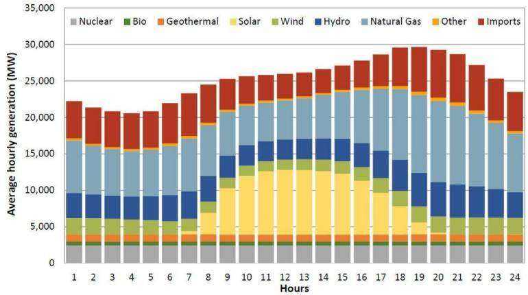

Figure 4: Example from the “Energy” test set.   
Caption: The image depicts the hourly energy generation profile, illustrating the contributions of various energy sources over 24 hours. The data is presented as a stacked bar chart, with the $x$ -axis representing the hours of the day from 1 to 2, and the y-axis showing the average hourly generation in MW. The bars are segmented into different colors, each representing a distinct energy source: nuclear, bio, geothermal, solar, wind, hydro, natural gas, and other imports. The chart provides insights into the temporal variations in energy generation across different sources, highlighting the interplay between baseload and intermittent sources throughout the day.

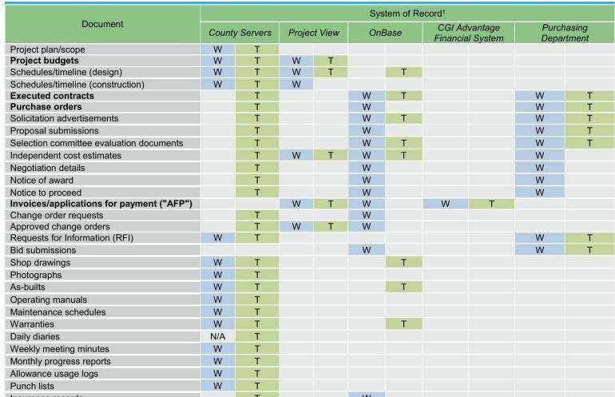  
Figure 5: Example from the “Government Reports” test set.

Caption: The image shows a table titled “System of Record” which outlines the different types of documents or records maintained across various systems or departments within an organization related to project management and construction. The rows list documents like project plans, budgets, schedules, contracts, purchase orders, invoices, change requests, bid submissions, drawings, manuals, meeting minutes, and reports. The columns indicate the system or department responsible for maintaining each record, such as County Servers, Project View, OnBase, CGI Advantage Financial System, and Purchasing Department. The table uses ”W” and ”T” markers to denote which system or department serves as the primary source (writer) or storage location (trailer) for each type of document.

# C ADDITIONAL RESULTS

C.1 OTHER METRICS   
Table 6: Comprehensive evaluation of baseline models and our proposed method on ViDoRe. Results are presented using Recall $@ 1$ metrics. Text-only metrics are not computed for benchmarks with only visual elements.   

<table><tr><td></td><td>ArxivQ DocQ</td><td></td><td>InfoQ</td><td>TabF</td><td>TATQ</td><td>Shift</td><td>AI</td><td>Energy</td><td>Gov.</td><td>Health.</td><td>Avg.</td></tr><tr><td>Unstructured text-only</td><td></td><td></td><td></td><td></td><td></td><td></td><td></td><td></td><td></td><td></td><td></td></tr><tr><td>BM25</td><td></td><td>26.6</td><td></td><td></td><td>34.6</td><td>45.0</td><td>86.0</td><td>70.0</td><td>68.0</td><td>74.0</td><td>-</td></tr><tr><td>BGE-M3</td><td></td><td>22.8↓3.8</td><td></td><td></td><td>26.1↓8.5</td><td>51.016.0</td><td>81.0↓5.0</td><td>72.0↑2.0</td><td>67.0↓1.0</td><td>77.0↑3.0</td><td>1</td></tr><tr><td>Unstructured + oCR</td><td></td><td></td><td></td><td></td><td></td><td></td><td></td><td></td><td></td><td></td><td></td></tr><tr><td>BM25</td><td>26.7</td><td>28.9</td><td>54.0</td><td>30.4</td><td>50.0</td><td>52.0</td><td>86.0</td><td>77.0</td><td>74.0</td><td>80.0</td><td>55.9</td></tr><tr><td>BGE-M3</td><td>28.1↑1.4</td><td>22.9↓6.0</td><td>53.8↓0.2</td><td></td><td>55.7†25.3 38.6↓11.4 56.0↑4.0</td><td></td><td>82.0↓4.0</td><td>79.0个2.0</td><td>76.0↑2.0</td><td>83.0↑3.0</td><td>57.51.6</td></tr><tr><td>Unstructured + Captioning</td><td></td><td></td><td></td><td></td><td></td><td></td><td></td><td></td><td></td><td></td><td></td></tr><tr><td>BM25</td><td>35.5</td><td>30.2</td><td>61.5</td><td>24.3</td><td>49.0</td><td>47.0</td><td>79.0</td><td>76.0</td><td>75.0</td><td>81.0</td><td>55.9</td></tr><tr><td>BGE-M3</td><td>29.3↓6.2</td><td>26.0↓4.2</td><td>62.1 ↑0.6</td><td>58.6†34.3</td><td>30.6↓18.4 55.018.0</td><td></td><td>80.0↑1.0</td><td>78.0个2.0</td><td>69.0↓6.0</td><td>83.0↑2.0</td><td>57.2†1.3</td></tr><tr><td>Contrastive VLMs</td><td></td><td></td><td></td><td></td><td></td><td></td><td></td><td></td><td></td><td></td><td></td></tr><tr><td>Jina-CLIP</td><td>19.4</td><td>7.3</td><td>26.7</td><td>12.5</td><td>1.6</td><td>2.0</td><td>11.0</td><td>13.0</td><td>15.0</td><td>17.0</td><td>12.6</td></tr><tr><td>Nomic-vision</td><td>10.4</td><td>6.7</td><td>22.1</td><td>9.6</td><td>1.6</td><td>0.0</td><td>9.0</td><td>9.0</td><td>7.0</td><td>13.0</td><td>8.8</td></tr><tr><td>SigLIP (Vvanilla)</td><td>34.2</td><td>21.3</td><td>51.8</td><td>46.1</td><td>17.9</td><td>13.0</td><td>50.0</td><td>51.0</td><td>47.0</td><td>65.0</td><td>39.7</td></tr><tr><td>Ours</td><td></td><td></td><td></td><td></td><td></td><td></td><td></td><td></td><td></td><td></td><td></td></tr><tr><td>SigLIP (Vvanilla)</td><td>34.2</td><td>21.3</td><td>51.8</td><td>46.1</td><td>17.9</td><td>13.0</td><td>50.0</td><td>51.0</td><td>47.0</td><td>65.0</td><td>39.7</td></tr><tr><td>BiSigLIP (+fine-tuning)</td><td>49.2↑15.0</td><td>23.8↑2.5</td><td>59.0†7.2</td><td>52.1↑6.0</td><td>20.7†2.8</td><td>16.0↑3.0</td><td>62.0个12.0</td><td>61.0↑10.0</td><td>55.0†8.0</td><td>72.017.0</td><td>47.1†7.4</td></tr><tr><td>BiPali (+LLM)</td><td>46.4↓-2.8</td><td>20.0↓-3.8</td><td>54.6↓4.4</td><td>63.2↑11.1</td><td>20.4↓-0.4</td><td>34.0个18.0</td><td>59.0↓-3.0</td><td>45.0↓-16.0</td><td>57.0十2.0</td><td>56.0↓-16.0</td><td>45.6↓-1.5</td></tr><tr><td>ColPali (+Late Inter.)</td><td>72.4↑26.0</td><td>45.6↑25.6</td><td>74.620.0</td><td>75.4个12.1</td><td>53.1↑32.7</td><td>55.0↑21.0</td><td>93.0134.0</td><td>85.0↑40.0</td><td>85.0↑28.0</td><td>88.0132.0</td><td>72.7127.1</td></tr></table>

C.2 MODEL VARIANTS   
Table 7: Benchmark scores for the “negative results” and various ablations on ViDoRe; ColPali for reference. Results are presented using nDCG $\textcircled { \omega } 5$ metrics. Text-only metrics are not computed for benchmarks with only visual elements.   

<table><tr><td></td><td>ArxivQ DocQ InfoQ TabF TATQ Shift AI</td><td></td><td></td><td></td><td></td><td></td><td></td><td>Energy</td><td></td><td>Gov. Health.</td><td>Avg.</td></tr><tr><td>ColSigLIP (PaliGemma)</td><td>3.1</td><td>3.0</td><td>5.1</td><td>6.2</td><td>2.5</td><td>1.0</td><td>3.4</td><td>3.4</td><td>2.3</td><td>2.2</td><td>3.2</td></tr><tr><td>BiSigLIP(PaliGemma)</td><td>18.5</td><td>14.6</td><td>33.4</td><td>39.5</td><td>16.1</td><td>5.2</td><td></td><td>27.6 32.6</td><td>36.6</td><td>35.7</td><td>26.0</td></tr><tr><td>ColSigLIP (Original)</td><td>2.6</td><td>2.2</td><td>2.3</td><td>5.7</td><td>1.8</td><td>1.0</td><td>2.6</td><td>4.1</td><td>1.4</td><td>1.5</td><td>2.5</td></tr><tr><td>ColPali (No Q.A. Tokens)</td><td>80.4</td><td>53.2</td><td>82.4</td><td>77.4</td><td>65.7</td><td>63.4</td><td></td><td>97.0 89.9</td><td>93.6</td><td>92.4</td><td>79.6</td></tr><tr><td>ColPali (Docmatix)</td><td>71.3</td><td>48.0</td><td>80.0</td><td>83.9</td><td>59.1</td><td>73.8</td><td>95.7</td><td>93.8</td><td>92.5</td><td>93.1</td><td>79.1</td></tr><tr><td>ColPali (224)</td><td>71.0</td><td>37.4</td><td>62.3</td><td>65.7</td><td>28.6</td><td>20.4</td><td>65.7</td><td>66.8</td><td>73.9</td><td>73.0</td><td>56.5</td></tr><tr><td>ColPali (Vision Trained)</td><td>78.8</td><td>53.9</td><td>81.3</td><td>81.7</td><td>64.4</td><td>70.6</td><td>95.3</td><td>91.7</td><td>93.5</td><td>94.7</td><td>80.6</td></tr><tr><td>ColPali (No Pairwise)</td><td>79.0</td><td>53.0</td><td>82.1</td><td>85.3</td><td>63.2</td><td>66.2</td><td>94.9</td><td>88.9</td><td>92.7</td><td>92.1</td><td>79.7</td></tr><tr><td>ColPali (+TabFQuAD training)</td><td>77.6</td><td>54.7</td><td>82.6</td><td>86.5</td><td>65.4</td><td>73.9</td><td></td><td>94.8 92.4</td><td>94.2</td><td>94.8</td><td>81.7</td></tr><tr><td>ColIdefics2 (64)</td><td>73.6</td><td>48.0</td><td>82.4</td><td>81.6</td><td>63.0</td><td>57.2</td><td>95.5</td><td>86.9</td><td>86.6</td><td>91.2</td><td>76.6</td></tr><tr><td>ColQwen2 (768)</td><td>86.4</td><td>56.2</td><td>89.8</td><td>88.7</td><td>75.2</td><td>85.7</td><td>98.8</td><td>94.8</td><td>93.6</td><td>97.3</td><td>86.6</td></tr><tr><td>ColPali (Reference: 448)</td><td>79.1</td><td>54.4</td><td>81.8</td><td>83.9</td><td>65.8</td><td>73.2</td><td></td><td>96.2 91.0</td><td>92.7</td><td>94.4</td><td>81.3</td></tr></table>

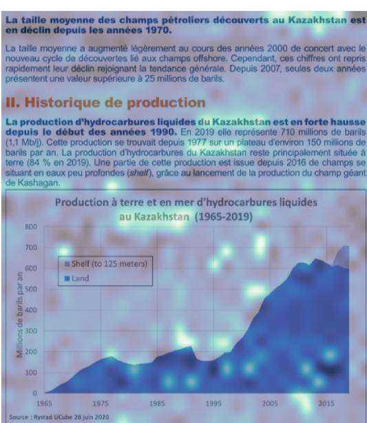

Query: "Quelle partie de la production pétroliere du Kazakhstan provient de champs en mer ?"

Figure 6: Similarity of the image patches w.r.t. the underlined token in the user query. This example is from the Shift test set.

# D MORE SIMILARITY MAPS

In Figure 6, ColPali assigns a high similarity to all patches with the word “Kazakhstan” when given the token < Kazakhstan>. Moreover, our model seems to exhibit world knowledge capabilities as the patch around the word ”Kashagan”—an offshore oil field in Kazakhstan—also shows a high similarity score.

It is also interesting to highlight that both this similarity map and the one displayed in Figure 3 (right) showcase a few white patches with high similarity scores. This behavior might first seem surprising as the white patches should not carry a meaningful signal from the original images. We believe the vectors associated with these patches share a similar role with the ViT registers (Darcet et al., 2023), i.e. these patches were repurposed for internal computations and stored the global information from the whole image.

# E MODEL GLOSSARY

SIGLIP

SigLIP (Sigmoid Loss for Language Image Pre-Training) builds upon CLIP (Contrastive Language-Image Pretraining)—a foundational model that aligns images and text by maximizing the similarity between correct image-text pairs while minimizing it for incorrect ones, leveraging a contrastive loss (Zhai et al., 2023). Unlike CLIP (Radford et al., 2021), which applies the softmax function to the logits, SigLIP uses the sigmoid activation function. This innovation eliminates the need for a global view of all pairwise similarities between images and texts within a batch, enabling more flexible batch size scaling (up to 1M items per batch, with an effective optimal batch size of 32k). This approach allows SigLIP to achieve state-of-the-art performance in zero-shot image classification tasks.

# PALIGEMMA

PaliGemma is a 3B-parameter vision-language model. It integrates the SigLIP vision encoder with a Gemma-2B language decoder, connected via a multimodal linear projection layer (Lucas Beyer\* et al.,

2024). The model processes images by segmenting them into a fixed number of Vision Transformer (Dosovitskiy et al., 2020) tokens, which are prepended to an optional text prompt.

A distinguishing feature of PaliGemma is its operation as a Prefix-Language Model (Prefix-LM). This design ensures full attention between image tokens and the user-provided input (prefix) while generating outputs auto-regressively (suffix). This architecture allows image tokens to access the task-specific query during processing, facilitating more effective task-dependent reasoning.

PaliGemma was trained in four stages: unimodal pretraining with existing components, extended multimodal pretraining, short high-resolution pretraining, and task-specific fine-tuning.

# COLBERT

ColBERT (Contextualized Late Interaction over BERT) is a retrieval model designed to balance speed and effectiveness in information retrieval tasks (Khattab & Zaharia, 2020). Traditional retrieval models are typically categorized based on their type of interaction: either processing queries and documents independently for efficiency (bi-encoders) or jointly to capture rich contextual relationships (crossencoders). ColBERT combines the advantages of both approaches through a novel late interaction mechanism.

Queries and documents are encoded separately using BERT, enabling offline pre-computation of document representations for scalability. Instead of pooling embeddings into a single vector, ColBERT retains token-level embeddings and employs a MaxSim operator to compute fine-grained similarity scores. For each query token, the model determines the maximum similarity with document tokens, summing these scores to compute relevance.

This architecture preserves the contextual richness of deep language models while significantly improving computational efficiency. By delaying the interaction step, ColBERT supports vector similarity indexing, facilitating end-to-end retrieval from large collections without prohibitive costs. Empirical evaluations on passage search datasets demonstrate that ColBERT achieves competitive effectiveness compared to existing BERT-based models (Devlin et al., 2018), while executing queries orders of magnitude faster and with drastically reduced computational requirements.

# F EXAMPLES FROM THE ViDoRe BENCHMARK

# Energy

Query: What types of accounts or products allow investors to defer paying taxes?

Query: What is the estimated to-Query: What is the projected   
tal savings for a PV system in peak electricity demand in Cali-  
Durham under the net metering fornia for the year 2030?   
(flat rate) billing option over the   
system’s useful life of 25 years?

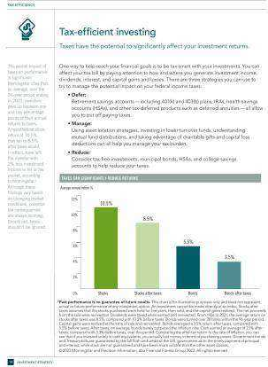

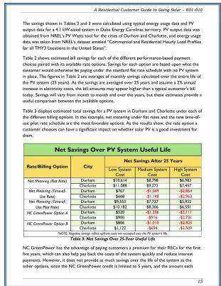

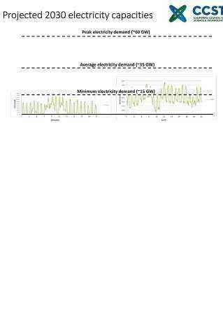

# Artificial Intelligence

Query: What are some common outcome areas targeted by TAII for different age groups?

Query: What did the robot moni- Query: What is the key approach   
tor to determine when to activate used in the PDP architecture?   
or deactivate the blower motor   
and blinker?

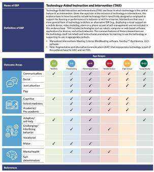

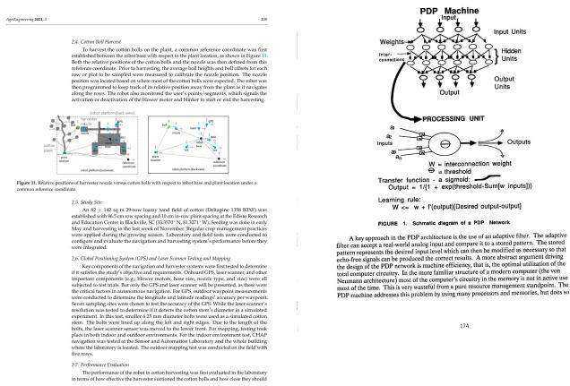

# Healthcare Industry

Query: What is the chemical formula for the ferroelectric material Lead Zirconium Titanate (PZT)?

Query: What government entities are involved in public financing for healthcare in the US?

Query: What does the AVPU scale stand for in assessing the level of consciousness of a seriously ill child?

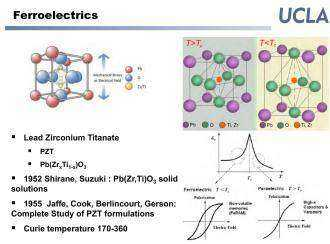

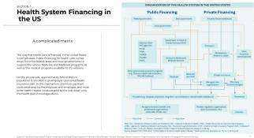

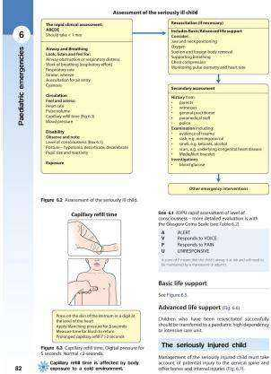

# Government Reports

# Query: What are some mandates for the EPA under the Pollution Prevention Act?

Query: What is the strategy of KPMG Hazem Hassan?

Query: What is the trust signal score for the consumer industry best-in-class archetype?

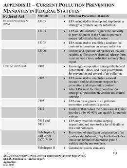

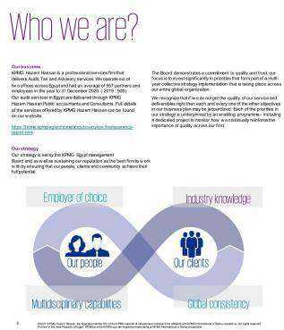

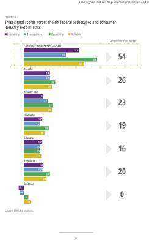

# Shift

Query: Selon le graphique, Query: Quelle partie de la proquelle est la capacite d’import et ´ duction petroli ´ ere du Kazakhstan \` la consommation reelle de carbu- ´ provient de champs en mer ?

rants SAF (biocarburants durables pour l’aviation) prevues en 2050´ ?

Query: Quels sont les pays ayant la plus grande part des decouvertes cumul´ ees de p´ etrole´ brut en 2020 (en milliers de barils, hors decouvertes cumul ´ ees) ? ´

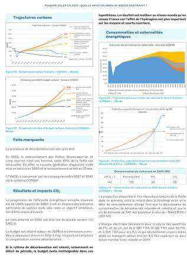

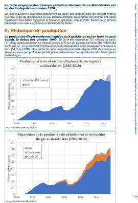

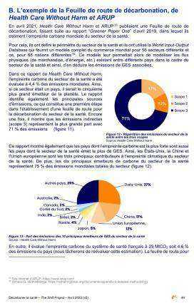
