# DocPruner: A STORAGE-EFFICIENT FRAMEWORK FOR MULTI-VECTOR VISUAL DOCUMENT RETRIEVAL VIA ADAPTIVE PATCH-LEVEL EMBEDDING PRUNING

Yibo $\mathbf { Y a n } ^ { 1 , 2 , 3 }$ , Guangwei $\mathbf { X } \mathbf { u } ^ { 2 }$ , Xin $\mathbf { Z o u } ^ { 1 , 3 }$ , Shuliang ${ \bf L i u ^ { 1 , 3 } }$ , James Kwok3, Xuming $\mathbf { H } \mathbf { u } ^ { 1 , 3 , * }$

1Hong Kong University of Science and Technology (Guangzhou), 2Alibaba Cloud Computing, 3Hong Kong University of Science and Technology yanyibo70@gmail.com, kunka.xgw@alibaba-inc.com, xuminghu@hkust-gz.edu.cn

# ABSTRACT

Visual Document Retrieval (VDR), the task of retrieving visually-rich document pages using queries that combine visual and textual cues, is crucial for numerous real-world applications. Recent state-of-the-art methods leverage Large Vision-Language Models (LVLMs) in a multi-vector paradigm, representing each document as patch-level embeddings to capture fine-grained details. While highly effective, this approach introduces a critical challenge: prohibitive storage overhead, as storing hundreds of vectors per page makes large-scale deployment costly and impractical. To address this, we introduce DocPruner, the first framework to employ adaptive patch-level embedding pruning for VDR to effectively reduce the storage overhead. DocPruner leverages the intra-document patch attention distribution to dynamically identify and discard redundant embeddings for each document. This adaptive mechanism enables a significant $50 \%$ reduction in storage for leading multi-vector VDR models with negligible degradation in document retrieval performance. Extensive experiments across more than ten representative datasets validate that DocPruner offers a robust, flexible, and effective solution for building storage-efficient, large-scale VDR systems.

# 1 INTRODUCTION

Visual Document Retrieval (VDR), the task of retrieving relevant document pages based on a query that leverages both visual and textual cues, is of paramount importance in numerous real-world applications, from e-commerce product searches to educational resource discovery (Ding et al., 2024; Zheng et al., 2025; Wang et al., 2025b). In contrast to traditional text retrieval, VDR presents a greater challenge as it must interpret not only the textual content but also the complex layouts, tables, figures, and other visual elements that convey critical information (Abootorabi et al., 2025; Mei et al., 2025). Consequently, this intricate task has garnered increasing attention within the information retrieval community in recent years, driving innovation beyond text-centric paradigms.

The methodology for VDR has undergone a significant paradigm shift. Early approaches were predominantly OCR-based, involving the extraction of text from document images, which was then indexed by conventional text retrievers (Zhang et al., 2024a; Hegghammer, 2022), as shown in Figure 1 (a). However, these methods are often brittle and error-prone, frequently failing to preserve the vital layout and structural relationship inherent in the visual representation (Most et al., 2025; Guo et al., 2025). With the recent advent of Large Vision-Language Models (LVLMs) and their dramatically enhanced visual understanding capabilities (Caffagni et al., 2024), the research community has begun to explore LVLM-based methods, which have demonstrated state-of-the-art retrieval performance (Mace et al. ´ , 2025; Gunther et al. ¨ , 2025; Dong et al., 2025; Tanaka et al., 2025). These methods generally fall into two categories: one that encodes an entire document page and the query into single, holistic embeddings (i.e., page-level retrieval) (Zhang et al., 2024c; Liu et al., 2025b; Jiang et al., 2024b; Meng et al., 2025), and another that represents a document as multiple patch-level embeddings and the query as multiple token-level embeddings, as illustrated in Figure 1 (b). The former approach, while simple, often fails to capture the fine-grained details necessary for understanding complex documents, leading to suboptimal performance. As a result, the latter patch-level retrieval has emerged as the preferred paradigm for leading models.

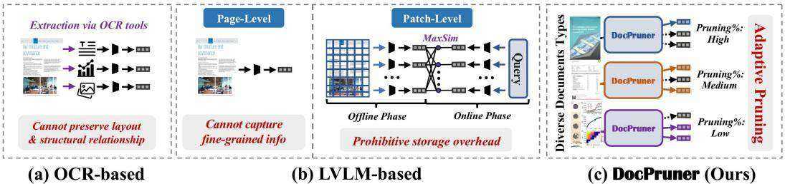  
Figure 1: The illustration of comparison between OCR-based (a) & LVLM-based (b) paradigms for VDR, and DocPruner (c), a novel framework to adaptively prune the patch-level embeddings for diverse document types.

The ascent of the patch-level retrieval paradigm is primarily attributed to the advantages of multivector retrieval, a technique pioneered by ColBERT-style late interaction (Khattab & Zaharia, 2020). The core mechanism of this approach involves a MaxSim operation, where for each query token embedding, the maximum similarity score against all patch embeddings of a document is computed, and these scores are then aggregated to determine relevance. The VDR field first witnessed the successful application of this paradigm with ColPali (Faysse et al., 2024), which spurred a wave of subsequent works that further refined and enhanced the performance of multi-vector VDR (NomicAI, 2025; Gunther et al. ¨ , 2025; Xu et al., 2025a; Karlinsky et al., 2025). However, despite its effectiveness, the multi-vector approach suffers from a critical efficiency bottleneck: prohibitive storage overhead. Storing hundreds or even thousands of embedding vectors for every single document page makes large-scale deployment costly and challenging (Ma et al., 2025).

To address this critical challenge, we introduce DocPruner, the first framework to successfully employ adaptive pruning in the context of VDR to significantly alleviate storage overhead, as shown in Figure 1 (c). The core of DocPruner is an elegant yet powerful mechanism that leverages the patch-level attention score distribution within a single document to perform adaptive pruning of its patch embeddings. This allows the framework to dynamically adjust the pruning ratio for different documents, achieving a $50 \%$ reduction in patch embeddings for several state-of-theart multi-vector models with negligible performance degradation. While some prior works have explored efficiency optimizations for multi-vector VDR, they are often constrained by pre-defined pruning rates or fixed thresholds (Cheng et al., 2024a; Ma et al., 2025; Tmamna et al., 2024), which lack the adaptability required for diverse, real-world visual documents. We believe that the design philosophy of DocPruner, which enables robust performance even for diverse models and datasets, ensures its flexibility and extensibility for practical, large-scale multimodal retrieval applications.

Our contributions can be summarized as follows:

❶ Pioneering Pruning for VDR. We propose DocPruner, the first framework to introduce an adaptive pruning mechanism to the VDR domain. It achieves a substantial $50 \%$ average patch pruning rate with near-lossless performance, effectively mitigating the storage overhead of topperforming multi-vector VDR models.

❷ Adaptive Property for Diverse Documents. The adaptive nature of DocPruner allows it to dynamically tailor the pruning ratio for different types of visual documents, a feature that is particularly crucial in real-world scenarios where document formats and information densities vary widely.

❸ Extensive Experimental Validation. We conduct comprehensive experiments on diverse and even multilingual VDR benchmarks, demonstrating the effectiveness and robustness of DocPruner when integrated with multiple leading multi-vector retrieval models in the community.

# 2 RELATED WORK

# 2.1 VISUAL DOCUMENT RETRIEVAL

Visual Document Retrieval (VDR) aims to retrieve relevant visually-rich documents based on visual representations, a paradigm that has garnered significant attention from the research community (Zheng et al., 2025; Mei et al., 2025; Zhang et al., 2025b). Previous OCR-based methods rely on document parsing to extract textual content (Xiao et al., 2024; Wang et al., 2023; Karpukhin et al., 2020), a process that can lose critical layout information and fail to interpret non-textual components. Consequently, the field has rapidly evolved from early OCR-plus-retriever pipelines to a paradigm leveraging powerful VLMs as OCR-free retriever backbones. By treating documents as images, VDR systems can preserve this vital structural and visual integrity, enabling a “what-yousee-is-what-you-get” retrieval mechanism that aligns with human perception (Ma et al., 2024).

These VLM-based methods primarily fall into two categories: efficient but less detailed page-level retrieval, and the more powerful patch-level retrieval. Page-level retrievers, such as DSE (Ma et al., 2024), GME (Zhang et al., 2024c) and UniSE (Liu et al., 2025b), encode an entire document page into a single, compact embedding. While efficient, this approach may lose fine-grained details crucial for specific queries. State-of-the-art patch-level retrievers (e.g., ColPali (Faysse et al., 2024), ColQwen (Faysse et al., 2024), ColNomic (NomicAI, 2025), Jina Embeddings v4 (Gunther et al. ¨ , 2025), and Llama Nemoretriever Colembed (Xu et al., 2025a)) achieve superior performance by generating fine-grained, multi-vector representations per page, yet this introduces a critical bottleneck due to prohibitive storage and computational overhead. Our proposed DocPruner directly addresses this pain point by proposing a solution to adaptively reduce the storage footprint of patchlevel embeddings, thereby making high-performance VDR more practical and scalable.

# 2.2 MULTI-VECTOR RETRIEVAL

Multi-vector retrievers, also known as late-interaction models (Khattab & Zaharia, 2020; Ji et al., 2024), computes relevance by first independently encoding queries and documents into sets of tokenlevel embeddings and then performing fine-grained similarity calculations. Formally, given a query $q$ and a document $d$ with $L _ { 1 }$ and $L _ { 2 }$ tokens respectively, they are encoded into embedding matrices $\mathbf { Q } = ( \mathbf { q } _ { 1 } , \dots , \mathbf { q } _ { L _ { 1 } } ) \in \mathbb { R } ^ { P \times L _ { 1 } }$ and $\mathbf { D } = ( \bar { \bf d _ { 1 } } , \dots , \bar { \bf d _ { { L _ { 2 } } } } ) \ \bar { \in } \ \mathbb { R } ^ { P \times { L _ { 2 } } }$ , where $P$ is the embedding dimension. The final score is derived from their token-wise similarity matrix $\mathbf { S } = \mathbf { Q } ^ { \top } \mathbf { D }$ . For instance, ColBERT model (Khattab & Zaharia, 2020) computes the score via a MaxSim operation:

$$
s ( q , d ) = \sum _ { i = 1 } ^ { L _ { 1 } } \operatorname* { m a x } _ { j = 1 } ^ { L _ { 2 } } \mathbf { q } _ { i } ^ { \top } \mathbf { d } _ { j } .
$$

Building on this foundation, ColBERTv2 (Santhanam et al., 2021) introduced a centroid-based method to compress token embeddings for greater storage efficiency. PLAID (Santhanam et al., 2022) further optimized this by using centroid interactions for efficient pruning of low-scoring documents. Other approaches have focused on reducing the number of stored vectors: XTR (Lee et al., 2023) trains the model to prioritize and retrieve only key document tokens, Acquavia et al. (2023) remove embeddings of less impactful tokens, and Clavie et al. ´ (2024) cluster similar token embeddings at indexing time to reduce the total vector count. Recently, MUVERA (Jayaram et al., 2024) proposed using Fixed Dimensional Encodings (FDEs) to approximate the multi-vector similarities, enabling efficient retrieval. Despite their effectiveness, a primary limitation of these text-based multi-vector models is their significant storage overhead, which scales linearly with the number of document tokens $\left( L _ { 2 } \right)$ , resulting in a storage cost of $O ( P \times L _ { 2 } )$ per document, a substantial increase compared to $O ( P )$ cost of single-vector models (MacAvaney et al., 2025; Ji et al., 2024).

The concept of multi-vector retrieval has been extended to VDR, leveraging the fine-grained interaction capabilities to better align textual queries with visual content (Plale et al., 2025; Xu et al., 2025b). Pioneering this direction, ColPali (Faysse et al., 2024) adapted the ColBERT framework by using PaliGemma-3B model (Beyer et al., 2024) to generate multi-vector embeddings directly from document images. Subsequently, Llama Nemoretriever Colembed (Xu et al., 2025a) further advanced this paradigm by modifying Llama-3.2-3B (Grattafiori et al., 2024) with bidirectional attention and employing a two-stage training strategy to achieve state-of-the-art performance on the ViDoRe benchmark. More recently, Jina Embeddings v4 (Gunther et al. ¨ , 2025) proposed a unified Qwen2.5-VL (Bai et al., 2025) architecture that supports both single-vector and multi-vector outputs, utilizing LoRA adapters for task-specific optimization. However, the storage overhead problem persists in these visual models, which remains a critical challenge that DocPruner aims to address.

More related work can be seen in Appendix A.

# 3 METHODOLOGY

In this section, we first formalize the setting of multi-vector VDR in $D$ Section 3.1). We then introduce our proposed framework, DocPruner, detailing its mechanism for adaptive patch-level embedding pruning in $D$ Section 3.2). Finally, we establish a theoretical foundation rooted in information theory to justify its efficacy in $D$ Section 3.3).

# 3.1 TASK FORMULATION

The task of VDR is to retrieve a ranked list of relevant document pages from a large corpus ${ \mathcal { C } } =$ $\{ d _ { 1 } , d _ { 2 } , \ldots , d _ { | C | } \}$ for a given textual query $q$ . In the context of multi-vector VDR (Faysse et al., 2024), both queries and documents are represented by sets of embedding vectors.

Let a query $q$ be a sequence of $L _ { q }$ textual tokens. A VLM-based encoder, denoted as $\Phi ( \cdot )$ , maps this query into a set of token-level embeddings $\mathbf { Q } = \{ \mathbf { q } _ { i } \} _ { i = 1 } ^ { L _ { q } }$ , where each $\mathbf { q } _ { i } \in \mathbb { R } ^ { P }$ and $P$ is the embedding dimension. Similarly, a document page $d$ is first rendered as an image and then processed by the VLM encoder $\Phi ( \cdot )$ , which divides the image into a grid of patches. This process yields a set of $L _ { d }$ patch-level embeddings $\mathbf { D } = \{ \mathbf { d } _ { j } \} _ { j = 1 } ^ { L _ { d } }$ , where each $\mathbf { d } _ { j } \in \mathbb { R } ^ { P }$ .

Following the late-interaction paradigm (Khattab & Zaharia, 2020; Santhanam et al., 2021), the relevance score $s ( q , d )$ is computed via a MaxSim operation as defined in Equation 1. The primary challenge is the storage overhead associated with this representation. Storing the full set of embeddings $\mathbf { D }$ for every document results in a cost of $O ( L _ { d } \times P )$ per page, which is prohibitive for large-scale corpora. Our objective is to generate a pruned set of document embeddings $\mathbf { D } ^ { \prime } \subset \mathbf { D }$ such that its size, $L _ { d } ^ { \prime } = | \mathbf { D } ^ { \prime } |$ , is significantly smaller than $L _ { d }$ $( L _ { d } ^ { \prime } \ll L _ { d } )$ , thereby substantially reducing the storage cost to $\mathcal { O } ( L _ { d } ^ { \prime } \times P )$ while preserving retrieval performance.

# 3.2 THE DocPruner FRAMEWORK

DocPruner is a lightweight, plug-and-play framework applied during the offline indexing phase. It is designed around two core principles: being query-agnostic to enable offline processing and document-adaptive to handle the diverse nature of visual documents. The framework systematically identifies and discards redundant or less informative patch embeddings without requiring any model retraining. The process involves three main steps: quantifying patch importance, applying an adaptive threshold, and scoring with the pruned embeddings. See pseudocode in Section B.

# 3.2.1 QUANTIFYING PATCH IMPORTANCE VIA GLOBAL TOKEN ATTENTION

The central challenge of offline pruning is to estimate the importance of each patch without access to a query. We need a reliable, intrinsic signal of salience. Our key insight is that a VLM, in the process of understanding a document image, already computes such a signal. Specifically, we leverage the attention mechanism directed towards a global token. A global token is a special token whose final hidden state is trained to aggregate and summarize information from the entire input sequence. Its representation must encapsulate the document’s overall semantics.

In our framework, we use the end-of-sequence [EOS] token as the default global token, a common and effective choice in many VLM architectures. We extract the attention weights from the final Transformer layer, as this layer captures the most abstract and semantically rich relationships.

Formally, let $\mathbf { A } ^ { ( L ) }$ be the attention weights from the final layer $L$ . After averaging across all $H$ attention heads to create a smooth, robust attention map $\begin{array} { r } { ( \bar { \mathbf { A } } _ { i , j } ^ { ( L ) } = \frac { 1 } { H } \sum _ { h = 1 } ^ { H } \mathbf { A } _ { h , i , j } ^ { ( L ) } ) } \end{array}$ , we define the importance score $I ( \mathbf { d } _ { j } )$ for the $j$ -th patch as the attention it receives from the global token:

$$
I ( \mathbf { d } _ { j } ) = \bar { \mathbf { A } } _ { \mathrm { g l o b a l } , j } ^ { ( L ) } .
$$

This process yields a vector of importance scores ${ \mathcal { T } } _ { d } = \{ I ( \mathbf { d } _ { j } ) \} _ { j = 1 } ^ { L _ { d } }$ for each document, which serves as the foundation for our adaptive pruning.

# 3.2.2 ADAPTIVE THRESHOLDING FOR PRUNING

Naive pruning strategies, such as using a fixed pruning ratio or a global threshold, are ill-suited for VDR. Visual documents exhibit vast heterogeneity in information density—a sparse title page has very different characteristics from a dense, text-filled page. A fixed strategy would either overprune the dense page, losing critical information, or under-prune the sparse page, retaining useless background patches. DocPruner’s adaptive thresholding directly addresses this by tailoring the pruning decision to the statistical properties of each individual document.

For a given document $d$ with $L _ { d }$ patch embeddings, we have a corresponding vector of importance scores $\mathcal { T } _ { d } = \{ I ( \mathbf { d } _ { j } ) \} _ { j = 1 } ^ { L _ { d } }$ . Our method computes a document-specific threshold by leveraging the first two statistical moments of these scores. First, we define the mean importance $\mu _ { d }$ , which establishes a baseline salience level for the document’s patches. A high mean suggests the document is generally information-rich. It is formally calculated as:

$$
 \mu _ { d } = \frac { 1 } { L _ { d } } \sum _ { j = 1 } ^ { L _ { d } } I ( { \bf d } _ { j } ) .
$$

Second, we compute the standard deviation $\sigma _ { d }$ , which measures the dispersion of importance scores. A high standard deviation indicates that a few patches are exceptionally important compared to the rest, a hallmark of sparse but salient content. It is calculated as:

$$
\sigma _ { d } = \sqrt { \frac { 1 } { L _ { d } } \sum _ { j = 1 } ^ { L _ { d } } ( I ( \mathbf { d } _ { j } ) - \mu _ { d } ) ^ { 2 } } .
$$

The adaptive pruning threshold $\tau _ { d }$ for document $d$ is then defined as a linear combination of these two statistics: $\tau _ { d } = \mu _ { d } + k \cdot \sigma _ { d }$ , where $k$ is a hyperparameter that acts as a adaptation factor. It determines how many standard deviations above the mean a patch’s importance score must be considered significant. We define the preliminary pruned set of patch embeddings $\hat { \mathbf { D } } _ { d } ^ { \prime }$ as:

$$
\hat { \mathbf { D } } _ { d } ^ { \prime } = \{ \mathbf { d } _ { j } \in \mathbf { D } _ { d } \mid I ( \mathbf { d } _ { j } ) > \tau _ { d } \} .
$$

To handle the edge case where overly aggressive pruning might discard all embeddings (i.e., $\hat { \mathbf { D } } _ { d } ^ { \prime } = $ $\varnothing$ ), we guarantee that at least one embedding is preserved. The final pruned set $\mathbf { D } _ { d } ^ { \prime }$ is defined as:

$$
\begin{array} { r } { \mathbf { D } _ { d } ^ { \prime } = \left\{ \begin{array} { l l } { \hat { \mathbf { D } } _ { d } ^ { \prime } } & { \mathrm { i f } \hat { \mathbf { D } } _ { d } ^ { \prime } \neq \emptyset } \\ { \{ \mathbf { d } _ { j ^ { * } } \} \mathrm { ~ w h e r e ~ } j ^ { * } = \underset { j \in \{ 1 , \dots , L _ { d } \} } { \mathrm { a r g } \operatorname* { m a x } } I ( \mathbf { d } _ { j } ) } & { \mathrm { i f } \hat { \mathbf { D } } _ { d } ^ { \prime } = \emptyset . } \end{array} \right. } \end{array}
$$

# 3.2.3 SCORING WITH PRUNED EMBEDDINGS

The ultimate goal of pruning is to reduce storage and, by extension, accelerate online retrieval, without compromising ranking quality. At query time, the retrieval process remains identical to the standard late-interaction paradigm, with one crucial difference: the search space for the $\mathtt { M a x S i m }$ operation is significantly reduced. Instead of comparing each query token embedding against the full set of document embeddings $\mathbf { D }$ , we use the compact, pruned set $\mathbf { D ^ { \prime } }$ . The pruned relevance score, $s ^ { \prime } ( q , d )$ , is computed as: $\begin{array} { r } { \bar { s ^ { \prime } } ( q , d ) = \sum _ { i = 1 } ^ { L _ { q } } \operatorname* { m a x } _ { \mathbf { d } _ { j } \in \mathbf { D ^ { \prime } } } \bar { \mathbf { q } _ { i } ^ { \top } } \mathbf { d } _ { j } } \end{array}$ . For a given query $q$ , we compute $s ^ { \prime } ( q , d _ { k } )$ for all documents $d _ { k }$ in the corpus to obtain a ranked list. The effectiveness of this ranking is then evaluated using Normalized Discounted Cumulative Gain at rank 5 $\mathrm { ( n D C G } @ 5 \mathrm { ) }$ .

# 3.3 THEORETICAL FOUNDATION

The efficacy of DocPruner can be rigorously analyzed through the Information Bottleneck $\mathbf { ( I B ) }$ principle (Tishby et al., 2000; Saxe et al., 2019; Tishby & Zaslavsky, 2015). The IB framework aims to learn a compressed representation $\mathbf { Z }$ of an input random variable $\mathbf { X }$ that is maximally informative about a target variable $\mathbf { Y }$ . This is formulated as the following optimization problem:

$$
\begin{array} { r l } { \displaystyle \operatorname* { m a x } _ { \mathbf { Z } } } & { { } \mathcal { L } _ { I B } ( \mathbf { Z } ) = I ( \mathbf { Z } ; \mathbf { Y } ) - \beta I ( \mathbf { Z } ; \mathbf { X } ) , } \end{array}
$$

where $I ( \cdot ; \cdot )$ denotes mutual information and $\beta$ is a Lagrangian multiplier balancing compression and information preservation.

The Intractable Ideal. In our VDR task, $\mathbf { X }$ is the full set of document embeddings $\mathbf { D }$ , $\mathbf { Z }$ is the pruned set $\mathbf { D ^ { \prime } }$ , and the target $\mathbf { Y }$ is the relevance score $s ( q , d )$ , which depends on a future, unknown query $q$ . The ideal objective is to maximize the expected information about relevance over the distribution of all possible queries $P ( q )$ :

$$
\operatorname* { m a x } _ { \mathbf { D } ^ { \prime } } \quad \mathbb { E } _ { q \sim P ( q ) } [ I ( \mathbf { D } ^ { \prime } ; s ( q , d ) ) ] \quad \mathrm { s . t . } \quad | \mathbf { D } ^ { \prime } | \ll | \mathbf { D } | .
$$

This objective is intractable due to the unknown query distribution $P ( q )$ .

DocPruner as a Tractable Approximation. DocPruner offers a principled, tractable approximation to this problem.

▶ Global Token as Relevance Proxy. The hidden state of global token, $\mathbf { h } _ { g l o b a l }$ , serves as a sufficient statistic for document’s relevance to an arbitrary query. That is, $I ( \mathbf { D } ; s ( q , d ) ) \approx I ( \mathbf { D } ; \mathbf { h } _ { g l o b a l } )$ . This axiom posits that the global token’s representation, which summarizes the entire document, captures the necessary information for determining relevance. The attention scores $I ( \mathbf { d } _ { j } )$ directly measure the information flow from each patch to this summary. Therefore, by selecting patches that maximize $I ( { \bf D } ^ { \prime } ; { \bf h } _ { \mathrm { g l o b a l } } )$ , we are effectively approximating the ideal, intractable objective.

▶ Entropy-Aware Pruning. The adaptive threshold $\tau _ { d }$ dynamically adjusts the pruning ratio based on the information entropy of the document’s attention distribution. Let the normalized attention scores form a probability distribution $\begin{array} { r } { p _ { d } ( j ) = \frac { I ( \mathbf { d } _ { j } ) } { \sum _ { i } I ( \mathbf { d } _ { i } ) } } \end{array}$ over the patches. The information content of the document is captured by its Shannon entropy $\begin{array} { r } { \dot { H } ( p _ { d } ) = - \sum _ { j } p _ { d } ( j ) \log p _ { d } ( j ) } \end{array}$ .

1. Low-Entropy Documents: For documents with low information entropy (e.g., title pages), $p _ { d }$ is a sparse, peaky distribution. A few patches have very high attention scores, while most have near-zero scores. The term $k \cdot \sigma _ { d }$ dominates, setting a high threshold $\tau _ { d }$ that isolates only the highly informative “outlier” patches, resulting in aggressive pruning.

2. High-Entropy Documents: For documents with high information entropy (e.g., dense text pages), $p _ { d }$ is more uniform. Attention scores are distributed more evenly across many patches. The threshold $\tau _ { d }$ is more lenient, preserving a larger pathc number that collectively contribute to the document’s meaning.

# 4 EXPERIMENT

4.1 EXPERIMENTAL SETUP

Benchmarks & Evaluation. We conduct our experiments on recent representative VDR benchmarks: ViDoRe-V2 (Mace et al. ´ , 2025) and JinaVDR-Bench (Gunther et al. ¨ , 2025) (More details in Appendix C). We use three state-of-the-art multi-vector VDR models as our base models: ColQwen2.5 (Faysse et al., 2024), ColNomic (NomicAI, 2025), and Jina Embeddings V4 (Gunther et al. ¨ , 2025). Following standard practice in VDR domain (Faysse et al., 2024; Gunther ¨ et al., 2025; NomicAI, 2025; Xu et al., 2025a), we use nDCG $\boldsymbol { \ @ 5 }$ as the primary evaluation metric.

Baselines. We compare DocPruner against three categories of baselines.

(I) Base Models. This represents the original multi-vector models without any pruning or merging.   
They serve as the performance upper bound of storage cost.

(II) Merging-based Methods. Following Ma et al. (2025), the only work focused on VDR storage optimization via merging, we implement three merging strategies:

▶ Sem-Cluster: Merges patch embeddings by performing hierarchical clustering and representing each cluster by its centroid. The tunable hyperparameter is the merging factor, which determines the target number of clusters.

$\blacktriangleright$ 1D-Pooling: Applies 1D average pooling over sequential groups of patch embeddings to reduce their count. The hyperparameter is merging factor, which defines the pooling window size.

▶ 2D-Pooling: Arranges patch embeddings into a 2D grid and applies 2D average pooling. The hyperparameter is merging factor, which must be a perfect square.

(III) Pruning-based Methods: We compare three pruning strategies adapted to VDR context:

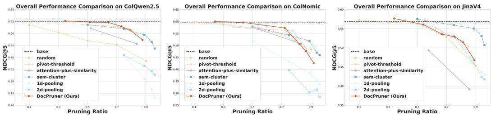  
Figure 2: Performance comparison $( \mathrm { n D C G } @ 5 )$ between DocPruner and baselines on ViDoRe-V2 benchmark (Mace et al. ´ , 2025) across ColQwen2.5 (Left), ColNomic (Middle), and Jina Embedding V4 (Right). Here, solid lines denote adaptive methods, whereas dashed lines denote non-adaptive ones; circular nodes represent pruning methods, whereas square nodes represent merging methods.

▶ Random: Randomly discards a fixed fraction of patch embeddings, serving as a naive baseline. The hyperparameter is the pruning ratio.

▶ Attention-plus-Similarity: An adaptive method that computes a combined score from both the [EOS] attention (importance) and the embedding similarity to the [EOS] token (representativeness), then prunes patches below a dynamically calculated threshold, following Wen et al. (2025). Hyperparameters include an adaptive factor $\mathrm { k }$ and a weighting factor alpha.

▶ Pivot-Threshold: A two-stage adaptive method that first filters an “important set” of patches using an adaptive attention threshold, and then de-duplicates this set by pruning patches that are too similar to selected “pivot”, following VisPruner (Zhang et al., 2025c). Hyperparameters include an adaptive factor for importance $\mathrm { k }$ , a de-duplication factor k dup, and num pivots.

Implementation Details. To ensure fair and reproducible comparisons, we replicated the base results of three base models in aligned with their respective official implementation. Our evaluation codebase is adapted from the official ViDoRe Benchmark repository1. The complete code for our experiments, including all baseline implementations and the DocPruner framework, will be made publicly available upon acceptance. For DocPruner, the adaptation factor $k$ has a range of $\{ - 0 . 5 , - 0 . 2 5 , 0 , 0 . 2 5 , 0 . 5 , 1 \}$ . The details of hyperparameters for all baseline methods is detailed in the Appendix D. All experiments were conducted on a NVIDIA A100 (80GB) GPU cluster.

# 4.2 EXPERIMENTAL ANALYSIS

In this section, we conduct a comprehensive experimental analysis to answer four key research questions (RQs). (RQ1) How effectively does DocPruner maintain retrieval performance on diverse visual document types while achieving significant storage compression? (RQ2) Can DocPruner’s robust performance generalize to multilingual retrieval scenarios? (RQ3) What is the difference between DocPruner framework and its variants? (RQ4) What are the quantifiable relative improvements in storage efficiency and latency of implementing DocPruner?

# 4.2.1 RETRIEVAL PERFORMANCE COMPARISON (RQ1)

To answer RQ1, we evaluate DocPruner’s performance against a comprehensive set of baselines on the ViDoRe-V2 benchmark. The results, visualized in Figure 2, demonstrate the effectiveness and robustness of our approach across three leading multi-vector models. See more results in Sec.E.1.

Observation ❶: DocPruner achieves near-lossless retrieval performance while pruning 50- $60 \%$ of embeddings, demonstrating remarkable robustness across different base models. As illustrated in Figure 2, DocPruner consistently operates near the performance ceiling set by the unpruned base models (i.e., dashed black line) even when aournd $60 \%$ of embeddings are pruned. For instance, when applied to ColQwen2.5, DocPruner removes $5 1 . 6 \%$ of patch embeddings with a mere 0.0038 drop in nDCG $\textcircled { a } 5$ (from 0.5508 to 0.5470). This high efficiency is mirrored on Jina Embedding V4, where it prunes $5 4 . 1 \%$ of embeddings while the nDCG $\textcircled { \alpha } 5$ only decreases from 0.5687 to 0.5608. Even on the high-performing ColNomic model, DocPruner achieves a $4 3 . 6 \%$ pruning ratio with a negligible performance change (0.5960 vs. the base’s 0.5946), showcasing a remarkable balance between efficiency and accuracy. This robustness stems from DocPruner’s mechanism, which leverages intra-document attention to create a document-specific importance score for each patch, effectively retaining the most semantically salient information necessary for retrieval.

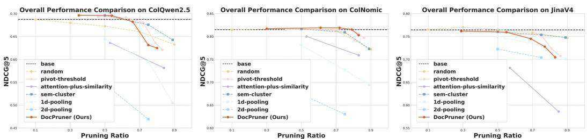  
Figure 4: Performance comparison $( \mathrm { n D C G } @ 5 )$ between DocPruner and baselines on JinaVDR benchmark (Gunther et al. ¨ , 2025) across ColQwen2.5 (Left), ColNomic (Middle), and Jina Embedding V4 (Right). Here, solid lines denote adaptive methods, whereas dashed lines denote non-adaptive ones; circular nodes represent pruning methods, whereas square nodes represent merging methods.

Observation $\otimes$ : Pruning-based strategies are generally more effective at preserving retrieval performance than merging-based strategies. This trend is evident across all three models, where methods marked with circles (pruning) consistently form a higher-performance frontier than those with squares (merging). For instance, on the ColNomic model at a around $7 5 \%$ compression ratio, DocPruner achieves an nDCG $\textcircled { \alpha } 5$ of 0.5730 (at a $7 2 . 1 \%$ ratio), whereas the strongest merging baseline, sem-cluster, drops to 0.5426 (at a $7 5 \%$ ratio). The reason for this disparity is that merging, by averaging feature vectors, can dilute the distinctiveness of highly salient patches, blurring important signals. In contrast, pruning preserves the original, high-fidelity embeddings of the most critical patches, vital for the late-interaction mechanism’s ability to find precise query-patch matches.

Observation $\pmb { \otimes }$ : Adaptive pruning methods generally exhibit a superior performance-compression trade-off compared to non-adaptive, fixed-ratio approaches. The solid lines in Figure 2, representing adaptive methods like DocPruner, consistently maintain higher nDCG $\textcircled { \alpha } 5$ scores than their non-adaptive counterparts (dashed lines) at similar compression levels (esp., below $60 \%$ ratio). For example, on the ColNomic model, DocPruner achieves a high $\mathrm { n D C G } @ 5$ of

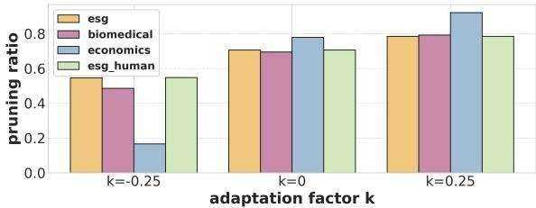  
Figure 3: Adaptive pruning ratio values of four different datasets in ViDoRe-V2 across difference k (More in Sec.E.1).

0.5960 with a $4 3 . 6 \%$ pruning ratio, outperforming all non-adaptive baselines. The superiority of adaptive methods is because they intelligently account for the heterogeneity of visual documents (validated by Figure 3); they prune more aggressively on information-sparse pages and more conservatively on information-dense ones, whereas fixed-ratio methods apply a one-size-fits-all strategy that can be suboptimal.

Observation ❹: Notably, merging-based methods exhibit uncharacteristically strong performance on the Jina Embedding V4, in some cases surpassing DocPruner. This phenomenon can likely be attributed to JinaV4’s unique training architecture; its technical report (Gunther et al. ¨ , 2025) reveals that the model is explicitly co-trained to produce a single-vector embedding via mean pooling over its token-level representations. This training paradigm encourages the model to learn patch embeddings that are inherently more aggregable and robust to averaging, making post-hoc merging strategies unusually effective as they align with the model’s intrinsic properties.

# 4.2.2 GENERALIZATION TO MULTILINGUAL SCENARIOS (RQ2)

To answer RQ2, we evaluate DocPruner’s generalization capability on the multilingual JinaVDR benchmark, where we choose documents in German, Russian, Chinese, and Japanese. The overall and per-language results, presented in Figure 4 and Sec.E.2, lead to the following observations.

Observation ❺: DocPruner demonstrates strong and consistent performance across diverse multilingual datasets, maintaining near-lossless retrieval accuracy while achieving substantial storage savings (i.e., around $5 0 \%$ ). For instance, on the ColNomic model, DocPruner achieves a remarkable $6 1 . 0 \%$ overall pruning ratio with a slight increase in $\mathrm { n D C G } @ 5$ from the base’s 0.8151 to 0.8191. Similarly, when applied to ColQwen2.5, it prunes $5 4 . 0 \%$ of embeddings while improving the $\mathrm { n D C G } @ 5$ score from 0.6877 to 0.6958. This robust generalization stems from DocPruner’s core mechanism, which relies on the language-agnostic visual attention patterns within the VLM.

Observation $\pmb { \circledcirc }$ : DocPruner’s adaptive nature is particularly evident in its ability to dynamically adjust pruning ratios for documents in different languages, reflecting varying information densities. This tailored approach is clearly visible in the per-language pruning statistics shown in Section E.2. Using the ColNomic model as an example (with ${ \bf k } = - 0 . 5$ ), DocPruner applies a modest pruning ratio of $9 . 0 \%$ for German documents $( \mathrm { n D C G } @ 5 $ of 0.6022 vs. base 0.5975) and $7 . 0 \%$ for Spanish documents $\mathrm { ( n D C G } @ 5$ of 0.7896 vs. base 0.7927). In contrast, it identifies greater redundancy in other languages, pruning $3 6 . 3 \%$ for Japanese and $3 7 . 6 \%$ for Chinese documents while maintaining high performance. This demonstrates that DocPruner is not applying a uniform rule but is sensitive to the intrinsic properties of the documents themselves, automatically allocating the storage budget proportional to each document’s information entropy.

# 4.2.3 VARIANT STUDY (RQ3)

To answer RQ3, we conduct a variant study comparing DocPruner against pruning-based variants (shown in Figure 5), which are: (I) attention-ratio, a non-adaptive method that prunes a fixed percentage of patches with the lowest attention scores; $\mathbf { \Pi } ^ { ( \mathbf { I I } ) }$ attention-threshold, which uses a fixed, global attention value as the pruning threshold; and (III) attention-threshold-nfp, which enhances the static threshold method with a noise-filtering-prompt (nfp) to guide the model’s focus.

Observation ❼: The document-adaptive statistical thresholding of DocPruner consistently achieves a superior performancecompression trade-off compared to simpler pruning variants that rely on fixed ratios or static thresholds. While all methods leverage attention scores, their pruning criteria differ fundamentally: attention-ratio enforces a uniform compression rate, whereas attentionthreshold and attention-threshold-nfp apply a one-size-fits-all importance cutoff. At a significant pruning ratio of approximately $60 \%$ , DocPruner sustains a high $\mathrm { n D C G } @ 5$ of 0.54; but the performance of the static attentionthreshold variant collapses to below 0.45, and

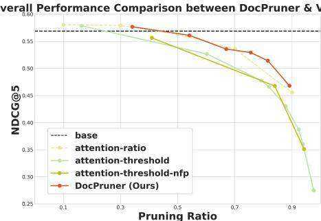  
Figure 5: Overall comparison between DocPruner & variants (See per-dataset analysis in Sec.E.3).

even the improved attention-threshold-nfp and fixed-ratio attention-ratio methods lag considerably.

# 4.2.4 EFFICIENCY ANALYSIS (RQ4)

Observation ❽: DocPruner achieves a substantial storage footprint reduction of approximately $50 \%$ on average with near-lossless retrieval performance, at the cost of an acceptable increase in offline encoding latency. As detailed in Table 1, DocPruner reduces storage footprints by $5 1 . 5 5 \%$ for ColQwen, $4 3 . 6 2 \%$ for ColNomic, and $5 4 . 0 9 \%$ for JinaV4, while the $\mathrm { n D C G } @ 5$ performance changes are minimal $( \downarrow 0 . 6 9 \%$ , $\uparrow 0 . 2 4 \%$ , and $\downarrow 1 . 3 9 \%$ , respectively). This specific setting of ${ \bf k } = - 0 . 2 5$ consistently delivers an optimal trade-off between performance and storage across all multi-vector models. Although DocPruner introduces an overhead that increases offline latency by $6 0 \%$ due to the extra steps of attention score extraction and filtering, the practical impact is modest. The average per-document encoding time increases from a baseline of $0 . 4 7 s$ to only $0 . 7 7 s$ , a duration that is acceptable for an offline indexing phase and vastly superior to 7.22s required by OCR-based method (i.e., OCR+BGE-M3 (Chen et al., 2024a)).

Table 1: Relative improvement of performance, storage, and latency to base models on ViDoRe-V2 (adaptation factor k as -0.25; orange denotes better and green denotes worse).   

<table><tr><td>△</td><td>ColQwen</td><td>ColNomic</td><td>JinaV4</td></tr><tr><td>nDCG@5</td><td>↓0.69%</td><td>↑0.24%</td><td>↓1.39%</td></tr><tr><td> Storage</td><td>↓51.55%</td><td>↓43.62%</td><td>↓54.09%</td></tr><tr><td>Latency</td><td>↑60.00%</td><td>↑65.96%</td><td>↑66.00%</td></tr></table>

# 5 CONCLUSION

In this paper, we addressed the critical challenge of prohibitive storage overhead in state-of-the-art multi-vector VDR systems. We introduced DocPruner, a novel and adaptive framework for patchlevel embedding pruning, which leverages the attention paid by a global token to each image patch to derive a query-agnostic importance score. Crucially, DocPruner employs a document-specific statistical threshold, allowing it to dynamically adjust the pruning ratio for documents of varying information density and complexity. Through extensive experiments across more than ten benchmark datasets, we have demonstrated that DocPruner can achieve a substantial $50 \%$ reduction in stored patch embeddings with only negligible degradation in retrieval accuracy. Future work could explore integrating this pruning mechanism directly into the model training process or extending the adaptive principle to other modalities. Ultimately, DocPruner charts a path toward fine-grained multimodal understanding as practical, real-world applications at an unprecedented scale.

We elaborate the broader impact of DocPruner in Section F.

# REFERENCES

Mohammad Mahdi Abootorabi, Amirhosein Zobeiri, Mahdi Dehghani, Mohammadali Mohammadkhani, Bardia Mohammadi, Omid Ghahroodi, Mahdieh Soleymani Baghshah, and Ehsaneddin Asgari. Ask in any modality: A comprehensive survey on multimodal retrieval-augmented generation. arXiv preprint arXiv:2502.08826, 2025.   
Antonio Acquavia, Craig Macdonald, and Nicola Tonellotto. Static pruning for multi-representation dense retrieval. In Proceedings of the ACM Symposium on Document Engineering 2023, pp. 1–10, 2023.   
Shuai Bai, Keqin Chen, Xuejing Liu, Jialin Wang, Wenbin Ge, Sibo Song, Kai Dang, Peng Wang, Shijie Wang, Jun Tang, et al. Qwen2. 5-vl technical report. arXiv preprint arXiv:2502.13923, 2025.   
Zechen Bai, Pichao Wang, Tianjun Xiao, Tong He, Zongbo Han, Zheng Zhang, and Mike Zheng Shou. Hallucination of multimodal large language models: A survey. arXiv preprint arXiv:2404.18930, 2024.   
Lucas Beyer, Andreas Steiner, Andre Susano Pinto, Alexander Kolesnikov, Xiao Wang, Daniel Salz, ´ Maxim Neumann, Ibrahim Alabdulmohsin, Michael Tschannen, Emanuele Bugliarello, et al. Paligemma: A versatile 3b vlm for transfer. arXiv preprint arXiv:2407.07726, 2024.   
Zheng Bian, Man Lung Yiu, and Bo Tang. Igp: Efficient multi-vector retrieval via proximity graph index. In Proceedings of the 48th International ACM SIGIR Conference on Research and Development in Information Retrieval, pp. 2524–2533, 2025.   
Daniel Bolya, Cheng-Yang Fu, Xiaoliang Dai, Peizhao Zhang, Christoph Feichtenhofer, and Judy Hoffman. Token merging: Your vit but faster. arXiv preprint arXiv:2210.09461, 2022.   
Ekaterina Borisova, Nikolas Rauscher, and Georg Rehm. Scivqa 2025: Overview of the first scientific visual question answering shared task. In Proceedings of the Fifth Workshop on Scholarly Document Processing (SDP 2025), pp. 182–210, 2025.   
Davide Caffagni, Federico Cocchi, Luca Barsellotti, Nicholas Moratelli, Sara Sarto, Lorenzo Baraldi, Marcella Cornia, and Rita Cucchiara. The revolution of multimodal large language models: a survey. arXiv preprint arXiv:2402.12451, 2024.   
Jianlv Chen, Shitao Xiao, Peitian Zhang, Kun Luo, Defu Lian, and Zheng Liu. Bge m3-embedding: Multi-lingual, multi-functionality, multi-granularity text embeddings through self-knowledge distillation. arXiv preprint arXiv:2402.03216, 2024a.   
Junkai Chen, Zhijie Deng, Kening Zheng, Yibo Yan, Shuliang Liu, PeiJun Wu, Peijie Jiang, Jia Liu, and Xuming Hu. Safeeraser: Enhancing safety in multimodal large language models through multimodal machine unlearning. arXiv preprint arXiv:2502.12520, 2025.

Liang Chen, Haozhe Zhao, Tianyu Liu, Shuai Bai, Junyang Lin, Chang Zhou, and Baobao Chang. An image is worth 1/2 tokens after layer 2: Plug-and-play inference acceleration for large visionlanguage models. In European Conference on Computer Vision, pp. 19–35. Springer, 2024b.

Hongrong Cheng, Miao Zhang, and Javen Qinfeng Shi. A survey on deep neural network pruning: Taxonomy, comparison, analysis, and recommendations. IEEE Transactions on Pattern Analysis and Machine Intelligence, 2024a.

Xin Cheng, Xun Wang, Xingxing Zhang, Tao Ge, Si-Qing Chen, Furu Wei, Huishuai Zhang, and Dongyan Zhao. xrag: Extreme context compression for retrieval-augmented generation with one token. Advances in Neural Information Processing Systems, 37:109487–109516, 2024b.

Benjamin Clavie, Antoine Chaffin, and Griffin Adams. Reducing the footprint of multi-vector re- ´ trieval with minimal performance impact via token pooling. arXiv preprint arXiv:2409.14683, 2024.

Yihao Ding, Soyeon Caren Han, Jean Lee, and Eduard Hovy. Deep learning based visually rich document content understanding: A survey. arXiv preprint arXiv:2408.01287, 2024.

Kuicai Dong, Yujing Chang, Xin Deik Goh, Dexun Li, Ruiming Tang, and Yong Liu. Mmdocir: Benchmarking multi-modal retrieval for long documents. arXiv preprint arXiv:2501.08828, 2025.

Zane Durante, Qiuyuan Huang, Naoki Wake, Ran Gong, Jae Sung Park, Bidipta Sarkar, Rohan Taori, Yusuke Noda, Demetri Terzopoulos, Yejin Choi, et al. Agent ai: Surveying the horizons of multimodal interaction. arXiv preprint arXiv:2401.03568, 2024.

Junfeng Fang, Yukai Wang, Ruipeng Wang, Zijun Yao, Kun Wang, An Zhang, Xiang Wang, and Tat-Seng Chua. Safemlrm: Demystifying safety in multi-modal large reasoning models. arXiv preprint arXiv:2504.08813, 2025.

Manuel Faysse, Hugues Sibille, Tony Wu, Bilel Omrani, Gautier Viaud, Celine Hudelot, and Pierre ´ Colombo. Colpali: Efficient document retrieval with vision language models. arXiv preprint arXiv:2407.01449, 2024.

Marco Federici, Davide Belli, Mart Van Baalen, Amir Jalalirad, Andrii Skliar, Bence Major, Markus Nagel, and Paul Whatmough. Efficient llm inference using dynamic input pruning and cacheaware masking. arXiv preprint arXiv:2412.01380, 2024.

Aaron Grattafiori, Abhimanyu Dubey, Abhinav Jauhri, Abhinav Pandey, Abhishek Kadian, Ahmad Al-Dahle, Aiesha Letman, Akhil Mathur, Alan Schelten, Alex Vaughan, et al. The llama 3 herd of models. arXiv preprint arXiv:2407.21783, 2024.

Michael Gunther, Saba Sturua, Mohammad Kalim Akram, Isabelle Mohr, Andrei Ungureanu, ¨ Bo Wang, Sedigheh Eslami, Scott Martens, Maximilian Werk, Nan Wang, et al. jinaembeddings-v4: Universal embeddings for multimodal multilingual retrieval. arXiv preprint arXiv:2506.18902, 2025.

Hao Guo, Xugong Qin, Jun Jie Ou Yang, Peng Zhang, Gangyan Zeng, Yubo Li, and Hailun Lin. Towards natural language-based document image retrieval: New dataset and benchmark. In Proceedings of the Computer Vision and Pattern Recognition Conference, pp. 29722–29732, 2025.

Thomas Hegghammer. Ocr with tesseract, amazon textract, and google document ai: a benchmarking experiment. Journal of Computational Social Science, 5(1):861–882, 2022.

Bairu Hou, Qibin Chen, Jianyu Wang, Guoli Yin, Chong Wang, Nan Du, Ruoming Pang, Shiyu Chang, and Tao Lei. Instruction-following pruning for large language models. arXiv preprint arXiv:2501.02086, 2025a.

Ce Hou, Fan Zhang, Yong Li, Haifeng Li, Gengchen Mai, Yuhao Kang, Ling Yao, Wenhao Yu, Yao Yao, Song Gao, et al. Urban sensing in the era of large language models. The Innovation, 6(1), 2025b.

Anwen Hu, Haiyang Xu, Jiabo Ye, Ming Yan, Liang Zhang, Bo Zhang, Chen Li, Ji Zhang, Qin Jin, Fei Huang, et al. mplug-docowl 1.5: Unified structure learning for ocr-free document understanding. arXiv preprint arXiv:2403.12895, 2024a.

Anwen Hu, Haiyang Xu, Liang Zhang, Jiabo Ye, Ming Yan, Ji Zhang, Qin Jin, Fei Huang, and Jingren Zhou. mplug-docowl2: High-resolution compressing for ocr-free multi-page document understanding. arXiv preprint arXiv:2409.03420, 2024b.

Haoming Huang, Yibo Yan, Jiahao Huo, Xin Zou, Xinfeng Li, Kun Wang, and Xuming Hu. Pierce the mists, greet the sky: Decipher knowledge overshadowing via knowledge circuit analysis. arXiv preprint arXiv:2505.14406, 2025.

Kai Huang, Hao Zou, Ye Xi, BoChen Wang, Zhen Xie, and Liang Yu. Ivtp: Instruction-guided visual token pruning for large vision-language models. In European Conference on Computer Vision, pp. 214–230. Springer, 2024.

Jiahao Huo, Yibo Yan, Boren Hu, Yutao Yue, and Xuming Hu. Mmneuron: Discovering neuron-level domain-specific interpretation in multimodal large language model. arXiv preprint arXiv:2406.11193, 2024.

Jiahao Huo, Yibo Yan, Xu Zheng, Yuanhuiyi Lyu, Xin Zou, Zhihua Wei, and Xuming Hu. Mmunlearner: Reformulating multimodal machine unlearning in the era of multimodal large language models. arXiv preprint arXiv:2502.11051, 2025.

Youngrok Jang, Hyesoo Kong, Gyeonghun Kim, Yejin Lee, Jungkyu Choi, and Kyunghoon Bae. Ictqa: Question answering over multi-modal contexts including image, chart, and text modalities. In Proceedings of the Computer Vision and Pattern Recognition Conference, pp. 138–148, 2025.

Rajesh Jayaram, Laxman Dhulipala, Majid Hadian, Jason D Lee, and Vahab Mirrokni. Muvera: Multi-vector retrieval via fixed dimensional encoding. Advances in Neural Information Processing Systems, 37:101042–101073, 2024.

Ziwei Ji, Himanshu Jain, Andreas Veit, Sashank J Reddi, Sadeep Jayasumana, Ankit Singh Rawat, Aditya Krishna Menon, Felix Yu, and Sanjiv Kumar. Efficient document ranking with learnable late interactions. arXiv preprint arXiv:2406.17968, 2024.

Lei Jiang, Weizhe Huang, Tongxuan Liu, Yuting Zeng, Jing Li, Lechao Cheng, and Xiaohua Xu. Fopru: Focal pruning for efficient large vision-language models. arXiv preprint arXiv:2411.14164, 2024a.

Ziyan Jiang, Rui Meng, Xinyi Yang, Semih Yavuz, Yingbo Zhou, and Wenhu Chen. Vlm2vec: Training vision-language models for massive multimodal embedding tasks. arXiv preprint arXiv:2410.05160, 2024b.

Tomoyuki Kagaya, Thong Jing Yuan, Yuxuan Lou, Jayashree Karlekar, Sugiri Pranata, Akira Kinose, Koki Oguri, Felix Wick, and Yang You. Rap: Retrieval-augmented planning with contextual memory for multimodal llm agents. arXiv preprint arXiv:2402.03610, 2024.

Leonid Karlinsky, Assaf Arbelle, Abraham Daniels, Ahmed Nassar, Amit Alfassi, Bo Wu, Eli Schwartz, Dhiraj Joshi, Jovana Kondic, et al. Granite vision: a lightweight, open-source multimodal model for enterprise intelligence. arXiv preprint arXiv:2502.09927, 2025.

Vladimir Karpukhin, Barlas Oguz, Sewon Min, Patrick SH Lewis, Ledell Wu, Sergey Edunov, Danqi Chen, and Wen-tau Yih. Dense passage retrieval for open-domain question answering. In EMNLP (1), pp. 6769–6781, 2020.

Omar Khattab and Matei Zaharia. Colbert: Efficient and effective passage search via contextualized late interaction over bert. In Proceedings of the 43rd International ACM SIGIR conference on research and development in Information Retrieval, pp. 39–48, 2020.

Carlos Lassance, Simon Lupart, Herve D´ ejean, St ´ ephane Clinchant, and Nicola Tonellotto. A static ´ pruning study on sparse neural retrievers. In Proceedings of the 46th International ACM SIGIR Conference on Research and Development in Information Retrieval, pp. 1771–1775, 2023.

Jinhyuk Lee, Zhuyun Dai, Sai Meher Karthik Duddu, Tao Lei, Iftekhar Naim, Ming-Wei Chang, and Vincent Zhao. Rethinking the role of token retrieval in multi-vector retrieval. Advances in Neural Information Processing Systems, 36:15384–15405, 2023.

Bo Li, Yuanhan Zhang, Dong Guo, Renrui Zhang, Feng Li, Hao Zhang, Kaichen Zhang, Peiyuan Zhang, Yanwei Li, Ziwei Liu, et al. Llava-onevision: Easy visual task transfer. arXiv preprint arXiv:2408.03326, 2024a.

Feng Li, Renrui Zhang, Hao Zhang, Yuanhan Zhang, Bo Li, Wei Li, Zejun Ma, and Chunyuan Li. Llava-next-interleave: Tackling multi-image, video, and 3d in large multimodal models. arXiv preprint arXiv:2407.07895, 2024b.

Junnan Li, Dongxu Li, Silvio Savarese, and Steven Hoi. Blip-2: Bootstrapping language-image pre-training with frozen image encoders and large language models. In International conference on machine learning, pp. 19730–19742. PMLR, 2023.

Xin Li, Yunfei Wu, Xinghua Jiang, Zhihao Guo, Mingming Gong, Haoyu Cao, Yinsong Liu, Deqiang Jiang, and Xing Sun. Enhancing visual document understanding with contrastive learning in large visual-language models. In Proceedings of the IEEE/CVF Conference on Computer Vision and Pattern Recognition, pp. 15546–15555, 2024c.

Sheng-Chieh Lin, Chankyu Lee, Mohammad Shoeybi, Jimmy Lin, Bryan Catanzaro, and Wei Ping. Mm-embed: Universal multimodal retrieval with multimodal llms. arXiv preprint arXiv:2411.02571, 2024.

Zihao Lin, Samyadeep Basu, Mohammad Beigi, Varun Manjunatha, Ryan A Rossi, Zichao Wang, Yufan Zhou, Sriram Balasubramanian, Arman Zarei, Keivan Rezaei, et al. A survey on mechanistic interpretability for multi-modal foundation models. arXiv preprint arXiv:2502.17516, 2025.

Junyi Liu, Liangzhi Li, Tong Xiang, Bowen Wang, and Yiming Qian. Tcra-llm: Token compression retrieval augmented large language model for inference cost reduction. arXiv preprint arXiv:2310.15556, 2023.

Qi Liu, Gang Guo, Jiaxin Mao, Zhicheng Dou, Ji-Rong Wen, Hao Jiang, Xinyu Zhang, and Zhao Cao. An analysis on matching mechanisms and token pruning for late-interaction models. ACM Transactions on Information Systems, 42(5):1–28, 2024.

Shuliang Liu, Qi Zheng, Jesse Jiaxi Xu, Yibo Yan, He Geng, Aiwei Liu, Peijie Jiang, Jia Liu, Yik-Cheung Tam, and Xuming Hu. Vla-mark: A cross modal watermark for large vision-language alignment model. arXiv preprint arXiv:2507.14067, 2025a.

Ze Liu, Zhengyang Liang, Junjie Zhou, Zheng Liu, and Defu Lian. Any information is just worth one single screenshot: Unifying search with visualized information retrieval. arXiv preprint arXiv:2502.11431, 2025b.

Yihao Lu and Hao Tang. Multimodal data storage and retrieval for embodied ai: A survey. arXiv preprint arXiv:2508.13901, 2025.

Xueguang Ma, Sheng-Chieh Lin, Minghan Li, Wenhu Chen, and Jimmy Lin. Unifying multimodal retrieval via document screenshot embedding. arXiv preprint arXiv:2406.11251, 2024.

Yubo Ma, Jinsong Li, Yuhang Zang, Xiaobao Wu, Xiaoyi Dong, Pan Zhang, Yuhang Cao, Haodong Duan, Jiaqi Wang, Yixin Cao, et al. Towards storage-efficient visual document retrieval: An empirical study on reducing patch-level embeddings. arXiv preprint arXiv:2506.04997, 2025.

Sean MacAvaney, Antonio Mallia, and Nicola Tonellotto. Efficient constant-space multi-vector retrieval. In European Conference on Information Retrieval, pp. 237–245. Springer, 2025.

Quentin Mace, Ant ´ onio Loison, and Manuel Faysse. Vidore benchmark v2: Raising the bar for ´ visual retrieval, 2025. URL https://arxiv.org/abs/2505.17166.

Yuren Mao, Xuemei Dong, Wenyi Xu, Yunjun Gao, Bin Wei, and Ying Zhang. Fit-rag: Black-box rag with factual information and token reduction. ACM Transactions on Information Systems, 43 (2):1–27, 2025.

Lang Mei, Siyu Mo, Zhihan Yang, and Chong Chen. A survey of multimodal retrieval-augmented generation. arXiv preprint arXiv:2504.08748, 2025.

Rui Meng, Ziyan Jiang, Ye Liu, Mingyi Su, Xinyi Yang, Yuepeng Fu, Can Qin, Zeyuan Chen, Ran Xu, Caiming Xiong, et al. Vlm2vec-v2: Advancing multimodal embedding for videos, images, and visual documents. arXiv preprint arXiv:2507.04590, 2025.

Alexander Most, Joseph Winjum, Manish Bhattarai, Shawn Jones, Nishath Rajiv Ranasinghe, Ayan Biswas, and Dan O’Malley. Lost in ocr translation? vision-based approaches to robust document retrieval. In Proceedings of the 2025 ACM Symposium on Document Engineering, pp. 1–10, 2025.

NomicAI. Nomic embed multimodal: Interleaved text, image, and screenshots for visual document retrieval, 2025. URL https://nomic.ai/blog/posts/ nomic-embed-multimodal.

Cheoneum Park, Seohyeong Jeong, Minsang Kim, KyungTae Lim, and Yong-Hun Lee. Scv: Light and effective multi-vector retrieval with sequence compressive vectors. In Proceedings of the 31st International Conference on Computational Linguistics: Industry Track, pp. 760–770, 2025.

Beth Plale, Sai Navya Jyesta, and Sachith Withana. Vector embedding of multi-modal texts: a tool for discovery? arXiv preprint arXiv:2509.08216, 2025.

Keshav Santhanam, Omar Khattab, Jon Saad-Falcon, Christopher Potts, and Matei Zaharia. Colbertv2: Effective and efficient retrieval via lightweight late interaction. arXiv preprint arXiv:2112.01488, 2021.

Keshav Santhanam, Omar Khattab, Christopher Potts, and Matei Zaharia. Plaid: an efficient engine for late interaction retrieval. In Proceedings of the 31st ACM International Conference on Information & Knowledge Management, pp. 1747–1756, 2022.

Andrew M Saxe, Yamini Bansal, Joel Dapello, Madhu Advani, Artemy Kolchinsky, Brendan D Tracey, and David D Cox. On the information bottleneck theory of deep learning. Journal of Statistical Mechanics: Theory and Experiment, 2019(12):124020, 2019.

Jan Luca Scheerer, Matei Zaharia, Christopher Potts, Gustavo Alonso, and Omar Khattab. Warp: An efficient engine for multi-vector retrieval. In Proceedings of the 48th International ACM SIGIR Conference on Research and Development in Information Retrieval, pp. 2504–2512, 2025.

Shanghai Municipal People’s Government Urban Planning and Land Resource Administration Bureau. Shanghai Master Plan 2017–2035: Striving for the Excellent Global City. Shanghai Municipal People’s Government, Shanghai, China, January 2018. URL https://www. shanghai.gov.cn/newshanghai/xxgkfj/2035004.pdf. Public Reading edition; government-issued planning document.

Susav Shrestha, Narasimha Reddy, and Zongwang Li. Espn: Memory-efficient multi-vector information retrieval. In Proceedings of the 2024 ACM SIGPLAN International Symposium on Memory Management, pp. 95–107, 2024.

Jiamin Su, Yibo Yan, Zhuoran Gao, Han Zhang, Xiang Liu, and Xuming Hu. Cafes: A collaborative multi-agent framework for multi-granular multimodal essay scoring. arXiv preprint arXiv:2505.13965, 2025a.

Jianlin Su, Jiarun Cao, Weijie Liu, and Yangyiwen Ou. Whitening sentence representations for better semantics and faster retrieval. arXiv preprint arXiv:2103.15316, 2021.

Zhaochen Su, Peng Xia, Hangyu Guo, Zhenhua Liu, Yan Ma, Xiaoye Qu, Jiaqi Liu, Yanshu Li, Kaide Zeng, Zhengyuan Yang, et al. Thinking with images for multimodal reasoning: Foundations, methods, and future frontiers. arXiv preprint arXiv:2506.23918, 2025b.

Ryota Tanaka, Taichi Iki, Taku Hasegawa, Kyosuke Nishida, Kuniko Saito, and Jun Suzuki. Vdocrag: Retrieval-augmented generation over visually-rich documents. In Proceedings of the Computer Vision and Pattern Recognition Conference, pp. 24827–24837, 2025.

Naftali Tishby and Noga Zaslavsky. Deep learning and the information bottleneck principle. In 2015 ieee information theory workshop (itw), pp. 1–5. Ieee, 2015.

Naftali Tishby, Fernando C Pereira, and William Bialek. The information bottleneck method. arXiv preprint physics/0004057, 2000.

Jihene Tmamna, Emna Ben Ayed, Rahma Fourati, Mandar Gogate, Tughrul Arslan, Amir Hussain, and Mounir Ben Ayed. Pruning deep neural networks for green energy-efficient models: A survey. Cognitive Computation, 16(6):2931–2952, 2024.

Liang Wang, Nan Yang, Xiaolong Huang, Linjun Yang, Rangan Majumder, and Furu Wei. Improving text embeddings with large language models. arXiv preprint arXiv:2401.00368, 2023.

Shuai Wang, Shengyao Zhuang, Bevan Koopman, and Guido Zuccon. 2d matryoshka training for information retrieval. In Proceedings of the 48th International ACM SIGIR Conference on Research and Development in Information Retrieval, pp. 3125–3134, 2025a.

Tianshi Wang, Fengling Li, Lei Zhu, Jingjing Li, Zheng Zhang, and Heng Tao Shen. Cross-modal retrieval: a systematic review of methods and future directions. Proceedings of the IEEE, 2025b.

Yiqi Wang, Wentao Chen, Xiaotian Han, Xudong Lin, Haiteng Zhao, Yongfei Liu, Bohan Zhai, Jianbo Yuan, Quanzeng You, and Hongxia Yang. Exploring the reasoning abilities of multimodal large language models (mllms): A comprehensive survey on emerging trends in multimodal reasoning. arXiv preprint arXiv:2401.06805, 2024.

Zichen Wen, Yifeng Gao, Weijia Li, Conghui He, and Linfeng Zhang. Token pruning in multimodal large language models: Are we solving the right problem? In Findings of the Association for Computational Linguistics: ACL 2025, pp. 15537–15549, Vienna, Austria, July 2025. Association for Computational Linguistics. ISBN 979-8-89176-256-5. doi: 10.18653/v1/2025.findings-acl. 802. URL https://aclanthology.org/2025.findings-acl.802/.

Shiguang Wu, Wenda Wei, Mengqi Zhang, Zhumin Chen, Jun Ma, Zhaochun Ren, Maarten de Rijke, and Pengjie Ren. Generative retrieval as multi-vector dense retrieval. In Proceedings of the 47th International ACM SIGIR Conference on Research and Development in Information Retrieval, pp. 1828–1838, 2024.

Shitao Xiao, Zheng Liu, Peitian Zhang, Niklas Muennighoff, Defu Lian, and Jian-Yun Nie. C-pack: Packed resources for general chinese embeddings. In Proceedings of the 47th international ACM SIGIR conference on research and development in information retrieval, pp. 641–649, 2024.

Junlin Xie, Zhihong Chen, Ruifei Zhang, Xiang Wan, and Guanbin Li. Large multimodal agents: A survey. arXiv preprint arXiv:2402.15116, 2024.

Mengyao Xu, Gabriel Moreira, Ronay Ak, Radek Osmulski, Yauhen Babakhin, Zhiding Yu, Benedikt Schifferer, and Even Oldridge. Llama nemoretriever colembed: Top-performing textimage retrieval model. arXiv preprint arXiv:2507.05513, 2025a.

Mingjun Xu, Zehui Wang, Hengxing Cai, and Renxin Zhong. A multi-granularity retrieval framework for visually-rich documents. arXiv preprint arXiv:2505.01457, 2025b.

Yibo Yan and Joey Lee. Georeasoner: Reasoning on geospatially grounded context for natural language understanding. In Proceedings of the 33rd ACM international conference on information and knowledge management, pp. 4163–4167, 2024.

Yibo Yan, Jiamin Su, Jianxiang He, Fangteng Fu, Xu Zheng, Yuanhuiyi Lyu, Kun Wang, Shen Wang, Qingsong Wen, and Xuming Hu. A survey of mathematical reasoning in the era of multimodal large language model: Benchmark, method & challenges. arXiv preprint arXiv:2412.11936, 2024a.

Yibo Yan, Shen Wang, Jiahao Huo, Hang Li, Boyan Li, Jiamin Su, Xiong Gao, Yi-Fan Zhang, Tianlong Xu, Zhendong Chu, et al. Errorradar: Benchmarking complex mathematical reasoning of multimodal large language models via error detection. arXiv preprint arXiv:2410.04509, 2024b.

Yibo Yan, Haomin Wen, Siru Zhong, Wei Chen, Haodong Chen, Qingsong Wen, Roger Zimmermann, and Yuxuan Liang. Urbanclip: Learning text-enhanced urban region profiling with contrastive language-image pretraining from the web. In Proceedings of the ACM Web Conference 2024, pp. 4006–4017, 2024c.

Yibo Yan, Shen Wang, Jiahao Huo, Jingheng Ye, Zhendong Chu, Xuming Hu, Philip S Yu, Carla Gomes, Bart Selman, and Qingsong Wen. Position: Multimodal large language models can significantly advance scientific reasoning. arXiv preprint arXiv:2502.02871, 2025a.

Yibo Yan, Shen Wang, Jiahao Huo, Philip S Yu, Xuming Hu, and Qingsong Wen. Mathagent: Leveraging a mixture-of-math-agent framework for real-world multimodal mathematical error detection. arXiv preprint arXiv:2503.18132, 2025b.

Weihao Ye, Qiong Wu, Wenhao Lin, and Yiyi Zhou. Fit and prune: Fast and training-free visual token pruning for multi-modal large language models. In Proceedings of the AAAI Conference on Artificial Intelligence, volume 39, pp. 22128–22136, 2025a.

Xubing Ye, Yukang Gan, Yixiao Ge, Xiao-Ping Zhang, and Yansong Tang. Atp-llava: Adaptive token pruning for large vision language models. In Proceedings of the Computer Vision and Pattern Recognition Conference, pp. 24972–24982, 2025b.

Jinsung Yoon, Raj Sinha, Sercan O Arik, and Tomas Pfister. Matryoshka-adaptor: Unsupervised and supervised tuning for smaller embedding dimensions. arXiv preprint arXiv:2407.20243, 2024.

Rufai Yusuf Zakari, Jim Wilson Owusu, Hailin Wang, Ke Qin, Zaharaddeen Karami Lawal, and Yuezhou Dong. Vqa and visual reasoning: An overview of recent datasets, methods and challenges. arXiv preprint arXiv:2212.13296, 2022.

Jiaxin Zhang, Wentao Yang, Songxuan Lai, Zecheng Xie, and Lianwen Jin. Dockylin: A large multimodal model for visual document understanding with efficient visual slimming. In Proceedings of the AAAI Conference on Artificial Intelligence, volume 39, pp. 9923–9932, 2025a.

Junyuan Zhang, Qintong Zhang, Bin Wang, Linke Ouyang, Zichen Wen, Ying Li, Ka-Ho Chow, Conghui He, and Wentao Zhang. Ocr hinders rag: Evaluating the cascading impact of ocr on retrieval-augmented generation. arXiv preprint arXiv:2412.02592, 2024a.

Kun Zhang, Jingyu Li, Zhe Li, and Jingjing Zhang. Composed multi-modal retrieval: A survey of approaches and applications. arXiv preprint arXiv:2503.01334, 2025b.

Qizhe Zhang, Aosong Cheng, Ming Lu, Zhiyong Zhuo, Minqi Wang, Jiajun Cao, Shaobo Guo, Qi She, and Shanghang Zhang. [cls] attention is all you need for training-free visual token pruning: Make vlm inference faster. arXiv e-prints, pp. arXiv–2412, 2024b.

Qizhe Zhang, Aosong Cheng, Ming Lu, Renrui Zhang, Zhiyong Zhuo, Jiajun Cao, Shaobo Guo, Qi She, and Shanghang Zhang. Beyond text-visual attention: Exploiting visual cues for effective token pruning in vlms. arXiv preprint arXiv:2412.01818, 2025c.

Xin Zhang, Yanzhao Zhang, Wen Xie, Mingxin Li, Ziqi Dai, Dingkun Long, Pengjun Xie, Meishan Zhang, Wenjie Li, and Min Zhang. Gme: Improving universal multimodal retrieval by multimodal llms. arXiv preprint arXiv:2412.16855, 2024c.

Yuan Zhang, Chun-Kai Fan, Junpeng Ma, Wenzhao Zheng, Tao Huang, Kuan Cheng, Denis Gudovskiy, Tomoyuki Okuno, Yohei Nakata, Kurt Keutzer, et al. Sparsevlm: Visual token sparsification for efficient vision-language model inference. arXiv preprint arXiv:2410.04417, 2024d.

Kening Zheng, Junkai Chen, Yibo Yan, Xin Zou, and Xuming Hu. Reefknot: A comprehensive benchmark for relation hallucination evaluation, analysis and mitigation in multimodal large language models. arXiv preprint arXiv:2408.09429, 2024.

Xu Zheng, Ziqiao Weng, Yuanhuiyi Lyu, Lutao Jiang, Haiwei Xue, Bin Ren, Danda Paudel, Nicu Sebe, Luc Van Gool, and Xuming Hu. Retrieval augmented generation and understanding in vision: A survey and new outlook. arXiv preprint arXiv:2503.18016, 2025.

Siru Zhong, Xixuan Hao, Yibo Yan, Ying Zhang, Yangqiu Song, and Yuxuan Liang. Urbancross: Enhancing satellite image-text retrieval with cross-domain adaptation. In Proceedings of the 32nd ACM International Conference on Multimedia, pp. 6307–6315, 2024.

Guanyu Zhou, Yibo Yan, Xin Zou, Kun Wang, Aiwei Liu, and Xuming Hu. Mitigating modality prior-induced hallucinations in multimodal large language models via deciphering attention causality. arXiv preprint arXiv:2410.04780, 2024.

Junyi Zhu, Shuochen Liu, Yu Yu, Bo Tang, Yibo Yan, Zhiyu Li, Feiyu Xiong, Tong Xu, and Matthew B Blaschko. Fastmem: fast memorization of prompt improves context awareness of large language models. arXiv preprint arXiv:2406.16069, 2024.

Xingchen Zou, Yibo Yan, Xixuan Hao, Yuehong Hu, Haomin Wen, Erdong Liu, Junbo Zhang, Yong Li, Tianrui Li, Yu Zheng, et al. Deep learning for cross-domain data fusion in urban computing: Taxonomy, advances, and outlook. Information Fusion, 113:102606, 2025.

# Technical Appendices and Supplements

A MORE RELATED WORK

A.1 LARGE VISION-LANGUAGE MODELS

Large Vision-Language Models (LVLMs) have recently revolutionized a multitude of fields, including visual question answering (Borisova et al., 2025; Zakari et al., 2022; Jang et al., 2025), urban sensing (Zou et al., 2025; Yan et al., 2024c; Yan & Lee, 2024; Hou et al., 2025b), multimodal reasoning (Wang et al., 2024; Yan et al., 2025a; 2024a; Su et al., 2025b; Yan et al., 2024b), multimodal retrieval (Lin et al., 2024; Lu & Tang, 2025; Kagaya et al., 2024; Zhong et al., 2024), and visual document understanding (Li et al., 2024c; Zhang et al., 2025a; Ding et al., 2024; Hu et al., 2024a;b). The architecture of these models generally follows several key paradigms. The first involves connecting a pre-trained vision encoder (e.g., ViT) and a LLM via a lightweight projection module, as seen in models like BLIP-2 (Li et al., 2023). A second paradigm consists of end-to-end trained models that process visual and textual inputs within a unified architecture, such as PaliGemma (Beyer et al., 2024). A third, highly effective approach involves freezing the core vision and language backbones and fine-tuning lightweight adapters (e.g., LoRA) to bridge the modalities, a strategy popularized by LLaVA (Li et al., 2024b;a). Furthermore, recent research is actively optimizing these models for critical real-world requirements, such as minimizing hallucination (Bai et al., 2024; Zhou et al., 2024; Zheng et al., 2024; Zhu et al., 2024), enabling agent-based interaction (Xie et al., 2024; Yan et al., 2025b; Su et al., 2025a; Durante et al., 2024), and enhancing interpretability (Lin et al., 2025; Huo et al., 2024; 2025; Huang et al., 2025) and safety (Fang et al., 2025; Chen et al., 2025; Liu et al., 2025a). The multi-vector models evaluated in our work are built upon such powerful LVLMs; for instance, ColQwen (Faysse et al., 2024) and ColNomic (NomicAI, 2025) are based on the Qwen2.5-VL series (Bai et al., 2025), one of the leading open-source LVLMs, while Jina Embeddings v4 (Gunther et al. ¨ , 2025) further leverages this foundation to implement a unified training paradigm for both single-vector and multi-vector outputs.

# A.2 PRUNING IN LVLMS

The extensive length of visual token sequences in LVLMs poses significant computational challenges, motivating a surge of research in token compression (Cheng et al., 2024a; Tmamna et al., 2024; Ye et al., 2025a). These training-free methods primarily fall into two paradigms. The first is instruction-centric pruning (Hou et al., 2025a; Huang et al., 2024; Federici et al., 2024), which leverages query-document interaction. Methods like FastV (Chen et al., 2024b) and Sparse-VLM (Zhang et al., 2024d) identify redundant visual tokens by analyzing the cross-attention scores between textual instructions and visual patches. While effective for tasks like VQA, this paradigm is fundamentally incompatible with the offline indexing phase of VDR, as it requires a query to determine token importance. The second paradigm is vision-centric compression (Ye et al., 2025b; Jiang et al., 2024a), which is query-agnostic and thus more suitable for offline processing. This category includes token merging approaches like ToMe (Bolya et al., 2022), which progressively combines similar tokens, and token pruning methods like FasterVLM (Zhang et al., 2024b), which uses the attention scores of the [CLS] token within the vision encoder to rank and discard less salient patches. However, these vision-centric methods often suffer from their own limitations, such as information dilution from merging or retaining redundant tokens due to the concentrated nature of attention. Crucially, most pruning strategies are designed for and evaluated on generative tasks, and their direct application to the offline retrieval setting is underexplored (Lassance et al., 2023; Acquavia et al., 2023; Liu et al., 2024). They are not tailored to preserve the fine-grained, discriminative features essential for the late-interaction mechanism in multi-vector retrieval.

# A.3 EFFICIENT DOCUMENT RETRIEVAL

The pursuit of efficiency in multi-vector retrieval (Wu et al., 2024; Park et al., 2025; Shrestha et al., 2024; Bian et al., 2025; Scheerer et al., 2025), a challenge amplified in the visual domain, has been addressed through two main orthogonal approaches: Dimension Reduction and Token Reduction. Dimension reduction aims to shrink the size of each embedding vector (Su et al., 2021; Yoon et al., 2024; Wang et al., 2025a). A prominent example is ColBERTv2 (Santhanam et al., 2021), which employed product quantization to compress embeddings. This principle was later inherited by ColPali (Faysse et al., 2024), which uses a simpler projection layer for the same purpose. The second, more impactful approach is token reduction, which focuses on decreasing the number of vectors stored per document and can be divided into pruning and merging strategies (Liu et al., 2023; Mao et al., 2025; Cheng et al., 2024b). However, recent empirical studies (Ma et al., 2025) have highlighted that token merging strategies, which aggregate multiple embeddings into a smaller set of representative vectors (e.g., via spatial pooling or semantic clustering (Clavie et al. ´ , 2024)), are considered more appropriate for the offline VDR context as they retain information from all patches. Our work, DocPruner, revisits the pruning paradigm by introducing a novel adaptive, query-agnostic mechanism that sidesteps the pitfalls of static pruning, offering a storage-efficient alternative to merging-based approaches.

# B ALGORITHM WORKFLOW

We formalize the complete workflow of our proposed framework in two distinct algorithms. Algorithm 1 details the offline indexing phase, where DocPruner generates a compact set of document embeddings by adaptively pruning patches based on their attention-derived importance scores. Subsequently, Algorithm 2 illustrates the online retrieval phase, where the final relevance score is efficiently computed via a MaxSim operation using this pruned set of embeddings.

# Algorithm 1: The DocPruner Adaptive Pruning (Offline Indexing Phase)

Input: A document page $d$ ;   
A VLM encoder $\Phi ( \cdot )$ that outputs patch embeddings and attention weights;   
A sensitivity controller hyperparameter $k$ .   
Output: A pruned set of patch embeddings $\mathbf { D } _ { d } ^ { \prime }$ .   
$^ { \prime * }$ Step 0: VLM Forward Pass \*/   
$\{ \mathbf { D } _ { d } , \mathbf { A } ^ { ( L ) } \}  \Phi ( d )$ // Extract embeddings $\mathbf { D } _ { d } = \{ \mathbf { d } _ { j } \} _ { j = 1 } ^ { L _ { d } }$ and final layer attention   
A(L)   
$^ { \prime * }$ Step 1: Quantifying Patch Importance \*/   
Let $g$ be the index of the global token (e.g., [EOS])   
Initialize an empty list of importance scores $\mathcal { T } _ { d }$   
for $j  1$ to $L _ { d }$ do $\begin{array} { r } { \bar { \mathbf { A } } _ { g , j } ^ { ( L ) }  \frac { 1 } { H } \sum _ { h = 1 } ^ { H } \mathbf { A } _ { h , g , j } ^ { ( L ) } } \end{array}$ I(dj ) ← A¯ (L)g,j // Importance is attention to patch $j$ (Eq. 2) Append $I ( \bar { \mathbf { d } _ { j } } )$ to $\mathcal { T } _ { d }$   
end   
$^ { \prime * }$ Step 2: Adaptive Thresholding \*/   
$\begin{array} { r l } & { \mu _ { d }  \frac { 1 } { L _ { d } } \sum _ { j = 1 } ^ { L _ { d } } I ( \mathbf { d } _ { j } ) } \\ & { \sigma _ { d }  \sqrt { \frac { 1 } { L _ { d } } \sum _ { j = 1 } ^ { L _ { d } } ( I ( \mathbf { d } _ { j } ) - \mu _ { d } ) ^ { 2 } } } \\ & { \tau _ { d }  \mu _ { d } + k \cdot \sigma _ { d } } \end{array}$ // Calculate mean importance (Eq. 3) // Calculate std dev of importance (Eq. 4) // Define the document-specific threshold   
$\hat { \mathbf { D } } _ { d } ^ { \prime } \gets \{ \}$ // Initialize preliminary pruned set   
for $j  1$ to $L _ { d }$ do if $I ( \mathbf { d } _ { j } ) > \tau _ { d }$ then $\left| \quad { \hat { \mathbf { D } } } _ { d } ^ { \prime } \gets { \hat { \mathbf { D } } } _ { d } ^ { \prime } \cup \{ \mathbf { d } _ { j } \} \right.$ // Keep patch if importance $>$ threshold (Eq. 5) end   
end   
$^ { \prime * }$ Step 3: Finalizing with Robustness Guarantee \*/   
if $\hat { \mathbf { D } } _ { d } ^ { \prime } = \varnothing$ then $j ^ { * } \gets \arg \operatorname* { m a x } I ( \mathbf { d } _ { j } )$ $j { \in } \{ 1 , { \ldots } , L _ { d } \}$ $\mathbf { D } _ { d } ^ { \prime } \gets \{ \mathbf { d } _ { j ^ { * } } \}$ // Keep the single most important patch (Eq. 6)   
else $\underline { { \mathbf { D } } } _ { d } ^ { \prime }  \hat { \mathbf { D } } _ { d } ^ { \prime }$ // Use the preliminary pruned set (Eq. 6)   
end   
return $\mathbf { D } _ { d } ^ { \prime }$

# Algorithm 2: Scoring with Pruned Embeddings (Online Retrieval Phase)

Input: A textual query $q$ ;   
The pruned document embedding set $\mathbf { D } _ { d } ^ { \prime }$ (from Algorithm 1);   
A VLM encoder $\Phi ( \cdot )$ for query encoding.   
Output: The relevance score $\bar { s } ^ { \prime } ( q , d )$ .   
$^ { \prime * }$ Step 1: Encode Query \*/   
$\mathbf { Q } \gets \Phi ( q )$ // Encode q into token embeddings $\mathbf { Q } = \{ \mathbf { q } _ { i } \} _ { i = 1 } ^ { L _ { q } }$   
$^ { \prime * }$ Step 2: Compute Score with Pruned Embeddings $^ { * / }$   
$s ^ { \prime } ( q , d ) \gets 0$   
for $\mathbf { q } _ { i } \in \mathbf { Q }$ do $\mathrm { m a x \_ s i m  - \infty }$ for dj ∈ D′d do sim ← q⊤i dj if sim > max sim then max sim ← sim end end $s ^ { \prime } ( q , d )  s ^ { \prime } ( q , d ) +$ max sim // Aggregate max similarity per query token (Sec 3.2.3)   
end   
return $s ^ { \prime } ( q , d )$

# C DETAILS OF BENCHMARKS

This section provides detailed descriptions of the benchmarks used in our evaluation to validate the performance of DocPruner.

# C.1 VIDORE-V2 BENCHMARK

The ViDoRe-V2 benchmark (Mace et al. ´ , 2025) was designed to address the saturation of its predecessor, ViDoRe-V1 (Faysse et al., 2024), where top models were achieving near-perfect scores. It introduces more realistic and challenging retrieval scenarios by incorporating several key features: (1) Blind Contextual Querying, where query generation models have limited context, forcing them to create non-extractive questions that better mimic real user behavior; (2) Long and Cross-Document Queries, which require models to retrieve information from multiple pages or across different documents; and (3) a Hybrid Generation Process, combining synthetic query generation with extensive human-in-the-loop filtering to ensure high query quality. The benchmark comprises four diverse datasets: esg-reports- $\mathbf { \nabla } \cdot \mathbf { v } 2 ^ { 2 }$ , biomedical-lectures- $. \mathbf { v } \bar { 2 } ^ { 3 }$ , economics-reports- $\mathbf { \sigma } _ { \cdot \mathbf { v } 2 }$ , and esg-reports-humanlabeled- $\mathbf { \sigma } _ { \mathbf { \mathbf { V } } 2 }$ , making it a robust testbed for model generalization.

Illustration of visual document examples from ViDoRe-V2 benchmark (Mace et al. ´ , 2025) can be seen in Figures 6, 7, and 8.

  
Figure 6: Illustration of visual document examples from ESG and ESG-human datasets (The latter is fully labelled by hand, and has no overlap of queries with its synthetic counterpart). They focus on the theme of ESG reports from the fast food industry.

  
Figure 7: Illustration of visual document examples from Biomedical Lectures datasets. It focuses on the theme of MIT courses in anatomy (precisely tissue interactions).

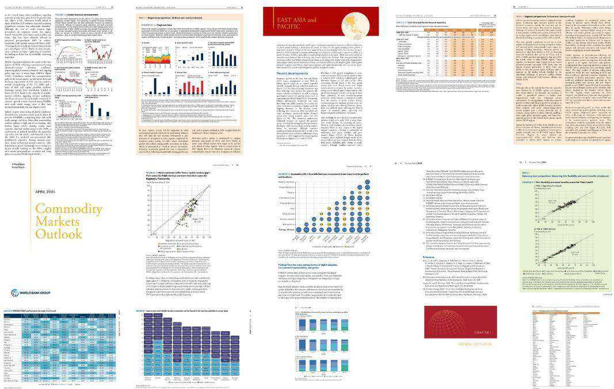  
Figure 8: Illustration of visual document examples from Economics Reports datasets. It focuses on the theme of World economic reports from 2024.

# C.2 JINAVDR-BENCH

JinaVDR-Bench was introduced alongside Jina Embeddings v4 (Gunther et al. ¨ , 2025) to evaluate a new generation of unified embedding models capable of producing both single-vector (dense) and multi-vector representations from a single architecture. The benchmark is notable for its breadth, covering a wide array of document types and retrieval tasks. Its datasets include academic papers (Astro-ph), financial reports (DocILE, DeepForm), presentation slides (SlideVQA), technical manuals, and infographics (InfographicsVQA), among others. This diversity tests a model’s ability to handle documents with varying layouts, languages (it includes multilingual splits), and content (e.g., text-heavy, table-rich, or figure-dominant). By providing a standardized evaluation across these heterogeneous sources, JinaVDR-Bench serves as a comprehensive tool for assessing the versatility and robustness of VDR models. To evaluate the multilingual generalization of DocPruner, we choose europeana-de-news6, beverages-catalogue- $\mathrm { \cdot } \mathrm { \mathrm { m } } ^ { 7 }$ , shanghai-master-plan8, and automobilecatalogue-jp9 for German, Russian, Chinese, and Japanese visual documents, respectively.

Illustration of visual document examples from JinaVDR-Bench (Gunther et al. ¨ , 2025) can be seen in Figures 9, 10, 11, and 12.

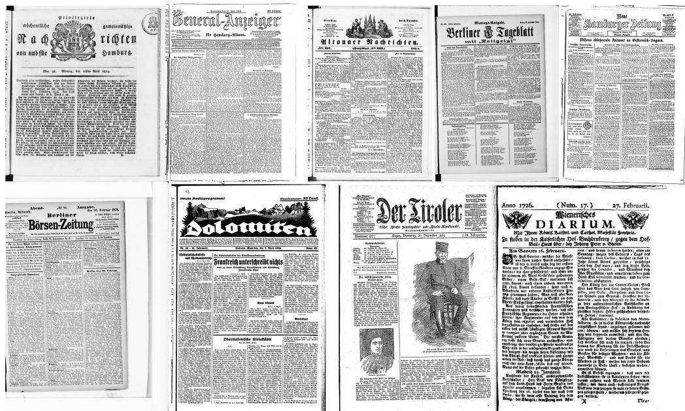  
Figure 9: Illustration of visual document examples from German datasets. It focuses on the records of the European online collection by selecting scans of German news articles.

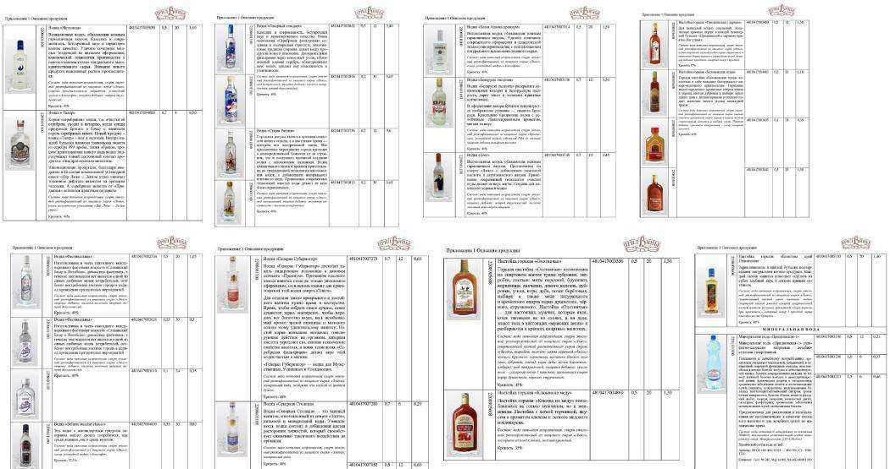  
Figure 10: Illustration of visual document examples from Russian datasets. It focuses on the beverage catalogs on Google search and downloading PDFs.

  
Figure 11: Illustration of visual document examples from Chinese datasets. It focuses on the theme of Shanghai master plan document taken from (Shanghai Municipal People’s Government Urban Planning and Land Resource Administration Bureau, 2018).

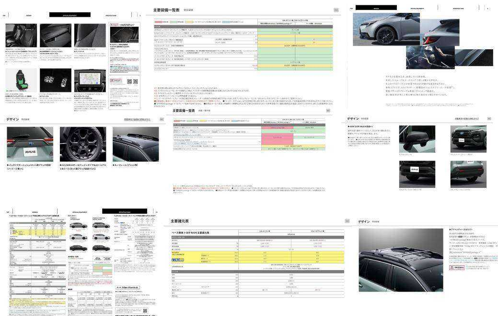  
Figure 12: Illustration of visual document examples from Japanese datasets. It focuses on the theme of marketing document from Toyota Japanese website.

# D DETAILS OF BASELINES

This section provides a detailed description of the implementation logic and hyperparameter settings for the baseline methods evaluated in Section 4.1. For each baseline, we empirically explored the specified hyperparameter space and selected the configurations that yielded the most representative performance trade-offs for presentation in our main results.

# D.1 MERGING-BASED METHODS

# D.1.1 SEM-CLUSTER

Implementation Logic. This method performs semantic merging of patch embeddings. For each document, it first normalizes all patch embeddings. Then, it computes a pairwise distance matrix based on cosine similarity (distance $\ c = \ 1$ - cosine similarity). Using this matrix, it applies hierarchical agglomerative clustering with the ’ward’ linkage method. The total number of patch embeddings is reduced by a merging factor, which determines the target number of clusters (i.e., num clusters $=$ num patches / merging factor). Finally, the embeddings within each resulting cluster are averaged to produce a single centroid embedding, forming the new, smaller set of representations for the document.

# Hyperparameters.

• Merging Factor: Defines the ratio by which the number of patch embeddings is reduced.   
A higher factor results in fewer clusters and thus more aggressive merging. – Selection Range: $\{ 2 , 4 , 9 , 1 6 , 2 5 \}$ .

# D.1.2 1D-POOLING

Implementation Logic. This strategy treats the patch embeddings as a 1D sequence. It groups consecutive embeddings into non-overlapping windows of size equal to the merging factor. If the total number of patches is not divisible by the factor, the sequence is padded with zero vectors to ensure complete windows. The embeddings within each window are then averaged to create a single merged embedding. This effectively downsamples the sequence of patch embeddings.

# Hyperparameters.

• Merging Factor: Specifies the size of the pooling window, i.e., the number of sequential patch embeddings to be averaged into one. – Selection Range: $\{ 2 , 4 , 9 , 1 6 , 2 5 \}$ .

# D.1.3 2D-POOLING

Implementation Logic. This method assumes a spatial arrangement of patches. The patch embeddings are first organized into a 2D grid that approximates their original spatial layout in the document image. This grid is padded with zero vectors to ensure its dimensions are divisible by the pooling kernel size. A 2D average pooling operation is then applied. The merging factor, which must be a perfect square, defines the area of the pooling window (e.g., a factor of 4 corresponds to a 2x2 kernel). A mask is used during pooling to correctly normalize the averages, ensuring that padded areas do not contribute to the final merged embeddings.

# Hyperparameters.

• Merging Factor: Defines the area of the 2D pooling window. – Selection Range: $\{ 4 , 9 , 1 6 , 2 5 \}$ .

# D.2.1 RANDOM

Implementation Logic. This naive baseline discards patch embeddings without considering their content. For each document, a specified pruning ratio of the total patch embeddings are selected uniformly at random and removed from the set. To ensure at least one patch remains, the implementation prevents pruning all patches even if the ratio is 1.0. This serves as a fundamental benchmark to gauge the performance loss from non-informed pruning.

# Hyperparameters.

• Pruning Ratio: A float between 0.0 and 1.0 that specifies the fraction of patch embeddings to be randomly discarded. – Selection Range: $\{ 0 . 1 , 0 . 3 , 0 . 5 , 0 . 7 , 0 . 9 \}$ .

# D.2.2 ATTENTION-PLUS-SIMILARITY

Implementation Logic. This adaptive method computes a composite score for each patch to decide whether to prune it. The score is a weighted sum of two components: (1) an importance score, derived from the attention weight the global [EOS] token pays to the patch, and (2) a representativeness score, calculated as the cosine similarity between the patch embedding and the [EOS] embedding. The final score is pruned using an adaptive threshold calculated as $\mu + k \cdot \sigma$ , where $\mu$ and $\sigma$ are the statistics of the composite scores for that document. The results presented in the paper were based on an empirical grid search over all hyperparameter combinations, selecting the optimal $\alpha$ for $k = 0$ and $k = 1$ respectively to show representative results.

# Hyperparameters.

• Adaptation Factor $( k )$ : A coefficient that controls the strictness of the dynamic pruning threshold. A higher value leads to a more aggressive pruning. – Selection Range: $\{ - 0 . 5 , - 0 . 2 5 , 0 , 0 . 2 5 , 0 . 5 , 1 \}$ .   
• Weighting Factor $( \alpha )$ : A float between 0.0 and 1.0 that balances the contribution of the importance score (attention) and the representativeness score (similarity). – Selection Range: $\{ 0 . 1 , 0 . 3 , 0 . 5 , 0 . 7 , 0 . 9 \}$ .

# D.2.3 PIVOT-THRESHOLD

Implementation Logic. This advanced adaptive baseline employs a two-stage pruning process. It first identifies an “important set” of patches by applying an adaptive attention-based threshold $( \mu +$ $k \cdot \sigma$ of [EOS]-to-patch attention scores), similar to the core mechanism of DocPruner. Within this important set, it selects a fixed pivot num of patches as “pivots”. For the remaining non-pivot patches in the important set, it calculates a duplication score, defined as the maximum cosine similarity to any of the pivots. A second adaptive threshold $( \mu _ { \mathrm { d u p } } + k _ { \mathrm { d u p } } \cdot \sigma _ { \mathrm { d u p } }$ of these duplication scores) is then used to prune non-pivot patches that are deemed too similar to the pivots. We found $k _ { \mathrm { d u p } } = 1$ and pivot num $= 1 0$ were consistently optimal via empirical search. Therefore, the results presented fix these two hyperparameters and show the performance trade-off by varying the adaptation factor $k$ .

# Hyperparameters.

• Adaptation Factor $( k )$ : Controls the threshold for initial importance-based filtering stage. – Selection Range: $\{ - 0 . 5 , - 0 . 2 5 , 0 , 0 . 2 5 , 0 . 5 , 1 \}$ .   
• De-duplication Factor $\left( k _ { \mathbf { d u p } } \right)$ : Controls the similarity threshold for the second stage. – Selection Range: $\{ - 0 . 5 , - 0 . 2 5 , 0 , 0 . 2 5 , 0 . 5 , 1 \}$ .   
• Pivot Num: The number of pivot tokens to select from the important set for the deduplication stage. – Selection Range: $\{ 5 , 1 0 , 1 5 , 2 0 \}$ .

# E MORE EXPERIMENTAL ANALYSIS

# E.1 MORE EXPERIMENT ON VIDORE-V2

Performance comparison $\mathrm { ( n D C G } @ 5 \mathrm { ) }$ between DocPruner and baselines on ViDoRe-V2 benchmark across four datasets on ColQwen2.5, ColNomic, and Jina Embedding V4 can be seen in Figures 13, 14, and 15, respectively. Pruning ratio distribution of DocPruner on ColQwen2.5, ColNomic, and Jina Embedding V4 can be seen in Figures 16, 17, and 18, respectively.

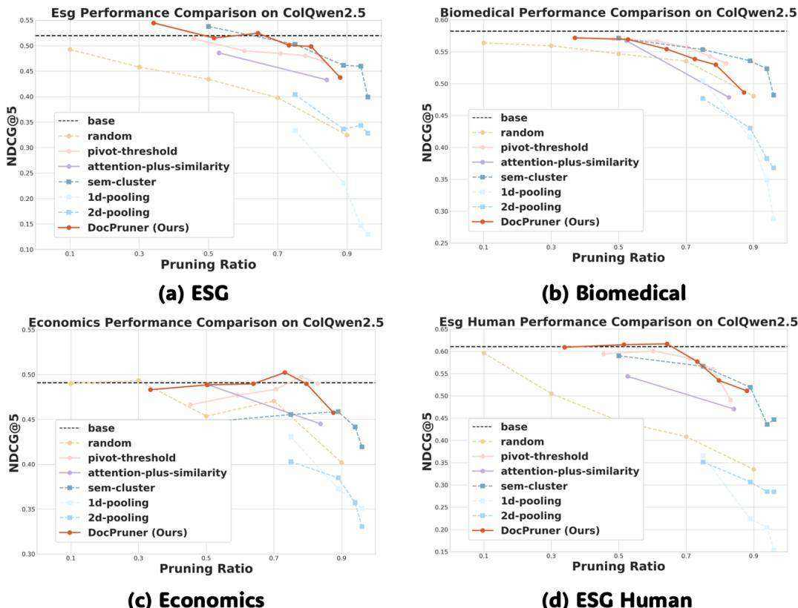  
Figure 13: Performance comparison $\mathrm { ( n D C G } @ 5 \mathrm { ) }$ of ColQwen2.5 between DocPruner and baselines on ViDoRe-V2 benchmark across four datasets.

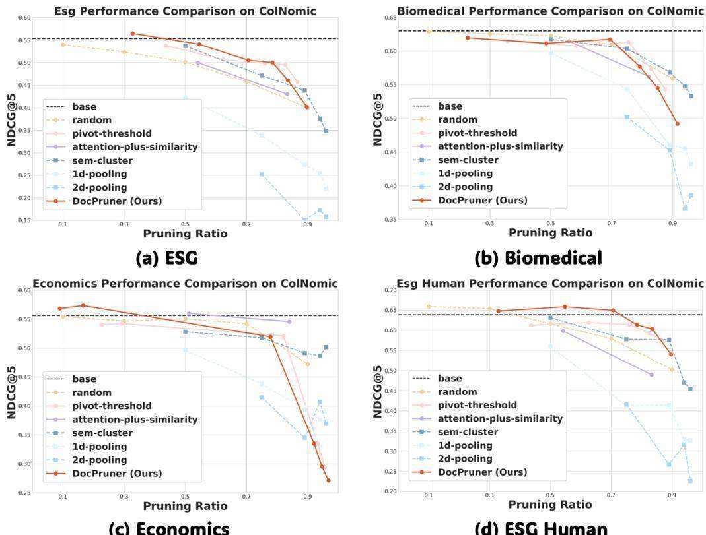  
Figure 14: Performance comparison $\mathrm { ( n D C G } @ 5 \mathrm { ) }$ of ColNomic between DocPruner and baselines on ViDoRe-V2 benchmark across four datasets.

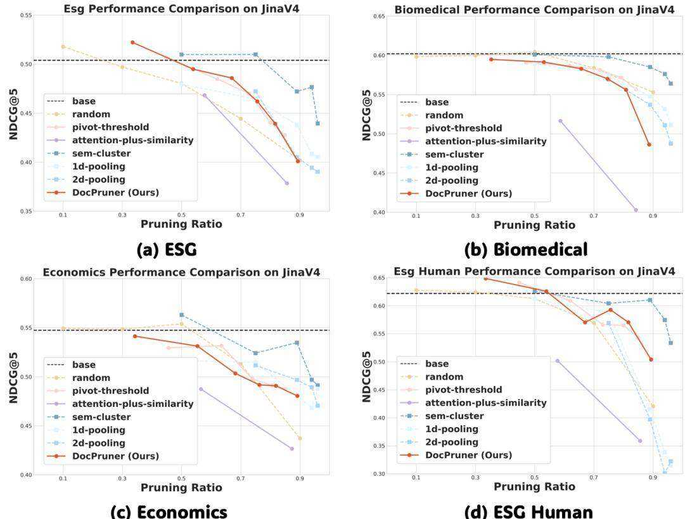  
Figure 15: Performance comparison $( \mathrm { n D C G } @ 5 )$ of Jina Embedding V4 between DocPruner and baselines on ViDoRe-V2 benchmark across four datasets.

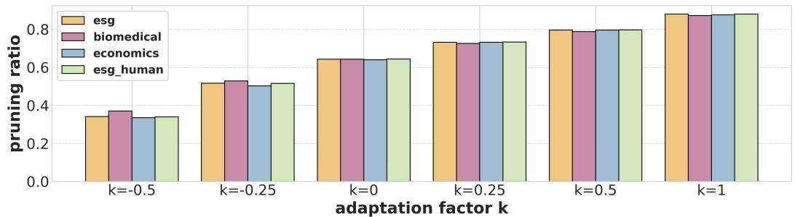  
Figure 16: Pruning ratio distribution of ColQwen2.5 using DocPruner across four datasets of ViDiRe-V2 over a adaptation factor $k$ range of $\{ - 0 . 5 , - 0 . 2 5 , 0 , 0 . 2 5 , 0 . 5 , 1 \}$ .

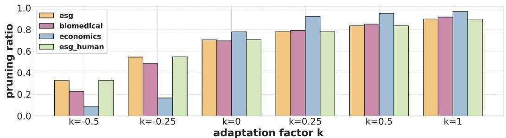  
Figure 17: Pruning ratio distribution of ColNomic using DocPruner across four datasets of ViDiRe-V2 over a adaptation factor $k$ range of $\{ - 0 . 5 , - 0 . 2 5 , 0 , 0 . 2 5 , 0 . 5 , 1 \}$ .

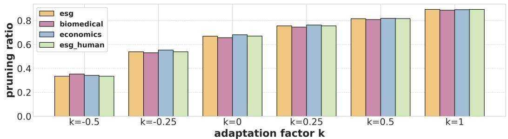  
Figure 18: Pruning ratio distribution of Jina Embedding V4 using DocPruner across four datasets of ViDiRe-V2 over a adaptation factor $k$ range of $\{ - 0 . 5 , - 0 . 2 5 , 0 , 0 . 2 5 , 0 . 5 , 1 \}$ .

# E.2 MORE EXPERIMENT ON JINAVDR

Performance comparison $\mathrm { ( n D C G } @ 5 \mathrm { ) }$ ) between DocPruner and baselines on JinaVDR benchmark across four multilingual datasets on ColQwen2.5, ColNomic, and Jina Embedding V4 can be seen in Figures 19, 20, and 21, respectively.

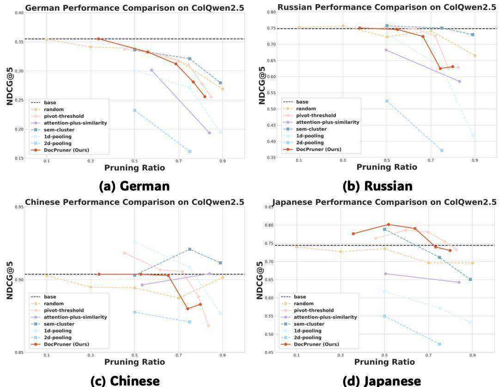  
Figure 19: Performance comparison $( \mathrm { n D C G } @ 5 )$ of ColQwen2.5 between DocPruner and baselines on JinaVDR benchmark across four datasets.

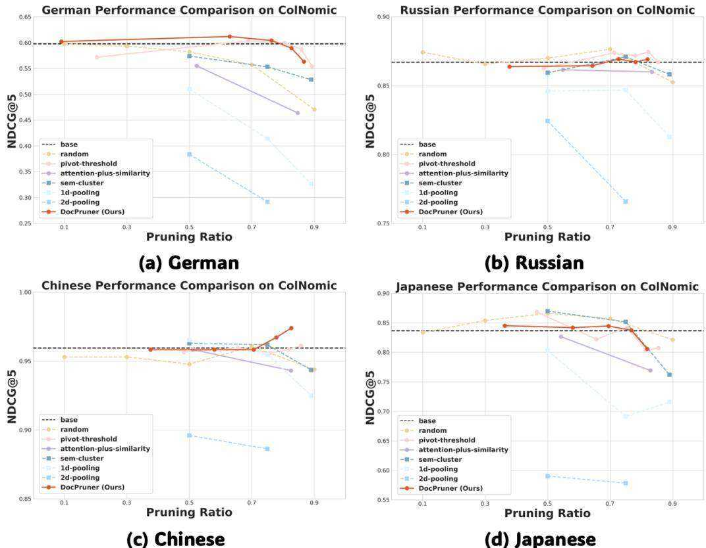  
Figure 20: Performance comparison $\mathrm { ( n D C G } @ 5 \mathrm { ) }$ ) of ColNomic between DocPruner and baselines on JinaVDR benchmark across four datasets.

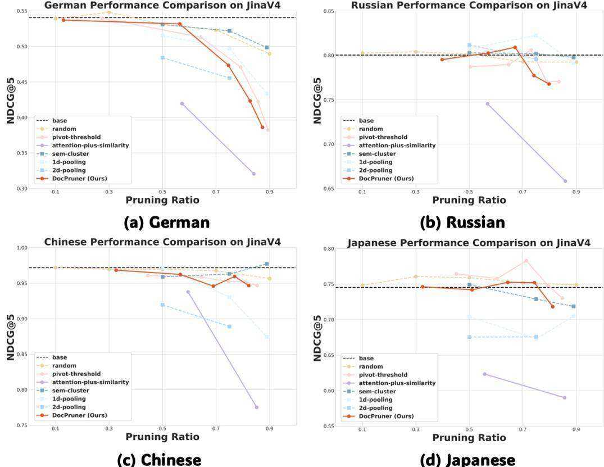  
Figure 21: Performance comparison $\mathrm { ( n D C G } @ 5 \mathrm { ) }$ of Jina Embedding V4 between DocPruner and baselines on JinaVDR benchmark across four datasets.

# E.3 MORE VARIANT STUDY

Performance comparison $( \mathrm { n D C G } @ 5 )$ between DocPruner and other variants on ViDoRe-V2 benchmark across four datasets on ColQwen2.5, ColNomic, and Jina Embedding V4 can be seen in Figure 22. The prompt used for evaluating attention-threshold-nfp is shown below.

# Prompt Template for attention-threshold-nfp

Analyze this document page. Assign high importance to regions containing text, tables, charts, and meaningful figures. Assign low importance to decorative graphics, logos, empty space, and repeating headers or footers.

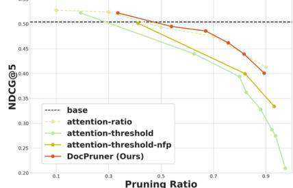  
Esg,Performance Comparison between DocPruner & Variants

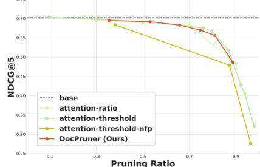  
Biomedical Performance Comparison between DocPruner& Variants

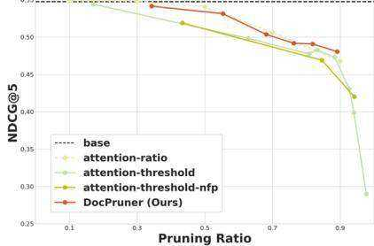  
Economics Performance Comparison betwen DocPruner&Variants Esg Human Performance Comparison betweenDocPruner&Variants   
Figure 22: Performance comparison between DocPruner and other variants on ViDoRe-V2 benchmark across four datasets.

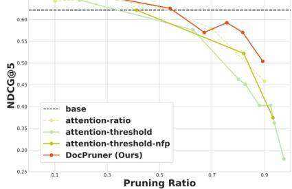

# F BROADER IMPACT

The development of DocPruner carries significant positive impacts that extend from the research community to industrial applications and ultimately to society at large. DocPruner addresses a critical, practical bottleneck in state-of-the-art VDR, and its implications can be understood on three distinct levels.

First, within the academic and research community, DocPruner encourages a paradigm shift. While much of the recent focus has been on scaling up models to achieve marginal gains in accuracy, our work highlights the paramount importance of computational and storage efficiency. By providing a simple yet effective framework for making powerful multi-vector models practical, we hope to inspire more research into resource-aware AI. This can enable researchers, particularly those in resource-constrained environments, to conduct larger-scale experiments and explore more complex VDR tasks that were previously computationally prohibitive. Our work serves as a proof-of-concept that “smarter” resource management can be as impactful as “bigger” models.

Second, for industry and commercial applications, DocPruner offers a direct and substantial economic benefit. The prohibitive storage costs associated with multi-vector embeddings are a major barrier to the widespread adoption of advanced VDR systems in enterprise settings. By reducing storage requirements by $50 \%$ with negligible performance loss, DocPruner makes it economically feasible for businesses in sectors like legal, finance, healthcare, and e-commerce to deploy high-fidelity document search and analysis tools. This can unlock new efficiencies in knowledge management, accelerate workflows that rely on searching vast archives of visually-rich documents (e.g., contracts, financial reports, patent filings), and ultimately democratize access to state-of-the-art retrieval technology for a wider range of organizations.

Finally, on a broader societal level, the principles behind DocPruner contribute to making information more accessible and discoverable. Public institutions such as libraries, museums, and government archives are custodians of immense collections of digitized historical and cultural documents. The ability to affordably index and search these visual archives at a fine-grained level can empower educators, historians, and the general public, fostering new avenues for research and learning. By lowering the technological and financial barriers to building powerful search systems, our work can help preserve and unlock the value latent within our collective cultural and scientific heritage, contributing to a more informed and connected society.