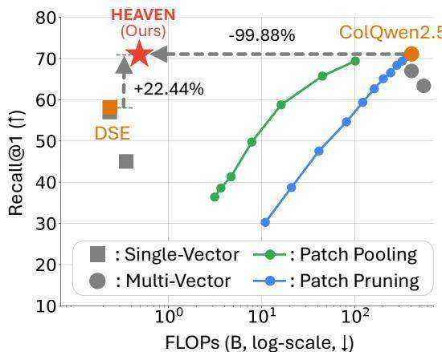
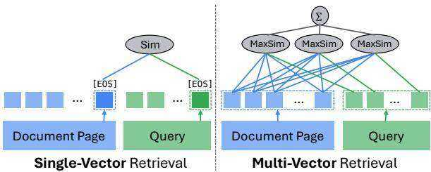
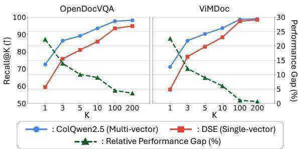
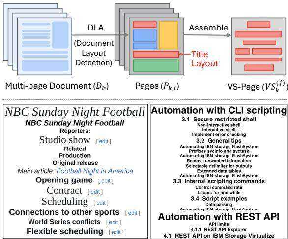
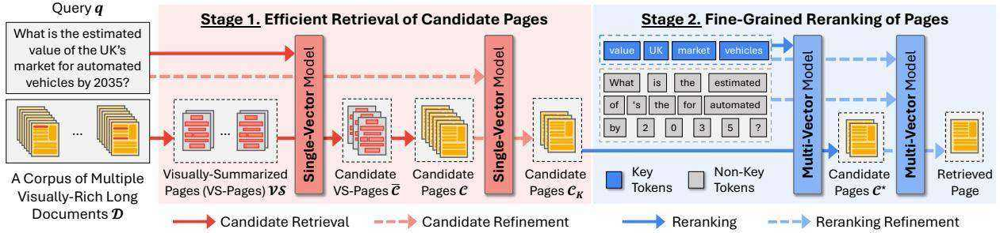
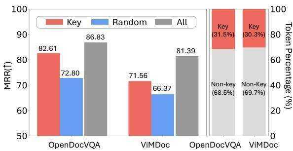
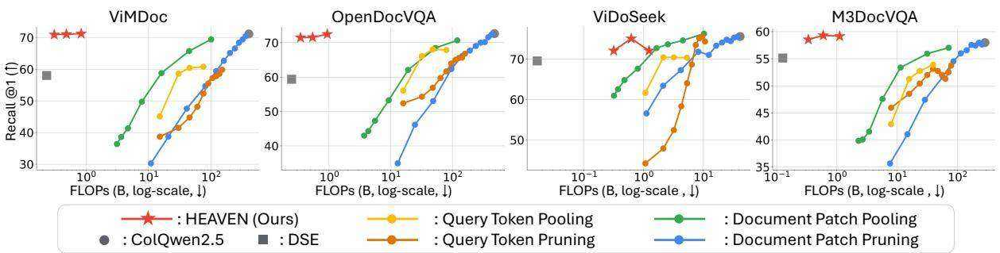
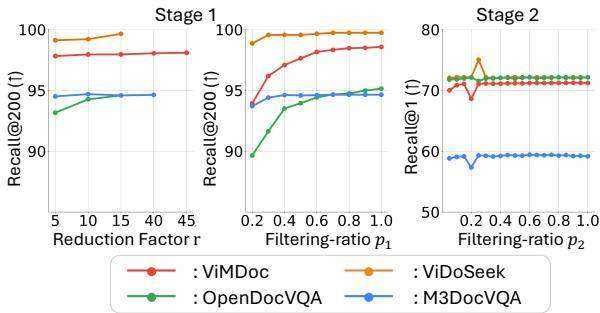
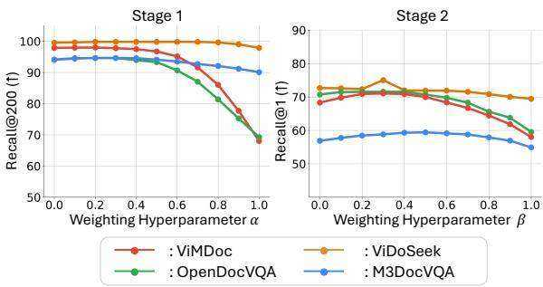

# Hybrid-Vector Retrieval for Visually Rich Documents: Combining Single-Vector Efficiency and Multi-Vector Accuracy

Juyeon Kim1 Geon Lee1 Dongwon Choi1 Taeuk ${ \bf K i m ^ { 2 * } }$ Kijung Shin1\* 1KAIST 2Hanyang University {juyeonkim, geonlee0325, cookie000215, kijungs}@kaist.ac.kr kimtaeuk@hanyang.ac.kr

# Abstract

Retrieval over visually rich documents is essential for tasks such as legal discovery, scientific search, and enterprise knowledge management. Existing approaches fall into two paradigms: single-vector retrieval, which is efficient but coarse, and multi-vector retrieval, which is accurate but computationally expensive. To address this trade-off, we propose HEAVEN, a plug-and-play two-stage hybrid-vector framework. In the first stage, HEAVEN efficiently retrieves candidate pages using a single-vector method over Visually-Summarized Pages (VS-Pages), which assemble representative visual layouts from multiple pages. In the second stage, it reranks candidates with a multi-vector method while filtering query tokens by linguistic importance to reduce redundant computations. To evaluate retrieval systems under realistic conditions, we also introduce VIMDOC, a benchmark for visually rich, multi-document, and long-document retrieval. Across four benchmarks, HEAVEN attains $9 9 . 8 7 \%$ of the Recall $@ 1$ performance of multi-vector models on average while reducing per-query computation by $9 9 . 8 2 \%$ , achieving efficiency and accuracy. Our code and datasets are available at: https://github.com/juyeonnn/HEAVEN

# 1 Introduction

Document retrieval aims to retrieve relevant document pages from a corpus for a given query, with broad applications including legal discovery, scientific literature search, and enterprise knowledge management. With the rise of large language models (LLMs), it has gained renewed attention as a core component of Retrieval-Augmented Generation (RAG), which grounds model responses in retrieved evidence to enhance factual reliability.

While traditional document retrieval methods have primarily relied on text representations, many real-world pages contain visually complex elements, such as charts, tables, and figures, that are crucial for answering queries, motivating the task of visual document retrieval (VDR). To process such content, optical character recognition (OCR) or complex layout parsing has been employed, which increases indexing time and complexity. Recently, Large Vision-Language Models (LVLMs) have enabled directly encoding each page as an image to obtain visual embeddings, simplifying the retrieval pipeline and improving performance on visually rich documents (Faysse et al., 2025).

  
Figure 1: Performance comparison of HEAVEN with (1) single-vector models, (2) multi-vector models, and (3) efficiency-oriented variants of multi-vector models (patch pooling and pruning). HEAVEN yields the best trade-off between efficiency and accuracy on the VIM-DOC benchmark. Refer to Section 6.3 for details.

Modern VDR methods fall into two paradigms: single-vector and multi-vector retrieval. Singlevector retrieval encodes a query and a document page into single embeddings, enabling efficient similarity computation via a dot product (Yu et al., 2024; Ma et al., 2024a). In contrast, multi-vector retrieval encodes them into multiple token- or patchlevel embeddings and computes fine-grained interactions across all query–page vector pairs (Faysse et al., 2025; Xu et al., 2025; Xiao et al., 2025).

Due to their design differences, single-vector and multi-vector retrieval methods exhibit a clear trade-off between efficiency and accuracy. While single-vector retrieval methods (e.g., DSE (Ma et al., 2024a)) are highly efficient but less accurate, multi-vector retrieval methods (e.g., ColQwen 2.5 (Faysse et al., 2025)) achieve higher accuracy at a substantially greater computational cost.

To address this efficiency-accuracy trade-off, we propose HEAVEN (Hybrid-vector retrieval for Efficient and Accurate Visual multi-documENt), a hybrid framework that combines the efficiency of single-vector retrieval with the accuracy of multivector retrieval. Specifically, HEAVEN consists of two stages:

• (Stage 1) Single-Vector Retrieval of Candidate Pages: Filtering is first performed at the level of our proposed visually-summarized pages, which aggregate key visual elements across multiple pages, before applying filtering at the page level.

• (Stage 2) Multi-Vector Reranking of Pages: Candidate pages are reranked using only filtered query tokens, key tokens, reducing computation while preserving accuracy.

As shown in Figure 1, HEAVEN provides a significantly improved efficiency–accuracy trade-off. Furthermore, HEAVEN is a plug-and-play framework. Its modular design allows the base encoder at each stage to be selected or swapped separately without further training, making it seamlessly adaptable to specific domains or easily upgraded to higherperforming models.

In addition, we present VIMDOC (Visually-rich Long Multi-Document Retrieval Benchmark), a new benchmark for evaluating visual document retrieval under both multi-document and longdocument settings. Most existing VDR benchmarks either assume that queries can be resolved within a single document or focus on short documents. However, real-world applications often require retrieval across massive, multi-document collections where individual documents often span dozens of pages. VIMDOC addresses this gap.

Our contributions are summarized as follows:

• Method. We introduce HEAVEN, a plug-andplay two-stage hybrid-vector retrieval framework that effectively addresses the efficiency-accuracy trade-off in visual document retrieval.

  
Figure 2: Single- and multi-vector retrieval models.

• Benchmark. We propose VIMDOC, a benchmark for visually rich, long-context, and multidocument retrieval.

• Experiments. HEAVEN preserves $9 9 . 8 7 \%$ of the state-of-the-art retrieval performance of the multi-vector model ColQwen2.5 (in terms of Recall $@ 1$ ) while reducing per-query FLOPs by $9 9 . 8 2 \%$ across four multi-document benchmarks.

# 2 Preliminaries

We define the problem of document retrieval and review two main paradigms for addressing it.

# 2.1 Problem Definition

Let $\mathcal { D } = \{ D _ { 1 } , D _ { 2 } , . . . , D _ { | \mathcal { D } | } \}$ denote a collection of documents. Each document $D _ { k } \ \in \ { \mathcal { D } }$ is represented as an ordered sequence of pages, $D _ { k } =$ $( P _ { k , 1 } , P _ { k , 2 } , \ldots , P _ { k , | D _ { k } | } )$ , where $P _ { k , i }$ denotes the $i$ th page of the document $D _ { k }$ . Let $\mathcal { P } = \cup _ { D _ { k } \in \mathcal { D } } D _ { k }$ denote the set of all pages across the corpus.

We focus on page-level retrieval. Given a query $q$ , the goal is to find a set of ground-truth pages $\mathcal { P } _ { q } \subseteq \mathcal { P }$ , where the pages in $\mathcal { P } _ { q }$ collectively provide the information required to answer the query.

# 2.2 Retrieval Frameworks

A typical retrieval system represents a query $q$ and a page $P$ as embeddings in a shared latent space (see Figure 2). Specifically, the query is represented as $\mathbf { E } _ { q } \in \mathbb { R } ^ { n _ { q } \times d }$ and the page as ${ \bf E } _ { P } \in \mathbb { R } ^ { n _ { P } \times d }$ , where $n _ { q }$ and $n _ { P }$ denote the number of vectors (e.g., tokens or patches) used to represent the query and page, respectively, and $d$ is the embedding dimension. The system ranks pages by the relevance score using ${ \bf E } _ { q }$ and $\mathbf { E } _ { P }$ and outputs the top- $K$ results.

Single-Vector Retrieval. In single-vector retrieval, both queries and pages are represented by single embeddings rather than all token-level representations. Typically, this vector is obtained from a special token (e.g., an [EOS] token) or by aggregating over all token vectors (e.g., mean pooling). The relevance score is computed as the similarity (e.g., dot product) between the query and page vectors:

  
Figure 3: Multi-vector models (e.g., ColQwen2.5) outperform single-vector models (e.g., DSE), with pronounced gaps at fine-grained retrieval $\scriptstyle ( \mathrm { K } = 1 )$ but much smaller gaps at coarse-grained retrieval $\scriptstyle ( \mathrm { K } = 2 0 0 )$ ).

$$
S _ { \mathrm { S V } } ( q , P ) = \langle \tilde { \bf E } _ { q } , \tilde { \bf E } _ { P } \rangle ,
$$

where $\tilde { \mathbf { E } } _ { q } , \tilde { \mathbf { E } } _ { P } \in \mathbb { R } ^ { d }$ denote the single-vector representations of the query $q$ and the page $P$ , respectively. For each query, a single dot product is computed per page, resulting in $O ( d | \mathcal { P } | )$ time to score all pages in the corpus.

Multi-Vector Retrieval. In multi-vector retrieval, the relevance score between a query and a page is computed by aggregating fine-grained interactions between all pairs of their embeddings:

$$
S _ { \mathrm { M V } } ( q , P ) = \sum _ { i = 1 } ^ { n _ { q } } \operatorname* { m a x } _ { j \in \{ 1 , \cdots , n _ { P } \} } \langle \mathbf { E } _ { q } ^ { ( i ) } , \mathbf { E } _ { P } ^ { ( j ) } \rangle ,
$$

  
Figure 4: Top: Visually-summarized pages (VS-pages) construction process. Bottom: Example outputs. More examples are provided in Appendix A.2.

(Obs. 2) Single-Vector Retrieval can be Acceptable for Coarse-Grained Retrieval. As shown in Figure 3, single-vector retrieval is generally less accurate than multi-vector retrieval, as it cannot capture fine-grained token/patch–level interactions. However, this gap narrows as more candidates (larger top- $K$ ) are considered. For instance, the performance gap is $2 2 . 5 \%$ at Recall $@ 1$ but only $0 . 6 3 \%$ at Recall $@ 2 0 0$ in VIMDOC. Thus, while multivector retrieval is superior for precise matching, single-vector retrieval can be sufficient for coarsegrained retrieval with broader candidate sets.

where E(i)q a nd $\mathbf { E } _ { P } ^ { ( j ) }$ denote the $i$ -th and $j$ -th row vectors of ${ \bf E } _ { q }$ and $\mathbf { E } _ { P }$ , respectively. Intuitively, this formulation finds, for each query token, the most relevant patch in the page and then sums these maximum similarities to produce the final score. For a query $q$ , scoring a page $P$ requires $O ( d n _ { q } n _ { P } )$ time, and thus scoring all pages requires $O ( d n _ { q } \sum _ { P \in \mathcal { P } } n _ { P } )$ time.

# 3 Analysis

We empirically compare the two retrieval frameworks to examine their trade-offs. As shown in Figures 1 and 3, we present two key observations:

(Obs. 1) Single-Vector Retrieval is More Efficient Than Multi-Vector Retrieval. Singlevector retrieval computes only one dot product per query-page pair, while multi-vector retrieval requires multiple comparisons. As shown in Figure 1, single-vector retrieval is notably more efficient, requiring up to $9 9 . 9 4 \%$ fewer FLOPs per query in VIMDOC, making it scalable for large corpora.

# 4 Proposed Method: HEAVEN

Motivated by our observations (Section 3), we propose HEAVEN (Figure 5), a two-stage hybridvector framework combining the efficiency of single-vector and the accuracy of multi-vector retrieval for visual document retrieval. Additionally, HEAVEN is plug-and-play. The single-vector and multi-vector models at each stage can be selected or replaced without further training, making it seamlessly adaptable to specific domains or easily upgradeable to stronger models.

# 4.1 Stage 1. Single-Vector Retrieval of Candidate Pages

In the first stage, HEAVEN leverages our observation that single-vector retrieval is both efficient and sufficiently accurate for coarse-grained retrieval. Thus, we use it to rapidly select a subset of candidate pages from a large document corpus.

Despite its efficiency, existing single-vector retrieval models (e.g., DSE) compute similarities between the query and every page in the corpus, which scales linearly with the total number of pages, i.e., $| \mathcal { P } |$ . However, most pages are irrelevant to the query, making computation over the entire corpus redundant. Furthermore, many pages contain repetitive or uninformative content (e.g., recurring logos, headers, or boilerplate text), while only a few elements are actually informative and important for retrieving relevant pages to the query.

  
Figure 5: Overall pipeline of HEAVEN. (Stage 1) Efficiently retrieves coarse candidate pages via single-vector retrieval, enhanced with visually-summarized pages (VS-pages). (Stage 2) Refines and reranks these candidates using a multi-vector model, enhanced with filtered key query tokens, for fine-grained retrieval.

Visually-Summarized Pages (VS-pages). To reduce this redundancy, we introduce visuallysummarized pages (VS-pages). As illustrated in Figure 4, multiple pages in a document are compressed into a smaller number of VS-pages, each summarizing several pages by cropping representative layouts (specifically, title layouts) and assembling them into a single page.

VS-page Construction (Indexing Phase Only). Given a document $D _ { k } = ( P _ { k , 1 } , P _ { k , 2 } , \ldots , P _ { k , | D _ { k } | } )$ , we first apply Document Layout Analysis (DLA) to each page $P _ { k , i } \in D _ { k }$ to extract its title layouts:

$$
T _ { k , i } = \mathsf { D L A } ( P _ { k , i } ) = \{ t _ { k , i } ^ { ( 1 ) } , t _ { k , i } ^ { ( 2 ) } , \ldots , t _ { k , i } ^ { ( | T _ { k , i } | ) } \} ,
$$

where $t _ { k , i } ^ { ( j ) }$ is the $j$ -th title layout extracted from page $P _ { k , i }$ . Let $\begin{array} { r } { T _ { k } = \cup _ { i = 1 } ^ { \left| D _ { k } \right| } T _ { k , i } } \end{array}$ denote the set of layouts aggregated from all pages of document $D _ { k }$ .

Then, we partition $T _ { k }$ into $\lceil | D _ { k } | / r \rceil$ groups, where $r$ is a predefined reduction factor that controls the number of consecutive pages summarized by each VS-page. Each group $\bar { T } _ { k } ^ { ( \bar { j } ) }$ thus contains approximately $| T _ { k } | \cdot r / | D _ { k } |$ title layouts. The $j$ -th VS-page of $D _ { k }$ is defined as:

$$
\mathrm { V S } _ { k } ^ { ( j ) } \ = \ \mathsf { A s s e m b l e } \big ( T _ { k } ^ { ( j ) } \big ) , j = 1 , \ldots , \lceil \lfloor D _ { k } \rfloor / r \rceil ,
$$

where Assemble $( \cdot )$ is a function that composes the layouts into a single page. Finally, the set of

VS-pages for $D _ { k }$ is defined as:

$$
\mathrm { V S } _ { k } = \{ \mathrm { V S } _ { k } ^ { ( 1 ) } , \ldots , \mathrm { V S } _ { k } ^ { ( \lceil \lvert D _ { k } \rvert / r \rceil ) } \} .
$$

Let $\begin{array} { r c l } { \mathcal { V } S } & { = } & { \bigcup _ { D _ { k } \in \mathcal { D } } \mathrm { V } \mathrm { S } _ { k } } \end{array}$ denote the set of all VS-pages across the corpus. Since each VS-page summarizes multiple pages, $| \nu S | < | \mathcal { P } |$ holds. We define the set $\Gamma ( \mathrm { V S } _ { k } ^ { ( j ) } ) = \{ P _ { k , i } \in \mathcal { P } : T _ { k , i } \cap T _ { k } ^ { ( j ) } \neq \emptyset \}$ $\mathrm { V S } _ { k } ^ { ( j ) }$

Importantly, VS-page construction is performed only once at indexing time, and thus does not add additional overhead during query-time inference. Further details are provided in Appendix A.1.

Candidate VS-page Retrieval. Given a query $q$ , we compute similarities with the constructed VS-pages (fewer than the pages). A single-vector retrieval model scores each $\mathrm { V S } \in \mathcal { V S }$ as:

$$
S _ { \mathrm { S V } } ( q , \mathrm { V S } ) = \langle \tilde { \mathbf { E } } _ { q } , \tilde { \mathbf { E } } _ { \mathrm { V S } } \rangle , \quad \forall \mathrm { V S } \in \mathcal { V S } ,
$$

where $\tilde { \mathbf { E } } _ { q }$ , $\tilde { \mathbf { E } } _ { \mathrm { V S } } \in \mathbb { R } ^ { d }$ are the single-vector representation of the query and the VS-page, respectively. Then, we rank all VS-pages based on their scores and retain the top- $( p _ { 1 } \times 1 0 0 ) \%$ as candidates, denoted by $\overline { { \mathcal { C } } }$ , where $p _ { 1 }$ is a hyperparameter.

Candidate Page Refinement. From the candidate VS-pages ${ \overline { { \mathcal { C } } } } \subset \mathcal { V } { S }$ , we expand to their associated pages, i.e., $\mathcal { C } = \cup _ { \mathrm { V S } \in \overline { { \mathcal { C } } } } \Gamma ( \mathrm { V S } )$ . To refine these page candidates, we integrate both VS-page-level and page-level scores. For each candidate page $P \in { \mathcal { C } }$ , the combined score is defined as:

$S _ { \mathrm { S V } } ^ { * } ( q , P ) = \alpha S _ { \mathrm { S V } } ( q , \Gamma ^ { - 1 } ( P ) ) { + } ( 1 { - } \alpha ) S _ { \mathrm { S V } } ( q , P ) ,$ where $\Gamma ^ { - 1 } ( P )$ denotes the VS-page associated with page $P$ , and $\alpha$ is a weighting hyperparameter. This score integrates both the VS-page-level score $S _ { \mathrm { S V } } ( q , \Gamma ^ { - 1 } ( P ) )$ and the page-level score $S _ { \mathrm { S V } } ( q , P )$ . Then, we rank the pages in $\mathcal { C }$ by $S _ { \mathrm { S V } } ^ { * } ( q , P )$ and select the top- $K$ pages as the refined candidate set $\mathcal { C } _ { K }$ .

  
Figure 6: Using only key tokens is reasonably effective, despite their small proportion $( \approx 3 0 \% )$ ) within queries.

# 4.2 Stage 2. Multi-Vector Reranking of Pages

In the second stage, HEAVEN adopts a multivector framework to rerank the candidate set $\mathcal { C } _ { K }$ obtained from Stage 1, computing fine-grained similarities across token- or patch-level embeddings of the query and each page for more precise ranking.

However, queries often include tokens that are less informative for the task (e.g., stopwords). Multi-vector models nonetheless compute similarities between all query tokens and all page embeddings, causing redundant computation.

Reranking with Filtered Query Tokens. To reduce redundant computation, we filter query tokens based on their linguistic importance. Given a query $q$ with $n _ { q }$ tokens $q = \{ q ^ { ( \mathrm { ( 1 ) } } , q ^ { ( 2 ) } , \dots , q ^ { ( n _ { q } ) } \}$ , we apply Part-of-Speech (POS) tagging to identify a subset of key tokens $q _ { \mathrm { k e y } } \subseteq q$ (e.g., nouns or named entities), which account for about $30 \%$ of tokens on average, as described in Figure 6.

The multi-vector relevance score between a filtered query $q _ { \mathrm { k e y } }$ and a candidate page $P \in { \mathcal { C } } _ { K }$ is:

$$
S _ { \mathrm { M V } } ( q _ { \mathrm { k e y } } , P ) = \sum _ { i = 1 } ^ { | q _ { \mathrm { k e y } } | } \operatorname* { m a x } _ { j \in \{ 1 , . . . , n _ { P } \} } \langle \mathbf { E } _ { q _ { \mathrm { k e y } } } ^ { ( i ) } , \mathbf { E } _ { P } ^ { ( j ) } \rangle ,
$$

where $\mathbf { E } _ { q _ { \mathrm { k e y } } } ^ { ( i ) }$ and E(j ) denote the embeddings of the $i$ -th key token and the $j$ -th page patch, respectively. This reduces the similarity computation by a factor of $| q _ { \mathrm { k e y } } | / n _ { q }$ . We use these scores to rerank the candidate pages $\mathcal { C } _ { K }$ from Stage 1 and retain the top- $( p _ { 2 } \times 1 0 0 ) \%$ as the final candidate set ${ \mathcal { C } } ^ { \star } \subseteq { \mathcal { C } } _ { K }$

Despite using fewer tokens, it achieves performance comparable to using all tokens and outperforms using the same number of random tokens, as shown in Figure 6. While prior work reduces multivector retrieval complexity by pruning or pooling textual tokens (Santhanam et al., 2022a; Clavié et al., 2024) or visual patches (Faysse et al., 2025; Ma et al., 2025; Yan et al., 2025) of the documents, we demonstrate in Section 6 the effectiveness of filtering tokens of the queries instead.

Table 1: Comparison of VDR datasets. VIMDOC features multiple long documents with cross-page queries.   

<table><tr><td rowspan=1 colspan=1>Benchmarks(Test Split)</td><td rowspan=1 colspan=1>Document Page#Total Avg./Doc|</td><td rowspan=1 colspan=1>Query|#Total #Cross|</td><td rowspan=1 colspan=2>Multi- Long- Cross-Doc DocQuery</td></tr><tr><td rowspan=1 colspan=1>MP-DocVQAVisR-Bench</td><td rowspan=2 colspan=1>6.2k  6.524.2k  18.58.0k  20.0</td><td rowspan=2 colspan=1>5.0k  135.6k  -2.2k 0.6k</td><td rowspan=2 colspan=2>√</td></tr><tr><td rowspan=1 colspan=1>SlideVQA</td></tr><tr><td rowspan=1 colspan=1>MMDocIRMMLongBench-DocLongDocURL</td><td rowspan=1 colspan=1>20.4k  65.16.5k  47.533.9k 85.6</td><td rowspan=1 colspan=1>1.7k 0.3k1.1k 0.4k2.3k 1.2k</td><td rowspan=1 colspan=2>√   √√   √√  √</td></tr><tr><td rowspan=1 colspan=1>ViDoRE</td><td rowspan=1 colspan=1>8.3k  1.0</td><td rowspan=1 colspan=1>3.8k  -</td><td rowspan=3 colspan=2>√√√   √</td></tr><tr><td rowspan=1 colspan=1>ViDoSeek</td><td rowspan=1 colspan=1>5.4k  18.4</td><td rowspan=1 colspan=1>1.1k   -</td></tr><tr><td rowspan=1 colspan=1>REAL-MM-RAG</td><td rowspan=1 colspan=1>8.6k  52.8</td><td rowspan=1 colspan=1>4.6k   -</td><td rowspan=1 colspan=1>√</td></tr><tr><td rowspan=2 colspan=1>M3DocVQAVisDoM</td><td rowspan=1 colspan=1>41.1k  12.2</td><td rowspan=2 colspan=1>2.4k  ↑2.3k  +</td><td rowspan=2 colspan=1>√√</td><td rowspan=3 colspan=1>√         √√        √√        √</td></tr><tr><td rowspan=1 colspan=1>21.0k  16.4</td></tr><tr><td rowspan=1 colspan=1>OpenDocVQA</td><td rowspan=1 colspan=1>106.7k 3.1</td><td rowspan=1 colspan=1>2.5k 0.3k</td><td></td></tr><tr><td rowspan=1 colspan=1>VIMDOC (Ours)</td><td rowspan=1 colspan=1>76.3k 55.4</td><td rowspan=1 colspan=1>10.9k0.7k</td><td rowspan=1 colspan=2>√  √  √</td></tr></table>

† Page-level label not provided.

Reranking Refinement. With the reduced set of candidate pages ${ \mathcal { C } } ^ { \star } \subset { \mathcal { P } }$ , we now perform a precise reranking using all query tokens, i.e., $S _ { \mathrm { M V } } ( q , P )$ . For each candidate page $P \in { \mathcal { C } } ^ { \star }$ , we refine the score by integrating the single-vector score $S _ { \mathrm { S V } } ^ { * } ( q , P )$ from Stage 1 with the multi-vector score:

$$
S _ { \mathrm { M V } } ^ { * } ( q , P ) = \beta S _ { \mathrm { S V } } ^ { * } ( q , P ) + ( 1 - \beta ) S _ { \mathrm { M V } } ( q , P ) ,
$$

where $\beta$ is a weighting hyperparameter. Finally, we rank the pages in ${ \mathcal { C } } ^ { \star }$ by $S _ { \mathrm { M V } } ^ { * } ( q , P )$ to obtain the final retrieval results.

# 5 Proposed Benchmark: VIMDOC

A corpus often contains numerous documents, each spanning multiple pages. Thus, retrieval systems should be evaluated under two realistic settings: (i) the multi-document setting, where relevant pages for a query may appear across documents, and (ii) the long-document setting, where individual documents are lengthy (e.g., ${ > } 2 0$ pages). To address this, we propose VIMDOC, a visual document retrieval benchmark that jointly consider both settings.

# 5.1 Existing Benchmarks

Table 1 shows that existing benchmarks for VDR do not jointly consider both the multi-document and long-context settings. Most focus on retrieving a relevant page from a single gold-standard document, which is often short (e.g., MP-DocVQA (Tito et al., 2023), VisR-Bench (Chen et al., 2025), Slide-VQA (Tanaka et al., 2023)) or, in some cases, long but still restricted to a single-document setting (e.g.,

Table 2: Comparison with sourced benchmarks. While most are limited to single-document settings with a small search space, VIMDOC supports retrieval across a larger, multi-document corpus.   

<table><tr><td rowspan="2">Benchmarks</td><td colspan="2">Avg. Search Space</td><td rowspan="2">Corpus</td></tr><tr><td>#Page</td><td>#Doc</td></tr><tr><td>VisR-Bench</td><td>18.5</td><td>1.0</td><td>Single-Doc</td></tr><tr><td>MMDocIR</td><td>65.1</td><td>1.0</td><td>Single-Doc</td></tr><tr><td>MMLongBench-Doc</td><td>47.5</td><td>1.0</td><td>Single-Doc</td></tr><tr><td>LongDocURL</td><td>85.6</td><td>1.0</td><td>Single-Doc</td></tr><tr><td>REAL-MM-RAG</td><td>2151.0</td><td>40.8</td><td>Multi-Doc</td></tr><tr><td>VIMDOC (Ours)</td><td>76347.0</td><td>1379.0</td><td> Multi-Doc</td></tr></table>

MMLongBench-Doc (Ma et al., 2024b), MMDocIR (Dong et al., 2025), LongDocURL (Deng et al., 2025)). Some benchmarks evaluate retrieval across multiple documents, but their documents are generally short, averaging only 1.0 - 18.4 pages (e.g., ViDoRe (Faysse et al., 2025), ViDoSeek (Wang et al., 2025), OpenDocVQA (Tanaka et al., 2025), M3DocVQA (Cho et al., 2025), VisDoM (Suri et al., 2025)). As a result, these benchmarks fail to capture the combined challenge of retrieving relevant information across multiple long documents.

# 5.2 Design of VIMDOC

VIMDOC is designed to evaluate VDR systems under both the multi-document and long-document settings. It consists of visually rich documents and provides queries with page-level ground-truth annotations, including those with ground truth labels spanning multiple pages (i.e., cross-page queries).

Document Collection. We collect documents that (1) contain visually rich content such as figures, tables, and charts, and (2) consist of many pages, with an average length exceeding 20 pages. Specifically, we include documents from VisR-Bench (Chen et al., 2025), REAL-MM-RAG (Wasserman et al., 2025), MMLongBench-Doc (Ma et al., 2024b), MMDocIR (Dong et al., 2025), and LongDocURL (Deng et al., 2025), resulting in 1,379 documents spanning 76,347 pages. See Appendix B.1 for details.

Query Processing. As shown in Table 2, many sourced queries are designed for single-document settings. Some are therefore context-dependent— relying on generic cues (e.g., “what is the title”) or positional hints (e.g., “from the last page”)—and thus unsuitable for multi-document retrieval. Following Tanaka et al. (2025) and Wang et al. (2025), we retain only self-contained queries with distinctive keywords such as named entities or technical terms, enabling retrieval across the union of all document pages. $4 5 . 8 \%$ of queries identified as context-dependent are removed via a two-stage filtering pipeline: (1) heuristic rule-based filtering and (2) LLM-based filtering. The retained queries can thus be evaluated in a multi-document setting with a larger search space than their sourced benchmarks. Details are provided in Appendix B.2.

# 6 Experimental Results

In this section, we present the overall experimental setup and results, including comparisons with baselines, ablation study, efficiency analysis, hyperparameter analysis, and plug-and-play analysis.

# 6.1 Settings

Models. Two categories of retrieval models are utilized for evaluation. For single-vector retrieval, visual embedding models including VisRAG (Yu et al., 2024), GME (Zhang et al., 2025) and DSE (Ma et al., 2024a) are utilized, as well as textual embedding models NV-Embed-V2 (Lee et al., 2024) and BGE-M3 (dense) (Chen et al., 2024). For multi-vector retrieval, ColPali, ColQwen2, ColQwen2.5 (Faysse et al., 2025), and BGE-M3 (multi-vec) (Chen et al., 2024) are employed. Additional implementation details and model checkpoints are provided in Appendix C.1.

Datasets. HEAVEN is tested on 4 benchmarks: VIMDOC, OpenDocVQA (Tanaka et al., 2025), Vi-DoSeek (Wang et al., 2025) and M3DocVQA (Cho et al., 2025). For OpenDocVQA, only the Slide-VQA (Tanaka et al., 2023) and DUDE (Van Landeghem et al., 2023) splits are used, as these are the only multi-page document splits. Detailed benchmark statistics are provided in Appendix C.2.

Evaluation Metrics. We evaluate retrieval performance using page-level Recall $@$ {1,3}, except for M3DocVQA, where document-level metrics are used due to missing page-level labels. Efficiency is measured by per-query FLOPs (billions) and latency (seconds). See Appendix C.3 for details.

Implementation Details. HEAVEN uses DSE for Stage 1 and ColQwen2.5 for Stage 2. For document layout analysis, it uses DocLayout-YOLO (Zhao et al., 2024). For each document $D _ { k }$ , the reduction factor $r$ is set to $\operatorname* { m i n } ( 1 5 , | D _ { k } | )$ . Default hyperparameters are $\alpha = 0 . 1$ , $\beta = 0 . 3$ , $p _ { 1 } = 0 . 5$ $p _ { 2 } = 0 . 2 5$ , and $K = 2 0 0$ . For M3DocVQA, $\alpha$ and $\beta$ are set to 0.4 due to document-level evaluation. nltk is used for POS tagging for key token selection (Appendix A.3), and Tesseract (Smith, 2007) is used to preprocess documents for textual retrieval.

Table 3: Efficiency–accuracy comparison with various single-vector and multi-vector models for visual document retrieval. We report Recall $@$ {1,3} and per-query FLOPs (billions) for HEAVEN, compared with both singlevector and multi-vector models. The relative performance $( \% )$ for Recall is highlighted in blue, and the FLOPs is highlighted in red. $\boxed { \\equiv }$ indicates a textual embedding model and Õ indicates a visual embedding model.   

<table><tr><td></td><td colspan="3">VIMDOC (Proposed)</td><td colspan="3">OpenDocVQA</td><td colspan="3">ViDoSeek</td><td colspan="3">M3DocVQA</td><td colspan="3">AVERAGE</td></tr><tr><td>Model</td><td>R@1</td><td>R@3</td><td>FLOPs</td><td>R@1</td><td>R@3</td><td>FLOPs|</td><td>R@1</td><td>R@3</td><td>FLOPs|</td><td>R@1</td><td>R@3</td><td>FLOPs</td><td>R@1</td><td>R@3</td><td>FLOPs</td></tr><tr><td>BGE-M3 (dense)</td><td>44.89</td><td>61.62</td><td>0.156</td><td>38.67</td><td>52.45</td><td>0.165</td><td>54.82</td><td>76.01</td><td>0.011</td><td>57.56</td><td>77.11</td><td>0.084</td><td>48.99</td><td>66.80</td><td>0.104</td></tr><tr><td>NV-Embed-V2</td><td>50.06</td><td>69.08</td><td>0.625</td><td>47.37</td><td>64.59</td><td>0.658</td><td>66.46</td><td>83.89</td><td>0.044</td><td>62.65</td><td>85.77</td><td>0.336</td><td>56.64</td><td>75.83</td><td>0.416</td></tr><tr><td>VisRAG</td><td>45.03</td><td>64.49</td><td>0.352</td><td>51.41</td><td>67.39</td><td>0.370</td><td>63.31</td><td>84.33</td><td>0.025</td><td>50.39</td><td>69.59</td><td>0.189</td><td>52.53</td><td>71.45</td><td>0.234</td></tr><tr><td>GME</td><td>57.01</td><td>76.62</td><td>0.235</td><td>54.19</td><td>71.93</td><td>0.247</td><td>71.19</td><td>89.40</td><td>0.017</td><td>59.85</td><td>77.83</td><td>0.126</td><td>60.56</td><td>78.95</td><td>0.156</td></tr><tr><td>DSE</td><td>58.03</td><td>77.08</td><td>0.235</td><td>59.38</td><td>75.82</td><td>0.247</td><td>69.53</td><td>87.13</td><td>0.017</td><td>55.14</td><td>71.30</td><td>0.126</td><td>60.52</td><td>77.83</td><td>0.156</td></tr><tr><td>HEAVEN (only Stage 1)</td><td></td><td>57.6476.58</td><td>0.134</td><td>59.89</td><td>76.05</td><td>0.147</td><td>69.35</td><td>87.39</td><td>0.010</td><td>59.40</td><td>73.96</td><td>0.026</td><td>61.57</td><td>78.50</td><td>0.079</td></tr><tr><td>(vs. DSE)</td><td></td><td>99.34% 99.35%</td><td>-42.76%</td><td>100.87%</td><td>100.32%</td><td>-40.47%</td><td>99.75% 100.30%</td><td></td><td>-42.40%</td><td></td><td>107.73% 103.73%</td><td>-79.67%</td><td>101.74%</td><td>100.86%</td><td>-49.31%</td></tr><tr><td>BGE-M3 (multi)</td><td>53.60</td><td>70.66</td><td>5863.387</td><td>46.60</td><td>62.80</td><td>888.097</td><td>56.74</td><td>76.01</td><td>30.777</td><td>56.88</td><td>76.96</td><td>1408.110|</td><td>53.46</td><td>71.61</td><td>2047.590</td></tr><tr><td>ColPali</td><td>63.38</td><td>80.58</td><td>669.670</td><td>67.50</td><td>82.13</td><td>665.152</td><td>66.29</td><td>84.41</td><td>57.086</td><td>58.01</td><td>78.65</td><td>398.295</td><td>63.79</td><td>81.44</td><td>447.551</td></tr><tr><td>Jieepiii ColQwen2</td><td>66.99</td><td>82.51</td><td>407.320</td><td>72.27</td><td>86.14</td><td>482.049</td><td>75.13</td><td>90.63</td><td>41.514</td><td>59.32</td><td>80.69</td><td>288.507</td><td>68.43</td><td>84.99</td><td>304.847</td></tr><tr><td>ColQwen2.5</td><td>71.13</td><td>86.39</td><td>407.320</td><td>72.63</td><td>86.38</td><td>482.049</td><td>75.57</td><td>91.94</td><td>41.514</td><td>57.99</td><td>78.73</td><td>288.507</td><td>69.33</td><td>85.86</td><td>304.847</td></tr><tr><td>HEAVEN</td><td>71.05</td><td>86.41</td><td>0.486</td><td>71.56</td><td>84.53</td><td>0.541</td><td>75.04</td><td>91.33</td><td>0.623</td><td>59.31</td><td>78.66</td><td>0.545</td><td>69.24</td><td>85.23</td><td>0.549</td></tr><tr><td>(vs. ColQwen2.5)</td><td></td><td>99.88% 100.02%</td><td>-99.88%</td><td></td><td>98.52%97.86%-99.89%</td><td></td><td></td><td></td><td>99.30% 99.33%-98.50%</td><td></td><td>102.27% 99.90%</td><td>-99.81%</td><td></td><td>99.87%99.27%</td><td>-99.82%</td></tr></table>

  
Figure 7: Efficiency-accuracy comparison with four efficiency-oriented variants of the ColQwen2.5-based multivector model: (1) document patch pooling (Faysse et al., 2025) and (2) document patch pruning (Ma et al., 2025; Yan et al., 2025) are applied to document patch embeddings; (3) query token pooling and (4) query token pruning are applied to query tokens using the same strategies.

# 6.2 Main Results

We first evaluate HEAVEN against state-of-the-art textual and visual retrieval models. As shown in Table 3, on average, HEAVEN preserves $9 9 . 8 9 \%$ of ColQwen2.5’s retrieval performance while reducing FLOPs by $9 9 . 8 2 \%$ . In M3DocVQA, its Stage 1 surpasses DSE by $7 . 7 3 \%$ in Recall $@ 1$ with $7 9 . 6 7 \%$ fewer FLOPs, and Stage 2 further improves performance by $2 . 2 7 \%$ while using $9 9 . 8 1 \%$ fewer FLOPs than ColQwen2.5. Notably, the clear performance gap between textual and visual methods in VIMDOC and OpenDocVQA reveals the unique challenges of visual document retrieval. Table 12 in Appendix C.5 further reports results separately for cross-page and single-page query types.

# 6.3 Comparison with Efficiency Variants

We evaluate HEAVEN’s efficiency against four approaches designed to enhance efficiency in multivector retrieval models: (1) Document Patch Pooling (Faysse et al., 2025), which pools adjacent patches within each page; (2) Document Patch Pruning (Ma et al., 2025; Yan et al., 2025), which randomly removes patch embeddings; (3) Query Token Pooling, which aggregates adjacent special query tokens; and (4) Query Token Pruning, which randomly drops them. Each approach is evaluated under varying pooling factors and pruning ratios. Refer to Appendix C.4 for details.

Figure 7 shows that HEAVEN achieves the best efficiency-accuracy trade-off. While pooling generally outperforms pruning, its performance drops as FLOPs decrease. In contrast, HEAVEN attains higher accuracy with significantly fewer FLOPs.

Table 4: Ablation study of Stage 1 and Stage 2. Each component of HEAVEN is effective for coarsegrained retrieval (Recall $@$ {100,200}) in Stage 1 and fine-grained retrieval (Recall $@$ {1,3}) in Stage 2.   

<table><tr><td></td><td>VIMDOC (Proposed)</td><td></td><td>OpenDocVQA</td></tr><tr><td>Stage 1</td><td> R@100 R@ 200 FLOPs|R@100 R@ 200 FLOPs</td><td></td><td></td></tr><tr><td>HEAVEN</td><td>97.20 97.96</td><td>0.134</td><td>93.02 94.59 0.147</td></tr><tr><td> w/o VS-pages</td><td>97.68 98.51</td><td>0.235</td><td>93.54 94.86 0.247</td></tr><tr><td>w/o refinement</td><td>59.47 68.02</td><td>0.017</td><td>59.47 68.02 0.024</td></tr><tr><td>Stage 2</td><td>R@1 R@3</td><td> FLOPs</td><td>R@1 R@3 FLOPs</td></tr><tr><td>HEAVEN</td><td>71.05 86.41</td><td>0.486</td><td>71.56 84.53 0.541</td></tr><tr><td>w/o query filtering</td><td>71.08 86.38</td><td>0.871 71.76</td><td>85.10 0.957</td></tr><tr><td>w/o refinement</td><td>58.05 77.08</td><td>0.358 59.53</td><td>75.82 0.402</td></tr></table>

# 6.4 Ablation Study

To verify the effectiveness of each component in HEAVEN, we conduct ablation studies comparing it with its variants. For Stage 1, we evaluate two variants, one that omits VS-page construction and another that skips candidate refinement. Table 4 reports that without VS-pages, FLOPs notably increase, as all raw pages are compared, while yielding marginal accuracy gains. Skipping candidate refinement leads to a severe performance drop.

For Stage 2, we examine variants that disable query token filtering and reranking refinement. Without query filtering, FLOPs increase as similarities are computed for all query tokens, including redundant ones. Without reranking refinement, performance degrades significantly. These results confirm the importance of the elements in two stages of HEAVEN for both efficiency and accuracy.

# 6.5 Efficiency Analysis

To evaluate the efficiency of HEAVEN, we measure two types of latency: (1) Offline Indexing Latency, referring to the time required to preprocess documents before retrieval, and (2) Online Retrieval Latency, referring to the time required to process a query during retrieval.1

As shown in Table 5, HEAVEN requires additional offline processing time for VS-page construction. However, its online retrieval latency is significantly lower than that of multi-vector methods, e.g., $9 9 . 8 8 \%$ faster than ColQwen2.5 per query. Despite this efficiency, as shown in Table 3, HEAVEN achieves accuracy comparable to multi-vector models while substantially outperforming single-vector ones, confirming its strong trade-off between efficiency and accuracy.

Table 5: Efficiency analysis for offline indexing and online retrieval on VIMDOC. Offline indexing efficiency is reported for the full document corpus, and online retrieval efficiency is reported per query. VS-page construction latency includes DLA and Assemble.   

<table><tr><td rowspan="2"></td><td rowspan="2"></td><td colspan="4">VIMDOC (Proposed)</td></tr><tr><td>Offline Indexing (min)</td><td></td><td></td><td>Online Retrieval (sec, B)</td></tr><tr><td rowspan="2"></td><td>NV-Embed-V2</td><td>OCR</td><td>VS-page</td><td>Encode Latency</td><td>FLOPs</td></tr><tr><td>DSE</td><td>473.0 NA</td><td>NA 99.5 NA 146.7</td><td>0.133 0.115</td><td>0.625 0.235</td></tr><tr><td></td><td>BGE-M3 (multi) 国</td><td>473.0</td><td>NA</td><td>32.3</td><td>20953.468</td></tr><tr><td rowspan="2">ColQwen2.5 HEAVEN</td><td>NA</td><td>NA</td><td>129.1</td><td>2006.361</td><td>5863.387 407.320</td></tr><tr><td>NA</td><td>58.9</td><td>286.4</td><td>2.412</td><td>0.486</td></tr><tr><td>Stage 1</td><td></td><td>NA</td><td>58.9</td><td>157.3 0.079</td><td>0.134</td></tr><tr><td>Stage2</td><td>NA</td><td>NA</td><td>129.1</td><td>2.333</td><td>0.352</td></tr></table>

# 6.6 Hyperparameter Analysis

We analyze the sensitivity of HEAVEN to hyperparameters: the reduction factor $r$ and the filtering ratios for each stage, $p _ { 1 }$ and $p _ { 2 }$ , and the weighting hyperparameters $\alpha$ and $\beta$ . Figure 8 confirms that HEAVEN remains robust across different filtering ratios in both stages, as well as across varying reduction factor values. Notably, VS-pages are particularly effective in VIMDOC, which consists of long documents. Thus, the impact of the reduction factor is more pronounced than in other benchmarks with shorter documents (e.g., Open-DocVQA). Figure 9 shows that HEAVEN is also robust to the weighting hyperparameters $\alpha$ and $\beta$ for stage 1 and 2, respectively.

# 6.7 Plug-and-Play Analysis

HEAVEN is designed to be modular and plug-andplay, allowing the single-vector (Stage 1) and multivector (Stage 2) encoders to be replaced with other pretrained models. Table 6 reports results across combinations of two Stage 1 and three Stage 2 base encoders. Among the evaluated combinations, DSE (Stage 1) and ColQwen2.5 (Stage 2) achieve the best overall performance on both VIMDOC and OpenDocVQA, and are therefore adopted as the default configuration.

# 7 Related Work

Visual Document Retrieval. Visual document retrieval matches queries against document image corpora. Recent methods based on LVLMs (Jiang et al., 2025; Wei et al., 2024; Lin et al., 2025), directly encode entire document pages as images, bypassing OCR (Meng et al., 2025; Zhang et al., 2025; Ma et al., 2024a). Concurrently, visual RAG leverages such visual embeddings, while multimodal approaches combine visual and textual signals using OCR (Yu et al., 2024; Suri et al., 2025; Wang et al., 2025; Sun et al., 2025) or textual summaries from LVLMs and LLMs (Jain et al., 2025; Gong et al., 2025). In contrast, HEAVEN introduces visually-summarized pages (VS-pages), an OCRfree method that enables fully-visual indexing.

  
Figure 8: Hyperparameter analysis for reduction factor $r$ , and filtering ratios $p _ { 1 }$ and $p _ { 2 }$ .

  
Figure 9: Hyperparameter analysis for weighting hyperparameters $\alpha$ and $\beta$ .

Multi-Vector Retrieval. Building on the lateinteraction mechanism of ColBERT (Khattab and Zaharia, 2020), recent work has extended multivector retrieval to VDR (Faysse et al., 2025; Xu et al., 2025; Xiao et al., 2025). Although accurate, these models incur high computational overhead. Textual domain work addresses this via compression (Santhanam et al., 2022b), approximation (Jayaram et al., 2024), and token reduction via pruning (Santhanam et al., 2022a; Acquavia et al., 2023) or pooling (Clavié et al., 2024), while VDR methods apply patch pruning (Yan et al., 2025) and pooling (Faysse et al., 2025; Ma et al., 2025) to enhance efficiency with minimal loss in accuracy. In contrast, HEAVEN reduces computation by filtering query tokens while maintaining performance.

<table><tr><td colspan="2">Base Encoder</td><td colspan="3">VIMDOC (Proposed)</td><td colspan="3">OpenDocVQA</td></tr><tr><td>Stage1</td><td>Stage2</td><td>R@1</td><td>R@3</td><td>FLOPs</td><td>R@1</td><td>R@3</td><td>FLOPs</td></tr><tr><td>VisRAG</td><td>ColPali</td><td>60.95</td><td>79.19</td><td>1.298</td><td>65.27</td><td>80.02</td><td>1.287</td></tr><tr><td>VisRAG</td><td>ColQwen2</td><td>62.45</td><td>80.07</td><td>0.553</td><td>67.79</td><td>81.28</td><td>0.615</td></tr><tr><td>VisRAG</td><td>ColQwen2.5</td><td>64.06</td><td>82.07</td><td>0.553</td><td>67.54</td><td>81.40</td><td>0.615</td></tr><tr><td>DSE</td><td>ColPali</td><td>63.46</td><td>80.68</td><td>1.231</td><td>67.50</td><td>81.81</td><td>1.214</td></tr><tr><td>DSE</td><td>ColQwen2</td><td>66.63</td><td>82.63</td><td>0.486</td><td>69.91</td><td>83.31</td><td>0.541</td></tr><tr><td>DSE</td><td>ColQwen2.5</td><td>71.05</td><td>86.41</td><td>0.486</td><td>71.56</td><td>84.53</td><td>0.541</td></tr></table>

Table 6: Plug-and-play analysis of HEAVEN with different combinations of Stage 1 and Stage 2 base encoders on VIMDOC and OpenDocVQA. $\mathbb { R } \ @$ {1,3} and per-query FLOPs (billions) are reported.

# 8 Conclusion

We propose HEAVEN, a plug-and-play hybridvector framework that bridges the efficiencyaccuracy trade-off in VDR. By combining singlevector retrieval over VS-pages with multi-vector reranking using selective query tokens, HEAVEN achieves near state-of-the-art accuracy with over $9 9 \%$ lower computation. We also present VIM-DOC, a benchmark for visually rich, multidocument, and long-document retrieval. Together, they establish a scalable foundation for efficient and accurate VDR.

# Limitations

While HEAVEN substantially improves efficiency in visual document retrieval, several limitations remain. First, it relies on pretrained vision-language encoders, and its performance may vary with model scale and domain adaptation quality. Second, the visually-summarized pages used in Stage 1 depend on document layout analysis, which can be sensitive to noisy or irregular layouts. Third, HEAVEN focuses on retrieval efficiency and does not yet integrate retrieval augmentation generation, which we leave as future work.

# Acknowledgements

This work was supported by Samsung Electronics Co., Ltd. (IO251103-13845-01). This work was partly supported by Institute of Information & Communications Technology Planning & Evaluation (IITP) grant funded by the Korea government (MSIT) (No. RS-2019-II190075, Artificial Intelligence Graduate School Program (KAIST)).

