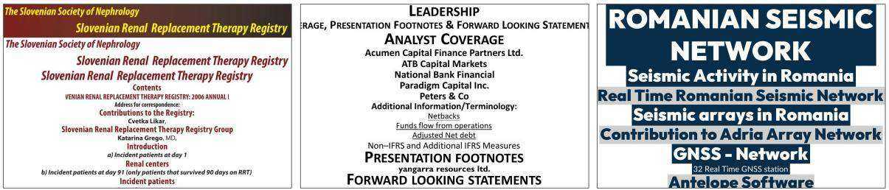
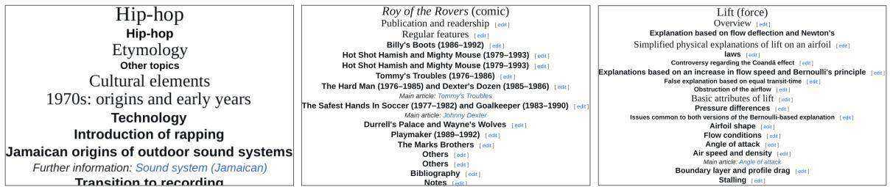

# References

Antonio Acquavia, Craig Macdonald, and Nicola Tonellotto. 2023. Static pruning for multi-representation dense retrieval. In DocEng.

Jian Chen, Ming Li, Jihyung Kil, Chenguang Wang, Tong Yu, Ryan Rossi, Tianyi Zhou, Changyou Chen, and Ruiyi Zhang. 2025. Visr-bench: An empirical study on visual retrieval-augmented generation for multilingual long document understanding. arXiv preprint arXiv:2508.07493.

Jianlv Chen, Shitao Xiao, Peitian Zhang, Kun Luo, Defu Lian, and Zheng Liu. 2024. Bge m3-embedding: Multi-lingual, multi-functionality, multi-granularity text embeddings through self-knowledge distillation. In ACL (Findings).

Jaemin Cho, Debanjan Mahata, Ozan Irsoy, Yujie He, and Mohit Bansal. 2025. M3docrag: Multi-modal retrieval is what you need for multi-page multidocument understanding. In ICCV Workshop.

Benjamin Clavié, Antoine Chaffin, and Griffin Adams. 2024. Reducing the footprint of multi-vector retrieval with minimal performance impact via token pooling. arXiv preprint arXiv:2409.14683.

Chao Deng, Jiale Yuan, Pi Bu, Peijie Wang, Zhong-Zhi Li, Jian Xu, Xiao-Hui Li, Yuan Gao, Jun Song, Bo Zheng, and 1 others. 2025. Longdocurl: a comprehensive multimodal long document benchmark integrating understanding, reasoning, and locating. In ACL.

Kuicai Dong, Yujing Chang, Xin Deik Goh, Dexun Li, Ruiming Tang, and Yong Liu. 2025. Mmdocir: Benchmarking multi-modal retrieval for long documents. In EMNLP.

Manuel Faysse, Hugues Sibille, Tony Wu, Bilel Omrani, Gautier Viaud, CELINE HUDELOT, and Pierre Colombo. 2025. Colpali: Efficient document retrieval with vision language models. In ICLR.

Ziyu Gong, Yihua Huang, and Chengcheng Mai. 2025. Mmrag-docqa: A multi-modal retrieval-augmented generation method for document question-answering with hierarchical index and multi-granularity retrieval. arXiv preprint arXiv:2508.00579.

Chelsi Jain, Yiran Wu, Yifan Zeng, Jiale Liu, Zhenwen Shao, Qingyun Wu, Huazheng Wang, and 1 others. 2025. Simpledoc: Multi-modal document understanding with dual-cue page retrieval and iterative refinement. In EMNLP.

Rajesh Jayaram, Laxman Dhulipala, Majid Hadian, Jason D Lee, and Vahab Mirrokni. 2024. Muvera: Multi-vector retrieval via fixed dimensional encoding. In NeurIPS.

Ziyan Jiang, Rui Meng, Xinyi Yang, Semih Yavuz, Yingbo Zhou, and Wenhu Chen. 2025. Vlm2vec: Training vision-language models for massive multimodal embedding tasks. In ICLR.

Omar Khattab and Matei Zaharia. 2020. Colbert: Efficient and effective passage search via contextualized late interaction over bert. In SIGIR.

Chankyu Lee, Rajarshi Roy, Mengyao Xu, Jonathan Raiman, Mohammad Shoeybi, Bryan Catanzaro, and Wei Ping. 2024. Nv-embed: Improved techniques for training llms as generalist embedding models. arXiv preprint arXiv:2405.17428.

Sheng-Chieh Lin, Chankyu Lee, Mohammad Shoeybi, Jimmy Lin, Bryan Catanzaro, and Wei Ping. 2025. Mm-embed: Universal multimodal retrieval with multimodal llms. In ICLR.

Xueguang Ma, Sheng-Chieh Lin, Minghan Li, Wenhu Chen, and Jimmy Lin. 2024a. Unifying multimodal retrieval via document screenshot embedding. In EMNLP.

Yubo Ma, Jinsong Li, Yuhang Zang, Xiaobao Wu, Xiaoyi Dong, Pan Zhang, Yuhang Cao, Haodong Duan, Jiaqi Wang, Yixin Cao, and 1 others. 2025. Towards storage-efficient visual document retrieval: An empirical study on reducing patch-level embeddings. In ACL (Findings).

Yubo Ma, Yuhang Zang, Liangyu Chen, Meiqi Chen, Yizhu Jiao, Xinze Li, Xinyuan Lu, Ziyu Liu, Yan Ma, Xiaoyi Dong, and 1 others. 2024b. Mmlongbenchdoc: Benchmarking long-context document understanding with visualizations. In NeurIPS.

Rui Meng, Ziyan Jiang, Ye Liu, Mingyi Su, Xinyi Yang, Yuepeng Fu, Can Qin, Zeyuan Chen, Ran Xu, Caiming Xiong, and 1 others. 2025. Vlm2vec-v2: Advancing multimodal embedding for videos, images, and visual documents. arXiv preprint arXiv:2507.04590.

Jingfen Qiao, Jia-Huei Ju, Xinyu Ma, Evangelos Kanoulas, and Andrew Yates. 2025. Reproducibility, replicability, and insights into visual document retrieval with late interaction. In SIGIR.

Keshav Santhanam, Omar Khattab, Christopher Potts, and Matei Zaharia. 2022a. Plaid: an efficient engine for late interaction retrieval. In CIKM.

Keshav Santhanam, Omar Khattab, Jon Saad-Falcon, Christopher Potts, and Matei Zaharia. 2022b. Colbertv2: Effective and efficient retrieval via lightweight late interaction. In NAACL.

Ray Smith. 2007. An overview of the tesseract ocr engine. In ICDAR.

Hao Sun, Yingyan Hou, Jiayan Guo, Bo Wang, Chunyu Yang, Jinsong Ni, and Yan Zhang. 2025. Unveil: Unified visual-textual integration and distillation for multi-modal document retrieval. In ACL.

Manan Suri, Puneet Mathur, Franck Dernoncourt, Kanika Goswami, Ryan A Rossi, and Dinesh Manocha. 2025. Visdom: Multi-document qa with visually rich elements using multimodal retrievalaugmented generation. In NAACL.

Ryota Tanaka, Taichi Iki, Taku Hasegawa, Kyosuke Nishida, Kuniko Saito, and Jun Suzuki. 2025. Vdocrag: Retrieval-augmented generation over visually-rich documents. In CVPR.

Ryota Tanaka, Kyosuke Nishida, Kosuke Nishida, Taku Hasegawa, Itsumi Saito, and Kuniko Saito. 2023. Slidevqa: A dataset for document visual question answering on multiple images. In AAAI.

Zhiyuan Zhao, Hengrui Kang, Bin Wang, and Conghui He. 2024. Doclayout-yolo: Enhancing document layout analysis through diverse synthetic data and global-to-local adaptive perception. arXiv preprint arXiv:2410.12628.

Rubèn Tito, Dimosthenis Karatzas, and Ernest Valveny. 2023. Hierarchical multimodal transformers for multipage docvqa. Pattern Recognition.

Jordy Van Landeghem, Rubèn Tito, Łukasz Borchmann, Michał Pietruszka, Pawel Joziak, Rafal Powalski, Dawid Jurkiewicz, Mickaël Coustaty, Bertrand Anckaert, Ernest Valveny, and 1 others. 2023. Document understanding dataset and evaluation (dude). In ICCV.

Qiuchen Wang, Ruixue Ding, Zehui Chen, Weiqi Wu, Shihang Wang, Pengjun Xie, and Feng Zhao. 2025. Vidorag: Visual document retrieval-augmented generation via dynamic iterative reasoning agents. In EMNLP.

Navve Wasserman, Roi Pony, Oshri Naparstek, Adi Raz Goldfarb, Eli Schwartz, Udi Barzelay, and Leonid Karlinsky. 2025. Real-mm-rag: A real-world multimodal retrieval benchmark. In ACL.

Cong Wei, Yang Chen, Haonan Chen, Hexiang Hu, Ge Zhang, Jie Fu, Alan Ritter, and Wenhu Chen. 2024. Uniir: Training and benchmarking universal multimodal information retrievers. In ECCV.

Zilin Xiao, Qi Ma, Mengting Gu, Chun-cheng Jason Chen, Xintao Chen, Vicente Ordonez, and Vijai Mohan. 2025. Metaembed: Scaling multimodal retrieval at test-time with flexible late interaction. arXiv preprint arXiv:2509.18095.

Mengyao Xu, Gabriel Moreira, Ronay Ak, Radek Osmulski, Yauhen Babakhin, Zhiding Yu, Benedikt Schifferer, and Even Oldridge. 2025. Llama nemoretriever colembed: Top-performing text-image retrieval model. arXiv preprint arXiv:2507.05513.

Yibo Yan, Guangwei Xu, Xin Zou, Shuliang Liu, James Kwok, and Xuming Hu. 2025. Docpruner: A storageefficient framework for multi-vector visual document retrieval via adaptive patch-level embedding pruning. arXiv preprint arXiv:2509.23883.

Shi Yu, Chaoyue Tang, Bokai Xu, Junbo Cui, Junhao Ran, Yukun Yan, Zhenghao Liu, Shuo Wang, Xu Han, Zhiyuan Liu, and 1 others. 2024. Visrag: Vision-based retrieval-augmented generation on multi-modality documents. In ICLR.

Xin Zhang, Yanzhao Zhang, Wen Xie, Mingxin Li, Ziqi Dai, Dingkun Long, Pengjun Xie, Meishan Zhang, Wenjie Li, and Min Zhang. 2025. Bridging modalities: Improving universal multimodal retrieval by multimodal large language models. In CVPR.

# Appendix

# B VIMDOC Benchmark

# A HEAVEN

# A.1 Detailed VS-page Construction

For Document Layout Detection (DLA), we utilized DocLayout-YOLO (Zhao et al., $2 0 2 4 ) ^ { 2 }$ , which classifies layouts into 8 categories: title, plain text, abandon, figure, figure caption, table, table caption, isolated formula, and formula caption. To construct the VS-page, only the title layouts were extracted by cropping each detected title region according to its bounding box. Following extraction, the cropped title images were assembled into a single page via vertical stacking, a process defined as Assemble(⋅). No resizing or scaling operations were applied to preserve the original visual context.

# A.2 VS-page Examples

In this section, we further provide more examples of the constructed VS-page. Figure 10, 11, 12, and 13 show example output across the benchmarks.

# A.3 Detailed Query Key Token Filtering

Part-of-Speech tagging is used to identify the subset of key tokens. nltk3 is used for Part-of-Speech(POS) tagging. Using the tokenized query from the model, tokens with these four tags are filtered as key tokens: NN, NNS, NNP, and NNPS.

# A.4 Key Token Distribution

Table 7 details the token distribution per benchmark. Key tokens comprise only $30 \%$ of all query tokens, with the remainder being non-key tokens.

Table 7: Average number and percentage of key tokens and non-key tokens across benchmarks.   

<table><tr><td>Benchmarks</td><td>#Avg.key</td><td>（%）</td><td>#Avg.non-key</td><td>（%）</td></tr><tr><td>VIMDOC</td><td>6.8 ± 4.1</td><td>(30.32%）</td><td>15.5 ± 7.9</td><td>(69.68%）</td></tr><tr><td>OpenDocVQA</td><td>6.6 ± 3.4</td><td>(31.51%)</td><td>14.2 ± 7.6</td><td>(68.49%）</td></tr><tr><td>ViDoSeek</td><td>11.2 ± 3.9</td><td>(37.48%)</td><td>18.7 ± 5.8</td><td>(62.52%）</td></tr><tr><td>M3DocVQA</td><td>9.1 ± 5.2</td><td>(34.63%）</td><td>17.2 ± 8.6</td><td>(65.37%）</td></tr><tr><td> Average</td><td>7.4 ± 4.5</td><td>(31.83%)</td><td>15.9 ± 7.9</td><td>(68.17%)</td></tr></table>

# B.1 Detailed Data Collection

In this section, we provide details of the data collection process.

• REAL-MM-RAG (Wasserman et al., 2025): All four splits (FinReport, FinSlides, TechSlides, and TechReport) were included.   
• VisR-Bench (Chen et al., 2025): Only English splits were retained, excluding the Multilingual split, since baseline models were pre-trained mainly on English datasets. Within the English split, all three query types (figure, table, and text) were included.   
• MMDocIR (Dong et al., 2025): Only the evaluation set was used.   
• LongDocURL (Deng et al., 2025): All documents included in the paper were used.   
• MMLongBench-Doc (Ma et al., 2024b): Similar to LongDocURL, all documents were included.

# B.2 Detailed Query Processing

Table 8 shows that the two-stage filtering removes $4 5 . 8 \%$ of queries, retaining only self-contained ones suitable for multi-document retrieval setting. Heuristic rule-based filtering removes ‘Unanswerable’ queries from LongDocURL (Deng et al., 2025) and MMLongBench-Doc (Ma et al., 2024b) that are not associated with any page, and queries that explicitly reference ‘Table $N ^ { \star }$ or ‘Figure $N ^ { \star }$ , which are inherently context-dependent. However, some context-dependent queries lack explicit keywords and are thus difficult to catch with heuristic rules alone. We therefore apply LLM-based filtering to remove such cases. Figure 14 shows the prompt used for LLM-based filtering following (Wang et al., 2025). We employ gpt-5-mini for LLM-based filtering.

Table 8: Dataset splits included in VIMDOC.   

<table><tr><td></td><td>#Avg. Page</td><td>#Doc</td><td>#Query (%Filtered)</td></tr><tr><td>VIMDOC (Proposed)</td><td>55.4</td><td>1379</td><td>10904 (-45.8%)</td></tr><tr><td>REAL-MM-RAG</td><td>52.8</td><td>162</td><td>3939 (-13.5%)</td></tr><tr><td>VisR-Bench</td><td>18.5</td><td>373</td><td>5142 (-50.9%)</td></tr><tr><td>MMDocIR</td><td>65.1</td><td>313</td><td>651 (-60.7%)</td></tr><tr><td>LongDocURL</td><td>85.6</td><td>396</td><td>890 (-61.7%)</td></tr><tr><td>MMLongBench-Doc</td><td>47.5</td><td>135</td><td>282 (-73.9%)</td></tr></table>

  
Figure 10: VS-page examples from VIMDOC.

  
Figure 11: VS-page examples from OpenDocVQA.

  
Figure 12: VS-page examples from ViDoSeek.

  
Figure 13: VS-page examples from M3DocVQA.

# Prompt Template

# "system” :

I have some QA data here, and you can observe that the questions can be divided into two categories:

# Category A: Self-Sufficient Queries

- When you see this question alone without a given document, you are sure to find a unique document in a corpus to provide a unique answer.   
- The question has key words that help you locate the document from the corpus.

# Category B: Context-Dependent Queries

- When you see this question alone without a given document, you will find it hard to locate a document to give a deterministic answer.

ou will find multiple candidate documents in a corpus, which may lead to different answers for this question.

They reference generic document parts (e.g., 'the title', 'the author'), use positional descriptors (e.g., 'the first table', 'the last page'), or ask broad questions without specific search terms (e.g., 'What is the conclusion?', 'How many tables are in this document?').

- The question does not have special key words to help you locate the document from the corpus.

# Category A Examples

- Who presented the results on cabin air quality study in commercial aircraft?   
- who were bothered by cigarette odors?   
- which cigarette would be better if offered on a thicker cigarette?   
- Cigarettes will be produced and submitted to O/C Panel for what purpose?   
- What is RIP-6 value for KOOL KS?   
- Which test is used to evaluate ART menthol levels that has been shipped?   
- How much percent had not noticed any difference in the odor of VSSS?   
- What is the cigarette code of RIP-6(W/O Filter) 21/4SE?   
- what mm Marlboro Menthol were subjectively smoked by the Richmond Panel?   
- What are the steps of Weft Preparation between Spinning bobbin and Weaving?   
- What level comes between Middle Managers and Non-managerial Employees?   
- What are the six parts of COLLABORATION MODEL of the organization where James has a role of leading the UK   
digital strategy?

# Category B Examples

- The number mentioned on the right of the leftside margin? - What is the date mentioned in the second table? - What is the number at the bottom of the page, in bold? - What is the name of the corporation? - Which part of Virginia is this letter sent from? - What is the heading of first table?"""

"user” :   
Classify the following query as category A or B. Query: {query}

Figure 14: Prompt template for Query Filtering. Modified from Quality Reviewer prompt in (Wang et al., 2025).

# C Experimental Details

# C.1 Models

Table 9 shows embedding dimension, base model, batch size and model checkpoints from Hugging Face used in experiments.

# C.2 Benchmark Statistics

Table 10 provides detailed statistics for the four benchmarks used in our experiment. For Open-DocVQA, the SlideVQA and DUDE splits were merged, which consist of multi-page documents. This follows the all-pool setting in the original paper, but excludes the InfoVQA and ChartQA splits, which consist of single-page documents.

# C.3 Evaluation Metric

Document-level Retrieval Given a document $D _ { k } = ( P _ { k , 1 } , P _ { k , 2 } , \ldots , P _ { k , | D _ { k } | } )$ , document-level retrieval accuracy $S ( q , D _ { k } )$ is defined using the maximum value of page-level retrieval accuracy:

$$
S ( q , D _ { k } ) = m a x _ { P \in D _ { k } } S ( q , P )
$$

where $S$ can be either $S _ { \mathrm { S V } }$ or $S _ { \mathrm { M V } }$ .

<table><tr><td>Model</td><td>Model Size</td><td>Dimension</td><td>Base Model</td><td>Batch Size</td><td>Checkpoint</td></tr><tr><td>BGE-M3 (dense) </td><td>560M</td><td>1,024</td><td>XLMRoberta</td><td>16</td><td>BAAI/bge-m3</td></tr><tr><td>NV-Embed-V2</td><td>7.85B</td><td>4,096</td><td>Mistral-7B</td><td>16</td><td>nvidia/NV-Embed-v2</td></tr><tr><td>VisRAG</td><td>3.43B</td><td>2.304</td><td>MiniCPM-V-2</td><td>1</td><td>openbmb/VisRAG-Ret</td></tr><tr><td>GME</td><td>2.21B</td><td>1,536</td><td>Qwen2-VL-2B</td><td>1</td><td>Alibaba-NLP/gme-Qwen2-VL-2B-Instruct</td></tr><tr><td>DSE</td><td>2.21B</td><td>1,536</td><td>Qwen2-VL-2B</td><td>1</td><td>MrLight/dse-qwen2-2b-mrl-v1</td></tr><tr><td>BGE-M3 (multi)</td><td>560M</td><td>ntoken ×1,024</td><td>XLMRoberta</td><td>16</td><td>BAAI/bge-m3</td></tr><tr><td>ColPali</td><td>2.92B</td><td>npatch × 128</td><td>PaliGemma-3B</td><td>1</td><td>vidore/colpali-v1.3</td></tr><tr><td>D ColQwen2</td><td>2.21B</td><td>npatch ×128</td><td>Qwen2-VL-2B</td><td>1</td><td>vidore/colqwen2-v1.0</td></tr><tr><td>ColQwen2.5</td><td>3.75B</td><td>npatch × 128</td><td>Qwen2.5-VL-3B</td><td>1</td><td>vidore/colqwen2.5-v0.1</td></tr></table>

Table 9: Model size, output dimension, base model, batch size and checkpoint from Hugging Face model used in experiments. q indicates a textual embedding model and $\boxed { \bullet \bullet }$ indicates a visual embedding model.

Table 10: Statistics of the used benchmarks.   

<table><tr><td>Benchmarks</td><td>| # Pages (Images)</td><td># Query</td></tr><tr><td>VIMDOC (Ours)</td><td>76,347</td><td>10,904</td></tr><tr><td>OpenDocVQA</td><td>80,335</td><td>1,256</td></tr><tr><td>ViDoSeek</td><td>5,385</td><td>1,142</td></tr><tr><td>M3DocVQA</td><td>41,071</td><td>2,441</td></tr></table>

Recall $@ \mathbf { K }$ Recall $@ \mathbf { K }$ measures the proportion of ground truth pages that appear in the top- ${ \bf \nabla } \cdot { \bf K }$ retrieved results. Given a query, let $P$ a set of all ground truth pages and $P _ { K }$ a set of ground truth pages in the top- $K$ retrieved pages. Recall $@ \mathrm { K }$ is defined as:

$$
\mathbf { R e c a l l } @ \mathbf { K } = { \frac { | P _ { K } | } { | P | } }
$$

where $\left| P _ { K } \right|$ is the number of ground truth pages retrieved in the top- $\mathbf { K }$ results, and $| P |$ is the total number of ground truth pages for the query.

FLOPs FLOPs were used as a retrieval efficiency evaluation metric along with latency in Table 5. It was observed that token length variations in queries and documents significantly affect scoring FLOPs during batch processing due to padding. For fair comparison, a batch size of 1 is assumed for all FLOPs calculations. All embeddings were processed and compared using float16 precision. Detailed analysis is provided in Table 11.

Table 11: Computation cost analysis (FLOPs per query).   

<table><tr><td>Method</td><td>FLOPs per Query</td></tr><tr><td>Single-Vector Retrieval</td><td>O(d|PI)</td></tr><tr><td>Multi-Vector Retrieval</td><td>O(dnq∑Pep np)</td></tr><tr><td>HEAVEN (Ours)</td><td></td></tr><tr><td>Stage 1: Candidate Retrieval</td><td>O(d|vSl),where |VS|~|Pl/r</td></tr><tr><td>Stage 1: Refinement</td><td>O(d|Cl),where |C|p|Pl</td></tr><tr><td>Stage 2: Reranking</td><td>O(dlqkey|∑PCk np),where |qkey|≈0.3nq, Ck|=K</td></tr><tr><td>Stage 2:Refinement</td><td>O(dnq∑pec+np),where |C*|= p2K</td></tr></table>

# C.4 Hyperparameter for Efficiency Variants

We detail the specific hyperparameter ranges used to scale the existing efficiency variants of multivector models.

• HEAVEN: $C _ { k }$ , which defines the number of refine candidates from Stage 1, is used for scaling and tested using the set $C _ { k } = \{ 1 0 0 , 2 0 0 , 4 0 0 \}$ .

• Document Patch Pooling: Hierarchical Pooler from ColPali (Faysse et al., $2 0 2 5 ) ^ { 4 }$ is used for patch pooling. Pool factors are varied across the range from $2 ^ { 2 }$ (4 patches) to $1 2 ^ { 2 }$ (144 patches).

• Document Patch Pruning: Following (Ma et al., 2025; Yan et al., 2025), random pruning is employed as a baseline, which has shown superior performance descpite its simplicity. Pruning ratios are set from 0.1 to 0.9 (using 0.1 increments). Additional fine-grained ratios of $\{ 0 . 0 7 5 , 0 . 0 9 5 , 0 . 9 2 5 \}$ are included to allow for comparison at similar Floating Point Operations (FLOPs) scales.

• Query Token Pooling: The same pooler used for document patch pooling is utilzed. Considering the variance in query token length, pooling are performed on the fixed-length query special tokens5, which has proven effective in (Qiao et al., 2025; Faysse et al., 2025). Pool factors of $\{ 2 , 3 , 5 , 1 0 \}$ are selected.

• Query Token Pruning: The same random pruning method is applied to the query augmentation tokens. Pruning ratios range from 0.1 to 0.9 (using 0.1 increments).

<table><tr><td rowspan="2"></td><td rowspan="2">#Cross-Page Query(%)</td><td rowspan="2">Methods</td><td rowspan="2"></td><td colspan="3">Cross-page Query</td><td colspan="3">Single-page Query</td></tr><tr><td>FLOPs R@1</td><td>R@3</td><td>R@5</td><td>R@1</td><td>R@3</td><td>R@5</td></tr><tr><td rowspan="4">VIMDoC</td><td rowspan="4">677 (6.2%)</td><td>DSE</td><td>0.235</td><td>23.21</td><td>44.76</td><td>55.10</td><td>60.33</td><td>79.22</td><td>84.74</td></tr><tr><td>HEAVEN (only Stage 1)</td><td>0.134</td><td>22.65</td><td>44.07</td><td>54.86</td><td>59.97</td><td>78.71</td><td>84.28</td></tr><tr><td>ColQwen2.5</td><td>407.320</td><td>25.92</td><td>50.25</td><td>60.13</td><td>74.10</td><td>88.77</td><td>92.30</td></tr><tr><td>HEAVEN</td><td>0.486</td><td>25.22</td><td>48.16</td><td>57.83</td><td>73.58</td><td>88.38</td><td>91.90</td></tr><tr><td rowspan="4">OpenDocVQA</td><td rowspan="4">259 (10.6%)</td><td>DSE</td><td>0.247</td><td>36.97</td><td>64.96</td><td>73.58</td><td>65.20</td><td>78.64</td><td>82.95</td></tr><tr><td>HEAVEN (only Stage 1)</td><td>0.147</td><td>37.93</td><td>65.35</td><td>74.68</td><td>65.60</td><td>78.84</td><td>82.95</td></tr><tr><td>ColQwen2.5</td><td>482.049</td><td>42.18</td><td>72.94</td><td>79.18</td><td>80.54</td><td>89.87</td><td>91.78</td></tr><tr><td>HEAVEN</td><td>0.541</td><td>43.15</td><td>72.68</td><td>78.22</td><td>77.73</td><td>86.76</td><td>88.67</td></tr></table>

Table 12: Experimental results for Cross-page Query (requiring retrieval of multiple pages) and Single-page Query. For the Cross-page Query, the average number of pages to be retrieved is 2.4, 2.0 for VIMDOC, OpenDocVQA, respectively. Recall $\textcircled { a } \{ 1 , 3 , 5 \}$ is reported for both query types.

# C.5 Extended Experimental Results

In this section, we provide further experimental results. Table 12 shows detailed results of cross-page query, which requires more than one page to be retrieved, and single-page query results. Following (Tanaka et al., 2025), Table 13 and Table 14 show experimental results where each retrieval is performed under each data split.

<table><tr><td rowspan="2">Data Split</td><td colspan="10">VIMDOC (Proposed)</td><td colspan="4"></td></tr><tr><td colspan="3">REAL-MM-RAG</td><td colspan="2">VisR-Bench</td><td colspan="3">MMDocIR</td><td colspan="3">LongDocURL</td><td colspan="3">MMLongBench-Doc</td></tr><tr><td>Model</td><td>R@1</td><td>R@3</td><td>FLOPs|</td><td>R@1</td><td>R@3 FLOPs|</td><td>R@1</td><td>R@3</td><td>FLOPs|</td><td>R@1</td><td>R@3</td><td>FLOPs</td><td>R@1</td><td>R@3</td><td>FLOPs</td></tr><tr><td>BGE-M3 (dense)</td><td>38.69</td><td>56.13</td><td>0.018</td><td>58.75 75.32</td><td>0.014</td><td>31.49</td><td>46.06</td><td>0.042</td><td>30.89</td><td>46.32</td><td>0.069</td><td>39.95</td><td>60.34</td><td>0.013</td></tr><tr><td>NV-Embed-V2</td><td>49.48</td><td>68.52</td><td>0.070</td><td>59.98 79.52</td><td>0.057</td><td>35.28</td><td>53.66</td><td>0.167</td><td>35.58</td><td>54.66</td><td>0.278</td><td>45.79</td><td>69.99</td><td>0.053</td></tr><tr><td>VisRAG</td><td>36.56</td><td>53.87</td><td>0.040</td><td>60.79 81.10</td><td>0.032</td><td>40.13</td><td>62.62</td><td>0.094</td><td>41.87</td><td>61.98</td><td>0.156</td><td>41.34</td><td>61.58</td><td>0.030</td></tr><tr><td>GME</td><td>53.31</td><td>73.72</td><td>0.026</td><td>68.86 86.31</td><td>0.021</td><td>50.44</td><td>69.74</td><td>0.063</td><td>44.78</td><td>67.19</td><td>0.104</td><td>51.28</td><td>69.62</td><td>0.020</td></tr><tr><td>DSE</td><td>53.74</td><td>73.85</td><td>0.026</td><td>69.88 87.07</td><td>0.021</td><td>52.71</td><td>71.02</td><td>0.063</td><td>45.08</td><td>66.96</td><td>0.104</td><td>45.07</td><td>66.40</td><td>0.020</td></tr><tr><td>HEAVEN (only Stage 1)</td><td>53.82</td><td>73.80</td><td>0.015</td><td>68.92 85.53</td><td>0.013</td><td>52.10</td><td>70.10</td><td>0.036</td><td>44.41</td><td>66.26</td><td>0.059</td><td>45.42</td><td>65.87</td><td>0.011</td></tr><tr><td>(vs. DSE)</td><td>100.14%</td><td>99.93%</td><td>-42.61%</td><td>98.64% 98.24%</td><td>-40.40%</td><td>98.83%</td><td>98.70%</td><td>-42.97%</td><td>98.51%</td><td>98.95%</td><td>-43.13%</td><td>100.79%</td><td>99.20%</td><td>-42.92%</td></tr><tr><td>Wiemii BGE-M3 (multi)</td><td>48.67</td><td>66.03</td><td>157.599</td><td>68.26 84.23</td><td>101.84</td><td>32.89</td><td>49.24 491.229</td><td></td><td>33.34</td><td>50.95 837.209</td><td></td><td>43.11</td><td>65.10</td><td>164.000</td></tr><tr><td>Colpali</td><td>59.25</td><td>77.61</td><td>75.914</td><td>75.83 90.22</td><td>55.602</td><td>50.29</td><td>67.84</td><td>189.206</td><td>47.69</td><td>69.79</td><td>402.024</td><td>43.26</td><td>62.94</td><td>68.038</td></tr><tr><td>ColQwen2</td><td>60.88</td><td>77.43</td><td>53.484</td><td>80.47 92.82 39.549</td><td></td><td>54.80</td><td>71.72</td><td>109.115</td><td>51.90</td><td>69.67</td><td>227.017</td><td>48.53</td><td>69.17</td><td>48.420</td></tr><tr><td>ColQwen2.5</td><td>68.85</td><td>85.61</td><td>53.484</td><td>81.95 93.27 39.549</td><td></td><td>59.41</td><td>77.06</td><td>109.115</td><td>52.13</td><td>73.17</td><td>227.017</td><td>51.37</td><td>70.76</td><td>48.420</td></tr><tr><td> HEAVEN</td><td>70.68</td><td>87.31</td><td>0.416</td><td>80.90 93.23</td><td>0.378</td><td>61.10</td><td>77.93</td><td>0.403</td><td>53.18</td><td>73.84</td><td>0.567</td><td> 52.72</td><td>70.92</td><td>0.536</td></tr><tr><td>(vs.ColQwen2.5)</td><td></td><td>102.65% 101.99% -99.22%</td><td></td><td>98.72% 99.96% -99.65%</td><td></td><td></td><td>102.84% 101.13% -98.98%</td><td></td><td></td><td>102.02% 100.92% -99.75%</td><td></td><td>102.62% 100.23%</td><td></td><td>-98.89%</td></tr></table>

Table 13: Efficiency–accuracy comparison with various single-vector and multi-vector models for visual document retrieval on VIMDOC performed within each data split. We report Recall $@$ {1,3} and per-query FLOPs (billions) for HEAVEN, compared with both single-vector and multi-vector models. The relative performance $( \% )$ for Recall is highlighted in blue, and the FLOPs is highlighted in red. q indicates a textual embedding model and Õ indicates a visual embedding model.

<table><tr><td rowspan=2 colspan=2>Data Split</td><td rowspan=1 colspan=2>OpenDocVQA</td></tr><tr><td rowspan=1 colspan=1>SlideVQA</td><td rowspan=1 colspan=1>DUDE</td></tr><tr><td rowspan=1 colspan=2>Model</td><td rowspan=1 colspan=1>R@1R@3 FLOPs</td><td rowspan=1 colspan=1>R@1R@3FLOPs</td></tr><tr><td rowspan=3 colspan=2>soreereitBGE-M3 (dense)NV-Embed-V2VisRAG</td><td rowspan=2 colspan=1>41.2556.710.10750.6669.340.429</td><td rowspan=1 colspan=1>37.3550.150.057</td></tr><tr><td rowspan=2 colspan=1>44.4160.740.22944.7159.660.129</td></tr><tr><td rowspan=1 colspan=1></td><td rowspan=1 colspan=1>57.5075.260.241</td></tr><tr><td rowspan=1 colspan=2>GME国DSE国</td><td rowspan=1 colspan=1>59.6778.460.16164.9381.120.161</td><td rowspan=1 colspan=1>49.8366.750.08654.5970.720.086</td></tr><tr><td rowspan=1 colspan=2>HEAVEN (only Stage 1)</td><td rowspan=1 colspan=1>64.34 80.790.089</td><td rowspan=1 colspan=1>55.4972.330.058</td></tr><tr><td rowspan=1 colspan=2>(vs. DSE)</td><td rowspan=1 colspan=1>99.09% 99.59%-45.00%</td><td rowspan=1 colspan=1>101.66% 102.28%-31.98%</td></tr><tr><td rowspan=1 colspan=2>DBGE-M3 (multi)国ColpaliColQwen2ColQwen2.5</td><td rowspan=1 colspan=1>46.7163.36 221.42271.4584.91479.76373.5588.33 350.58573.4689.32 350.585</td><td rowspan=1 colspan=1>50.0565.47420.90963.5680.19193.78570.9284.69138.21472.7783.08138.214</td></tr><tr><td rowspan=1 colspan=2> HEAVEN</td><td rowspan=1 colspan=1>73.27 87.81 0.544</td><td rowspan=1 colspan=1>70.5581.84 0.36</td></tr><tr><td rowspan=1 colspan=2>(vs.ColQwen2.5)</td><td rowspan=1 colspan=1>99.73% 98.31% -99.61%</td><td rowspan=1 colspan=1>96.95%98.50%-99.90%</td></tr></table>

Table 14: Efficiency–accuracy comparison with various single-vector and multi-vector models for visual document retrieval on OpenDocVQA performed within each data split. We report Recall $@$ {1,3} and per-query FLOPs (billions) for HEAVEN, compared with both single-vector and multi-vector models. The relative performance $( \% )$ for Recall is highlighted in blue, and the FLOPs is highlighted in red. $\boxed { \\equiv }$ indicates a textual embedding model and Õ indicates a visual embedding model.
