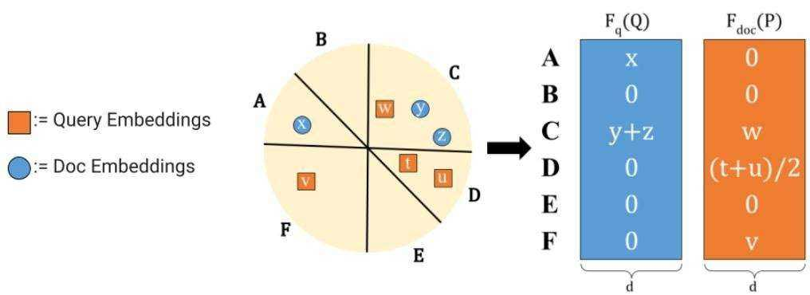
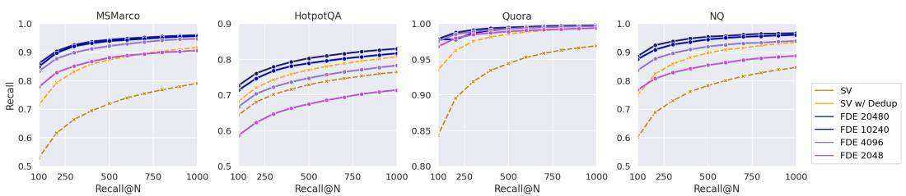
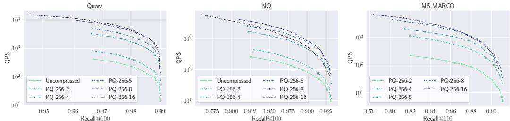
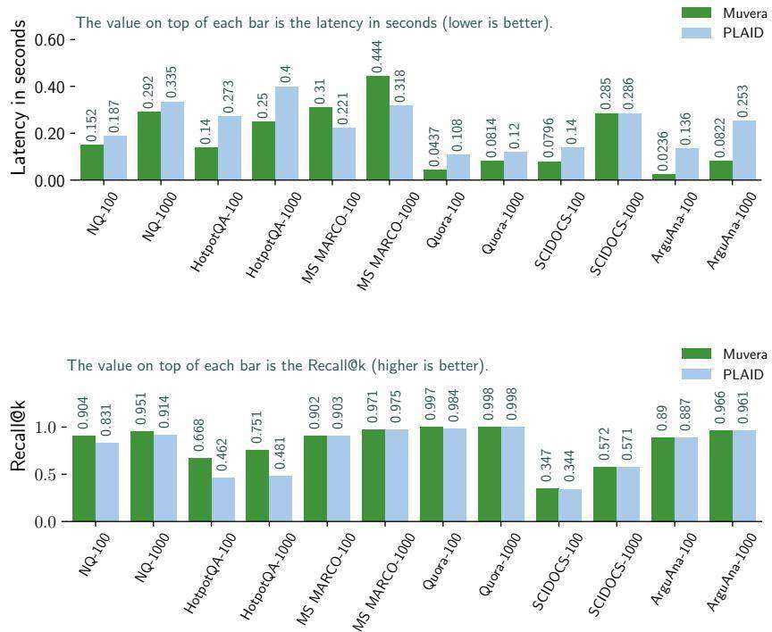

# MUVERA: Multi-Vector Retrieval via Fixed Dimensional Encodings

Laxman Dhulipala Google Research and UMD

Majid Hadian Google DeepMind

Rajesh Jayaram∗ Google Research

Jason Lee Google Research

Vahab Mirrokni Google Research

# Abstract

Neural embedding models have become a fundamental component of modern information retrieval (IR) pipelines. These models produce a single embedding $\boldsymbol { x } \in \mathbb { R } ^ { d }$ per data-point, allowing for fast retrieval via highly optimized maximum inner product search (MIPS) algorithms. Recently, beginning with the landmark ColBERT paper, multi-vector models, which produce a set of embedding per data point, have achieved markedly superior performance for IR tasks. Unfortunately, using these models for IR is computationally expensive due to the increased complexity of multi-vector retrieval and scoring.

In this paper, we introduce MUVERA (Multi-Vector Retrieval Algorithm), a retrieval mechanism which reduces multi-vector similarity search to single-vector similarity search. This enables the usage of off-the-shelf MIPS solvers for multivector retrieval. MUVERA asymmetrically generates Fixed Dimensional Encodings (FDEs) of queries and documents, which are vectors whose inner product approximates multi-vector similarity. We prove that FDEs give high-quality $\varepsilon$ - approximations, thus providing the first single-vector proxy for multi-vector similarity with theoretical guarantees. Empirically, we find that FDEs achieve the same recall as prior state-of-the-art heuristics while retrieving $2 { - } 5 \times$ fewer candidates. Compared to prior state of the art implementations, MUVERA achieves consistently good end-to-end recall and latency across a diverse set of the BEIR retrieval datasets, achieving an average of $1 0 \%$ improved recall with $9 0 \%$ lower latency.

# 1 Introduction

Over the past decade, the use of neural embeddings for representing data has become a central tool for information retrieval (IR) [56], among many other tasks such as clustering and classification [39]. Recently, multi-vector (MV) representations, introduced by the late-interaction framework in ColBERT [29], have been shown to deliver significantly improved performance on popular IR benchmarks. ColBERT and its variants [17, 21, 32, 35, 42, 44, 49, 54] produce multiple embeddings per query or document by generating one embedding per token. The query-document similarity is then scored via the Chamfer Similarity (§1.1), also known as the MaxSim operation, between the two sets of vectors. These multi-vector representations have many advantages over single-vector (SV) representations, such as better interpretability [15, 50] and generalization [16, 36, 51, 55].

Despite these advantages, multi-vector retrieval is inherently more expensive than single-vector retrieval. Firstly, producing one embedding per token increases the number of embeddings in a dataset by orders of magnitude. Moreover, due to the non-linear Chamfer similarity scoring, there is a lack of optimized systems for multi-vector retrieval. Specifically, single-vector retrieval is generally accomplished via Maximum Inner Product Search (MIPS) algorithms, which have been highly-optimized over the past few decades [18]. However, SV MIPS alone cannot be used for MV retrieval. This is because the MV similarity is the sum of the SV similarities of each embedding in a query to the nearest embedding in a document. Thus, a document containing a token with high similarity to a single query token may not be very similar to the query overall. Thus, in an effort to close the gap between SV and MV retrieval, there has been considerable work in recent years to design custom MV retrieval algorithms with improved efficiency [12, 21, 42, 43].

  
Figure 1: MUVERA’s two-step retrieval process, comapred to PLAID’s multi-stage retrieval process. Diagram on the right from Santhanam et. al. [43] with permission.

The most prominent approach to MV retrieval is to employ a multi-stage pipeline beginning with single-vector MIPS. The basic version of this approach is as follows: in the initial stage, the most similar document tokens are found for each of the query tokens using SV MIPS. Then the corresponding documents containing these tokens are gathered together and rescored with the original Chamfer similarity. We refer to this method as the single-vector heuristic. ColBERTv2 [44] and its optimized retrieval engine PLAID [43] are based on this approach, with the addition of several intermediate stages of pruning. In particular, PLAID employs a complex four-stage retrieval and pruning process to gradually reduce the number of final candidates to be scored (Figure 1). Unfortunately, as described above, employing SV MIPS on individual query embeddings can fail to find the true MV nearest neighbors. Additionally, this process is expensive, since it requires querying a significantly larger MIPS index for every query embedding (larger because there are multiple embeddings per document). Finally, these multi-stage pipelines are complex and highly sensitive to parameter setting, as recently demonstrated in a reproducibility study [37], making them difficult to tune. To address these challenges and bridge the gap between single and multi-vector retrieval, in this paper we seek to design faster and simplified MV retrieval algorithms.

Contributions. We propose MUVERA: a multi-vector retrieval mechanism based on a light-weight and provably correct reduction to single-vector MIPS. MUVERA employs a fast, data-oblivious transformation from a set of vectors to a single vector, allowing for retrieval via highly-optimized MIPS solvers before a single stage of re-ranking. Specifically, MUVERA transforms query and document MV sets $Q , P \subset \mathbf { \bar { \mathbb { R } } } ^ { d }$ into single fixed-dimensional vectors $\vec { q } , \vec { p } ;$ , called Fixed Dimensional Encodings (FDEs), such that the the dot product $\vec { q } \cdot \vec { p }$ approximates the multi-vector similarity between $Q , P$ (§2). Empirically, we show that retrieving with respect to the FDE dot product significantly outperforms the single vector heuristic at recovering the Chamfer nearest neighbors $( \ S 3 . 1 )$ . For instance, on MS MARCO, our FDEs Recal $@ N$ surpasses the Recall@2-5N achieved by the SV heuristic while scanning a similar total number of floats in the search.

We prove in (§2.1) that our FDEs have strong approximation guarantees; specifically, the FDE dot product gives an $\varepsilon$ -approximation to the true MV similarity. This gives the first algorithm with provable guarantees for Chamfer similarity search with strictly faster than brute-force runtime (Theorem 2.2). Thus, MUVERA provides the first principled method for MV retrieval via a SV proxy.

We compare the end-to-end retrieval performance of MUVERA to PLAID on several of the BEIR IR datasets, including the well-studied MS MARCO dataset. We find MUVERA to be a robust and efficient retrieval mechanism; across the datasets we evaluated, MUVERA obtains an average of $10 \%$ higher recall, while requiring $90 \%$ lower latency on average compared with PLAID. Additionally, MUVERA crucially incorporates a vector compression technique called product quantization that enables us to compress the FDEs by $3 2 \times$ (i.e., storing 10240 dimensional FDEs using 1280 bytes) while incurring negligible quality loss, resulting in a significantly smaller memory footprint.

# 1.1 Chamfer Similarity and the Multi-Vector Retrieval Problem

Given two sets of vectors $Q , P \subset \mathbb { R } ^ { d }$ , the Chamfer Similarity is given by

$$
\mathbf { C } \mathrm { H A M F E R } ( Q , P ) = \sum _ { q \in Q } \operatorname* { m a x } _ { p \in P } \langle q , p \rangle
$$

where $\langle \cdot , \cdot \rangle$ is the standard vector inner product. Chamfer similarity is the default method of MV similarity used in the late-interaction architecture of ColBERT, which includes systems like ColBERTv2 [44], Baleen [28], Hindsight [41], DrDecr [34], and XTR [32], among many others. These models encode queries and documents as sets $Q , P \subset \mathbb { R } ^ { d }$ (respectively), where the query-document similarity is given by CHAMFER $( Q , P )$ . We note that Chamfer Similarity (and its distance variant) itself has a long history of study in the computer vision (e.g., [4, 6, 14, 27, 45]) and graphics [33] communities, and had been previously used in the ML literature to compare sets of embeddings [3, 5, 30, 48]. In these works, Chamfer is also referred to as MaxSim or the relaxed earth mover distance; we choose the terminology Chamfer due to its historical precedence [6].

In this paper, we study the problem of Nearest Neighbor Search (NNS) with respect to the Chamfer Similarity. Specifically, we are given a dataset $D = \{ P _ { 1 } , \ldots , P _ { n } \}$ where each $\mathbf { \widehat { \textmu } } _ { P _ { i } \subset \mathbb { R } ^ { d } }$ is a set of vectors. Given a query subset $Q \subset \mathbb { R } ^ { d }$ , the goal is to quickly recover the nearest neighbor $P ^ { * } \in D$ , namely:

$$
P ^ { * } = \arg \operatorname* { m a x } _ { P _ { i } \in D } \mathrm { C H A M F E R } ( Q , P _ { i } )
$$

For the retrieval system to be scalable, this must be achieved in time significantly faster than bruteforce scoring each of the $n$ similarities CHAMFER $( Q , P _ { i } )$ .

# 1.2 Our Approach: Reducing Multi-Vector Search to Single-Vector MIPS

MUVERA is a streamlined procedure that directly reduces the Chamfer Similarity Search to MIPS. For a pre-specified target dimension $d _ { \tt F D E }$ , MUVERA produces randomized mappings $\mathbf { F } _ { \mathrm { q } } : 2 ^ { \mathbb { R } ^ { d } }  \mathbb { R } ^ { d _ { \mathrm { F D E } } }$ (for queries) and $\mathbf { F } _ { \mathrm { d o c } } : 2 ^ { \mathbb { R } ^ { d } } \to \mathbb { R } ^ { d _ { \mathrm { F D E } } }$ (for documents) such that, for all query and document multivector representations $Q , P \subset \mathbb { R } ^ { d }$ , we have:

$$
\langle \mathbf { F } _ { \mathrm { q } } ( Q ) , \mathbf { F } _ { \mathrm { d o c } } ( P ) \rangle \approx \mathbf { C } \mathbf { H A M F E R } ( Q , P )
$$

We refer to the vectors $\mathbf { F } _ { \mathrm { q } } ( Q ) , \mathbf { F } _ { \mathrm { d o c } } ( P )$ as Fixed Dimensional Encodings (FDEs). MUVERA first applies $\mathbf { F } _ { \mathrm { d o c } }$ to each document representation $P \in D$ , and indexes the set $\{ \mathbf { F } _ { \mathrm { d o c } } ( P ) \} _ { P \in D }$ into a MIPS solver. Given a query $Q \subset \mathbb { R } ^ { d }$ , MUVERA quickly computes ${ \bf F } _ { \mathrm { q } } ( Q )$ and feeds it to the MIPS solver to recover top- $k$ most similar document FDE’s $\mathbf { F } _ { \mathrm { d o c } } ( P )$ . Finally, we re-rank these candidates by the original Chamfer similarity. See Figure 1 for an overview. We remark that one important advantage of the FDEs is that the functions $\mathbf { F } _ { \mathrm { q } } , \mathbf { F } _ { \mathrm { d o c } }$ are data-oblivious, making them robust to distribution shifts, and easily usable in streaming settings.

# 1.3 Related Work on Multi-Vector Retrieval

The early multi-vector retrieval systems, such as ColBERT [29], all implement optimizations of the previously described SV heuristic, where the initial set of candidates is found by querying a MIPS index for every query token $q \in Q$ . In ColBERTv2 [44], the document token embeddings are first clustered via $\mathbf { k }$ -means, and the first round of scoring using cluster centroids instead of the original token. This technique was further optimized in PLAID [43] by employing a four-stage pipeline to progressively prune candidates before a final reranking (Figure 1).

An alternative approach with proposed in DESSERT [12], whose authors also pointed out the limitations of the SV heuristic, and proposed an algorithm based on Locality Sensitive Hashing (LSH) [20]. They prove that their algorithm recovers $\varepsilon$ -approximate nearest neighbors in time $\tilde { \cal O } ( n | Q | T )$ , where $T$ is roughly the maximum number of document tokens $p \in P _ { i }$ that are similar to any query token $q \in Q$ , which can be as large as $\operatorname* { m a x } _ { i } | P _ { i } |$ . Thus, in the worst case, their algorithm runs no faster than brute-force. Conversely, our algorithm recovers $\varepsilon$ -approximate nearest neighbors and always runs in time ${ \tilde { O } } ( n | Q | )$ . Experimentally, DESSERT is $2 { - } 5 \times$ faster than PLAID, but attains worse recall (e.g. $2 { - } 2 . 5 \%$ $\mathbf { R } @ 1 0 0 0$ on MS MARCO). Conversely, we match and sometimes strongly exceed PLAID’s recall with up to $5 . 7 \times$ lower latency. Additionally, DESSERT still employs an initial filtering stage based on $k$ -means clustering of individual query token embeddings (in the manner of ColBERTv2), thus they do not truly avoid the aforementioned limitations of the SV heuristic.

# 2 Fixed Dimensional Encodings

We now describe our process for generating FDEs. Our transformation is reminiscent of the technique of probabilistic tree embeddings [1, 7, 10, 13], which can be used to transform a set of vectors into a single vector. For instance, they have been used to embed the Earth Mover’s Distance into the $\ell _ { 1 }$ metric [1, 10, 22, 24], and to embed the weight of a Euclidean MST of a set of vectors into the Hamming metric [9, 22, 23]. However, since we are working with inner products, which are not metrics, instead of $\ell _ { p }$ distances, an alternative approach for our transformation will be needed.

The intuition behind our transformation is as follows. Hypothetically, for two MV representations $Q , P \subset \mathbb { R } ^ { d }$ , if we knew the optimal mapping $\pi : Q  P$ in which to match them, then we could create vectors $\vec { q } , \vec { p }$ by concatenating all the vectors in $Q$ and their corresponding images in $P$ together, so that $\begin{array} { r } { \langle \vec { q } , \vec { p } \rangle = \sum _ { q \in Q } \langle q , \pi ( q ) \rangle = \mathbf { C } \mathbf { H } \mathbf { A } \mathbf { M } \mathbf { F } \mathbf { E } \mathbf { R } ( Q , P ) } \end{array}$ . However, since we do not know $\pi$ in advance, and since different query-document pairs have different optimal mappings, this simple concatenation clearly will not work. Instead, our goal is to find a randomized ordering over all the points in $\mathbb { R } ^ { d }$ so that, after clustering close points together, the dot product of any query-document pair $Q , P \subset \mathbb { R } ^ { d }$ concatenated into a single vector under this ordering will approximate the Chamfer similarity.

The first step is to partition the latent space $\mathbb { R } ^ { d }$ into $B$ clusters so that vectors that are closer are more are more likely to land in the same cluster. Let $\varphi : \mathbb { R } ^ { d }  [ B ]$ be such a partition; $\varphi$ can be implemented via Locality Sensitive Hashing (LSH) [20], $k$ -means, or other methods; we discuss choices for $\varphi$ later in this section. After partitioning via $\varphi$ , the hope is that for each $q \in Q$ , the closest $p \in P$ lands in the same cluster (i.e. $\varphi ( q ) = \varphi ( p ) ,$ ). Hypothetically, if this were to occur, then:

$$
\mathrm { C H A M F E R } ( Q , P ) = \sum _ { k = 1 } ^ { B } \sum _ { \stackrel { q \in Q } { \varphi ( q ) = k } } \operatorname* { m a x } _ { p \in P } \langle q , p \rangle
$$

If $p$ is the only point in $P$ that collides with $q$ , then (1) can be realized as a dot product between two vectors $\vec { q } , \vec { p }$ by creating one block of $d$ coordinates in ${ \vec { q } } , { \vec { p } }$ for each cluster $k \in [ B ]$ (call these blocks $\vec { q } _ { ( k ) } , \vec { p _ { ( k ) } } \in \mathbb { R } ^ { d } )$ , and setting $\vec { q } _ { ( k ) } , \vec { p _ { ( k ) } }$ to be the sum of all $q \in Q$ (resp. $p \in P$ ) that land in the $k$ -th cluster under $\varphi$ . However, if multiple $p ^ { \prime } \in P$ collide with $q$ , then $\langle \vec { q } , \vec { p } \rangle$ will differ from (1), since every $p ^ { \prime }$ with $\varphi ( p ^ { \prime } ) = \varphi ( q )$ will contribute at least $\langle q , p ^ { \prime } \rangle$ to $\langle \vec { q } , \vec { p } \rangle$ . To resolve this, we set $\vec { p _ { ( k ) } }$ to be the centroid of the $p \in P$ ’s with $\varphi ( p ) = \varphi ( q )$ . Formally, for $k = 1 , \dots , B$ , we define

$$
\vec { q } _ { ( k ) } = \sum _ { \stackrel { q \in Q } { \varphi ( q ) = k } } q , \qquad \vec { p _ { ( k ) } } = \frac { 1 } { | P \cap \varphi ^ { - 1 } ( k ) | } \sum _ { \stackrel { p \in P } { \varphi ( p ) = k } } p
$$

Setting $\vec { q } = \left( \vec { q } _ { ( 1 ) } , \ldots , \vec { q } _ { ( B ) } \right)$ and $\vec { p } = ( \vec { p _ { ( 1 ) } } , \dots , \vec { p _ { ( B ) } } )$ , then we have

$$
\langle \vec { q } , \vec { p } \rangle = \sum _ { k = 1 } ^ { B } \sum _ { \stackrel { q \in Q } { \varphi ( q ) = k } } \frac { 1 } { | P \cap \varphi ^ { - 1 } ( k ) | } \sum _ { \stackrel { p \in P } { \varphi ( p ) = k } } \langle q , p \rangle
$$

Note that the resulting dimension of the vectors $\vec { q } , \vec { p }$ is $d B$ . To reduce the dependency on $d$ , we can apply a random linear projection $\psi : \mathbb { R } ^ { d }  \bar { \mathbb { R } ^ { d _ { \mathrm { p r o j } } } }$ to each block $\vec { q } _ { ( k ) } , \vec { p } _ { ( k ) }$ , where $d _ { \tt p r o j } < d$ . Specifically, we define $\psi ( x ) = ( 1 / \sqrt { d _ { \mathrm { p r o j } } } ) S x$ , where $S ~ \in ~ \mathbb { R } ^ { d _ { \mathrm { p r o j } } \times d }$ is a random matrix with uniformly distributed $\pm 1$ entries. We can then define $\vec { q } _ { ( k ) , \psi } = \psi ( \vec { q } _ { ( k ) } )$ and $\vec { p _ { ( k ) , \psi } } = \psi ( \vec { p _ { ( k ) } } )$ , and define the FDE’s with inner projection as $\vec { q } _ { \psi } = ( \vec { q } _ { ( 1 ) , \psi } , \ldots , \vec { q } _ { ( B ) , \psi } )$ and $\vec { p _ { \psi } } = ( \vec { p _ { ( 1 ) , \psi } } , \cdot \cdot \cdot , \vec { p _ { ( B ) , \psi } } )$ . When $d = d _ { \tt p r o j }$ , we simply define $\psi$ to be the identity mapping, in which case ${ \vec { q } } _ { \psi } , { \vec { p _ { \psi } } }$ are identical to $\vec { q } , \vec { p } .$ . To increase accuracy of (3) in approximating (1), we repeat the above process $R _ { \tt r e p s } \geqslant 1$ times independently, using different randomized partitions $\varphi _ { 1 } , \ldots , \varphi _ { R _ { \mathrm { r e p s } } }$ and projections $\bar { \psi _ { 1 } } , \dotsc , \psi _ { R _ { \mathrm { r e p s } } }$ . We denote the vectors resulting from $i$ -th repetition by $\vec { q _ { i , \psi } } , \vec { p _ { i , \psi } }$ . Finally, we concatenate these $R _ { \tt r e p s }$ vectors together, so that our final FDEs are defined as $\vec { \mathbf { F } _ { \mathrm { q } } } ( Q ) = ( \vec { q } _ { 1 , \psi } , \dots , \vec { q } _ { R _ { \mathrm { r e p s } } , \psi } )$ and $\mathbf { F } _ { \mathrm { d o c } } ( P ) = ( \vec { p _ { 1 , \psi } } , \cdot \cdot \cdot , \vec { p } _ { R _ { \mathrm { r e p s } } , \psi } )$ . Observe that a complete FDE mapping is specified by the three parameters $( B , d _ { \tt p r o j } , R _ { \tt r e p s } )$ , resulting in a final dimension of $d _ { \mathtt { F D E } } = B \cdot d _ { \mathtt { p r o j } } \cdot R _ { \mathtt { r e p s } }$ .

  
Figure 2: FDE Generation Process. Three SimHashes ( $k _ { \mathrm { s i m } } = 3$ ) split space into six regions labelled $A { \cdot } F$ (in high-dimensions $B = 2 ^ { k _ { \mathrm { s i m } } }$ , but $B = 6$ here since $d = 2$ ). ${ \bf F } _ { \mathrm { q } } ( Q )$ , $\mathbf { F } _ { \mathrm { d o c } } ( P )$ are shown as $B \times d$ matrices, where the $k$ -th row is $\vec { q } _ { ( k ) } , \vec { p } _ { ( k ) }$ . The actual FDEs are flattened versions of these matrices. Not shown: inner projections, repetitions, and fill_empty_clusters.

Choice of Space Partition When choosing the partition function $\varphi$ , the desired property is that points are more likely to collide (i.e. $\varphi ( x ) = \varphi ( y ) )$ the closer they are to each other. Such functions with this property exist, and are known as locality-sensitive hash functions (LSH) (see [20]). When the vectors are normalized, as they are for those produced by ColBERT-style models, SimHash [8] is the standard choice of LSH. Specifically, for any $k _ { \mathrm { s i m } } \geqslant 1$ , we sample random Gaussian vectors $g _ { 1 } , \ldots , g _ { k _ { \mathrm { s i m } } } \in \mathbb { R } ^ { d }$ , and set $\varphi ( x ) = ( \mathbf { 1 } ( \langle g _ { 1 } , x \rangle > 0 ) , \dots , \mathbf { 1 } ( \langle g _ { k _ { \mathrm { s i m } } } , x \rangle > 0 ) )$ , where $\mathbf { 1 } ( \cdot ) \in \{ 0 , 1 \}$ is the indicator function. Converting the bit-string to decimal, $\varphi ( x )$ gives a mapping from $\mathbb { R } ^ { d }$ to $[ B ]$ where $B = 2 ^ { k _ { \mathrm { s i m } } }$ . In other words, SimHash partitions $\mathbb { R } ^ { d }$ by drawing $k _ { \mathrm { s i m } }$ random half-spaces, and each of the the $2 ^ { k _ { \mathrm { s i m } } }$ clusters is formed by the $k _ { \mathrm { s i m } }$ -wise intersection of each of these halfspaces or their complement. Another natural approach is to choose $k _ { \mathrm { C E N T E R } } \geqslant 1$ centers from the collection of all token embeddings $\cup _ { i = 1 } ^ { n } P _ { i }$ , either randomly or via $k$ -means, and set $\varphi ( x ) \in [ k _ { \mathrm { C E N T E R } } ]$ to be the index of the center nearest to $x$ . We compare this method to SimHash in (§3.1).

Filling Empty Clusters. A key source of error in the FDE’s approximation is when the nearest vector $p \in P$ to a given query embedding $q \in Q$ maps to a different cluster, namely $\varphi ( p ) \neq \varphi ( q ) = k$ . This can be made less likely by decreasing $B$ , at the cost of making it more likely for other $p ^ { \prime } \in P$ to also map to the same cluster, moving the centroid $\vec { p _ { ( k ) } }$ farther from $p$ . If we increase $B$ too much, it is possible that no $p \in P$ collides with $\varphi ( q )$ . To avoid this trade-off, we directly ensure that if no $p \in P$ maps to a cluster $k$ , then instead of setting $\vec { p _ { ( k ) } } = 0$ we set $\vec { p _ { ( k ) } }$ to the point $p$ that is closest to cluster $k$ . As a result, increasing $B$ will result in a more accurate estimator, as this results in smaller clusters. Formally, for any cluster $k$ with $P \cap \varphi ^ { - 1 } ( k ) = \emptyset$ , if fill_empty_clusters is enabled, we set $\vec { p _ { ( k ) } } = p$ where $p \in P$ is the point for which $\varphi ( p )$ has the fewest number of disagreeing bits with $k$ (both thought of as binary strings), with ties broken arbitrarily. We do not enable this for query FDEs, as doing so would result in a given $q \in Q$ contributing to the dot product multiple times.

Final Projections. A natural approach to reducing the dimensionality is to apply a final projection $\psi ^ { \prime } : \mathbb { R } ^ { d _ { \mathtt { F D E } } }  \mathbb { R } ^ { d _ { \mathtt { f n a l } } }$ (also implemented via multiplication by a random $\pm 1$ matrix) to the FDE’s, reducing the final dimensionality to any $d _ { \tt f i n a l } < d _ { \tt F D E }$ . Experimentally, we find that final projections can provides small but non-trivial $1 { - } 2 \%$ recall boosts for a fixed dimension (see $\ S { \bf C } . 2$ ).

# 2.1 Theoretical Guarantees for FDEs

We now state our theoretical guarantees for our FDE construction. For clarity, we state our results in terms of normalized Chamfer similarity NCHAMFE $\begin{array} { r } { \mathsf { R } ( Q , P ) = \frac { 1 } { | Q | } \mathbf { C } \mathbf { H A M F E R } ( Q , P ) } \end{array}$ . This ensures NCHAMFER $( Q , P ) \in [ - 1 , 1 ]$ whenever the vectors in $Q , P$ are normalized. Note that this factor of $1 / | Q |$ does not affect the relative scoring of documents for a fixed query. In what follows, we assume that all token embeddings are normalized (i.e. $\| q \| _ { 2 } = \| p \| _ { 2 } = 1$ for all $q \in Q , p \in P$ ). Note that ColBERT-style late interaction MV models indeed produce normalized token embeddings. We will always use the fill_empty_clusters method for document FDEs, but never for queries.

Our main result is that FDEs give $\varepsilon$ -additive approximations of the Chamfer similarity. The proof uses the properties of LSH (SimHash) to show that for each query point $q \in Q$ , the point $q$ gets mapped to a cluster $\varphi ( q )$ that only contains points $p \in P$ that are close to $q$ (within $\varepsilon$ of the closest point to $q$ ); the fact that at least one point collides with $q$ uses the fill_empty_partitions method.

Theorem 2.1 (FDE Approximation). Fix any $m = | Q | + | P |$ . Then setting $\begin{array} { r } { k _ { s i m } = O \left( \frac { \log ( m \delta ^ { - 1 } ) } { \varepsilon } \right) } \end{array}$ $\varepsilon , \delta > 0$ , , and sets $\begin{array} { r } { d _ { p r o j } = O \left( \frac { 1 } { \varepsilon ^ { 2 } } \log ( \frac { m } { \varepsilon \delta } ) \right) } \end{array}$ $Q , P \subset \mathbb { R } ^ { d }$ of unit vectors, and let , $R _ { r e p s } = 1$ , so that $d _ { F D E } = ( m / \delta ) ^ { O ( 1 / \varepsilon ) }$ , then in expectation and with probability at least $1 - \delta$ we have

$$
\mathrm { N C H A M F E R } ( Q , P ) - \varepsilon \leqslant \frac { 1 } { | Q | } \langle \mathbf { F } _ { q } ( Q ) , \mathbf { F } _ { d o c } ( P ) \rangle \leqslant \mathrm { N C H A M F E R } ( Q , P ) + \varepsilon
$$

Finally, we show that our FDE’s give an $\varepsilon$ -approximate solution to Chamfer similarity search, using FDE dimension that depends only logarithmically on the size of the dataset $n$ . Using the fact that our query FDEs are sparse (Lemma A.1), one can run exact MIPS over the FDEs in time ${ \tilde { O } } ( | Q | \cdot n )$ , improving on the brute-force runtime of $O ( | Q | \operatorname* { m a x } _ { i } | P _ { i } | n )$ for Chamfer similarity search.

Theorem 2.2. Fix any $\varepsilon > 0$ , query $Q$ , and dataset $P = \{ P _ { 1 } , \ldots , P _ { n } \}$ , where $Q \subset \mathbb { R } ^ { d }$ and $P _ { i } ~ \subset ~ \mathbb { R } ^ { d }$ f uni and $m = | Q | + \operatorname* { m a x } _ { i \in [ n ] } | P _ { i } |$ $\begin{array} { r } { k _ { s i m } = { \cal O } ( \frac { \log m } { \varepsilon } ) } \end{array}$ $\begin{array} { r } { d _ { p r o j } = \ O ( \frac { 1 } { \varepsilon ^ { 2 } } \log ( m / \varepsilon ) ) } \end{array}$ $\begin{array} { r } { R _ { r e p s } = O ( \frac { 1 } { \varepsilon ^ { 2 } } \log n ) } \end{array}$ $d _ { F D E } = m ^ { O \left( 1 / \varepsilon \right) } \cdot \log n$ $i ^ { \bar { * } } = \arg \operatorname* { m a x } _ { i \in [ n ] } \langle \mathbf { F } _ { q } ( Q ) , \mathbf { F } _ { d o c } ( P _ { i } ) \rangle$ , with high probability (i.e. $1 - 1 / \mathrm { p o l y } ( n ) ,$ we have:

$$
\mathrm { N C H A M F E R } ( Q , P _ { i ^ { * } } ) \geqslant \operatorname* { m a x } _ { i \in [ n ] } \mathrm { N C H A M F E R } ( Q , P _ { i } ) - \varepsilon
$$

Given the query $Q$ , the document $P ^ { * }$ can be recovered in time $\begin{array} { r } { O \left( | Q | \operatorname* { m a x } \{ d , n \} \frac { 1 } { \varepsilon ^ { 4 } } \log ( \frac { m } { \varepsilon } ) \log n \right) } \end{array}$

# 3 Evaluation

In this section, we evaluate our FDEs as a method for MV retrieval. First, we evaluate the FDEs themselves (offline) as a proxy for Chamfer similarity (§3.1). In (§3.2), we discuss the implementation of MUVERA, as well as several optimizations made in the search. Then we evaluate the latency of MUVERA compared to PLAID, and study the effects of the aforementioned optimizations.

Datasets. Our evaluation includes results from six of the well-studied BEIR [46] information retrieval datasets: MS MARCO [40] (CC BY-SA 4.0), HotpotQA (CC BY-SA 4.0) [53], NQ (Apache-2.0) [31], Quora (Apache-2.0) [46], SciDocs (CC BY 4.0) [11], and ArguAna (Apache-2.0) [47]. These datasets were selected for varying corpus size (8K-8.8M) and average number of document tokens (18-165); see $( \ S \mathbf { B } )$ for further dataset statistics. Following [43], we use the development set for our experiments on MS MARCO, and use the test set on the other datasets.

MV Model, MV Embedding Sizes, and FDE Dimensionality. We compute our FDEs on the MV embeddings produced by the ColBERTv2 model [44] (MIT License), which have a dimension of $d = 1 2 8$ and a fixed number $| Q | = 3 2$ of embeddings per query. The number of document embeddings is variable, ranging from an average of 18.3 on Quora to 165 on Scidocs. This results in 2,300-21,000 floats per document on average (e.g. 10,087 for MS MARCO). Thus, when constructing our FDEs we consider a comparable range of dimensions $d _ { \tt F D E }$ between 1,000-20,000. Furthermore, using product quantization, we show in (§3.2) that the FDEs can be significantly compressed by $3 2 \times$ with minimal quality loss, further increasing the practicality of FDEs.

# 3.1 Offline Evaluation of FDE Quality

We evaluate the quality of our FDEs as a proxy for the Chamfer similarity, without any re-ranking and using exact (offline) search. We first demonstrate that FDE recall quality improves dependably as the dimension $d _ { \tt F D E }$ increases, making our method relatively easy to tune. We then show that FDEs are a more effective method of retrieval than the SV heuristic. Specifically, the FDE method achieves Recall $@ N$ exceeding the Recall $@ 2 – 4 \mathbf { N }$ of the SV heuristic, while in principle scanning a similar number of floats in the search. This suggests that the success of the SV heuristic is largely due to the significant effort put towards optimizing it (as supported by [37]), and similar effort for FDEs may result in even bigger efficiency gains. Additional plots can be found in $\mathrm { ( \ S C ) }$ . All recall curves use a single FDE instantiation, since in $( \ S C . 1 )$ we show the variance of FDE recall is negligible.

FDE Quality vs. Dimensionality. We study how the retrieval quality of FDE’s improves as a function of the dimension $d _ { \tt F D E }$ . We perform a grid search over FDE parameters $R _ { \tt r e p s } \ \in$ $\{ 1 , 5 , 1 0 , 1 5 , 2 0 \}$ , $k _ { \mathrm { s i m } } \in \{ 2 , 3 , 4 , 5 , 6 \} , d _ { \mathrm { p r o j } } \in \{ 8 , 1 6 , 3 2 , 6 4 \}$ , and compute recall on MS MARCO (Figure 3). We find that Pareto optimal parameters are generally achieved by larger $R _ { \tt r e p s }$ , with $k _ { \mathrm { s i m } } , d _ { \mathrm { p r o j } }$ playing a lesser role in improving quality. Specifically, $( R _ { \mathrm { r e p s } } , k _ { \mathrm { s i m } } , d _ { \mathrm { p r o j } } ) \stackrel { \cdot } { \in }$ $\{ ( 2 0 , 3 , 8 ) , ( 2 0 , 4 , 8 ) ( 2 0 , 5 , 8 ) , ( 2 0 , 5 , 1 6 ) \}$ were all Pareto optimal for their respective dimensions (namely $R _ { \tt r e p s } \cdot 2 ^ { k _ { \tt s i m } } \cdot d _ { \tt p r o j } )$ . While there are small variations depending on the parameter choice, the FDE quality is tightly linked to dimensionality; increase in dimensionality will generally result in quality gains. We also evaluate using $k$ -means as a method of partitioning instead of SimHash. Specifically, we cluster the document embeddings with $k$ -means and set $\varphi ( x )$ to be the index of the nearest centroid to $x$ . We perform a grid search over the same parameters (but with $k \in \{ 4 , 8 , 1 6 , 3 2 , 6 4 \}$ to match $B = 2 ^ { k _ { \mathrm { s i m } } }$ ). We find that $k$ -means partitioning offers no quality gains on the Pareto Frontier over SimHash, and is often worse. Moreover, FDE construction with $k$ -means is no longer data oblivious. Thus, SimHash is chosen as the preferred method for partitioning for the remainder of our experiments.

  
Figure 3: FDE recall vs dimension for varying FDE parameters on MS MARCO. Plots show FDE Recall@100,1k,10k left to right. Recalls $@ N$ for exact Chamfer scoring is shown by dotted lines.

  
Figure 4: Comparison of FDE recall versus brute-force search over Chamfer similarity.

In Figure 4, we evaluate the FDE retrieval quality with respect to the Chamfer similarity (instead of labelled ground truth data). We compute 1Recall $@ N$ , which is the fraction of queries for which the Chamfer 1-nearest neighbor is among the top- $. N$ most similar in FDE dot product. We choose FDE parameters which are Pareto optimal for the dimension from the above grid search. We find that FDE’s with fewer dimensions that the original MV representations achieve significantly good recall across multiple BEIR retrieval datasets. For instance, on MS MARCO (where $d \cdot m _ { a v g } \approx 1 0 K ,$ ) we achieve $9 5 \%$ recall while retrieving only 75 candidates using $d _ { \mathrm { F D E } } = 5 1 2 0$ .

Single Vector Heuristic vs. FDE retrieval. We compare the quality of FDEs as a proxy for retrieval against the previously described SV heuristic, which is the method underpinning PLAID. Recall that in this method, for each of the $i = 1 , \ldots , 3 2$ query vectors $q _ { i }$ we compute the $k$ nearest neighbors $p _ { 1 , i } , \ldots , p _ { k , i }$ from the set $\cup _ { i } P _ { i }$ of all documents token embeddings. To compute Recall $@ N$ , we create an ordered list $\ell _ { 1 , 1 } , \ldots , \ell _ { 1 , 3 2 } , \ell _ { 2 , 1 } , \ldots .$ , where $\ell _ { i , j }$ is the document ID containing $p _ { i , j }$ , consisting of the 1-nearest neighbors of the queries, then the 2-nearest neighbors, and so on. When re-ranking, one firsts removes duplicate document IDs from this list. Since duplicates cannot be detected while performing the initial 32 SV MIPS queries, the SV heuristic needs to over-retrieve to reach a desired number of unique candidates. Thus, we note that the true recall curve of implementations of the SV heuristic (e.g. PLAID) is somewhere between the case of no deduplication and full deduplication; we compare to both in Figure 5.

To compare the cost of the SV heuristic to running MIPS over the FDEs, we consider the total number of floats scanned by both using a brute force search. The FDE method must scan $n \cdot d _ { \tt F D E }$ floats to compute the $k$ -nearest neighbors. For the SV heuristic, one runs 32 brute force scans over $n \cdot m _ { a v g }$ vectors in 128 dimensions, where $m _ { a v g }$ is the average number embeddings per document (see $\ S _ { \mathbf { B } }$ for values of $m _ { a v g }$ ). For MS MARCO, where $m _ { a v g } = 7 8 . 8$ , the SV heuristic searches through

  
Figure 5: FDE retrieval vs SV Heuristic, both with and without document id deduplication.

$3 2 \cdot 1 2 8 \cdot 7 8 . 8 \cdot n$ floats. This allows for an FDE dimension of $d _ { \mathtt { F D E } } = 3 2 2 , 7 6 4$ to have comparable cost! We can extend this comparison to fast approximate search – suppose that approximate MIPS over $n$ vectors can be accomplished in sublinear $n ^ { \varepsilon }$ time, for some $\varepsilon \in ( 0 , 1 )$ . Then even in the unrealistic case of $\varepsilon = 0$ , we can still afford an FDE dimension of $d _ { \mathtt { F D E } } = 3 2 \cdot 1 2 8 = 4 0 9 6$ .

The results can be found in Figure 5. We build FDEs once for each dimension, using $R _ { \tt r e p s } =$ $4 0 , k _ { \mathrm { s i m } } = 6 , d _ { \mathrm { p r o j } } = d = 1 2 8 .$ , and then applying a final projection to reduce to the target dimension (see C.2 for experiments on the impact of final projections). On MS MARCO, even the 4096- dimensional FDEs match the recall of the (deduplicated) SV heuristic while retrieving $1 . 7 5  – 3 . 7 5 \times$ fewer candidates (our Recall $@ N$ matches the $\mathrm { R e c a l l @ 1 . 7 5  – 3 . 7 5 N }$ of the SV heuristic), and $1 0 . 5 – 1 5 \times$ fewer than to the non-deduplicated SV heuristic. For our 10240-dimension FDEs, these numbers are $2 . 6 \mathrm { - } 5 \times$ and $2 0 \mathrm { - } 2 2 . 5 \times$ fewer, respectively. For instance, we achieve $8 0 \%$ recall with 60 candidates when $d _ { \mathtt { F D E } } = 1 0 2 4 0$ and 80 candidates when $d _ { \mathtt { F D E } } = 4 0 9 6$ , but the SV heuristic requires 300 and 1200 candidates (for dedup and non-dedup respectively). See Table 1 for further comparisons.

Variance. Note that although the FDE generation is a randomized process, we show in $( \ S { \bf C } . 1 )$ that the variance of the FDE Recall is essentially negligible; for instance, the standard deviation Recal $@ 1 0 0 0$ is at most $0 . 0 8 \substack { - 0 . 1 6 \% }$ for FDEs with $2 { - } 1 0 k$ dimensions.

# 3.2 Online Implementation and End-to-End Evaluation

We implemented MUVERA, an FDE generation and end-to-end retrieval engine in $\mathrm { C } { + } { + }$ . We discussed FDE generation and various optimizations and their tradeoffs in (§3.1). Next, we discuss how we perform retrieval over the FDEs, and additional optimizations.

Single-Vector MIPS Retrieval using DiskANN Our single-vector retrieval engine uses a scalable implementation [38] of DiskANN [25] (MIT License), a state-of-the-art graph-based ANNS algorithm. We build DiskANN indices by using the uncompressed document FDEs with a maximum degree of 200 and a build beam-width of 600. Our retrieval works by querying the DiskANN index using beam search with beam-width $W$ , and subsequently reranking the retrieved candidates with Chamfer similarity. The only tuning knob in our system is $W$ ; increasing $W$ increases the number of candidates retrieved by MUVERA, which improves the recall.

Ball Carving. To improve re-ranking speed, we reduce the number of query embeddings by clustering them via a ball carving method and replacing the embeddings in each cluster with their sum. This speeds up reranking without decreasing recall; we provide further details in (§C.3).

Product Quantization (PQ). To further improve the memory usage of MUVERA, we use a textbook vector compression technique called product quantization (PQ) with asymmetric querying [19, 26] on the FDEs. We refer to product quantization with $C$ centers per group of $G$ dimensions as PQ-C-G. For example, PQ-256-8, which we find to provide the best tradeoff between quality and compression in our experiments, compresses every consecutive set of 8 dimensions to one of 256 centers. Thus PQ-256-8 provides $3 2 \times$ compression over storing each dimension using a single float, since each block of 8 floats is represented by a single byte. See (§C.4) for further experiments and details on PQ.

Experimental Setup We run our online experiments on an Intel Sapphire Rapids machine on Google Cloud (c3-standard-176). The machine supports up to 176 hyper-threads. We run latency experiments using a single thread, and run our QPS experiments on all 176 threads.

QPS vs. Recall A useful metric for retrieval is the number of queries per second (QPS) a system can serve at a given recall; evaluating the QPS of a system tries to fully utilize the system resources (e.g., the bandwidth of multiple memory channels and caches), and deployments where machines serve many queries simultaneously. Figure 6 shows the QPS vs. Recall $@ 1 0 0$ for MUVERA on a subset of the BEIR datasets, using different PQ schemes over the FDEs. We show results for additional datasets, as well as Recall $@ 1 0 0 0$ , in the Appendix. Using PQ-256-8 not only reduces the space usage of the FDEs by $3 2 \times$ , but also improves the QPS at the same query beamwidth by up to $2 0 \times$ , while incurring a minimal loss in end-to-end recall. Our method has a relatively small dependence on the dataset size, which is consistent with prior studies on graph-based ANNS data structures, since the number of distance comparisons made during beam search grows roughly logarithmically with increasing dataset size [25, 38]. We tried to include QPS numbers for PLAID [43], but unfortunately their implementation does not support running multiple queries in parallel, and is optimized for measuring latency.

  
Figure 6: Plots showing the QPS vs. Recall $@ 1 0 0$ for MUVERA on a subset of the BEIR datasets. The different curves are obtained by using different PQ methods on 10240-dimensional FDEs.

  
Figure 7: Bar plots showing the latency and Recall $@ k$ of MUVERA vs PLAID on a subset of the BEIR datasets. The $\mathbf { X }$ -tick labels are formatted as dataset- $k$ , i.e., optimizing for Recall $@ k$ on the given dataset.

Latency and Recall Results vs. PLAID [43] We evaluated MUVERA and PLAID [43] on the 6 datasets from the BEIR benchmark described earlier in (§3); Figure 7 shows that MUVERA achieves essentially equivalent Recall $@ k$ as PLAID (within $0 . 4 \%$ ) on MS MARCO, while obtaining up to $1 . 5 6 \times$ higher recall on other datasets (e.g. HotpotQA). We ran PLAID using the recommended settings for their system, which reproduced their recall results for MS MARCO. Compared with PLAID, on average over all 6 datasets and $k \in \{ 1 0 0 , 1 0 0 0 \}$ , MUVERA achieves $10 \%$ higher Recall $@ k$ (up to $56 \%$ higher), and $90 \%$ lower latency (up to $5 . 7 \times$ lower).

Importantly, MUVERA has consistently high recall and low latency across all of the datasets that we measure, and our method does not require costly parameter tuning to achieve this—all of our results use the same 10240-dimensional FDEs that are compressed using PQ with PQ-256-8; the only tuning in our system was to pick the first query beam-width over the $k$ that we rerank to that obtained recall matching that of PLAID. As Figure 7 shows, in cases like NQ and HotpotQA, MUVERA obtains much higher recall while obtaining lower latency. Given these results, we believe a distinguishing feature of MUVERA compared to prior multi-vector retrieval systems is that it achieves consistently high recall and low latency across a wide variety of datasets with minimal tuning effort.

# 4 Conclusion

In this paper, we presented MUVERA: a principled and practical MV retrieval algorithm which reduces MV similarity to SV similarity by constructing Fixed Dimensional Encoding (FDEs) of a MV representation. We prove that FDE dot products give high-quality approximations to Chamfer similarity (§2.1). Experimentally, we show that FDEs are a much more effective proxy for MV similarity, since they require retrieving $2 { - } 4 \times$ fewer candidates to achieve the same recall as the SV Heuristic (§3.1). We complement these results with an end-to-end evaluation of MUVERA, showing that it achieves an average of $10 \%$ improved recall with $90 \%$ lower latency compared with PLAID. Moreover, despite the extensive optimizations made by PLAID to the SV Heuristic, we still achieve significantly better latency on 5 out of 6 BEIR datasets we consider (§3). Given their retrieval efficiency compared to the SV heuristic, we believe that there are still significant gains to be obtained by optimizing the FDE method, and leave further exploration of this to future work.

Broader Impacts and Limitations: While retrieval is an important component of LLMs, which themselves have broader societal impacts, these impacts are unlikely to result from our retrieval algorithm. Our contribution simply improves the efficiency of retrieval, without enabling any fundamentally new capabilities. As for limitations, while we outperformed PLAID, sometimes significantly, on 5 out of the 6 datasets we studied, we did not outperform PLAID on MS MARCO, possibly due to their system having been carefully tuned for MS MARCO given its prevalence. Additionally, we did not study the effect that the average number of embeddings $m _ { a v g }$ per document has on retrieval quality of FDEs; this is an interesting direction for future work.