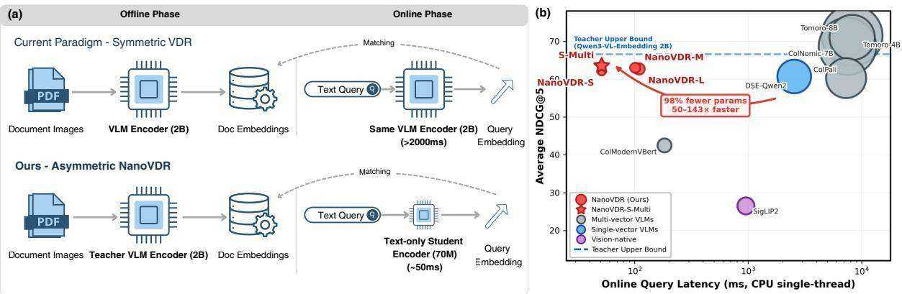
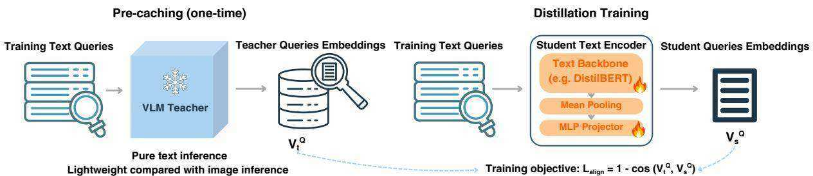
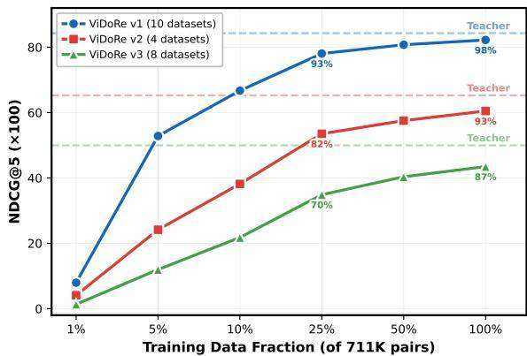

# NanoVDR: Distilling a 2B Vision-Language Retriever into a 70M Text-Only Encoder for Visual Document Retrieval

Zhuchenyang Liu, Yao Zhang, Yu Xiao Aalto University Espoo, Finland zhuchenyang.liu@aalto.fi

# Abstract

Vision-Language Model (VLM) based retrievers have advanced visual document retrieval (VDR) to impressive quality. They require the same multi-billion parameter encoder for both document indexing and query encoding, incurring high latency and GPU dependence even for plain-text queries. We observe that this design is unnecessarily symmetric: documents are visually complex and demand strong visual understanding, whereas queries are just short text strings. NanoVDR exploits this query– document asymmetry by decoupling the two encoding paths: a frozen 2B VLM teacher indexes documents offline, while a distilled text-only student as small as 69M parameters encodes queries at inference. The key design choice is the distillation objective. Through systematic comparison of six objectives across three backbones and 22 ViDoRe benchmark datasets, we find that pointwise cosine alignment on query text consistently outperforms rankingbased and contrastive alternatives, while requiring only pre-cached teacher query embeddings and no document processing during training. Furthermore, we identify cross-lingual transfer as the primary performance bottleneck, and resolve it cheaply by augmenting training data with machine-translated queries. The resulting NanoVDR-S-Multi1 (DistilBERT, 69M) retains $9 5 . 1 \%$ of teacher quality and outperforms DSE-Qwen2 (2B) on v2 and v3 with $3 2 \times$ fewer parameters and $5 0 \times$ lower CPU query latency, at a total training cost under 13 GPU-hours.

# 1 Introduction

Visual document retrieval (VDR) has achieved remarkable effectiveness in retrieving information from visually rich documents—financial reports with charts, scientific papers with figures, industrial manuals with diagrams—by treating each page as an image rather than relying on OCR-based text extraction (Faysse et al., 2024; Ma et al., 2024). State-of-the-art systems use Vision-Language Models (VLMs) to encode both queries and document pages into a shared embedding space (Faysse et al., 2024; Ma et al., 2024; Xin Huang, 2025; Nomic AI, 2025).

However, these systems apply the same heavyweight VLM encoder for both document indexing and query encoding. This results in high computational overhead at query time, requiring multibillion parameter models and GPU inference even for plain-text queries, and leads to large index storage costs for high-dimensional representations.

A key observation is that this design is unnecessarily symmetric: documents are visually complex and genuinely require strong visual understanding, whereas queries are short text strings that carry no visual content. Using a multi-billion parameter VLM to encode text-only queries wastes the model’s visual processing capacity entirely.

To exploit this query–document asymmetry, we propose NanoVDR, which decouples the two encoding paths through knowledge distillation (Figure 1a). A frozen VLM teacher indexes documents offline, producing single-vector visual embeddings; a lightweight text-only student (as small as 69M parameters) encodes queries at inference by mapping them into the teacher’s embedding space via a learned projector. The student requires no vision module and runs on CPU in ${ \sim } 5 0 \mathrm { m s }$ , enabling single-vector cosine similarity retrieval.

The central design choice is the distillation objective—how to train the student to faithfully represent queries in the teacher’s visual space. Through systematic comparison of six objectives across three backbones and the full 22-dataset Vi-DoRe benchmark, we make the following contributions:

• Asymmetric distillation framework. We propose a framework that distills a frozen 2B VLM teacher into text-only student encoders (69–151M) for VDR. We show that pointwise cosine alignment which directly matches student and teacher query embeddings, outperforms all ranking-based and contrastive objectives. It only pre-cache teacher query embeddings and eliminating corpus-related processing from training entirely.

  
Figure 1: Motivation and deployment advantage of NanoVDR. (a) Symmetric vs. asymmetric retrieval: Current VDR systems (top) use the same heavy VLM encoder (2B) for both offline document indexing and online query encoding ${ \cdot } > 2 , 0 0 0 \mathrm { m s }$ per query). NanoVDR (bottom) decouples the two: the frozen VLM teacher encodes documents offline, while a distilled text-only student (70M) encodes queries online in ${ \sim } 5 0 \mathrm { m s }$ on CPU. (b) Performance vs. latency: On the ViDoRe benchmark (mean ${ \mathrm { N D C G } } @ 5$ across $\mathrm { v } 1 / \mathrm { v } 2 / \mathrm { v } 3 $ ), NanoVDR models achieve near-teacher accuracy (dashed line) at $5 0 – 1 4 3 \times$ lower CPU latency. Bubble size is proportional to model parameter count; the star $( { \star } )$ marks NanoVDR-S-Multi, the multilingual-augmented variant (§3.3).

• Extreme efficiency. NanoVDR-S (Distil-BERT, 69M) outperforms DSE-Qwen2 (2B) on v2 and v3 with $3 2 \times$ fewer parameters and $5 0 \times$ lower query latency (Figure 1b), at a total training cost under 13 GPU-hours. It also keeps the storage efficiency compared to multi-vector methods, which is inherited from the teacher model.

• Cross-lingual augmentation. We further identify in asymmetric encoders for VDR task, the cross-lingual transfer is the primary performance bottleneck, rather than crossmodal transfer. We resolve it via query-only multilingual augmentation, raising teacher retention from $9 2 . 4 \%$ (NanoVDR-S) to $9 5 . 1 \%$ (NanoVDR-S-Multi) at low cost.

# 2 Related Work

# 2.1 Visual Document Retrieval

Visual document retrieval treats document pages as images and uses VLMs for both query and document encoding. ColPali (Faysse et al., 2024) adapts

PaliGemma into a ColBERT-style (Khattab and Zaharia, 2020) late interaction model, where each document page produces hundreds of token-level embeddings scored via MaxSim. The same work introduced the ViDoRe benchmark spanning diverse document types. DSE (Ma et al., 2024) takes a single-vector approach, producing one embedding per document screenshot using Qwen2-VL (Wang et al., 2024). VisRAG (Yu et al., 2024) demonstrates retrieval-augmented generation over visual documents. While retrieval quality has steadily improved, each generation of models has grown larger: more recent multi-vector systems based on 4–8B VLMs (Xin Huang, 2025; Nomic AI, 2025) achieve the highest quality but with query latency exceeding 7 seconds on CPU, further widening the efficiency gap. Vision-native encoders such as SigLIP2 (Tschannen et al., 2025) and Jina-CLIP (Koukounas et al., 2024) offer lighter alternatives but substantially lag behind VLM-based approaches on document retrieval tasks.

Three concurrent directions attempt to bridge efficiency and visual understanding. VISTA (Zhou et al., 2024) augments a frozen text encoder (BGE-Base, 110M) with a ViT image tokenizer $( \sim 1 9 6 \mathsf { M }$ total), enabling multi-modal retrieval without modifying the text backbone; however, the ViT remains required at inference, and the model has not been evaluated on document-level benchmarks. Modern-VBERT (Teiletche et al., 2025) builds a purposedesigned 250M vision-language encoder by fusing a SigLIP2 vision encoder with a ModernBERT backbone via early fusion, matching ColPali-level quality at $1 2 \times$ fewer parameters; nevertheless, both query and document encoding still require the full vision-language model. SERVAL (Nguyen et al., 2025) takes a generate-then-encode approach: a VLM generates textual descriptions of document images, which are then indexed by a standard text encoder. While zero-shot and effective (63.4 ${ \mathrm { N D C G } } @ 5$ on ViDoRe v2 with a 72B $\mathrm { V L M } + 7 \mathrm { B }$ encoder), the pipeline requires massive VLM inference for every document at indexing time. Our approach differs fundamentally: we distill the VLM’s embedding space directly into a tiny text-only encoder (69M), requiring neither a vision module at inference nor VLM-scale caption generation.

  
Figure 2: Query-centric distillation training of NanoVDR. Left: The frozen VLM teacher pre-caches training query embeddings via text-only inference. Right: The student text encoder is trained to minimize $\mathcal { L } _ { \mathrm { a l i g n } } =$ $1 - \cos ( \mathbf { v } _ { t } ^ { Q } , \mathbf { v } _ { s } ^ { Q } )$ , requiring no document images or negative sampling.

# 2.2 Knowledge Distillation in Dense Retrieval

Knowledge distillation (Hinton et al., 2015) has been extensively applied to dense text retrieval, where using separate encoders for queries and documents is well-established (DPR (Karpukhin et al., 2020), ColBERT (Khattab and Zaharia, 2020)). NanoVDR extends this asymmetry across modalities, pairing a VLM document encoder with a textonly query encoder. TAS-B (Hofstätter et al., 2021) uses topic-aware sampling with balanced training from a cross-encoder teacher. MarginMSE (Hofstätter et al., 2020) distills pairwise margin scores to train efficient bi-encoders. RankDistil (Reddi et al., 2021) applies listwise KL-divergence with curriculum learning. These approaches operate within a single modality (text-to-text) and rely on ranking-based objectives. In the vision-language domain, CLIP-KD (Yang et al., 2024) and Tiny-CLIP (Wu et al., 2023) compress CLIP models via combinations of feature alignment and affinity mimicking, but target image classification rather than document retrieval. Most closely related is Unveil (Sun et al., 2025), which distills an OCRaugmented VLM teacher $( \sim 3 \mathrm { B } )$ into an image-only VLM student of the same size, combining representation alignment with soft-label KL-divergence. Our work takes a fundamentally different approach: we perform cross-modal distillation from a VLM teacher to a text-only student, and show that pure spatial alignment suffices—eliminating document representations during training entirely.

# 3 Methodology

# 3.1 System Overview

Figure 1a illustrates the overall architecture. Given a corpus of $N$ document pages, each rendered as an image $d _ { j }$ , and a text query $q$ , visual document retrieval aims to rank pages $\mathcal { D } = \{ d _ { 1 } , \ldots , d _ { N } \}$ by relevance to $q$ . NanoVDR decouples the two encoding paths entirely: a frozen VLM teacher $g$ indexes each page image offline as $\mathbf { v } _ { j } ^ { D } = g ( d _ { j } ) \in \mathbb { R } ^ { d }$ while a lightweight text-only student $f _ { \theta }$ encodes queries online as $\mathbf { v } _ { s } ^ { Q } = f _ { \theta } \dot { ( q ) } \in \mathbb { R } ^ { d }$ . Retrieval is performed via cosine similarity: score $( q , d _ { j } ) =$ $\mathbf { v } _ { s } ^ { Q ^ { \top } } \mathbf { v } _ { j } ^ { D }$

Following Sentence-Bert (Reimers and Gurevych, 2019), the student text encoder consists of a pre-trained backbone $h$ , mean pooling , and a two-layer MLP projector:

$$
f _ { \theta } ( q ) = \operatorname { n o r m } ( \mathrm { M L P } ( \operatorname { p o o l } ( h ( q ) ) ) )
$$

where $\mathbf { M L P ( x ) } = W _ { 2 } \sigma ( W _ { 1 } \mathbf { x } + b _ { 1 } ) + b _ { 2 }$ with GELU activation. The teacher remains completely frozen throughout; specific model choices are detailed in $\ S 4$ .

# 3.2 Query-Centric Distillation

Figure 2 illustrates the training pipeline, which proceeds in two stages (left to right). First, the frozen VLM teacher encodes all training queries in text-only mode, producing target embeddings $\mathbf { v } _ { t } ^ { Q } = g ( q ) \in \mathbb { R } ^ { d }$ . Second, the student text encoder is trained to produce query embeddings close to the teacher’s. The alignment loss directly minimizes the angular distance:

$$
\mathcal { L } _ { \mathrm { a l i g n } } = 1 - \frac { { \bf v } _ { s } ^ { Q } \cdot { \bf v } _ { t } ^ { Q } } { \| { \bf v } _ { s } ^ { Q } \| \| \mathbf { v } _ { t } ^ { Q } \| }
$$

Because the teacher maps both queries and documents into the same embedding space, training the student to match teacher query embeddings simultaneously enables retrieval against teacher document embeddings, despite the student never seeing any images. This pointwise formulation requires no document embeddings, no negative sampling, and no corpus-level processing.

A key practical advantage of alignmentonly distillation $( \mathcal { L } _ { \mathrm { a l i g n } } )$ is that it requires only teacher query embeddings, which are text-encoded. Ranking-based objectives additionally require teacher document embeddings $\mathcal { L } _ { \mathrm { r a n k } }$ , Eq. 5) to construct in-batch similarity distributions, necessitating the teacher to process every training image—the dominant bottleneck in the pre-caching pipeline.

# 3.3 Multilingual Query Augmentation

Because alignment training is purely query-centric, extending the student to new languages requires only additional query text—not new document images or teacher re-encoding. We translate ${ \sim } 4 8 9 \mathrm { K }$ English training queries into five target languages (Portuguese, Spanish, German, French, Italian) using Helsinki-NLP Opus-MT models (Tiedemann and Thottingal, 2020), balancing each language to ${ \sim } 2 0 0 \mathrm { K }$ queries. Each translated query is reencoded by the frozen teacher in text mode, producing a new target embedding. The augmented dataset combines these 778K translations with the original 711K pairs, yielding 1.49M training pairs (details in Appendix I).

# 4 Experimental Setup

We evaluate NanoVDR on the ViDoRe benchmark against 10 baselines spanning three model categories, followed by systematic ablation of the distillation objective (§6).

# 4.1 Datasets and Evaluation

We evaluate on the full public ViDoRe benchmark (Faysse et al., 2024; Macé et al., 2025; Loison et al., 2026), comprising 22 datasets across three versions (Appendix A): v1 (10 datasets: DocVQA, ArXivQA, InfoVQA, TabFQuAD, TatDQA, ShiftProject, and four SyntheticDocQA domains), v2 (4 datasets: ESG reports, biomedical lectures, economics reports, and human-labeled ESG reports), and v3 (8 datasets: finance with English and French corpora, HR, energy, industrial, pharmaceutical, physics, computer science). We report NDCG $\textcircled { a } 5$ (Järvelin and Kekäläinen, 2002) as the primary metric, averaged per benchmark version.

For training, we aggregate 726K querydocument image pairs from four public sources after quality filtering and case-insensitive deduplication: VisRAG-Synthetic (Yu et al., 2024) (234K, $3 2 . 9 \% )$ , ColPali training set (Faysse et al., 2024) (109K, $1 5 . 3 \%$ ), VisRAG-InDomain (Yu et al., 2024) (94K, $1 3 . 2 \% \%$ ), and VDR-Multilingual (Cimolai and Markewich, 2025) (en/es/it/de/fr) (275K, $3 8 . 6 \% )$ . We hold out $2 \%$ via stratified sampling for validation (14.5K pairs), yielding 711K training pairs (Appendix B). The validation set is used for model selection (best checkpoint by validation loss).

# 4.2 Baselines

We select 10 baselines that represent the full spectrum of current VDR approaches, from large multi-vector VLMs to lightweight vision-native encoders, to contextualize NanoVDR’s efficiency– quality tradeoff: (1) Multi-vector VLMs with MaxSim scoring: Tomoro-8B/4B (Xin Huang, 2025), ColNomic-7B (Nomic AI, 2025), ColPali (Faysse et al., 2024), ColModernVBert (Teiletche et al., 2025); (2) Single-vector VLMs: our teacher Qwen3-VL-Embedding-2B (Li et al., 2026) and DSE-Qwen2 (Ma et al., 2024); (3) Vision-native encoders: SigLIP2 (Tschannen et al., 2025), Jina-CLIP (Koukounas et al., 2024), BiModernVBert (Teiletche et al., 2025). Models in categories (1)– (2) and BiModernVBert are fine-tuned for document retrieval; SigLIP2 and Jina-CLIP are generalpurpose contrastive models used zero-shot. All baselines are evaluated under identical conditions.

# 4.3 Implementation Details

The VLM teacher is Qwen3-VL-Embedding-2B (Li et al., 2026) (built on Qwen3-VL (Bai et al., 2025)), producing $d = 2 0 4 8$ -dimensional embeddings. We train three student variants of increasing capacity: NanoVDR-S (DistilBERT (Sanh et al., 2019), $6 6 \mathbf { M } + 2 \mathbf { M }$ projector $\mathbf { \mu } = 6 9 \mathbf { M } _ { \mathrm { \mu } }$ , NanoVDR-M (BERT-base (Devlin et al., 2019), $1 1 0 \mathbf { M } \mathbf { + } 2 \mathbf { M }$ $\mathbf { \mu } = 1 1 2 \mathbf { M } )$ , and NanoVDR-L (ModernBERT-base (Warner et al., 2025), $1 4 9 \mathbf { M } \substack { + 2 \mathbf { M } } = 1 5 1 \mathbf { M } )$ . Each uses a two-layer MLP projector $7 6 8  7 6 8 $ 2048) to match the teacher’s embedding space.

Table 1: Main results $( \mathrm { N D C G } @ 5 \times 1 0 0 )$ on the ViDoRe benchmark. Each benchmark version is averaged over the indicated number of datasets. Params $=$ total model parameters; for NanoVDR this includes the backbone $+ \mathrm { M L P }$ projector. Scoring $=$ retrieval scoring method: MaxSim (token-level late interaction) or Cosine (single-vector dot product). †: Qwen3-VL-Embedding-2B (Li et al., 2026), our frozen teacher used for offline document indexing. Best per group in bold. Subscripts on NanoVDR rows indicate teacher retention ( $\%$ , student/teacher).   

<table><tr><td>Model</td><td>Backbone</td><td>Params</td><td>Scoring</td><td>ViDoRe v1 (10)</td><td>ViDoRe v2 (4)</td><td>ViDoRe v3 (8)</td></tr><tr><td colspan="7">Multi-vector VLMs (MaxSim scoring, multi-token document representation)</td></tr><tr><td>Tomoro-8B</td><td>ColQwen3-8B</td><td>8.0B</td><td>MaxSim</td><td>90.6</td><td>65.0</td><td>59.0</td></tr><tr><td>Tomoro-4B</td><td>ColQwen3-4B</td><td>4.0B</td><td>MaxSim</td><td>90.2</td><td>65.2</td><td>57.6</td></tr><tr><td>ColNomic-7B</td><td>ColQwen2.5-7B</td><td>7.0B</td><td>MaxSim</td><td>89.8</td><td>60.4</td><td>55.9</td></tr><tr><td>ColPali</td><td>PaliGemma-3B</td><td>3.0B</td><td>MaxSim</td><td>84.2</td><td>54.7</td><td>42.0</td></tr><tr><td>ColModernVBert</td><td>ModernBERT-base</td><td>250M</td><td>MaxSim</td><td>76.7</td><td>33.4</td><td>17.4</td></tr><tr><td colspan="7">Single-vector VLMs (Cosine scoring, one vector per document)</td></tr><tr><td>DSE-Qwen2</td><td>Qwen2-VL-2B</td><td>2.0B</td><td>Cosine</td><td>85.1</td><td>55.7</td><td>41.3</td></tr><tr><td>Qwen3-VL-Emb†</td><td>Qwen3-VL-2B</td><td>2.0B</td><td>Cosine</td><td>84.3</td><td>65.3</td><td>50.0</td></tr><tr><td colspan="7">Vision-native encoders (Cosine scoring, visual-text contrastive pre-training)</td></tr><tr><td>JinaCLIP</td><td>CLIP-ViT-L</td><td>400M</td><td>Cosine</td><td>53.7</td><td>26.7</td><td>20.7</td></tr><tr><td>SigLIP2</td><td>So400m</td><td>400M</td><td>Cosine</td><td>44.6</td><td>20.1</td><td>14.8</td></tr><tr><td>BiModernVBert</td><td>ModernBERT-base</td><td>250M</td><td>Cosine</td><td>37.4</td><td>10.9</td><td>5.5</td></tr><tr><td colspan="7">NanoVDR (text-only student, Cosine scoring, distilled from Qwen3-VL-Emb†)</td></tr><tr><td>NanoVDR-L</td><td>ModernBERT-base</td><td>151M</td><td>Cosine</td><td>82.4(97.7%)</td><td>61.5(94.2%)</td><td>44.2(88.4%)</td></tr><tr><td>NanoVDR-M</td><td>BERT-base</td><td>112M</td><td>Cosine</td><td>82.1(97.4%)</td><td>62.2(95.3%)</td><td>44.7(89.4%)</td></tr><tr><td>NanoVDR-S</td><td>DistilBERT</td><td>69M</td><td>Cosine</td><td>82.2(97.5%)</td><td>60.5(92.6%)</td><td>43.5(87.0%)</td></tr><tr><td>NanoVDR-S-Multi</td><td>DistilBERT</td><td>69M</td><td>Cosine</td><td>82.2(97.5%)</td><td>61.9(94.8%)</td><td>46.5(93.0%)</td></tr></table>

All experiments are conducted on NVIDIA H200 GPUs (141 GB HBM3e); all GPU-hour figures in this paper refer to this hardware. Training uses OneCycleLR scheduling (peak $\scriptstyle 1 \mathrm { r } = 2 \mathrm { e } \mathrm { - } 4$ , $3 \%$ warmup), batch size 256 with gradient accumulation 4 (effective 1024), for 20 epochs $( \sim 1 3 . 9 \mathrm { K }$ steps). Training takes 10–12 hours per model on a single GPU (10.1h for NanoVDR-S, 10.5h for NanoVDR-M, 11.7h for NanoVDR-L). Since the alignment objective is purely pointwise and query-centric, the total training cost for our best NanoVDR model including pre-caching teacher query embeddings ( $_ { \sim 1 }$ GPU-hour via text-mode inference), is under 13 GPU-hours. Ranking-based ablation variants additionally require cached document embeddings; a full cost comparison is in Appendix E.

# 5 Main Results

# 5.1 Retrieval Performance against Heavyweight VLMs

Table 1 presents ${ \mathrm { N D C G } } @ 5$ across the three Vi-DoRe benchmark versions (per-dataset breakdowns in Appendix C).

NanoVDR-S approaches VLM-level quality. Our smallest variant, NanoVDR-S (DistilBERT, 69M), achieves $8 2 . 2 / 6 0 . 5 / 4 3 . 5$ on v1/v2/v3, retaining $9 2 . 4 \%$ of teacher performance with $2 9 \times$ fewer parameters. With multilingual query augmentation (NanoVDR-S-Multi; $\ S 3 . 3 )$ , retention rises to $9 5 . 1 \%$ (82.2/61.9/46.5), making the 69M text-only student competitive with the 2B VLM teacher. The larger backbones NanoVDR-M (112M) and NanoVDR-L (151M) offer only marginal improvements over NanoVDR-S, confirming that the query embedding task does not require extensive model capacity.

Text-only students outperform VLM baselines on harder benchmarks. On the more challenging v2 and v3, all NanoVDR variants surpass both ColPali (3B, multi-vector) and DSE-Qwen2 (2B, single-vector), despite being text-only models with $3 2 \times$ fewer parameters than DSE-Qwen2. NanoVDR-S-Multi achieves the highest ${ \mathrm { N D C G } } @ 5$ among all student variants on v3 (46.5, $+ 4 . 5$ over ColPali); NanoVDR-M leads on v2 (62.2, $+ 6 . 5$ over DSE-Qwen2).

# 5.2 Extreme Efficiency and Deployment Cost

Table 2 summarizes deployment costs. The efficiency gains of NanoVDR come from two sources: the distilled student itself (query encoding latency and model size), and the inherited single-vector representation from the teacher (retrieval scoring and index storage). All latency measurements are collected on a single CPU thread (AMD EPYC 9474F, batch size 1).

Table 2: Deployment cost comparison (query-time). All latency measured on a single CPU thread (batch size 1). Params $=$ total parameters. Dim $=$ embedding dimension per vector. Tok/Doc $=$ tokens stored per document page ( $1 =$ single-vector). Size $=$ query encoder checkpoint (float32); for NanoVDR this is the student only. Encode $=$ single-query encoding latency. Ret $N =$ scoring latency against $N$ candidate documents. Index $ \mathbf { \omega } / 1 \mathbf { M } =$ index storage for 1M documents (float32 for single-vector, float16 for multi-vector). NanoVDR shares the teacher’s (Qwen3-VL-Embedding-2B) pre-computed document index. The teacher itself is excluded as it is used only for offline GPU-based document indexing.   

<table><tr><td>Model</td><td>Params</td><td>Dim</td><td>Tok/Doc</td><td>Size</td><td>Scoring</td><td>Encode</td><td>Ret/1K</td><td>Ret/10K</td><td>Index/1M</td></tr><tr><td colspan="10">Multi-vector VLMs (MaxSim scoring)</td></tr><tr><td>Tomoro-8B</td><td>8,768M</td><td>320</td><td>1,280</td><td>35.1 GB</td><td>MaxSim</td><td>8,225 ms</td><td>706 ms</td><td>7,124 ms</td><td>819 GB</td></tr><tr><td>ColNomic-7B</td><td>7,829M</td><td>128</td><td>1,000</td><td>31.3 GB</td><td>MaxSim</td><td>7,471 ms</td><td>234 ms</td><td>2,385 ms</td><td>256 GB</td></tr><tr><td>ColPali</td><td>2,964M</td><td>128</td><td>1,030</td><td>11.9 GB</td><td>MaxSim</td><td>7,284 ms</td><td>269 ms</td><td>2,786 ms</td><td>264 GB</td></tr><tr><td>ColModernVBert</td><td>259M</td><td>128</td><td>1,000</td><td>1.0 GB</td><td>MaxSim</td><td>183 ms</td><td>242 ms</td><td>2,553 ms</td><td>256 GB</td></tr><tr><td colspan="10">Single-vector models (Cosine scoring)</td></tr><tr><td>DSE-Qwen2</td><td>2,209M</td><td>1,536</td><td>1</td><td>8.8 GB</td><td>Cosine</td><td>2,539 ms</td><td>0.14 ms</td><td>2.3 ms</td><td>6.1 GB</td></tr><tr><td>SigLIP2</td><td>1,136M</td><td>1,152</td><td>1</td><td>4.5 GB</td><td>Cosine</td><td>952 ms</td><td>0.14 ms</td><td>2.0 ms</td><td>4.6 GB</td></tr><tr><td colspan="10">NanoVDR (text-only student, Cosine scoring)</td></tr><tr><td>NanoVDR-L</td><td>151M</td><td>2,048</td><td>1</td><td>605 MB</td><td>Cosine</td><td>109 ms</td><td>0.20 ms</td><td>2.6 ms</td><td>8.2 GB</td></tr><tr><td>NanoVDR-M</td><td>112M</td><td>2,048</td><td>1</td><td>447 MB</td><td>Cosine</td><td>101 ms</td><td>0.21 ms</td><td>2.5 ms</td><td>8.2 GB</td></tr><tr><td>NanoVDR-S</td><td>69M</td><td>2,048</td><td>1</td><td>274 MB</td><td>Cosine</td><td>51 ms</td><td>0.22 ms</td><td>2.5 ms</td><td>8.2 GB</td></tr></table>

Query encoding latency and model size (distillation advantage). NanoVDR-S encodes a query in $5 1 \mathrm { m s }$ on CPU— ${ . 5 0 } \times$ faster than DSE-Qwen2 (2.5 s) and $1 4 3 \times$ faster than ColPali (7.3 s); even NanoVDR-L completes in $1 0 9 \mathrm { m s }$ . The NanoVDR-S checkpoint is $2 7 4 \mathrm { M B }$ , compared to 11.9 GB for ColPali and 35.1 GB for Tomoro-8B, enabling deployment on edge devices without GPU memory.

# Inherited efficiency from single-vector teacher.

The remaining advantages—single-vector cosine scoring (2.5 ms per 10K documents vs. 7.1 s for MaxSim) and compact index storage (8.2 GB vs. 264–819 GB per 1M pages)—are inherited from the teacher’s single-vector architecture; our contribution is making the query encoder small enough to exploit them in practice.

# 6 Ablation and Analysis

Our ablation spans 6 loss configurations $\times 3$ student backbones $\times \ 3$ benchmarks $= 5 4$ evaluation points, all trained to convergence under the identical settings described in $\ S 4$ (711K pairs, 20 epochs). The only controlled variable is the loss function. Note that ranking-based and InfoNCE variants require pre-cached teacher document embeddings for computing in-batch similarity distributions $B = 2 5 6$ in-batch negatives); the pure alignment objective does not.

# 6.1 The Monotonic Superiority of Spatial Alignment

We compare six distillation objectives spanning the full spectrum from pure ranking $( \lambda _ { a } = 0 , \lambda _ { r } = 1 )$ to pure alignment $( \lambda _ { a } = 1 , \lambda _ { r } = 0 )$ ), plus a hardlabel InfoNCE baseline (Table 3). The combined loss is $\mathcal { L } = \lambda _ { a } \mathcal { L } _ { \mathrm { a l i g n } } + \lambda _ { r } \mathcal { L } _ { \mathrm { r a n k } }$ , where $\mathcal { L } _ { \mathrm { r a n k } }$ is KLdivergence over in-batch similarity distributions:

$$
\begin{array} { r } { \mathbf { p } _ { t } = \mathrm { s o f t m a x } ( \mathbf { v } _ { t } ^ { Q } \mathbf { V } ^ { D ^ { \top } } / \tau _ { t } ) , } \\ { \mathbf { p } _ { s } = \mathrm { s o f t m a x } ( \mathbf { v } _ { s } ^ { Q } \mathbf { V } ^ { D ^ { \top } } / \tau _ { s } ) , } \\ { \mathcal { L } _ { \mathrm { r a n k } } = D _ { \mathrm { K L } } ( \mathbf { p } _ { t } \Vert \mathbf { p } _ { s } ) \qquad } \end{array}
$$

where $\mathbf { V } ^ { D } \in \mathbb { R } ^ { B \times d }$ is the matrix of in-batch teacher document embeddings, and $\tau _ { t } ~ = ~ 0 . 0 7$ $\tau _ { s } = 0 . 0 5$ are temperature parameters (the softer teacher distribution encourages the student to preserve relative ranking structure). The InfoNCE baseline replaces soft teacher distributions with hard one-hot labels, where $\mathbf { v } _ { + } ^ { D }$ is the positive document embedding:

$$
\mathcal { L } _ { \mathrm { I n f o N C E } } = - \log \frac { \exp ( \mathbf { v } _ { s } ^ { Q } \cdot \mathbf { v } _ { + } ^ { D } / \tau _ { s } ) } { \sum _ { j } \exp ( \mathbf { v } _ { s } ^ { Q } \cdot \mathbf { v } _ { j } ^ { D } / \tau _ { s } ) }
$$

The result is consistent: as the alignment weight increases relative to ranking, ${ \mathrm { N D C G } } @ 5$ improves monotonically in the 3-backbone average on all three benchmarks, with consistent trends per backbone (Appendix D). Pure alignment outperforms pure ranking by $+ 1 . 1 / + 4 . 0 / + 2 . 5$ on $\mathrm { v } 1 / \mathrm { v } 2 / \mathrm { v } 3$

Table 3: Loss ablation $( \mathrm { N D C G } @ 5 \times 1 0 0$ , averaged over 3 backbones). $\lambda _ { a }$ , $\lambda _ { r } =$ weights for $\mathcal { L } _ { \mathrm { a l i g n } }$ and $\mathcal { L } _ { \mathrm { r a n k } }$ . All trained under identical settings (20 epochs, $\scriptstyle 1 \mathrm { r } = 2 \mathrm { e } - 4$ ).   

<table><tr><td>λa</td><td>λr</td><td>v1 (10)</td><td>v2 (4)</td><td>v3 (8)</td></tr><tr><td>1</td><td>0</td><td>82.2</td><td>61.4</td><td>44.1</td></tr><tr><td>1</td><td>0.5</td><td>81.6</td><td>59.8</td><td>42.8</td></tr><tr><td>1</td><td>1</td><td>81.5</td><td>59.1</td><td>42.5</td></tr><tr><td>0.5</td><td>1</td><td>81.5</td><td>58.6</td><td>42.1</td></tr><tr><td>0</td><td>1</td><td>81.1</td><td>57.4</td><td>41.6</td></tr><tr><td>InfoNCE</td><td></td><td>71.5</td><td>39.8</td><td>30.0</td></tr></table>

This is notable because ranking-based losses (KLdivergence, MarginMSE) are the prevailing choice in retrieval distillation (Hofstätter et al., 2021, 2020). We conjecture that alignment’s advantage stems from the high quality of our teacher’s embedding space: when the teacher provides wellstructured coordinates, direct spatial alignment exploits richer geometric signal than relative ranking alone. Supporting this, we find that teacher quality is the strongest predictor of distillation success $( r = + 0 . 6 0 7$ ), while student–teacher cosine similarity shows near-zero correlation with retention $\zeta { r } = + 0 . 0 9 4$ ; Appendix H)—suggesting that the geometric structure of the space matters more than pointwise proximity.

# 6.2 The Necessity of Soft-Label Distillation

The InfoNCE (van den Oord et al., 2018) baseline uses hard one-hot labels—the student learns that query $i$ matches document $i$ and nothing else— rather than the teacher’s soft ranking distribution. The degradation is severe: $- 1 0 . 7$ on v1, $- 2 1 . 6$ on v2, and $- 1 4 . 1$ on v3 compared to alignment (Table 3, bottom row).

This 10–22 point gap shows that faithfully reproducing the teacher’s continuous embedding geometry is substantially more informative than fitting binary relevance boundaries. The teacher’s ”dark knowledge” (Hinton et al., 2015) (the geometric relationships encoded in its embedding space) is the critical ingredient for cross-modal transfer.

# 6.3 Data Efficiency

Training on random subsets of the 711K pairs reveals strong diminishing returns (Appendix F): at $25 \%$ of training data (178K pairs), NanoVDR-S already achieves $9 3 \% / 8 2 \% / 7 0 \%$ retention on $\mathrm { v } 1 / \mathrm { v } 2 / \mathrm { v } 3$ . Even at $10 \%$ (71K pairs), the model reaches $79 \%$ retention on v1 $( 6 6 . 7 \mathrm { N D C G } @ 5 )$ . The v3 benchmark saturates slower than v1, likely because it demands broader cross-lingual coverage (§6.4).

Table 4: Distillation retention by query language (NanoVDR-S). $T \mathrm { r a i n } \% =$ proportion of 711K training pairs in each language. Teacher and Student are mean ${ \mathrm { N D C G } } @ 5$ $( \times 1 0 0 )$ . Ret. $=$ Student / Teacher. All 22 ViDoRe datasets pooled (19,537 queries).   

<table><tr><td>Language</td><td>Train%</td><td>#Queries</td><td>Teacher</td><td>Student</td><td>Ret.</td></tr><tr><td>English</td><td>68.7</td><td>6,237</td><td>64.0</td><td>60.3</td><td>94.3%</td></tr><tr><td>French</td><td>7.6</td><td>3,074</td><td>56.2</td><td>51.7</td><td>92.1%</td></tr><tr><td>Italian</td><td>7.6</td><td>2,419</td><td>49.0</td><td>44.1</td><td>90.0%</td></tr><tr><td>Spanish</td><td>8.1</td><td>2,694</td><td>51.4</td><td>46.1</td><td>89.7%</td></tr><tr><td>German</td><td>8.0</td><td>2,694</td><td>49.3</td><td>42.3</td><td>85.7%</td></tr><tr><td>Portuguese</td><td>0.0</td><td>2,419</td><td>48.7</td><td>36.8</td><td>75.6%</td></tr></table>

# 6.4 Cross-Lingual Transfer: The Primary Bottleneck

A natural concern with text-only distillation is whether the modality gap (text-only student vs. vision-language teacher) limits performance on visual documents. We conduct a per-query analysis on NanoVDR-S across all 22 ViDoRe datasets (19,537 queries), grouping every query by language to disentangle language effects from document content.

Language determines retention. Table 4 aggregates retention (student $\mathrm { N D C G } @ 5 /$ teacher $\mathrm { N D C G } @ 5 \times 1 0 0 )$ by the six evaluation languages. The hierarchy broadly tracks training data coverage: English $( 6 8 . 7 \%$ of training data) achieves $9 4 . 3 \%$ retention, French/Italian/Spanish $7 \%$ each) 90– $92 \%$ , German $( 8 . 0 \% )$ $8 5 . 7 \%$ , and Portuguese (entirely absent from training) only $7 5 . 6 \%$ . The Pearson correlation between training data proportion and retention is $r = + 0 . 5 6 3$ ( $\mathrm { { \bar { \it { n } } = 6 } }$ ; suggestive but not statistically significant at this sample size).

Within-dataset evidence isolates the language effect. On the eight ViDoRe v3 multilingual subsets—where the same document corpus is queried in all six languages—English queries average $9 2 . 8 \%$ retention versus $7 5 . 4 \%$ for Portuguese, a $1 7 . 4 ~ \mathrm { p p }$ gap on identical corpora. Per-dataset breakdowns (Appendix G) show the gap is largest for dense technical terminology and smallest for notation-heavy scientific content.

The modality gap is not the bottleneck. For English queries, NanoVDR-S retains $9 4 . 3 \%$ of teacher quality across 20 datasets spanning diverse visual document types—infographics, financial tables, scientific diagrams, and dense text—demonstrating that a text-only student can effectively retrieve visual documents through spatial alignment alone. The dominant bottleneck is cross-lingual transfer: NanoVDR-S uses DistilBERT, a primarily Englishtrained backbone, which limits its ability to align non-English query embeddings with the teacher’s multilingual space. Since alignment training is query-centric and requires no document images, this gap can be addressed cheaply via query-only data augmentation (§3.3).

Table 5: Effect of multilingual query augmentation by language $( \mathrm { N D C G } @ 5 \times 1 0 0 )$ . Original $=$ NanoVDR-S trained on 711K pairs; $+ \mathrm { A u g } =$ retrained on 1.49M pairs with translated queries. $\Delta = + \mathrm { A u g }$ − Original. Ret. $=$ $+ \mathrm { A u g }$ / Teacher. Same 19,537 queries as Table 4.   

<table><tr><td>Language</td><td>#Queries</td><td>Teacher Original</td><td></td><td>+Aug</td><td>∆</td><td>Ret.</td></tr><tr><td>English</td><td>6,237</td><td>64.0</td><td>60.3</td><td>60.3</td><td>+0.0</td><td>94.3%</td></tr><tr><td>French</td><td>3,074</td><td>56.2</td><td>51.7</td><td>53.2</td><td>+1.5</td><td>94.7%</td></tr><tr><td>Italian</td><td>2,419</td><td>49.0</td><td>44.1</td><td>45.7</td><td>+1.6</td><td>93.3%</td></tr><tr><td>Spanish</td><td>2,694</td><td>51.4</td><td>46.1</td><td></td><td>47.8 +1.8</td><td>93.1%</td></tr><tr><td>German</td><td>2,694</td><td>49.3</td><td>42.3</td><td></td><td>45.4 +3.1</td><td>92.0%</td></tr><tr><td>Portuguese</td><td>2,419</td><td>48.7</td><td>36.8</td><td></td><td>46.1 +9.3</td><td>94.6%</td></tr></table>

Beyond language, we find that teacher quality $( r = + 0 . 6 0 7 )$ and corpus size $\prime = - 0 . 5 6 6 )$ predict the remaining retention variation on English-only queries, while direct student–teacher cosine similarity shows near-zero correlation $( r = + 0 . 0 9 4 )$ ); full analysis is in Appendix H.

# 6.5 Validating Multilingual Augmentation

Table 5 validates the multilingual augmentation described in $\ S 3 . 3$ by breaking down NanoVDR-S-Multi’s improvement by query language. The gains concentrate precisely where the cross-lingual analysis above predicted: Portuguese (previously absent from training) gains $+ 9 . 3$ NDCG, while English shows zero regression. After augmentation, all six languages achieve ${ > } 9 2 \%$ retention—the maximum cross-lingual gap narrows from $1 8 . 6 \mathrm { p p }$ to $2 . 7 \mathrm { p p }$ On the benchmark level (Table 1, NanoVDR-S-Multi), ViDoRe v1 performance is preserved (82.2 $ 8 2 . 2 )$ ; the multilingual v2 and v3 gain $+ 1 . 4$ and $+ 3 . 0$ respectively. These results confirm that the primary bottleneck for NanoVDR is cross-lingual transfer, not cross-modal transfer, and that it can be resolved cheaply through query-only data augmentation.

# 7 Conclusion

We presented NanoVDR, a framework for asymmetric cross-modal distillation that enables efficient visual document retrieval. Given a high-quality VLM teacher, the simplest possible objective—pointwise cosine alignment— consistently outperforms ranking-based and contrastive alternatives, while eliminating document representations and negative sampling from training. The query-centric nature of alignment makes the primary bottleneck cross-lingual rather than cross-modal, which we resolve cheaply via translated query augmentation, closing a 19 pp language gap without additional image processing. With this augmentation, NanoVDR-S-Multi (Distil-BERT, 69M) retains $9 5 . 1 \%$ of teacher quality and outperforms DSE-Qwen2 (2B) on v2 and v3 with $3 2 \times$ fewer parameters, $5 0 \times$ lower query latency, and $3 2 \mathrm { - } 1 0 0 \times$ less index storage—all at a training cost under 13 GPU-hours.

# Limitations

NanoVDR inherits the teacher’s document embedding quality as its performance ceiling, therefore the student cannot surpass the teacher. This work does not explore reducing the offline indexing cost, which still requires the full 2B VLM teacher to encode every document image; techniques such as teacher compression or progressive indexing remain directions for future work. We evaluate exclusively on visual document retrieval (first-stage ranking) with text-only queries; whether the framework generalizes to other retrieval settings is left to future investigation. Additionally, our multilingual query augmentation relies on lightweight machine translation models , which may introduce semantic shifts or struggle with domain-specific terminology (e.g., in finance or physics); future work could leverage more advanced LLMs for higher-fidelity translations.

# References

Shuai Bai, Yuxuan Cai, Ruizhe Chen, Keqin Chen, Xionghui Chen, Zesen Cheng, Lianghao Deng, Wei Ding, Chang Gao, Chunjiang Ge, and 1 others. 2025. Qwen3-vl technical report. arXiv preprint arXiv:2511.21631.

Marco Cimolai and Logan Markewich. 2025. Visual document retrieval goes multilingual. Hugging Face Blog. https://huggingface.co/blog/ vdr-2b-multilingual.

Jacob Devlin, Ming-Wei Chang, Kenton Lee, and Kristina Toutanova. 2019. BERT: Pre-training of deep bidirectional transformers for language understanding. Proceedings of NAACL-HLT, pages 4171– 4186.

Quentin Macé, Antonio Loison, and Manuel Faysse. 2025. ViDoRe benchmark v2: Raising the bar for visual retrieval. arXiv preprint arXiv:2505.17166.

Manuel Faysse, Hugues Fernandez, Nicolas Musiconi, Gautier Music, Hervé Déjean, Sébastien Keraron, and Stephane Moens. 2024. ColPali: Efficient document retrieval with vision language models. arXiv preprint arXiv:2407.01449.

Thong Nguyen, Yibin Lei, Jia-Huei Ju, and Andrew Yates. 2025. SERVAL: Surprisingly effective zeroshot visual document retrieval powered by large vision and language models. In Proceedings of EMNLP, pages 30807–30822.

Geoffrey Hinton, Oriol Vinyals, and Jeff Dean. 2015. Distilling the knowledge in a neural network. arXiv preprint arXiv:1503.02531.

Sebastian Hofstätter, Sophia Althammer, Michael Schröder, Mete Sertkan, and Allan Hanbury. 2020. Improving efficient neural ranking models with crossarchitecture knowledge distillation. arXiv preprint arXiv:2010.02666.

Sebastian Hofstätter, Sheng-Chieh Lin, Jheng-Hong Yang, Jimmy Lin, and Allan Hanbury. 2021. Efficiently teaching an effective dense retriever with balanced topic aware sampling. Proceedings of SIGIR, pages 113–122.

Nomic AI. 2025. Nomic embed multimodal: Open source multimodal embedding models for text, images, pdfs, and charts. Hugging Face: nomicai/colnomic-embed-multimodal-7b.

Sashank J. Reddi, Rama Kumar Pasumarthi, Aditya Krishna Menon, Ankit Singh Rawat, Felix X. Yu, Seungyeon Kim, Andreas Veit, and Sanjiv Kumar. 2021. RankDistil: Knowledge distillation for ranking. In Proceedings of AISTATS, pages 2368–2376.

Nils Reimers and Iryna Gurevych. 2019. Sentence-BERT: Sentence embeddings using siamese BERTnetworks. In Proceedings of EMNLP-IJCNLP, pages 3982–3992.

Kalervo Järvelin and Jaana Kekäläinen. 2002. Cumulated gain-based evaluation of IR techniques. ACM Transactions on Information Systems, 20(4):422– 446.

Victor Sanh, Lysandre Debut, Julien Chaumond, and Thomas Wolf. 2019. DistilBERT, a distilled version of BERT: smaller, faster, cheaper and lighter. arXiv preprint arXiv:1910.01108.

Vladimir Karpukhin, Barlas Oguz, Sewon Min, Patrick ˘ Lewis, Ledell Wu, Sergey Edunov, Danqi Chen, and Wen-tau Yih. 2020. Dense passage retrieval for open-domain question answering. In Proceedings of EMNLP, pages 6769–6781.

Hao Sun, Yingyan Hou, Jiayan Guo, Bo Wang, Chunyu Yang, Jinsong Ni, and Yan Zhang. 2025. Unveil: Unified visual-textual integration and distillation for multi-modal document retrieval. In Proceedings of ACL, pages 23935–23945.

Omar Khattab and Matei Zaharia. 2020. ColBERT: Efficient and effective passage search via contextualized late interaction over BERT. In Proceedings of SIGIR, pages 39–48.

Andreas Koukounas, Georgios Mastrapas, Michael Günther, Bo Wang, Nan Sturua, Isabelle Mohr, Saba Krimmel, Jie Bai, Florian Facciolo, Scott Seidel, and 1 others. 2024. Jina CLIP: Your CLIP model is also your text retriever. arXiv preprint arXiv:2405.20204.

Paul Teiletche, Quentin Macé, Max Conti, Antonio Loison, Gautier Viaud, Pierre Colombo, and Manuel Faysse. 2025. Modernvbert: Towards smaller visual document retrievers. arXiv preprint arXiv:2510.01149.

Jörg Tiedemann and Santhosh Thottingal. 2020. OPUS-MT – building open translation services for the world. In Proceedings of the 22nd Annual Conference of the European Association for Machine Translation.

Mingxin Li, Yanzhao Zhang, Dingkun Long, Keqin Chen, Sibo Song, Shuai Bai, Zhibo Yang, Pengjun Xie, An Yang, Dayiheng Liu, and 1 others. 2026. Qwen3-vl-embedding and qwen3-vlreranker: A unified framework for state-of-the-art multimodal retrieval and ranking. arXiv preprint arXiv:2601.04720.

Michael Tschannen, Alexey Gritsenko, Xiao Wang, Muhammad Ferjad Naeem, Ibrahim Alabdulmohsin, Nikhil Parthasarathy, Talfan Evans, Lucas Beyer, Ye Xia, Basil Mustafa, and 1 others. 2025. SigLIP 2: Multilingual vision-language encoders with improved semantic understanding, localization, and dense features. arXiv preprint arXiv:2502.14786.

Antonio Loison, Quentin Macé, Antoine Edy, Victor Xing, Tom Balough, Gabriel Moreira, Bo Liu, Manuel Faysse, Celine Hudelot, and Gautier Viaud. 2026. ViDoRe v3: A comprehensive evaluation of retrieval augmented generation in complex real-world scenarios. arXiv preprint arXiv:2601.08620.

Xueguang Ma, Sheng Fang, and Jimmy Lin. 2024. Unifying multimodal retrieval via document screenshot embedding. arXiv preprint arXiv:2406.11251.

Aäron van den Oord, Yazhe Li, and Oriol Vinyals. 2018. Representation learning with contrastive predictive coding. arXiv preprint arXiv:1807.03748.

Peng Wang, Shuai Bai, Sinan Tan, Shijie Wang, Zhihao Fan, Jinze Bai, Keqin Chen, Xuejing Liu, Jialin Wang, Wenbin Ge, and 1 others. 2024. Qwen2- VL: Enhancing vision-language model’s perception of the world at any resolution. arXiv preprint arXiv:2409.12191.

Benjamin Warner, Antoine Chaffin, Benjamin Clavié, Orion Weller, Oskar Hallström, Said Taghadouini, Alexis Gallagher, Raja Biswas, Faisal Ladhak, Tom Aarsen, and 1 others. 2025. Smarter, better, faster, longer: A modern bidirectional encoder for fast, memory efficient, and long context finetuning and inference. In Proceedings of the 63rd Annual Meeting of the Association for Computational Linguistics (Volume 1: Long Papers), pages 2526–2547.

Kan Wu, Houwen Peng, Zhenghong Zhou, Bin Xiao, Mengchen Liu, Lu Yuan, Hong Xuan, Michael Valenzuela, Xi Stephen Chen, Xinggang Wang, Hongyang Chao, and Han Hu. 2023. TinyCLIP: CLIP distillation via affinity mimicking and weight inheritance. In Proceedings of ICCV, pages 2858–2868.

Kye Min Tan Xin Huang. 2025. Beyond text: Unlocking true multimodal, end-to-end rag with tomoro colqwen3. Hugging Face: TomoroAI/tomorocolqwen3-embed-8b.

Chuanguang Yang, Zhulin An, Libo Huang, Junyu Bi, Xinqiang Yu, Han Yang, Boyu Diao, and Yongjun Xu. 2024. CLIP-KD: An empirical study of CLIP model distillation. In Proceedings of CVPR, pages 26145–26154.

Shi Yu, Chaoyue Tang, Bokai Xu, Junbo Cui, Junhao Ran, Yukun Yan, Zhenghao Liu, Shuo Shi, Xu Bai, Zhiyuan Liu, and Maosong Sun. 2024. VisRAG: Vision-based retrieval-augmented generation on multi-modality documents. arXiv preprint arXiv:2410.10594.

Junjie Zhou, Zheng Liu, Shitao Xiao, Bo Zhao, and Yongping Xiong. 2024. VISTA: Visualized text embedding for universal multi-modal retrieval. In Proceedings of ACL, pages 3185–3200.

# A ViDoRe Benchmark Details

The Visual Document Retrieval (ViDoRe) benchmark comprises three progressively challenging versions. Table 6 provides a cross-version summary; Table 7 lists all 22 evaluation datasets.

v1 (Faysse et al., 2024). Introduced alongside ColPali, v1 contains 10 datasets in English and French. Five are sourced from established visual QA benchmarks (DocVQA, ArXivQA, InfoVQA, TatDQA, TabFQuAD) with humanauthored queries; five use queries generated by Claude-3 Sonnet over curated document collections. With state-of-the-art models exceeding 90 ${ \mathrm { N D C G } } @ 5$ , v1 is approaching saturation.

v2 (Macé et al., 2025). Designed to address v1’s saturation, v2 introduces 4 datasets with queries in up to 4 languages (English, French, Spanish, German). Queries are generated through a blind contextual process—annotators receive only document metadata, not full pages—reducing extractive bias and requiring cross-document reasoning. The fourth dataset (ESG Reports Human-Labeled) provides expert human annotations over the same ESG corpus. Best models score 59–65 NDCG $\textcircled { \omega } 5$ .

Table 6: Cross-version comparison of the ViDoRe benchmark.   

<table><tr><td></td><td>v1</td><td>v2</td><td>v3</td></tr><tr><td>Datasets</td><td>10</td><td>4</td><td>8</td></tr><tr><td>Query languages</td><td>2</td><td>4</td><td>6</td></tr><tr><td colspan="4">Query source VQA + LLM LLM + human LLM + expert</td></tr><tr><td>SOTA NDCG@5</td><td>&gt;90</td><td>5965</td><td>5759</td></tr></table>

v3 (Loison et al., 2026). The most comprehensive version, v3 provides 8 public datasets across 6 languages (adding Italian and Portuguese). Annotation involved approximately 12,000 person-hours, combining LLM-synthesized queries with extensive expert review. Each query includes page-level relevancy rankings, bounding box annotations, and multilingual translations. The 8 domains span enterprise scenarios from finance to physics, with document corpora in English or French.

# B Training Data Details

We aggregate training data from four publicly available visual document retrieval datasets, totalling 726K unique query–document image pairs after quality filtering and case-insensitive query deduplication (from 761K raw pairs). A $2 \%$ stratified split yields 711K training and 14.5K validation pairs. Table 8 provides the breakdown.

VisRAG-Synthetic (Yu et al., 2024). This dataset contains 234K synthetically generated query–page image pairs. Document pages are sourced from four domains: OpenStax collegelevel textbooks (10K pages), ICML 2023 papers (5K pages), NeurIPS 2023 papers (5K pages), and Manuallib product manuals (20K pages). Queries are generated by prompting GPT-4o with each page image. Training batches are organized so that all samples within a batch of 128 originate from the same source domain.

ColPali Training Set (Faysse et al., 2024). The ColPali training set comprises 127K query–page pairs, of which $63 \%$ come from existing academic VQA benchmarks (DocVQA, ArXiv QA, TatDQA, Infographic-VQA) and $37 \%$ are synthetically generated from web-crawled PDF pages across energy, healthcare, government, AI, and business domains using Claude-3 Sonnet. The dataset is English-only by design, enabling study of zero-shot cross-lingual transfer. After our deduplication pipeline, 109K pairs remain.

Table 7: All 22 ViDoRe evaluation datasets used in this work. Doc $=$ document corpus language. Query $=$ languages in which queries are provided. Source: $\mathrm { H } =$ human-authored (from VQA benchmarks or expert annotation); $\mathrm { L } =$ LLM-generated; $\mathrm { L + H } = \mathrm { L L M }$ -generated with human review. Six languages $=$ EN/FR/ES/DE/IT/PT.   

<table><tr><td>Dataset</td><td>Ver.</td><td>Document Domain</td><td>Doc</td><td>Query</td><td>Source</td></tr><tr><td>DocVQA</td><td>v1</td><td>Industrial documents</td><td>EN</td><td>EN</td><td>H</td></tr><tr><td>ArXivQA</td><td>v1</td><td>Scientific papers</td><td>EN</td><td>EN</td><td>H</td></tr><tr><td>InfoVQA</td><td>v1</td><td>Infographics</td><td>EN</td><td>EN</td><td>H</td></tr><tr><td>TatDQA</td><td>v1</td><td>Financial tables</td><td>EN</td><td>EN</td><td>H</td></tr><tr><td>TabFQuAD</td><td>v1</td><td>Tables in French PDFs</td><td>FR</td><td>FR</td><td>H</td></tr><tr><td>SyntheticDocQA-AI</td><td>v1</td><td>AI-related documents</td><td>EN</td><td>EN</td><td>L</td></tr><tr><td>SyntheticDocQA-Energy</td><td>v1</td><td>Energy sector reports</td><td>EN</td><td>EN</td><td>L</td></tr><tr><td>SyntheticDocQA-Gov.</td><td>v1</td><td>Government reports</td><td>EN</td><td>EN</td><td>L</td></tr><tr><td>SyntheticDocQA-Hlt.</td><td>v1</td><td>Healthcare documents</td><td>EN</td><td>EN</td><td>L</td></tr><tr><td>ShiftProject</td><td>v1</td><td>Environmental reports</td><td>FR</td><td>FR</td><td>L</td></tr><tr><td>ESG Reports</td><td>v2</td><td>ESG / sustainability</td><td>EN</td><td>EN/FR/ES/DE</td><td>L+H</td></tr><tr><td>Biomedical Lectures</td><td>v2</td><td>Biomedical slides</td><td>EN</td><td>EN/FR/ES/DE</td><td>L+H</td></tr><tr><td>Economics Reports</td><td>v2</td><td>Economics reports</td><td>EN</td><td>EN/FR/ES/DE</td><td>L+H</td></tr><tr><td>ESG Reports (Human)</td><td>v2</td><td>ESG / sustainability</td><td>EN</td><td>EN</td><td>H</td></tr><tr><td>Finance-EN</td><td>v3</td><td>US annual reports</td><td>EN</td><td>6 langs</td><td>L+H</td></tr><tr><td>Finance-FR</td><td>v3</td><td>French annual reports</td><td>FR</td><td>6 langs</td><td>L+H</td></tr><tr><td>Computer Science</td><td>v3</td><td>CS textbooks</td><td>EN</td><td>6 langs</td><td>L+H</td></tr><tr><td>HR</td><td>v3</td><td>EU HR reports</td><td>EN</td><td>6 langs</td><td>L+H</td></tr><tr><td>Energy</td><td>v3</td><td>French energy reports</td><td>FR</td><td>6 langs</td><td>L+H</td></tr><tr><td>Industrial</td><td>v3</td><td>USAF technical orders</td><td>EN</td><td>6 langs</td><td>L+H</td></tr><tr><td>Pharmaceutical</td><td>v3</td><td>FDA reports</td><td>EN</td><td>6 langs</td><td>L+H</td></tr><tr><td>Physics</td><td>v3</td><td>French physics lectures</td><td>FR</td><td>6 langs</td><td>L+H</td></tr></table>

Table 8: Training data composition after deduplication. VDR-Multilingual is split by language.   

<table><tr><td>Source</td><td>Subset</td><td>Train</td><td>%</td></tr><tr><td>VisRAG-Synthetic ColPali VisRAG-InDomain</td><td></td><td>233,817 109,044 94,016</td><td>32.9 15.3 13.2</td></tr><tr><td>VDR-Multilingual</td><td>Spanish German French Italian</td><td>57,491 56,994 54,079 53,787</td><td>8.1 8.0 7.6 7.6</td></tr><tr><td>Total</td><td>English</td><td>52,375 711,603</td><td>7.4 100.0</td></tr></table>

VisRAG-InDomain (Yu et al., 2024). This dataset provides 123K query–page pairs drawn from six established visual QA benchmarks: PlotQA (56K, scientific plots), ArXivQA (26K, academic papers), Infographic-VQA (18K), MP-DocVQA (11K), SlideVQA (8K, presentation slides), and ChartQA (4K). Since these benchmarks overlap with ViDoRe evaluation sets, we rely on the official train splits to avoid contamination. After deduplication, 94K pairs remain.

VDR-Multilingual (Cimolai and Markewich, 2025). This multilingual dataset contains approximately 500K query–image pairs across five European languages (English, German, French, Spanish, Italian), collected from public internet PDFs. Queries are synthetically generated using Gemini-1.5-Pro and Qwen2-VL-72B. Each record also includes 16 hard negative document IDs (unused in our align-only training). After deduplication, 275K pairs remain with a balanced distribution across languages (52–57K per language). This is the only multilingual source in our training mixture, providing cross-lingual diversity. The dataset is released under the Apache 2.0 license.

# C Per-Dataset Results

Tables 9–11 provide the full per-dataset breakdown for all three ViDoRe benchmark versions, covering all baselines and NanoVDR variants (including NanoVDR-S-Multi with multilingual augmentation) evaluated under identical conditions.

# D Per-Backbone Loss Ablation

Table 12 shows loss ablation broken down by student backbone.

Table 9: Per-dataset NDCG $\textcircled { \omega } 5$ $( \times 1 0 0 )$ ) on ViDoRe v1. †: Qwen3-VL-Embedding-2B (our teacher). Best overall in bold, best among NanoVDR variants underlined.   

<table><tr><td></td><td colspan="7">English</td><td colspan="3">French</td><td></td></tr><tr><td>Model</td><td>ArXivQA</td><td>TatDQA</td><td>InfoVQA</td><td>DocVQA</td><td></td><td>Syn-AI Syn-En.</td><td>Syn-Gov.</td><td>Syn-Hlt.</td><td>Shift.</td><td>TabFQ.</td><td>Avg</td></tr><tr><td>Tomoro-8B</td><td>91.3</td><td>81.5</td><td>94.6</td><td>66.2</td><td>98.9</td><td>96.2</td><td>96.9</td><td>98.7</td><td>87.6</td><td>94.3</td><td>90.6</td></tr><tr><td>Tomoro-4B</td><td>90.9</td><td>80.8</td><td>94.2</td><td>66.0</td><td>98.5</td><td>95.9</td><td>95.7</td><td>98.9</td><td>87.4</td><td>94.0</td><td>90.2</td></tr><tr><td>ColNomic-7B</td><td>87.9</td><td>80.5</td><td>91.9</td><td>60.9</td><td>100.0</td><td>96.8</td><td>95.8</td><td>99.1</td><td>88.7</td><td>96.0</td><td>89.8</td></tr><tr><td>ColPali</td><td>82.7</td><td>70.3</td><td>85.4</td><td>58.9</td><td>96.7</td><td>94.2</td><td>96.0</td><td>96.9</td><td>75.2</td><td>85.9</td><td>84.2</td></tr><tr><td>ColModernVBert</td><td>72.7</td><td>71.3</td><td>83.5</td><td>47.2</td><td>96.7</td><td>89.0</td><td>93.0</td><td>94.7</td><td>50.1</td><td>68.9</td><td>76.7</td></tr><tr><td>DSE-Qwen2</td><td>85.6</td><td>67.5</td><td>87.2</td><td>56.3</td><td>96.6</td><td>92.3</td><td>96.0</td><td>96.5</td><td>80.3</td><td>93.0</td><td>85.1</td></tr><tr><td>Teacher</td><td>81.8</td><td>63.0</td><td>88.4</td><td>49.3</td><td>97.4</td><td>90.9</td><td>95.3</td><td>97.0</td><td>83.4</td><td>96.3</td><td>84.3</td></tr><tr><td>JinaCLIP</td><td>68.2</td><td>31.8</td><td>60.9</td><td>27.6</td><td>67.7</td><td>64.6</td><td>67.5</td><td>68.6</td><td>33.6</td><td>46.9</td><td>53.7</td></tr><tr><td> SigLIP2</td><td>35.0</td><td>18.8</td><td>56.2</td><td>22.0</td><td>55.5</td><td>57.3</td><td>42.0</td><td>62.6</td><td>29.1</td><td>67.5</td><td>44.6</td></tr><tr><td>BiModernVBert</td><td>40.4</td><td>27.5</td><td>43.0</td><td>15.2</td><td>45.2</td><td>45.2</td><td>41.2</td><td>49.5</td><td>18.7</td><td>48.0</td><td>37.4</td></tr><tr><td>NanoVDR-L</td><td>79.1</td><td>59.6</td><td>87.4</td><td>46.2</td><td>96.1</td><td>89.3</td><td>93.9</td><td>96.4</td><td>79.9</td><td>95.8</td><td>82.4</td></tr><tr><td>NanoVDR-M</td><td>78.2</td><td>59.5</td><td>86.0</td><td>46.6</td><td>95.5</td><td>89.6</td><td>94.3</td><td>94.9</td><td>80.8</td><td>96.0</td><td>82.1</td></tr><tr><td>NanoVDR-S</td><td>77.6</td><td>58.7</td><td>86.6</td><td>45.8</td><td>95.3</td><td>90.3</td><td>95.0</td><td>95.4</td><td>81.4</td><td>96.0</td><td>82.2</td></tr><tr><td>NanoVDR-S-Multi</td><td>78.7</td><td>58.4</td><td>85.9</td><td>46.3</td><td>96.5</td><td>91.0</td><td>93.</td><td>94.9</td><td>80.9</td><td>95.6</td><td>82.2</td></tr></table>

Table 10: Per-dataset NDCG $\textcircled { \alpha } 5$ $( \times 1 0 0 )$ on ViDoRe v2. †: Qwen3-VL-Embedding-2B (our teacher). Best overall in bold, best among NanoVDR variants underlined.   

<table><tr><td>Model</td><td>ESG</td><td>BioMed</td><td>Econ</td><td>ESG-H</td><td>Avg</td></tr><tr><td>Tomoro-8B</td><td>60.4</td><td>65.4</td><td>59.5</td><td>74.7</td><td>65.0</td></tr><tr><td>Tomoro-4B</td><td>62.6</td><td>65.6</td><td>56.0</td><td>76.8</td><td>65.2</td></tr><tr><td>ColNomic-7B</td><td>53.6</td><td>63.2</td><td>55.6</td><td>69.4</td><td>60.4</td></tr><tr><td>ColPali</td><td>54.9</td><td>55.9</td><td>49.4</td><td>58.7</td><td>54.7</td></tr><tr><td>ColModernVBert</td><td>30.5</td><td>26.6</td><td>27.2</td><td>49.3</td><td>33.4</td></tr><tr><td>DSE-Qwen2</td><td>54.9</td><td>55.9</td><td>52.0</td><td>60.0</td><td>55.7</td></tr><tr><td>Teacher†</td><td>65.4</td><td>68.4</td><td>63.4</td><td>63.7</td><td>65.3</td></tr><tr><td>JinaCLIP</td><td>16.1</td><td>31.3</td><td>35.4</td><td>24.1</td><td>26.7</td></tr><tr><td>SigLIP2</td><td>9.4</td><td>33.4</td><td>28.3</td><td>9.4</td><td>20.1</td></tr><tr><td>BiModernVBert</td><td>6.1</td><td>7.6</td><td>15.8</td><td>14.0</td><td>10.9</td></tr><tr><td>NanoVDR-L</td><td>63.5</td><td>62.0</td><td>59.3</td><td>61.2</td><td>61.5</td></tr><tr><td>NanoVDR-M</td><td>62.7</td><td>63.6</td><td>59.8</td><td>62.8</td><td>62.2</td></tr><tr><td>NanoVDR-S</td><td>61.1</td><td>61.0</td><td>57.8</td><td>62.1</td><td>60.5</td></tr><tr><td>NanoVDR-S-Multi</td><td>62.0</td><td>62.7</td><td>60.5</td><td>62.5</td><td>61.9</td></tr></table>

# E Training Cost: Alignment vs. Ranking

# F Data Efficiency

Table 13 quantifies this difference. For our 711Kpair training set, encoding document images with the 2B-parameter VLM teacher costs 24 GPUhours (8 shards on H200), while text query encoding completes in under 1 GPU-hour—a $3 0 \times$ speedup. Alignment-only training eliminates the image encoding step entirely, reducing the total precaching cost from ${ \sim } 2 5$ to ${ \sim } 1$ GPU-hour and halving the embedding storage from $5 . 8 \mathrm { G B }$ to $2 . 9 \mathrm { G B }$

Combined with the accuracy advantage demonstrated in Table 3, alignment-only distillation is dominant in our setting: it is both more accurate and substantially cheaper.

We investigate how much training data is needed by training NanoVDR-S (DistilBERT, align-only) on random subsets of $\{ 1 , 5 , 1 0 , 2 5 , 5 0 , 1 0 0 \} \%$ of the 711K training pairs, all with identical hyperparameters (20 epochs, $_ { \mathrm { l r } = 2 \mathrm { e } - 4 }$ ). Figure 3 shows clear diminishing returns: at just $2 5 \%$ of training data (178K pairs), the model already achieves $9 3 \% / 8 2 \% / 7 0 \%$ retention on $\mathrm { v } 1 / \mathrm { v } 2 / \mathrm { v } 3$ covering most of the gap to the full-data model $( 9 8 \% / 9 3 \% / 8 7 \% )$ . The marginal gain from quadrupling data $( 2 5 \% \to 1 0 0 \%$ adds only $+ 4 . 2 / + 7 . 0 / + 8 . 6$ NDCG points, compared to $+ 2 5 . 2 / + 2 9 . 4 / + 2 2 . 9$ from the $5 \%  2 5 \%$ jump.

The three benchmarks saturate at markedly different rates: v1 (English-dominant, smaller corpora) reaches $93 \%$ retention with $2 5 \%$ data, while v3 (6-language, larger corpora) requires $100 \%$ data to reach $87 \%$ . This mirrors the cross-lingual finding (§6.4): multilingual evaluation demands greater data diversity. Even at $10 \%$ (71K pairs), NanoVDR-S achieves 66.7 on v1 ( $7 9 \%$ retention), demonstrating that the alignment objective extracts useful cross-modal knowledge from remarkably few examples.

Table 11: Per-dataset NDCG $\textcircled { \alpha } 5$ $( \times 1 0 0 )$ on ViDoRe v3. †: Qwen3-VL-Embedding-2B (our teacher). Best overall in bold, best among NanoVDR variants underlined.   

<table><tr><td>Model</td><td>Fin-EN</td><td>Fin-FR</td><td>CS</td><td>HR</td><td>Energy</td><td>Indust.</td><td>Pharma</td><td>Physics</td><td>Avg</td></tr><tr><td>Tomoro-8B</td><td>62.8</td><td>45.9</td><td>72.4</td><td>61.5</td><td>65.8</td><td>52.5</td><td>64.3</td><td>46.7</td><td>59.0</td></tr><tr><td>Tomoro-4B</td><td>61.3</td><td>42.9</td><td>72.5</td><td>57.3</td><td>63.3</td><td>52.7</td><td>64.0</td><td>46.6</td><td>57.6</td></tr><tr><td>ColNomic-7B</td><td>55.2</td><td>42.8</td><td>74.1</td><td>57.0</td><td>62.4</td><td>49.4</td><td>61.1</td><td>45.0</td><td>55.9</td></tr><tr><td>ColPali</td><td>34.9</td><td>21.8</td><td>63.6</td><td>43.4</td><td>45.7</td><td>34.6</td><td>52.7</td><td>39.5</td><td>42.0</td></tr><tr><td>ColModernVBert</td><td>18.3</td><td>11.6</td><td>25.9</td><td>12.9</td><td>22.9</td><td>11.4</td><td>19.4</td><td>17.0</td><td>17.4</td></tr><tr><td>DSE-Qwen2</td><td>40.1</td><td>22.4</td><td>60.8</td><td>40.8</td><td>45.0</td><td>30.4</td><td>51.8</td><td>39.0</td><td>41.3</td></tr><tr><td>Teacher</td><td>53.5</td><td>32.5</td><td>69.3</td><td>48.9</td><td>54.8</td><td>38.2</td><td>60.2</td><td>42.3</td><td>50.0</td></tr><tr><td>JinaCLIP</td><td>13.4</td><td>9.4</td><td>37.9</td><td>21.7</td><td>19.2</td><td>10.6</td><td>29.5</td><td>23.8</td><td>20.7</td></tr><tr><td>SigLIP2</td><td>6.4</td><td>4.8</td><td>28.2</td><td>13.6</td><td>14.8</td><td>12.8</td><td>20.7</td><td>17.0</td><td>14.8</td></tr><tr><td>BiModernVBert</td><td>4.5</td><td>2.0</td><td>11.6</td><td>4.3</td><td>4.8</td><td>3.7</td><td>8.2</td><td>5.1</td><td>5.5</td></tr><tr><td>NanoVDR-L</td><td>46.5</td><td>29.2</td><td>59.1</td><td>43.2</td><td>51.7</td><td>28.7</td><td>55.1</td><td>40.1</td><td>44.2</td></tr><tr><td>NanoVDR-M</td><td>47.0</td><td>30.2</td><td>60.3</td><td>43.1</td><td>51.8</td><td>30.2</td><td>55.1</td><td>39.9</td><td>44.7</td></tr><tr><td>NanoVDR-S</td><td>45.6</td><td>30.2</td><td>57.8</td><td>42.1</td><td>50.9</td><td>27.9</td><td>54.0</td><td>39.3</td><td>43.5</td></tr><tr><td>NanoVDR-S-Multi</td><td>48.9</td><td>32.2</td><td>62.5</td><td>45.3</td><td>52.7</td><td>32.2</td><td>57.4</td><td>40.5</td><td>46.5</td></tr></table>

Table 12: Loss ablation $( \mathrm { N D C G } @ 5 \times 1 0 0 )$ per variant. $\mathbf { S } =$ NanoVDR-S, $\mathbf { M } =$ NanoVDR-M, L $=$ NanoVDR-L.   

<table><tr><td></td><td></td><td></td><td colspan="3">ViDoRe v1</td><td colspan="3">ViDoRe v2</td><td colspan="3">ViDoRe v3</td></tr><tr><td>Config</td><td>λa λr</td><td></td><td>S</td><td>M</td><td>L</td><td>S</td><td>M</td><td>L</td><td>S</td><td>M</td><td>L</td></tr><tr><td>Align</td><td>1</td><td>0</td><td>82.2</td><td>82.1</td><td>82.4</td><td>60.5</td><td>62.2</td><td>61.5</td><td>43.5</td><td>44.7</td><td>44.2</td></tr><tr><td>Align-dom</td><td>1</td><td>0.5</td><td>81.4</td><td>81.6</td><td>81.8</td><td>59.5</td><td>59.7</td><td>60.2</td><td>41.9</td><td>43.5</td><td>43.1</td></tr><tr><td>Combined</td><td>1</td><td>1</td><td>81.2</td><td>81.4</td><td>82.0</td><td>58.6</td><td>59.4</td><td>59.3</td><td>41.4</td><td>42.9</td><td>43.0</td></tr><tr><td>Rank-dom</td><td>0.5</td><td>1</td><td>81.1</td><td>81.6</td><td>81.8</td><td>57.3</td><td>58.6</td><td>59.9</td><td>40.9</td><td>42.6</td><td>42.8</td></tr><tr><td>Rank</td><td>0</td><td>1</td><td>80.3</td><td>81.1</td><td>81.9</td><td>56.5</td><td>57.0</td><td>58.9</td><td>40.0</td><td>41.8</td><td>42.9</td></tr><tr><td>InfoNCE</td><td>hard</td><td></td><td>71.4</td><td>71.5</td><td>71.7</td><td>39.2</td><td>38.9</td><td>41.4</td><td>29.8</td><td>30.3</td><td>30.0</td></tr></table>

Table 13: Pre-caching and training cost comparison for align-only $( \lambda _ { r } = 0 )$ vs. ranking-based $( \lambda _ { r } > 0 )$ distillation on 711K training pairs with a 2B VLM teacher.   

<table><tr><td>Requirement</td><td>Align-only</td><td>With ranking</td></tr><tr><td>Teacher query encoding (text) Teacher doc encoding (images)</td><td>✓</td><td>✓</td></tr><tr><td>Query encoding time</td><td>0.8 GPU-h</td><td>0.8 GPU-h</td></tr><tr><td>Doc encoding time</td><td></td><td>24 GPU-h</td></tr><tr><td>Total pre-cache cost</td><td>0.8 GPU-h</td><td>24.8 GPU-h</td></tr><tr><td></td><td>2.9 GB</td><td>5.8 GB</td></tr><tr><td>Embedding storage</td><td>not needed</td><td></td></tr><tr><td>Temperature tuning (τt, τs)</td><td></td><td>required</td></tr><tr><td>Per-step complexity</td><td>O(B)</td><td>O(B2)</td></tr></table>

  
Figure 3: Data efficiency of NanoVDR-S. ${ \mathrm { N D C G } } @ 5$ vs. fraction of 711K training pairs, with teacher upper bounds (dashed). Percentages indicate retention (student/teacher). Diminishing returns are pronounced after $2 5 \%$ of training data.

# G Per-Language Retention Matrix

Table 14 presents the full per-language retention breakdown across all 22 ViDoRe datasets. The 10 ViDoRe v1 datasets are single-language (8 English, 2 French); ViDoRe v2 includes four evaluation languages (EN/FR/ES/DE); ViDoRe v3 includes all six. Portuguese, entirely absent from training data, is consistently the lowest-retention language across all eight v3 datasets.

# H Residual Factors Beyond Language

Controlling for language, we analyze English-only queries to identify what corpus-level properties predict the remaining variation in retention. We compute Pearson correlations over 19 datasets with distinct document corpora (Table 15), excluding ESG Reports (Human) which shares its corpus with ESG Reports.

Teacher quality is the strongest positive predictor. The teacher’s own ${ \mathrm { N D C G } } @ 5$ correlates most strongly with student retention $( r = + 0 . 6 0 7 )$ : datasets where the teacher achieves higher absolute performance also exhibit higher student retention. A well-structured teacher embedding space— where relevant documents are clearly separated from irrelevant ones—facilitates distillation, while noisy or ambiguous teacher rankings propagate errors.

Larger corpora are harder to distill. The number of documents in the evaluation corpus shows a moderate negative correlation with retention $( r = - 0 . 5 6 6 )$ . Larger corpora present more confusable candidates, demanding finer-grained query discrimination to preserve top- $k$ rankings.

Student–teacher alignment does not predict retention. The mean cosine similarity between student and teacher query embeddings—the direct optimization target of the alignment loss—shows near-zero correlation with dataset-level retention $\stackrel { \prime } { r } = + 0 . 0 9 4 )$ . This reveals that retrieval success depends not on how closely the student replicates the teacher’s query coordinate, but on whether the relevant document remains among the student’s nearest neighbors. When documents are well-separated (high teacher quality, small corpus), even approximate alignment preserves the correct ranking; when documents cluster densely, even high-fidelity alignment may be insufficient.

# I Multilingual Augmentation Pipeline

This section details the query-only data augmentation procedure summarized in $\ S 3 . 3$ .

# I.1 Translation Procedure

We first extract all English queries from the four English-language training sources (VisRAG-

Synthetic, VisRAG-InDomain, ColPali, VDR-English), yielding 489K source queries. For each target language, we compute the gap between its current count in the 711K training set and a target of 200K, then randomly sample that many English queries $( \sec \mathrm { d } = 4 2$ ) for translation. Table 16 summarizes the per-language breakdown.

Translation uses Helsinki-NLP Opus-MT models (Tiedemann and Thottingal, 2020), a family of neural machine translation models trained on OPUS parallel corpora. For Portuguese, we use the multilingual opus-mt-en-ROMANCE model with a »pt« target language token; other languages use dedicated bilingual models (opus-mt-en-{es,de,fr,it}). All translations use batch size 64 with maximum sequence length 512.

# I.2 Teacher Embedding Caching

Each translated query is encoded by the frozen Qwen3-VL-Embedding-2B teacher in text mode, using the same query instruction (“Find a document image that matches the given query.”) applied during the original embedding caching. This produces a 2048-dimensional float16 embedding per translated query. No document image encoding is involved—the translated queries inherit the original query’s positive document pairing, but the alignment-only objective does not use document embeddings during training. The total teacher encoding cost for 777,649 translated queries is under 15 minutes on a single H200 (915 queries/s in textonly mode).

# I.3 Combined Training Set

The 777,649 translated queries are appended to the original 711,603 training pairs, yielding 1,489,252 combined training pairs. The resulting language distribution is approximately: English 385K $( 2 5 . 9 \% )$ , Portuguese 200K $( 1 3 . 4 \% )$ , Italian 200K $( 1 3 . 4 \% )$ , French 200K $( 1 3 . 4 \% )$ , German 200K $( 1 3 . 4 \% )$ , Spanish 200K $( 1 3 . 4 \% )$ , with the remainder from mixed-language sources.

# I.4 Training Adjustments

To keep total training steps comparable despite the doubled dataset, we halve the epoch count (10 vs. 20) and slightly increase the learning rate (3e-4 vs. 2e-4). All other variables remain identical to the original NanoVDR-S configuration: DistilBERT backbone, align-only loss $( \lambda _ { a } = 1 , \lambda _ { r } = 0 )$ ), batch size 256 with gradient accumulation 4, MLP projector $7 6 8 \to 7 6 8 \to 2 0 4 8 $ ), OneCycleLR with $3 \%$ warmup, and seed 42.

Table 14: Per-language retention (NanoVDR-S NDCG $@ 5 /$ Teacher NDCG $\mathbf { i } @ 5 \times 1 0 0 ^ { \cdot }$ across all 22 ViDoRe datasets. “—” $=$ language not present in that dataset. V1 datasets are single-language (8 English, 2 French).   

<table><tr><td>Dataset</td><td>Ver.</td><td>EN</td><td>FR</td><td>ES</td><td>DE</td><td>IT</td><td>PT</td></tr><tr><td>ArXivQA</td><td>v1</td><td>94.9</td><td></td><td></td><td></td><td></td><td></td></tr><tr><td>TatDQA</td><td>v1</td><td>93.1</td><td></td><td></td><td></td><td></td><td></td></tr><tr><td>InfoVQA</td><td>v1</td><td>97.9</td><td></td><td></td><td></td><td></td><td></td></tr><tr><td>DocVQA</td><td>v1</td><td>92.8</td><td></td><td></td><td></td><td></td><td></td></tr><tr><td>SyntheticDocQA-AI</td><td>v1</td><td>97.8</td><td></td><td></td><td></td><td></td><td></td></tr><tr><td>SyntheticDocQA-En.</td><td>v1</td><td>99.3</td><td></td><td></td><td></td><td></td><td></td></tr><tr><td>SyntheticDocQA-Gov.</td><td>v1</td><td>99.7</td><td></td><td></td><td></td><td></td><td></td></tr><tr><td>SyntheticDocQA-Hlt.</td><td>v1</td><td>98.3</td><td></td><td></td><td></td><td></td><td></td></tr><tr><td>ShiftProject</td><td>v1</td><td></td><td>97.6</td><td></td><td></td><td></td><td></td></tr><tr><td>TabFQuAD</td><td>v1</td><td></td><td>99.7</td><td></td><td></td><td></td><td></td></tr><tr><td>ESG Reports</td><td>v2</td><td>95.7</td><td>96.4</td><td>93.8</td><td>87.7</td><td></td><td></td></tr><tr><td>Biomedical Lectures</td><td>v2</td><td>89.8</td><td>90.9</td><td>91.6</td><td>84.2</td><td></td><td></td></tr><tr><td>Economics Reports</td><td>v2</td><td>95.5</td><td>91.5</td><td>95.3</td><td>82.0</td><td></td><td></td></tr><tr><td>ESG Reports (Human)</td><td>v2</td><td>97.4</td><td></td><td></td><td></td><td></td><td></td></tr><tr><td>Finance (EN corpus)</td><td>v3</td><td>89.7</td><td>89.9</td><td>85.5</td><td>84.5</td><td>89.0</td><td>71.3</td></tr><tr><td>Finance (FR corpus)</td><td>v3</td><td>94.0</td><td>94.2</td><td>97.9</td><td>90.6</td><td>98.1</td><td>81.8</td></tr><tr><td>CS</td><td>v3</td><td>92.5</td><td>84.5</td><td>83.8</td><td>82.4</td><td>84.4</td><td>72.6</td></tr><tr><td>HR</td><td>v3</td><td>92.4</td><td>90.4</td><td>87.6</td><td>88.5</td><td>89.0</td><td>67.9</td></tr><tr><td>Energy</td><td>v3</td><td>97.1</td><td>94.9</td><td>95.1</td><td>89.8</td><td>96.3</td><td>83.3</td></tr><tr><td>Industrial</td><td>v3</td><td>86.5</td><td>74.3</td><td>77.9</td><td>63.3</td><td>73.5</td><td>58.7</td></tr><tr><td>Pharma</td><td>v3</td><td>94.9</td><td>92.3</td><td>90.1</td><td>90.7</td><td>93.4</td><td>75.9</td></tr><tr><td>Physics</td><td>v3</td><td>95.3</td><td>93.5</td><td>95.4</td><td>90.1</td><td>92.0</td><td>91.4</td></tr></table>

Table 15: Pearson correlations between corpus-level features and English-only retention (NanoVDR-S, 19 datasets). Teacher $=$ mean teacher ${ \mathrm { N D C G } } @ 5$ ; $N =$ corpus size; $\bar { c } =$ mean student–teacher query cosine similarity.   

<table><tr><td colspan="2">Teacher</td><td colspan="2">N</td><td>c</td></tr><tr><td>r with Ret.</td><td>+0.607</td><td>−0.566</td><td>+0.094</td><td></td></tr></table>

Table 16: Translation statistics per target language. Existing $=$ count already in the 711K training set. Translated $=$ newly machine-translated queries. Target $=$ 200K per language.   

<table><tr><td>Language</td><td>Existing</td><td>Translated</td><td>Total</td><td>Model</td></tr><tr><td>Portuguese</td><td>0</td><td>200,000</td><td>200,000</td><td>en-ROMANCE</td></tr><tr><td>Italian</td><td>53,787</td><td>146,213</td><td>200,000</td><td>en-it</td></tr><tr><td>French</td><td>54,079</td><td>145,921</td><td>200,000</td><td>en-fr</td></tr><tr><td>German</td><td>56,994</td><td>143,006</td><td>200,000</td><td>en-de</td></tr><tr><td>Spanish</td><td>57,491</td><td>142,509</td><td>200,000</td><td>en-es</td></tr><tr><td>Total</td><td colspan="4">777,649</td></tr></table>