# Sculpting the Vector Space: Towards Efficient Multi-VectorCannot capturefine-grained info Visual Document Retrieval via PRUNE-THEN-MERGE Framework

Yibo $\mathbf { Y a n ^ { 1 , 2 , 3 } }$ , Mingdong $\mathbf { O u } ^ { 2 , * }$ , $\mathbf { { V i } \thinspace { C a o ^ { 2 } } }$ , Xin $\mathbf { Z o u } ^ { 1 , 3 }$ , Jiahao $\mathbf { H u o } ^ { 1 , 2 }$ , Shuliang $\mathbf { L i u ^ { 1 , 3 } }$ , James Kwok3, Xuming $\mathbf { H } \mathbf { u } ^ { 1 , 3 , }$ †

1Hong Kong University of Science and Technology (Guangzhou), 2Alibaba Cloud Computing, 3Hong Kong University of Science and Technology yanyibo70@gmail.com, xuminghu@hkust-gz.edu.cn

# Abstract

Visual Document Retrieval (VDR), which aims to retrieve relevant pages within vast corpora of visually-rich documents, is of significance in current multimodal retrieval applications. The state-of-the-art multi-vector paradigm excels in performance but suffers from prohibitive overhead, a problem that current efficiency methods like pruning and merging address imperfectly, creating a difficult trade-off between compression rate and feature fidelity. To overcome this dilemma, we introduce PRUNE-THEN-MERGE, a novel two-stage framework that synergizes these complementary approaches. Our method first employs an adaptive pruning stage to filter out low-information patches, creating a refined, high-signal set of embeddings. Subsequently, a hierarchical merging stage compresses this prefiltered set, effectively summarizing semantic content without the noise-induced feature dilution seen in single-stage methods. Extensive experiments on 29 VDR datasets demonstrate that our framework consistently outperforms existing methods, significantly extending the near-lossless compression range and providing robust performance at high compression ratios.

# 1 Introduction

Visual Document Retrieval (VDR) is a critical task that involves retrieving relevant document pages from a vast corpus based on queries that often combine textual and visual cues1. In an era dominated by visually-rich documents such as reports, slides, and academic papers, VDR has become paramount for applications ranging from enterprise search to domain-specific Retrieval-Augmented Generation (RAG) (Zheng et al., 2025; Zhao et al., 2023; Gao et al., 2025). Unlike traditional text retrieval systems that rely on Optical Character Recognition (OCR) to extract textual content (Zhang et al.,

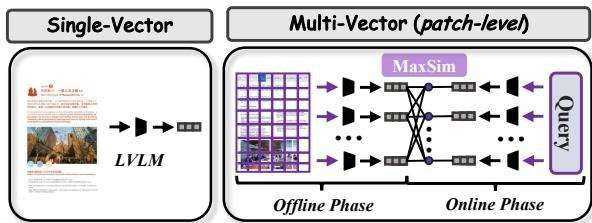  
Figure 1: Comparison of single-vec vs. multi-vec VDR.

2024a), current approaches leverage Large Vision-Language Models (LVLMs) to process entire document pages as images (Jiang et al., 2024b; Meng et al., 2025), as illustrated in Figure 1 (Left). This preserves vital structural and layout information, enabling a more holistic, "what-you-see-is-whatyou-get" understanding that is crucial for accurately interpreting tables, figures, and complex layouts.

The field has rapidly evolved from brittle OCRbased pipelines and page-level (single-vector) models to the current state-of-the-art: patch-level (multi-vector) retrieval, as illustrated in Figure (Right). Pioneered by seminal works like Col-Pali (Faysse et al., 2024), this paradigm represents each document page as a collection of patchlevel embeddings (NomicAI, 2025; Teiletche et al., 2025). This fine-grained representation allows for a late-interaction mechanism, such as MaxSim, which computes nuanced, token-to-patch similarities (Khattab and Zaharia, 2020). This capability to match a query’s specific terms to precise regions within a document has proven to deliver superior retrieval performance, as it captures localized details that single-vector representations often miss.

Despite their exceptional performance, the widespread adoption of multi-vector models is hindered by a critical efficiency bottleneck: prohibitive storage and computational overhead (Santhanam et al., 2022; Chen et al., 2024; Scheerer et al., 2025). Storing hundreds or even thousands of vectors for every single document page makes largescale deployment impractical and costly. Consequently, recent research has focused on optimizing the efficiency, largely converging on two distinct paradigms. The first is pruning-based, exemplified by DocPruner (Yan et al., 2025c), which adaptively discards less informative patches based on intra-document attention, as shown in Suffer at Figure 1 (Left). This approach can achieve a near-Compress%lossless performance with a moderate pruning rate but suffers from a sharp performance decline at higher compression ratios. The second is mergingbased, as explored in Light-ColPali/ColQwen series (Ma et al., 2025), which directly merges multiple patches into fewer vectors, as shown in Figure 1 (Right). This method offers more graceful performance degradation at high compression rates and is simple to implement. However, its crude merging process can dilute discriminative features, leading to an unstable lossless performance range.

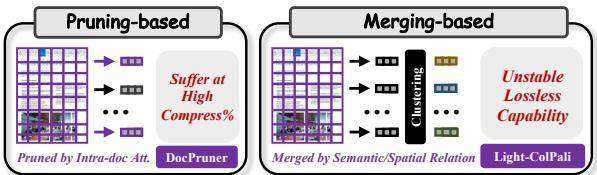  
Figure 2: Comparison of pruning-based vs. merging-based efficient VDR paradigms.

To leverage the strengths of these complementary approaches, we propose PRUNE-THEN-MERGE, a novel two-stage framework for efficient multi-vector VDR. Our core logic is to first refine, then compress. In the first stage, we employ an adaptive pruning mechanism to intelligently filter out low-information patches, such as empty spaces or decorative elements, leveraging pruning’s ability to precisely identify and remove noisy vectors. In the second stage, we apply hierarchical clustering to merge the remaining set of semantically rich patches. By performing a more sophisticated merging operation on a pre-filtered, high-quality set of vectors, our method avoids the feature dilution pitfalls of naive merging and pushes beyond the compression limits of standalone pruning.

We conducted extensive experiments to validate our approach on 29 mainstream VDR datasets, integrating PRUNE-THEN-MERGE with three leading multi-vector models: ColQwen2.5 (Faysse et al., 2024), ColNomic (NomicAI, 2025), and Jina-v4 (Günther et al., 2025). Our results yield the following key findings: $\bullet$ Compared to state-of-the-art pruning work (DocPruner), PRUNE-THEN-MERGE extends the near-lossless compression range by an average of 10 percentage points, from $[ 5 0 - 6 0 \% ]$ to $[ 6 0 - 7 0 \% ]$ . $\pmb { \varrho }$ At high compression rates (e.g., $80 \%$ and above), our method circumvents the sharp performance cliff seen in pruning-only methods, consistently outperforming all baselines.

# 2 Related Work

# 2.1 Visual Document Retrieval

The evolution of VDR can be broadly categorized into three successive paradigms. Early approaches were OCR-based (Xiao et al., 2024; Wang et al., 2023; Karpukhin et al., 2020), relying on OCR tools to extract text from document images, which was then indexed by conventional text retrievers. For a query $q$ and a document image $d$ , this can be formulated as scoring based on the extracted text $T ( d )$ , i.e., $s ( q , T ( d ) )$ . However, this process is often brittle and discards critical layout and nontextual information, limiting its effectiveness on complex documents. The advent of LVLMs catalyzed a shift towards OCR-free methods. The first wave, page-level retrieval (or single-vector retrieval) (Ma et al., 2024a; Zhang et al., 2024b; Liu et al., 2025e), encodes an entire document page $d$ and a query $q$ into single, holistic embeddings. Using an encoder $\Phi ( \cdot )$ , the relevance is typically computed as the similarity between these two vectors: $\boldsymbol { s } ( \boldsymbol { q } , d ) = \sin ( \Phi _ { \boldsymbol { q } } ( \boldsymbol { q } ) , \Phi _ { d } ( d ) )$ where $\Phi _ { q } ( q ) \in \mathbb { R } ^ { D }$ and $\Phi _ { d } ( d ) \in \mathbb { R } ^ { D }$ . While this paradigm preserves the document’s visual integrity, the single-vector representation often fails to capture fine-grained details necessary for precise matching.

To overcome this, the current paradigm has converged on patch-level retrieval (or multi-vector retrieval) (Masry, 2024; NomicAI, 2025; Günther et al., 2025; Masry et al., 2025). Pioneered by ColPali (Faysse et al., 2024), this approach represents a document page as a set of multiple patchlevel embeddings $\mathbf { \bar { D } } = \{ \mathbf { d } _ { j } \} _ { j = 1 } ^ { N _ { p } }$ , where $\mathbf { d } _ { j } \in \mathbb { R } ^ { D }$ and the query as a set of token-level embeddings $\mathbf { Q } = \{ \mathbf { q } _ { i } \} _ { i = 1 } ^ { N _ { q } }$ . Relevance is then computed via a late-interaction mechanism like MaxSim:

$$
s ( q , d ) = \sum _ { i = 1 } ^ { N q } \operatorname* { m a x } _ { j = 1 } ^ { N _ { p } } \mathbf { q } _ { i } ^ { \top } \mathbf { d } _ { j } .
$$

# 2.2 Efficient VDR

Multi-vector VDR models are hampered by a significant efficiency bottleneck: prohibitive storage overhead. Storing a set of $N _ { p }$ embeddings for each document page results in a storage cost of $O ( N _ { p } \times D )$ per page, which is orders of magnitude greater than the $O ( D )$ cost of single-vector models. This challenge has spurred research into two primary efficiency optimization paradigms.

The first is pruning-based strategies, which aim to discard redundant or less informative patch embeddings during the offline indexing stage (Zong and Piwowarski, 2025; Lassance et al., 2022). DocPruner (Yan et al., 2025c) is a representative work in this area, introducing an adaptive mechanism that leverages intra-document attention to identify and remove patches. However, pruning methods often face a sharp performance drop at higher rates. The second paradigm is mergingbased strategies, which reduce the number of embeddings by combining multiple patches into a smaller set of vectors (Clavié et al., 2024; MacAvaney et al., 2025). Light-ColPali (Ma et al., 2025) explores this by applying techniques like spatial pooling or semantic clustering. However, the averaging process inherent in merging can dilute the distinctive features of highly salient patches, often leading to a less stable performance. Furthermore, recent MetaEmbed (Xiao et al., 2025b) compresses tokens via a budget-based compression rate (e.g., Matryoshka embeddings), but it requires welldesigned training and architecture change. Therefore, we propose PRUNE-THEN-MERGE, a hybrid framework that synergizes these two paradigms to overcome their individual limitations.

See more related works in Appendix B.

# 3 Methodology

In this section, we first formalize the task setting of multi-vector VDR. We then introduce PRUNE-THEN-MERGE, detailing its two-stage mechanism.

# 3.1 Task Setting

The task of VDR is to retrieve a ranked list of relevant document pages from a corpus $\begin{array} { r l } { \mathcal { C } } & { { } = } \end{array}$ $\{ d _ { 1 } , d _ { 2 } , \ldots , d _ { | C | } \}$ for a given textual query $q$ . In the multi-vector retrieval paradigm, both queries and documents are represented as sets of embedding vectors. A LVLM-based encoder, denoted as $\Phi ( \cdot )$ , maps a textual query $q$ into a set of $N _ { q }$ token-level embeddings $\mathbf { Q } = \{ \mathbf { q } _ { i } \} _ { i = 1 } ^ { N _ { q } }$ , where each $\mathbf { q } _ { i } \in \mathbb { R } ^ { D }$ and $D$ is the embedding dimension. Similarly, a document page $d$ , rendered as an image, is processed by the same encoder $\Phi ( \cdot )$ to produce a set of $N _ { p }$ patch-level embeddings $\mathbf { D } = \{ \mathbf { d } _ { j } \} _ { j = 1 } ^ { N _ { p } }$ where each $\mathbf { d } _ { j } \in \mathbb { R } ^ { D }$ .

Following the late-interaction mechanism, the relevance score $s ( q , d )$ between the query and the document is computed via the MaxSim operation as defined in Equation (1). The primary challenge addressed in this work is the storage overhead of $O ( N _ { p } \times D )$ per page. Our objective is to generate a compressed set of document embeddings $\mathbf { D } ^ { \prime \prime }$ with size $N _ { p } ^ { \prime \prime } = | \mathbf { D } ^ { \prime \prime } |$ , such that $N _ { p } ^ { \prime \prime } \ll N _ { p }$ , thereby substantially reducing storage costs while minimizing degradation in retrieval performance.

# 3.2 The PRUNE-THEN-MERGE Framework

PRUNE-THEN-MERGE is a query-agnostic, offline compression framework designed to synergize the precision of pruning with the high-ratio compression capability of merging. The framework operates in two sequential stages: (1) an adaptive pruning stage to filter out low-information patches, followed by (2) a hierarchical merging stage to compress the remaining semantically rich patches. See our pseudo-code in Appendix C for reference.

# 3.2.1 Stage 1: Adaptive Pruning

The first stage aims to create an intermediate, refined set of patch embeddings by discarding those with low informational content, such as background or decorative elements. This is achieved by leveraging the LVLM’s internal attention mechanism as a proxy for patch importance.

Formally, during the forward pass of a document image $d$ through the encoder $\Phi ( \cdot )$ , we extract the attention weights $\mathbf { A } ^ { ( L ) } \in \mathbb { R } ^ { H \times S \times S }$ from the final transformer layer, where $H$ is the number of attention heads and $S$ is the sequence length. We average the weights across all heads to obtain a smoothed attention map $\bar { \mathbf { A } } ^ { ( L ) } \in \mathbb { R } ^ { S \times S }$ . The importance score $I ( \mathbf { d } _ { j } )$ for the $j$ -th patch is defined as the attention it receives from a global token (e.g., the [EOS] token): vector of importan $I ( \mathbf { d } _ { j } ) = \bar { \mathbf { A } } _ { \mathrm { e o s } , j } ^ { ( L ) }$ d s a. $\mathscr { T } _ { d } = \overset { \vartriangle } { \{ I ( { \bf d } _ { j } ) \} } _ { j = 1 } ^ { N _ { p } }$

We then compute a document-specific adaptive threshold $\tau _ { d }$ based on the statistical properties of these scores: $\begin{array} { r c l } { \mu _ { d } } & { = } & { \frac { 1 } { N _ { p } } \sum _ { j = 1 } ^ { N _ { p } } { I ( \mathbf { \bar { d } } _ { j } ) } } \end{array}$ ; $\begin{array} { r } { \sigma _ { d } = \sqrt { \frac { 1 } { N _ { p } } \sum _ { j = 1 } ^ { N _ { p } } ( I ( \mathbf { d } _ { j } ) - \mu _ { d } ) ^ { 2 } } } \end{array}$ ; $\tau _ { d } = \mu _ { d } + k \cdot \sigma _ { d }$ where $k$ is a hyperparameter controlling the pruning strictness. The intermediate set of pruned embeddings, $\mathbf { D ^ { \prime } }$ , is formed by retaining only patches whose importance exceeds this threshold: $\mathbf { D } ^ { \prime } =$ $\{ \mathbf { d } _ { j } \in \mathbf { D } \mid I ( \mathbf { d } _ { j } ) > \tau _ { d } \}$ . To ensure robustness, if this process yields an empty set, we retain the single patch with the highest importance score. The resulting set $\mathbf { D ^ { \prime } }$ contains $N _ { p } ^ { \prime } = | \mathbf { D } ^ { \prime } |$ embeddings, where $N _ { p } ^ { \prime } < N _ { p }$ .

# 3.2.2 Stage 2: Hierarchical Merging

The second stage takes the filtered set of highquality embeddings $\mathbf { D ^ { \prime } }$ and further compresses it through semantic clustering. This avoids the feature dilution that occurs when merging is applied to the full, noisy set of patches.

Given the intermediate set D′ ⊂ RN′p×D and a merging factor $m$ , we first determine the target number of clusters $N _ { p } ^ { \prime \prime }$ $^ { \prime } \colon N _ { p } ^ { \prime \prime } = \operatorname* { m a x } ( 1 , \lfloor N _ { p } ^ { \prime } / m \rfloor )$ We then perform hierarchical agglomerative clustering on $\mathbf { D ^ { \prime } }$ . The process involves:

1. Normalization: All embeddings in $\mathbf { D ^ { \prime } }$ are L2-normalized.

2. Distance Matrix: A pairwise distance matrix $\pmb { \Delta } \in \mathbb { R } ^ { N _ { p } ^ { \prime } \times N _ { p } ^ { \prime } }$ is computed based on cosine distance between the normalized embeddings.

3. Clustering: A linkage algorithm (e.g., Ward’s method) is applied to $\pmb { \Delta }$ to build a hierarchy, which is then partitioned into $N _ { p } ^ { \prime \prime }$ clusters. This yields a cluster assignment label for each embedding in $\mathbf { D ^ { \prime } }$ .

For each of the $N _ { p } ^ { \prime \prime }$ clusters, a new representative embedding is generated by computing the centroid (mean) of all member embeddings. This results in the final, compressed set of embeddings $\mathbf { D } ^ { \prime \prime } = \{ \mathbf { d } _ { c } ^ { \prime \prime } \} _ { c = 1 } ^ { N _ { p } ^ { \prime \prime } }$ , where each centroid $\mathbf { d } _ { c } ^ { \prime \prime } \in \mathbb { R } ^ { D }$ This two-stage process effectively reduces the initial $N _ { p }$ embeddings to a much smaller set of $N _ { p } ^ { \prime \prime }$ semantically rich representations.

# 3.2.3 Scoring with Pruned-and-Merged Embeddings

During online retrieval, the relevance score is computed using the final compressed embedding set $\mathbf { D } ^ { \prime \prime }$ . The query $q$ is encoded into $\mathbf { Q }$ as usual, and the MaxSim ssearch space: $\begin{array} { r } { s ^ { \prime \prime } ( q , d ) = \sum _ { i = 1 } ^ { N _ { q } } \operatorname* { m a x } _ { c = 1 } ^ { N _ { p } ^ { \prime \prime } } \mathbf { q } _ { i } ^ { \top } \mathbf { d } _ { c } ^ { \prime \prime } } \end{array}$ ced. By performing the expensive MaxSim operation on a significantly smaller set of embeddings $( N _ { p } ^ { \prime \prime } \ \ll$ $N _ { p , \astrosun }$ ), our framework drastically reduces online computational costs and offline storage requirements, while preserving high retrieval accuracy.

# 3.3 Theoretical Guarantee

The empirical success of the PRUNE-THEN-MERGE framework is underpinned by a sound theoretical basis. We posit that its superiority stems from decomposing a single, complex compression problem into a sequence of two more tractable, specialized sub-problems: (1) query-agnostic information filtering via pruning, and (2) redundancy reduction via merging. This decomposition allows for a more effective approximation of the ideal, yet intractable, Information Bottleneck (IB) objective.

# 3.3.1 The Optimization Problem as an IB

The overarching goal is to compress the full patch embedding set $\mathbf { D }$ into a compact set $\mathbf { D } ^ { \prime \prime }$ that retains maximum relevance to any potential query. Following the IB principle, this can be formulated as: $\mathrm { { \ m a x } _ { D ^ { \prime \prime } } }$ $\mathbb { E } _ { q \sim P ( q ) } [ I ( \mathbf { D } ^ { \prime \prime } ; s ( q , \mathbf { D } ) ) ] - \beta I ( \mathbf { D } ^ { \prime \prime } ; \mathbf { D } )$ where $s ( q , \mathbf { D } )$ is the relevance score and $P ( q )$ is the unknown query distribution. This problem is intractable. Our framework approximates this by decomposing the overall compression mapping $g : \mathbf { D }  \mathbf { D } ^ { \prime \prime }$ into a composition of two functions, $g = g _ { m } \circ g _ { p }$ , where $g _ { p }$ is the pruning map and $g _ { m }$ is the merging map.

# 3.3.2 Pruning as Query-Agnostic Information Filtering

The first stage, pruning, acts as an information filter. We assume the full patch set $\mathbf { D }$ can be partitioned into a high-information signal set $\mathbf { D } _ { \mathrm { s i g } }$ and a lowinformation noise set $\mathbf { D } _ { \mathrm { n o i } }$ . The key assumption is that for any patch $\mathbf { d } _ { \mathrm { n o i } } \in \mathbf { D } _ { \mathrm { n o i } }$ , its contribution to the document’s global semantics (represented by the [EOS] token’s hidden state $\mathbf { h } _ { \mathrm { e o s . } }$ ) is negligible: $I ( { \bf d } _ { \mathrm { n o i } } ; { \bf h } _ { \mathrm { e o s } } ) \approx 0$ , $\forall \mathbf { d } _ { \mathrm { n o i } } \ \in \ \mathbf { D } _ { \mathrm { n o i } }$ . The objective of the pruning stage $g _ { p }$ is to produce an intermediate set $\mathbf { D ^ { \prime } }$ that approximates the true signal set, ${ \bf D } ^ { \prime } \approx { \bf D } _ { \mathrm { s i g } }$ , by maximizing the preserved information about the document’s global meaning: $\begin{array} { r } { \mathbf { D } ^ { \prime } = g _ { p } ( \mathbf { D } ) = \arg \operatorname* { m a x } _ { \hat { \mathbf { D } } \subset \mathbf { D } } \quad I ( \hat { \mathbf { D } } ; \mathbf { h } _ { \mathrm { e o s } } ) . } \end{array}$ subject to a compression constraint. Our adaptive thresholding mechanism, which leverages the attention scores $I ( { \bf d } _ { j } ) \propto I ( { \bf d } _ { j } ; { \bf h } _ { \mathrm { e o s } } )$ , serves as a practical solver for this objective. This filtering step is crucial as it transforms the input for the next stage from a low Signal-to-Noise Ratio (SNR) set $\mathbf { D }$ to a high-SNR set $\mathbf { D ^ { \prime } }$ .

# 3.3.3 Merging as Rate-Distortion Optimization

The second stage, merging, addresses the semantic redundancy within the filtered set $\mathbf { D ^ { \prime } }$ This is a classic vector quantization problem, which can be framed under Rate-Distortion theory. The goal is to find a "codebook" $\mathbf { D } ^ { \prime \prime }$ of size $N _ { p } ^ { \prime \prime }$ (the "rate") that minimizes the information loss, or "distortion," with respect

to the high-SNR signal $\mathbf { D ^ { \prime } }$ . The distortion is quantified by Mean Squared Error (MSE). The objective of merging map $g _ { m }$ is: $\mathbf { D } ^ { \prime \prime } = g _ { m } ( \mathbf { D } ^ { \prime } ) =$ arg min $\begin{array} { r } { \underset { : N _ { p } ^ { \prime \prime } } { \mathbb { E } } \mathbf { d } _ { j } \in \mathbf { D } ^ { \prime } \left[ \operatorname* { m i n } _ { \hat { \mathbf { d } } \in \hat { \mathbf { D } } ^ { \prime \prime } } | | \mathbf { d } _ { j } - \hat { \mathbf { d } } | | _ { 2 } ^ { 2 } \right] } \end{array}$ .   
Dˆ ′′⊂RD ,|Dˆ ′′|=   
Hierarchical clustering followed by centroid   
computation is a highly effective algorithm for   
solvingclusters or a given partition, the optimal centroid $\mathbf { D ^ { \prime } }$ into each $\{ C _ { c } \} _ { c = 1 } ^ { N _ { p } ^ { \prime \prime } }$ $\mathbf { d } _ { c } ^ { \prime \prime }$   
its mean: $\begin{array} { r } { \mathbf { d } _ { c } ^ { \prime \prime } = \underset { \mathbf { v } \in \mathbb { R } ^ { D } } { \arg \operatorname* { m i n } } \sum _ { \mathbf { d } _ { j } \in C _ { c } } | | \mathbf { d } _ { j } - \mathbf { v } | | _ { 2 } ^ { 2 } = } \end{array}$ $\begin{array} { r } { \frac { 1 } { | C _ { c } | } \sum _ { \mathbf { d } _ { j } \in C _ { c } } \mathbf { d } _ { j } } \\ { \frac { 1 } { | C _ { c } | } \sum _ { \mathbf { d } _ { j } \in C _ { c } } \mathbf { d } _ { j } } \end{array}$ . This stage efficiently reduces   
redundancy by creating a compact, summary   
representation of the core semantic concepts.

# 3.3.4 The Synergistic Advantage

The efficacy of PRUNE-THEN-MERGE arises from the synergy between these two stages. Let $\mathbf { d } _ { c } ^ { * } ( S )$ denote the optimal centroid for a cluster within a set $s$ . A naive, single-stage merging approach operates directly on the noisy set $\mathbf { D } = \mathbf { D } _ { \mathrm { s i g } } \cup \mathbf { D } _ { \mathrm { n o i } }$ . Its resulting centroids are inherently biased estimators of the true semantic concepts:

$$
\mathbf { d } _ { c } ^ { * } ( \mathbf { D } ) = \frac { 1 } { | C _ { c } | } \left( \sum _ { \mathbf { d } _ { j } \in C _ { c } \cap \mathbf { D } _ { \mathrm { s i g } } } \mathbf { d } _ { j } + \sum _ { \mathbf { d } _ { k } \in C _ { c } \cap \mathbf { D } _ { \mathrm { n o i } } } \mathbf { d } _ { k } \right) .
$$

The noise vectors $\mathbf { d } _ { k }$ pull the centroids away from the true signal’s center of mass. In contrast, our framework first isolates $\begin{array} { r l } { \mathbf { D } ^ { \prime } } & { { } \approx } \end{array}$ $\mathbf { D } _ { \mathrm { s i g } }$ , so the subsequent merging stage computes centroids $\mathbf { d } _ { c } ^ { * } ( \mathbf { D } ^ { \prime } )$ that are largely unbiased by noise. Consequently, the distortion of the final representation with respect to the true signal is significantly lower for our method. Let $\mathbf { D } _ { \mathrm { o u r s } } ^ { \prime \prime } = g _ { m } ( g _ { p } ( \mathbf { D } ) )$ and $\mathbf { D } _ { \mathrm { n a i v e } } ^ { \prime \prime } = g _ { m } ( \mathbf { D } )$ . We can assert: Edj∈Dsig $\begin{array} { r } { \mathbb { E } _ { \mathbf { d } _ { j } \in \mathbf { D } _ { \mathrm { s i g } } } \left[ \operatorname* { m i n } _ { \hat { \mathbf { d } } \in \mathbf { D } _ { \mathrm { o u r s } } ^ { \prime \prime } } | | \mathbf { d } _ { j } - \hat { \mathbf { d } } | | _ { 2 } ^ { 2 } \right] \ \ll \ } \end{array}$ $\begin{array} { r } { \mathbb { E } _ { \mathbf { d } _ { j } \in \mathbf { D } _ { \mathrm { s i g } } } \left[ \operatorname* { m i n } _ { \hat { \mathbf { d } } \in \mathbf { D } _ { \mathrm { n a i v e } } ^ { \prime \prime } } \mathbf { \bar { \Pi } } | | \mathbf { d } _ { j } - \hat { \mathbf { d } } | | _ { 2 } ^ { 2 } \right] } \end{array}$ . By decomposing the problem, PRUNE-THEN-MERGE ensures that the final compact representation is a more faithful summary of the document’s essential information, leading to a superior performancecompression trade-off.

See more theoretical analysis in Appendix D.

# 4 Experiments and Analysis

# 4.1 Experimental Setup

Benchmarks & Evaluation. Our experimental validation is performed on a comprehensive suite of six representative VDR benchmarks, totaling 29 distinct datasets (more details in Appendix E). These include ViDoRe-V1 (Faysse et al., 2024), ViDoRe-V2 (Macé et al., 2025), JinaVDR-Bench (Günther et al., 2025), REAL-MM-RAG (Wasserman et al., 2025), ViDoSeek (Wang et al., 2025b), and MMLongBench-Doc (Ma et al., 2024b). We integrate our framework with three leading multi-vector models to serve as our base models: ColQwen2.5 (Faysse et al., 2024), Col-Nomic (NomicAI, 2025), and Jina Embeddings v4 (Günther et al., 2025). Following standard VDR practices (Faysse et al., 2024; Günther et al., 2025; Xu et al., 2025a), we adopt nDCG $\boldsymbol { @ 5 }$ as the primary evaluation metric.

Baselines. We benchmark our PRUNE-THEN-MERGE against three categories of baselines. See detailed elaboration of baselines in Appendix F.

(I) Base Models. These are the original, uncompressed multi-vector models. They serve as the performance ceiling and storage-cost upper bound.

(II) Pruning-based Methods. We compare against four strategies that reduce vector count:

▶ Random: A naive baseline that randomly removes a fixed fraction of patch embeddings. Its hyperparameter is the pruning_ratio.

▶ Attention-plus-Similarity: An adaptive approach that prunes patches based on a combined score of importance ([EOS] attention) and representativeness ([EOS] similarity), following Wen et al. (2025). Key hyperparameters are an adaptation factor k and a weighting factor alpha.

▶ Pivot-Threshold: A two-stage adaptive method inspired by VisPruner (Zhang et al., 2025), which first filters patches via an adaptive attention threshold and then de-duplicates the resulting set based on similarity to pivot tokens. Hyperparameters include an importance factor k, a de-duplication factor k_dup, and num_pivots.

▶ DocPruner: A state-of-the-art adaptive method that discards less informative patches based on the intra-document attention distribution, following Yan et al. (2025c). Its primary hyperparameter is the adaptation factor $\mathsf { k }$ .

(III) Merging-based Methods. Following Ma et al. (2025), we compare three merging strategies:

Sem-Cluster: Applies hierarchical clustering to patch embeddings and uses cluster centroids as the merged representation. The tunable hyperparameter is the merging_factor.

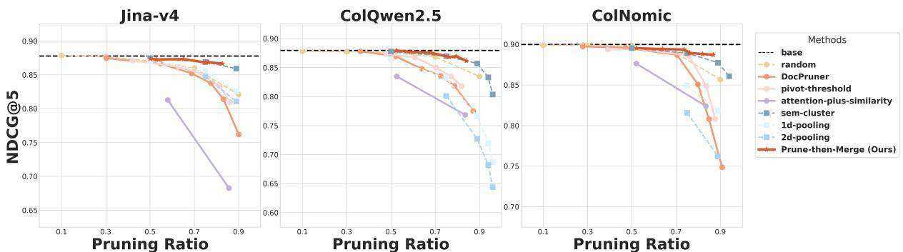  
Figure 3: Performance comparison $( \mathrm { n D C G } @ 5 )$ between PRUNE-THEN-MERGE and baselines on ViDoRe-V1 (Faysse et al., 2024) across Jina-v4 (Left), ColQwen2.5 (Middle), and ColNomic (Right). solid lines denote adaptive methods, whereas dashed lines denote non-adaptive ones; circular nodes represent pruning methods, whereas square nodes represent merging ones.

▶ 1D-Pooling: Groups sequential patch embeddings and reduces them via 1D average pooling. The hyperparameter is the merging_factor, defining the pooling window size.

▶ 2D-Pooling: Organizes embeddings into a 2D grid and applies 2D average pooling. The merging_factor must be a perfect square.

Implementation Details. To ensure fair comparisons, we reproduced the results for all base models in alignment with their official implementations. Our evaluation framework is built upon the official ViDoRe Benchmark repository2. For PRUNE-THEN-MERGE, we explore a range of hyperparameters: the adaptation factor $k$ for the pruning stage is selected from $\{ - 1 , - 0 . 7 5 , - 0 . 5 \}$ , and the merging factor $m$ for the merging stage is chosen from $\{ 2 , 4 \}$ . Detailed hyperparameter settings for all baselines are provided in Appendix F. All experiments were conducted on a cluster of NVIDIA A100 (80GB) GPUs. The complete codebased will be made publicly available upon acceptance.

# 4.2 Experimental Analysis

In this section, we conduct a comprehensive experimental analysis to rigorously evaluate PRUNE-THEN-MERGE framework3, which is guided by five research questions (RQs): (RQ1) How does PRUNE-THEN-MERGE maintain its superior performance across a wide variety of visual document types? (RQ2) Does the performance advantage of PRUNE-THEN-MERGE generalize robustly to multilingual retrieval scenarios? (RQ3) Can the framework’s effectiveness extend to more complex, realworld settings that require semantic understanding instead of keyword matching? (RQ4) What is the performance gap between PRUNE-THEN-MERGE framework and its variants? (RQ5) What are the quantifiable gains in storage efficiency that PRUNE-THEN-MERGE achieves?

# 4.2.1 VDR Performance Comparison

Our PRUNE-THEN-MERGE framework consistently demonstrates near-lossless performance at high compression rates, maintaining base performance up to approximately a $70 \%$ pruning rate across a diverse array of 16 datasets from four major VDR benchmarks (We only leave ViDoRe-V1 illustration in main text due to space limit. See the rest in Appendix G.2.). For instance, on the comprehensive ViDoRe-V1 (Figure 3), our method maintains the base $\mathrm { n D C G } @ 5$ of 0.87 with ColQwen2.5, even after compressing the embeddings by $68 \%$ .

At extremely high compression rates $( 8 0 - 9 0 \% )$ , where the performance of baselines typically collapses, PRUNE-THEN-MERGE consistently establishes its superiority over both pruning- and merging-only baselines. Pruning-only methods like DocPruner suffer a sharp performance cliff beyond a $70 \%$ pruning rate. For example, on ViDoRe-V1 with ColQwen2.5 at an ${ \sim } 8 4 { \cdot } 8 7 \%$ pruning rate, PRUNE-THEN-MERGE achieves an $\mathrm { n D C G } @ 5$ of 0.86, whereas DocPruner drops sharply to 0.77. While merging-based methods like Sem-Cluster exhibit more graceful degradation, our framework still frequently matches or outperforms them. This advantage stems from our method’s ability to avoid two failure modes: it circumvents the drastic information loss of aggressive pruning by first identifying and then summarizing semantic clusters, and it avoids feature dilution of naive merging by operating on a pre-filtered, high-signal set of embeddings.

A notable observation is that PRUNE-THEN-MERGE appears to have a slightly extended nearlossless compression range when integrated with the Jina-v4 model. For example, on both the Vi-DoSeek and MMLongBench-Doc, our framework maintains the full baseline performance of the Jinav4 model up to a $7 5 \%$ pruning rate. In contrast, a pure pruning approach like DocPruner experiences a significant performance drop at a similar compression level on these datasets (e.g., from a baseline of 0.54 to 0.48 on MMLongBench-Doc at a $7 7 \%$ rate). We speculate this is linked to Jina-v4’s unique training paradigm, which simultaneously optimizes for both single-vector (pooled) and multi-vector representations (Günther et al., 2025). This inherent training for pooling likely makes its embeddings more amenable to merging operations.

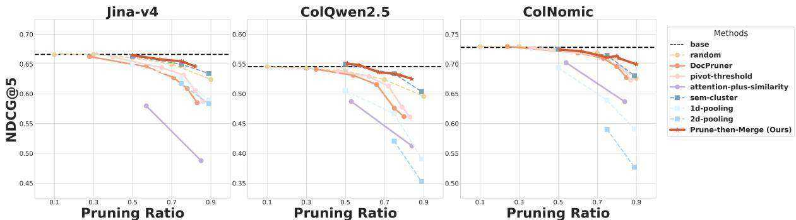  
Figure 4: Performance comparison $\mathrm { ( n D C G } @ 5 \mathrm { ) }$ between PRUNE-THEN-MERGE and baselines on JinaVDR (Günther et al., 2025) across Jina-v4 (Left), ColQwen2.5 (Middle), and ColNomic (Right). solid lines denote adaptive methods, whereas dashed lines denote non-adaptive ones; circular nodes represent pruning methods, whereas square nodes represent merging ones.

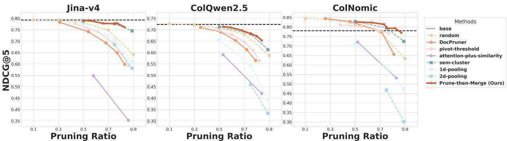  
Figure 5: Performance comparison $\mathrm { ( n D C G } @ 5 \mathrm { ) }$ between PRUNE-THEN-MERGE and baselines on REAL-MM-RAG (Wasserman et al., 2025) across Jina-v4 $( L e f t )$ , ColQwen2.5 (Middle) & ColNomic (Right). solid lines denote adaptive methods, whereas dashed lines denote non-adaptive ones; circular nodes represent pruning methods, whereas square nodes represent merging ones.

# 4.2.2 Generalization to Multilingual Scenarios

Our framework’s effectiveness generalizes robustly across the nine diverse languages in the JinaVDR, proving its utility in global-scale retrieval systems. The results, shown in Figure 4, demonstrate that PRUNE-THEN-MERGE consistently maintains a superior performance-compression trade-off regardless of the language. For example, when paired with ColQwen2.5, our method achieves an overall $\mathrm { n D C G } @ 5$ of 0.52 at an $84 \%$ compression rate, outperforming DocPruner, which scores 0.46 at a lower $80 \%$ rate. This language-agnostic capability stems from our reliance on the VLM’s universal, pre-trained understanding of visual and semantic structures, allowing the framework to identify and compress information without being biased by language-specific features. Due to space limit, see more discussion in Appendix G.3.

# 4.2.3 Generalization to Complex Settings

The superiority of PRUNE-THEN-MERGE extends to the challenging REAL-MM-RAG benchmark, which is designed to test deep semantic understanding through non-extractive, rephrased queries. Across all three base models, our framework consistently outperforms baselines, especially at high compression rates, as shown in Figure 5. With the ColQwen2.5 model, for instance, PRUNE-THEN-MERGE achieves an $\mathrm { n D C G } @ 5$ of 0.65 at an aggressive $84 \%$ compression rate, clearly surpassing DocPruner (0.56) and Sem-Cluster (0.61) at similar or lower rates. This proves that by distilling documents into a set of core semantic centroids, our method creates a representation that is robust to abstract, rephrased queries.

Our framework’s advantage is especially critical for dense, text-heavy document formats, where pruning-only methods falter dramatically under high compression. On the dense Financial Report dataset with Jina-v4, DocPruner’s performance plummets from a 0.69 baseline to just 0.44 at an $84 \%$ pruning rate, marking a $36 \%$ relative drop. In stark contrast, PRUNE-THEN-MERGE gracefully degrades to only 0.66 at a comparable $83 \%$ rate, demonstrating remarkable stability. This suggests that dense documents contain high levels of semantic redundancy that are poorly handled by aggressive pruning; our method’s merging stage excels in this scenario by summarizing semantically related text chunks into robust centroids, preserving the document’s holistic meaning far more effectively. See more discussion in Appendix G.4.

# 4.2.4 Variant Analysis

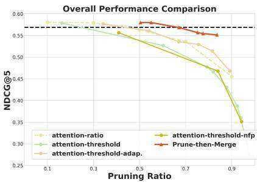  
Figure 6: Variant comparisons of Jina-v4 on ViDoRe-V2.

We conduct a variant analysis on the ViDoRe-V2 benchmark using the Jina-v4, as shown in Figure 6. We compare PRUNE-THEN-MERGE against several variants: (I) attention-ratio, a non-adaptive baseline that removes a fixed proportion of patches with the lowest attention scores; (II) attention-threshold, a static variant that discards patches based on a single, globally-defined attention threshold; (III) attention-threshold-nfp, which augments the static threshold approach by prepending a noisefiltering prompt to guide the model’s focus; and (IV) attention-threshold-adap, our adaptive pruning stage which is identical to DocPruner.

The complete PRUNE-THEN-MERGE framework consistently outperforms its standalone pruning component (attention-threshold-adap), underscoring the critical contribution of the subsequent merging stage, especially at high compression rates. While our framework and its pruningonly counterpart perform identically at lower compression rates, a clear performance gap emerges as compression becomes more aggressive. For example, at an approximately $80 \%$ compression rate, PRUNE-THEN-MERGE maintains a robust $\mathrm { n D C G } @ 5$ of 0.55, whereas the adaptive pruningonly variant drops to 0.51. This confirms our central hypothesis: the initial pruning stage creates a high-quality, refined set of embeddings that allows the subsequent merging stage to operate more effectively, summarizing semantic concepts without the distortion caused by noise, a limitation inherent to pruning-only approaches at high compression. See more discussion in Appendix G.5.

Table 1: Relative improvement of PRUNE-THEN-MERGE wrt. performance, storage, and latency to base models on ViDoRe-V1 (We set adaptation factor as -0.75 and merging factor as 4; orange denotes better and green denotes worse).   

<table><tr><td>△</td><td>ColQwen</td><td>ColNomic</td><td>JinaV4</td></tr><tr><td>nDCG@5</td><td>↓0.27%</td><td>↓0.51%</td><td>↓0.57%</td></tr><tr><td> Storage</td><td>↓58.88%</td><td>↓52.16%</td><td>↓52.77%</td></tr><tr><td>Latency</td><td>↑56.10%</td><td>↑51.11%</td><td>↑47.06%</td></tr></table>

# 4.2.5 Efficiency Analysis

PRUNE-THEN-MERGE achieves a compelling balance between compression ratio and retrieval fidelity, effectively reducing storage costs by over half with minimal impact on accuracy. As detailed in Table 1 (See details in Appendix G.6), the framework yields a substantial overall storage reduction of $5 4 . 6 0 \%$ across the three base models, reaching a peak reduction of $5 8 . 8 8 \%$ for ColQwen2.5. Despite this aggressive compression, retrieval performance remains remarkably robust, with the average $\mathrm { n D C G } @ 5$ decreasing by only a marginal $0 . 4 5 \%$ relative to the base models. While our approach increases the average per-document encoding latency from 0.46s to $0 . 6 9 s$ , this overhead is incurred exclusively during the offline indexing stage and remains well within a perfectly acceptable range for real-world applications, especially considering that traditional OCR-based retrieval pipelines (e.g., OCR paired with BGE-M3 (Chen et al., 2023)) can often exceed 7 seconds per page.

# 5 Conclusion

In this work, we addressed the critical efficiency bottleneck in multi-vector VDR by proposing PRUNE-THEN-MERGE, a novel two-stage compression framework. Our framework uniquely synergizes the precision of pruning with the high-ratio compression of merging, following a ‘first refine, then compress’ paradigm. Through extensive experiments, we demonstrated that our approach not only extends the near-lossless compression range but also maintains superior performance at aggressive compression rates. Ultimately, PRUNE-THEN-MERGE provides a blueprint for advancing the practical applicability of multi-vector models.

# Limitations

• The efficacy of the pruning stage is inherently tied to the reliability of the base LVLM’s internal attention mechanism as a proxy for patch importance. We plan to investigate more sophisticated, query-independent ranking metrics, such as gradient-based importance, to provide a more accurate signal for information filtering.

• The framework currently relies on predefined hyperparameters, such as the adaptation factor and merging factor, to balance the compression-performance trade-off. We will work toward developing more automated, data-driven strategies that can self-adapt these parameters based on document complexity and layout characteristics.

# Acknowledgments

This work was supported by the Alibaba Innovative Research (AIR) Program (Grant No.64575662); Alibaba Research Intern Program; National Natural Science Foundation of China (Grant No.62506318); Guangdong Provincial Department of Education Project (Grant No.2024KQNCX028); Scientific Research Projects for the Highereducational Institutions (Grant No.2024312096), Education Bureau of Guangzhou Municipality; Guangzhou-HKUST(GZ) Joint Funding Program (Grant No.2025A03J3957), Education Bureau of Guangzhou Municipality.

# References

Shuai Bai, Yuxuan Cai, Ruizhe Chen, Keqin Chen, Xionghui Chen, Zesen Cheng, Lianghao Deng, Wei Ding, Chang Gao, Chunjiang Ge, and 1 others. 2025. Qwen3-vl technical report. arXiv preprint arXiv:2511.21631.

Min Cao, Shiping Li, Juntao Li, Liqiang Nie, and Min Zhang. 2022. Image-text retrieval: A survey on recent research and development. arXiv preprint arXiv:2203.14713.

Jianlv Chen, Shitao Xiao, Peitian Zhang, Kun Luo, Defu Lian, and Zheng Liu. 2023. Bge m3-embedding: Multi-lingual, multi-functionality, multi-granularity text embeddings through self-knowledge distillation. Preprint, arXiv:2309.07597.

Tong Chen, Hongwei Wang, Sihao Chen, Wenhao Yu, Kaixin Ma, Xinran Zhao, Hongming Zhang, and Dong Yu. 2024. Dense x retrieval: What retrieval granularity should we use? In Proceedings of the

2024 Conference on Empirical Methods in Natural Language Processing, pages 15159–15177.

Wang Chen, Wenhan Yu, Guanqiang Qi, Weikang Li, Yang Li, Lei Sha, Deguo Xia, and Jizhou Huang. 2025. Cmrag: Co-modality-based visual document retrieval and question answering. arXiv preprint arXiv:2509.02123.

Benjamin Clavié, Antoine Chaffin, and Griffin Adams. 2024. Reducing the footprint of multi-vector retrieval with minimal performance impact via token pooling. arXiv preprint arXiv:2409.14683.

Benjamin Clavié, Sean Lee, Rikiya Takehi, Aamir Shakir, and Makoto P Kato. 2025a. Simple projection variants improve colbert performance. arXiv preprint arXiv:2510.12327.

Benjamin Clavié, Xianming Li, Antoine Chaffin, Omar Khattab, Tom Aarsen, Manuel Faysse, and Jing Li. 2025b. Lir: The first workshop on late interaction and multi vector retrieval $@$ ecir 2026. arXiv preprint arXiv:2511.00444.

Xuanming Cui, Jianpeng Cheng, Hong-you Chen, Satya Narayan Shukla, Abhijeet Awasthi, Xichen Pan, Chaitanya Ahuja, Shlok Kumar Mishra, Yonghuan Yang, Jun Xiao, and 1 others. 2025. Think then embed: Generative context improves multimodal embedding. arXiv preprint arXiv:2510.05014.

Song Dai, Yibo Yan, Jiamin Su, Dongfang Zihao, Yubo Gao, Yonghua Hei, Jungang Li, Junyan Zhang, Sicheng Tao, Zhuoran Gao, and 1 others. 2025. Physicsarena: The first multimodal physics reasoning benchmark exploring variable, process, and solution dimensions. arXiv preprint arXiv:2505.15472.

Manuel Faysse, Hugues Sibille, Tony Wu, Bilel Omrani, Gautier Viaud, Céline Hudelot, and Pierre Colombo. 2024. Colpali: Efficient document retrieval with vision language models. arXiv preprint arXiv:2407.01449.

Sensen Gao, Shanshan Zhao, Xu Jiang, Lunhao Duan, Yong Xien Chng, Qing-Guo Chen, Weihua Luo, Kaifu Zhang, Jia-Wang Bian, and Mingming Gong. 2025. Scaling beyond context: A survey of multimodal retrieval-augmented generation for document understanding. arXiv preprint arXiv:2510.15253.

Gordon, Greenspan, and Goldberger. 2003. Applying the information bottleneck principle to unsupervised clustering of discrete and continuous image representations. In Proceedings Ninth IEEE International Conference on Computer Vision, pages 370– 377. IEEE.

Tiancheng Gu, Kaicheng Yang, Ziyong Feng, Xingjun Wang, Yanzhao Zhang, Dingkun Long, Yingda Chen, Weidong Cai, and Jiankang Deng. 2025a. Breaking the modality barrier: Universal embedding learning with multimodal llms. In Proceedings of the 33rd ACM International Conference on Multimedia, pages 2860–2869.

Tiancheng Gu, Kaicheng Yang, Kaichen Zhang, Xiang An, Ziyong Feng, Yueyi Zhang, Weidong Cai, Jiankang Deng, and Lidong Bing. 2025b. Unime-v2: Mllm-as-a-judge for universal multimodal embedding learning. arXiv preprint arXiv:2510.13515.

Michael Günther, Saba Sturua, Mohammad Kalim Akram, Isabelle Mohr, Andrei Ungureanu, Bo Wang, Sedigheh Eslami, Scott Martens, Maximilian Werk, Nan Wang, and 1 others. 2025. jina-embeddings-v4: Universal embeddings for multimodal multilingual retrieval. arXiv preprint arXiv:2506.18902.

Haoming Huang, Yibo Yan, Jiahao Huo, Xin Zou, Xinfeng Li, Kun Wang, and Xuming Hu. 2025. Pierce the mists, greet the sky: Decipher knowledge overshadowing via knowledge circuit analysis. arXiv preprint arXiv:2505.14406.

Jiahao Huo, Yibo Yan, Boren Hu, Yutao Yue, and Xuming Hu. 2024. Mmneuron: Discovering neuron-level domain-specific interpretation in multimodal large language model. arXiv preprint arXiv:2406.11193.

Jiahao Huo, Yibo Yan, Xu Zheng, Yuanhuiyi Lyu, Xin Zou, Zhihua Wei, and Xuming Hu. 2025. Mmunlearner: Reformulating multimodal machine unlearning in the era of multimodal large language models. arXiv preprint arXiv:2502.11051.

Rajesh Jayaram, Laxman Dhulipala, Majid Hadian, Jason D Lee, and Vahab Mirrokni. 2024. Muvera: Multi-vector retrieval via fixed dimensional encoding. Advances in Neural Information Processing Systems, 37:101042–101073.

Rohan Jha, Bo Wang, Michael Günther, Georgios Mastrapas, Saba Sturua, Isabelle Mohr, Andreas Koukounas, Mohammad Kalim Akram, Nan Wang, and Han Xiao. 2024. Jina-colbert-v2: A general-purpose multilingual late interaction retriever. arXiv preprint arXiv:2408.16672.

Weijian Jian, Yajun Zhang, Dawei Liang, Chunyu Xie, Yixiao He, Dawei Leng, and Yuhui Yin. 2025. Rzenembed: Towards comprehensive multimodal retrieval. arXiv preprint arXiv:2510.27350.

Ting Jiang, Minghui Song, Zihan Zhang, Haizhen Huang, Weiwei Deng, Feng Sun, Qi Zhang, Deqing Wang, and Fuzhen Zhuang. 2024a. E5-v: Universal embeddings with multimodal large language models. arXiv preprint arXiv:2407.12580.

Ziyan Jiang, Rui Meng, Xinyi Yang, Semih Yavuz, Yingbo Zhou, and Wenhu Chen. 2024b. Vlm2vec: Training vision-language models for massive multimodal embedding tasks. arXiv preprint arXiv:2410.05160.

Gemma Team Aishwarya Kamath, Johan Ferret, Shreya Pathak, Nino Vieillard, Ramona Merhej, Sarah Perrin, Tatiana Matejovicova, Alexandre Ram’e, Morgane Rivière, Louis Rouillard, Thomas Mesnard, and 1 others. 2025. Gemma 3 technical report. arXiv preprint arXiv:2503.19786.

Hyukkyu Kang, Injung Kim, and Wook-Shin Han. 2025. Trial: Token relations and importance aware lateinteraction for accurate text retrieval. In Proceedings of the 2025 Conference on Empirical Methods in Natural Language Processing, pages 16875–16888.

Vladimir Karpukhin, Barlas Oguz, Sewon Min, Patrick SH Lewis, Ledell Wu, Sergey Edunov, Danqi Chen, and Wen-tau Yih. 2020. Dense passage retrieval for open-domain question answering. In EMNLP (1), pages 6769–6781.

Omar Khattab and Matei Zaharia. 2020. Colbert: Efficient and effective passage search via contextualized late interaction over bert. In Proceedings of the 43rd International ACM SIGIR conference on research and development in Information Retrieval, pages 39– 48.

Juyeon Kim, Geon Lee, Dongwon Choi, Taeuk Kim, and Kijung Shin. 2025. Hybrid-vector retrieval for visually rich documents: Combining single-vector efficiency and multi-vector accuracy. arXiv preprint arXiv:2510.22215.

Adithya S Kolavi and Vyoman Jain. 2025. M3dr: Towards universal multilingual multimodal document retrieval. arXiv preprint arXiv:2512.03514.

Zhibin Lan, Liqiang Niu, Fandong Meng, Jie Zhou, and Jinsong Su. 2025. Ume-r1: Exploring reasoningdriven generative multimodal embeddings. arXiv preprint arXiv:2511.00405.

Carlos Lassance, Maroua Maachou, Joohee Park, and Stéphane Clinchant. 2022. Learned token pruning in contextualized late interaction over bert (colbert). In Proceedings of the 45th International ACM SI-GIR Conference on Research and Development in Information Retrieval, pages 2232–2236.

Lei Li, Yuqi Wang, Runxin Xu, Peiyi Wang, Xiachong Feng, Lingpeng Kong, and Qi Liu. 2024. Multimodal arxiv: A dataset for improving scientific comprehension of large vision-language models. Preprint, arXiv:2403.00231.

Minghan Li, Sheng-Chieh Lin, Xueguang Ma, and Jimmy Lin. 2023. Slim: Sparsified late interaction for multi-vector retrieval with inverted indexes. In Proceedings of the 46th International ACM SIGIR Conference on Research and Development in Information Retrieval, pages 1954–1959.

Minghan Li, Sheng-Chieh Lin, Barlas Oguz, Asish Ghoshal, Jimmy Lin, Yashar Mehdad, Wen-tau Yih, and Xilun Chen. 2022. Citadel: Conditional token interaction via dynamic lexical routing for efficient and effective multi-vector retrieval. arXiv preprint arXiv:2211.10411.

Zhonghang Li, Lianghao Xia, Xubin Ren, Jiabin Tang, Tianyi Chen, Yong Xu, and Chao Huang. 2025. Urban computing in the era of large language models. ACM Transactions on Intelligent Systems and Technology, 16(6):1–43.

Sheng-Chieh Lin, Chankyu Lee, Mohammad Shoeybi, Jimmy Lin, Bryan Catanzaro, and Wei Ping. 2024. Mm-embed: Universal multimodal retrieval with multimodal llms. arXiv preprint arXiv:2411.02571.

Zijie Lin, Yiqing Shen, Qilin Cai, He Sun, Jinrui Zhou, and Mingjun Xiao. 2025. Autop2c: An llmbased agent framework for code repository generation from multimodal content in academic papers. arXiv preprint arXiv:2504.20115.

Chunxu Liu, Jiyuan Yang, Ruopeng Gao, Yuhan Zhu, Feng Zhu, Rui Zhao, and Limin Wang. 2025a. Reasoning guided embeddings: Leveraging mllm reasoning for improved multimodal retrieval. arXiv preprint arXiv:2511.16150.

Qianying Liu, Xiao Liang, Zhiqiang Zhang, Yibo Chen, Xu Tang, Zhongfei Qing, Fengfan Zhou, Yao Hu, and Paul Henderson. 2025b. Rematch: Boosting representation through matching for multimodal retrieval. arXiv preprint arXiv:2511.19278.

Shuliang Liu, Qi Zheng, Jesse Jiaxi Xu, Yibo Yan, He Geng, Aiwei Liu, Peijie Jiang, Jia Liu, Yik-Cheung Tam, and Xuming Hu. 2025c. Vla-mark: A cross modal watermark for large vision-language alignment model. arXiv preprint arXiv:2507.14067.

Yijun Liu, Wu Liu, Xiaoyan Gu, Yong Rui, Xiaodong He, and Yongdong Zhang. 2026. Lmagent: A largescale multimodal agents society for multi-user simulation. IEEE Transactions on Multimedia.

Yikun Liu, Yajie Zhang, Jiayin Cai, Xiaolong Jiang, Yao Hu, Jiangchao Yao, Yanfeng Wang, and Weidi Xie. 2025d. Lamra: Large multimodal model as your advanced retrieval assistant. In Proceedings of the Computer Vision and Pattern Recognition Conference, pages 4015–4025.

Ze Liu, Zhengyang Liang, Junjie Zhou, Zheng Liu, and Defu Lian. 2025e. Any information is just worth one single screenshot: Unifying search with visualized information retrieval. arXiv preprint arXiv:2502.11431.

Lin Long, Yichen He, Wentao Ye, Yiyuan Pan, Yuan Lin, Hang Li, Junbo Zhao, and Wei Li. 2025. Seeing, listening, remembering, and reasoning: A multimodal agent with long-term memory. arXiv preprint arXiv:2508.09736.

Xueguang Ma, Sheng-Chieh Lin, Minghan Li, Wenhu Chen, and Jimmy Lin. 2024a. Unifying multimodal retrieval via document screenshot embedding. arXiv preprint arXiv:2406.11251.

Yubo Ma, Jinsong Li, Yuhang Zang, Xiaobao Wu, Xiaoyi Dong, Pan Zhang, Yuhang Cao, Haodong Duan, Jiaqi Wang, Yixin Cao, and 1 others. 2025. Towards storage-efficient visual document retrieval: An empirical study on reducing patch-level embeddings. arXiv preprint arXiv:2506.04997.

Yubo Ma, Yuhang Zang, Liangyu Chen, Meiqi Chen, Yizhu Jiao, Xinze Li, Xinyuan Lu, Ziyu Liu, Yan Ma, Xiaoyi Dong, and 1 others. 2024b. Mmlongbenchdoc: Benchmarking long-context document understanding with visualizations. Advances in Neural Information Processing Systems, 37:95963–96010.

Sean MacAvaney, Antonio Mallia, and Nicola Tonellotto. 2025. Efficient constant-space multi-vector retrieval. In European Conference on Information Retrieval, pages 237–245. Springer.

Quentin Macé, António Loison, and Manuel Faysse. 2025. Vidore benchmark v2: Raising the bar for visual retrieval. Preprint, arXiv:2505.17166.

Ahmed Masry. 2024. Colflor: Towards bert-size visionlanguage document retrieval models.

Ahmed Masry, Megh Thakkar, Patrice Bechard, Sathwik Tejaswi Madhusudhan, Rabiul Awal, Shambhavi Mishra, Akshay Kalkunte Suresh, Srivatsava Daruru, Enamul Hoque, Spandana Gella, and 1 others. 2025. Colmate: Contrastive late interaction and masked text for multimodal document retrieval. In Proceedings of the 2025 Conference on Empirical Methods in Natural Language Processing: Industry Track, pages 2071–2080.

Minesh Mathew, Viraj Bagal, Rubèn Pérez Tito, Dimosthenis Karatzas, Ernest Valveny, and C. V Jawahar. 2021. InfographicVQA. arXiv preprint. Version Number: 2.

Minesh Mathew, Dimosthenis Karatzas, and C. V. Jawahar. 2020. DocVQA: A Dataset for VQA on Document Images.

Lang Mei, Siyu Mo, Zhihan Yang, and Chong Chen. 2025. A survey of multimodal retrieval-augmented generation. arXiv preprint arXiv:2504.08748.

Rui Meng, Ziyan Jiang, Ye Liu, Mingyi Su, Xinyi Yang, Yuepeng Fu, Can Qin, Zeyuan Chen, Ran Xu, Caiming Xiong, and 1 others. 2025. Vlm2vec-v2: Advancing multimodal embedding for videos, images, and visual documents. arXiv preprint arXiv:2507.04590.

NomicAI. 2025. Nomic embed multimodal: Interleaved text, image, and screenshots for visual document retrieval.

Antonio Ortega and Kannan Ramchandran. 1998. Ratedistortion methods for image and video compression. IEEE Signal processing magazine, 15(6):23–50.

Yassine Ouali, Adrian Bulat, Alexandros Xenos, Anestis Zaganidis, Ioannis Maniadis Metaxas, Brais Martinez, and Georgios Tzimiropoulos. 2025. Vladva: Discriminative fine-tuning of lvlms. In Proceedings of the Computer Vision and Pattern Recognition Conference, pages 4101–4111.

Alec Radford, Jong Wook Kim, Chris Hallacy, Aditya Ramesh, Gabriel Goh, Sandhini Agarwal, Girish Sastry, Amanda Askell, Pamela Mishkin, Jack Clark, and

1 others. 2021. Learning transferable visual models from natural language supervision. In International conference on machine learning, pages 8748–8763. PmLR.

Keshav Santhanam, Omar Khattab, Christopher Potts, and Matei Zaharia. 2022. Plaid: an efficient engine for late interaction retrieval. In Proceedings of the 31st ACM International Conference on Information & Knowledge Management, pages 1747–1756.

Keshav Santhanam, Omar Khattab, Jon Saad-Falcon, Christopher Potts, and Matei Zaharia. 2021. Colbertv2: Effective and efficient retrieval via lightweight late interaction. arXiv preprint arXiv:2112.01488.

Jan Luca Scheerer, Matei Zaharia, Christopher Potts, Gustavo Alonso, and Omar Khattab. 2025. Warp: An efficient engine for multi-vector retrieval. In Proceedings of the 48th International ACM SIGIR Conference on Research and Development in Information Retrieval, pages 2504–2512.

Shanghai Municipal People’s Government. 2018. Shanghai Master Plan 2017–2035: Striving for the Excellent Global City. Shanghai Municipal People’s Government, Shanghai, China. Public Reading edition; government-issued planning document.

Jiamin Su, Yibo Yan, Fangteng Fu, Han Zhang, Jingheng Ye, Xiang Liu, Jiahao Huo, Huiyu Zhou, and Xuming Hu. 2025a. Essayjudge: A multigranular benchmark for assessing automated essay scoring capabilities of multimodal large language models. arXiv preprint arXiv:2502.11916.

Jiamin Su, Yibo Yan, Zhuoran Gao, Han Zhang, Xiang Liu, and Xuming Hu. 2025b. Cafes: A collaborative multi-agent framework for multigranular multimodal essay scoring. arXiv preprint arXiv:2505.13965.

Hao Sun, Yingyan Hou, Jiayan Guo, Bo Wang, Chunyu Yang, Jinsong Ni, and Yan Zhang. 2025. Unveil: Unified visual-textual integration and distillation for multi-modal document retrieval. In Proceedings of the 63rd Annual Meeting of the Association for Computational Linguistics (Volume 1: Long Papers), pages 23935–23945.

Ryota Tanaka, Kyosuke Nishida, Kosuke Nishida, Taku Hasegawa, Itsumi Saito, and Kuniko Saito. 2023. Slidevqa: A dataset for document visual question answering on multiple images. In Proceedings of the AAAI Conference on Artificial Intelligence, volume 37, pages 13636–13645.

Kimi Team, Tongtong Bai, Yifan Bai, Yiping Bao, SH Cai, Yuan Cao, Y Charles, HS Che, Cheng Chen, Guanduo Chen, and 1 others. 2026. Kimi k2. 5: Visual agentic intelligence. arXiv preprint arXiv:2602.02276.

Paul Teiletche, Quentin Macé, Max Conti, Antonio Loison, Gautier Viaud, Pierre Colombo, and

Manuel Faysse. 2025. Modernvbert: Towards smaller visual document retrievers. arXiv preprint arXiv:2510.01149.

Raghuveer Thirukovalluru, Rui Meng, Ye Liu, Mingyi Su, Ping Nie, Semih Yavuz, Yingbo Zhou, Wenhu Chen, Bhuwan Dhingra, and 1 others. 2025. Breaking the batch barrier (b3) of contrastive learning via smart batch mining. arXiv preprint arXiv:2505.11293.

Naftali Tishby, Fernando C Pereira, and William Bialek. 2000. The information bottleneck method. arXiv preprint physics/0004057.

Naftali Tishby and Noga Zaslavsky. 2015. Deep learning and the information bottleneck principle. In 2015 ieee information theory workshop (itw), pages 1–5. Ieee.

João Veneroso, Rajesh Jayaram, Jinmeng Rao, Gustavo Hernández Ábrego, Majid Hadian, and Daniel Cer. 2025. Crisp: Clustering multi-vector representations for denoising and pruning. arXiv preprint arXiv:2505.11471.

David Wan, Han Wang, Elias Stengel-Eskin, Jaemin Cho, and Mohit Bansal. 2025. Clamr: Contextualized late-interaction for multimodal content retrieval. arXiv preprint arXiv:2506.06144.

Hanbin Wang, Xiaoxuan Zhou, Zhipeng Xu, Keyuan Cheng, Yuxin Zuo, Kai Tian, Jingwei Song, Junting Lu, Wenhui Hu, and Xueyang Liu. 2025a. Codevision: evaluating multimodal llms logic understanding and code generation capabilities. arXiv preprint arXiv:2502.11829.

Liang Wang, Nan Yang, Xiaolong Huang, Linjun Yang, Rangan Majumder, and Furu Wei. 2023. Improving text embeddings with large language models. arXiv preprint arXiv:2401.00368.

Peng Wang, Shuai Bai, Sinan Tan, Shijie Wang, Zhihao Fan, Jinze Bai, Keqin Chen, Xuejing Liu, Jialin Wang, Wenbin Ge, and 1 others. 2024. Qwen2- vl: Enhancing vision-language model’s perception of the world at any resolution. arXiv preprint arXiv:2409.12191.

Qiuchen Wang, Ruixue Ding, Zehui Chen, Weiqi Wu, Shihang Wang, Pengjun Xie, and Feng Zhao. 2025b. Vidorag: Visual document retrieval-augmented generation via dynamic iterative reasoning agents. arXiv preprint arXiv:2502.18017.

Weiyun Wang, Zhangwei Gao, Lixin Gu, Hengjun Pu, Long Cui, Xingguang Wei, Zhaoyang Liu, Linglin Jing, Shenglong Ye, Jie Shao, and 1 others. 2025c. Internvl3. 5: Advancing open-source multimodal models in versatility, reasoning, and efficiency. arXiv preprint arXiv:2508.18265.

Navve Wasserman, Roi Pony, Oshri Naparstek, Adi Raz Goldfarb, Eli Schwartz, Udi Barzelay, and

Leonid Karlinsky. 2025. Real-mm-rag: A realworld multi-modal retrieval benchmark. Preprint, arXiv:2502.12342.

Zichen Wen, Yifeng Gao, Weijia Li, Conghui He, and Linfeng Zhang. 2025. Token pruning in multimodal large language models: Are we solving the right problem? In Findings of the Association for Computational Linguistics: ACL 2025, pages 15537–15549, Vienna, Austria. Association for Computational Linguistics.

Zhiyu Wu, Xiaokang Chen, Zizheng Pan, Xingchao Liu, Wen Liu, Damai Dai, Huazuo Gao, Yiyang Ma, Chengyue Wu, Bingxuan Wang, and 1 others. 2024. Deepseek-vl2: Mixture-of-experts visionlanguage models for advanced multimodal understanding. arXiv preprint arXiv:2412.10302.

Chenghao Xiao, Hou Pong Chan, Hao Zhang, Weiwen Xu, Mahani Aljunied, and Yu Rong. 2025a. Scaling language-centric omnimodal representation learning. arXiv preprint arXiv:2510.11693.

Shitao Xiao, Zheng Liu, Peitian Zhang, Niklas Muennighoff, Defu Lian, and Jian-Yun Nie. 2024. C-pack: Packed resources for general chinese embeddings. In Proceedings of the 47th international ACM SIGIR conference on research and development in information retrieval, pages 641–649.

Zilin Xiao, Qi Ma, Mengting Gu, Chun-cheng Jason Chen, Xintao Chen, Vicente Ordonez, and Vijai Mohan. 2025b. Metaembed: Scaling multimodal retrieval at test-time with flexible late interaction. arXiv preprint arXiv:2509.18095.

Zhongbin Xie and Thomas Lukasiewicz. 2025. Investigating multi-layer representations for dense passage retrieval. In Findings of the Association for Computational Linguistics: EMNLP 2025, pages 24522– 24536.

Mengyao Xu, Gabriel Moreira, Ronay Ak, Radek Osmulski, Yauhen Babakhin, Zhiding Yu, Benedikt Schifferer, and Even Oldridge. 2025a. Llama nemoretriever colembed: Top-performing text-image retrieval model. arXiv preprint arXiv:2507.05513.

Mengyao Xu, Wenfei Zhou, Yauhen Babakhin, Gabriel Moreira, Ronay Ak, Radek Osmulski, Bo Liu, Even Oldridge, and Benedikt Schifferer. 2025b. Omniembed-nemotron: A unified multimodal retrieval model for text, image, audio, and video. arXiv preprint arXiv:2510.03458.

Youze Xue, Dian Li, and Gang Liu. 2025. Improve multi-modal embedding learning via explicit hard negative gradient amplifying. arXiv preprint arXiv:2506.02020.

Yibo Yan and Joey Lee. 2024. Georeasoner: Reasoning on geospatially grounded context for natural language understanding. In Proceedings of the 33rd ACM international conference on information and knowledge management, pages 4163–4167.

Yibo Yan, Jiamin Su, Jianxiang He, Fangteng Fu, Xu Zheng, Yuanhuiyi Lyu, Kun Wang, Shen Wang, Qingsong Wen, and Xuming Hu. 2024a. A survey of mathematical reasoning in the era of multimodal large language model: Benchmark, method & challenges. arXiv preprint arXiv:2412.11936.

Yibo Yan, Shen Wang, Jiahao Huo, Hang Li, Boyan Li, Jiamin Su, Xiong Gao, Yi-Fan Zhang, Tianlong Xu, Zhendong Chu, and 1 others. 2024b. Errorradar: Benchmarking complex mathematical reasoning of multimodal large language models via error detection. arXiv preprint arXiv:2410.04509.

Yibo Yan, Shen Wang, Jiahao Huo, Jingheng Ye, Zhendong Chu, Xuming Hu, Philip S Yu, Carla Gomes, Bart Selman, and Qingsong Wen. 2025a. Position: Multimodal large language models can significantly advance scientific reasoning. arXiv preprint arXiv:2502.02871.

Yibo Yan, Shen Wang, Jiahao Huo, Philip S Yu, Xuming Hu, and Qingsong Wen. 2025b. Mathagent: Leveraging a mixture-of-math-agent framework for real-world multimodal mathematical error detection. arXiv preprint arXiv:2503.18132.

Yibo Yan, Haomin Wen, Siru Zhong, Wei Chen, Haodong Chen, Qingsong Wen, Roger Zimmermann, and Yuxuan Liang. 2024c. Urbanclip: Learning text-enhanced urban region profiling with contrastive language-image pretraining from the web. In Proceedings of the ACM Web Conference 2024, pages 4006–4017.

Yibo Yan, Guangwei Xu, Xin Zou, Shuliang Liu, James Kwok, and Xuming Hu. 2025c. Docpruner: A storage-efficient framework for multi-vector visual document retrieval via adaptive patch-level embedding pruning. arXiv preprint arXiv:2509.23883.

Yi Yang, Xiaoxuan He, Hongkun Pan, Xiyan Jiang, Yan Deng, Xingtao Yang, Haoyu Lu, Dacheng Yin, Fengyun Rao, Minfeng Zhu, and 1 others. 2025. R1- onevision: Advancing generalized multimodal reasoning through cross-modal formalization. In Proceedings of the IEEE/CVF International Conference on Computer Vision, pages 2376–2385.

Raymond W Yeung. 2008. Rate-distortion theory. In Information Theory and Network Coding, pages 183– 210. Springer.

LIU Ying, GUO Yingying, FANG Jie, FAN Jiulun, HAO Yu, and LIU Jiming. 2022. Survey of research on deep learning image-text cross-modal retrieval. Journal of Frontiers of Computer Science & Technology, 16(3).

Hao Yu, Zhuokai Zhao, Shen Yan, Lukasz Korycki, Jianyu Wang, Baosheng He, Jiayi Liu, Lizhu Zhang, Xiangjun Fan, and Hanchao Yu. 2025. Cafe: Unifying representation and generation with contrastive-autoregressive finetuning. arXiv preprint arXiv:2503.19900.

Junyuan Zhang, Qintong Zhang, Bin Wang, Linke Ouyang, Zichen Wen, Ying Li, Ka-Ho Chow, Conghui He, and Wentao Zhang. 2024a. Ocr hinders rag: Evaluating the cascading impact of ocr on retrieval-augmented generation. arXiv preprint arXiv:2412.02592.

Qizhe Zhang, Aosong Cheng, Ming Lu, Renrui Zhang, Zhiyong Zhuo, Jiajun Cao, Shaobo Guo, Qi She, and Shanghang Zhang. 2025. Beyond text-visual attention: Exploiting visual cues for effective token pruning in vlms. arXiv preprint arXiv:2412.01818.

Xin Zhang, Yanzhao Zhang, Wen Xie, Mingxin Li, Ziqi Dai, Dingkun Long, Pengjun Xie, Meishan Zhang, Wenjie Li, and Min Zhang. 2024b. Gme: Improving universal multimodal retrieval by multimodal llms. arXiv preprint arXiv:2412.16855.

Ruochen Zhao, Hailin Chen, Weishi Wang, Fangkai Jiao, Xuan Long Do, Chengwei Qin, Bosheng Ding, Xiaobao Guo, Minzhi Li, Xingxuan Li, and 1 others. 2023. Retrieving multimodal information for augmented generation: A survey. arXiv preprint arXiv:2303.10868.

Xu Zheng, Ziqiao Weng, Yuanhuiyi Lyu, Lutao Jiang, Haiwei Xue, Bin Ren, Danda Paudel, Nicu Sebe, Luc Van Gool, and Xuming Hu. 2025. Retrieval augmented generation and understanding in vision: A survey and new outlook. arXiv preprint arXiv:2503.18016.

Junjie Zhou, Yongping Xiong, Zheng Liu, Ze Liu, Shitao Xiao, Yueze Wang, Bo Zhao, Chen Jason Zhang, and Defu Lian. 2025. Megapairs: Massive data synthesis for universal multimodal retrieval. In Proceedings of the 63rd Annual Meeting of the Association for Computational Linguistics (Volume 1: Long Papers), pages 19076–19095.

Cunjuan Zhu, Qi Jia, Wei Chen, Yanming Guo, and Yu Liu. 2023. Deep learning for video-text retrieval: a review. International Journal of Multimedia Information Retrieval, 12(1):3.

Fengbin Zhu, Wenqiang Lei, Fuli Feng, Chao Wang, Haozhou Zhang, and Tat-Seng Chua. 2022. Towards complex document understanding by discrete reasoning. In Proceedings of the 30th ACM International Conference on Multimedia, pages 4857–4866.

Fengbin Zhu, Wenqiang Lei, Youcheng Huang, Chao Wang, Shuo Zhang, Jiancheng Lv, Fuli Feng, and Tat-Seng Chua. 2021. TAT-QA: A question answering benchmark on a hybrid of tabular and textual content in finance. In Proceedings of the 59th Annual Meeting of the Association for Computational Linguistics and the 11th International Joint Conference on Natural Language Processing (Volume 1: Long Papers), pages 3277–3287, Online. Association for Computational Linguistics.

Jinguo Zhu, Weiyun Wang, Zhe Chen, Zhaoyang Liu, Shenglong Ye, Lixin Gu, Hao Tian, Yuchen Duan, Weijie Su, Jie Shao, and 1 others. 2025a. Internvl3:

Exploring advanced training and test-time recipes for open-source multimodal models. arXiv preprint arXiv:2504.10479.

Yaqiao Zhu, Hongkai Wen, Mark Birkin, and Man Luo. 2025b. Cityverse: A unified data platform for multitask urban computing with large language models. arXiv preprint arXiv:2511.10418.

Yuhan Zhu, Xiangyu Zeng, Chenting Wang, Xinhao Li, Yicheng Xu, Ziang Yan, Yi Wang, and Limin Wang. 2025c. Freeret: Mllms as training-free retrievers. arXiv preprint arXiv:2509.24621.

Yuxuan Zong and Benjamin Piwowarski. 2025. Towards lossless token pruning in late-interaction retrieval models. In Proceedings of the 48th International ACM SIGIR Conference on Research and Development in Information Retrieval, pages 2407– 2417.

# Contents of Technical Appendices

A Illustrative Examples 16   
B More Related Work 16   
B.1 Multi-Vector Retrieval 16   
B.2 Multimodal Retrieval Models . . . 17   
B.3 Large Vision-Language Models . . 19

C Algorithm Workflow 20

# D More Theoretical Analysis 23

D.1 Theoretical Foundations: IB and RD Theory . . . . . . 23   
D.2 Theoretical Decomposition of the Framework . . 23   
D.3 Analysis of Synergistic Gain . . . 23

# E Benchmark Details 25

E.1 ViDoRe-V1 Benchmark . . . . . . 25   
E.2 ViDoRe-V2 Benchmark . . . . . . 25   
E.3 JinaVDR Benchmark . . 26   
E.4 REAL-MM-RAG Benchmark . . 26   
E.5 ViDoSeek Benchmark . . . . . . . 27   
E.6 MMLongBench-Doc Benchmark . 27

# F Baseline Details 28

F.1 Pruning-based Methods . . . . . . 28   
F.2 Merging-based Methods . . . . . 28

# G More Experimental Result & Analysis 30

G.1 Empirical Experimental Results . 30   
G.2 VDR Performance Comparison . . 30   
G.3 Generalization to Multilingual Sce  
narios 30   
G.4 Generalization to Complex Settings 30   
G.5 Variant Analysis . . . 30   
G.6 Efficiency Analysis . . . . . 31

# H Usage of AI Assistant 31

# Technical Appendices and Supplements

# A Illustrative Examples

See Figures 7, 8, 9, and 10 for illustrative examples from representative VDR benchmarks. Figure 11 illustrates the core rationale for our framework by comparing attention-based and random pruning. At low pruning rates (e.g., $10 \%$ ), attention-based pruning is clearly superior, as it selectively removes non-informative patches like whitespace. However, this advantage diminishes at higher ratios (e.g., $90 \%$ ), where both methods cause a catastrophic loss of content, as even critical information must be discarded to meet the aggressive compression target. This trend reveals a fundamental limitation of pruning-centric methods like DocPruner: while effective at filtering noise at moderate rates, they suffer a sharp performance cliff under high compression. Therefore, PRUNE-THEN-MERGE is specifically designed to circumvent this issue. We leverage pruning at a rate where it excels—refining the signal by removing noise—and then apply a merging stage to achieve higher compression by summarizing the remaining high-signal embeddings, thus avoiding the destructive information loss inherent in aggressive, pruning-only approaches.

# B More Related Work

# B.1 Multi-Vector Retrieval

The concept of multi-vector retrieval, also known as late-interaction, was first popularized in the text retrieval domain by ColBERT (Khattab and Zaharia, 2020). This approach deviates from singlevector methods by representing each document as a "bag" of contextualized token embeddings. Instead of pre-aggregating information into a single dense vector, it computes relevance scores at a fine-grained level using the MaxSim operator (as shown in Eq. 1), enabling more nuanced term-level matching (Clavié et al., 2024, 2025a; Jha et al., 2024; Chen et al., 2023; Xie and Lukasiewicz, 2025; Li et al., 2023). However, this paradigm introduces prohibitive storage and computational overhead, which has spurred a significant stream of research focused on optimization. These efforts can be broadly categorized into three directions. The first focuses on indexing and search acceleration. ColBERTv2 (Santhanam et al., 2021) introduced centroid-based compression, where each embedding ${ \bf d } _ { j }$ is approximated by its nearest centroid $\mathbf { c } _ { k }$ and a compressed residual $\mathbf { r } _ { j }$ , i.e., $\mathbf { d } _ { j } \approx \mathbf { c } _ { k } + \mathbf { r } _ { j }$ .

Building on this, PLAID (Santhanam et al., 2022) accelerated retrieval by using these centroids for efficient pruning of irrelevant documents. Other works have explored reducing the interaction space itself. For instance, CITADEL (Li et al., 2022) introduced dynamic lexical routing to constrain token interactions to only those sharing a predicted "lexical key," while MUVERA (Jayaram et al., 2024) proposed converting multi-vector sets into single Fixed Dimensional Encodings (FDEs) whose inner product approximates the original multi-vector similarity, thereby enabling the use of standard MIPS solvers. A second line of work aims to enhance the scoring function’s expressiveness. For example, TRIAL (Kang et al., 2025) explicitly models token relations and incorporates learned importance weights for each query token to improve accuracy. Finally, another major direction, which our work builds upon, is reducing the number of stored vectors per document via offline token pruning or merging strategies (Clavié et al., 2024; Veneroso et al., 2025; MacAvaney et al., 2025), directly tackling the storage bottleneck.

This paradigm was naturally extended to the multimodal domain to handle the complexities of visually-rich documents, where fine-grained matching is critical (Kim et al., 2025; Kolavi and Jain, 2025; Liu et al., 2025b; Clavié et al., 2025b). Col-Pali (Faysse et al., 2024) pioneered this direction by adapting the ColBERT framework to VDR, using a VLM to generate multi-vector patch embeddings directly from document images. This allows the system to match query token embeddings against specific image patch embeddings, preserving spatial and semantic details lost in page-level models. This breakthrough spurred a new wave of VDR models. For example, recent works like ColNomic (NomicAI, 2025) have enhanced performance by training on vast corpora of interleaved text and image data, while Jina-v4 (Günther et al., 2025) proposed a unified architecture capable of producing both multi-vector and single-vector outputs for greater flexibility. Besides, Llama Nemoretriever Colembed (Xu et al., 2025a) advanced further by replacing the standard causal attention in VLMs with bidirectional attention to better suit retrieval tasks. Similarly, ModernVBERT (Teiletche et al., 2025) demonstrated that a smaller, purpose-built bidirectional encoder can achieve competitive performance, highlighting the synergy between encoder architectures and late interaction. Other works have focused on refining the training process and interaction mechanism, such as ColMate (Masry et al., 2025), which introduced a masked OCR pretraining objective and a TopKSim operator to better handle noisy patch-based tokenization. From an efficiency standpoint, ColFlor (Masry, 2024) developed a significantly smaller 174M parameter model that maintains competitive performance on text-rich documents. More recently, the multivector paradigm has been extended to omni-modal settings, with works like CLaMR (Wan et al., 2025)

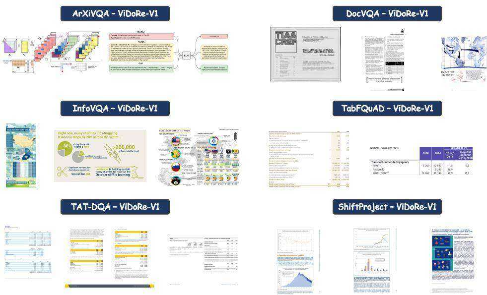  
Figure 7: Illustrative examples of ViDoRe-V1 benchmark (Faysse et al., 2024).

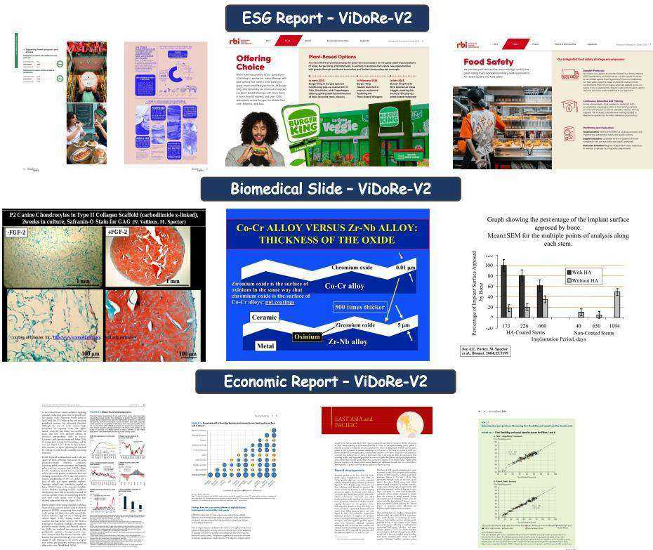  
Figure 8: Illustrative examples of ViDoRe-V2 benchmark (Macé et al., 2025).

and Omni-Embed-Nemotron (Xu et al., 2025b) developing unified models for joint retrieval across text, image, audio, and video, signaling a promising direction for future research.

# B.2 Multimodal Retrieval Models

Universal multimodal retrieval models aim to create a unified embedding space for various data types, most commonly text, images, and videos, in addition to the visually-rich documents central to this paper (Zhao et al., 2023; Mei et al., 2025). Each modality presents distinct challenges. For instance, image-text retrieval often focuses on matching textual descriptions to static visual scenes, capturing objects, attributes, and their relationships (Cao et al., 2022; Ying et al., 2022). Video retrieval introduces a temporal dimension, requiring the model to understand actions, events, and narrative progression over time (Zhu et al., 2023). In contrast, VDR is particularly complex as it must jointly comprehend dense, structured textual information and complex spatial layouts, such as tables, figures, and forms, which are often lost in standard image or text encoders (Faysse et al., 2024; Chen et al., 2025; Sun et al., 2025).

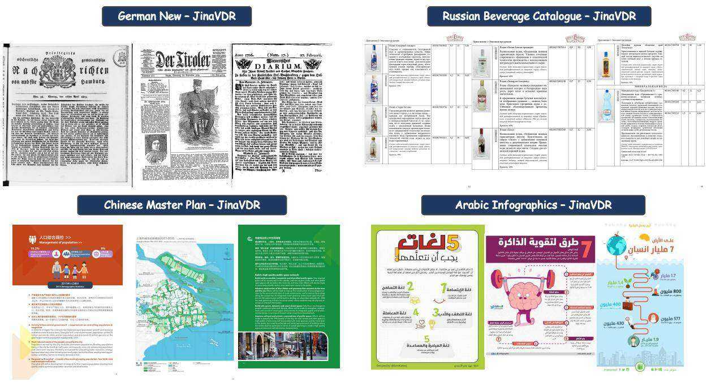  
Figure 9: Illustrative examples of JinaVDR benchmark (Günther et al., 2025).

  
Figure 10: Illustrative examples of Real-MM-RAG benchmark (Wasserman et al., 2025).

The foundation of modern multimodal retrieval was laid by dual-encoder models like CLIP (Radford et al., 2021), which pioneered learning aligned representations through large-scale contrastive training on image-text pairs. Building on this, recent works have increasingly leveraged the power of LVLMs to create more universal embeddings (Zhu et al., 2025c; Liu et al., 2025e; Ma et al., 2024a; Xiao et al., 2025a). For instance, E5-V (Jiang et al., 2024a) employs unimodal contrastive learning on the language component of a LVLM to bridge the modality gap. VLM2Vec series (Jiang et al., 2024b; Meng et al., 2025) further explores this direction by introducing a comprehensive framework and benchmark (MMEB) to repurpose pre-trained VLMs into powerful embedding models. Other methods focus on refining the training dynamics; for example, UniME-V1 (Gu et al., 2025a) and QQMM (Xue et al., 2025) introduce advanced hard negative mining strategies and gradient amplification techniques to enhance the discriminative power of the learned embeddings. Furthermore, UniME-V2 (Gu et al., 2025b) leverages an MLLM-as-a-Judge for sophisticated hard negative mining, MM-Embed (Lin et al., 2024) introduces modality-aware hard negative mining to mitigate modality bias, RzenEmbed (Jian et al., 2025) introduces a hardness-weighted contrastive loss, B3 (Thirukovalluru et al., 2025) proposes smart batch mining to construct more effective training batches, and LamRA (Liu et al., 2025d) adopts a progressive two-stage training strategy. Some efforts are data-centric; for example, MegaPairs (Zhou et al., 2025) and GME (Zhang et al., 2024b) introduce pipelines to synthesize massive, high-quality fusedmodal training data and optimize the training data composition to enhance model robustness. Concurrently, other approaches like ReMatch (Liu et al., 2025b), CAFe (Yu et al., 2025), and VladVA (Ouali et al., 2025) unify retrieval with generative objectives by using the MLLM to predict relevance or by employing a joint contrastive-autoregressive loss. More recently, a new trend leverages the explicit reasoning capabilities of MLLMs, with works like Think-Then-Embed (Cui et al., 2025), UME-R1 (Lan et al., 2025), and Reasoning Guided Embeddings (RGE) (Liu et al., 2025a) incorporating intermediate rationale generation to produce more informative representations.

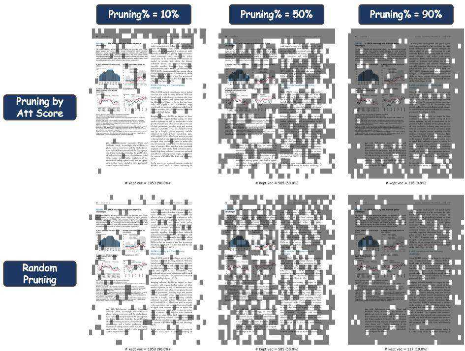  
Figure 11: Illustrative example of pruned visual documents by different pruning ratios.

# B.3 Large Vision-Language Models

In recent years, Large Vision-Language Models (LVLMs) have demonstrated rapid advancements in general-purpose capabilities, significantly benefiting a wide array of downstream domains such as coding (Lin et al., 2025; Wang et al., 2025a), scientific reasoning (Yan et al., 2024a,b, 2025a; Yang et al., 2025), education (Dai et al., 2025; Su et al., 2025a,b), urban computing (Zhu et al., 2025b; Li et al., 2025; Yan et al., 2024c; Yan and Lee, 2024), trustworthy system (Huo et al., 2025, 2024; Huang et al., 2025; Liu et al., 2025c), and even agentic system (Liu et al., 2026; Long et al., 2025; Yan et al.,

2025b). This progress is exemplified by a series of state-of-the-art open-source models, each introducing unique technical innovations. For instance, InternVL3 (Zhu et al., 2025a) pioneers a native multimodal pre-training paradigm that jointly learns visual and linguistic capabilities in a single stage, fundamentally improving cross-modal alignment. To enhance efficiency and specialization, DeepSeek-VL2 (Wu et al., 2024) integrates a Mixture-of-Experts (MoE) architecture with a dynamic tiling strategy for high-resolution vision. Architectural flexibility is further explored by Qwen2-VL (Wang et al., 2024), which introduces a Naive Dynamic Resolution mechanism and Multimodal Rotary Position Embedding (M-RoPE) to handle varied image sizes, and Gemma 3 (Kamath et al., 2025), which achieves efficient long-context understanding by strategically increasing the ratio of local to global attention layers. Building on these foundations, Qwen2.5-VL (Bai et al., 2025) focuses on fine-grained perception through dynamic resolution and absolute time encoding for precise long-video analysis. To boost reasoning, InternVL3.5 (Wang et al., 2025c) proposes a Cascade Reinforcement Learning (Cascade RL) framework combining offline and online stages for more stable and refined alignment. Complementing these advancements, Kimi K2.5 (Team et al., 2026) introduces the Agent Swarm, a parallel agent orchestration framework that decomposes complex tasks for concurrent execution. The sophisticated features developed in these models, such as enhanced fine-grained perception, superior cross-modal alignment, efficient long-context processing, and advanced reasoning, are poised to significantly benefit the field of multimodal retrieval. By leveraging these capabilities, retrieval systems can achieve more robust and accurate results when searching and ranking complex image-text data.

# C Algorithm Workflow

We formalize the complete workflow of our proposed PRUNE-THEN-MERGE framework in two distinct algorithms. Algorithm 1 details the offline compression phase, where PRUNE-THEN-MERGE generates a highly compact set of document embeddings through its sequential two-stage process. Subsequently, Algorithm 2 illustrates the online retrieval phase, where the final relevance score is efficiently computed via a MaxSim operation using this compressed set of embeddings.

Input: A document page $d$ ;   
A VLM encoder $\Phi ( \cdot )$ outputting patch embeddings and attention weights;   
A pruning sensitivity controller hyperparameter $k$ ;   
A merging factor hyperparameter $m$ .   
Output: A compressed set of patch embeddings $\mathbf { D } ^ { \prime \prime }$ .

$^ { \prime \star }$ — STAGE 1: ADAPTIVE PRUNING — \*/ $^ { \prime \star }$ Step 1.1: VLM Forward Pass to get Embeddings and Attention $\star /$ $\{ \mathbf { D } , \mathbf { A } \}  \Phi ( d )$ // Extract initial embeddings $\mathbf { D } = \{ \mathbf { d } _ { j } \} _ { j = 1 } ^ { N _ { p } }$ and attention A

$^ { \prime \star }$ Step 1.2: Quantify Patch Importance via Global Token Attention $\star /$   
Let $g$ be the index of the global token (e.g., [EOS])   
Initialize an empty list of importance scores $\mathcal { T } _ { d }$   
for $\begin{array} { r } { \bar { \mathbf { A } } _ { g , j }  \frac { 1 } { H } \sum _ { h = 1 } ^ { H } \mathbf { A } _ { h , g , j } } \end{array}$ $j  1$ $N _ { p }$ // Average attention over $H$ heads $I ( \mathbf { d } _ { j } ) \gets \bar { \mathbf { A } } _ { g , j }$ 2 Append $I ( \mathbf { d } _ { j } )$ to $\mathcal { T } _ { d }$   
end   
$^ { \prime \star }$ Step 1.3: Compute Adaptive Threshold and Prune \*/   
$\begin{array} { r l } & { \mu _ { d }  \mathrm { m e a n } ( \mathcal { T } _ { d } ) ; \quad \sigma _ { d }  \mathrm { s t d \_ d e v } ( \mathcal { T } _ { d } ) } \\ & { \tau _ { d }  \mu _ { d } + k \cdot \sigma _ { d } } \\ & { \hat { \mathbf { D } } ^ { \prime }  \{ \mathbf { d } _ { j } \in \mathbf { D } \mid I ( \mathbf { d } _ { j } ) > \tau _ { d } \} } \end{array}$ // Document-specific pruning threshold // Preliminary pruned set   
$^ { \prime \star }$ Step 1.4: Finalize Pruned Set with Robustness Guarantee \*/   
if $\hat { \mathbf { D } } ^ { \prime } = \varnothing$ then $\begin{array} { l } { { j ^ { * }  \arg \operatorname* { m a x } I ( \mathbf { d } _ { j } ) } } \\ { { \quad \mathbf { D } ^ { \prime }  \{ \mathbf { d } _ { j ^ { * } } \} } } \end{array}$ // Keep single most important patch   
else $\mathbf { D ^ { \prime } }  \hat { \mathbf { D ^ { \prime } } }$   
end   
$N _ { p } ^ { \prime } \gets | \mathbf { D } ^ { \prime } |$ // Number of patches after pruning   
$\mathbf { \nabla } / \star \mathbf { \nabla } - \mathbf { \nabla }$ STAGE 2: HIERARCHICAL MERGING — $\star /$   
$^ { \prime \star }$ Step 2.1: Check if Merging is Applicable $\star /$   
if $N _ { p } ^ { \prime } < m$ or $m \leq 1$ then $\dot { \mathbf { D } } ^ { \prime \prime }  \mathbf { D } ^ { \prime }$ // Skip merging if set is already small   
else $^ { \prime \star }$ Step 2.2: Determine Target Number of Clusters \*/ $N _ { p } ^ { \prime \prime } \gets \operatorname* { m a x } ( 1 , \lfloor N _ { p } ^ { \prime } / m \rfloor )$ $^ { \prime \star }$ Step 2.3: Perform Hierarchical Clustering \*/ $/ /$ Normalize embeddings, compute distance matrix, apply linkage labels HierarchicalClustering $( \mathbf { D ^ { \prime } }$ , num_clusters $= N _ { p } ^ { \prime \prime }$ ) $^ { \prime \star }$ Step 2.4: Compute Cluster Centroids \*/ $\mathbf { D } ^ { \prime \prime }  \{ \}$ for $c \gets 1$ to $N _ { p } ^ { \prime \prime }$ do $\begin{array} { r l } & { C _ { c } \gets \{ \mathbf { d } _ { j } \in \mathbf { D } ^ { \prime } \mid \mathrm { l a b e l } ( \mathbf { d } _ { j } ) = c \} } \\ & { \mathbf { d } _ { c } ^ { \prime \prime } \gets \frac { 1 } { | C _ { c } | } \sum _ { \mathbf { d } _ { j } \in C _ { c } } \mathbf { d } _ { j } } \\ & { \mathbf { D } ^ { \prime \prime } \gets \mathbf { D } ^ { \prime \prime } \cup \{ \mathbf { d } _ { c } ^ { \prime \prime } \} } \end{array}$ // Compute centroid end   
end   
return D′′   
Input: A textual query $q$ ;   
The compressed document embedding set $\mathbf { D } ^ { \prime \prime }$ (from Alg. 1);   
A VLM encoder $\Phi ( \cdot )$ for query encoding.   
Output: The final relevance score $s ^ { \prime \prime } ( q , d )$ .   
$^ { \prime \star }$ Step 1: Encode Query \*/   
$\mathbf { Q }  \Phi ( q )$ // Encode $q$ into token embeddings $\mathbf { Q } = \{ \mathbf { q } _ { i } \}$   
$^ { \prime \star }$ Step 2: Compute Relevance Score with Compressed Embeddings $\star /$   
$s ^ { \prime \prime } ( q , d ) \gets 0$   
for $\mathbf { q } _ { i } \in \mathbf { Q }$ do $\mathrm { m a x \_ s i m  - \infty }$ for $\mathbf { d } _ { c } ^ { \prime \prime } \in \mathbf { D } ^ { \prime \prime }$ do sim ← q⊤i d′′c if sim > max_sim then max_sim ← sim end end $s ^ { \prime \prime } ( q , d )  s ^ { \prime \prime } ( q , d ) +$ max_sim // Aggregate max similarity per query token   
end   
return $s ^ { \prime \prime } ( q , d )$

# D More Theoretical Analysis

This section provides a more detailed theoretical underpinning for the PRUNE-THEN-MERGE framework, expanding upon the analysis presented in Section 3.3. We begin by formalizing the core principles of information theory that motivate our approach, then present theorems and corollaries that justify the efficacy of our two-stage decomposition.

# D.1 Theoretical Foundations: IB and RD Theory

Information Bottleneck (IB) Principle. The IB principle (Tishby et al., 2000; Tishby and Zaslavsky, 2015; Gordon et al., 2003) formalizes the trade-off between compression and prediction. Given a source random variable $\mathbf { X }$ and a target variable $\mathbf { Y }$ , the goal is to find a compressed representation $\mathbf { Z }$ of $\mathbf { X }$ that retains the maximum possible information about $\mathbf { Y }$ . This is expressed as minimizing the Lagrangian:

$$
\mathcal { L } _ { \mathrm { I B } } ( \mathbf { Z } ) = I ( \mathbf { Z } ; \mathbf { X } ) - \beta I ( \mathbf { Z } ; \mathbf { Y } )
$$

where $I ( \cdot ; \cdot )$ is the mutual information and $\beta > 0$ is a Lagrange multiplier. In our context, $\mathbf { X }$ is the full patch set $\mathbf { D }$ , $\mathbf { Z }$ is the compressed set $\mathbf { D } ^ { \prime \prime }$ , and $\mathbf { Y }$ is the relevance variable, dependent on an unknown query $q$ .

Rate-Distortion (RD) Theory. RD theory (Ortega and Ramchandran, 1998; Yeung, 2008) addresses lossy data compression. Given a source $\mathbf { X }$ and a distortion measure $d ( { \bf x } , \hat { \bf x } )$ , the rate-distortion function $R ( \Delta )$ is the minimum rate required to represent the source such that the expected distortion does not exceed $\Delta$ :

Theorem D.1 (Information-Preserving Noise Filtering) Let the full patch set $\mathbf { D }$ be a disjoint union of a signal set $\mathbf { D } _ { s i g }$ and a noise set $\mathbf { D } _ { n o i }$ . Let the importance score $I ( \mathbf { d } _ { j } )$ be a proxy for the information a patch ${ \bf d } _ { j }$ provides about the document’s global semantics $\mathbf { h } _ { \mathrm { e o s } }$ . If the noise set satisfies $\forall \mathbf { d } _ { j } \in \mathbf { D } _ { \mathrm { n o i } }$ , $I ( \mathbf { d } _ { j } ; \mathbf { h } _ { \mathrm { e o s } } ) < \epsilon$ for some small $\epsilon > 0$ , then the pruned set $\mathbf { D ^ { \prime } }$ generated by our adaptive thresholding mechanism retains almost all the information of the original set $\mathbf { D }$ with respect to $\mathbf { h } _ { \mathrm { e o s } }$ . Formally:

$$
I ( \mathbf { D } ; \mathbf { h } _ { \mathrm { e o s } } ) - I ( \mathbf { D } ^ { \prime } ; \mathbf { h } _ { \mathrm { e o s } } ) \leq \sum _ { \mathbf { d } _ { j } \in \mathbf { D } \backslash \mathbf { D } ^ { \prime } } I ( \mathbf { d } _ { j } ; \mathbf { h } _ { \mathrm { e o s } } | \mathbf { D } ^ { \prime } )
$$

Proof Sketch D.1 By the chain rule for mutual information, ${ \cal I } ( { \bf D } ; { \bf h } _ { e o s } ) = { \cal I } ( { \bf D } ^ { \prime } ; { \bf h } _ { e o s } ) + { \cal I } ( { \bf D } \ \backslash$ $\mathbf { D } ^ { \prime } ; \mathbf { h } _ { e o s } | \mathbf { D } ^ { \prime } )$ . Our pruning stage $g _ { p }$ is designed to discard patches $\mathbf { d } _ { j }$ where their proxy score is low, implying $I ( \mathbf { d } _ { j } ; \mathbf { h } _ { e o s } )$ is small. Since these patches are conditionally independent of $\mathbf { h } _ { e o s }$ given the high-information set $\mathbf { D ^ { \prime } }$ , their conditional mutual information term $I ( \mathbf { d } _ { j } ; \mathbf { h } _ { e o s } | \mathbf { D } ^ { \prime } )$ is also negligible. Summing these negligible terms leads to the result.

Theorem D.2 (Optimal Redundancy Reduction via Quantization) For a given set of $N _ { p } ^ { \prime }$ vectors $\mathbf { D ^ { \prime } }$ and a target codebook size of $N _ { p } ^ { \prime \prime }$ , the set of centroids $\mathbf { D } ^ { \prime \prime }$ obtained by partitioning $\mathbf { D ^ { \prime } }$ into $N _ { p } ^ { \prime \prime }$ clusters $\{ C _ { c } \}$ and computing the mean for each cluster is the optimal solution to the vector quantization problem that minimizes the Mean Squared Error (MSE) distortion.

$$
\mathbf { D } ^ { \prime \prime } = \underset { \hat { \mathbf { D } } ^ { \prime \prime } : | \hat { \mathbf { D } } ^ { \prime \prime } | = N _ { p } ^ { \prime \prime } } { \arg \operatorname* { m i n } } \sum _ { c = 1 } ^ { N _ { p } ^ { \prime \prime } } \sum _ { \mathbf { d } _ { j } \in C _ { c } } | | \mathbf { d } _ { j } - \hat { \mathbf { d } } _ { c } ^ { \prime \prime } | | _ { 2 } ^ { 2 }
$$

$$
R ( \Delta ) = \operatorname* { m i n } _ { \substack { p ( \hat { \mathbf { x } } | \mathbf { x } ) : \mathbb { E } [ d ( \mathbf { X } , \hat { \mathbf { X } } ) ] \leq \Delta } } I ( \mathbf { X } ; \hat { \mathbf { X } } )
$$

Vector Quantization (VQ) is a practical approach to solving the RD problem for continuous variables, where the goal is to find a finite "codebook" (our $\mathbf { D ^ { \prime \prime } }$ ) that best represents the original data distribution (our $\mathbf { D ^ { \prime } }$ ).

# D.2 Theoretical Decomposition of the Framework

Our framework’s strength lies in decomposing the complex IB problem into two sequential, manageable sub-problems, justified by the following theorems.

Proof Sketch D.2 This is a standard result from vector quantization theory. For any given cluster $C _ { c } ,$ the partial derivative of the inner sum with respect to the centroid $\mathbf { d } _ { c } ^ { \prime \prime }$ is $2 \sum ( { \bf d } _ { j } - { \bf d } _ { c } ^ { \prime \prime } )$ . Setting this to zero to find the minimum yields $\begin{array} { r } { \mathbf { d } _ { c } ^ { \prime \prime } = \frac { 1 } { | C _ { c } | } \sum _ { \mathbf { d } _ { j } \in C _ { c } } \mathbf { d } _ { j } } \end{array}$ . Our hierarchical merging stage directly implements this optimal solution.

# D.3 Analysis of Synergistic Gain

The sequential application of these two stages yields a synergistic gain that neither stage could achieve alone. This can be formalized by analyzing the distortion with respect to the true signal $\mathbf { D } _ { \mathrm { s i g } }$ .

Corollary 1 (Synergistic Distortion Reduction) Let $\mathbf { D } _ { \mathrm { o u r s } } ^ { \prime \prime } \ = \ g _ { m } ( g _ { p } ( \mathbf { D } ) )$ be the output of our two-stage framework, and ′′naive = gm(D) be the output of a naive single-stage merge. The expected distortion of our representation with respect to the true signal set $\mathbf { D } _ { \mathrm { s i g } }$ is strictly lower than that of the naive approach.

$$
\begin{array} { r l } { \mathbb { E } _ { \mathbf { d } _ { s } \in \mathbf { D } _ { \mathrm { s i g } } } [ d ( \mathbf { d } _ { s } , \mathbf { D } _ { \mathrm { o u r s } } ^ { \prime \prime } ) ] < } & { } \\ { \mathbb { E } _ { \mathbf { d } _ { s } \in \mathbf { D } _ { \mathrm { s i g } } } [ d ( \mathbf { d } _ { s } , \mathbf { D } _ { \mathrm { n a i v e } } ^ { \prime \prime } ) ] } & { } \end{array}
$$

where $d ( \mathbf { x } , \mathcal { Y } ) = \operatorname* { m i n } _ { \mathbf { y } \in \mathcal { Y } } | | \mathbf { x } - \mathbf { y } | | _ { 2 } ^ { 2 }$ is the quantization error.

Proof Sketch D.3 A centroid of $a$ naive merge, ${ \bf d } _ { c } ^ { \prime \prime } ( { \bf D } )$ , is a biased estimator of the true signal’s center of mass.

$$
\begin{array} { l } { { \displaystyle { \bf d } _ { c , n a i \nu e } ^ { \prime \prime } = \frac { 1 } { | C _ { c } | } \sum _ { { \bf d } _ { j } \in C _ { c } } { \bf d } _ { j } } } \\ { { \displaystyle \quad \quad = { \bf d } _ { c , s i g } ^ { \prime \prime } + \frac { 1 } { | C _ { c } | } \sum _ { { \bf d } _ { k } \in C _ { c } \cap { \bf D } _ { n o i } } ( { \bf d } _ { k } - { \bf d } _ { c , s i g } ^ { \prime \prime } ) } } \end{array}
$$

In our framework, the pruning stage first ensures $\mathbf { D } ^ { \prime } \approx \mathbf { D } _ { s i g }$ . Therefore, the centroids ${ \bf d } _ { c } ^ { \prime \prime } ( { \bf D } ^ { \prime } )$ are computed on a nearly noise-free set, making them approximately unbiased estimators. Since our centroids are closer to the true signal distribution, the expected distortion for any signal vector ${ \bf d } _ { s }$ will be lower.

Finally, the Data Processing Inequality dictates that for any Markov chain $\mathbf { X } \ \to \ \mathbf { Y } \ \to \ \mathbf { Z }$ , we have $I ( \mathbf { X } ; \mathbf { Z } ) \le I ( \mathbf { X } ; \mathbf { Y } )$ . In our framework, the compression forms the Markov chain $\mathbf { D }  \mathbf { D ^ { \prime } } $ $\mathbf { D } ^ { \prime \prime }$ . This implies:

$$
I ( \mathbf { D } ; \mathbf { h } _ { \mathrm { e o s } } ) \geq I ( \mathbf { D } ^ { \prime } ; \mathbf { h } _ { \mathrm { e o s } } ) \geq I ( \mathbf { D } ^ { \prime \prime } ; \mathbf { h } _ { \mathrm { e o s } } )
$$

The goal of an effective compression scheme is to make these inequalities as close to equalities as possible. Our PRUNE-THEN-MERGE framework achieves this by ensuring the first inequality is nearly an equality (via Theorem D.1) and the second inequality represents a highly efficient ratedistortion trade-off (via Theorem D.2 on a clean signal).

# E Benchmark Details

This section provides detailed descriptions of the benchmarks evaluated in this paper.

# E.1 ViDoRe-V1 Benchmark

ViDoRe-V1, the first Visual Document Retrieval Benchmark, is introduced to address a critical gap in existing evaluation suites. While many benchmarks focus on text embedding models, ViDoRe-V1 evaluates the entire document ingestion and retrieval pipeline, emphasizing the ability of a system to understand both textual content and vital visual cues like figures, tables, and layout. It is designed to assess retrievers on their capacity to process visually rich information as a human would, featuring a diverse collection of 10 sub-datasets that span various topics, modalities, and languages.

The benchmark includes three datasets adapted from established Visual Question Answering (VQA) tasks, each subsampled for consistency. $\mathbf { A r X i v Q A ^ { 4 } }$ is a VQA dataset built from figures in arXiv publications, with questions synthetically generated by GPT-4 Vision (Li et al., 2024). $\mathbf { D o c V Q A } ^ { 5 }$ is sourced from the DocVQA test set, using images from the UCSF Industry Documents Library with manually annotated questions and answers (Mathew et al., 2020). Similarly, InfoVQA6 is derived from the InfoVQA test set and comprises infographics collected from the internet, also featuring manual annotations (Mathew et al., 2021). Each of these test sets was subsampled to 500 querydocument pairs to ensure homogeneity.

Two datasets specifically target retrieval from complex tabular and textual content. TabFQuAD is designed to assess table QA models in French, reflecting realistic industry scenarios. It combines human-annotated queries with additional questions generated by GPT-4V, with a test set of 280 pairs. In contrast, TAT-DQA7 is a large-scale dataset from real-world financial reports, focusing on rich tabular content and numerical reasoning, with questions annotated by finance experts (Zhu et al., 2021, 2022). Its full test set of 1,663 pairs is retained, as its complexity and domain-specificity closely align with practical, high-stakes retrieval use cases.

To evaluate multilingual performance, ViDoRe-V1 incorporates ShiftProject8, a topic-specific benchmark in French. This dataset contains five large reports (totaling approximately 1,000 pages) from the Shift Project concerning environmental topics. It includes 100 question-answer pairs generated by the Claude-3 Sonnet model, which were then extensively filtered by human annotators to ensure high quality and relevance.

Finally, a suite of four SyntheticDocQA datasets simulates retrieval tasks in realistic industrial applications across diverse domains. Each dataset was constructed by crawling 1,000 PDFs from the internet using a topic-specific query, randomly sampling 1,000 pages, and then generating 100 high-quality question-answer pairs using Claude-3 Sonnet. The topics are designed to benchmark performance on specific document types: Artificial Intelligence9, Energy10 (technical documentation), Government Reports11 (administrative and legal documents), and Healthcare Industry12 (medical documents).

# E.2 ViDoRe-V2 Benchmark

ViDoRe-V2 was developed to address the limitations of existing benchmarks and better reflect realworld retrieval challenges. It moves beyond common pitfalls such as the over-reliance on extractive queries, a bias towards single-page contexts, and the quality issues inherent in purely synthetic query generation. To create a more robust and realistic evaluation, ViDoRe-V2 introduces several key innovations. Queries are generated with limited document context (e.g., summaries or metadata) to mimic users who are unfamiliar with the corpus, thus reducing extractive bias. It also emphasizes long-form and cross-document queries. Critically, it employs a hybrid synthetic and human-in-theloop methodology, where synthetically generated queries undergo extensive human review to ensure high quality and relevance.

The benchmark includes a set of three multilingual, topic-specific datasets created through this semi-synthetic process. Each dataset focuses on a distinct domain and contains queries in English, French, German, and Spanish, which were generated by translating original queries with GPT-4o. The datasets are: esg_reports $\mathbf { \Delta } _ { \mathbf { y } 2 } \mathbf { l } ^ { 3 }$ , which focuses on ESG reports from the fast-food industry; biomedical_lectures_ $\mathbf { y } 2 ^ { 1 4 }$ , centering on MIT biomedical lectures about tissue interactions; and economics_reports_ $\mathbf { \Delta } _ { \mathbf { y } 2 } \mathbf { l } 5$ , which covers world economic reports from 2024.

To provide a non-synthetic baseline, ViDoRe-V2 features esg_reports_human_labeled_ $\mathbf { \nabla } \mathbf { y } 2 ^ { 1 6 }$ . This dataset was entirely labeled by hand. It shares the same thematic focus on ESG reports in the fast-food industry as its synthetic counterpart but contains a distinct set of queries with no overlap, offering a purely human-curated evaluation scenario.

# E.3 JinaVDR Benchmark

JinaVDR is a comprehensive benchmark designed to evaluate model performance on retrieving visually complex documents. It stands out by encompassing a wide array of multilingual documents with intricate layouts that combine text with charts, tables, and images, sourced from PDFs, scanned materials, and screenshots. The benchmark spans diverse domains, including historical archives, medical records, and legal texts, reflecting real-world professional use cases. JinaVDR was constructed through a multi-faceted approach: repurposing existing VQA and OCR datasets into retrieval tasks, manually annotating high-quality document-query pairs, and employing a hybrid generation process where a Vision-Language Model (Qwen2-VL-7B-Instruct) creates queries for existing document collections, often followed by human verification.

The benchmark features extensive multilingual coverage. A significant portion of this is derived from the Europeana online collection17, which provides scanned historical documents. This includes datasets of Dutch legal texts (europeananl-legal18), Italian historical scans (europeana-itscans19), and news articles in German (europeanade-news20) and Spanish (europeana-es-news21). For these datasets, queries were synthetically generated using Qwen2b, with the Dutch dataset also undergoing manual human review to ensure quality.

JinaVDR also includes datasets created by adapting existing resources or curating new ones for specific languages. For example, arabic_infographicsvqa_ar22 reformats an Arabic VQA dataset for retrieval23. Other datasets were built by sourcing documents and generating synthetic queries, such as beverages_catalogue $\mathbf { r u } ^ { 2 4 }$ which uses Russian beverage catalogs, and hindigov-vqa25, which is based on public government documents in Hindi.

Finally, the benchmark contains datasets with high-quality, domain-specific query-document pairs. This includes shanghai_master_plan26, which pairs pages from Shanghai’s official master plan with manually written Chinese queries (Shanghai Municipal People’s Government, 2018). Another example is automobile_catalogue_ $\mathbf { j } \mathbf { p } ^ { 2 7 }$ , a specialized dataset using Japanese marketing materials from Toyota28 to test retrieval in a commercial context.

# E.4 REAL-MM-RAG Benchmark

REAL-MM-RAG is a high-quality, multimodal retrieval benchmark generated through a fully automated pipeline for query creation, filtering, and label verification. A distinctive feature of this benchmark is its multi-level rephrasing framework, which is designed to rigorously evaluate a model’s semantic understanding by testing its robustness to various query phrasings beyond simple keyword matching. The benchmark is structured around two key professional domains: finance and technology, each with datasets in both long-form report and presentation slide formats.

The benchmark’s four datasets test retrieval across these different domains and formats. In the financial domain, REAL-MM-RAG_FinReport29 consists of dense, table-heavy financial reports, while REAL-MM-RAG_FinSlides30 contains visually structured quarterly financial presentations. In the technology domain, REAL-MM-RAG_TechReport31 is composed of text-heavy technical documents on IBM FlashSystem, and REAL-MM-RAG_TechSlides32 features presentations on IT and business automation that blend text, visuals, and tables. This structure allows for a nuanced evaluation of retrieval performance on both dense textual information and visually complex layouts.

# E.5 ViDoSeek Benchmark

ViDoSeek33 is a novel benchmark specifically designed to evaluate RAG systems on visually rich documents. It addresses a critical limitation in traditional VQA datasets, which are often not suitable for RAG tasks over large-scale corpora. The core design principle of ViDoSeek is that each query has a unique answer and a specific set of reference pages within the entire document collection, enabling a more precise and realistic evaluation of both retrieval and generation performance. The dataset comprises approximately 1,200 questions spanning diverse domains, content types (text, charts, tables, and complex layouts), and reasoning complexities, including both single-hop and multi-hop questions.

The construction of ViDoSeek involved a meticulous, hybrid human-AI pipeline to ensure data quality and relevance. The process began with the collection of documents, primarily slides, which were filtered to include a rich mix of text, tables, charts, and layouts. Human experts then authored specific queries designed to be answerable only by a particular document. A crucial step was the automated quality review, where an LLM first filtered out general queries, and a VLM subsequently verified that the remaining queries had unique answers within the entire corpus by checking against retrieved candidates. Finally, queries that failed this check were refined by a VLM-based agent. The resulting dataset is composed of newly created data and refined queries from the existing SlideVQA dataset (Tanaka et al., 2023), with a significant portion of questions targeting challenging "Layout" based content.

# E.6 MMLongBench-Doc Benchmark

MMLongBench- $\mathrm { \cdot D o c } ^ { 3 4 }$ is a benchmark designed to evaluate the long-context, multi-modal document understanding capabilities of LVLMs. It addresses the limitations of previous datasets that primarily focus on single-page documents by providing a challenging testbed of lengthy, informationdense documents. The benchmark consists of 1,082 expert-annotated questions across 135 PDF documents, which average 47.5 pages and over 21,000 tokens each. Questions require evidence from diverse sources, including text, tables, charts, images, and layout structures, and are distributed across various locations within the documents to rigorously test models’ localization and comprehension abilities.

The construction of MMLongBench-Doc emphasizes diversity and quality. Documents were sourced from existing datasets and newly collected materials, spanning seven different domains. A key feature of the benchmark is its diverse question types, designed to test distinct capabilities: $4 5 . 7 \%$ are single-page questions to assess information localization, a significant $3 3 . 7 \%$ are crosspage questions that require multi-page reasoning, and $2 0 . 6 \%$ are unanswerable questions designed to measure model hallucination. To ensure high annotation quality, a rigorous, three-stage, semiautomatic quality control process was employed, involving filtering for document relevance, annotator self-reflection guided by model feedback, and peer cross-checking. This meticulous process makes MMLongBench-Doc a robust and challenging benchmark for long-context document understanding.

# F Baseline Details

This section details the implementation logic and hyperparameter configurations for the baseline methods evaluated in our experiments. For each method, we conducted an empirical search over the specified hyperparameter range to report the most representative performance trade-offs.

# F.1 Pruning-based Methods

# ▶ Random

• Implementation Logic: This naive baseline discards a specified fraction of patch embeddings uniformly at random for each document. It serves as a lower bound to assess the impact of uninformed pruning. To avoid empty sets, at least one patch is always retained.

• Hyperparameters:

– pruning_ratio: The fraction of embeddings to discard. Selection Range: {0.1, 0.3, 0.5, 0.7, 0.9}.

# ▶ Attention-plus-Similarity

• Implementation Logic: This adaptive baseline calculates a composite score for each patch as a weighted sum of its importance (attention from the [EOS] token) and representativeness (cosine similarity to the [EOS] embedding). It then applies a dynamic threshold $( \mu + k \cdot \sigma )$ to these composite scores to prune patches.

• Hyperparameters:

– Adaptation Factor (k): Modulates the pruning threshold’s strictness. Selection Range: {-0.5, -0.25, 0, 0.25, 0.5,   
1}. – Weighting Factor (alpha): Balances the attention and similarity components. Selection Range: $\{ \theta . 1 , \ \theta . 3 , \ \theta . 5 , \ \theta . 7 ,$ ,   
0.9}.

# ▶ Pivot-Threshold

• Implementation Logic: This two-stage adaptive method first identifies an “important set” of patches using an attention-based threshold $( \mu +$ $k \cdot \sigma )$ ). It then selects num_pivots from this set and prunes other patches in the set if they are too similar to any pivot, determined by a second adaptive threshold on similarity scores.

• Hyperparameters:

– Adaptation Factor (k): Controls the initial importance filtering. Selection Range: $\{ - 0 . 5 , \ : \ : - 0 . 2 5 , \ : \ : 0 , \ : \ : 0 . 2 5 , \ : \ : 0 . 5 , \ : \ : 1 \}$ .   
– De-duplication Factor (k_dup): Controls the similarity-based pruning. Selection Range: {-0.5, -0.25, 0, 0.25, 0.5, 1}.   
– num_pivots: The number of pivot tokens for de-duplication. Selection Range: {5, 10, 15, 20}.

# ▶ DocPruner

• Implementation Logic: This method leverages the attention scores from a global token (e.g., [EOS]) to all other patch tokens within a document. It computes a document-specific threshold using the mean and standard deviation of these scores $( \mu + k \cdot \sigma )$ and discards any patch whose attention score falls below this dynamic threshold.

• Hyperparameters:

– Adaptation Factor (k): Controls the strictness of the pruning threshold. Selection Range: {-0.5, -0.25, 0, 0.25, 0.5, $\boldsymbol { 1 } \boldsymbol  \}$ .

# F.2 Merging-based Methods

# Sem-Cluster

• Implementation Logic: This method groups embeddings semantically. It performs hierarchical agglomerative clustering on the set of patch embeddings using cosine distance and Ward’s linkage. The number of target clusters is determined by the merging_factor. The final representation consists of the centroids (mean vectors) of each cluster.

• Hyperparameters:

– merging_factor: The ratio by which the number of embeddings is reduced. Selection Range: {2, 4, 9, 16, 25}.

# ▶ 1D-Pooling

• Implementation Logic: This strategy applies average pooling along the sequence of patch embeddings. It partitions the sequence into nonoverlapping windows of size merging_factor and computes the mean of embeddings within each window.

• Hyperparameters:

– merging_factor: The size of the pooling window. Selection Range: {2, 4, 9, 16, 25}.

# ▶ 2D-Pooling

• Implementation Logic: This method leverages the spatial layout of patches. It arranges embeddings into a 2D grid and applies 2D average pooling. The merging_factor must be a perfect square, defining the pooling kernel’s area (e.g., a factor of 4 implies a $2 \mathbf { x } 2$ kernel).

• Hyperparameters:

– merging_factor: The area of the 2D pooling window. Selection Range: {4, 9, 16, 25}.

# G More Experimental Result & Analysis

# G.1 Empirical Experimental Results

We record all the emprical experimental results on all benchamrks from Table 3 to Table 20 for your reference. Due to the space limit, we only maintain two decimal places for all data cells.

# G.2 VDR Performance Comparison

You can refer to Figures 12, 13, and 14 for the performance comparisons on ViDoRe-V2 (Macé et al., 2025), ViDoSeek (Wang et al., 2025b), and MMLongBench-Doc (Ma et al., 2024b), respectively.

# G.3 Generalization to Multilingual Scenarios

In this section, we continue to discuss the observations we obtain from Figure 4 and Tables 9, 10, and 11.

Interestingly, the performance advantage of PRUNE-THEN-MERGE is particularly pronounced on non-Latin script languages such as Japanese and Chinese, which often feature more complex layouts and character densities. For ColNomic, our method compresses Japanese documents by $89 \%$ while achieving an $\mathrm { n D C G } @ 5$ of 0.82, whereas the strong merging baseline Sem-Cluster drops to 0.76. Similarly, for Chinese documents, our method maintains a near-lossless $0 . 9 5 ~ \mathrm { n D C G } @ 5 $ at $89 \%$ compression, while Sem-Cluster degrades to 0.94. This suggests that the visual and semantic redundancy in documents with complex character sets and layouts is more effectively handled by our two-stage "refine-then-compress" approach, which can untangle noisy patches from meaningful clusters before aggregation.

Furthermore, PRUNE-THEN-MERGE demonstrates superior resilience on languages where the base model’s performance is inherently weaker, such as on the Hindi and Dutch datasets. On the Hindi dataset, where the baseline nDCG $\textcircled { a } 5$ is a low 0.47, DocPruner’s performance collapses to 0.40 at an $83 \%$ compression rate, whereas our framework sustains a much higher score of 0.46. A similar pattern is observed on the Dutch dataset, where our method maintains the baseline score of 0.68 up to $82 \%$ compression, while DocPruner drops to 0.56. This indicates that when the initial signal is weak, aggressive pruning is overly destructive, whereas our hybrid approach better preserves the faint but critical information by first filtering salient signals and then carefully summarizing them, thus preventing catastrophic performance degradation.

# G.4 Generalization to Complex Settings

In this section, we continue to discuss the observations we obtain from Figure 5 and Tables 12, 13, and 14.

Moreover, the performance gap between PRUNE-THEN-MERGE and the strong Sem-Cluster baseline appears to be model-dependent, highlighting our framework’s unique synergy with certain embedding characteristics. While our method performs on par with Sem-Cluster when using Jina-v4 and ColNomic, it establishes a clear advantage with ColQwen2.5, as seen in Figure 5 (Middle). Specifically, at an $84 \%$ compression rate, PRUNE-THEN-MERGE ( $0 . 6 5 ~ \mathrm { n D C G } @ 5 )$ is notably superior to Sem-Cluster $( 0 . 6 1 \mathrm { \ n D C G } @ 5 )$ . This suggests that the patch embeddings from ColQwen2.5 may possess a more distinct separation between "noise" and "signal" vectors, making the initial pruning stage of our framework particularly impactful. By providing a cleaner, pre-filtered set of embeddings to the merging stage, our method capitalizes on this characteristic to produce a more faithful final representation than a merge-only approach operating on raw, unfiltered vectors.

# G.5 Variant Analysis

Adaptive, document-specific pruning is decisively superior to non-adaptive strategies that rely on fixed ratios or global thresholds. The performance curves in Figure 6 clearly show that both adaptive methods (PRUNE-THEN-MERGE and attention-threshold-adap) establish a significant performance margin over all non-adaptive variants. At a moderate pruning rate of approximately $55 \%$ , the adaptive methods achieve an $\mathrm { n D C G } @ 5$ of 0.56, while the best non-adaptive method, attention-threshold-nfp, lags behind at 0.52, and the simpler attention-ratio variant drops to 0.51. This performance gap arises because documents have heterogeneous content density; a fixed threshold or ratio is too aggressive for information-rich pages and too lenient for sparse ones, whereas adaptive thresholding tailors the pruning level to each document’s unique statistical properties, preserving critical information more effectively.

The performance advantage of our hybrid framework is most pronounced on datasets with higher semantic complexity, such as the human-annotated esg_human_labeled_v2. A detailed comparison in Appendix Figures 15-18 reveals that while PRUNE-THEN-MERGE consistently leads across all datasets, the performance gap widens on this particular one. As illustrated in Appendix Figure 18, at an ${ \sim } 8 0 \%$ compression rate, PRUNE-THEN-MERGE scores $0 . 6 0 ~ \mathrm { n D C G } @ 5$ , decisively outperforming the adaptive-pruning-only variant which plummets to 0.54. In contrast, on the more synthetically generated economics_reports_v2 dataset (Appendix Figure 17), this gap is much narrower at the same compression level (0.51 vs. 0.49). We infer that human-generated queries, being less extractive and more conceptual, demand a more robust semantic representation, which is better provided by our hybrid approach that distills concepts into potent centroids rather than merely discarding patch embeddings.

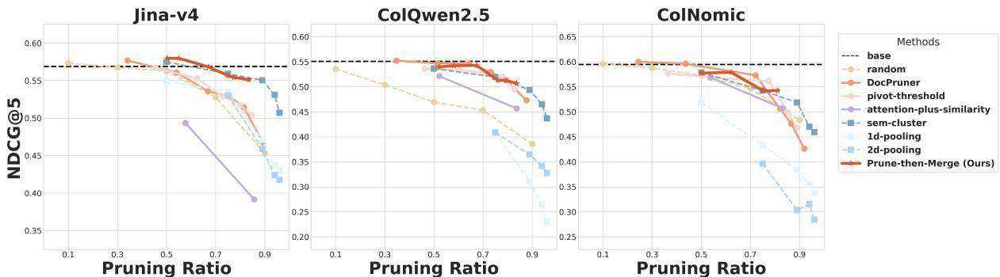  
Figure 12: Performance comparison $( \mathrm { n D C G } @ 5 )$ between PRUNE-THEN-MERGE and baselines on ViDoRe-V2 (Macé et al., 2025) across Jina-v4 (Left), ColQwen2.5 (Middle), and ColNomic (Right). solid lines denote adaptive methods, whereas dashed lines denote non-adaptive ones; circular nodes represent pruning methods, whereas square nodes represent merging ones.

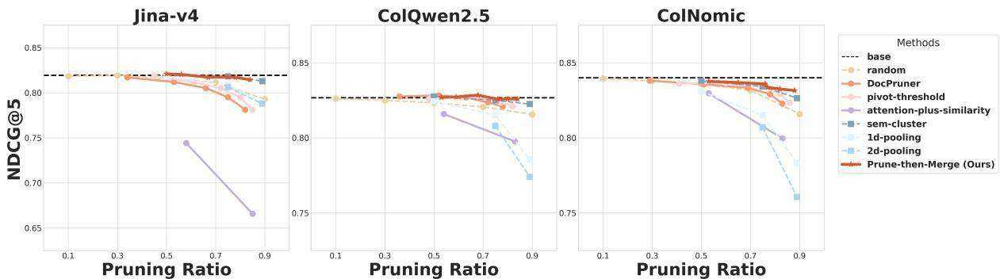  
Figure 13: Performance comparison $( \mathrm { n D C G } @ 5 )$ between PRUNE-THEN-MERGE and baselines on ViDoSeek (Wang et al., 2025b) across Jina-v4 (Left), ColQwen2.5 (Middle), and ColNomic (Right). solid lines denote adaptive methods, whereas dashed lines denote non-adaptive ones; circular nodes represent pruning methods, whereas square nodes represent merging ones.

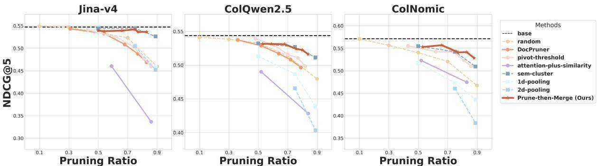  
Figure 14: Performance comparison $( \mathrm { n D C G } @ 5 )$ between PRUNE-THEN-MERGE and baselines on MMLongBench-Doc (Ma et al., 2024b) across Jina-v4 (Left), ColQwen2.5 (Middle), and ColNomic (Right). solid lines denote adaptive methods, whereas dashed lines denote non-adaptive ones; circular nodes represent pruning methods, whereas square nodes represent merging ones.

# G.6 Efficiency Analysis

See Table 2 for details of efficiency analysis of the chosen Jina-v4 on ViDoRe-V1.

# H Usage of AI Assistant

We utilized Google’s Gemini 2.5 Pro exclusively for the purpose of polishing the manuscript’s language and improving its readability. All other aspects of this research, including the core conceptualization of the framework, experimental design, implementation, and the analysis and interpretation of results, were conducted entirely by the authors.

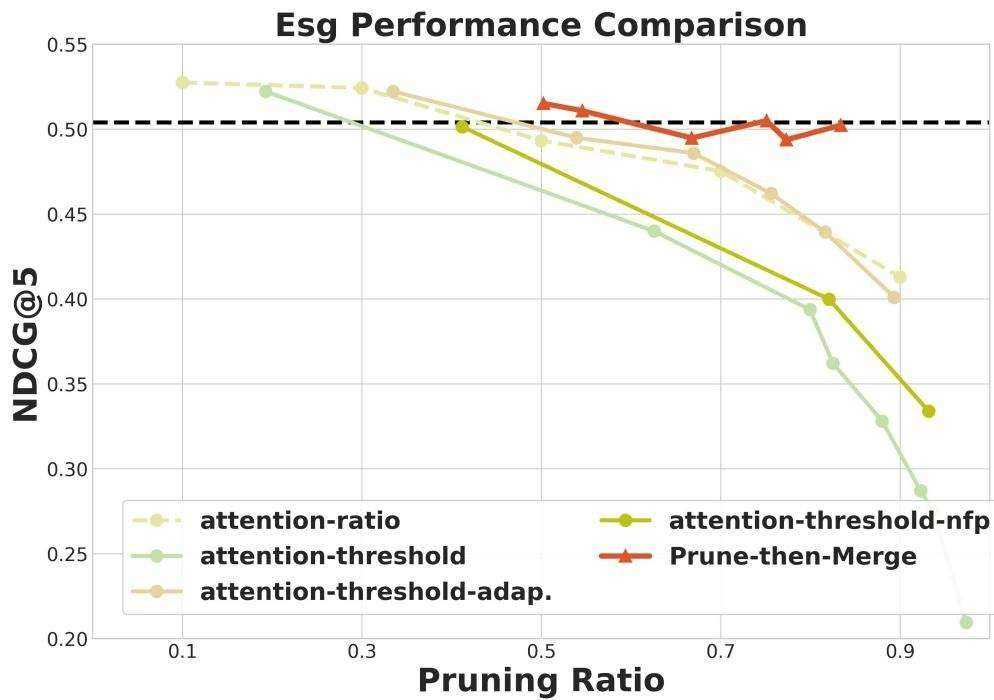  
Figure 15: Variant comparison of Jina-v4 on ESG dataset of ViDoRe-V2. solid lines denote adaptive methods, whereas dashed lines denote non-adaptive ones.

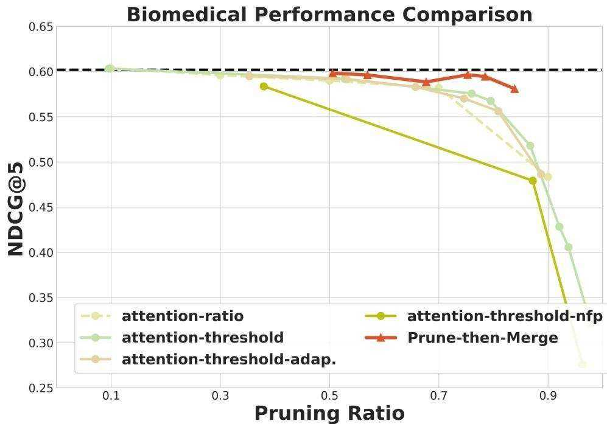  
Figure 16: Variant comparison of Jina-v4 on Biomedical dataset of ViDoRe-V2. solid lines denote adaptive methods, whereas dashed lines denote non-adaptive ones.

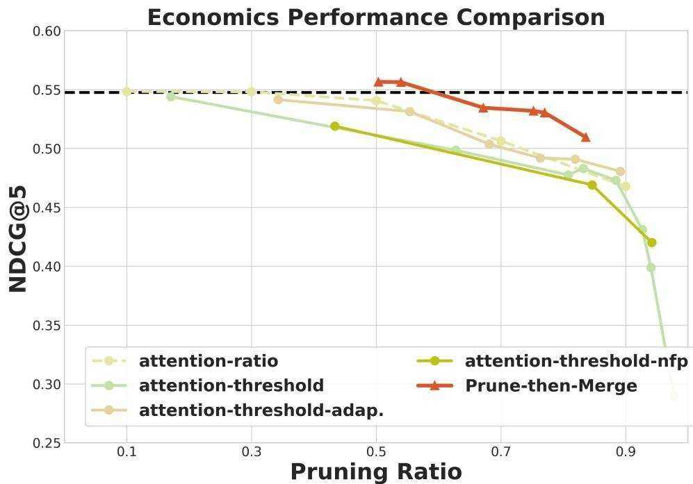  
Figure 17: Variant comparison of Jina-v4 on Economic dataset of ViDoRe-V2. solid lines denote adaptive methods, whereas dashed lines denote non-adaptive ones.

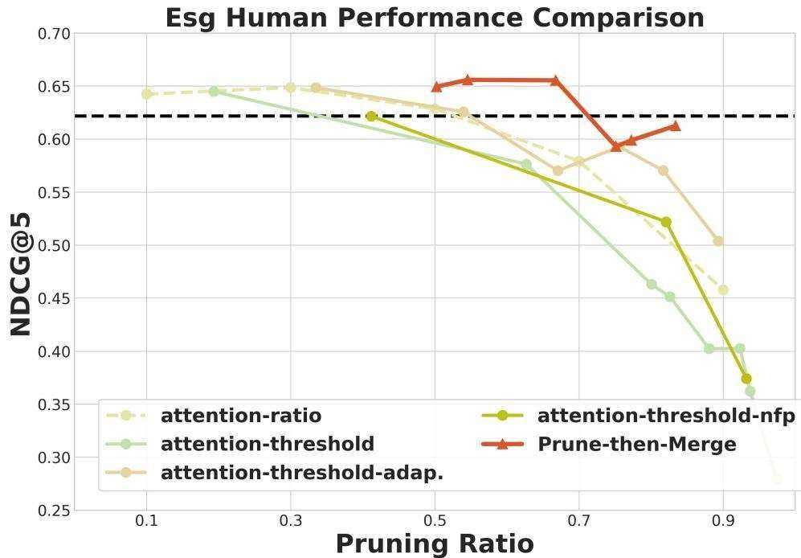  
Figure 18: Variant comparison of Jina-v4 on ESG Human dataset of ViDoRe-V2. solid lines denote adaptive methods, whereas dashed lines denote non-adaptive ones.

Table 2: Comparison of our PRUNE-THEN-MERGE with base models on ViDoRe-V1, in terms of performance, storage, and latency. The table presents absolute values and the relative change $( \Delta )$ . (We set adaptation factor as $- 0 . 7 5$ and merging factor as 4; orange denotes a better outcome and green denotes a worse outcome.)   

<table><tr><td></td><td></td><td>ColQwen2.5</td><td>ColNomic</td><td> JinaV4</td><td>Overall</td></tr><tr><td rowspan="3">Performance (nDCG@5)</td><td>base</td><td>0.8795</td><td>0.8999</td><td>0.8777</td><td>0.8857</td></tr><tr><td>PRUNE-THEN-MERGE</td><td>0.8771</td><td>0.8953</td><td>0.8727</td><td>0.8817</td></tr><tr><td>△</td><td>0.27%</td><td>0.51%</td><td>0.57%</td><td>0.45%</td></tr><tr><td rowspan="3"> Storage</td><td>base</td><td>1.0000</td><td>1.0000</td><td>1.0000</td><td>1.0000</td></tr><tr><td>PRUNE-THEN-MERGE</td><td>0.4112</td><td>0.4784</td><td>0.4723</td><td>0.4500</td></tr><tr><td>△</td><td>58.88%</td><td>52.16%</td><td>52.77%</td><td>54.60%</td></tr><tr><td rowspan="3"> Latency</td><td>base</td><td>0.41</td><td>0.45</td><td>0.51</td><td>0.46</td></tr><tr><td>PRUNE-THEN-MERGE</td><td>0.64</td><td>0.68</td><td>0.75</td><td>0.69</td></tr><tr><td>△</td><td>-56.10%</td><td>-51.11%</td><td></td><td>6-47.06% -51.42%</td></tr></table>

Table 3: Experimental results of ColQwen on ViDoRe-V1.   

<table><tr><td rowspan="2"></td><td rowspan="2"></td><td rowspan="2"></td><td rowspan="2"></td><td colspan="2"></td><td colspan="2"></td><td colspan="2"></td><td colspan="2"></td><td colspan="2"></td><td colspan="2"></td><td colspan="2"></td><td colspan="2"></td><td colspan="2"></td></tr><tr><td></td><td></td><td></td><td></td><td></td><td></td><td></td><td></td><td></td><td></td><td></td><td></td><td></td><td></td><td></td><td></td><td></td><td></td></tr><tr><td></td><td>base</td><td></td><td></td><td>0.87 -</td><td>0.86</td><td>-</td><td>0.60</td><td>0.92</td><td></td><td>0.90</td><td>0.76</td><td></td><td>0.86</td><td>-</td><td></td><td>0.95</td><td>-</td><td>0.96</td><td></td><td>0.96</td></tr><tr><td>pruning pruning</td><td>random</td><td></td><td></td><td>0.10</td><td>0.86</td><td>0.10</td><td>0.10</td><td>0.92</td><td>0.10 0.91</td><td>0.10</td><td>0.76</td><td>0.10</td><td>0.10 0.85</td><td>0.98 0.98</td><td>0.10</td><td>0.95</td><td>0.10</td><td>0.95</td><td>0.10 0.97</td><td>0.10 ·</td></tr><tr><td>pruning</td><td>random</td><td></td><td>ratio=0.1 ratio=0.3</td><td>0.87 0.87 0.30</td><td>0.86</td><td>0.30</td><td>0.60 0.60 0.30</td><td>0.91</td><td>0.30</td><td>0.91 0.30</td><td>0.76</td><td>0.30</td><td>0.84 0.30</td><td>0.98</td><td>0.30</td><td>0.95</td><td>0.30</td><td>0.96</td><td>0.30</td><td>0.30</td></tr><tr><td>pruning</td><td>random</td><td></td><td>ratio=0.5</td><td>0.87 0.50</td><td>0.86</td><td>0.50</td><td>0.60 0.50</td><td>0.91</td><td>0.50</td><td>0.50</td><td>0.76</td><td>0.50</td><td>0.82 0.50</td><td>0.98</td><td>0.50</td><td>0.96</td><td>0.50</td><td>0.95</td><td>0.97 0.50</td><td>0.50</td></tr><tr><td>pruning</td><td>random</td><td></td><td>ratio=0.7</td><td>0.86 0.70</td><td>0.85</td><td>0.70</td><td>0.58 0.70</td><td>0.91</td><td>0.91 0.70 0.91</td><td>0.70</td><td>0.75</td><td>0.70</td><td>0.79 0.70</td><td>0.97</td><td>0.70</td><td>0.95</td><td>0.70</td><td>0.96 0.70</td><td>0.97 0.97</td><td>0.70</td></tr><tr><td>pruning</td><td>random</td><td></td><td>ratio=0.9</td><td>0.83 0.90</td><td>0.82</td><td>0.90</td><td>0.55 0.90</td><td>0.87</td><td>0.90 0.90</td><td>0.90</td><td>0.73</td><td>0.90 0.73</td><td>0.90</td><td>0.94</td><td>0.90</td><td>0.91</td><td>0.90</td><td>0.91 0.90</td><td>0.95</td><td>0.90</td></tr><tr><td>pruning</td><td>docpruner</td><td>√</td><td>k=-0.5</td><td>0.36</td><td>0.86</td><td>0.35</td><td>0.60 0.34</td><td>0.92</td><td>0.35 0.91</td><td>0.37</td><td>0.75</td><td>0.36 0.84</td><td>0.36</td><td>0.98</td><td>0.36</td><td>0.95</td><td>0.36</td><td>0.96 0.36</td><td>0.97</td><td>0.36</td></tr><tr><td>pruning</td><td>docpruner</td><td>√</td><td>k=-0.25</td><td>0.87 0.86 0.52</td><td>0.86</td><td>0.51</td><td>0.59 0.52</td><td>0.90</td><td>0.51 0.92</td><td>0.52</td><td>0.75</td><td>0.50 0.82</td><td>0.52</td><td>0.96</td><td>0.52</td><td>0.95</td><td>0.51</td><td>0.95 0.52</td><td>0.96</td><td>0.52</td></tr><tr><td>pruning</td><td>docpruner</td><td>√</td><td>k=0</td><td>0.84 0.63</td><td>0.85</td><td>0.63</td><td>0.57 0.65</td><td>0.88</td><td>0.63 0.90</td><td>0.63</td><td>0.73</td><td>0.62</td><td>0.75 0.64</td><td>0.94</td><td>0.64</td><td>0.92</td><td>0.63</td><td>0.93 0.64</td><td>0.95</td><td>0.64</td></tr><tr><td> pruning</td><td>docpruner</td><td>√</td><td>k=0.25</td><td>0.83 0.72</td><td>0.85</td><td>0.72</td><td>0.55 0.73</td><td>0.86</td><td>0.72 0.90</td><td>0.71</td><td>0.71</td><td>0.70</td><td>0.75 0.72</td><td>0.93</td><td>0.73</td><td>0.87</td><td>0.72</td><td>0.92 0.72</td><td>0.96</td><td>0.72</td></tr><tr><td>pruning</td><td>docpruner</td><td>√</td><td>k=0.5</td><td>0.81 0.78</td><td>0.84</td><td>0.79</td><td>0.54 0.80</td><td>0.85</td><td>0.78 0.89</td><td>0.77</td><td>0.68</td><td>0.77 0.73</td><td>0.78</td><td>0.89</td><td>0.79</td><td>0.86</td><td>0.78</td><td>0.91 0.78</td><td>0.95</td><td>0.78</td></tr><tr><td>pruning</td><td>docpruner</td><td>√</td><td>k=1</td><td>0.77 0.87</td><td>0.79</td><td>0.87</td><td>0.49 0.88</td><td>0.82</td><td>0.87 0.84</td><td>0.86</td><td>0.63</td><td>0.86 0.71</td><td>0.86</td><td>0.85</td><td>0.87</td><td>0.81</td><td>0.86</td><td>0.86 0.86</td><td>0.90</td><td>0.86</td></tr><tr><td>pruning</td><td>pivot_threshold</td><td>√</td><td>k=-0.5</td><td>0.87 0.47</td><td>0.85</td><td>0.47</td><td>0.59 0.46</td><td>0.91</td><td>0.47 0.90</td><td>0.49</td><td>0.75</td><td>0.47 0.82</td><td>0.48</td><td>0.97</td><td>0.47</td><td>0.95</td><td>0.47</td><td>0.97 0.48</td><td>0.98</td><td>0.48</td></tr><tr><td>pruning</td><td>pivot_threshold</td><td>√</td><td>k=-0.25</td><td>0.86 0.60</td><td>0.85</td><td>0.60</td><td>0.59 0.61</td><td>0.90</td><td>0.60 0.92</td><td>0.60</td><td>0.74</td><td>0.59</td><td>0.81 0.61</td><td>0.95</td><td>0.61</td><td>0.95</td><td>0.60</td><td>0.95 0.61</td><td>0.96</td><td>0.61</td></tr><tr><td>pruning</td><td>pivot_threshold</td><td>√</td><td>k=0</td><td>0.85 0.70</td><td>0.85</td><td>0.69</td><td>0.57 0.71</td><td>0.88</td><td>0.70 0.90</td><td>0.69</td><td>0.73</td><td>0.69</td><td>0.77 0.70</td><td>0.94</td><td>0.71</td><td>0.92</td><td>0.70</td><td>0.93 0.70</td><td>0.96</td><td>0.70</td></tr><tr><td>pruning</td><td>pivot_threshold</td><td>√</td><td>k=0.25</td><td>0.83 0.77</td><td>0.84</td><td>0.77</td><td>0.56 0.78</td><td>0.86</td><td>0.77 0.90</td><td>0.75</td><td>0.72</td><td>0.76</td><td>0.74 0.77</td><td>0.93</td><td>0.77</td><td>0.88</td><td>0.76</td><td>0.92 0.77</td><td>0.96</td><td>0.77</td></tr><tr><td>pruning</td><td>pivot_threshold</td><td>√</td><td>k=0.5 0.81</td><td>0.82</td><td>0.83</td><td>0.82</td><td>0.54 0.83</td><td>0.85</td><td>0.82 0.89</td><td>0.80</td><td>0.68</td><td>0.81</td><td>0.73 0.82</td><td>0.89</td><td>0.82</td><td>0.86</td><td>0.81</td><td>0.91 0.82</td><td>0.95</td><td>0.82</td></tr><tr><td>pruning pruning</td><td>att_simil</td><td>√</td><td>k=0, alpha=0.9 0.83</td><td>0.52</td><td>0.82</td><td>0.54 0.55</td><td>0.53</td><td>0.87</td><td>0.52 0.87 0.83 0.84</td><td>0.53 0.82</td><td>0.68 0.57</td><td>0.50 0.84</td><td>0.79 0.52 0.74 0.83</td><td>0.92 0.84</td><td>0.52 0.83</td><td>0.91 0.82</td><td>0.52</td><td>0.93 0.52 0.87 0.83</td><td>0.95</td><td>0.51 0.83</td></tr><tr><td>merging</td><td>att_simil sem_cluster</td><td>√</td><td>k=1, alpha=0.9 0.76 ratio=2 0.87</td><td>0.83 0.50</td><td>0.75 0.86</td><td>0.83 0.47 0.50 0.58</td><td>0.83 0.50</td><td>0.82 0.91</td></table>

Table 4: Experimental results of ColNomic on ViDoRe-V1.   

<table><tr><td rowspan="2">Type</td><td rowspan="2">Methods</td><td rowspan="2">Adp.</td><td rowspan="2">Para</td><td colspan="2">all</td><td colspan="2">arxqa</td><td colspan="2">docqa infovqa</td><td colspan="2">tabfquad</td><td colspan="2">tatdqa</td><td colspan="2">shiftproject</td><td colspan="2">synth_ai synth_energy</td><td colspan="2">synth_gov</td><td colspan="2">synth_health</td></tr><tr><td></td><td>ndcgprun%</td><td>ndcg</td><td>prun%</td><td>ndcg prun%</td><td></td><td>ndegprun%</td><td>ndcg</td><td>prun%</td><td>ndegprun%</td><td></td><td>ndcgprun%</td><td>ndegprun%</td><td></td><td>ndeg prun%</td><td>ndcg</td><td>prun%</td><td>ndcg</td></tr><tr><td>pruning</td><td>base</td><td></td><td></td><td>0.89 ·</td><td>0.87</td><td></td><td>0.60</td><td>0.93</td><td></td><td>0.94</td><td></td><td></td><td>0.91</td><td>-</td><td></td><td>0.97</td><td>·</td><td>0.97</td><td></td><td>prun%</td></tr><tr><td>pruning</td><td>random</td><td></td><td>ratio=0.1</td><td>0.89 0.10</td><td>0.87</td><td>0.10</td><td>0.60 0.10</td><td>0.92</td><td>0.10</td><td>0.94</td><td>0.82 0.10 0.82</td><td>0.10</td><td>0.10 0.90</td><td>0.98 0.98</td><td>0.10</td><td>0.96</td><td>0.10</td><td>0.97 0.10</td><td>0.98 0.98</td><td>0.10 -</td></tr><tr><td>pruning</td><td>random</td><td></td><td>ratio=0.3</td><td>0.89 0.30</td><td>0.87</td><td>0.30</td><td>0.60</td><td>0.30 0.92</td><td>0.30</td><td>0.94</td><td>0.30 0.81</td><td>0.30</td><td>0.90</td><td>0.30 0.98</td><td>0.30</td><td>0.96</td><td>0.30</td><td>0.97 0.30</td><td>0.99</td><td>0.30</td></tr><tr><td> pruning</td><td>random</td><td></td><td>ratio=0.5</td><td>0.89 0.50</td><td>0.87</td><td>0.50</td><td>0.59</td><td>0.50 0.92</td><td>0.50</td><td>0.94</td><td>0.50 0.81</td><td>0.50</td><td>0.88</td><td>0.50 0.98</td><td>0.50</td><td>0.97</td><td>0.50</td><td>0.97</td><td>0.50 0.99</td><td>0.50</td></tr><tr><td>pruning</td><td>random</td><td></td><td>ratio=0.7</td><td>0.88 0.70</td><td>0.86</td><td>0.70</td><td>0.58 0.70</td><td>0.91</td><td>0.70</td><td>0.94</td><td>0.70 0.80</td><td>0.70</td><td>0.85</td><td>0.70 0.98</td><td>0.70</td><td>0.96</td><td>0.70</td><td>0.97</td><td>0.70 0.98</td><td>0.70</td></tr><tr><td> pruning</td><td>random</td><td></td><td>ratio=0.9</td><td>0.85 0.90</td><td>0.83</td><td>0.90</td><td>0.54 0.90</td><td>0.87</td><td>0.90</td><td>0.94</td><td>0.90 0.77</td><td>0.90</td><td>0.81</td><td>0.90 0.96</td><td>0.90</td><td>0.90</td><td>0.90</td><td>0.94 0.90</td><td>0.97</td><td>0.90</td></tr><tr><td>pruning</td><td>docpruner</td><td>√</td><td>k=-0.5</td><td>0.89 0.27</td><td>0.87</td><td>0.33</td><td>0.60 0.36</td><td>0.92</td><td>0.32</td><td>0.94</td><td>0.38 0.81</td><td>0.30</td><td>0.91</td><td>0.21 0.98</td><td>0.15</td><td>0.97</td><td>0.24</td><td>0.96 0.21</td><td>0.97</td><td>0.24</td></tr><tr><td> pruning</td><td>docpruner</td><td>√</td><td>k=-0.25</td><td>0.89 0.47</td><td>0.87</td><td>0.53</td><td>0.60 0.54</td><td>0.91</td><td>0.55</td><td>0.94</td><td>0.56 0.81</td><td>0.49</td><td>0.90</td><td>0.55 0.98</td><td>0.27</td><td>0.97</td><td>0.37</td><td>0.96 0.38</td><td>0.97</td><td>0.43</td></tr><tr><td>pruning</td><td>docpruner</td><td>√</td><td>k=0</td><td>0.88 0.70</td><td>0.86</td><td>0.68</td><td>0.59 0.66</td><td>0.91</td><td>0.69</td><td>0.94</td><td>0.67 0.80</td><td>0.68</td><td>0.88</td><td>0.73 0.96</td><td>0.74</td><td>0.95</td><td>0.71</td><td>0.96</td><td>0.73 0.97</td><td>0.72</td></tr><tr><td>pruning pruning</td><td>docpruner</td><td>√</td><td>k=0.25</td><td>0.850.79</td><td>0.84</td><td>0.76</td><td>0.59 0.74</td><td>0.90</td><td>0.77</td><td>0.93</td><td>0.74 0.77</td><td>0.77</td><td>0.82</td><td>0.81 0.88</td><td>0.87</td><td>0.87</td><td>0.82</td><td>0.91 0.83</td><td>0.94</td><td>0.82</td></tr><tr><td>pruning</td><td>docpruner docpruner</td><td>√ √</td><td>k=0.5 k=1</td><td>0.80 0.84 0.74 0.90</td><td>0.83 0.78</td><td>0.82 0.89</td><td>0.58 0.80 0.54 0.88</td><td>0.88 0.85</td><td>0.82 0.89</td><td>0.93 0.91</td><td>0.80 0.73 0.87 0.67</td><td>0.83 0.90</td><td>0.79</td><td>0.85 0.77</td><td>0.91</td><td>0.77</td><td>0.87</td><td>0.84 0.88</td><td>0.90</td><td>0.86</td></tr><tr><td>pruning</td><td>pivot_threshold</td><td>√</td><td>k=-0.5</td><td>0.89 0.39</td><td>0.86</td><td>0.44</td><td>0.59 0.46</td><td>0.92</td><td>0.43</td><td>0.94</td><td>0.48 0.79</td><td>0.40</td><td>0.76 0.90</td><td>0.91 0.61</td><td>0.94</td><td>0.73</td><td>0.92</td><td>0.77</td><td>0.92 0.82</td><td>0.91</td></tr><tr><td>pruning</td><td>pivot_threshold</td><td>√</td><td>k=-0.25</td><td>0.89 0.55</td><td>0.86</td><td>0.62</td><td>0.59 0.61</td><td>0.91</td><td>0.63</td><td>0.94</td><td>0.64 0.79</td><td>0.57</td><td>0.89</td><td>0.33 0.99 0.63 0.98</td><td>0.28 0.38</td><td>0.97</td><td>0.36</td><td>0.96</td><td>0.33 0.98</td><td>0.36</td></tr><tr><td>pruning</td><td>pivot_threshold</td><td>√</td><td>k=0</td><td>0.88 0.75</td><td>0.86</td><td>0.74</td><td>0.59 0.72</td><td>0.91</td><td>0.74</td><td>0.94</td><td>0.73 0.79</td><td>0.73</td><td>0.88</td><td>0.78 0.96</td><td>0.79</td><td>0.96</td><td>0.47</td><td>0.98</td><td>0.48 0.98</td><td>0.52</td></tr><tr><td> pruning</td><td>pivot_threshold</td><td>√</td><td>k=0.25</td><td>0.84 0.83</td><td>0.85</td><td>0.81</td><td>0.59 0.79</td><td>0.89</td><td>0.81</td><td>0.93</td><td>0.79 0.76</td><td>0.81</td><td>0.82</td><td>0.84 0.87</td><td>0.89</td><td>0.96 0.86</td><td>0.77 0.86</td><td>0.95 0.91 0.86</td><td>0.78 0.97</td><td>0.77</td></tr><tr><td>pruning</td><td>pivot_threshold</td><td>√</td><td>k=0.5</td><td>0.80 0.87</td><td>0.83</td><td>0.85</td><td>0.58 0.84</td><td>0.88</td><td>0.86</td><td>0.93</td><td>0.84 0.73</td><td>0.86</td><td>0.78</td><td>0.88 0.77</td><td>0.92</td><td>0.78</td><td>0.89</td><td>0.85 0.90</td><td>0.94</td><td>0.85</td></tr><tr><td> pruning</td><td>att_simil</td><td>√</td><td>k=0, alpha=0.9</td><td>0.87 0.52</td><td>0.85</td><td>0.51</td><td>0.58 0.50</td><td>0.90</td><td>0.52</td><td>0.93</td><td>0.51 0.79</td><td>0.48</td><td>0.86</td><td>0.54 0.95</td><td>0.53</td><td>0.94</td><td>0.52</td><td>0.94 0.52</td><td>0.90 0.97</td><td>0.89 0.52</td></tr><tr><td>pruning</td><td>att_simil</td><td>√</td><td>k=1, alpha=0.9</td><td>0.82 0.83</td><td>0.78</td><td>0.83</td><td>0.51 0.83</td><td>0.85</td><td>0.82</td><td>0.92</td><td>0.83 0.66 0.81</td><td>0.83 0.50</td><td>0.78 0.91 0.50</td><td>0.83 0.91</td><td>0.83</td><td>0.89</td><td>0.83</td><td>0.92 0.83</td><td>0.96</td><td>0.83</td></tr><tr><td>merging merging</td><td>sem_cluster sem_cluster</td><td></td><td>ratio=2 ratio=4</td><td>0.89 0.50 0.88 0.75</td><td>0.86 0.86</td><td>0.50 0.75</td><td>0.59 0.50 0.60 0.75</td><td>0.92 0.91</td><td>0.50 0.75</td><td>0.94 0.50 0.94 0.75</td></table>

Table 5: Experimental results of Jina-v4 on ViDoRe-V1.   

<table><tr><td rowspan="2">Type</td><td rowspan="2">Methods</td><td rowspan="2">Adp.</td><td rowspan="2">Para</td><td colspan="2">all</td><td colspan="2">arxqa</td><td colspan="2">docqa</td><td colspan="2">infovqa tabfquad</td><td colspan="2">tatdqa</td><td colspan="2">shiftproject</td><td colspan="2">synth_ai</td><td colspan="2">synth_energy</td><td colspan="2">synth_gov</td><td colspan="2">synth_health</td></tr><tr><td>ndcgprun%</td><td></td><td>ndcg</td><td>prun%</td><td>ndcg</td><td>prun%</td><td>ndcg prun%</td><td>ndcg</td><td>prun%</td><td>ndcg</td><td>prun%</td><td>ndcg</td><td>prun% ndcg</td><td>prun%</td><td>ndcg</td><td>prun%</td><td></td><td>ndcg</td><td>prun%</td><td>ndcg prun%</td></tr><tr><td>pruning</td><td>base</td><td></td><td></td><td>0.87</td><td></td><td>0.86 ·</td><td>0.58</td><td></td><td>0.90</td><td>·</td><td>0.92</td><td>0.72</td><td></td><td>0.88</td><td>·</td><td>0.98</td><td>·</td><td>0.95</td><td>·</td><td>0.96</td><td></td><td>0.97</td></tr><tr><td>pruning</td><td>random</td><td></td><td>ratio=0.1</td><td>0.87 0.10</td><td></td><td>0.10</td><td>0.58</td><td>0.10</td><td>0.90</td><td>0.10 0.92</td><td>0.10</td><td>0.72</td><td>0.10</td><td>0.88</td><td>0.10</td><td>0.98 0.10</td><td>0.96</td><td>0.10</td><td>0.96</td><td>0.10</td><td>0.97</td><td>0.10</td></tr><tr><td>pruning</td><td>random</td><td></td><td>ratio=0.3</td><td>0.87</td><td>0.30</td><td>0.86 0.30</td><td>0.58</td><td>0.30</td><td>0.89</td><td>0.30</td><td>0.92 0.30</td><td>0.72</td><td>0.30</td><td>0.88</td><td>0.30</td><td>0.98</td><td>0.30</td><td>0.95</td><td>0.30</td><td>0.96 0.30</td><td>0.97</td><td>0.30</td></tr><tr><td>pruning</td><td>random</td><td></td><td>ratio=0.5</td><td>0.87</td><td>0.50</td><td>0.85 0.50 0.85</td><td>0.57</td><td>0.50</td><td>0.89</td><td>0.50 0.92</td><td>0.50</td><td>0.72</td><td>0.50</td><td>0.86</td><td>0.50</td><td>0.98</td><td>0.50</td><td>0.95</td><td>0.50 0.96</td><td>0.50</td><td>0.96</td><td>0.50</td></tr><tr><td>pruning</td><td>random</td><td></td><td>ratio=0.7</td><td>0.85</td><td>0.70</td><td>0.70 0.83</td><td>0.54</td><td>0.70</td><td>0.87</td><td>0.70 0.92</td><td>0.70</td><td>0.70</td><td>0.70</td><td>0.84</td><td>0.70</td><td>0.97</td><td>0.70</td><td>0.93 0.70</td><td>0.97</td><td>0.70</td><td>0.97</td><td>0.70</td></tr><tr><td>pruning</td><td>random</td><td></td><td>ratio=0.9</td><td>0.82</td><td>0.90</td><td>0.90</td><td>0.48</td><td>0.90</td><td>0.83</td><td>0.90 0.91</td><td>0.90</td><td>0.66</td><td>0.90</td><td>0.74</td><td>0.90</td><td>0.95</td><td>0.90 0.87</td><td>0.90</td><td>0.93</td><td>0.90</td><td>0.96</td><td>0.90</td></tr><tr><td>pruning</td><td>docpruner</td><td>√</td><td>k=-0.5</td><td>0.87</td><td>0.30</td><td>0.30</td><td>0.57</td><td>0.31</td><td>0.90</td><td>0.18 0.93</td><td>0.33</td><td>0.71</td><td>0.23</td><td>0.87</td><td>0.33</td><td>0.98 0.33</td><td>0.94</td><td>0.31</td><td>0.97</td><td>0.33</td><td>0.97</td><td>0.32</td></tr><tr><td> pruning</td><td>docpruner</td><td>√</td><td>k=-0.25</td><td>0.86</td><td>0.54</td><td>0.53</td><td>0.57</td><td>0.55</td><td>0.88</td><td>0.53 0.92</td><td>0.54</td><td>0.69</td><td>0.54</td><td>0.86</td><td>0.55</td><td>0.98</td><td>0.55 0.93</td><td>0.54</td><td>0.96</td><td>0.55</td><td>0.97</td><td>0.54</td></tr><tr><td>pruning</td><td>docpruner</td><td>√</td><td>k=0</td><td>0.85</td><td>0.68</td><td>0.68</td><td>0.54</td><td>0.69</td><td>0.86</td><td>0.71 0.91</td><td>0.67</td><td>0.66</td><td>0.70</td><td>0.83</td><td>0.68</td><td>0.97</td><td>0.67</td><td>0.93 0.68</td><td>0.95</td><td>0.68</td><td>0.98</td><td>0.68</td></tr><tr><td> pruning</td><td>docpruner</td><td>√</td><td>k=0.25</td><td>0.83</td><td>0.77</td><td>0.77</td><td>0.51</td><td>0.77</td><td>0.81</td><td>0.81 0.91</td><td>0.75</td><td>0.63</td><td>0.79</td><td>0.84</td><td>0.76</td><td>0.95</td><td>0.76 0.91</td><td>0.77</td><td>0.95</td><td>0.76</td><td>0.98</td><td>0.76</td></tr><tr><td>pruning pruning</td><td>docpruner</td><td>√</td><td>k=0.5</td><td>0.81</td><td>0.83</td><td>0.83</td><td>0.49</td><td>0.83</td><td>0.76</td><td>0.86 0.90</td><td>0.81</td><td>0.59</td><td>0.85</td><td>0.81</td><td>0.82</td><td>0.94</td><td>0.81 0.89</td><td>0.83</td><td>0.95</td><td>0.82</td><td>0.97</td><td>0.82</td></tr><tr><td>pruning</td><td>docpruner pivot_threshold</td><td>√</td><td>k=1</td><td>0.76</td><td>0.90</td><td>0.90</td><td>0.43</td><td>0.89</td><td>0.68</td><td>0.92 0.87</td><td>0.89</td><td>0.50</td><td>0.91</td><td>0.78</td><td>0.89</td><td>0.88</td><td>0.89 0.82</td><td>0.89</td><td>0.93</td><td>0.89</td><td>0.92</td><td>0.89</td></tr><tr><td> pruning</td><td>pivot_threshold</td><td>√ √</td><td>k=-0.5</td><td>0.87</td><td>0.42</td><td>0.42</td><td>0.56</td><td>0.43</td><td>0.90</td><td>0.30 0.92</td><td>0.45 0.62</td><td>0.71</td><td>0.35</td><td>0.87</td><td>0.45</td><td>0.98 0.45</td><td>0.94</td><td>0.42</td><td>0.97</td><td>0.44</td><td>0.97</td><td>0.44</td></tr><tr><td>pruning</td><td>pivot_threshold</td><td>√</td><td>k=-0.25</td><td>0.86 0.85</td><td>0.62 0.74</td><td>0.62</td><td>0.56 0.53</td><td>0.64</td><td>0.88</td><td>0.61 0.93 0.91</td><td>0.73</td><td>0.69 0.66</td><td>0.61</td><td>0.86</td><td>0.63</td><td>0.98</td><td>0.63 0.92</td><td>0.62</td><td>0.95</td><td>0.63</td><td>0.96</td><td>0.62</td></tr><tr><td> pruning</td><td>pivot_threshold</td><td>√</td><td>k=0 k=0.25</td><td>0.83</td><td>0.81</td><td>0.74 0.81</td><td>0.50</td><td>0.75 0.82</td><td>0.86 0.81</td><td>0.76 0.84 0.91</td><td>0.80</td><td>0.63</td><td>0.75 0.82</td><td>0.83 0.83</td><td>0.74 0.80</td><td>0.96</td><td>0.73</td><td>0.92 0.74</td><td>0.96</td><td>0.74</td><td>0.98</td><td>0.73</td></tr><tr><td>pruning</td><td>pivot_threshold</td><td>√</td><td>k=0.5</td><td>0.80</td><td>0.86</td><td>0.86</td><td>0.48</td><td>0.86</td><td>0.75</td><td>0.89 0.90</td><td>0.84</td><td>0.59</td><td>0.87</td><td>0.79</td><td>0.85</td><td>0.94</td><td>0.80 0.85</td><td>0.90 0.81 0.88 0.86</td><td>0.95 0.95</td><td>0.80 0.85</td><td>0.97 0.97</td><td>0.80 0.85</td></tr><tr><td>pruning pruning</td><td>att_simil att_simil</td><td>√</td><td>k=0, alpha=0.9</td><td>0.81</td><td>0.58</td><td>0.57</td><td>0.51</td><td>0.60</td><td>0.86</td><td>0.58 0.91</td><td>0.56</td><td>0.56</td><td>0.59</td><td>0.73</td><td>0.53</td><td>0.93 0.97 0.59</td></table>

Table 6: Experimental results of ColQwen on ViDoRe-V2.   

<table><tr><td rowspan="2">Type</td><td rowspan="2">Methods</td><td rowspan="2">Adp.</td><td rowspan="2">Para</td><td colspan="2">all</td><td colspan="2">esg</td><td colspan="2">biomedical</td><td colspan="2">economics</td><td colspan="2">esg_human</td></tr><tr><td>ndcg</td><td>prun%</td><td>ndcg</td><td>prun%</td><td>ndcg</td><td>prun%</td><td>ndcg</td><td>prun%</td><td>ndcg</td><td>prun%</td></tr><tr><td> pruning</td><td>base</td><td></td><td>-</td><td>0.55</td><td>-</td><td>0.51</td><td>-</td><td>0.58</td><td>-</td><td>0.49</td><td>-</td><td>0.61</td><td>1</td></tr><tr><td> pruning</td><td> random</td><td></td><td>ratio=0.1</td><td>0.53</td><td>0.10</td><td>0.49</td><td>0.10</td><td>0.56</td><td>0.10</td><td>0.49</td><td>0.10</td><td>0.59</td><td>0.10</td></tr><tr><td> pruning</td><td>random</td><td></td><td>ratio=0.3</td><td>0.50</td><td>0.30</td><td>0.45</td><td>0.30</td><td>0.55</td><td>0.30</td><td>0.49</td><td>0.30</td><td>0.50</td><td>0.30</td></tr><tr><td> pruning</td><td>random</td><td></td><td>ratio=0.5</td><td>0.46</td><td>0.50</td><td>0.43</td><td>0.50</td><td>0.54</td><td>0.50</td><td>0.45</td><td>0.50</td><td>0.44</td><td>0.50</td></tr><tr><td>pruning</td><td>random</td><td></td><td>ratio=0.7</td><td>0.45</td><td>0.70</td><td>0.39</td><td>0.70</td><td>0.53</td><td>0.70</td><td>0.47</td><td>0.70</td><td>0.40</td><td>0.70</td></tr><tr><td> pruning</td><td>random</td><td></td><td>ratio=0.9</td><td>0.38</td><td>0.90</td><td>0.32</td><td>0.90</td><td>0.48</td><td>0.90</td><td>0.40</td><td>0.90</td><td>0.33</td><td>0.90</td></tr><tr><td> pruning</td><td> docpruner</td><td>V</td><td>k=-0.5</td><td>0.55</td><td>0.34</td><td>0.54</td><td>0.34</td><td>0.57</td><td>0.37</td><td>0.48</td><td>0.33</td><td>0.60</td><td>0.33</td></tr><tr><td> pruning</td><td> docpruner</td><td>√</td><td>k=-0.25</td><td>0.54</td><td>0.51</td><td>0.51</td><td>0.51</td><td>0.56</td><td>0.52</td><td>0.48</td><td>0.50</td><td>0.61</td><td>0.51</td></tr><tr><td> pruning</td><td>docpruner</td><td>&lt;</td><td>k=0</td><td>0.54</td><td>0.64</td><td>0.52</td><td>0.64</td><td>0.55</td><td>0.64</td><td>0.48</td><td>0.63</td><td>0.61</td><td>0.64</td></tr><tr><td> pruning</td><td> docpruner</td><td>√</td><td>k=0.25</td><td>0.52</td><td>0.73</td><td>0.50</td><td>0.73</td><td>0.53</td><td>0.72</td><td>0.50</td><td>0.73</td><td>0.57</td><td>0.73</td></tr><tr><td> pruning</td><td>docpruner</td><td>v</td><td>k=0.5</td><td>0.51</td><td>0.79</td><td>0.49</td><td>0.79</td><td>0.52</td><td>0.78</td><td>0.48</td><td>0.79</td><td>0.53</td><td>0.79</td></tr><tr><td> pruning</td><td> docpruner</td><td>√</td><td>k=1</td><td>0.47</td><td>0.87</td><td>0.43</td><td>0.88</td><td>0.48</td><td>0.87</td><td>0.45</td><td>0.87</td><td>0.51</td><td>0.87</td></tr><tr><td>pruning</td><td> pivot_threshold</td><td>V</td><td>k=-0.5</td><td>0.53</td><td>0.46</td><td>0.51</td><td>0.45</td><td>0.56</td><td>0.48</td><td>0.46</td><td>0.45</td><td>0.59</td><td>0.45</td></tr><tr><td> pruning</td><td> pivot_threshold</td><td>√</td><td>k=-0.25</td><td>0.53</td><td>0.60</td><td>0.48</td><td>0.60</td><td>0.56</td><td>0.61</td><td>0.47</td><td>0.59</td><td>0.60</td><td>0.60</td></tr><tr><td> pruning</td><td>pivot_threshold</td><td>v</td><td>k=0</td><td>0.52</td><td>0.70</td><td>0.48</td><td>0.70</td><td>0.55</td><td>0.70</td><td>0.48</td><td>0.70</td><td>0.58</td><td>0.70</td></tr><tr><td> pruning</td><td> pivot_threshold</td><td>√</td><td>k=0.25</td><td>0.52</td><td>0.77</td><td>0.48</td><td>0.77</td><td>0.54</td><td>0.77</td><td>0.49</td><td>0.78</td><td>0.55</td><td>0.78</td></tr><tr><td>pruning</td><td>pivot_threshold</td><td>v</td><td>k=0.5</td><td>0.49</td><td>0.82</td><td>0.46</td><td>0.83</td><td>0.53</td><td>0.81</td><td>0.49</td><td>0.82</td><td>0.49</td><td>0.83</td></tr><tr><td> pruning</td><td> attention_plus_similarity</td><td>√</td><td>k=0,alpha=0.7</td><td>0.52</td><td>0.52</td><td>0.48</td><td>0.53</td><td>0.56</td><td>0.52</td><td>0.48</td><td>0.50</td><td>0.54</td><td>0.52</td></tr><tr><td> pruning</td><td>attention_plus_similarity</td><td>√</td><td>k=1, alpha=0.9</td><td>0.45</td><td>0.83</td><td>0.43</td><td>0.84</td><td>0.47</td><td>0.82</td><td>0.44</td><td>0.83</td><td>0.47</td><td>0.84</td></tr><tr><td> merging</td><td> sem_cluster</td><td></td><td>ratio=2</td><td>0.53</td><td>0.50</td><td>0.53</td><td>0.50</td><td>0.57</td><td>0.50</td><td>0.44</td><td>0.50</td><td>0.59</td><td>0.50</td></tr><tr><td>merging</td><td>sem_cluster</td><td></td><td>ratio=4</td><td>0.51</td><td>0.75</td><td>0.50</td><td>0.75</td><td>0.55</td><td>0.75</td><td>0.45</td><td>0.75</td><td>0.56</td><td>0.75</td></tr><tr><td> merging</td><td> sem_cluster</td><td></td><td>ratio=9</td><td>0.49</td><td>0.89</td><td>0.46</td><td>0.89</td><td>0.53</td><td>0.89</td><td>0.45</td><td>0.89</td><td>0.51</td><td>0.89</td></tr><tr><td>merging</td><td>sem_cluster</td><td></td><td>ratio=16</td><td>0.46</td><td>0.94</td><td>0.45</td><td>0.94</td><td>0.52</td><td>0.94</td><td>0.44</td><td>0.94</td><td>0.43</td><td>0.94</td></tr><tr><td> merging</td><td> sem_cluster</td><td></td><td>ratio=25</td><td>0.43</td><td>0.96</td><td>0.39</td><td>0.96</td><td>0.48</td><td>0.96</td><td>0.41</td><td>0.96</td><td>0.44</td><td>0.96</td></tr><tr><td>merging</td><td>1d_pooling</td><td></td><td>ratio=4</td><td>0.40</td><td>0.75</td><td>0.33</td><td>0.75</td><td>0.50</td><td>0.75</td><td>0.43</td><td>0.75</td><td>0.36</td><td>0.75</td></tr><tr><td> merging</td><td> 1d_pooling</td><td></td><td>ratio=9</td><td>0.31</td><td>0.89</td><td>0.23</td><td>0.89</td><td>0.41</td><td>0.89</td><td>0.37</td><td>0.89</td><td>0.22</td><td>0.89</td></tr><tr><td>merging</td><td>1d_pooling</td><td></td><td>ratio=16</td><td>0.26</td><td>0.94</td><td>0.14</td><td>0.94</td><td>0.34</td><td>0.94</td><td>0.35</td><td>0.94</td><td>0.20</td><td>0.94</td></tr><tr><td> merging</td><td>1d_pooling 2d_pooling</td><td></td><td>ratio=25 ratio=4</td><td>0.23 0.40</td><td>0.96 0.75</td><td>0.12 0.40</td><td>0.96 0.75</td><td>0.28 0.47</td><td>0.96 0.75</td><td>0.35 0.40</td><td>0.96 0.75</td><td>0.15 0.35</td><td>0.96 0.75</td></tr><tr><td>merging merging 2d_pooling</td></table>

Table 7: Experimental results of ColNomic on ViDoRe-V2.   

<table><tr><td rowspan="2">Type</td><td rowspan="2">Methods</td><td rowspan="2">Adp.</td><td rowspan="2">Para</td><td colspan="2">al</td><td colspan="2">esg</td><td colspan="2">biomedical</td><td colspan="2">economics</td><td colspan="2">esg_human</td></tr><tr><td>ndcg</td><td>prun%</td><td>ndcg</td><td>prun%</td><td>ndcg</td><td>prun%</td><td>ndcg</td><td>prun%</td><td>ndcg</td><td>prun%</td></tr><tr><td>pruning</td><td>base</td><td></td><td>1</td><td>0.59</td><td>-</td><td>0.55</td><td>-</td><td>0.63</td><td>-</td><td>0.55</td><td>-</td><td>0.63</td><td>-</td></tr><tr><td> pruning</td><td> random</td><td></td><td>ratio=0.1</td><td>0.59</td><td>0.10</td><td>0.54</td><td>0.10</td><td>0.62</td><td>0.10</td><td>0.55</td><td>0.10</td><td>0.65</td><td>0.10</td></tr><tr><td> pruning</td><td>random</td><td></td><td>ratio=0.3</td><td>0.58</td><td>0.30</td><td>0.52</td><td>0.30</td><td>0.62</td><td>0.30</td><td>0.54</td><td>0.30</td><td>0.65</td><td>0.30</td></tr><tr><td> pruning</td><td> random</td><td></td><td>ratio=0.5</td><td>0.57</td><td>0.50</td><td>0.50</td><td>0.50</td><td>0.62</td><td>0.50</td><td>0.55</td><td>0.50</td><td>0.61</td><td>0.50</td></tr><tr><td> pruning</td><td>random</td><td></td><td>ratio=0.7</td><td>0.54</td><td>0.70</td><td>0.45</td><td>0.70</td><td>0.60</td><td>0.70</td><td>0.54</td><td>0.70</td><td>0.57</td><td>0.70</td></tr><tr><td> pruning</td><td>random</td><td></td><td>ratio=0.9</td><td>0.48</td><td>0.90</td><td>0.39</td><td>0.90</td><td>0.55</td><td>0.90</td><td>0.47</td><td>0.90</td><td>0.50</td><td>0.90</td></tr><tr><td> pruning</td><td> docpruner</td><td>√</td><td>k=-0.5</td><td>0.60</td><td>0.24</td><td>0.56</td><td>0.32</td><td>0.61</td><td>0.22</td><td>0.56</td><td>0.08</td><td>0.64</td><td>0.32</td></tr><tr><td> pruning</td><td> docpruner</td><td>√</td><td>k=-0.25</td><td>0.59</td><td>0.43</td><td>0.54</td><td>0.54</td><td>0.61</td><td>0.48</td><td>0.57</td><td>0.16</td><td>0.65</td><td>0.54</td></tr><tr><td> pruning</td><td>docpruner</td><td>v</td><td>k=0</td><td>0.57</td><td>0.72</td><td>0.50</td><td>0.70</td><td>0.61</td><td>0.69</td><td>0.51</td><td>0.77</td><td>0.64</td><td>0.70</td></tr><tr><td> pruning</td><td> docpruner</td><td>√</td><td>k=0.25</td><td>0.50</td><td>0.82</td><td>0.50</td><td>0.78</td><td>0.57</td><td>0.79</td><td>0.33</td><td>0.92</td><td>0.61</td><td>0.78</td></tr><tr><td> pruning</td><td> docpruner</td><td>V</td><td>k=0.5</td><td>0.47</td><td>0.86</td><td>0.46</td><td>0.83</td><td>0.54</td><td>0.85</td><td>0.29</td><td>0.94</td><td>0.60</td><td>0.83</td></tr><tr><td> pruning</td><td> docpruner</td><td>&lt;</td><td>k=1</td><td>0.42</td><td>0.91</td><td>0.40</td><td>0.89</td><td>0.49</td><td>0.91</td><td>0.27</td><td>0.96</td><td>0.54</td><td>0.89</td></tr><tr><td> pruning</td><td> pivot_threshold</td><td>√</td><td>k=-0.5</td><td>0.57</td><td>0.36</td><td>0.53</td><td>0.43</td><td>0.61</td><td>0.35</td><td>0.54</td><td>0.22</td><td>0.61</td><td>0.43</td></tr><tr><td> pruning</td><td> pivot_threshold</td><td>√</td><td>k=-0.25</td><td>0.56</td><td>0.53</td><td>0.50</td><td>0.62</td><td>0.60</td><td>0.58</td><td>0.54</td><td>0.29</td><td>0.61</td><td>0.62</td></tr><tr><td> pruning</td><td> pivot_threshold</td><td>~</td><td>k=0</td><td>0.56</td><td>0.77</td><td>0.49</td><td>0.76</td><td>0.61</td><td>0.75</td><td>0.52</td><td>0.82</td><td>0.61</td><td>0.76</td></tr><tr><td> pruning</td><td> pivot_threshold</td><td>&lt;</td><td>k=0.25</td><td>0.49</td><td>0.85</td><td>0.49</td><td>0.82</td><td>0.57</td><td>0.82</td><td>0.33</td><td>0.93</td><td>0.59</td><td>0.82</td></tr><tr><td> pruning</td><td>pivot_threshold</td><td>v</td><td>k=0.5</td><td>0.46</td><td>0.89</td><td>0.45</td><td>0.86</td><td>0.54</td><td>0.87</td><td>0.29</td><td>0.95</td><td>0.57</td><td>0.86</td></tr><tr><td> pruning</td><td>attention_plus_similarity</td><td>v</td><td> k=0, alpha=0.5</td><td>0.56</td><td>0.53</td><td>0.50</td><td>0.54</td><td>0.61</td><td>0.55</td><td>0.55</td><td>0.51</td><td>0.59</td><td>0.54</td></tr><tr><td> pruning</td><td>attention_plus_similarity</td><td>&lt;</td><td>k=1, alpha=0.9</td><td>0.50</td><td>0.83</td><td>0.43</td><td>0.83</td><td>0.56</td><td>0.82</td><td>0.54</td><td>0.84</td><td>0.48</td><td>0.83</td></tr><tr><td> merging</td><td> sem_cluster</td><td></td><td>ratio=2</td><td>0.57</td><td>0.50</td><td>0.53</td><td>0.50</td><td>0.61</td><td>0.50</td><td>0.52</td><td>0.50</td><td>0.63</td><td>0.50</td></tr><tr><td>merging</td><td>sem_cluster</td><td></td><td>ratio=4</td><td>0.54</td><td>0.75</td><td>0.47</td><td>0.75</td><td>0.60</td><td>0.75</td><td>0.51</td><td>0.75</td><td>0.57</td><td>0.75</td></tr><tr><td>merging</td><td> sem_cluster</td><td></td><td>ratio=9</td><td>0.51</td><td>0.89</td><td>0.43</td><td>0.89</td><td>0.56</td><td>0.89</td><td>0.49</td><td>0.89</td><td>0.57</td><td>0.89</td></tr><tr><td>merging</td><td>sem_cluster</td><td></td><td>ratio=16</td><td>0.47</td><td>0.94</td><td>0.37</td><td>0.94</td><td>0.54</td><td>0.94</td><td>0.48</td><td>0.94</td><td>0.47</td><td>0.94</td></tr><tr><td>merging</td><td> sem_cluster</td><td></td><td>ratio=25</td><td>0.45</td><td>0.96</td><td>0.34</td><td>0.96</td><td>0.53</td><td>0.96</td><td>0.50</td><td>0.96</td><td>0.45</td><td>0.96</td></tr><tr><td>merging</td><td>1d_pooling</td><td></td><td>ratio=2</td><td>0.51</td><td>0.50</td><td>0.42</td><td>0.50</td><td>0.59</td><td>0.50</td><td>0.49</td><td>0.50</td><td>0.56</td><td>0.50</td></tr><tr><td>merging</td><td>1d_pooling</td><td></td><td>ratio=4</td><td>0.43</td><td>0.75</td><td>0.33</td><td>0.75</td><td>0.54</td><td>0.75</td><td>0.43</td><td>0.75</td><td>0.41</td><td>0.75</td></tr><tr><td>merging</td><td>1d_pooling</td><td></td><td>ratio=9</td><td>0.38</td><td>0.89</td><td>0.27</td><td>0.89</td><td>0.45</td><td>0.89</td><td>0.39</td><td>0.89</td><td>0.41</td><td>0.89</td></tr><tr><td> merging</td><td>1d_pooling 1d_pooling</td><td></td><td>ratio=16 ratio=25</td><td>0.35 0.33</td><td>0.94 0.96</td><td>0.25 0.21</td><td>0.94 0.96</td><td>0.45 0.43</td><td>0.94 0.96</td><td>0.37 0.37</td><td>0.94 0.96</td><td>0.32 0.32</td><td>0.94 0.96</td></tr><tr><td>merging merging 2d_pooling</td></table>

Table 8: Experimental results of Jina-v4 on ViDoRe-V2.   

<table><tr><td rowspan="2">Type</td><td rowspan="2">Methods</td><td rowspan="2">Adp.</td><td rowspan="2">Para</td><td colspan="2">all</td><td colspan="2">esg</td><td colspan="2">biomedical</td><td colspan="2">economics</td><td colspan="2"> esg_human</td></tr><tr><td>ndcg</td><td>prun%</td><td>ndcg</td><td>prun%</td><td>ndcg</td><td>prun%</td><td>ndcg</td><td>prun%</td><td>ndcg</td><td>prun%</td></tr><tr><td>pruning</td><td>base</td><td></td><td>-</td><td>0.56</td><td>1</td><td>0.50</td><td>-</td><td>0.60</td><td>1</td><td>0.54</td><td>-</td><td></td><td>1</td></tr><tr><td> pruning</td><td> random</td><td></td><td>ratio=0.1</td><td>0.57</td><td>0.10</td><td>0.51</td><td>0.10</td><td>0.59</td><td>0.10</td><td>0.54</td><td>0.10</td><td>0.62 0.62</td><td>0.10</td></tr><tr><td> pruning</td><td>random</td><td></td><td>ratio=0.3</td><td>0.56</td><td>0.30</td><td>0.49</td><td>0.30</td><td>0.59</td><td>0.30</td><td>0.54</td><td>0.30</td><td>0.62</td><td>0.30</td></tr><tr><td> pruning</td><td> random</td><td></td><td>ratio=0.5</td><td>0.56</td><td>0.50</td><td>0.48</td><td>0.50</td><td>0.60</td><td>0.50</td><td>0.55</td><td>0.50</td><td>0.61</td><td>0.50</td></tr><tr><td> pruning</td><td>random</td><td></td><td>ratio=0.7</td><td>0.52</td><td>0.70</td><td>0.44</td><td>0.70</td><td>0.58</td><td>0.70</td><td>0.51</td><td>0.70</td><td>0.56</td><td>0.70</td></tr><tr><td> pruning</td><td> random</td><td></td><td>ratio=0.9</td><td>0.45</td><td>0.90</td><td>0.40</td><td>0.90</td><td>0.55</td><td>0.90</td><td>0.43</td><td>0.90</td><td>0.42</td><td>0.90</td></tr><tr><td> pruning</td><td>docpruner</td><td>V</td><td>k=-0.5</td><td>0.57</td><td>0.34</td><td>0.52</td><td>0.33</td><td>0.59</td><td>0.35</td><td>0.54</td><td>0.34</td><td>0.64</td><td>0.33</td></tr><tr><td> pruning</td><td> docpruner</td><td>√</td><td>k=-0.25</td><td>0.56</td><td>0.54</td><td>0.49</td><td>0.53</td><td>0.59</td><td>0.53</td><td>0.53</td><td>0.55</td><td>0.62</td><td>0.53</td></tr><tr><td> pruning</td><td>docpruner</td><td>V</td><td>k=0</td><td>0.53</td><td>0.66</td><td>0.48</td><td>0.66</td><td>0.58</td><td>0.65</td><td>0.50</td><td>0.68</td><td>0.57</td><td>0.67</td></tr><tr><td> pruning</td><td> docpruner</td><td>&lt;</td><td>k=0.25</td><td>0.52</td><td>0.75</td><td>0.46</td><td>0.75</td><td>0.57</td><td>0.74</td><td>0.49</td><td>0.76</td><td>0.59</td><td>0.75</td></tr><tr><td> pruning</td><td>docpruner</td><td>v</td><td>k=0.5</td><td>0.51</td><td>0.81</td><td>0.43</td><td>0.81</td><td>0.55</td><td>0.80</td><td>0.49</td><td>0.81</td><td>0.57</td><td>0.81</td></tr><tr><td> pruning</td><td> docpruner</td><td>√</td><td>k=1</td><td>0.46</td><td>0.89</td><td>0.40</td><td>0.89</td><td>0.48</td><td>0.88</td><td>0.48</td><td>0.89</td><td>0.50</td><td>0.89</td></tr><tr><td> pruning</td><td> pivot_threshold</td><td>v</td><td>k=-0.5</td><td>0.56</td><td>0.45</td><td>0.50</td><td>0.44</td><td>0.59</td><td>0.47</td><td>0.52</td><td>0.45</td><td>0.64</td><td>0.44</td></tr><tr><td> pruning</td><td> pivot_threshold</td><td>&lt;</td><td>k=-0.25</td><td>0.55</td><td>0.62</td><td>0.48</td><td>0.62</td><td>0.58</td><td>0.61</td><td>0.53</td><td>0.63</td><td>0.60</td><td>0.62</td></tr><tr><td>pruning</td><td> pivot_threshold</td><td>v</td><td>k=0</td><td>0.52</td><td>0.72</td><td>0.46</td><td>0.72</td><td>0.58</td><td>0.72</td><td>0.49</td><td>0.73</td><td>0.56</td><td>0.72</td></tr><tr><td> pruning</td><td> pivot_threshold</td><td>√</td><td>k=0.25</td><td>0.51</td><td>0.79</td><td>0.44</td><td>0.80</td><td>0.57</td><td>0.79</td><td>0.49</td><td>0.80</td><td>0.56</td><td>0.80</td></tr><tr><td> pruning</td><td> pivot_threshold</td><td>V</td><td>k=0.5</td><td>0.50</td><td>0.84</td><td>0.42</td><td>0.84</td><td>0.55</td><td>0.84</td><td>0.48</td><td>0.85</td><td>0.54</td><td>0.84</td></tr><tr><td> pruning</td><td>attention_plus_similarity</td><td>√</td><td> k=0, alpha=0.3</td><td>0.49</td><td>0.57</td><td>0.46</td><td>0.57</td><td>0.51</td><td>0.58</td><td>0.48</td><td>0.56</td><td>0.50</td><td>0.57</td></tr><tr><td>pruning</td><td>attention_plus_similarity</td><td>V</td><td>k=1, alpha=0.9</td><td>0.39</td><td>0.85</td><td>0.37</td><td>0.85</td><td>0.40</td><td>0.84</td><td>0.42</td><td>0.87</td><td>0.35</td><td>0.85</td></tr><tr><td> merging</td><td> sem_cluster</td><td></td><td>ratio=2</td><td>0.57</td><td>0.50</td><td>0.50</td><td>0.50</td><td>0.60</td><td>0.50</td><td>0.56</td><td>0.50</td><td>0.62</td><td>0.50</td></tr><tr><td>merging</td><td>sem_cluster</td><td></td><td>ratio=4</td><td>0.55</td><td>0.75</td><td>0.50</td><td>0.75</td><td>0.59</td><td>0.75</td><td>0.52</td><td>0.75</td><td>0.60</td><td>0.75</td></tr><tr><td> merging</td><td> sem_cluster</td><td></td><td>ratio=9</td><td>0.55</td><td>0.89</td><td>0.47</td><td>0.89</td><td>0.58</td><td>0.89</td><td>0.53</td><td>0.89</td><td>0.61</td><td>0.89</td></tr><tr><td>merging</td><td>sem_cluster</td><td></td><td>ratio=16</td><td>0.53</td><td>0.94</td><td>0.47</td><td>0.94</td><td>0.57</td><td>0.94</td><td>0.49</td><td>0.94</td><td>0.57</td><td>0.94</td></tr><tr><td> merging</td><td> sem_cluster</td><td></td><td>ratio=25</td><td>0.50</td><td>0.96</td><td>0.43</td><td>0.96</td><td>0.56</td><td>0.96</td><td>0.49</td><td>0.96</td><td>0.53</td><td>0.96</td></tr><tr><td>merging</td><td>1d_pooling</td><td></td><td>ratio=2</td><td>0.54</td><td>0.50</td><td>0.47</td><td>0.50</td><td>0.58</td><td>0.50</td><td>0.51</td><td>0.50</td><td>0.61</td><td>0.50</td></tr><tr><td> merging</td><td> 1d_pooling</td><td></td><td>ratio=4</td><td>0.53</td><td>0.75</td><td>0.46</td><td>0.75</td><td>0.57</td><td>0.75</td><td>0.51</td><td>0.75</td><td>0.58</td><td>0.75</td></tr><tr><td>merging</td><td>1d_pooling</td><td></td><td>ratio=9</td><td>0.47</td><td>0.89</td><td>0.43</td><td>0.89</td><td>0.54</td><td>0.89</td><td>0.48</td><td>0.89</td><td>0.41</td><td>0.89</td></tr><tr><td> merging</td><td>1d_pooling 1d_pooling</td><td></td><td>ratio=16 ratio=25</td><td>0.43 0.42</td><td>0.94 0.96</td><td>0.40 0.40</td><td>0.94 0.96</td><td>0.53 0.51</td><td>0.94 0.96</td><td>0.46 0.48</td><td>0.94 0.96</td><td>0.33 0.31</td><td>0.94 0.96</td></tr><tr><td>merging merging 2d_pooling</td></table>

Table 9: Experimental results of ColQwen on JinaVDR.   

<table><tr><td rowspan="2">Type</td><td rowspan="2">Methods</td><td rowspan="2">Adp.</td><td rowspan="2">Para</td><td colspan="2">all</td><td colspan="2">arabic</td><td colspan="2">japanese russian</td><td colspan="2">german</td><td colspan="2">spanish</td><td colspan="2">italian dutch</td><td colspan="2">hindi</td><td colspan="2">chinese</td></tr><tr><td></td><td>ndegprun%</td><td>ndcg</td><td>prun%</td><td>ndcg prun%</td><td>ndcg</td><td>prun%</td><td>ndcg</td><td>prun% ndcg</td><td>prun%</td><td>ndcg prun%</td><td>ndcg</td><td>prun%</td><td>ndcg</td><td>prun%</td><td>ndcg prun%</td></tr><tr><td>pruning</td><td>base</td><td></td><td></td><td>0.54 -</td><td>0.46</td><td>、</td><td>0.74</td><td>· 0.74</td><td></td><td>0.35</td><td>- 0.56</td><td></td><td>0.61</td><td>· 0.44</td><td>·</td><td>0.07</td><td></td><td>0.90</td><td></td></tr><tr><td>pruning</td><td>random</td><td></td><td>ratio=0.1</td><td>0.54 0.10</td><td>0.45</td><td>0.10</td><td>0.73</td><td>0.10 0.75</td><td>0.10</td><td>0.35</td><td>0.10</td><td>0.57 0.10</td><td>0.61</td><td>0.10</td><td>0.44 0.10</td><td>0.07</td><td>0.10</td><td>0.90</td><td>0.10</td></tr><tr><td>pruning</td><td>random</td><td></td><td>ratio=0.3</td><td>0.54 0.30</td><td>0.46</td><td>0.30</td><td>0.72</td><td>0.30 0.75</td><td>0.30</td><td>0.34</td><td>0.30 0.57</td><td>0.30</td><td>0.61</td><td>0.30</td><td>0.44 0.30</td><td>0.07</td><td>0.30</td><td>0.89</td><td>0.30</td></tr><tr><td> pruning</td><td>random</td><td></td><td>ratio=0.5</td><td>0.53 0.50</td><td>0.46</td><td>0.50</td><td>0.73</td><td>0.50 0.72</td><td>0.50</td><td>0.33</td><td>0.50 0.55</td><td>0.50</td><td>0.61</td><td>0.50</td><td>0.46 0.50</td><td>0.07</td><td>0.50</td><td>0.89</td><td>0.50</td></tr><tr><td>pruning</td><td>random</td><td></td><td>ratio=0.7</td><td>0.52 0.70</td><td>0.44</td><td>0.70</td><td>0.69</td><td>0.70 0.74</td><td>0.70</td><td>0.31</td><td>0.70 0.53</td><td>0.70</td><td>0.59</td><td>0.70</td><td>0.43 0.70</td><td>0.06</td><td>0.70</td><td>0.88</td><td>0.70</td></tr><tr><td>pruning</td><td>random</td><td></td><td>ratio=0.9</td><td>0.49 0.90</td><td>0.45</td><td>0.90</td><td>0.69</td><td>0.90 0.66</td><td>0.90</td><td>0.26</td><td>0.90 0.47</td><td>0.90</td><td>0.55</td><td>0.90</td><td>0.37 0.90</td><td>0.06</td><td>0.90</td><td>0.90</td><td>0.90</td></tr><tr><td>pruning</td><td>docpruner</td><td>√</td><td>k=-0.5</td><td>0.54 0.35</td><td>0.45</td><td>0.35</td><td>0.77</td><td>0.35 0.75</td><td>0.37</td><td>0.35</td><td>0.33 0.54</td><td>0.33</td><td>0.59</td><td>0.31</td><td>0.43 0.35</td><td>0.06</td><td>0.35</td><td>0.90</td><td>0.33</td></tr><tr><td>pruning</td><td>docpruner</td><td>√</td><td>k=-0.25</td><td>0.53 0.54</td><td>0.44</td><td>0.50</td><td>0.80</td><td>0.51 0.74</td><td>0.54</td><td>0.33</td><td>0.55 0.51</td><td>0.54</td><td>0.55</td><td>0.55</td><td>0.42 0.55</td><td>0.05</td><td>0.53</td><td>0.90</td><td>0.52</td></tr><tr><td>pruning</td><td>docpruner</td><td>√</td><td>k=0</td><td>0.51 0.66</td><td>0.44</td><td>0.62</td><td>0.79</td><td>0.63 0.72</td><td>0.66</td><td>0.31</td><td>0.68</td><td>0.48 0.67</td><td>0.51</td><td>0.69</td><td>0.40 0.67</td><td>0.05</td><td>0.65</td><td>0.90</td><td>0.65</td></tr><tr><td> pruning</td><td>docpruner</td><td>√</td><td>k=0.25</td><td>0.47 0.75</td><td>0.43</td><td>0.70</td><td>0.73</td><td>0.73 0.62</td><td>0.74</td><td>0.28</td><td>0.76</td><td>0.44 0.75</td><td>0.46</td><td>0.77</td><td>0.35 0.75</td><td>0.06</td><td>0.73</td><td>0.88</td><td>0.74</td></tr><tr><td>pruning</td><td>docpruner</td><td>√</td><td>k=0.5</td><td>0.46 0.80</td><td>0.41</td><td>0.77</td><td>0.73</td><td>0.79 0.63</td><td>0.79</td><td>0.25</td><td>0.81</td><td>0.42 0.81</td><td>0.42</td><td>0.82</td><td>0.34 0.81</td><td>0.04</td><td>0.79</td><td>0.88</td><td>0.79</td></tr><tr><td> pruning</td><td>pivot_threshold</td><td>√</td><td>k=-0.5</td><td>0.53 0.46</td><td>0.45</td><td>0.47</td><td>0.76</td><td>0.45 0.75</td><td>0.49</td><td>0.33</td><td>0.45</td><td>0.53 0.45</td><td>0.59</td><td>0.42</td><td>0.42 0.46</td><td>0.06</td><td>0.46</td><td>0.91</td><td>0.45</td></tr><tr><td>pruning</td><td>pivot_threshold</td><td>√</td><td>k=-0.25</td><td>0.52 0.62</td><td>0.44</td><td>0.59</td><td>0.78</td><td>0.59 0.74</td><td>0.63</td><td>0.32</td><td>0.64</td><td>0.50 0.62</td><td>0.55</td><td>0.63</td><td>0.43 0.63</td><td>0.05</td><td>0.60</td><td>0.90</td><td>0.61</td></tr><tr><td>pruning</td><td>pivot_threshold</td><td>√</td><td>k=0</td><td>0.51 0.72</td><td>0.44</td><td>0.68</td><td>0.78</td><td>0.69 0.72</td><td>0.71</td><td>0.31</td><td>0.74 0.48</td><td>0.73</td><td>0.50</td><td>0.74</td><td>0.39 0.73</td><td>0.05</td><td>0.71</td><td>0.90</td><td>0.71</td></tr><tr><td>pruning pruning</td><td>pivot_threshold</td><td>√</td><td>k=0.25</td><td>0.47 0.79</td><td>0.42</td><td>0.75</td><td>0.75</td><td>0.77 0.62</td><td>0.77</td><td>0.27</td><td>0.80 0.44</td><td>0.79</td><td>0.46</td><td>0.81</td><td>0.35 0.79</td><td>0.06</td><td>0.77</td><td>0.88</td><td>0.78</td></tr><tr><td>pruning</td><td>pivot_threshold</td><td>√</td><td>k=0.5</td><td>0.46 0.83</td><td>0.41</td><td>0.80</td><td>0.73</td><td>0.82 0.62</td><td>0.82</td><td>0.25</td><td>0.84 0.43</td><td>0.84</td><td>0.42</td><td>0.85</td><td>0.34 0.84</td><td>0.04</td><td>0.82</td><td>0.86</td><td>0.83</td></tr><tr><td> pruning</td><td>attention_plus_similarity attention_plus_similarity</td><td>√ √</td><td>k=0, alpha=0.9</td><td>0.48 0.53</td><td>0.41</td><td>0.51</td><td>0.66</td><td>0.50 0.68</td><td>0.49</td><td>0.30</td><td>0.57 0.47</td><td>0.52</td><td>0.50</td><td>0.57</td><td>0.38 0.53</td><td>0.06</td><td>0.51</td><td>0.89</td><td>0.53</td></tr><tr><td>pruning</td><td>sem_cluster</td><td></td><td> k=1, alpha=0.9</td><td>0.41 0.84</td><td>0.36</td><td>0.82</td><td>0.64</td><td>0.83 0.58 0.50</td><td>0.83</td><td>0.19</td><td>0.83 0.35</td><td>0.84</td><td>0.33</td><td>0.85</td><td>0.29 0.84</td><td>0.04</td><td>0.83</td><td>0.90</td><td>0.84</td></tr><tr><td>merging</td><td>sem_cluster</td><td></td><td>ratio=2 ratio=4</td><td>0.54 0.50 0.53 0.75</td><td>0.46 0.46</td><td>0.50 0.75</td><td>0.78 0.71</td><td>0.75 0.75 0.75</td><td>0.50 0.75</td><td>0.33 0.32</td><td>0.50 0.55 0.75 0.53</td><td>0.50 0.75</td><td>0.61</td><td>0.50 0.75</td><td>0.46 0.50 0.43 0.75</td><td>0.06 0.07</td><td>0.50 0.75</td><td>0.90 0.92</td><td>0.50 0.75</td></tr><tr><td></td><td>mergingsem_cluster 1d_pooling</td><td>ratio=2</td><td>ratio=9</td><td>0.50 0.89</td><td>0.46</td><td>0.89</td><td>0.65 0.89 0.61</td><td>0.72 0.50 0.73</td><td>0.89</td><td>0.27</td><td>0.89 0.45</td><td>0.89</td><td>0.58 0.55 0.89</td></table>

Table 10: Experimental results of ColNomic on JinaVDR.   

<table><tr><td rowspan="2">Type Methods</td><td rowspan="2"></td><td rowspan="2">Adp.</td><td rowspan="2">Para</td><td colspan="2">all</td><td colspan="2">arabic</td><td colspan="2">japanese russian</td><td colspan="2">german</td><td colspan="2">spanish</td><td colspan="2">italian</td><td colspan="2">dutch hindi</td><td colspan="2">chinese</td></tr><tr><td></td><td>ndcg prun%</td><td>ndcg</td><td>prun%</td><td>ndcg prun%</td><td>ndcg</td><td>prun%</td><td>ndcg</td><td>prun% ndcg</td><td>prun%</td><td>ndcg</td><td>prun% ndcg</td><td>prun%</td><td>ndcg</td><td>prun%</td><td>ndcg prun%</td></tr><tr><td>pruning</td><td>base</td><td></td><td>·</td><td>0.72 ·</td><td>0.91</td><td></td><td>0.83</td><td>· 0.86</td><td>-</td><td>0.59</td><td>0.79</td><td>-</td><td>0.75</td><td>·</td><td>0.61 ·</td><td>0.21</td><td>·</td><td>0.95</td><td>·</td></tr><tr><td>pruning</td><td>random</td><td></td><td>ratio=0.1</td><td>0.72 0.10</td><td>0.92</td><td>0.10</td><td>0.83</td><td>0.10 0.87</td><td>0.10</td><td>0.59</td><td>0.10 0.79</td><td>0.10</td><td>0.74</td><td>0.10</td><td>0.62 0.10</td><td>0.21</td><td>0.10</td><td>0.95</td><td>0.10</td></tr><tr><td>pruning</td><td>random</td><td></td><td>ratio=0.3</td><td>0.72 0.30</td><td>0.91</td><td>0.30</td><td>0.85</td><td>0.30 0.86</td><td>0.30</td><td>0.59</td><td>0.30 0.79</td><td>0.30</td><td>0.74</td><td>0.30</td><td>0.63 0.30</td><td>0.21</td><td>0.30</td><td>0.95</td><td>0.30</td></tr><tr><td> pruning</td><td>random</td><td></td><td>ratio=0.5</td><td>0.72 0.50</td><td>0.90</td><td>0.50</td><td>0.86</td><td>0.50 0.87</td><td>0.50</td><td>0.58</td><td>0.50 0.77</td><td>0.50</td><td>0.74</td><td>0.50</td><td>0.61 0.50</td><td>0.21</td><td>0.50</td><td>0.94</td><td>0.50</td></tr><tr><td>pruning</td><td>random</td><td></td><td>ratio=0.7</td><td>0.71 0.70</td><td>0.90</td><td>0.70</td><td>0.85 0.70</td><td>0.87</td><td>0.70</td><td>0.55</td><td>0.70 0.76</td><td>0.70</td><td>0.73</td><td>0.70</td><td>0.61 0.70</td><td>0.20</td><td>0.70</td><td>0.96</td><td>0.70</td></tr><tr><td> pruning</td><td>random</td><td></td><td>ratio=0.9</td><td>0.67 0.90</td><td>0.84</td><td>0.90</td><td>0.82 0.90</td><td>0.85</td><td>0.90</td><td>0.47</td><td>0.90 0.67</td><td>0.90</td><td>0.69</td><td>0.90</td><td>0.59 0.90</td><td>0.18</td><td>0.90</td><td>0.94</td><td>0.90</td></tr><tr><td>pruning</td><td>docpruner</td><td>√</td><td>k=-0.5</td><td>0.72 0.24</td><td>0.91</td><td>0.20</td><td>0.84 0.36</td><td>0.86</td><td>0.37</td><td>0.60</td><td>0.09 0.78</td><td>0.06</td><td>0.74</td><td>0.28</td><td>0.62 0.24</td><td>0.20</td><td>0.16</td><td>0.95</td><td>0.37</td></tr><tr><td>pruning</td><td>docpruner</td><td>√</td><td>k=-0.25</td><td>0.71 0.60</td><td>0.89</td><td>0.58</td><td>0.84 0.58</td><td>0.86</td><td>0.64</td><td>0.61</td><td>0.62 0.77</td><td>0.58</td><td>0.73</td><td>0.60</td><td>0.58 0.58</td><td>0.20</td><td>0.56</td><td>0.95</td><td>0.58</td></tr><tr><td>pruning</td><td>docpruner</td><td>√</td><td>k=0</td><td>0.70 0.73</td><td>0.88</td><td>0.74</td><td>0.84</td><td>0.69 0.86</td><td>0.72</td><td>0.60</td><td>0.76 0.75</td><td>0.75</td><td>0.73</td><td>0.72</td><td>0.55 0.71</td><td>0.18</td><td>0.72</td><td>0.95</td><td>0.70</td></tr><tr><td>pruning</td><td> docpruner</td><td>√</td><td>k=0.25</td><td>0.69 0.80</td><td>0.85</td><td>0.81</td><td>0.83</td><td>0.76 0.86</td><td>0.78</td><td>0.58</td><td>0.82 0.70</td><td>0.83</td><td>0.70</td><td>0.79</td><td>0.53 0.79</td><td>0.18</td><td>0.81</td><td>0.96</td><td>0.77</td></tr><tr><td>pruning</td><td>docpruner</td><td>√</td><td>k=0.5</td><td>0.67 0.85</td><td>0.81</td><td>0.85</td><td>0.80 0.81</td><td>0.86</td><td>0.82</td><td>0.56</td><td>0.86 0.67</td><td>0.87</td><td>0.69</td><td>0.84</td><td>0.51 0.84</td><td>0.18</td><td>0.86</td><td>0.97</td><td>0.82</td></tr><tr><td>pruning</td><td> pivot_threshold</td><td>√</td><td>k=-0.5</td><td>0.72 0.36</td><td>0.93</td><td>0.33</td><td>0.86 0.46</td><td>0.86</td><td>0.48</td><td>0.57</td><td>0.20 0.78</td><td>0.19</td><td>0.74</td><td>0.38</td><td>0.63 0.35</td><td>0.19</td><td>0.30</td><td>0.95</td><td>0.48</td></tr><tr><td>pruning</td><td>pivot_threshold</td><td>√</td><td>k=-0.25</td><td>0.71 0.67</td><td>0.90</td><td>0.66</td><td>0.82 0.65</td><td>0.87</td><td>0.71</td><td>0.60</td><td>0.68 0.76</td><td>0.65</td><td>0.73</td><td>0.67</td><td>0.58 0.65</td><td>0.18</td><td>0.64</td><td>0.95</td><td>0.65</td></tr><tr><td>pruning pruning</td><td>pivot_threshold pivot_threshold</td><td>√</td><td>k=0</td><td>0.70 0.78</td><td>0.87</td><td>0.79</td><td>0.84 0.75</td><td>0.87</td><td>0.78</td><td>0.59</td><td>0.80 0.75</td><td>0.80</td><td>0.72</td><td>0.78</td><td>0.56 0.77</td><td>0.18</td><td>0.77</td><td>0.95</td><td>0.75</td></tr><tr><td>pruning</td><td>pivot_threshold</td><td>√</td><td>k=0.25</td><td>0.68 0.84</td><td>0.85</td><td>0.84</td><td>0.80 0.81</td><td>0.87</td><td>0.82</td><td>0.58</td><td>0.85 0.70</td><td>0.86</td><td>0.70</td><td>0.83</td><td>0.53 0.83</td><td>0.17</td><td>0.84</td><td>0.95</td><td>0.81</td></tr><tr><td>pruning</td><td>attention_plus_similarity</td><td>√ √</td><td>k=0.5 k=0, alpha=0.9</td><td>0.67 0.87 0.70 0.54</td><td>0.81 0.87</td><td>0.87 0.57</td><td>0.80 0.85 0.82 0.54</td><td>0.86</td><td>0.85</td><td>0.55 0.55</td><td>0.89 0.67</td><td>0.90 0.54</td><td>0.69</td><td>0.87</td><td>0.50 0.87</td><td>0.17</td><td>0.88</td><td>0.96</td><td>0.85</td></tr><tr><td> pruning</td><td>attention_plus_similarity</td><td>√</td><td>k=1, alpha=0.9</td><td>0.63 0.84</td><td>0.78</td><td>0.83</td><td>0.76 0.82</td><td>0.86 0.86</td><td>0.54 0.83</td><td></td><td>0.52 0.74</td><td></td><td>0.72</td><td>0.54</td><td>0.57 0.54</td><td>0.19</td><td>0.53</td><td>0.95</td><td>0.51</td></tr><tr><td>merging</td><td>sem_cluster</td><td></td><td>ratio=2</td><td>0.72 0.50</td><td>0.90</td><td>0.50</td><td>0.86 0.50</td><td>0.85</td><td>0.50</td><td>0.46 0.57</td><td>0.84 0.61 0.50</td><td>0.84 0.50</td><td>0.64 0.73</td><td>0.83</td><td>0.50 0.84</td><td>0.15</td><td>0.84</td><td>0.94</td><td>0.82</td></tr><tr><td>merging</td><td> sem_cluster</td><td></td><td>ratio=4</td><td>0.71 0.75</td><td>0.88</td><td>0.75</td><td>0.85 0.75</td><td>0.87</td><td>0.75</td><td>0.55</td><td>0.78 0.75 0.75</td><td>0.75</td><td>0.73</td><td>0.50 0.75</td><td>0.62 0.50 0.61 0.75</td><td>0.21 0.21</td><td>0.50 0.75</td><td>0.96 0.96</td><td>0.50 0.75</td></tr><tr><td>merging merging</td><td>sem_cluster 1d_pooling</td><td>ratio=2</td><td>ratio=9 0.69</td><td>0.68 0.89</td><td>0.84 0.50 0.86</td><td>0.89 0.50</td><td>0.76 0.89 0.80 0.50</td><td>0.85 0.84</td><td>0.89 0.50</td><td>0.52 0.51 0.50</td><td>0.89 0.71</td><td>0.89 0.50</td><td>0.71 0.89</td></table>

Table 11: Experimental results of Jina-v4 on JinaVDR.   

<table><tr><td rowspan="2">Type</td><td rowspan="2">Methods</td><td rowspan="2">Adp.</td><td rowspan="2">Para</td><td colspan="2">all</td><td colspan="2">arabic</td><td colspan="2">japanese</td><td colspan="2">russian</td><td colspan="2">german</td><td colspan="2">spanish</td><td colspan="2">italian dutch</td><td colspan="2">hindi</td><td colspan="2">chinese</td></tr><tr><td>ndegprun%</td><td></td><td>ndcgprun%</td><td></td><td>ndcgprun%</td><td>ndcg</td><td>prun%</td><td></td><td>ndcgprun%</td><td></td><td>ndcgprun%</td><td>ndcgprun%</td><td></td><td>ndcgprun%</td><td></td><td>ndcg</td><td>prun%</td><td>ndegprun%</td></tr><tr><td>pruning</td><td>base</td><td></td><td></td><td>0.66 ：</td><td>0.92</td><td>-</td><td>0.74</td><td>：</td><td>0.80</td><td>·</td><td>0.54</td><td>-</td><td>0.66 ：</td><td>0.68</td><td>·</td><td>0.47</td><td>-</td><td>0.17</td><td>-</td><td>0.97</td><td>·</td></tr><tr><td> pruning</td><td>random</td><td></td><td>ratio=0.1</td><td>0.66 0.10</td><td>0.91</td><td>0.10</td><td>0.74</td><td>0.10</td><td>0.80</td><td>0.10</td><td>0.53</td><td>0.10</td><td>0.66</td><td>0.10 0.68</td><td>0.10</td><td>0.48</td><td>0.10</td><td>0.17</td><td>0.10</td><td>0.97</td><td>0.10</td></tr><tr><td>pruning</td><td>random</td><td></td><td>ratio=0.3</td><td>0.66 0.30</td><td>0.91</td><td>0.30</td><td>0.76</td><td>0.30</td><td>0.80</td><td>0.30</td><td>0.54</td><td>0.30</td><td>0.66</td><td>0.30 0.68</td><td>0.30</td><td>0.48</td><td>0.30</td><td>0.17</td><td>0.30</td><td>0.96</td><td>0.30</td></tr><tr><td> pruning</td><td>random</td><td></td><td>ratio=0.5</td><td>0.66 0.50</td><td>0.90</td><td>0.50</td><td>0.75</td><td>0.50</td><td>0.80</td><td>0.50</td><td>0.53</td><td>0.50</td><td>0.65</td><td>0.50 0.67</td><td>0.50</td><td>0.47</td><td>0.50</td><td>0.16</td><td>0.50</td><td>0.96</td><td>0.50</td></tr><tr><td>pruning</td><td>random</td><td></td><td>ratio=0.7</td><td>0.64 0.70</td><td>0.89</td><td>0.70</td><td>0.75</td><td>0.70</td><td>0.79</td><td>0.70</td><td>0.52</td><td>0.70</td><td>0.61 0.70</td><td>0.66</td><td>0.70</td><td>0.46</td><td>0.70</td><td>0.16</td><td>0.70</td><td>0.96</td><td>0.70</td></tr><tr><td> pruning</td><td>random</td><td></td><td>ratio=0.9</td><td>0.62 0.90</td><td>0.87</td><td>0.90</td><td>0.74</td><td>0.90</td><td>0.79</td><td>0.90</td><td>0.48</td><td>0.90</td><td>0.55 0.90</td><td>0.61</td><td>0.90</td><td>0.42</td><td>0.90</td><td>0.14</td><td>0.90</td><td>0.95</td><td>0.90</td></tr><tr><td>pruning</td><td>docpruner</td><td>√</td><td>k=-0.5</td><td>0.66 0.28</td><td>0.91</td><td>0.29</td><td>0.74</td><td>0.32</td><td>0.79</td><td>0.39</td><td>0.53</td><td>0.12</td><td>0.65 0.17</td><td>0.68</td><td>0.32</td><td>0.47</td><td>0.30</td><td>0.18</td><td>0.22</td><td>0.96</td><td>0.32</td></tr><tr><td> pruning</td><td>docpruner</td><td>√</td><td>k=-0.25</td><td>0.64 0.57</td><td>0.89</td><td>0.57</td><td>0.74</td><td>0.51</td><td>0.80</td><td>0.57</td><td>0.53</td><td>0.56</td><td>0.60 0.60</td><td>0.65</td><td>0.59</td><td>0.45</td><td>0.57</td><td>0.15</td><td>0.58</td><td>0.96</td><td>0.56</td></tr><tr><td>pruning</td><td>docpruner</td><td>√</td><td>k=0</td><td>0.62 0.71</td><td>0.88</td><td>0.70</td><td>0.75</td><td>0.64</td><td>0.80</td><td>0.67</td><td>0.47</td><td>0.74</td><td>0.57 0.75</td><td>0.61</td><td>0.71</td><td>0.45</td><td>0.70</td><td>0.13</td><td>0.72</td><td>0.94</td><td>0.68</td></tr><tr><td> pruning</td><td>docpruner</td><td>√</td><td>k=0.25</td><td>0.60 0.78</td><td>0.85</td><td>0.78</td><td>0.75</td><td>0.74</td><td>0.77</td><td>0.74</td><td>0.42</td><td>0.82</td><td>0.54 0.82</td><td>0.58</td><td>0.78</td><td>0.45</td><td>0.78</td><td>0.13</td><td>0.79</td><td>0.95</td><td>0.76</td></tr><tr><td>pruning</td><td>docpruner</td><td>√</td><td>k=0.5</td><td>0.58 0.83</td><td>0.82</td><td>0.83</td><td>0.71</td><td>0.81</td><td>0.76</td><td>0.79</td><td>0.38</td><td>0.87</td><td>0.53 0.86</td><td>0.56</td><td>0.82</td><td>0.40</td><td>0.83</td><td>0.12</td><td>0.84</td><td>0.94</td><td>0.82</td></tr><tr><td>pruning</td><td>pivot_threshold</td><td>√</td><td>k=-0.5</td><td>0.66 0.40</td><td>0.90</td><td>0.42</td><td>0.76</td><td>0.45</td><td>0.78</td><td>0.50</td><td>0.53</td><td>0.27</td><td>0.65 0.30</td><td>0.68</td><td>0.44</td><td>0.47</td><td>0.42</td><td>0.17</td><td>0.34</td><td>0.96</td><td>0.44</td></tr><tr><td>pruning</td><td>pivot_threshold</td><td>√</td><td>k=-0.25</td><td>0.64 0.65</td><td>0.88</td><td>0.65</td><td>0.75</td><td>0.60</td><td>0.78</td><td>0.64</td><td>0.51</td><td>0.64</td><td>0.60 0.67</td><td>0.65</td><td>0.66</td><td>0.46</td><td>0.65</td><td>0.16</td><td>0.65</td><td>0.95</td><td>0.64</td></tr><tr><td> pruning</td><td>pivot_threshold</td><td>√</td><td>k=0</td><td>0.63 0.76</td><td>0.88</td><td>0.76</td><td>0.78</td><td>0.71</td><td>0.80</td><td>0.73</td><td>0.47</td><td>0.79</td><td>0.57 0.79</td><td>0.61</td><td>0.76</td><td>0.44</td><td>0.76</td><td>0.14</td><td>0.76</td><td>0.95</td><td>0.74</td></tr><tr><td>pruning</td><td>pivot_threshold</td><td>√</td><td>k=0.25</td><td>0.60 0.82</td><td>0.84</td><td>0.82</td><td>0.74</td><td>0.79</td><td>0.77</td><td>0.78</td><td>0.42</td><td>0.85</td><td>0.55 0.85</td><td>0.58</td><td>0.82</td><td>0.45</td><td>0.82</td><td>0.13</td><td>0.83</td><td>0.95</td><td>0.81</td></tr><tr><td> pruning</td><td>pivot_threshold att_simil</td><td>√</td><td>k=0.5</td><td>0.58 0.86</td><td>0.81</td><td>0.86</td><td>0.73</td><td>0.84</td><td>0.77</td><td>0.83</td><td>0.38</td><td>0.89</td><td>0.52 0.88</td><td>0.56</td><td>0.85</td><td>0.41</td><td>0.86</td><td>0.12</td><td>0.87</td><td>0.94</td><td>0.85</td></tr><tr><td>pruning pruning</td><td>att_simil</td><td>√ √</td><td>k=0, alpha=0.9</td><td>0.57 0.57</td><td>0.86</td><td>0.59</td><td>0.62</td><td>0.55</td><td>0.74</td><td>0.56</td><td>0.41</td><td>0.57</td><td>0.55 0.55</td><td>0.56</td><td>0.56 0.84</td><td>0.37 0.27</td><td>0.54 0.86</td><td>0.13 0.09</td><td>0.56 0.84</td><td>0.93 0.77</td><td>0.59 0.85</td></tr><tr><td>merging merging</td><td>sem_cluster</td><td></td><td>k=1, alpha=0.9 ratio=2</td><td>0.48 0.85 0.66 0.50</td><td>0.79 0.92</td><td>0.84 0.50</td><td>0.59 0.74</td><td>0.85 0.50</td><td>0.65 0.80</td><td>0.85 0.50</td><td>0.32 0.53</td><td>0.84 0.50</td><td>0.42 0.86 0.65 0.50</td><td>0.45 0.68</td></table>

Table 12: Experimental results of ColQwen on REAL-MM-RAG.   

<table><tr><td rowspan="2">Type</td><td rowspan="2">Methods</td><td rowspan="2">Adp.</td><td rowspan="2">Para</td><td colspan="2">all</td><td colspan="2">finreport</td><td colspan="2">finslides</td><td colspan="2">techreport</td><td colspan="2">techslides</td></tr><tr><td>ndcg</td><td>prun%</td><td>ndcg</td><td>prun%</td><td>ndcg</td><td>prun%</td><td>ndcg</td><td>prun%</td><td>ndcg</td><td>prun%</td></tr><tr><td> pruning</td><td>base</td><td></td><td>1</td><td>0.72</td><td>1</td><td>0.55</td><td>-</td><td>0.62</td><td>-</td><td>0.81</td><td>1</td><td>0.90</td><td>：</td></tr><tr><td> pruning</td><td> random</td><td></td><td>ratio=0.1</td><td>0.72</td><td>0.10</td><td>0.55</td><td>0.10</td><td>0.62</td><td>0.10</td><td>0.81</td><td>0.10</td><td>0.90</td><td>0.10</td></tr><tr><td> pruning</td><td>random</td><td></td><td>ratio=0.3</td><td>0.72</td><td>0.30</td><td>0.55</td><td>0.30</td><td>0.60</td><td>0.30</td><td>0.80</td><td>0.30</td><td>0.91</td><td>0.30</td></tr><tr><td>pruning</td><td>random</td><td></td><td>ratio=0.5</td><td>0.70</td><td>0.50</td><td>0.54</td><td>0.50</td><td>0.58</td><td>0.50</td><td>0.79</td><td>0.50</td><td>0.90</td><td>0.50</td></tr><tr><td>pruning</td><td>random</td><td></td><td>ratio=0.7</td><td>0.68</td><td>0.70</td><td>0.50</td><td>0.70</td><td>0.53</td><td>0.70</td><td>0.78</td><td>0.70</td><td>0.90</td><td>0.70</td></tr><tr><td>pruning</td><td>random</td><td></td><td>ratio=0.9</td><td>0.58</td><td>0.90</td><td>0.41</td><td>0.90</td><td>0.40</td><td>0.90</td><td>0.67</td><td>0.90</td><td>0.85</td><td>0.90</td></tr><tr><td>pruning</td><td>docpruner</td><td>√</td><td>k=-0.5</td><td>0.71</td><td>0.35</td><td>0.54</td><td>0.34</td><td>0.61</td><td>0.34</td><td>0.77</td><td>0.36</td><td>0.90</td><td>0.36</td></tr><tr><td> pruning</td><td> docpruner</td><td>√</td><td>k=-0.25</td><td>0.69</td><td>0.51</td><td>0.53</td><td>0.49</td><td>0.60</td><td>0.50</td><td>0.73</td><td>0.51</td><td>0.89</td><td>0.52</td></tr><tr><td> pruning</td><td>docpruner</td><td>V</td><td>k=0</td><td>0.65</td><td>0.63</td><td>0.50</td><td>0.62</td><td>0.55</td><td>0.62</td><td>0.68</td><td>0.63</td><td>0.86</td><td>0.64</td></tr><tr><td> pruning</td><td> docpruner</td><td>√</td><td>k=0.25</td><td>0.61</td><td>0.72</td><td>0.48</td><td>0.71</td><td>0.47</td><td>0.72</td><td>0.64</td><td>0.71</td><td>0.84</td><td>0.72</td></tr><tr><td> pruning</td><td>docpruner</td><td>√</td><td>k=0.5</td><td>0.56</td><td>0.79</td><td>0.43</td><td>0.78</td><td>0.41</td><td>0.79</td><td>0.59</td><td>0.78</td><td>0.81</td><td>0.78</td></tr><tr><td> pruning</td><td> pivot_threshold</td><td>&lt;</td><td>k=-0.5</td><td>0.69</td><td>0.47</td><td>0.54</td><td>0.46</td><td>0.60</td><td>0.46</td><td>0.75</td><td>0.48</td><td>0.89</td><td>0.48</td></tr><tr><td> pruning</td><td>pivot_threshold</td><td>V</td><td>k=-0.25</td><td>0.67</td><td>0.60</td><td>0.52</td><td>0.58</td><td>0.58</td><td>0.59</td><td>0.71</td><td>0.60</td><td>0.88</td><td>0.61</td></tr><tr><td>pruning</td><td> pivot_threshold</td><td>√</td><td>k=0</td><td>0.64</td><td>0.70</td><td>0.50</td><td>0.68</td><td>0.53</td><td>0.69</td><td>0.68</td><td>0.70</td><td>0.86</td><td>0.70</td></tr><tr><td> pruning</td><td> pivot_threshold</td><td>√</td><td>k=0.25</td><td>0.61</td><td>0.77</td><td>0.47</td><td>0.76</td><td>0.48</td><td>0.77</td><td>0.63</td><td>0.76</td><td>0.84</td><td>0.77</td></tr><tr><td> pruning</td><td> pivot_threshold</td><td>√</td><td>k=0.5</td><td>0.56</td><td>0.82</td><td>0.42</td><td>0.82</td><td>0.41</td><td>0.82</td><td>0.59</td><td>0.81</td><td>0.81</td><td>0.82</td></tr><tr><td> pruning</td><td>attention_plus_similarity</td><td>√</td><td>k=0,alpha=0.9</td><td>0.59</td><td>0.53</td><td>0.43</td><td>0.53</td><td>0.44</td><td>0.51</td><td>0.64</td><td>0.52</td><td>0.84</td><td>0.55</td></tr><tr><td>pruning</td><td> attention_plus_similarity</td><td>&lt;</td><td> k=1, alpha=0.9</td><td>0.42</td><td>0.84</td><td>0.31</td><td>0.85</td><td>0.21</td><td>0.84</td><td>0.43</td><td>0.83</td><td>0.72</td><td>0.83</td></tr><tr><td> merging</td><td>sem_cluster</td><td></td><td>ratio=2</td><td>0.71</td><td>0.50</td><td>0.55</td><td>0.50</td><td>0.60</td><td>0.50</td><td>0.79</td><td>0.50</td><td>0.89</td><td>0.50</td></tr><tr><td> merging</td><td>sem_cluster</td><td></td><td>ratio=4</td><td>0.68</td><td>0.75</td><td>0.52</td><td>0.75</td><td>0.56</td><td>0.75</td><td>0.74</td><td>0.75</td><td>0.89</td><td>0.75</td></tr><tr><td>merging</td><td>sem_cluster</td><td></td><td>ratio=9</td><td>0.61</td><td>0.89</td><td>0.44</td><td>0.89</td><td>0.47</td><td>0.89</td><td>0.67</td><td>0.89</td><td>0.85</td><td>0.89</td></tr><tr><td> merging</td><td> 1d_pooling</td><td></td><td>ratio=2</td><td>0.65</td><td>0.50</td><td>0.47</td><td>0.50</td><td>0.53</td><td>0.50</td><td>0.73</td><td>0.50</td><td>0.88</td><td>0.50</td></tr><tr><td>merging</td><td>1d_pooling</td><td></td><td>ratio=4</td><td>0.54</td><td>0.75</td><td>0.37</td><td>0.75</td><td>0.40</td><td>0.75</td><td>0.57</td><td>0.75</td><td>0.82</td><td>0.75</td></tr><tr><td>merging</td><td> 1d_pooling</td><td></td><td> ratio=9</td><td>0.39</td><td>0.89</td><td>0.27</td><td>0.89</td><td>0.28</td><td>0.89</td><td>0.32</td><td>0.89</td><td>0.70</td><td>0.89</td></tr><tr><td>merging</td><td>2d_pooling</td><td></td><td>ratio=4</td><td>0.45</td><td>0.75</td><td>0.32</td><td>0.75</td><td>0.29</td><td>0.75</td><td>0.47</td><td>0.75</td><td>0.75</td><td>0.75</td></tr><tr><td> merging</td><td>2d_pooling</td><td></td><td> ratio=9</td><td>0.33</td><td>0.89</td><td>0.21</td><td>0.89</td><td>0.20</td><td>0.89</td><td>0.27</td><td>0.89</td><td>0.64</td><td>0.89</td></tr><tr><td>mix</td><td> prune_then_merge</td><td>v</td><td>k=-1, mf=2</td><td>0.71</td><td>0.53</td><td>0.56</td><td>0.53</td><td>0.60</td><td>0.52</td><td>0.79</td><td>0.53</td><td>0.89</td><td>0.52</td></tr><tr><td> mix</td><td>prune_then_merge prune_then_merge</td><td>√ v</td><td>k=-0.75, mf=2 k=-0.5, mf=2</td><td>0.71 0.69</td><td>0.59 0.68</td><td>0.55 0.54</td><td>0.59 0.67</td><td>0.60 0.59</td><td>0.58 0.67</td><td>0.78 0.75</td><td>0.59 0.68</td><td>0.90 0.89</td><td>0.59 0.68</td></tr><tr><td>mix mix</td></table>

Table 13: Experimental results of ColNomic on REAL-MM-RAG.   

<table><tr><td rowspan="2">Type</td><td rowspan="2">Methods</td><td rowspan="2">Adp.</td><td rowspan="2">Para</td><td colspan="2">all</td><td colspan="2">finreport</td><td colspan="2">finslides</td><td colspan="2"> techreport</td><td colspan="2">techslides</td></tr><tr><td>ndcg</td><td>prun%</td><td>ndcg</td><td>prun%</td><td>ndcg</td><td>prun%</td><td>ndcg</td><td>prun%</td><td>ndcg</td><td>prun%</td></tr><tr><td> pruning</td><td>base</td><td></td><td>-</td><td>0.78</td><td>1</td><td>0.63</td><td>1</td><td>0.73</td><td>1</td><td>0.83</td><td>1</td><td>0.92</td><td>，</td></tr><tr><td> pruning</td><td>random</td><td></td><td>ratio=0.1</td><td>0.84</td><td>0.10</td><td>0.76</td><td>0.10</td><td>0.80</td><td>0.10</td><td>0.88</td><td>0.10</td><td>0.91</td><td>0.10</td></tr><tr><td> pruning</td><td>random</td><td></td><td>ratio=0.3</td><td>0.83</td><td>0.30</td><td>0.76</td><td>0.30</td><td>0.79</td><td>0.30</td><td>0.87</td><td>0.30</td><td>0.92</td><td>0.30</td></tr><tr><td> pruning</td><td> random</td><td></td><td>ratio=0.5</td><td>0.81</td><td>0.50</td><td>0.72</td><td>0.50</td><td>0.75</td><td>0.50</td><td>0.86</td><td>0.50</td><td>0.91</td><td>0.50</td></tr><tr><td> pruning</td><td>random</td><td></td><td>ratio=0.7</td><td>0.77</td><td>0.70</td><td>0.67</td><td>0.70</td><td>0.67</td><td>0.70</td><td>0.82</td><td>0.70</td><td>0.90</td><td>0.70</td></tr><tr><td> pruning</td><td>random</td><td></td><td>ratio=0.9</td><td>0.63</td><td>0.90</td><td>0.50</td><td>0.90</td><td>0.48</td><td>0.90</td><td>0.68</td><td>0.90</td><td>0.85</td><td>0.90</td></tr><tr><td> pruning</td><td>docpruner</td><td>V</td><td>k=-0.5</td><td>0.84</td><td>0.26</td><td>0.77</td><td>0.14</td><td>0.80</td><td>0.40</td><td>0.87</td><td>0.24</td><td>0.91</td><td>0.26</td></tr><tr><td> pruning</td><td> docpruner</td><td>√</td><td>k=-0.25</td><td>0.82</td><td>0.46</td><td>0.75</td><td>0.25</td><td>0.78</td><td>0.56</td><td>0.85</td><td>0.42</td><td>0.91</td><td>0.60</td></tr><tr><td>pruning</td><td> docpruner</td><td>V</td><td>k=0</td><td>0.77</td><td>0.71</td><td>0.68</td><td>0.73</td><td>0.73</td><td>0.67</td><td>0.78</td><td>0.72</td><td>0.90</td><td>0.72</td></tr><tr><td> pruning</td><td> docpruner</td><td>√</td><td>k=0.25</td><td>0.65</td><td>0.81</td><td>0.43</td><td>0.87</td><td>0.66</td><td>0.74</td><td>0.64</td><td>0.82</td><td>0.88</td><td>0.79</td></tr><tr><td> pruning</td><td> pivot_threshold</td><td>√</td><td>k=-0.5</td><td>0.81</td><td>0.38</td><td>0.72</td><td>0.26</td><td>0.76</td><td>0.50</td><td>0.85</td><td>0.36</td><td>0.90</td><td>0.38</td></tr><tr><td> pruning</td><td> pivot_threshold</td><td>√</td><td>k=-0.25</td><td>0.80</td><td>0.55</td><td>0.71</td><td>0.35</td><td>0.75</td><td>0.64</td><td>0.83</td><td>0.52</td><td>0.90</td><td>0.67</td></tr><tr><td> pruning</td><td>pivot_threshold</td><td>V</td><td>k=0</td><td>0.76</td><td>0.77</td><td>0.68</td><td>0.78</td><td>0.70</td><td>0.73</td><td>0.77</td><td>0.77</td><td>0.89</td><td>0.77</td></tr><tr><td> pruning</td><td> attention_plus_similarity</td><td>√</td><td>k=0,alpha=0.9</td><td>0.72</td><td>0.52</td><td>0.61</td><td>0.50</td><td>0.65</td><td>0.52</td><td>0.72</td><td>0.51</td><td>0.88</td><td>0.55</td></tr><tr><td> pruning</td><td>attention_plus_similarity</td><td>√</td><td>k=1, alpha=0.9</td><td>0.53</td><td>0.83</td><td>0.43</td><td>0.83</td><td>0.38</td><td>0.82</td><td>0.49</td><td>0.84</td><td>0.81</td><td>0.83</td></tr><tr><td> merging</td><td> sem_cluster</td><td></td><td>ratio=2</td><td>0.82</td><td>0.50</td><td>0.75</td><td>0.50</td><td>0.78</td><td>0.50</td><td>0.86</td><td>0.50</td><td>0.91</td><td>0.50</td></tr><tr><td>merging</td><td>sem_cluster</td><td></td><td>ratio=4</td><td>0.79</td><td>0.75</td><td>0.69</td><td>0.75</td><td>0.75</td><td>0.75</td><td>0.82</td><td>0.75</td><td>0.90</td><td>0.75</td></tr><tr><td> merging</td><td> sem_cluster</td><td></td><td>ratio=9</td><td>0.72</td><td>0.89</td><td>0.59</td><td>0.89</td><td>0.66</td><td>0.89</td><td>0.75</td><td>0.89</td><td>0.88</td><td>0.89</td></tr><tr><td>merging</td><td>1d_pooling</td><td></td><td>ratio=2</td><td>0.70</td><td>0.50</td><td>0.57</td><td>0.50</td><td>0.58</td><td>0.50</td><td>0.79</td><td>0.50</td><td>0.87</td><td>0.50</td></tr><tr><td>merging</td><td> 1d_pooling</td><td></td><td> ratio=4</td><td>0.58</td><td>0.75</td><td>0.46</td><td>0.75</td><td>0.38</td><td>0.75</td><td>0.66</td><td>0.75</td><td>0.80</td><td>0.75</td></tr><tr><td>merging</td><td>1d_pooling</td><td></td><td>ratio=9</td><td>0.47</td><td>0.89</td><td>0.36</td><td>0.89</td><td>0.28</td><td>0.89</td><td>0.52</td><td>0.89</td><td>0.72</td><td>0.89</td></tr><tr><td>merging</td><td> 2d_pooling</td><td></td><td>ratio=4</td><td>0.46</td><td>0.75</td><td>0.35</td><td>0.75</td><td>0.29</td><td>0.75</td><td>0.48</td><td>0.75</td><td>0.72</td><td>0.75</td></tr><tr><td>merging</td><td>2d_pooling</td><td></td><td>ratio=9</td><td>0.30</td><td>0.89</td><td>0.19</td><td>0.89</td><td>0.15</td><td>0.89</td><td>0.25</td><td>0.89</td><td>0.60</td><td>0.89</td></tr><tr><td>mix</td><td> prune_then_merge</td><td>√</td><td>k=-0.75, mf=2</td><td>0.82</td><td>0.51</td><td>0.74</td><td>0.51</td><td>0.78</td><td>0.53</td><td>0.86</td><td>0.50</td><td>0.91</td><td>0.50</td></tr><tr><td>mix</td><td> prune_then_merge</td><td>√</td><td>k=-0.5, mf=2</td><td>0.82</td><td>0.63</td><td>0.74</td><td>0.57</td><td>0.77</td><td>0.70</td><td>0.86</td><td>0.62</td><td>0.91</td><td>0.63</td></tr><tr><td> mix</td><td> prune_then_merge</td><td>√</td><td> k=-0.25, mf=2</td><td>0.81</td><td>0.73</td><td>0.73</td><td>0.63</td><td>0.76</td><td>0.78</td><td>0.84</td><td>0.71</td><td>0.90</td><td>0.80</td></tr><tr><td>mix</td><td> prune_then_merge</td><td>V &lt;</td><td>k=-0.75, mf=4 k=-0.5, mf=4</td><td>0.79 0.79</td><td>0.76 0.82</td><td>0.69 0.69</td><td>0.75 0.79</td><td>0.74 0.74</td><td>0.76 0.85</td><td>0.82 0.82</td><td>0.75 0.81</td><td>0.90 0.90</td><td>0.75 0.81</td></tr><tr><td>mix</td><td>prune_then_merge prune_then_merge</td><td>&lt;</td><td>k=-0.25, mf=4</td><td>0.76</td><td>0.87</td><td>0.67</td><td>0.81</td><td>0.70</td><td>0.89</td><td>0.80</td><td>0.85</td><td>0.90</td><td>0.90</td></tr><tr><td>mix</td></table>

Table 14: Experimental results of Jina-v4 on REAL-MM-RAG.   

<table><tr><td rowspan="2">Type</td><td rowspan="2">Methods</td><td rowspan="2">Adp.</td><td rowspan="2">Para</td><td colspan="2">overall</td><td colspan="2">finreport</td><td colspan="2">finslides</td><td colspan="2">techreport</td><td colspan="2">techslides</td></tr><tr><td>ndcg</td><td>prun%</td><td>ndcg</td><td>prun%</td><td>ndcg</td><td>prun%</td><td>ndcg</td><td>prun%</td><td>ndcg</td><td>prun%</td></tr><tr><td> pruning</td><td>base</td><td></td><td>1</td><td>0.79</td><td>1</td><td>0.69</td><td>-</td><td>0.73</td><td>-</td><td>0.82</td><td>-</td><td>0.91</td><td>·</td></tr><tr><td>pruning</td><td>random</td><td></td><td>ratio=0.1</td><td>0.79</td><td>0.10</td><td>0.69</td><td>0.10</td><td>0.73</td><td>0.10</td><td>0.82</td><td>0.10</td><td>0.91</td><td>0.10</td></tr><tr><td> pruning</td><td>random</td><td></td><td>ratio=0.3</td><td>0.79</td><td>0.30</td><td>0.69</td><td>0.30</td><td>0.72</td><td>0.30</td><td>0.82</td><td>0.30</td><td>0.92</td><td>0.30</td></tr><tr><td> pruning</td><td> random</td><td></td><td>ratio=0.5</td><td>0.78</td><td>0.50</td><td>0.67</td><td>0.50</td><td>0.72</td><td>0.50</td><td>0.81</td><td>0.50</td><td>0.91</td><td>0.50</td></tr><tr><td> pruning</td><td>random</td><td></td><td>ratio=0.7</td><td>0.74</td><td>0.70</td><td>0.63</td><td>0.70</td><td>0.65</td><td>0.70</td><td>0.79</td><td>0.70</td><td>0.90</td><td>0.70</td></tr><tr><td> pruning</td><td> random</td><td></td><td>ratio=0.9</td><td>0.64</td><td>0.90</td><td>0.51</td><td>0.90</td><td>0.47</td><td>0.90</td><td>0.70</td><td>0.90</td><td>0.87</td><td>0.90</td></tr><tr><td> pruning</td><td>docpruner</td><td>√</td><td>k=-0.5</td><td>0.78</td><td>0.31</td><td>0.68</td><td>0.23</td><td>0.72</td><td>0.33</td><td>0.81</td><td>0.33</td><td>0.91</td><td>0.33</td></tr><tr><td> pruning</td><td> docpruner</td><td>√</td><td>k=-0.25</td><td>0.74</td><td>0.54</td><td>0.64</td><td>0.55</td><td>0.64</td><td>0.54</td><td>0.77</td><td>0.53</td><td>0.90</td><td>0.53</td></tr><tr><td> pruning</td><td> docpruner</td><td>√</td><td>k=0</td><td>0.69</td><td>0.68</td><td>0.56</td><td>0.71</td><td>0.57</td><td>0.67</td><td>0.74</td><td>0.66</td><td>0.88</td><td>0.66</td></tr><tr><td> pruning</td><td> docpruner</td><td>√</td><td>k=0.25</td><td>0.64</td><td>0.77</td><td>0.51</td><td>0.79</td><td>0.51</td><td>0.76</td><td>0.70</td><td>0.75</td><td>0.86</td><td>0.75</td></tr><tr><td> pruning</td><td> docpruner</td><td>v</td><td>k=0.5</td><td>0.59</td><td>0.83</td><td>0.44</td><td>0.84</td><td>0.45</td><td>0.82</td><td>0.65</td><td>0.81</td><td>0.84</td><td>0.81</td></tr><tr><td> pruning</td><td> pivot_threshold</td><td>√</td><td>k=-0.5</td><td>0.77</td><td>0.43</td><td>0.68</td><td>0.35</td><td>0.72</td><td>0.44</td><td>0.79</td><td>0.45</td><td>0.90</td><td>0.44</td></tr><tr><td> pruning</td><td> pivot_threshold</td><td>√</td><td>k=-0.25</td><td>0.74</td><td>0.62</td><td>0.64</td><td>0.63</td><td>0.65</td><td>0.62</td><td>0.76</td><td>0.61</td><td>0.89</td><td>0.61</td></tr><tr><td> pruning</td><td> pivot_threshold</td><td>√</td><td>k=0</td><td>0.69</td><td>0.74</td><td>0.56</td><td>0.76</td><td>0.58</td><td>0.73</td><td>0.73</td><td>0.72</td><td>0.88</td><td>0.72</td></tr><tr><td> pruning</td><td> pivot_threshold</td><td>v</td><td>k=0.25</td><td>0.64</td><td>0.81</td><td>0.50</td><td>0.83</td><td>0.50</td><td>0.80</td><td>0.69</td><td>0.79</td><td>0.86</td><td>0.80</td></tr><tr><td> pruning</td><td> pivot_threshold</td><td>√</td><td>k=0.5</td><td>0.59</td><td>0.86</td><td>0.44</td><td>0.87</td><td>0.44</td><td>0.85</td><td>0.64</td><td>0.84</td><td>0.83</td><td>0.85</td></tr><tr><td> pruning</td><td>attention_plus_similarity</td><td>v</td><td>k=0, alpha=0.9</td><td>0.54</td><td>0.58</td><td>0.43</td><td>0.59</td><td>0.33</td><td>0.57</td><td>0.61</td><td>0.59</td><td>0.80</td><td>0.57</td></tr><tr><td> pruning</td><td> attention_plus_similarity</td><td>√</td><td> k=1, alpha=0.9</td><td>0.35</td><td>0.86</td><td>0.22</td><td>0.86</td><td>0.16</td><td>0.85</td><td>0.37</td><td>0.87</td><td>0.64</td><td>0.84</td></tr><tr><td>merging</td><td>sem_cluster</td><td></td><td>ratio=2</td><td>0.78</td><td>0.50</td><td>0.69</td><td>0.50</td><td>0.73</td><td>0.50</td><td>0.81</td><td>0.50</td><td>0.91</td><td>0.50</td></tr><tr><td>merging</td><td> sem_cluster</td><td></td><td>ratio=4</td><td>0.77</td><td>0.75</td><td>0.66</td><td>0.75</td><td>0.73</td><td>0.75</td><td>0.79</td><td>0.75</td><td>0.90</td><td>0.75</td></tr><tr><td>merging</td><td>sem_cluster</td><td></td><td>ratio=9</td><td>0.74</td><td>0.89</td><td>0.61</td><td>0.89</td><td>0.69</td><td>0.89</td><td>0.77</td><td>0.89</td><td>0.89</td><td>0.89</td></tr><tr><td> merging</td><td> 1d_pooling</td><td></td><td>ratio=2</td><td>0.77</td><td>0.50</td><td>0.66</td><td>0.50</td><td>0.70</td><td>0.50</td><td>0.80</td><td>0.50</td><td>0.91</td><td>0.50</td></tr><tr><td>merging</td><td>1d_pooling</td><td></td><td>ratio=4</td><td>0.71</td><td>0.75</td><td>0.56</td><td>0.75</td><td>0.61</td><td>0.75</td><td>0.76</td><td>0.75</td><td>0.88</td><td>0.75</td></tr><tr><td> merging</td><td> 1d_pooling</td><td></td><td>ratio=9</td><td>0.61</td><td>0.89</td><td>0.46</td><td>0.89</td><td>0.44</td><td>0.89</td><td>0.68</td><td>0.89</td><td>0.85</td><td>0.89</td></tr><tr><td>merging</td><td>2d_pooling</td><td></td><td>ratio=4</td><td>0.68</td><td>0.75</td><td>0.57</td><td>0.75</td><td>0.53</td><td>0.75</td><td>0.74</td><td>0.75</td><td>0.88</td><td>0.75</td></tr><tr><td> merging</td><td> 2d_pooling</td><td></td><td> ratio=9</td><td>0.58</td><td>0.89</td><td>0.43</td><td>0.89</td><td>0.38</td><td>0.89</td><td>0.67</td><td>0.89</td><td>0.83</td><td>0.89</td></tr><tr><td>mix</td><td> prune_then_merge</td><td>√</td><td>k=-1, mf=2</td><td>0.79</td><td>0.50</td><td>0.69</td><td>0.50</td><td>0.73</td><td>0.50</td><td>0.81</td><td>0.50</td><td>0.91</td><td>0.50</td></tr><tr><td>mix</td><td>prune_then_merge prune_then_merge</td><td>√ √</td><td>k=-0.75, mf=2 k=-0.5, mf=2</td><td>0.79 0.77</td><td>0.54 0.66</td><td>0.69 0.68</td><td>0.50 0.62</td><td>0.73 0.71</td><td>0.54 0.66</td><td>0.81 0.80</td><td>0.55 0.66</td><td>0.91 0.91</td><td>0.55 0.66</td></tr><tr><td>mix mix</td></table>

Table 15: Experimental results of ColQwen on ViDoSeek.   

<table><tr><td>Type</td><td>Methods</td><td>Adp.</td><td>Para</td><td colspan="2">overall</td></tr><tr><td></td><td></td><td></td><td></td><td>ndcg@5</td><td>pruning%</td></tr><tr><td> pruning</td><td>base</td><td></td><td>-</td><td>0.82</td><td>·</td></tr><tr><td> pruning</td><td>random</td><td></td><td>ratio=0.1</td><td>0.82</td><td>0.10</td></tr><tr><td>pruning</td><td>random</td><td></td><td>ratio=0.3</td><td>0.82</td><td>0.30</td></tr><tr><td> pruning</td><td>random</td><td></td><td>ratio=0.5</td><td>0.82</td><td>0.50</td></tr><tr><td>pruning</td><td>random</td><td></td><td>ratio=0.7</td><td>0.82</td><td>0.70</td></tr><tr><td> pruning</td><td>random</td><td></td><td>ratio=0.9</td><td>0.81</td><td>0.90</td></tr><tr><td>pruning</td><td>docpruner</td><td>三</td><td>k=-0.5</td><td>0.82</td><td>0.36</td></tr><tr><td> pruning</td><td>docpruner</td><td></td><td>k=-0.25</td><td>0.82</td><td>0.52</td></tr><tr><td>pruning</td><td>docpruner</td><td></td><td>k=0</td><td>0.82</td><td>0.63</td></tr><tr><td> pruning</td><td> docpruner</td><td>√</td><td>k=0.25</td><td>0.82</td><td>0.72</td></tr><tr><td> pruning</td><td>docpruner</td><td>√</td><td>k=0.5</td><td>0.82</td><td>0.78</td></tr><tr><td> pruning</td><td> pivot_threshold</td><td>√</td><td>k=-0.5</td><td>0.82</td><td>0.48</td></tr><tr><td> pruning</td><td>pivot_threshold pivot_threshold</td><td>√</td><td>k=-0.25</td><td>0.82</td><td>0.61</td></tr><tr><td> pruning</td><td>pivot_threshold</td><td>√</td><td>k=0</td><td>0.82 0.82</td><td>0.70</td></tr><tr><td>pruning</td><td></td><td>√</td><td>k=0.25</td><td></td><td>0.77</td></tr><tr><td> pruning</td><td> pivot_threshold</td><td>√</td><td>k=0.5</td><td>0.82 0.81</td><td>0.82</td></tr><tr><td>pruning</td><td>attention_plus_similarity</td><td>√</td><td>k=0,alpha=0.9</td><td></td><td>0.54</td></tr><tr><td> pruning</td><td>attention_plus_similarity</td><td>√</td><td>k=1, alpha=0.9</td><td>0.79</td><td>0.83</td></tr><tr><td>merging</td><td>sem_cluster</td><td></td><td>ratio=2</td><td>0.82</td><td>0.50</td></tr><tr><td> merging</td><td> sem_cluster</td><td></td><td>ratio=4 ratio=9</td><td>0.82</td><td>0.75</td></tr><tr><td>merging</td><td>sem_cluster 1d_pooling</td><td></td><td></td><td>0.82 0.82</td><td>0.89</td></tr><tr><td>merging merging</td><td>1d_pooling</td><td></td><td>ratio=2</td><td>0.81</td><td>0.50 0.75</td></tr><tr><td></td><td></td><td></td><td>ratio=4</td><td>0.78</td><td>0.89</td></tr><tr><td> merging</td><td>1d_pooling</td><td></td><td>ratio=9 ratio=4</td><td>0.80</td><td>0.75</td></tr><tr><td>merging</td><td>2d_pooling</td><td></td><td></td><td>0.77</td><td>0.89</td></tr><tr><td> merging</td><td> 2d_pooling</td><td></td><td>ratio=9</td><td></td><td>0.53</td></tr><tr><td>mix mix</td><td>prune_then_merge</td><td>√</td><td>k=-1, mf=2</td><td>0.82 0.82</td><td>0.59</td></tr><tr><td>mix</td><td> prune_then_merge</td><td>√ √</td><td>k=-0.75, mf=2 k=-0.5, mf=2</td><td>0.82</td><td>0.68</td></tr><tr><td></td><td> prune_then_merge</td><td></td><td></td><td></td><td>0.76</td></tr><tr><td>mix</td><td> prune_then_merge</td><td>√</td><td> k=-1, mf=4</td><td>0.82</td><td></td></tr><tr><td>mix</td><td>prune_then_merge</td><td>√</td><td>k=-0.75, mf=4</td><td>0.82</td><td>0.80</td></tr><tr><td>mix</td><td> prune_then_merge</td><td>√</td><td> k=-0.5, mf=4</td><td>0.82</td><td>0.84</td></tr></table>

Table 16: Experimental results of ColNomic on ViDoSeek.   

<table><tr><td rowspan="2">Type</td><td rowspan="2">Methods</td><td rowspan="2">Adp.</td><td rowspan="2">Para</td><td colspan="2">overall</td></tr><tr><td>ndcg@5</td><td>pruning%</td></tr><tr><td>pruning</td><td>base</td><td></td><td></td><td>0.84</td><td>-</td></tr><tr><td> pruning</td><td>random</td><td></td><td>ratio=0.1</td><td>0.83</td><td>0.10</td></tr><tr><td> pruning</td><td>random</td><td></td><td>ratio=0.3</td><td>0.83</td><td>0.30</td></tr><tr><td> pruning</td><td> random</td><td></td><td>ratio=0.5</td><td>0.83</td><td>0.50</td></tr><tr><td>pruning</td><td>random</td><td></td><td>ratio=0.7</td><td>0.83</td><td>0.70</td></tr><tr><td> pruning</td><td>random</td><td></td><td>ratio=0.9</td><td>0.81</td><td>0.90</td></tr><tr><td> pruning</td><td>docpruner</td><td>：</td><td>k=-0.5</td><td>0.83</td><td>0.29</td></tr><tr><td> pruning</td><td> docpruner</td><td></td><td>k=-0.25</td><td>0.83</td><td>0.51</td></tr><tr><td> pruning</td><td>docpruner</td><td>√</td><td>k=0</td><td>0.83</td><td>0.69</td></tr><tr><td> pruning</td><td> docpruner</td><td>√</td><td>k=0.25</td><td>0.82</td><td>0.78</td></tr><tr><td>pruning</td><td>docpruner</td><td>√</td><td>k=0.5</td><td>0.82</td><td>0.83</td></tr><tr><td> pruning</td><td> pivot_threshold</td><td>√</td><td>k=-0.5</td><td>0.83</td><td>0.41</td></tr><tr><td>pruning</td><td>pivot_threshold</td><td>v</td><td>k=-0.25</td><td>0.83</td><td>0.60</td></tr><tr><td> pruning</td><td> pivot_threshold</td><td>√</td><td>k=0</td><td>0.83</td><td>0.75</td></tr><tr><td>pruning</td><td>pivot_threshold</td><td>√</td><td>k=0.25</td><td>0.82</td><td>0.82</td></tr><tr><td> pruning</td><td>pivot_threshold</td><td>√</td><td>k=0.5</td><td>0.82</td><td>0.86</td></tr><tr><td>pruning</td><td>attention_plus_similarity</td><td>√</td><td>k=0, alpha=0.9</td><td>0.82</td><td>0.53</td></tr><tr><td> pruning</td><td>attention_plus_similarity</td><td>√</td><td>k=1, alpha=0.9</td><td>0.79</td><td>0.83</td></tr><tr><td>merging</td><td>sem_cluster</td><td></td><td>ratio=2</td><td>0.83</td><td>0.50</td></tr><tr><td> merging</td><td> sem_cluster</td><td></td><td>ratio=4</td><td>0.83</td><td>0.75</td></tr><tr><td>merging</td><td>sem_cluster</td><td></td><td>ratio=9</td><td>0.82</td><td>0.89</td></tr><tr><td> merging</td><td>1d_pooling</td><td></td><td>ratio=2</td><td>0.83</td><td>0.50</td></tr><tr><td>merging</td><td>1d_pooling</td><td></td><td>ratio=4</td><td>0.81</td><td>0.75</td></tr><tr><td> merging</td><td>1d_pooling</td><td></td><td>ratio=9</td><td>0.78</td><td>0.89</td></tr><tr><td>merging</td><td>2d_pooling</td><td></td><td>ratio=4</td><td>0.80</td><td>0.75</td></tr><tr><td>merging</td><td>2d_pooling</td><td></td><td>ratio=9</td><td>0.76</td><td>0.89</td></tr><tr><td>mix</td><td> prune_then_merge</td><td>√</td><td>k=-0.75, mf=2</td><td>0.83</td><td>0.53</td></tr><tr><td>mix</td><td>prune_then_merge</td><td>√</td><td>k=-0.5,mf=2</td><td>0.83</td><td>0.65</td></tr><tr><td>mix</td><td> prune_then_merge</td><td>√</td><td>k=-0.25, mf=2</td><td>0.83</td><td>0.76</td></tr><tr><td>mix</td><td>prune_then_merge</td><td>√</td><td>k=-0.75, mf=4</td><td>0.83</td><td>0.77</td></tr><tr><td>mix</td><td> prune_then_merge</td><td>√</td><td>k=-0.5, mf=4</td><td>0.83</td><td>0.82</td></tr><tr><td>mix</td><td>prune_then_merge</td><td>√</td><td>k=-0.25, mf=4</td><td>0.83</td><td>0.88</td></tr></table>

Table 17: Experimental results of Jina- $\mathbf { \nabla \cdot v } 4$ on ViDoSeek.   

<table><tr><td>Type</td><td>Methods</td><td>Adp.</td><td>Para</td><td colspan="2">overall</td></tr><tr><td></td><td></td><td></td><td></td><td>ndcg@5</td><td>pruning%</td></tr><tr><td>pruning</td><td>base</td><td></td><td>-</td><td>0.81</td><td>-</td></tr><tr><td> pruning</td><td>random</td><td></td><td>ratio=0.1</td><td>0.81</td><td>0.10</td></tr><tr><td> pruning</td><td>random</td><td></td><td>ratio=0.3</td><td>0.81</td><td>0.30</td></tr><tr><td> pruning</td><td>random</td><td></td><td>ratio=0.5</td><td>0.81</td><td>0.50</td></tr><tr><td> pruning</td><td>random</td><td></td><td>ratio=0.7</td><td>0.81</td><td>0.70</td></tr><tr><td> pruning</td><td> random</td><td></td><td>ratio=0.9</td><td>0.79</td><td>0.90</td></tr><tr><td>pruning</td><td>docpruner</td><td>V</td><td>k=-0.5</td><td>0.81</td><td>0.34</td></tr><tr><td> pruning</td><td> docpruner</td><td></td><td>k=-0.25</td><td>0.81</td><td>0.53</td></tr><tr><td>pruning</td><td>docpruner</td><td>√</td><td>k=0</td><td>0.80</td><td>0.66</td></tr><tr><td> pruning</td><td> docpruner</td><td>√</td><td>k=0.25</td><td>0.79</td><td>0.75</td></tr><tr><td> pruning</td><td>docpruner</td><td>V</td><td>k=0.5</td><td>0.78</td><td>0.82</td></tr><tr><td> pruning</td><td> pivot_threshold</td><td>√</td><td>k=-0.5</td><td>0.81</td><td>0.45</td></tr><tr><td>pruning</td><td>pivot_threshold</td><td>√</td><td>k=-0.25</td><td>0.81 0.80</td><td>0.61</td></tr><tr><td> pruning</td><td> pivot_threshold</td><td>√</td><td>k=0</td><td></td><td>0.72</td></tr><tr><td>pruning</td><td>pivot_threshold pivot_threshold</td><td>√</td><td>k=0.25</td><td>0.79 0.78</td><td>0.80 0.85</td></tr><tr><td> pruning</td><td></td><td>√</td><td>k=0.5</td><td>0.74</td><td></td></tr><tr><td> pruning</td><td>attention_plus_similarity</td><td>√</td><td>k=0, alpha=0.9</td><td></td><td>0.58</td></tr><tr><td> pruning</td><td>attention_plus_similarity</td><td>√</td><td>k=1, alpha=0.9</td><td>0.66 0.81</td><td>0.85</td></tr><tr><td>merging</td><td>sem_cluster</td><td></td><td>ratio=2</td><td>0.81</td><td>0.50</td></tr><tr><td> merging</td><td> sem_cluster</td><td></td><td>ratio=4 ratio=9</td><td>0.81</td><td>0.75 0.89</td></tr><tr><td>merging</td><td>sem_cluster</td><td></td><td>ratio=2</td><td>0.81</td><td>0.50</td></tr><tr><td> merging</td><td>1d_pooling 1d_pooling</td><td></td><td>ratio=4</td><td>0.80</td><td>0.75</td></tr><tr><td>merging merging</td><td>1d_pooling</td><td></td><td>ratio=9</td><td>0.78</td><td>0.89</td></tr><tr><td> merging</td><td>2d_pooling</td><td></td><td>ratio=4</td><td>0.80</td><td>0.75</td></tr><tr><td>merging</td><td></td><td></td><td>ratio=9</td><td>0.78</td><td>0.89</td></tr><tr><td>mix</td><td>2d_pooling</td><td>~</td><td>k=-1, mf=2</td><td>0.82</td><td>0.50</td></tr><tr><td>mix</td><td> prune_then_merge</td><td></td><td>k=-0.75, mf=2</td><td>0.82</td><td>0.56</td></tr><tr><td>mix</td><td> prune_then_merge</td><td>√ √</td><td>k=-0.5, mf=2</td><td>0.81</td><td>0.67</td></tr><tr><td></td><td> prune_then_merge</td><td></td><td>k=-1, mf=4</td><td></td><td></td></tr><tr><td>mix</td><td>prune_then_merge</td><td>√</td><td></td><td>0.81</td><td>0.75</td></tr><tr><td>mix</td><td> prune_then_merge</td><td>√</td><td>k=-0.75, mf=4</td><td>0.81</td><td>0.78</td></tr><tr><td>mix</td><td>prune_then_merge</td><td>√</td><td>k=-0.5, mf=4</td><td>0.81</td><td>0.84</td></tr></table>

Table 18: Experimental results of ColQwen on MMLongBench-Doc.   

<table><tr><td>Type</td><td>Methods</td><td>Adp.</td><td>Para</td><td colspan="2">overall</td></tr><tr><td></td><td></td><td></td><td></td><td>ndcg@5</td><td>pruning%</td></tr><tr><td>pruning</td><td>base</td><td></td><td>=</td><td>0.54</td><td>·</td></tr><tr><td> pruning</td><td>random</td><td></td><td>ratio=0.1</td><td>0.54</td><td>0.10</td></tr><tr><td>pruning</td><td>random</td><td></td><td>ratio=0.3</td><td>0.53</td><td>0.30</td></tr><tr><td> pruning</td><td> random</td><td></td><td>ratio=0.5</td><td>0.53</td><td>0.50</td></tr><tr><td>pruning</td><td>random</td><td></td><td>ratio=0.7</td><td>0.51</td><td>0.70</td></tr><tr><td> pruning</td><td>random</td><td></td><td>ratio=0.9</td><td>0.47</td><td>0.90</td></tr><tr><td>pruning</td><td>docpruner</td><td></td><td>k=-0.5</td><td>0.53</td><td>0.36</td></tr><tr><td> pruning</td><td> docpruner</td><td>：</td><td>k=-0.25</td><td>0.52</td><td>0.52</td></tr><tr><td>pruning</td><td>docpruner</td><td>√</td><td>k=0</td><td>0.51</td><td>0.64</td></tr><tr><td> pruning</td><td>docpruner</td><td>√</td><td>k=0.25</td><td>0.50</td><td>0.72</td></tr><tr><td>pruning</td><td>docpruner</td><td>√</td><td>k=0.5</td><td>0.49</td><td>0.79</td></tr><tr><td> pruning</td><td> pivot_threshold</td><td>√</td><td>k=-0.5</td><td>0.53</td><td>0.48</td></tr><tr><td>pruning</td><td>pivot_threshold</td><td>√</td><td>k=-0.25</td><td>0.52</td><td>0.61</td></tr><tr><td>pruning</td><td>pivot_threshold</td><td>√</td><td>k=0</td><td>0.51</td><td>0.70</td></tr><tr><td>pruning</td><td>pivot_threshold</td><td>√</td><td>k=0.25</td><td>0.51</td><td>0.77</td></tr><tr><td> pruning</td><td>pivot_threshold</td><td>√</td><td>k=0.5</td><td>0.49</td><td>0.82</td></tr><tr><td>pruning</td><td>attention_plus_similarity</td><td>√</td><td>k=0, alpha=0.9</td><td>0.49</td><td>0.52</td></tr><tr><td> pruning</td><td>attention_plus_similarity</td><td>√</td><td>k=1, alpha=0.9</td><td>0.42</td><td>0.84</td></tr><tr><td>merging</td><td>sem_cluster</td><td></td><td>ratio=2</td><td>0.53</td><td>0.50</td></tr><tr><td> merging</td><td> sem_cluster</td><td></td><td>ratio=4</td><td>0.52</td><td>0.75</td></tr><tr><td>merging</td><td>sem_cluster</td><td></td><td>ratio=9</td><td>0.51</td><td>0.89</td></tr><tr><td> merging</td><td> 1d_pooling</td><td></td><td>ratio=2</td><td>0.51</td><td>0.50</td></tr><tr><td>merging</td><td>1d_pooling</td><td></td><td>ratio=4</td><td>0.48</td><td>0.75</td></tr><tr><td> merging</td><td>1d_pooling</td><td></td><td>ratio=9</td><td>0.43</td><td>0.89</td></tr><tr><td>merging</td><td>2d_pooling</td><td></td><td>ratio=4</td><td>0.46</td><td>0.75</td></tr><tr><td> merging</td><td>2d_pooling</td><td></td><td>ratio=9</td><td>0.40</td><td>0.89</td></tr><tr><td>mix</td><td> prune_then_merge</td><td>√</td><td> k=-1, mf=2</td><td>0.53</td><td>0.53</td></tr><tr><td>mix</td><td>prune_then_merge</td><td>√</td><td>k=-0.75, mf=2</td><td>0.53</td><td>0.59</td></tr><tr><td>mix</td><td> prune_then_merge</td><td>√</td><td>k=-0.5, mf=2</td><td>0.53</td><td>0.68</td></tr><tr><td>mix</td><td>prune_then_merge</td><td>√</td><td>k=-1, mf=4</td><td>0.52</td><td>0.76</td></tr><tr><td>mix</td><td> prune_then_merge</td><td>√</td><td>k=-0.75, mf=4</td><td>0.52</td><td>0.80</td></tr><tr><td>mix</td><td> prune_then_merge</td><td>&lt;</td><td>k=-0.5, mf=4</td><td>0.51</td><td>0.84</td></tr></table>

Table 19: Experimental results of ColNomic on MMLongBench-Doc.   

<table><tr><td>Type</td><td>Methods</td><td>Adp.</td><td>Para</td><td colspan="2">overall</td></tr><tr><td></td><td></td><td></td><td></td><td>ndcg@5</td><td>pruning%</td></tr><tr><td>pruning</td><td>base</td><td></td><td>-</td><td>0.57</td><td>-</td></tr><tr><td> pruning</td><td>random</td><td></td><td>ratio=0.1</td><td>0.57</td><td>0.10</td></tr><tr><td> pruning</td><td>random</td><td></td><td>ratio=0.3</td><td>0.55</td><td>0.30</td></tr><tr><td> pruning</td><td>random</td><td></td><td>ratio=0.5</td><td>0.54</td><td>0.50</td></tr><tr><td> pruning</td><td>random</td><td></td><td>ratio=0.7</td><td>0.52</td><td>0.70</td></tr><tr><td> pruning</td><td> random</td><td></td><td>ratio=0.9</td><td>0.46</td><td>0.90</td></tr><tr><td> pruning</td><td>docpruner</td><td>：</td><td>k=-0.5</td><td>0.55</td><td>0.43</td></tr><tr><td>pruning</td><td> docpruner</td><td></td><td>k=-0.25</td><td>0.54</td><td>0.62</td></tr><tr><td>pruning</td><td>docpruner</td><td>√</td><td>k=0</td><td>0.54</td><td>0.74</td></tr><tr><td> pruning</td><td> docpruner</td><td>√</td><td>k=0.25</td><td>0.52</td><td>0.81</td></tr><tr><td> pruning</td><td>docpruner</td><td>√</td><td>k=0.5</td><td>0.51</td><td>0.86</td></tr><tr><td> pruning</td><td> pivot_threshold</td><td>√</td><td>k=-0.5</td><td>0.55</td><td>0.43</td></tr><tr><td>pruning</td><td>pivot_threshold</td><td>√</td><td>k=-0.25</td><td>0.54</td><td>0.62</td></tr><tr><td>pruning</td><td> pivot_threshold</td><td>√</td><td>k=0 k=0.25</td><td>0.54</td><td>0.74</td></tr><tr><td>pruning</td><td>pivot_threshold</td><td>√</td><td></td><td>0.52</td><td>0.81</td></tr><tr><td> pruning</td><td>pivot_threshold</td><td>?</td><td>k=0.5</td><td>0.51</td><td>0.86</td></tr><tr><td> pruning</td><td>attention_plus_similarity</td><td>√</td><td>k=0,alpha=0.9</td><td>0.52</td><td>0.52</td></tr><tr><td> pruning</td><td>attention_plus_similarity</td><td>&lt;</td><td>k=1, alpha=0.9</td><td>0.47</td><td>0.83</td></tr><tr><td>merging</td><td>sem_cluster</td><td></td><td>ratio=2</td><td>0.55 0.54</td><td>0.50</td></tr><tr><td> merging</td><td> sem_cluster</td><td></td><td>ratio=4</td><td></td><td>0.75</td></tr><tr><td>merging</td><td>sem_cluster</td><td></td><td>ratio=9</td><td>0.50</td><td>0.89 0.50</td></tr><tr><td>merging</td><td> 1d_pooling</td><td></td><td>ratio=2</td><td>0.51</td><td></td></tr><tr><td>merging</td><td>1d_pooling</td><td></td><td>ratio=4</td><td>0.47 0.43</td><td>0.75 0.89</td></tr><tr><td> merging</td><td> 1d_pooling</td><td></td><td>ratio=9</td><td>0.46</td><td>0.75</td></tr><tr><td>merging</td><td>2d_pooling</td><td></td><td>ratio=4 ratio=9</td><td>0.38</td><td>0.89</td></tr><tr><td> merging</td><td>2d_pooling</td><td></td><td></td><td></td><td>0.53</td></tr><tr><td>mix</td><td> prune_then_merge</td><td>&lt;</td><td>k=-0.75, mf=2</td><td>0.55</td><td></td></tr><tr><td>mix</td><td> prune_then_merge</td><td>√</td><td>k=-0.5, mf=2</td><td>0.55</td><td>0.66</td></tr><tr><td>mix</td><td> prune_then_merge</td><td>√</td><td>k=-0.25, mf=2</td><td>0.54</td><td>0.77</td></tr><tr><td>mix</td><td>prune_then_merge</td><td>√</td><td>k=-0.75, mf=4</td><td>0.54</td><td>0.77</td></tr><tr><td>mix</td><td> prune_then_merge</td><td>√</td><td>k=-0.5, mf=4</td><td>0.54</td><td>0.83</td></tr><tr><td>mix</td><td>prune_then_merge</td><td>√</td><td>k=-0.25, mf=4</td><td>0.52</td><td>0.88</td></tr></table>

Table 20: Experimental results of Jina-v4 on MMLongBench-Doc.   

<table><tr><td>Type</td><td>Methods</td><td>Adp.</td><td>Para</td><td colspan="2">overall</td></tr><tr><td></td><td></td><td></td><td></td><td>ndcg@5</td><td>pruning%</td></tr><tr><td>pruning</td><td>base</td><td></td><td>-</td><td>0.54</td><td>：</td></tr><tr><td> pruning</td><td>random</td><td></td><td>ratio=0.1</td><td>0.54</td><td>0.10</td></tr><tr><td> pruning</td><td>random</td><td></td><td>ratio=0.3</td><td>0.54</td><td>0.30</td></tr><tr><td> pruning</td><td>random</td><td></td><td>ratio=0.5</td><td>0.53</td><td>0.50</td></tr><tr><td> pruning</td><td>random</td><td></td><td>ratio=0.7</td><td>0.52</td><td>0.70</td></tr><tr><td> pruning</td><td>random</td><td></td><td>ratio=0.9</td><td>0.45</td><td>0.90</td></tr><tr><td> pruning</td><td>docpruner</td><td>：</td><td>k=-0.5</td><td>0.54</td><td>0.31</td></tr><tr><td> pruning</td><td> docpruner</td><td></td><td>k=-0.25</td><td>0.53</td><td>0.54</td></tr><tr><td> pruning</td><td>docpruner</td><td>&lt;</td><td>k=0</td><td>0.50</td><td>0.68</td></tr><tr><td> pruning</td><td>docpruner</td><td>√</td><td>k=0.25</td><td>0.48</td><td>0.77</td></tr><tr><td>pruning</td><td>docpruner</td><td>√</td><td>k=0.5</td><td>0.46</td><td>0.83</td></tr><tr><td> pruning</td><td> pivot_threshold</td><td>√</td><td>k=-0.5</td><td>0.54</td><td>0.43</td></tr><tr><td>pruning</td><td>pivot_threshold</td><td>√</td><td>k=-0.25</td><td>0.52</td><td>0.62</td></tr><tr><td> pruning</td><td>pivot_threshold</td><td>√</td><td>k=0</td><td>0.50</td><td>0.74</td></tr><tr><td>pruning</td><td>pivot_threshold</td><td>V</td><td>k=0.25</td><td>0.47</td><td>0.81</td></tr><tr><td> pruning</td><td>pivot_threshold</td><td>√</td><td>k=0.5</td><td>0.45</td><td>0.86</td></tr><tr><td> pruning</td><td>attention_plus_similarity</td><td>√</td><td>k=0, alpha=0.9</td><td>0.46</td><td>0.59</td></tr><tr><td> pruning</td><td>attention_plus_similarity</td><td>√</td><td>k=1, alpha=0.9</td><td>0.33</td><td>0.86</td></tr><tr><td>merging</td><td>sem_cluster</td><td></td><td>ratio=2</td><td>0.54</td><td>0.50</td></tr><tr><td>merging</td><td> sem_cluster</td><td></td><td>ratio=4</td><td>0.54</td><td>0.75</td></tr><tr><td>merging</td><td>sem_cluster</td><td></td><td>ratio=9</td><td>0.52</td><td>0.89</td></tr><tr><td> merging</td><td>1d_pooling</td><td></td><td>ratio=2</td><td>0.53</td><td>0.50</td></tr><tr><td>merging</td><td>1d_pooling</td><td></td><td>ratio=4</td><td>0.50</td><td>0.75</td></tr><tr><td> merging</td><td> 1d_pooling</td><td></td><td>ratio=9</td><td>0.45</td><td>0.89</td></tr><tr><td>merging</td><td>2d_pooling</td><td></td><td>ratio=4</td><td>0.50</td><td>0.75</td></tr><tr><td> merging</td><td>2d_pooling</td><td></td><td>ratio=9</td><td>0.45</td><td>0.89</td></tr><tr><td>mix</td><td> prune_then_merge</td><td>√</td><td> k=-1, mf=2</td><td>0.53</td><td>0.50</td></tr><tr><td>mix</td><td>prune_then_merge</td><td>√</td><td>k=-0.75, mf=2</td><td>0.53</td><td>0.54</td></tr><tr><td>mix</td><td> prune_then_merge</td><td>√</td><td>k=-0.5, mf=2</td><td>0.53</td><td>0.66</td></tr><tr><td>mix</td><td>prune_then_merge</td><td>√</td><td>k=-1, mf=4</td><td>0.54</td><td>0.75</td></tr><tr><td>mix</td><td> prune_then_merge</td><td>√</td><td>k=-0.75, mf=4</td><td>0.53</td><td>0.77</td></tr><tr><td>mix</td><td>prune_then_merge</td><td>√</td><td>k=-0.5, mf=4</td><td>0.53</td><td>0.83</td></tr></table>