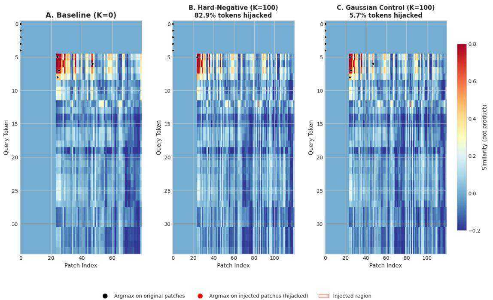
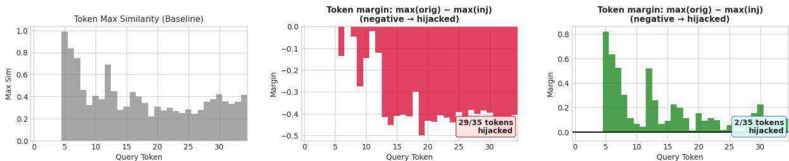

[1] O. Khattab, M. Zaharia, ColBERT: Efficient and effective passage search via contextualized late interaction over BERT, in: Proceedings of the 43rd International ACM SIGIR Conference on Research and Development in Information Retrieval, 2020, pp. 39–48. doi:10.1145/3397271. 3401075.   
[2] V. Karpukhin, B. Oğuz, S. Min, P. Lewis, L. Wu, S. Edunov, D. Chen, W. tau Yih, Dense passage retrieval for open-domain question answering, in: Proceedings of the 2020 Conference on Empirical Methods in Natural Language Processing (EMNLP), 2020, pp. 6769–6781. doi:10.18653/v1/2020. emnlp-main.550.   
[3] N. Reimers, I. Gurevych, Sentence-BERT: Sentence embeddings using siamese BERT-networks, in: Proceedings of the 2019 Conference on Empirical Methods in Natural Language Processing and the 9th International Joint Conference on Natural Language Processing (EMNLP-IJCNLP), 2019, pp. 3982–3992. doi:10.18653/v1/D19-1410.   
[4] K. Santhanam, O. Khattab, J. Saad-Falcon, C. Potts, M. Zaharia, ColBERTv2: Effective and efficient retrieval via lightweight late interaction, in: Proceedings of the 2022 Conference of the North American Chapter of the Association for Computational Linguistics: Human Language Technologies (NAACL), 2022, pp. 3715–3734. doi:10.18653/v1/2022.naacl-main.272.   
[5] K. Santhanam, O. Khattab, C. Potts, M. Zaharia, PLAID: An efficient engine for late interaction retrieval, in: Proceedings of the 31st ACM International Conference on Information & Knowledge Management (CIKM), 2022, pp. 1747–1756. doi:10.1145/3511808.3557325.   
[6] A. van den Oord, Y. Li, O. Vinyals, Representation learning with contrastive predictive coding, arXiv preprint arXiv:1807.03748 (2018).   
[7] C. Gini, Variabilità e mutabilità: contributo allo studio delle distribuzioni e delle relazioni statistiche. [Fasc. I.], Tipogr. di P. Cuppini, Bologna, 1912.   
[8] D. P. Kingma, J. Ba, Adam: A method for stochastic optimization, in: International Conference on Learning Representations (ICLR), 2015. URL: https://arxiv.org/abs/1412.6980.   
[9] M. Faysse, H. Sibille, T. Wu, ColQwen2.5-v0.2: A Qwen2.5-VL-based late-interaction retriever, https://huggingface.co/vidore/colqwen2.5-v0.2, 2024.   
[10] M. Faysse, H. Sibille, T. Wu, B. Omrani, G. Viaud, C. Hudelot, P. Colombo, ColPali: Efficient document retrieval with vision language models, in: International Conference on Learning Representations (ICLR), 2025.   
[11] Q. Macé, A. Loison, M. Faysse, ViDoRe benchmark V2: Raising the bar for visual retrieval, arXiv preprint arXiv:2505.17166 (2025).

  
Figure 2: Token–patch similarity heatmaps for a representative ColQwen2.5 example from ViDoRe biomedical retrieval. Left (Baseline, $K = 0$ ): Token maxima align with semantically relevant document patches. Middle (Hard-negative injection, $K = 1 0 0 \mathrm { { } } _ { , }$ ): Injected distractor patches redirect the majority of token-wise argmax selections into the injected region, resulting in ${ \sim } 8 3 \%$ token hijacking. Right (Gaussian control, $K = 1 0 0 _ { \cdot }$ ): Random noise produces minimal routing changes and low hijack rates. Black dots denote argmax positions on original patches; red dots denote argmax positions on injected distractor patches. The injected region is highlighted.

# A. Mechanistic Visualization of Spike Hijacking

To complement aggregate retrieval metrics, we provide a qualitative token–patch similarity visualization illustrating the spike hijacking mechanism observed in real-world experiments.

This visualization provides direct mechanistic evidence for the phenomenon quantified in Section 4.2: spike-based pooling routes token attention to high-similarity distractor patches, causing retrieval degradation, while soft aggregation avoids catastrophic token rerouting.
