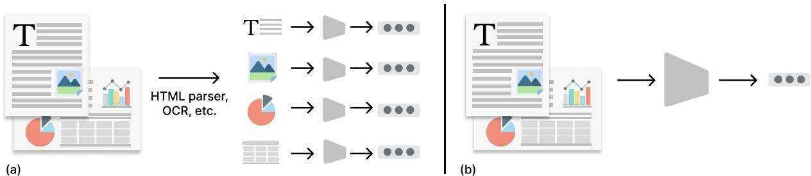
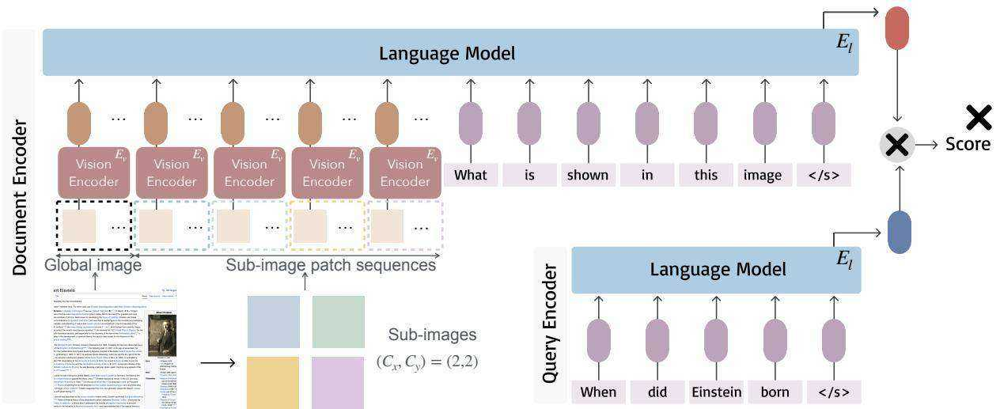
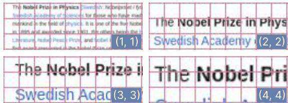
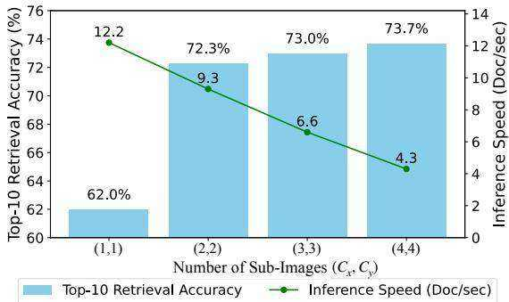
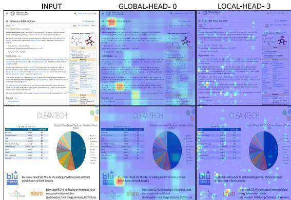
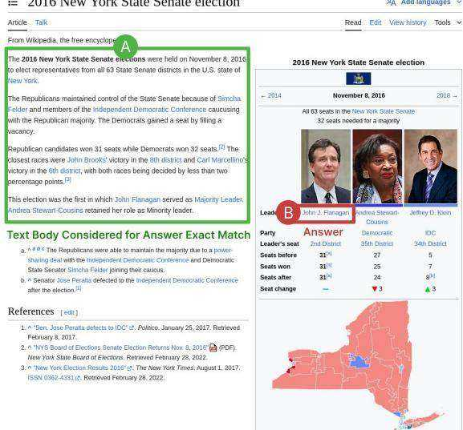
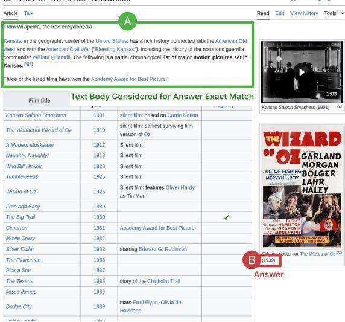

# Unifying Multimodal Retrieval via Document Screenshot Embedding

Xueguang Ma Sheng-Chieh Lin Minghan Li Wenhu Chen Jimmy Lin

David R. Cheriton School of Computer Science, University of Waterloo

{x93ma, s269lin, m692li, wenhuchen, jimmylin}@uwaterloo.ca

# Abstract

In the real world, documents are organized in different formats and varied modalities. Traditional retrieval pipelines require tailored document parsing techniques and content extraction modules to prepare input for indexing. This process is tedious, prone to errors, and has information loss. To this end, we propose Document Screenshot Embedding (DSE), a novel retrieval paradigm that regards document screenshots as a unified input format, which does not require any content extraction preprocess and preserves all the information in a document (e.g., text, image and layout). DSE leverages a large vision-language model to directly encode document screenshots into dense representations for retrieval. To evaluate our method, we first craft the dataset of Wiki-SS, a 1.3M Wikipedia web page screenshots as the corpus to answer the questions from the Natural Questions dataset. In such a text-intensive document retrieval setting, DSE shows competitive effectiveness compared to other text retrieval methods relying on parsing. For example, DSE outperforms BM25 by 17 points in top-1 retrieval accuracy. Additionally, in a mixed-modality task of slide retrieval, DSE significantly outperforms OCR text retrieval methods by over 15 points in $\mathrm { n D C G @ 1 0 . }$ . These experiments show that DSE is an effective document retrieval paradigm for diverse types of documents. Model checkpoints, code, and Wiki-SS collection are released at http://tevatron.ai.

# 1 Introduction

Information retrieval systems help users access external information from documents in varied modalities, including text, images, charts, and tables. As shown in Figure 1(a), existing document retrieval paradigms typically process these modalities separately. For example, traditional lexical retriever BM25 (Robertson and Zaragoza, 2009) or neural retrievers such as DPR (Karpukhin et al., 2020) rely on extracted text contents from documents. Recent multimodal retrieval (Yang et al., 2023; Wei et al., 2023) leverage both processed text and image units to broaden the scope of retrieval, thus supporting text-image tasks.

However, the existing retrieval paradigms lack a unified encoding process across modalities, leading to two underlying issues. Firstly, preprocessing is not a trivial effort. Specialized processing is required to handle various document types and content modalities, and they are often imperfect. For instance, HTML files in the wild can present significant complexity due to their varied structures, making it difficult for a single tool to parse all information accurately. Similarly, slides and PDFs often require OCR models to extract text and handle other content types like tables and figures separately (Huang et al., 2022; Tanaka et al., 2023). Managing these diverse modalities separately is tedious, and precisely dealing with the long-tailed document appearances in the real world is often impractical. Secondly, this process “breaks” the original appearance of the document, disrupting its visual context and layout integrity. The visual presentation of a document can convey essential information that is difficult to capture through content extraction alone. For example, in addition to the contents of texts and images, the size and position of these elements in a document may encode the importance of the information they contain (Xu et al., 2020; Huang et al., 2022).

To tackle the aforementioned issues, we introduce Document Screenshot Embedding (DSE), a new information retrieval paradigm that unifies the varied formats and modalities in a single form for direct document encoding and indexing: screenshots. In contrast to using various tools to extract texts and images from documents in different formats, screenshots are easy to obtain and all the information in the documents are visually preserved.

As illustrated in Figure 1(b), DSE directly encodes the screenshot of any given document into a dense representation through a large visionlanguage model. During search, a user’s query is encoded by a language model to locate the nearest document embeddings. We conduct empirical studies to demonstrate that DSE is effective for document retrieval. Specifically, we conduct experiments on two types of document retrieval settings: text-intensive and text-image-mixed. For the textintensive case, we collect 1.3 million Wikipedia web page screenshots as our corpus and fine-tune a large vision-language model as a bi-encoder to conduct dense retrieval on questions in the NQ dataset (Kwiatkowski et al., 2019). Experimental results show that DSE outperforms the traditional text-based retrieval method BM25 by 17 points in top-1 retrieval accuracy on NQ questions and is competitive with text-based dense retrieval methods in a text-oriented evaluation. This experiment indicates that DSE can sufficiently encode the textual information in a screenshot. As for the imagetext mixed setting, we use slide retrieval. We turn the existing SlideVQA (Tanaka et al., 2023) dataset into an open-domain retrieval setting, where models are required to retrieve relevant slides from a pool of $5 0 \mathrm { k }$ slides for given questions. Results show that DSE outperforms all text-based retrieval methods which rely on OCR (including BM25 and dense text retrieval) by over 15 points in $\mathrm { n D C G @ 1 0 }$ .

  
Figure 1: Comparison between (a) existing document retrieval paradigm and (b) our proposed paradigm. DSE bypasses the document parsing and content extraction process, directly encoding the original appearance of documents with multimodal contents into a dense representation for indexing

rately into dense semantic vectors in a bi-encoder architecture. The effectiveness of text dense retriever has been boosted in recent years by various training strategies such as data augmentation (Xiong et al., 2021; Lin et al., 2023; Xiao et al., 2023), pretraining (Izacard et al., 2021; Gao and Callan, 2022; Wang et al., 2023), distillation (Lin et al., 2021; Ren et al., 2021) and instruction tuning (Su et al., 2023; Asai et al., 2023). With the growth of large language models, finetuning an LLM-based text encoder demonstrated further improvement in both in-domain and out-domain retrieval effectiveness (Ma et al., 2024; Wang et al., 2024; Muennighoff et al., 2024; Lee et al., 2024).

Besides text retrieval, prior multi-modal retrieval studies (Wei et al., 2023; Koukounas et al., 2024) have explored retrieval across various combinations of text and image inputs for queries and documents. These approaches aim to bridge the gap between different modalities, enabling more comprehensive retrieval systems. Existing text and multi-modal retrieval works assume that the datasets are well preprocessed, where text and image data are carefully extracted and organized for model inputs. However, this is not always true in real-world scenarios where documents are often unstructured and diverse. In this work, we consider the document retrieval tasks that begin with the original look of documents.

# 2 Related Work

# 2.1 Neural Document Retrieval

Traditional document retrieval methods such as TF-IDF and BM25 (Robertson and Zaragoza, 2009) represent text as bag-of-words representations and conduct efficient search over an inverted index. Recent neural retrieval methods represented by DPR (Karpukhin et al., 2020), proposed to finetune pretrained neural networks such as BERT (Devlin et al., 2019) to encode query and document sepa-

# 2.2 Large Vision-Language Model

Large language models (LLMs) like GPT-4 (OpenAI, 2024) and LLaMA (Touvron et al., 2023), pre-trained on massive corpora and fine-tuned to follow user instructions, have shown success in various natural language generation tasks (Wei et al., 2022). Recent advancements have integrated vision capabilities into LLMs, enabling them to process both text and images simultaneously. Commercial models like GPT-4V (OpenAI, 2024) and open-source models such as LLaVA (Liu et al.,

2023) exhibit strong performance. Building upon LLaVA, recent works such as LLaVA-NEXT (Liu et al., 2024a), Idefics2 (Laurençon et al., 2024), and Phi-3-vision (Abdin et al., 2024) have further improved performance. They enable the processing of higher-resolution images and handle more challenging vision-language tasks, such as OCR (Liu et al., 2024a,b). Inspired by the capabilities of large vision-language models, our work pioneers its application in document retrieval tasks.

# 2.3 Document Retrieval Datasets

Commonly used text retrieval datasets such as MS MARCO (Bajaj et al., 2018), Wikipedia-NQ (Karpukhin et al., 2020), and BEIR (Thakur et al., 2021) are released in well-preprocessed text contents. Similarly, multi-modal retrieval datasets like AToMIC (Yang et al., 2023) and m-BEIR (Wei et al., 2023) have text and images extracted from their sources and separately stored.

On the other hand, existing datasets designed for question-answering tasks based on document images include DocVQA (Mathew et al., 2021), VisualMRC (Tanaka et al., 2021), WebSRC (Chen et al., 2021), and InfographicVQA (Mathew et al., 2022). These datasets contain document images paired with questions, focusing on reading comprehension evaluation where a ground truth document image is provided for each question. Besides, the image pools in these datasets are relatively small, comprising only a few thousand images.

Therefore, to fairly evaluate multi-modal document retrieval in a large scale, we craft a textintensive image corpus called Wiki-SS, containing 1.3 million Wikipedia page screenshots. Additionally, we convert SlideVQA (Tanaka et al., 2023) dataset, a visual QA dataset, into an open-domain slide retrieval dataset, consisting of 50K slides.

# 3 Method

# 3.1 Task Definition

Given a query $Q$ and a corpus $\mathcal { C }$ consisting of documents $\{ D _ { 1 } , D _ { 2 } , . . . , D _ { n } \}$ , the task of document retrieval is to identify the $k$ documents that are most relevant to the query $Q$ , with $k \ll n$ . This relevance is determined using a similarity metric $\mathrm { S i m } ( Q , D ) \in \mathbb { R }$ . Note that in this work, the screenshotted “document” is a complete information snippet (e.g. a web article, a PDF page). This is different from some of the previous retrieval work, where the term “document” denotes arbitrary information snippets like sentences or passages. For queries, we only consider the text inputs similar to the traditional search setting. We leave the exploration of handling image queries for future work.

# 3.2 Document Screenshot Embedding

We adopt a bi-encoder architecture for dense retrieval, where a document screenshot and user text query are encoded into dense vectors using a vision and text encoder, respectively. We can naively apply the vision and text encoders from CLIP (Radford et al., 2021) to our task; however, in our experiment, we observe that the vision encoder cannot encode screenshots with more fine-grained information; thus, we propose to use large vision language models as the document screenshot encoder.

Visual Encoder When a document screenshot $D$ is provided, it is first processed by a vision encoder $E _ { v }$ to generate a sequence of latent representations. The length of the sequence is determined by the image tokenizer of the vision encoder. We take clip-vit-large-patch $\scriptstyle | 4 - 3 3 6 ^ { 1 }$ as an example. Any given screenshot is first converted to an image with $3 3 6 \times 3 3 6$ pixels and then divided into $2 4 \times 2 4$ patches (i.e., 576 patches in total), each of which consists of $1 4 \times 1 4$ pixels. Each patch is flattened and mapped to a patch embedding with a trainable linear projection. The patch embeddings are encoded into latent representations with a vision encoder. However, if a screenshot contains many texts (e.g., Wikipedia webpage), the 576 patch latent embeddings may not capture the fine-grained textual information in the screenshot.

Vision Language Model To address the above issue, we leverage a large vision language model, Phi-3-vision,2 which uses the same image tokenizer from clip-vit-large-patch14-336 but can represent an image with more patches by cropping it into sub-images. For example, given a screenshot, we can choose to divide it into $( C _ { x } \times 2 4 ) \times ( C _ { y } \times 2 4 )$ patches. The given screenshot is converted to an image with $( C _ { x } \times 3 3 6 ) \times ( C _ { y } \times 3 3 6 )$ pixels and cropped into $C _ { x } \times C _ { y }$ sub-images, each of which has $3 3 6 \times 3 3 6$ pixels. Similarly, each sub-image is encoded into 576 patch latent representations independently. Note that Phi-3-vision further converts the whole screenshot into $3 3 6 \times 3 3 6$ pixels and encodes them into an additional 576 patch latent representations to capture the global information, resulting in $( C _ { x } \times C _ { y } + 1 ) \times 5 7 6$ patch latent representations in total, as depicted in left side of Figure 2. Also, every four patch latent representations are concatenated and projected into one embedding for language model inputs. This process yields $( C _ { x } \times { \bar { C } } _ { y } + 1 ) \times \frac { 5 7 6 } { 4 }$ patch latent embeddings as the input for the language model $E _ { l }$ . In Section 5.3, we will show that encoding a screenshot into more patch latent embeddings (increasing $C _ { x }$ and $C _ { y , }$ ) helps capture more fine-grained information in the screenshot but sacrifices screenshot document encoding efficiency.

  
Figure 2: Overview of DSE encoder architecture. DSE adopts a bi-encoder architecture, where the document tower encodes the document screenshot into dense vector by taking vision input and the query tower encodes the query by taking text input. Document and query encoders share the same language model.

The encoded patch latent embeddings are concatenated with a text prompt as the input to the subsequent language model: $ < s > < i m g >$ What is shown in this image? $? { < } / s > "$ . Here, the  token is a special placeholder token and is replaced by the sequence of patch latent embeddings from the vision encoder. To aggregate sequence information using a language model with uni-directional attention, following previous work in text retriever (Ma et al., 2024), we use the embedding of the end-ofsequence token ${ < } / { \mathrm { s } } { > }$ from the last hidden state as the document screenshot embedding:

$$
V _ { d } = E _ { l } ( E _ { v } ( D ) , \mathrm { p r o m p t ) [ - 1 ] }
$$

Contrastive Learning The similarity between the query and the document is computed as the cosine similarity between their embeddings:

$$
\mathrm { S i m } ( Q , D ) = { \frac { V _ { q } ^ { \top } V _ { d } } { \| V _ { q } \| \cdot \| V _ { d } \| } } .
$$

During training, our embedding model is optimized using the InfoNCE loss:

$$
\begin{array} { l } { { \displaystyle { \mathcal { L } } ( Q , D ^ { + } , D _ { \mathrm { N } } ) = - \log p ( D = D ^ { + } \mid Q ) } \ ~ } \\ { \displaystyle ~ = - \log \frac { \exp ( { \mathrm { S i m } ( Q , D ^ { + } ) } / \tau ) } { \displaystyle { \sum _ { i \in \{ D ^ { + } \} \cup D _ { N } } \exp ( { \mathrm { S i m } ( Q , D _ { i } ) } / \tau ) } } , } \end{array}
$$

where $D ^ { + }$ denotes the positive document. $D _ { \mathrm { N } }$ represents a set of negative documents that are irrelevant to the query $Q$ , including hard negatives and in-batch negatives. $\tau$ is a temperature parameter set to 0.02 in our experiments. Note that we only consider text queries, which are directly input to the language model using template f“<s>{query}</s>” and the last hidden state of ${ < } / s { > }$ is used as the query embedding, $V _ { q } = E _ { l } ( Q ) [ - 1 ]$ .

# 4 Experiment Setup

# 4.1 Web-Page Retrieval

Dataset We construct the Wiki-SS dataset, using the Selenium Python toolkit3 to access English Wikipedia pages through URLs and automatically take screenshots. The screenshots are taken with a window size of $9 8 0 \times 9 8 0$ pixels to ensure adequate coverage of the core content. The screenshot creation process is conducted over a span of four days, from May 20 to May 23, 2024. Note that storing the entire collection of Wikipedia screenshots would require over 2TB of storage in PNG format. In order to make Wiki-SS more manageable for research purposes, we downsize the corpus by filtering out the web pages which are considered “easy negative samples” for all the questions in the train, dev and test sets from Natural Questions (Kwiatkowski et al., 2019). Specifically, we perform BM25 search for each question to retrieve the top 50 documents over the text corpus. The retrieved documents are pooled together as our final corpus. Note that we concatenate each question and its corresponding ground truth answers as a query for BM25 search. Although BM25 is a relatively weak retriever, including the target answer in the query for lexical search ensuring that positive and hard negative documents for each question are included in the downsized corpus. As a result, we obtain a collection of 1,267,874 Wikipedia screenshots for our experiments.

To compare with text-based retrieval baselines, we create a text version Wikipedia collection which mirrors the collection of Wiki-SS. Given the significant updates and changes to Wikipedia pages over time, the existing Wikipedia dumps (Karpukhin et al., 2020; Izacard et al., 2024) cannot be used as a fair comparison. Thus, we re-process the Wikipedia text contents based on the May 20, 2024 dump4 using Wikipedia parsing tool mwparserfromhell. For each document in the text corpus, we use the first 500 words of each document, mirroring the corpus in Wiki-SS, where each screenshot covers only the first-page content. For more details, please see Appendix A.1.

Training Data We create the training data by taking the questions in the NQ train split as queries and using BM25 to retrieve the top-50 relevant documents over the text corpus for each question. A document candidate (either in screenshot or text) is considered positive when the corresponding text contains the answers for the question. Otherwise, the document is considered a hard negative candidate. We drop the training example if either the positive or negative candidate list is empty, resulting in 49,095 training examples of triplets of query, positive documents and hard negative documents.

Evaluation We evaluate the in-domain effectiveness of retrievers using the $3 { , } 6 1 0 \ \mathrm { N Q }$ test set questions. Consistent with previous practices in evaluating retrieval effectiveness on QA datasets (Karpukhin et al., 2020), we use top- $\mathbf { \nabla } \cdot \mathbf { k }$ retrieval accuracy as the metric. A question is considered correctly answered if one of the candidate documents contains an exact match of the answer string in the corresponding text content. The original NQ datasets contain both short answers and long answers for the questions (Kwiatkowski et al., 2019), we follow the same method for computing exact match accuracy as Karpukhin et al. (2020), where the short answers are the target.

# 4.2 Slide Retrieval

Dataset The original SlideVQA (Tanaka et al., 2023) data is designed for document visual question answering. It contains $1 4 . 5 \mathrm { k }$ QA pairs and 52k slide images in total. The images contain various text formats, layouts, and visual content such as plots and charts. Given a question, the original task is to select the most relevant slides among the same deck with up to 20 slides and then answer the question based on the selected slides. The document selection process is in the form of reranking and classification. In order to support the evaluation of document retrieval, we modify the SlideVQA to an open-domain retrieval task, where the task is to retrieve $k$ most relevant slide from the entire pool of slide images. After our processing (e.g. removing the slides that fail to download, and questions that do not have evidence slides available), SlideVQAopen contains 50,714 slide images (screenshots) in its corpus. We also create a corresponding textbased corpus for comparison with text retrievers using pytesseract OCR toolkit to extract text from every slide deck.

Training Data We create the training data based on the original train split of SlideVQA, the annotated evidence slides for a given question are considered positive documents, and the other slides within the same deck are considered as hard negative documents. This process leads to 10,290 training examples in total.

Evaluation We construct the SlideVQA-open evaluation set using the 2,136 questions in the test set of SlideVQA. We evaluate the models’ retrieval effectiveness using $\mathrm { n D C G } @ 1 0$ and Recall $@ 1 0$ . In the following sections, mentions of SlideVQA refer to the open-domain retrieval setup.

# 4.3 Implementation Details

We implement DSE by modifying the Tevatron toolkit (Gao et al., 2023), with the model initialized using Phi-3-vision (Abdin et al., 2024), one of the state-of-the-art open-source large vision-language models with 4 billion parameters. This model is recognized for its effective and efficient trade-off in performance. To train the model, we employ memory-efficient techniques such as LoRA (Hu et al., 2022), FlashAttention (Dao, 2024), and Deep-Speed (Rasley et al., 2020). The model is trained with a batch size of 128 for one epoch on Wikipedia webpage retrieval and trained with a batch size of 64 for two epochs for slide retrieval. The model weights are shared between the language models for document screenshot and query encoding. In both tasks, each training query is paired with one positive document and one hard negative document. We set $( C _ { x } , C _ { y } ) = ( 4 , 4 )$ by default; that is, the document screenshots are resized to $1 3 4 4 \times 1 3 4 4$ pixels and cropped into $4 \times 4$ sub-images. The training process is conducted on two A100 80GB GPUs. During inference, the embeddings are indexed using a Flat Faiss index (Douze et al., 2024) for exact nearest neighbor search.

<table><tr><td rowspan="2">Retriever</td><td rowspan="2">Document</td><td colspan="4">NQ</td><td colspan="2">SlideVQA-open</td></tr><tr><td>Top 1</td><td></td><td>Top 5 Top 10</td><td>Top 20</td><td>nDCG@10</td><td>Recall@10</td></tr><tr><td rowspan="4">BM25 DPR E5 Phi-3</td><td rowspan="4">Text</td><td>29.5</td><td>52.6</td><td>61.3</td><td>67.3</td><td>55.8</td><td>63.7</td></tr><tr><td>42.3</td><td>63.9</td><td>69.7</td><td>74.3</td><td>47.4</td><td>57.9</td></tr><tr><td>47.6</td><td>68.6</td><td>73.8</td><td>77.6</td><td>59.3</td><td>69.6</td></tr><tr><td>50.6</td><td>70.9</td><td>75.8</td><td>79.5</td><td>59.0</td><td>69.5</td></tr><tr><td>CLIP</td><td rowspan="2">Screenshot</td><td>35.1</td><td>57.7</td><td>64.8</td><td>71.2</td><td>61.7</td><td>74.7</td></tr><tr><td>DSE</td><td>46.2</td><td>68.5</td><td>73.7</td><td>77.6</td><td>75.3</td><td>84.6</td></tr></table>

Table 1: Supervised retrieval effectiveness comparison. DSE and CLIP directly encode document screenshots while the other text-based retrieval models encode the extracted text from documents.

# 4.4 Baselines

We compare DSE against the following document retrieval methods based on text input: (1) BM25: a traditional text retriever based on lexical representation. (2) DPR: we follow the same setting as the DPR work (Karpukhin et al., 2020), initializing dense retriever with BERT-base, and finetuning the model on our training data based on text input. (3) E5: similar to DPR, we finetune the unsupervised E5-base model (Wang et al., 2022), which has BERT further pretrained with contrastive learning based on web data. (4) Phi-3: we use the same model initialization and configuration as DSE but only fine-tune the component of the language model as a text-based dense retriever. Additionally, we compare the fine-tuned CLIP model, whose image encoder is also initialized by ViT-large (the same as DSE) but only supports a fixed length of patch sequence; i.e., $( C _ { x } , C _ { y } ) = ( 1 , 1 )$ . Please see

Appendix A.4 for the detailed hyper-parameters of DSE and baselines.

# 5 Experimental Results

# 5.1 Supervised Retrieval Effectiveness

Table 1 presents the models’ retrieval effectiveness in the supervised setting, where models are fine-tuned on NQ or SlideVQA training queries and evaluated on the corresponding evaluation set. For the Wikipedia webpage retrieval task, DSE demonstrates significant improvements over the traditional text-based retrieval method BM25. Specifically, DSE achieves $4 6 . 2 \%$ and $7 7 . 6 \%$ in top-1 and top-20 retrieval accuracy, which are 17 points and 10 points higher than BM25, respectively. This indicates that DSE can effectively encode text-intensive documents in the format of screenshots for retrieval. When compared with neural text retrieval methods, DSE outperforms smaller model DPR and performs on par with E5. Phi-3, which uses the same language model as DSE (with 4 billion parameters), achieves approximately 4 points higher top-1 retrieval accuracy than DSE. This suggests that existing vision language models still cannot fully capture the text content in a screenshot.

In the slide retrieval task, where the documents include a mix of text and visual content, we observe DSE significantly outperforms (i.e., over 15 points in both $\mathrm { n D C G } @ 1 0$ and Recall $@ 1 0$ ) all the text retrieval baselines that rely on OCR content extraction. This highlights the risk of information loss in the content extraction step, where OCR is only able to extract text content, thereby losing the visual elements of the documents. Notably, DPR, a neural retrieval method, fails to outperform BM25 in this task. This may be due to the varied layouts of slides, which pose additional challenges for text content extraction and result in noisy text input for text neural retrieval fine-tuning. By contrast, DSE bypasses the stage of text content extraction and directly encodes document screenshots, which preserves more information for retrieval.

Table 2: Zero-shot retrieval effectiveness comparison. Models are trained on Wiki-SS with NQ questions and evaluated on TriviaQA questions and slide retrieval task.   

<table><tr><td>Zero-Shot Retriever</td><td>TriviaQA Top 1 Top 10</td><td colspan="2">SlideVQA-open nDCG@10 Recall@10</td></tr><tr><td>BM25</td><td>47.4 71.0</td><td>55.8</td><td>63.7</td></tr><tr><td>DPR</td><td>37.3 65.5</td><td>29.5</td><td>39.7</td></tr><tr><td>E5</td><td>46.9 73.1</td><td>42.6</td><td>54.4</td></tr><tr><td>Phi-3</td><td>57.1</td><td>49.7</td><td>62.1</td></tr><tr><td>CLIP</td><td>37.3</td><td>65.6</td><td>61.6</td></tr><tr><td>DSE</td><td>50.3</td><td>75.2</td><td>48.4 64.0</td></tr></table>

Finally, DSE outperforms CLIP even though they use the same backbone of the vision transformer to digest the document screenshots. For NQ, DSE surpasses CLIP by 11.1 points in top-1 accuracy, and for SlideVQA, DSE achieves 12.6 points higher in $\mathrm { n D C G } @ 1 0$ . We contribute the effectiveness gain to the large vision-language model encoder, which as we will show in Section 5.3, has the capacity to handle more fine-grained information in a screenshot and possibly enhanced semantic understanding.

To further explore the integration of text and visual information, we examined the hybrid retrieval results combining text-based and screenshot-based methods, as shown in Appendix A.2. The results indicate that combining CLIP with text-based models yields notable performance improvements in the SlideVQA task. However, DSE still outperforms such case in mixed modality scenario, demonstrating its capability to encode both fine-grained visual details and textual content directly in a single pipeline. As the hybrid approach is not a single, unified pipeline that directly encodes the document input, we leave the hybrid results in Appendix.

# 5.2 Zero-Shot Retrieval Effectiveness

In this section, we further evaluate the generalization capability of DSE. Specifically, we apply the models fine-tuned on NQ questions to retrieve answers for TriviaQA questions (Joshi et al., 2017) over the Wiki-SS (or the corresponding Wiki text) corpus, assessing their ability to generalize across different query distributions. Additionally, we evaluate the NQ fine-tuned models on the SlideVQA dataset to examine cross-task generalization.

  
Figure 3: A snapshot of a Wikipedia webpage divided by different numbers of patches (red small squares). As the number of patches increases, each patch can capture more fine-grained text information in the screenshot. $( C _ { x } , C _ { y } )$ means the image are divided into $C _ { x } \times C _ { y }$ sub-images; then converted into $( C _ { x } \times 2 4 ) \times ( C _ { y } \times 2 4 )$ patches. See more detail in Section 3.2 and Figure 2.

As shown in Table 2, on TriviaQA, the text retriever based on LLM (i.e., Phi-3) achieves the best zero-shot effectiveness with a top-1 retrieval accuracy of $5 7 . 1 \%$ . Both DPR and CLIP show lower zero-shot effectiveness, being outperformed by BM25 by approximately 10 points. In contrast, DSE achieves a top-1 retrieval accuracy of $5 0 . 3 \%$ which is 3 points higher than BM25. This indicates that DSE has relatively good zero-shot effectiveness across different query distributions but with room for improvement.

On the slide retrieval task, we observe that DSE shows the best effectiveness among all. Specifically, DSE outperforms BM25 by 8 points in terms of $\mathrm { n D C G } @ 1 0$ , while all the other text-based methods underperform BM25. This result shows that even though DSE is only fine-tuned on the Wikipedia webpage retrieval task, where text is the main content, it is still able to encode document information beyond text. This demonstrates the potential of DSE in handling diverse document types and tasks without needing task-specific training.

# 5.3 Impacts of Patch Sequence Length

As discussed in Section 3.2, each screenshot is cropped into $C _ { x } \times C _ { y }$ sub-images and encoded as a sequence of patches. Thus, increasing the number of crops yields a more lengthy patch input sequence, which incurs more computation cost for document encoding. On the other hand, increasing the number of crops results in patches with more fine-grained visual information, as illustrated in Figure 3. In the setting of $( C _ { x } , C _ { y } ) = ( 1 , 1 )$ , each patch contains multiple words, while in the setting of $( C _ { x } , C _ { y } ) = ( 4 , 4 )$ , a single letter is covered by two patches. This leads to a trade-off between the efficiency and quality of document encoding. We study this trade-off by training DSE with different numbers of crops and evaluate the corresponding retrieval effectiveness and document encoding speed (Doc/sec) on the Wiki-SS task for NQ questions.

  
Figure 4: Trade-off between effectiveness and efficiency of DSE with varying numbers of crops for input images. The inference speed is measured on a single H100 GPU with BF16 precision and FlashAttention enabled.

We plot the efficiency and effectiveness in Figure 4. When cropping the image into $4 \times 4$ subimages for more fine-grained patch encoding, the top-10 retrieval accuracy increases from $6 2 . 0 \%$ to $7 3 . 7 \%$ , indicating that finer granularity helps the model better understand and encode the document screenshot. However, this comes at the cost of computational efficiency. As the number of sub-images increases, the sequence length of the model’s input grows, resulting in longer encoding times. The document encoding speed decreased from 12.2 documents per second with $1 \times 1$ sub-images to 4.3 documents per second with $4 \times 4$ sub-images as input. Finally, the experiment suggests that using $( C _ { x } , C _ { y } ) = ( 2 , 2 )$ or $( 3 , 3 )$ offers a good trade-off between retrieval effectiveness and computational efficiency of document encoding.

# 5.4 Analysis

# 5.4.1 Case Study

We conducted a case study to illustrate whether the fine-tuned embeddings effectively utilize the core semantic information in the screenshots. Figure 5 presents the attention visualization of two examples from Wiki-SS and SlideVQA. We used the Phi-3- vision model fine-tuned on NQ as the backbone and extracted the multi-head attention of the last token embedding to the image patches at the final layer. The image patches contain both global and local features: Global features are tokenized from the resized full image input $( 3 3 6 \times 3 3 6 )$ , while local features are derived from crops when the image is resized to $1 3 4 4 \times 1 3 4 4$ and then cropped into $4 \times 4$ sub-images before encoding. For both examples, the global attention heads appear to focus on general information, such as images, logos, titles, and sections. In contrast, the local attention heads concentrate on finer details in the screenshots, such as individual letters and keywords, which are crucial for retrieval. This qualitative evidence suggests that DSE can effectively capture information from various modalities within the screenshots.

  
Figure 5: Case study on two examples in Wikipedia and SlideQA. We visualize the multi-head attention from the fine-tuned embedding to the image patches at the last layer. GLOBAL-HEAD is the attention head to the coarse image features $( 3 3 6 \times 3 3 6 )$ , while the LOCAL-HEAD is the attention head to more fine-grained image features after cropping $1 6 { \times } 3 3 6 { \times } 3 3 6$ ).

# 5.4.2 Importance of Visual Integration

In the mixed-modality retrieval task, both content extraction errors and the lack of visual context are inherent challenges in OCR-based methods, which our proposed DSE method can overcome. We conducted an error analysis of failure cases from the Phi-3 text retriever in the SlideVQA task, where DSE retrieved relevant documents within the top 10 results, but Phi-3 did not. We categorized the errors into two groups: (1) documents that could be answered using text alone, suggesting OCR errors, and (2) documents requiring additional visual context, indicating that missing the visual elements led to retrieval failures. In our manual review of 50 cases, 22 could be resolved with correct text extraction, while 28 required visual context. This analysis supports our claim that traditional OCR-based methods suffer from content extraction errors and loss of visual integration, while DSE successfully addresses these issues by integrating all modalities.

# 5.4.3 False-Negatives in Wiki-SS

As mentioned in Section 4.1, to evaluate DSE, we examine whether there are any exact matches of the

Question: who is the new york state senate majority leader Answers: ['John J. Flanagan']

  
Figure 6: Examples of Top-1 retrieval results from DSE for NQ test set questions that are being considered “irrelevant” because an exact match for the answer was not found in the corresponding extracted text body. However, the exact answer can be found in the tables covered by the screenshots.

Question: when was the movie the wizard of oz made Answers: ['August 25 , 1939', '1939']

answer string in the retrieved documents. However, such evaluation only calculates the exact answer matches within the main text body. This could result in an underestimation of DSE’s effectiveness if the answer appears in the content beyond the main text body, such as images, captions, or tables. To investigate this potential underestimation, we randomly select 50 questions from the test set of NQ where DSE’s top-1 retrieved documents are judged irrelevant while the purely text-based Phi-3 counter-part deems them positive. We manually examine the corresponding screenshots retrieved by DSE and discover that 7 out of 50 samples are actually false negatives. In other words, the exact answer in these cases could be found in the image captions or tables within the screenshots as illustrated in Figure 6. This indicates DSE’s capability to capture information in other areas besides the main texts that contain important clues for the document representation.

DSE outperforms traditional retriever and OCRbased methods on varied document retrieval tasks, such as webpage and slide retrieval. This highlights the potential of DSE to improve document retrieval in a range of real-world applications.

By integrating DSE with a large vision-language model (VLM) generator, it leads to a promising visual-based retrieval augmented generation (V-RAG) paradigm. In this paradigm, DSE retrieves document screenshots, which the VLM generator can process directly for generation, without needing separate text or image extraction. This creates an end-to-end document intelligence system that eliminates the need for content extraction. We hope our work opens future research into improving V-RAG with better retrieval methods, enabling more efficient and seamless multi-modal information retrieval and generation.

# 7 Limitations

# 6 Conclusion

In this paper, we introduce DSE, a novel information retrieval paradigm that leverages screenshots to simplify the document retrieval process. By circumventing traditional preprocessing steps and directly encoding documents with a vision-language model, DSE offers a unified approach to handling varied document modalities. We empirically show that

This work has several limitations that warrant further exploration. Firstly, while we evaluated DSE on Wikipedia webpage retrieval and slide retrieval datasets, there remains a gap in its effectiveness for more general-purpose document retrieval tasks, such as those involving PDFs or web pages with highly varied structures and content. Future work can consider multi-task training across diverse document types and content. Additionally, combining our method with extracted text and image contents could make DSE more versatile for general retrieval tasks. Secondly, our current approach relies solely on supervised fine-tuning. However, research in text retrieval has shown that contrastive pretraining can significantly improve retriever effectiveness. Investigating whether such pretraining methods can enhance DSE’s performance is a promising direction for future research. Thirdly, the reliance on visual data introduces challenges in environments where such data is of low quality. Blurry or low-resolution screenshots may degrade the effectiveness of DSE. Conversely, processing very high-resolution images can reduce computational efficiency. We leave further explore the balance of image quality and computational efficiency as future work.

# Ethics Statement

This work complies with the ACL Ethics Policy. We declare that there are no ethical issues in this paper, to the best of our knowledge.

# Acknowledgments

We sincerely thank Xilun Chen, Xinyu Shi, Xinyu Zhang, Dawei Zhu, and the anonymous reviewers for their invaluable feedback and insightful suggestions. We also extend our appreciation to Jheng-Hong Yang, Dongfu Jiang, and Yobo Wang for their helpful discussions on technical questions. This research was supported in part by the Natural Sciences and Engineering Research Council (NSERC) of Canada and Microsoft via the Accelerating Foundation Models Research program.

Zeqi Lin, Chong Luo, Piyush Madan, Matt Mazzola, Arindam Mitra, Hardik Modi, Anh Nguyen, Brandon Norick, Barun Patra, Daniel Perez-Becker, Thomas Portet, Reid Pryzant, Heyang Qin, Marko Radmilac, Corby Rosset, Sambudha Roy, Olatunji Ruwase, Olli Saarikivi, Amin Saied, Adil Salim, Michael Santacroce, Shital Shah, Ning Shang, Hiteshi Sharma, Swadheen Shukla, Xia Song, Masahiro Tanaka, Andrea Tupini, Xin Wang, Lijuan Wang, Chunyu Wang, Yu Wang, Rachel Ward, Guanhua Wang, Philipp Witte, Haiping Wu, Michael Wyatt, Bin Xiao, Can Xu, Jiahang Xu, Weijian Xu, Sonali Yadav, Fan Yang, Jianwei Yang, Ziyi Yang, Yifan Yang, Donghan Yu, Lu Yuan, Chengruidong Zhang, Cyril Zhang, Jianwen Zhang, Li Lyna Zhang, Yi Zhang, Yue Zhang, Yunan Zhang, and Xiren Zhou. 2024. Phi-3 technical report: A highly capable language model locally on your phone. arXiv:2404.14219.

Akari Asai, Timo Schick, Patrick Lewis, Xilun Chen, Gautier Izacard, Sebastian Riedel, Hannaneh Hajishirzi, and Wen-tau Yih. 2023. Task-aware retrieval with instructions. In Findings of the Association for Computational Linguistics: ACL 2023, pages 3650– 3675, Toronto, Canada. Association for Computational Linguistics.

Payal Bajaj, Daniel Campos, Nick Craswell, Li Deng, Jianfeng Gao, Xiaodong Liu, Rangan Majumder, Andrew McNamara, Bhaskar Mitra, Tri Nguyen, Mir Rosenberg, Xia Song, Alina Stoica, Saurabh Tiwary, and Tong Wang. 2018. MS MARCO: A human generated machine reading comprehension dataset. arXiv:1611.09268.

Xingyu Chen, Zihan Zhao, Lu Chen, JiaBao Ji, Danyang Zhang, Ao Luo, Yuxuan Xiong, and Kai Yu. 2021. WebSRC: A dataset for web-based structural reading comprehension. In Proceedings of the 2021 Conference on Empirical Methods in Natural Language Processing, pages 4173–4185, Online and Punta Cana, Dominican Republic. Association for Computational Linguistics.