# ViDoRe V3: A Comprehensive Evaluation of Retrieval Augmented Generation in Complex Real-World Scenarios

António Loison\* † Quentin Macé∗1,3 Antoine Edy∗1   
Victor Xing1 Tom Balough2 Gabriel Moreira2 Bo Liu2 Manuel Faysse3† Céline Hudelot3 Gautier Viaud1   
1Illuin Technology 2NVIDIA 3CentraleSupélec, Paris-Saclay {quentin.mace, antoine.edy, gautier.viaud}@illuin.tech‡

# Abstract

Retrieval-Augmented Generation (RAG) pipelines must address challenges beyond simple single-document retrieval, such as interpreting visual elements (tables, charts, images), synthesizing information across documents, and providing accurate source grounding. Existing benchmarks fail to capture this complexity, often focusing on textual data, single-document comprehension, or evaluating retrieval and generation in isolation. We introduce ViDoRe V3, a comprehensive multimodal RAG benchmark featuring multi-type queries over visually rich document corpora. It covers 10 datasets across diverse professional domains, comprising 26,000 document pages paired with 3,099 human-verified queries, each available in 6 languages. Through 12,000 hours of human annotation effort, we provide high-quality annotations for retrieval relevance, bounding box localization, and verified reference answers. Our evaluation of state-of-the-art RAG pipelines reveals that visual retrievers outperform textual ones, late-interaction models and textual reranking substantially improve performance, and hybrid or purely visual contexts enhance answer generation quality. However, current models still struggle with non-textual elements, open-ended queries, and fine-grained visual grounding. To encourage progress in addressing these challenges, the benchmark is released under a commercially permissive license1.

# 1 Introduction

Retrieval-Augmented Generation (RAG) (Lewis et al., 2021) has become the dominant paradigm for knowledge-intensive NLP tasks (Gao et al., 2024; Fan et al., 2024). Yet practical deployments introduce complexities that academic benchmarks often overlook when focusing on singledocument textual retrieval. First, documents encode critical information in visual elements such as tables, charts, and images designed for human interpretation, which text-only pipelines often ignore (Abootorabi et al., 2025; Cho et al., 2024a). Second, user queries often require open-ended synthesis, comparison, and reasoning over scattered information, not simple factoid lookup (Tang and Yang, 2024; Conti et al., 2025; Thakur et al., 2025). Third, trustworthy systems must ground responses to specific source locations (e.g., bounding boxes), to mitigate hallucinations (Gao et al., 2023; Ma et al., 2024b).

  
Figure 1: ViDoRe V3 sample. Each query is annotated with the relevant pages, a document-grounded answer, bounding boxes localizing supporting evidence and modality labels for each bounding box. Documents are provided in image, text and PDF formats.

Existing benchmarks leave these requirements only partially addressed. Early Visual Document Understanding (VDU) benchmarks focus on singlepage comprehension, ignoring the complexity of large document corpora (Mathew et al., 2021b). Recent retrieval-centric benchmarks do not evaluate generation quality and grounding (Faysse et al., 2025; Günther et al., 2025). Some multimodal datasets attempt to bridge this gap but rely on extractive, short-answer tasks that fail to exercise complex reasoning (Cho et al., 2024b), or lack multilingual diversity and fine-grained visual grounding (Peng et al., 2025).

To address these limitations, we introduce ViDoRe V3, a benchmark designed for complex and realistic end-to-end RAG evaluation on visually rich document corpora. Our contributions are:

1. A Human Annotation Methodology for Realistic Queries We propose an annotation protocol for generating diverse queries and fine-grained query-page annotations. By restricting annotator access to document content during query formulation, we capture authentic search behaviors and mitigate bias toward simple extractive queries. Vision-Language Model (VLM) filtering combined with human expert verification enables efficient, highquality annotation at scale.

2. The ViDoRe V3 Benchmark Applying this methodology to 10 industry-relevant document corpora, we build ViDoRe V3, a multilingual RAG benchmark comprising 26,000 pages and 3,099 queries, each available in 6 languages. Two datasets are held out as a private test set to mitigate overfitting. The benchmark is fully integrated into the MTEB ecosystem and leaderboard2 (Muennighoff et al., 2023), and the public datasets are released under a commercially permissive license.

3. Comprehensive Evaluation and Insights Leveraging our granular annotations, we benchmark state-of-the-art models on (i) retrieval accuracy by modality and language, (ii) answer quality across diverse retrieval pipeline configurations, and (iii) visual grounding fidelity. Our analysis surfaces actionable findings for RAG practitioners.

# 2 Related Work

Component-Level Benchmarks (VDU and Retrieval) VDU has traditionally relied on singlepage datasets like DocVQA (Mathew et al., 2021b), alongside domain-specialized variants (Mathew et al., 2021a; Zhu et al., 2022; Wang et al., 2024). These ignore the multi-page context inherent to RAG. Recent work evaluating bounding-box source grounding (Yu et al., 2025b) proposes singlepage and multi-page tasks but does not address the retrieval component. Conversely, the emergence of late-interaction visual retrievers (Ma et al., 2024a; Faysse et al., 2025; Yu et al., 2025a; Xu et al., 2025) spurred the creation of retrieval-centric visual benchmarks like Jina-VDR (Günther et al., 2025) and ViDoRe V1&V2 (Faysse et al., 2025; Macé et al., 2025), but none of these benchmarks jointly evaluate retrieval and answer generation.

End-to-End Multimodal RAG While recent textual RAG benchmarks now capture complex user needs like reasoning or summarizing (Thakur et al., 2025; Tang and Yang, 2024; Su et al., 2024), multimodal evaluation often remains limited to single page queries (Faysse et al., 2025). Multi-page datasets like DUDE (Van Landeghem et al., 2023), M3DocRAG (Cho et al., 2024a), ViDoSeek (Wang et al., 2025) or Real-MM-RAG (Wasserman et al., 2025) prioritize extractive retrieval, lacking the diversity of queries encountered in realistic settings. UniDocBench (Peng et al., 2025) represents a concurrent effort that similarly addresses diverse query types and provides comparative evaluation across multiple RAG paradigms. While this benchmark offers valuable contributions, it relies on synthetically generated queries via knowledge-graph traversal, is restricted to English documents, and constrains grounding annotations to parsed document elements. In contrast, our benchmark offers several complementary strengths: fully human-verified annotations, a cross-lingual setup, free-form bounding box annotations, and a more systematic evaluation of individual visual RAG pipeline components.

# 3 Benchmark Creation

We design the benchmark to mirror the diversity of information retrieval situations in large-scale realistic environments. To enable pipeline-agnostic evaluation of the 3 core RAG components (retrieval, generation and grounding), while avoiding limitations of synthetic benchmarks, we employ a rigorous three-stage human-in-the-loop annotation process involving document collection, query generation and grounded query answering (Figure 2).

# 3.1 Document Collection

We curate 10 diverse corpora by manually selecting openly-licensed documents from governmental, educational, and industry sources, focusing on English and French documents (7 and 3 corpora respectively). The corpora span Finance, Computer Science, Energy, Pharmaceuticals, Human

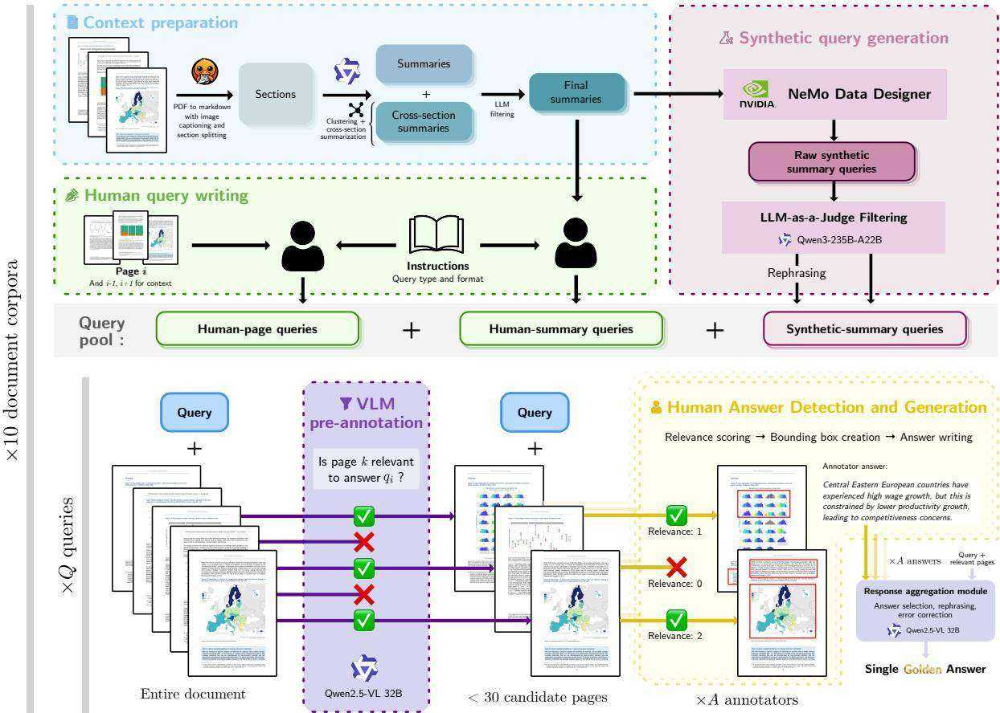  
Figure 2: Overview of the benchmark creation process. Queries are sourced from 3 streams: human extractive (using raw pages), human blind contextual (using summaries to mitigate extractive bias), and synthetic blind contextual. For each query, a VLM pre-filtered subset of candidate pages is labeled by 1–3 human annotators that perform relevance scoring, bounding box localization and answer generation. A final response aggregation combines annotator answers into a single answer.

Resources, Industrial Maintenance, Telecom, and Physics. Each features domain-specific terminology and document structures representative of realistic retrieval tasks (details in Table 6).

# 3.2 Query Generation

Query Taxonomy To evaluate document visual retrieval systems across diverse realistic scenarios, we develop a query taxonomy with two orthogonal dimensions: Query Type, defining the user’s information need, and Query Format, describing the query’s syntactic structure. This dual-axis classification enables more nuanced performance analysis than benchmarks focusing solely on interrogative extractive queries. We define 7 Query Types: openended, extractive, numerical, multi-hop, comparecontrast, boolean, and enumerative, and 3 Query Formats: question, keyword, and instruction.

Context Preparation We further ensure query diversity by pulling summaries from a heterogeneous set of contexts during the generation process. Two types of input contexts are used: specific document sections that target local information retrieval and cross-section summaries that target multi-document context retrieval. These summaries are produced through a refined process inspired by ViDoRe V2 (Macé et al., 2025). First, the text is extracted from PDFs using Docling (Auer et al., 2024) along with image descriptions. Then, summaries are generated with Qwen3- 235B-Instruct (Qwen Team, 2025) from each document section. They are clustered to group similar summaries together using Qwen3-Embedding-0.6B (Zhang et al., 2025) as embedder, UMAP (McInnes et al., 2020) for dimension reduction and HDBSCAN (Campello et al., 2013) for clustering. Additionally, cross-section summaries are produced by synthesizing the summaries of 2 to 3 randomly selected sections per cluster. From this pool of summaries, a final subset is curated to maintain a strict balance between single-section and cross-section summaries. The selection also ensures an even distribution across section modalities (text, images, and tables) as defined by the Docling element classification.

Synthetic Query Generation Queries are generated from the summaries using a first synthetic generation pipeline based on Qwen3-235B. For each summary, a prompt is constructed by sampling a query type and format at random, together with variable attributes such as length and difficulty, in order to promote diversity. The generated queries are subsequently evaluated by the same LLM acting as an automatic judge, which filters outputs according to 4 criteria: information richness, domain relevance, clarity and adherence to query type/format. Finally, $50 \%$ of the retained queries are rephrased to further enhance linguistic variance. This pipeline is implemented using NeMo Data Designer (NeMo Data Designer Team, 2025) to facilitate generation scaling.

Human Query Writing Human annotators are provided 2 kinds of contexts: synthetic summaries or specific PDF pages. They are tasked with generating one query following a specific query type and format and one query of their choice that is most adapted to the context provided.

# 3.3 Answer Detection and Generation

Queries are filtered and linked to relevant pages using a hybrid pipeline of VLM pre-filtering and human annotation. It is followed by human answer annotation and visual grounding.

Query-Page Linking Given the scale of our corpora, manual verification of each page relevance for each query is intractable. We therefore adopt a twostage annotation pipeline. First, Qwen2.5-VL-32B-Instruct (Bai et al., 2025) pre-filters candidate pages by assessing whether each page image is relevant to the query. Queries whose answers span more than 30 flagged pages are discarded. Human annotators then review the remaining query-page pairs, evaluating query quality and rating page relevance on a three-point scale (Not Relevant, Critically Relevant, Fully Relevant). We selected Qwen2.5-VL-32B-Instruct for its high recall, prioritizing coverage over precision and leaving final relevance judgments entirely to human annotators (see Appendix G for details and distributional validation).

Relevant Page Selection To ensure annotation quality, each task is completed by multiple annotators and reviewed by annotation supervisors. Since

VLM pre-filtering biases the distribution toward relevant pages, we report Gwet’s AC2, as it remains stable under prevalence skew, at 0.760 (see Section D for dataset-level breakdowns). Given this strong but imperfect agreement, we implement a tiered review process: extractive queries require at least one annotator and one reviewer, while more complex non-extractive queries require at least two annotators and one reviewer. A page is retained as relevant if marked by either (i) one annotator and one reviewer, or (ii) at least two annotators.

Answer Generation For each selected query, annotators were tasked with writing an answer based on the pages they marked as relevant. Given that different annotators might have different answer interpretations and tend not to be exhaustive in their answers, we use Qwen2.5-VL-32B-Instruct to generate a final answer based on the relevant page images marked by the annotators and their answers. To validate that this aggregation faithfully preserves annotator intent, we evaluated the VLMaggregated answer against individual annotator responses using a GPT-5.2 judge to assess factual consistency. The aggregated answer matched the exact informational content (with minor paraphrasing) of at least one annotator’s response in $8 6 . 3 \%$ of cases, confirming the VLM predominantly acts as a selector. For the remaining $1 3 . 7 \%$ of divergent cases, manual review of a random subset showed the aggregated answer was judged superior in most cases, either by merging complementary information from two incomplete responses or by correcting verifiable factual errors in individual annotations.

Bounding Boxes and Modality Types For each relevant page, annotators delineate bounding boxes around content supporting the query and attribute a modality type to each bounding box: Text, Table, Chart, Infographic, Image, Mixed or Other. Because multiple valid interpretations of bounding boxes can exist, we perform a consistency study to evaluate inter-annotator agreement and establish a human performance upper bound for the task.

We compute inter-annotator agreement on the subset of query-page pairs labeled by two or three annotators. For each annotator, we merge all their bounding boxes into a single zone. We then compare zones across annotators by measuring pixellevel overlap, reporting Intersection over Union (IoU) and F1 score (Dice coefficient). When three annotators label the same sample, we average over all pairwise comparisons.

Across all 10 datasets, we observe an average IoU of 0.50 and F1 of 0.60. These moderate agreement scores reflect the inherent subjectivity of the task: annotators typically agreed on the relevant content but differed in granularity (Appendix J), with some marking tight bounds around specific content while others included surrounding context. Section 4.3 describes how our evaluation methodology accounts for this ambiguity and how model scores should be interpreted relative to this human ceiling.

Quality Control The annotation was conducted by a curated pool of 76 domain-qualified experts with native-level language proficiency. Quality control was performed by 13 senior annotators with enhanced domain knowledge and extensive annotation experience. Detailed protocols regarding the annotator pool and training are provided in Appendix C.

# 3.4 Final Query Distribution

We conducted a final human review to remove lowquality queries and resolve labeling ambiguities. Figure 3 shows the resulting distribution. Extractive queries predominate due to human annotator preference, followed by open-ended queries from targeted sampling. Multi-hop queries were the hardest to scale, suggesting a need for dedicated pipelines. Figure 4 details page modalities; while text is most prevalent, visual elements like tables, charts, and infographics are well-represented.

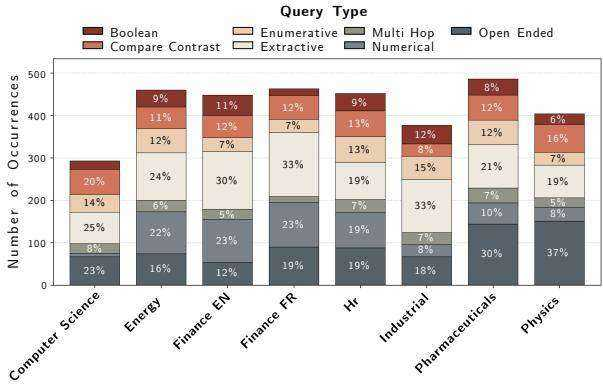  
Figure 3: Query Type Distribution per Domain

# 3.5 Dataset Release and Distribution

We extend the benchmark to rigorously assess cross-lingual retrieval. While source documents are maintained in English and French, we use Qwen3-235B-Instruct to provide translations in 6 languages: English, French, Spanish, German, Italian, and Portuguese. This configuration challenges models to bridge the semantic gap between the query language and the document language, a critical requirement for modern RAG systems.

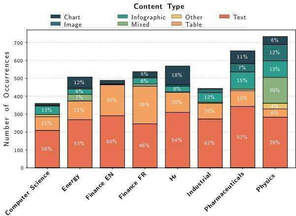  
Figure 4: Content Type Distribution per Domain

Finally, to ensure the integrity of evaluation and mitigate data contamination (which was shown to be a major preoccupation for Information Retrieval (Liu et al., 2025)), we adopt a split-release strategy. 8 datasets are made public to facilitate research, while 2 are retained as private hold-out sets. This enables blind evaluation, ensuring that performance metrics reflect true generalization rather than overfitting to public samples.

# 4 Experiments and Results

Using our benchmark, we conduct extensive evaluations across all 3 components of RAG pipelines. We assess textual and visual retrievers and rerankers on retrieval performance, evaluate leading VLMs and LLMs on their ability to generate accurate answers from various retrieved contexts, and test VLMs on bounding box generation for visual grounding. From these results, we compile practical insights for RAG practitioners.

# 4.1 Retrieval

We evaluate a large panel of visual and textual retrievers on page-level retrieval ability. Visual retrievers are given page images, while textual retrievers process the Markdown text of each page processed by the NeMo Retriever extraction service3 (NVIDIA Ingest Development Team,

Table 1: Retrieval performance $\mathbf { ( N D C G } @ \mathbf { 1 0 ) }$ across the benchmark. Best results per category in bold. ⋆: single-vector models. Following MTEB conventions, the average score is a macro-average over all datasets. Full model names and references are found in Table 8.   

<table><tr><td></td><td></td><td colspan="7">English Datasets</td><td colspan="3">French Datasets</td><td></td></tr><tr><td>Model</td><td>Size (B)</td><td>C.S.</td><td>Nucl.</td><td>Fin.</td><td>Phar.</td><td>H.R.</td><td>Ind.</td><td>Tel.</td><td>Phys.</td><td>Ener.</td><td>Fin.</td><td>Avg.</td></tr><tr><td>Textual Retrievers</td><td></td><td></td><td></td><td></td><td></td><td></td><td></td><td></td><td></td><td></td><td></td><td></td></tr><tr><td>Qwen3-8B</td><td>8</td><td>71.7</td><td>39.0</td><td>49.4</td><td>59.2</td><td>47.6</td><td>40.4</td><td>62.8</td><td>45.6</td><td>58.9</td><td>35.8</td><td>51.0</td></tr><tr><td>Jina-v4</td><td>3</td><td>64.3</td><td>44.3</td><td>48.4</td><td>54.9</td><td>52.8</td><td>38.4</td><td>56.3</td><td>43.6</td><td>60.1</td><td>41.3</td><td>50.4</td></tr><tr><td>LFM2-350M</td><td>0.35</td><td>63.5</td><td>37.8</td><td>39.0</td><td>56.4</td><td>43.5</td><td>34.4</td><td>56.9</td><td>41.8</td><td>47.0</td><td>28.2</td><td>44.9</td></tr><tr><td>Qwen3-0.6B*</td><td>0.6</td><td>66.4</td><td>32.8</td><td>42.7</td><td>50.6</td><td>37.7</td><td>31.6</td><td>55.7</td><td>43.3</td><td>51.3</td><td>25.8</td><td>43.8</td></tr><tr><td>BGE-M3</td><td>0.57</td><td>58.0</td><td>30.2</td><td>39.8</td><td>52.0</td><td>42.4</td><td>28.5</td><td>51.6</td><td>35.9</td><td>49.8</td><td>25.2</td><td>41.3</td></tr><tr><td>BM25S</td><td>-</td><td>28.7</td><td>17.4</td><td>17.6</td><td>27.3</td><td>12.8</td><td>15.6</td><td>33.3</td><td>14.8</td><td>21.9</td><td>14.0</td><td>20.3</td></tr><tr><td>Visual Retrievers</td><td></td><td></td><td></td><td></td><td></td><td></td><td></td><td></td><td></td><td></td><td></td><td></td></tr><tr><td>ColEmbed-3B-v2</td><td>3</td><td>77.1</td><td>50.7</td><td>64.2</td><td>66.0</td><td>62.3</td><td>51.7</td><td>69.7</td><td>47.0</td><td>64.9</td><td>44.4</td><td>59.8</td></tr><tr><td>Jina-v4</td><td>3</td><td>71.8</td><td>50.0</td><td>59.3</td><td>63.1</td><td>59.5</td><td>50.4</td><td>64.8</td><td>46.6</td><td>64.0</td><td>46.1</td><td>57.6</td></tr><tr><td>ColNomic-7B</td><td>7</td><td>76.2</td><td>45.0</td><td>56.6</td><td>62.3</td><td>58.7</td><td>50.1</td><td>67.2</td><td>48.3</td><td>64.0</td><td>45.5</td><td>57.4</td></tr><tr><td>ColEmbed-3B</td><td>3</td><td>75.2</td><td>49.1</td><td>60.9</td><td>63.7</td><td>58.7</td><td>47.1</td><td>67.0</td><td>45.1</td><td>62.1</td><td>43.8</td><td>57.3</td></tr><tr><td>ColNomic-3B</td><td>3</td><td>72.7</td><td>42.1</td><td>56.3</td><td>61.1</td><td>57.3</td><td>47.4</td><td>64.5</td><td>47.5</td><td>65.0</td><td>44.3</td><td>55.8</td></tr><tr><td>ColEmbed-1B</td><td>1</td><td>71.3</td><td>47.3</td><td>58.9</td><td>62.6</td><td>57.0</td><td>46.6</td><td>64.7</td><td>44.1</td><td>60.9</td><td>42.4</td><td>55.6</td></tr><tr><td>ColQwen2.5</td><td>3</td><td>72.3</td><td>38.1</td><td>52.3</td><td>57.9</td><td>51.2</td><td>41.3</td><td>61.3</td><td>45.9</td><td>59.7</td><td>39.1</td><td>51.9</td></tr><tr><td>Nomic-7B</td><td>7</td><td>66.6</td><td>36.7</td><td>48.8</td><td>58.9</td><td>46.2</td><td>37.9</td><td>57.8</td><td>44.2</td><td>57.5</td><td>36.0</td><td>49.0</td></tr><tr><td>ColQwen2</td><td>2</td><td>68.6</td><td>35.7</td><td>39.0</td><td>52.2</td><td>45.1</td><td>38.3</td><td>57.4</td><td>41.6</td><td>48.8</td><td>20.0</td><td>44.7</td></tr><tr><td>Nomic-3B</td><td>3</td><td>58.5</td><td>32.2</td><td>44.2</td><td>55.3</td><td>43.3</td><td>33.2</td><td>53.7</td><td>42.0</td><td>51.4</td><td>28.9</td><td>44.3</td></tr><tr><td>ColPali</td><td>7</td><td>65.3</td><td>32.9</td><td>34.4</td><td>53.1</td><td>44.8</td><td>35.6</td><td>54.0</td><td>41.7</td><td>47.1</td><td>21.8</td><td>43.1</td></tr></table>

2024). The results reported in Table 1 corroborate findings from existing document retrieval benchmarks (Faysse et al., 2025; Günther et al., 2025): for a given parameter count, visual retrievers outperform textual retrievers, and late interaction methods score higher than dense methods.

We analyze ColEmbed-3B-v2, the bestperforming retriever we evaluated across query type, content modality, and query language. A breakdown by query generation source is provided in Appendix E (Table 14).

Performance is aligned with query complexity Figure 5 shows that performance is inversely correlated with query complexity: simple query types such as Boolean and Numerical score significantly higher than Open-ended and Multi-hop queries. Question formulations consistently outperform Instruction and Keyword formats across nearly all categories, underscoring the need for improved handling of these query structures.

Visual Content and multi-page queries are hardest for retrievers Figure 6 highlights that queries involving visual content like tables or images tend to be more difficult. The Mixed content type scores the lowest, which suggests that integrating information across different modalities within a single page remains a challenge. Additionally, we observe a consistent decline in performance as the number of annotated pages increases (Figure 7), suggesting that retriever effectiveness decreases when aggregating information from multiple sources is required.

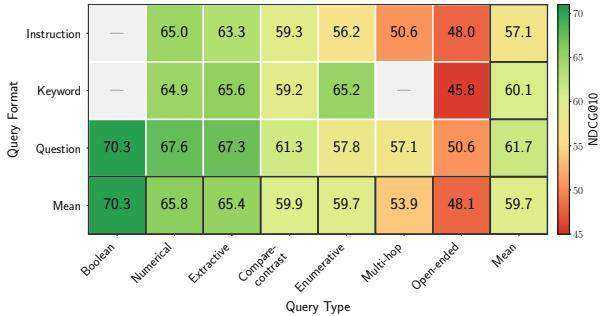  
Figure 5: ColEmbed-3B-v2 NDCG@10 by query type and format.

  
Figure 6: ColEmbed-3B-v2 NDCG $@ 1 0$ by modality.

  
Figure 7: ColEmbed-3B-v2 NDCG $@$ 10 by number of annotated pages.

Cross-language queries degrade performance Retrieval performance is 2–3 points higher in monolingual settings (Table 9 and Table 10) than crosslingual settings (Table 1), showing that models need to better adapt to these settings.

Textual rerankers outperform visual ones We evaluate the impact of adding a reranker to the textual and visual pipelines of the Jina-v4 retriever. We select zerank-2 (Zero Entropy, 2025) and jina-reranker- $\mathbf { \partial } \cdot \mathbf { m } 0$ (Jina AI, 2025) as two of the leading textual and visual rerankers to date. Results in Table 2 reveal a significant disparity in reranking efficacy between modalities. While the visual retriever initially outperforms the textual base, the textual reranker yields substantial gains $( + 1 3 . 2 \ \mathrm { N D C G } @ 1 0 )$ , enabling the textual pipeline to achieve the highest overall retrieval performance. In contrast, the visual reranker provides only a marginal average improvement of $+ 0 . 2$ and degrades performance in 4 datasets, underscoring the need for better multilingual visual rerankers.

# 4.2 Final Answer Generation

We evaluate end-to-end answer quality by providing LLMs and VLMs with queries and their corresponding retrieved pages, examining the effects of retrieval pipeline selection, context modality, and generation model choice (Table 3). For this evaluation, we use the best-performing textual and visual retrieval pipelines. We additionally establish an upper bound using an oracle pipeline that supplies the model with ground-truth annotated pages.

In the hybrid configuration, we concatenate the top-5 results from the visual retriever (images) with the top-5 results from the textual retriever (text), without removing duplicates; the retrieval performance is detailed in Table 11. We also consider a hybrid oracle setup, which provides the model with all the ground-truth pages in both modalities.

The correctness of generated answers is assessed against the ground truth final answer by an LLM judge (details in Appendix I). Private datasets are omitted to maintain their integrity.

Some benchmark queries involve general knowledge manageable by LLMs without retrieval. To prevent memorization from confounding our assessment of the RAG pipeline, we stratify queries by difficulty based on parametric knowledge. A query is categorized as easy if any model in a 6- LLM panel answers it correctly without context; otherwise, it is labeled hard. Overall, $4 8 . 6 \%$ of queries are easy (see Table 22 for details).

Visual context helps generation With a fixed Gemini 3 Pro generator, image-based context outperforms text-based context on the hard subset by 2.4 and 2.8 percentage points for the oracle and ColEmbed-3B-v2 pipelines, respectively (Table 3). This confirms that preserving the visual content of document pages provides better grounding for complex answer generation.

Hybrid retrieval yields the best performance on challenging queries The hybrid pipeline achieves $5 4 . 7 \%$ accuracy on hard queries, surpassing both the strongest textual $( 5 2 . 1 \% )$ and visual $( 5 4 . 5 \% )$ baselines. This complementary effect suggests that text and image representations capture different aspects of document content, and their combination can provide more robust evidence for downstream generation.

Hard queries expose the limits of parametric knowledge in current models Even with oracle context, performance on hard queries lags behind easy queries by more than 10 percentage points. This gap suggests that the multi-step reasoning and long-context synthesis required for difficult queries remain challenging for current models. While the models we evaluate achieve comparable overall scores, their relative ranking may shift when parametric knowledge is less of an advantage, as shown by GPT 5.2 outperforming Gemini $3 \mathrm { P r o }$ on easy queries but trailing on hard ones.

ViDoRe V3 leaves significant room for future retriever improvements The 10-point gap between the best non-oracle result $( 5 4 . 7 \% )$ and the image oracle $( 6 4 . 7 \% )$ on hard queries underscores substantial opportunities for improving the retrieval pipeline. Moreover, even with oracle contexts, Gemini 3 Pro performance remains modest, indicating that generation models still struggle to fully exploit the provided information.

Table 2: Retrieval performance $\left( \mathbf { N D C G } @ \mathbf { 1 0 } \right)$ of retriever $^ +$ reranker pipelines.   

<table><tr><td></td><td colspan="7">English Datasets</td><td colspan="3">French Datasets</td><td></td></tr><tr><td>Model</td><td>C.S.</td><td>Nucl.</td><td>Fin.</td><td>Phar.</td><td>H.R.</td><td>Ind.</td><td>Tel.</td><td>Phys.</td><td>Ener.</td><td>Fin.</td><td>Avg.</td></tr><tr><td>Textual pipeline</td><td></td><td></td><td></td><td></td><td></td><td></td><td></td><td></td><td></td><td></td><td></td></tr><tr><td>Jina-v4textual</td><td>64.3</td><td>44.3</td><td>48.4</td><td>54.9</td><td>52.8</td><td>38.4</td><td>56.3</td><td>43.6</td><td>60.1</td><td>41.3</td><td>50.4</td></tr><tr><td>+ zerank-2</td><td>82.1 17.8</td><td>53.5 ↑9.2</td><td>69.2 ↑20.8</td><td>66.2 ↑ 11.3</td><td>66.5 .13.7</td><td>53.2 14.8</td><td>71.5 15.2</td><td>48.2 ↑4.6</td><td>71.5 11.4</td><td>53.7 12.4</td><td>63.6 ↑ 13.2</td></tr><tr><td>Visual pipeline</td><td></td><td></td><td></td><td></td><td></td><td></td><td></td><td></td><td></td><td></td><td></td></tr><tr><td>Jina-v4visual</td><td>71.8</td><td>50.0</td><td>59.3</td><td>63.1</td><td>59.5</td><td>50.4</td><td>64.8</td><td>46.6</td><td>64.0</td><td>46.1</td><td>57.6</td></tr><tr><td>+ jina-reranker-m0</td><td>76.7 ↑4.9</td><td>50.8 ↑0.8</td><td>59.2 ↓0.1</td><td>65.4 ↑2.3</td><td>56.05 ↓3.5</td><td>50.9 ↑0.5</td><td>70.8 ↑6.0</td><td>46.9 ↑0.3</td><td>61.7. 12.3</td><td>39.8 6.3</td><td>57.8 ↑0.2</td></tr></table>

Table 3: End-to-end evaluation of final answer generation. We report the percentage of correct final answers as determined by an LLM judge across the 8 public datasets. "Oracle" rows represent the upper-bound performance using gold-standard contexts. Average Easy and Average Hard denote performance stratified by query difficulty. For each column, the best result is bolded and the best non-oracle result is underlined.   

<table><tr><td></td><td></td><td></td><td colspan="5">English Datasets</td><td colspan="5">French Datasets</td><td></td></tr><tr><td>Retrieval pipeline</td><td>Context modality</td><td>Generation model</td><td>C.S.</td><td>Fin.</td><td>Phar.</td><td>H.R.</td><td>Ind.</td><td>Phys.</td><td>Ener.</td><td>Fin.</td><td>Avg. Hard</td><td>Avg. Easy</td><td>Avg. Global</td></tr><tr><td rowspan="3">Oracle</td><td>Text</td><td rowspan="2">Gemini 3 Pro</td><td>80.9</td><td>70.2</td><td>71.4</td><td>72.3</td><td>66.4</td><td>71.2</td><td>69.2</td><td>62.8</td><td>62.3</td><td>79.3</td><td>70.6</td></tr><tr><td>Image</td><td>86.5</td><td>70.6</td><td>76.1</td><td>71.1</td><td>68.2</td><td>74.5</td><td>69.8</td><td>64.1</td><td>64.7</td><td>79.7</td><td>72.6</td></tr><tr><td>Hybrid</td><td></td><td>86.0</td><td>68.9</td><td>73.4</td><td>70.4</td><td>65.4</td><td>69.2</td><td>69.5</td><td>62.8</td><td>63.4</td><td>77.5</td><td>70.7</td></tr><tr><td>Jina-v4text. + zerank-2</td><td>Text</td><td>Gemini 3 Pro</td><td>80.9</td><td>66.0</td><td>59.9</td><td>63.2</td><td>60.4</td><td>69.2</td><td>64.9</td><td>54.7</td><td>52.1</td><td>75.5</td><td>64.9</td></tr><tr><td>Jina-v4text. + zerank-2 &amp; ColEmbed-3B-v2</td><td>Hybrid</td><td>Gemini 3 Pro</td><td>85.1</td><td>65.0</td><td>65.9</td><td>64.8</td><td>59.4</td><td>69.9</td><td>62.7</td><td>52.8</td><td>54.7</td><td>76.6</td><td>65.7</td></tr><tr><td rowspan="5">ColEmbed-3B-v2</td><td rowspan="5">Text</td><td>Gemini 3 Pro</td><td>82.3</td><td>62.5</td><td>61.0</td><td>62.9</td><td>56.2</td><td>64.9</td><td>62.3</td><td>49.4</td><td>51.7</td><td>73.0</td><td>62.7</td></tr><tr><td>Kimi K2</td><td>81.4</td><td>56.6</td><td>59.1</td><td>55.7</td><td>55.8</td><td>73.8</td><td>60.4</td><td>43.1</td><td>44.6</td><td>74.3</td><td>60.7</td></tr><tr><td>Gemini 3 Pro</td><td>83.3</td><td>67.3</td><td>62.9</td><td>65.4</td><td>57.2</td><td>67.9</td><td>64.3</td><td>47.8</td><td>54.5</td><td>74.1</td><td>64.5</td></tr><tr><td>Gemini 3 Flash</td><td>80.9</td><td>64.1</td><td>63.5</td><td>63.8</td><td>55.1</td><td>68.2</td><td>63.3</td><td>47.8</td><td>50.3</td><td>74.4</td><td>63.3</td></tr><tr><td>GPT-5.2 Qwen3-VL-235B</td><td>86.5</td><td>59.5</td><td>68.1 64.0</td><td>66.0 60.7</td><td>61.5 57.2</td><td>76.5 71.9</td><td>66.2 59.7</td><td>49.1 44.4</td><td>54.1 51.0</td><td>78.1 74.1</td><td>66.7 63.0</td></tr></table>

# 4.3 Visual Grounding

Beyond generating correct answers, it is highly desirable for RAG pipelines to identify where in the source documents the answer originates, enabling users to verify the grounding of the query answer. We therefore evaluate the ability of LLMs to generate accurate bounding boxes within their final answer. Among the few LLM families with visual grounding capabilities, we select Qwen3- VL-30B-A3B-Instruct and Gemini 3 Pro for evaluation. For each query, we provide the model with the candidate pages shown to the human annotators and prompt it to answer the query while inserting inline bounding boxes in XML format <bboxes image $\varepsilon ^ { \prime \prime } \mathsf { N } ^ { \prime \prime } >$ ... </bboxes> to delimit relevant content (full instructions in Appendix H).

We use the bounding boxes produced by the human annotators as our ground truth. Since each query may have 1–3 human annotators, we evaluate VLM predictions independently against each annotator using the same zone-based methodology as the inter-annotator consistency analysis (Section 3.3), and report the highest F1 score. This best-match strategy reflects the inherent subjectivity of evidence selection: annotators may legitimately highlight different regions to support the same answer, and a model should not be penalized for matching any valid interpretation.

Visual grounding lags human performance Inter-annotator agreement on evidence localization reaches an F1 of 0.602, whereas the bestperforming models achieve markedly lower scores: 0.089 for Qwen3-VL-30B-A3B-Instruct and 0.065 for Gemini 3 Pro, underlining substantial room for improvement on this task. A page-level analysis (Table 4) reveals that on pages where humans provided bounding boxes, both models annotated the same page only $16 \mathrm { - } 1 7 \%$ of the time, while $2 6 -$ $27 \%$ of human-annotated pages received no model annotation at all, highlighting recall as the primary bottleneck. Per-domain results and qualitative analysis appear in Appendix H and J.

Table 4: Page-level bounding box agreement between models and human annotators. Each page is classified by whether the model and human both annotated it, both left it unannotated, or only one provided annotations.   

<table><tr><td>Category</td><td>Outcome</td><td>Qwen3-VL-30B-A3B</td><td>Gemini 3 Pro</td></tr><tr><td rowspan="2">Agreement</td><td>Both annotated</td><td>17 %</td><td>16 %</td></tr><tr><td>Neither annotated</td><td>46 %</td><td>49 %</td></tr><tr><td rowspan="2">Discrepancy</td><td>Model only</td><td>10 %</td><td>7 %</td></tr><tr><td>Human only</td><td>26 %</td><td>27 %</td></tr></table>

# 5 Conclusion

This work introduces ViDoRe V3, a humanannotated RAG benchmark that evaluates crosslingual retrieval, final answer generation, and visual grounding on large industry-relevant document corpora. We design a human-in-the-loop annotation methodology, deployed in a 12,000-hour annotation campaign, that produces diverse realistic queries paired with relevant pages, bounding boxes, and reference answers. Evaluating state-of-the-art RAG pipelines, we find that visual retrievers outperform textual ones, late interaction and textual reranking yield substantial gains, and visual context improves answer generation quality. Looking ahead, ViDoRe V3 highlights several concrete research directions for practical multimodal RAG. Retriever models still struggle on cross-lingual and open-ended queries requiring visual interpretation, while VLMs need improvement in answer generation from multi-page contexts as well as accurate visual grounding. By providing a rigorous framework for evaluating these limitations, ViDoRe V3 serves as a catalyst for the development of more robust, intelligent document understanding models.

# Limitations

Language coverage While our benchmark is multilingual, it is restricted to English and French source documents and queries in 6 high-resource Western European languages. Future iterations of the benchmark should include a more diverse set of language families and non-Latin scripts to mitigate this bias.

Document distribution bias Our benchmark focuses on publicly available long-form document corpora, representing one specific mode of existing document distribution. For example, enterprise RAG may need to handle a wider variety of document types, often in private repositories, that include noisy, short-form types such as emails, support tickets, or scanned handwritten notes that are not represented in our source documents.

Human annotation Annotations for open-ended reasoning and visual grounding inherently contain a degree of subjectivity. We acknowledge that for complex exploratory queries, multiple valid retrieval paths and answer formulations may exist outside of our annotated ground truths.

# Ethical considerations

Annotator Welfare and Compensation. Human annotation was conducted by the creators of the benchmark and a single external annotation vendor. Multiple established vendors were evaluated with respect to the annotation protocol and relevant ethical considerations, and one vendor was selected based on demonstrated compliance with these criteria. Annotators were recruited from the vendor’s existing workforce in accordance with the demographic requirements described in the Annotator Pool and Selection section (Section C) and were compensated at rates designed to provide fair pay based on geographic location and required skill sets. The data were curated such that annotators were not exposed to harmful or offensive content during the annotation process. The use of human annotators was limited to standard annotation and verification tasks for benchmark construction and did not constitute human-subjects research; accordingly, the data collection protocol was determined to be exempt from formal ethics review.

Data Licensing and Privacy. All documents included in the benchmark were manually selected from governmental, educational, and enterprise websites that met open license criteria. The annotations were collected in order not to contain any private or personally identifiable information and are GDPR-compliant. The benchmark is released under a commercially permissive license to facilitate broad research adoption while respecting the intellectual property rights of original document creators.

Linguistic and Geographic Bias. We acknowledge that our benchmark is restricted to English and French source documents and queries in 6 highresource Western European languages. This limitation may inadvertently favor RAG systems optimized for these languages and does not reflect the full diversity of practical document retrieval scenarios globally. We encourage future work to extend evaluation to underrepresented language families and non-Latin scripts.

Environmental Impact. The creation of this benchmark required substantial computational resources for VLM pre-filtering, synthetic query generation, and model evaluation. We report these costs to promote transparency: approximately 12,000 hours of human annotation effort and extensive GPU compute for model inference across our evaluation suite. Specifically, the compute totaled 3,000 hours on NVIDIA H100 GPUs on a low emission energy grid, with an estimated environmental impact of $2 0 0 \mathrm { k g } \mathrm { C O _ { 2 } e }$ .

# Acknowledgments

This work was conducted with contributions from NVIDIA. We thank all the people that allowed this work to happen, in particular Eric Tramel, Benedikt Schifferer, Mengyao Xu and Radek Osmulski, Erin Potter and Hannah Brandon. Crucially, we thank the dedicated team of annotators for their essential efforts.

It was carried out within the framework of the LIAGORA "LabCom", a joint laboratory supported by the French National Research Agency (ANR) and established between ILLUIN Technology and the MICS laboratory of CentraleSupelec. The benchmark was partially created using HPC resources from IDRIS with grant AD011016393.

# Detailed Contributions

Benchmark Design Loison, Macé, Edy, Moreira and Liu designed the benchmark.

Data and Annotation Loison and Macé developed the synthetic data generation pipeline. Loison generated the queries, while Macé predicted links between queries and pages. Loison, Macé, and Balough defined annotation guidelines; Balough coordinated the annotation campaign. Macé and Edy managed final answer merging. Loison, Macé, Edy, Xing, and Balough reviewed the final annotations.

Evaluation Macé, Edy and Loison conceptualized the evaluations. Macé and Loison worked on retrieval evaluation, with Moreira focusing on the evaluation of ColEmbed models. Edy led the end-to-end evaluation, reranking analysis, and visualization. Macé and Edy integrated the results into the MTEB leaderboard. Xing led bounding box evaluations and result analysis.

Writing and Supervision The manuscript was written by Loison, Macé, Xing, and Edy. Senior supervision and strategic guidance were provided by Xing, Faysse, Liu, Hudelot, and Viaud, with Faysse closely advising on project direction and planning.

# References

Mohammad Mahdi Abootorabi, Amirhosein Zobeiri, Mahdi Dehghani, Mohammadali Mohammadkhani, Bardia Mohammadi, Omid Ghahroodi, Mahdieh Soleymani Baghshah, and Ehsaneddin Asgari. 2025. Ask in any modality: A comprehensive survey on multimodal retrieval-augmented generation. Preprint, arXiv:2502.08826.

Christoph Auer, Maksym Lysak, Ahmed Nassar, Michele Dolfi, Nikolaos Livathinos, Panos Vagenas, Cesar Berrospi Ramis, Matteo Omenetti, Fabian Lindlbauer, Kasper Dinkla, and 1 others. 2024. Docling technical report. arXiv preprint arXiv:2408.09869.

Shuai Bai, Keqin Chen, Xuejing Liu, Jialin Wang, Wenbin Ge, Sibo Song, Kai Dang, Peng Wang, Shijie Wang, Jun Tang, Humen Zhong, Yuanzhi Zhu, Mingkun Yang, Zhaohai Li, Jianqiang Wan, Pengfei Wang, Wei Ding, Zheren Fu, Yiheng Xu, and 8 others. 2025. Qwen2.5-vl technical report. arXiv preprint arXiv:2502.13923.

Ricardo JGB Campello, Davoud Moulavi, and Jörg Sander. 2013. Density-based clustering based on hierarchical density estimates. In Pacific-Asia conference on knowledge discovery and data mining, pages 160–172. Springer.

Antoine Chaffin. 2025. Gte-moderncolbert.

Jianlv Chen, Shitao Xiao, Peitian Zhang, Kun Luo, Defu Lian, and Zheng Liu. 2024. BGE M3- Embedding: Multi-Lingual, Multi-Functionality, Multi-Granularity Text Embeddings Through Self-Knowledge Distillation. arXiv preprint. Version Number: 3.

Jaemin Cho, Debanjan Mahata, Ozan Irsoy, Yujie He, and Mohit Bansal. 2024a. M3docrag: Multi-modal retrieval is what you need for multipage multi-document understanding. Preprint, arXiv:2411.04952.

Jaemin Cho, Debanjan Mahata, Ozan Irsoy, Yujie He, and Mohit Bansal. 2024b. M3docrag: Multimodal retrieval is what you need for multi-page multi-document understanding. arXiv preprint arXiv:2411.04952.

Max Conti, Manuel Faysse, Gautier Viaud, Antoine Bosselut, Céline Hudelot, and Pierre Colombo. 2025. Context is gold to find the gold passage: Evaluating and training contextual document embeddings. Preprint, arXiv:2505.24782.

Wenqi Fan, Yujuan Ding, Liangbo Ning, Shijie Wang, Hengyun Li, Dawei Yin, Tat-Seng Chua, and Qing Li. 2024. A survey on rag meeting llms: Towards retrieval-augmented large language models. Preprint, arXiv:2405.06211.

Manuel Faysse, Hugues Sibille, Tony Wu, Bilel Omrani, Gautier Viaud, Céline Hudelot, and Pierre Colombo. 2025. Colpali: Efficient document retrieval with vision language models. Preprint, arXiv:2407.01449.

Tianyu Gao, Howard Yen, Jiatong Yu, and Danqi Chen. 2023. Enabling large language models to generate text with citations. Preprint, arXiv:2305.14627.

Yunfan Gao, Yun Xiong, Xinyu Gao, Kangxiang Jia, Jinliu Pan, Yuxi Bi, Yi Dai, Jiawei Sun, Meng Wang, and Haofen Wang. 2024. Retrieval-augmented generation for large language models: A survey. Preprint, arXiv:2312.10997.

Michael Günther, Saba Sturua, Mohammad Kalim Akram, Isabelle Mohr, Andrei Ungureanu, Sedigheh Eslami, Scott Martens, Bo Wang, Nan Wang, and Han Xiao. 2025. jina-embeddings-v4: Universal embeddings for multimodal multilingual retrieval. Preprint, arXiv:2506.18902.

Jina AI. 2025. jina-reranker-m0: Multilingual multimodal document reranker. Accessed: 2025-12-22.

Patrick Lewis, Ethan Perez, Aleksandra Piktus, Fabio Petroni, Vladimir Karpukhin, Naman Goyal, Heinrich Küttler, Mike Lewis, Wen tau Yih, Tim Rocktäschel, Sebastian Riedel, and Douwe Kiela. 2021. Retrieval-augmented generation for knowledgeintensive nlp tasks. Preprint, arXiv:2005.11401.

Andrés Marafioti, Orr Zohar, Miquel Farré, Merve Noyan, Elie Bakouch, Pedro Cuenca, Cyril Zakka, Loubna Ben Allal, Anton Lozhkov, Nouamane Tazi, Vaibhav Srivastav, Joshua Lochner, Hugo Larcher, Mathieu Morlon, Lewis Tunstall, Leandro von Werra, and Thomas Wolf. 2025. Smolvlm: Redefining small and efficient multimodal models. Preprint, arXiv:2504.05299.

Minesh Mathew, Viraj Bagal, Rubèn Pérez Tito, Dimosthenis Karatzas, Ernest Valveny, and C. V Jawahar. 2021a. Infographicvqa. Preprint, arXiv:2104.12756.

Minesh Mathew, Dimosthenis Karatzas, and CV Jawahar. 2021b. Docvqa: A dataset for vqa on document images. In Proceedings of the IEEE/CVF winter conference on applications of computer vision, pages 2200–2209.

Leland McInnes, John Healy, and James Melville. 2020. Umap: Uniform manifold approximation and projection for dimension reduction. Preprint, arXiv:1802.03426.

Niklas Muennighoff, Nouamane Tazi, Loïc Magne, and Nils Reimers. 2023. Mteb: Massive text embedding benchmark. In Proceedings of the 17th Conference of the European Chapter of the Association for Computational Linguistics, pages 2014–2037.

NeMo Data Designer Team. 2025. Nemo data designer: A framework for generating synthetic data from scratch or based on your own seed data. https://github.com/NVIDIA-NeMo/ DataDesigner. GitHub Repository.

Nomic Team. 2025. Nomic embed multimodal: Interleaved text, image, and screenshots for visual document retrieval.

Liquid AI. 2025. Lfm2 technical report. arXiv preprint arXiv:2511.23404.

Frank Liu, Kenneth Enevoldsen, Roman Solomatin, Isaac Chung, Tom Aarsen, and Zoltán Fodi. 2025. ˝ Introducing rteb: A new standard for retrieval evaluation.

NVIDIA Ingest Development Team. 2024. NVIDIA Ingest: An accelerated pipeline for document ingestion.

Xing Han Lù. 2024. Bm25s: Orders of magnitude faster lexical search via eager sparse scoring. Preprint, arXiv:2407.03618.

Xueguang Ma, Sheng-Chieh Lin, Minghan Li, Wenhu Chen, and Jimmy Lin. 2024a. Unifying multimodal retrieval via document screenshot embedding. Preprint, arXiv:2406.11251.

Xiangyu Peng, Can Qin, Zeyuan Chen, Ran Xu, Caiming Xiong, and Chien-Sheng Wu. 2025. Unidocbench: A unified benchmark for document-centric multimodal rag. Preprint, arXiv:2510.03663.

Qwen Team. 2025. Qwen3 technical report. Preprint, arXiv:2505.09388.

Hongjin Su, Howard Yen, Mengzhou Xia, Weijia Shi, Niklas Muennighoff, Han-yu Wang, Haisu Liu, Quan Shi, Zachary S Siegel, Michael Tang, and 1 others. 2024. Bright: A realistic and challenging benchmark for reasoning-intensive retrieval. arXiv preprint arXiv:2407.12883.

Xueguang Ma, Shengyao Zhuang, Bevan Koopman, Guido Zuccon, Wenhu Chen, and Jimmy Lin. 2024b. Visa: Retrieval augmented generation with visual source attribution. Preprint, arXiv:2412.14457.

Quentin Macé, António Loison, and Manuel Faysse. 2025. Vidore benchmark v2: Raising the bar for visual retrieval. Preprint, arXiv:2505.17166.

Rikiya Takehi, Benjamin Clavié, Sean Lee, and Aamir Shakir. 2025. Fantastic (small) retrievers and how to train them: mxbai-edge-colbert-v0 tech report. Preprint, arXiv:2510.14880.

Yixuan Tang and Yi Yang. 2024. Multihop-rag: Benchmarking retrieval-augmented generation for multihop queries. Preprint, arXiv:2401.15391.

Paul Teiletche, Quentin Macé, Max Conti, Antonio Loison, Gautier Viaud, Pierre Colombo, and Manuel Faysse. 2025. Modernvbert: Towards smaller visual document retrievers. arXiv preprint arXiv:2510.01149.

Nandan Thakur, Jimmy Lin, Sam Havens, Michael Carbin, Omar Khattab, and Andrew Drozdov. 2025. Freshstack: Building realistic benchmarks for evaluating retrieval on technical documents. Preprint, arXiv:2504.13128.

embedding and reranking through foundation models.   
arXiv preprint arXiv:2506.05176.

Fengbin Zhu, Wenqiang Lei, Fuli Feng, Chao Wang, Haozhou Zhang, and Tat-Seng Chua. 2022. Towards complex document understanding by discrete reasoning. In Proceedings of the 30th ACM International Conference on Multimedia, pages 4857–4866.

Jordy Van Landeghem, Rubèn Tito, Łukasz Borchmann, Michał Pietruszka, Pawel Joziak, Rafal Powalski, Dawid Jurkiewicz, Mickaël Coustaty, Bertrand Anckaert, Ernest Valveny, and 1 others. 2023. Document understanding dataset and evaluation (dude). In Proceedings of the IEEE/CVF International Conference on Computer Vision, pages 19528–19540.

Qiuchen Wang, Ruixue Ding, Zehui Chen, Weiqi Wu, Shihang Wang, Pengjun Xie, and Feng Zhao. 2025. Vidorag: Visual document retrieval-augmented generation via dynamic iterative reasoning agents. arXiv preprint arXiv:2502.18017.

Zirui Wang, Mengzhou Xia, Luxi He, Howard Chen, Yitao Liu, Richard Zhu, Kaiqu Liang, Xindi Wu, Haotian Liu, Sadhika Malladi, and 1 others. 2024. Charxiv: Charting gaps in realistic chart understanding in multimodal llms. Advances in Neural Information Processing Systems, 37:113569–113697.

Navve Wasserman, Roi Pony, Oshri Naparstek, Adi Raz Goldfarb, Eli Schwartz, Udi Barzelay, and Leonid Karlinsky. 2025. Real-mm-rag: A real-world multi-modal retrieval benchmark. arXiv preprint arXiv:2502.12342.

Mengyao Xu, Gabriel Moreira, Ronay Ak, Radek Osmulski, Yauhen Babakhin, Zhiding Yu, Benedikt Schifferer, and Even Oldridge. 2025. Llama nemoretriever colembed: Top-performing text-image retrieval model. Preprint, arXiv:2507.05513.

Shi Yu, Chaoyue Tang, Bokai Xu, Junbo Cui, Junhao Ran, Yukun Yan, Zhenghao Liu, Shuo Wang, Xu Han, Zhiyuan Liu, and Maosong Sun. 2025a. Visrag: Vision-based retrieval-augmented generation on multi-modality documents. Preprint, arXiv:2410.10594.

Wenhan Yu, Wang Chen, Guanqiang Qi, Weikang Li, Yang Li, Lei Sha, Deguo Xia, and Jizhou Huang. 2025b. Bbox docvqa: A large scale bounding box grounded dataset for enhancing reasoning in document visual question answer. Preprint, arXiv:2511.15090.

Zero Entropy. 2025. Introducing zerank-2. Accessed: 2025-12-22.

Yanzhao Zhang, Mingxin Li, Dingkun Long, Xin Zhang, Huan Lin, Baosong Yang, Pengjun Xie, An Yang, Dayiheng Liu, Junyang Lin, Fei Huang, and Jingren Zhou. 2025. Qwen3 embedding: Advancing text

# A Dataset examples

Domain: Pharmaceuticals Query id: 17 Query type: Extractive Query format: Question

Query: According to FDA guidelines, what is the required format for displaying the strength of a small volume parenteral drug on its label?

Answer: According to FDA guidelines, the strength of a small-volume parenteral drug must be displayed as the quantity per total volume (e.g., $2 \quad \mathbf { g } / 2 0 \quad \mathbf { m } \mathbf { L } )$ , immediately followed in parentheses by the quantity per milliliter (e.g., 100 $\mathsf { m g / m L } )$ .

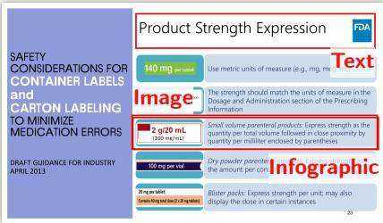

Domain: Finance (FR) Query id: 32 Query types: Extractive, numerical Query format: Keyword

Query: taux de produits fabriqués en France Hermès 2023

Answer: Le taux de produits d'Hermès fabriqués en France est de $74 \%$ en 2023.

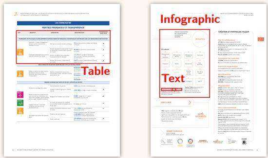

Domain: Human Resources Query id: 0 Query type: Multi-hop Query format: Question

Query: What impact did the shifts in temporary contract usage from 2018 to 2023 have on the difference in employment stability between mobile EU workers and citizens of the host countries?

Answer: From 2018 to 2023, the job stability gap between mobile EU workers and nationals narrowed. The use of temporary contracts declined more for EU movers (from $1 9 \%$ to $14 \%$ ) than for nationals $1 4 \%$ to $1 1 \%$ ), reducing the difference between the two groups from 5 to 3 percentage points.

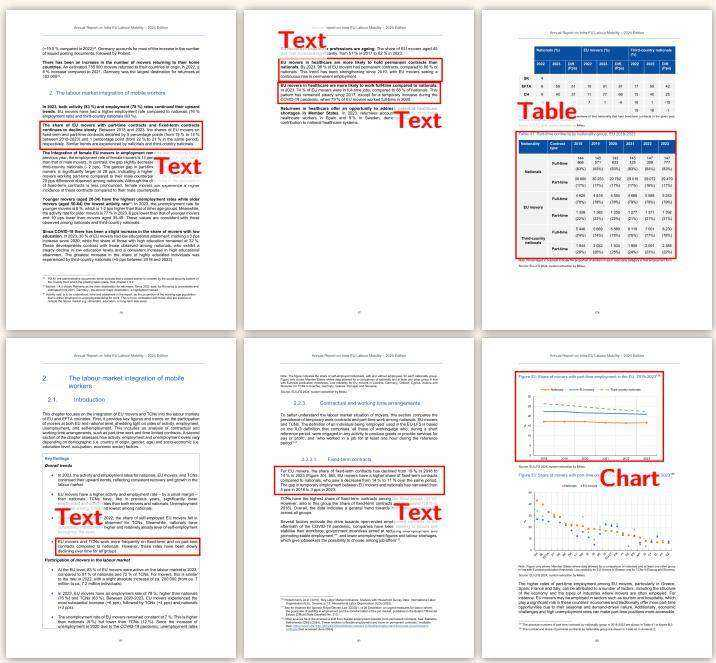  
Figure 8: Examples from the ViDoRe V3 datasets. Featuring varied query types and visually rich document formats across multiple domains, the benchmark captures the complexity of real-world retrieval scenarios.

# B Supplementary benchmark details

Domains Table 6 details the type of documents used in each corpus as well as several statistics.

Query type and format descriptions Table 5 describes the types and formats of the queries, while Figure 9 gives details about query type intersection frequency.

Query type by generation method Query type distributions by generation method (Figure 10) confirm that open-ended queries dominate synthetic queries as the synthetic pipeline attributed more weight to this type, while extractive queries dominate human-image queries since they are more naturally chosen by annotators.

# C Annotator pool and training details

Annotator Pool and Selection. Annotation was conducted by a curated pool of 76 annotators who were selected based on having: (1) a bachelor’s degree or higher in the relevant domain, (2) professional experience in the domain, (3) native-level language proficiency as required by task, and (4) prior experience with RAG, retrieval, or VQA annotation projects. Quality control was performed by 13 senior annotators with enhanced domain knowledge and extensive annotation experience, with project oversight provided by data leads with multiple years of experience in human data generation.

Training and Pilot Phase. The annotation process began with a comprehensive onboarding phase where annotators received task-specific training using gold-standard examples. For each domain, a pilot of several hundred tasks was conducted with $100 \%$ quality control coverage and multiple annotators per task. During this phase, data leads and the research team continuously evaluated annotations, provided clarifications, and refined guidelines. Inter-annotator agreement and time-per-task baselines were calculated to establish ongoing evaluation benchmarks. The pilot concluded upon validation of both data quality and guideline effectiveness.

# D Supplementary agreement metrics

Pages were pre-filtered by a VLM before human annotation; as most pages shown to annotators were likely relevant, this created a skewed class distribution. This prevalence imbalance causes traditional chance-corrected metrics like Krippendorff’s Alpha to appear paradoxically low even when annotators genuinely agree, as inflated expected chance agreement penalizes the score. To address this, we report 2 complementary metrics: Krippendorff’s Alpha (ordinal) as the standard measure and Gwet’s AC2 which remains stable under prevalence skew. Overall, annotators achieved $\alpha = 0 . 4 6 9$ , $\mathrm { A C } 2 = 0 . 7 6 0$ . The divergence between Alpha and AC2/Weighted Agreement is expected given the pre-filtered data and confirms substantial agreement despite the skewed distribution.

# E Supplementary retrieval details

Retriever model reference Table 8 lists the retriever models evaluated in this work, along with their HuggingFace model names and citations.

Monolingual performance Tables 9 and 10 present the monolingual performance of our models, where retrieval is conducted using languagematched queries and documents for English and French, respectively.

<table><tr><td>Dataset</td><td>α (ord)</td><td>Gwet&#x27;s AC2</td></tr><tr><td>Computer science</td><td>0.467</td><td>0.809</td></tr><tr><td>Energy</td><td>0.463</td><td>0.714</td></tr><tr><td>Finance (EN)</td><td>0.514</td><td>0.798</td></tr><tr><td>Finance (FR)</td><td>0.320</td><td>0.736</td></tr><tr><td>H.R.</td><td>0.413</td><td>0.793</td></tr><tr><td>Industrial Maintenance</td><td>0.496</td><td>0.740</td></tr><tr><td>Telecom</td><td>0.464</td><td>0.772</td></tr><tr><td>Nuclear</td><td>0.389</td><td>0.794</td></tr><tr><td>Pharma</td><td>0.478</td><td>0.755</td></tr><tr><td>Physics</td><td>0.213</td><td>0.334</td></tr><tr><td>Overall</td><td>0.469</td><td>0.760</td></tr></table>

Table 7: Inter-annotator agreement for relevance ratings by dataset.

Additional Retrieval Modality Performances To evaluate the hybrid retrieval setup, we use the multimodal Jina-v4 model to generate separate visual and textual rankings. We then construct a hybrid retrieval set by merging the top-5 results from each modality and removing duplicates. Because this set-union operation does not preserve a strict ranking order, we report the unranked F1 score. As shown in Table 11, the hybrid approach consistently outperforms single-modality baselines.

<table><tr><td>Category</td><td>Definition</td><td>Example</td></tr><tr><td colspan="3">Query Types</td></tr><tr><td>Open-ended</td><td>Seeks explanatory or descriptive information that requires synthesis.</td><td>What drives the rise in women&#x27;s workforce in- volvement in EU nations?</td></tr><tr><td>Extractive</td><td>Requires the retrieval of a specific piece of infor- mation.</td><td>Bank of America preferred stock MM dividend rate</td></tr><tr><td>Compare Contrast</td><td>Mandates a comparison between multiple entities or data points.</td><td>Explain the factors contributing to the reduction in R2R rates for ANDAs.</td></tr><tr><td>Boolean</td><td>Poses a yes/no question necessitating multi-step reasoning.</td><td>Did JPMorganChase execute more than half of its planned repurchase program?</td></tr><tr><td>Numerical</td><td>Asks for a specific quantitative value that must be derived or calculated.</td><td>percentage increase in Morgan Stanley revenue from 2023 to 2024</td></tr><tr><td>Multi-hop</td><td>Requires integrating information from multiple sections or sources.</td><td>Summarize the steps involved in error reporting in ISMP&#x27;s MERP.</td></tr><tr><td>Enumerative</td><td>Requests a list of all instances sharing a common property.</td><td>Specify the ISCO codes used to define domestic workers in the EU.</td></tr><tr><td colspan="3">Query Formats</td></tr><tr><td>Question</td><td>An interrogative sentence.</td><td>What was Citigroup&#x27;s net interest margin in 2024?</td></tr><tr><td>Keyword</td><td>A non-verbal phrase or set of terms.</td><td>female employment rate European Union 2023</td></tr><tr><td>Instruction</td><td>A directive specifying a task.</td><td>Identify the use case of a drill point gauge.</td></tr></table>

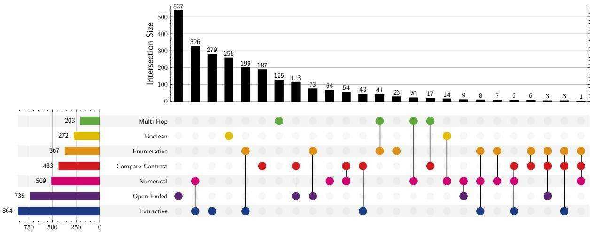  
Table 5: Taxonomy of Query Types and Formats.   
Figure 9: UpSet plot illustrating the distribution and intersection of query types in ViDoRe V3. The horizontal bars on the left display the total count of queries for each individual type. The vertical bars at the top represent the frequency of specific combinations (intersections), as indicated by the connected dots in the matrix below. While Extractive queries are the most prevalent overall, Open Ended queries form the dominant unique category. Complex dependencies are evident in the frequent intersection of Enumerative and Extractive types, indicating a substantial subset of queries requiring list-based fact retrieval.

# F ColEmbed-3B-v2 performance breakdown

Table 12 details the retrieval scores of ColEmbed-3B-v2 by query language, highlighting small performance variations by language.

Performance by number of annotated pages As seen in Figure 7, performance drops with the number of annotated pages. However, a potential confounding factor is the correlation between query type and the number of annotated pages, since more complex query types also have higher number of annotated pages (Figure 11). We perform a stratified regression analysis to isolate these two effects.

We model $\mathrm { N D C G } @ 1 0$ as a linear function of the number of annotated pages $( P )$ stratified by query type. For each of the 7 query types, we fit an ordinary least squares regression:

$$
N D C G @ 1 0 = a \cdot P + b + \epsilon .
$$

Results in Figure 12 and Table 13 reveal that all query types suffer a significant performance penalty as the number of annotated pages increases. Slope values are nearly uniform $( a \approx - 0 . 0 2 4 )$ , suggesting a similar drop in retrieval accuracy across most query types. The open-ended and enumerative types are the two exceptions: despite having the lowest $\mathrm { N D C G } @ 1 0$ for low page counts, they also have the shallowest slope, which suggests that retrieval success on these queries is constrained by the model’s fundamental difficulty in synthesizing multiple relevant sources rather than the volume of relevant context.

<table><tr><td>Corpus</td><td>Domain(s)</td><td>Description</td><td></td><td></td><td>Lang. # Docs # Pages # Queries*</td><td></td><td>Main modali- ties</td></tr><tr><td>U.S. Public Company Annual Re- ports</td><td>Finance-EN</td><td>Consists of 6 10-K annual re- ports from major U.S. financial institutions for the fiscal year ended December 31, 2024.</td><td>en</td><td>6</td><td>2942</td><td>309</td><td>Text, Table</td></tr><tr><td>Computer Science Text- books</td><td>Computer Science / Education</td><td>Consists of two open-source, peer-reviewed textbooks from OpenStax covering foundational topics in computer science,</td><td>en</td><td>2</td><td>1360</td><td>215</td><td>Books</td></tr><tr><td></td><td></td><td>Python, and data science. FDA Reports Pharmaceuticals Consists of FDA presentations and Springer books (20162023) covering regulatory policies, drug development, and public</td><td>en</td><td>52</td><td>2313</td><td>364</td><td>Slides, Books</td></tr><tr><td>HR Reports from EU</td><td>HR</td><td>health initiatives. Includes recent European Com- mission reports and papers on EU labour markets, social de- velopment, and employment</td><td>en</td><td>14</td><td>1110</td><td>318</td><td>Reports</td></tr><tr><td>USAF Tech- Industrial nical Orders </td><td>Maintenance</td><td>policies. Comprises U.S. military tech- nical orders and manuals for aircraft maintenance, safety pro- cedures, and material handling,</td><td>en</td><td>27</td><td>5244</td><td>283</td><td>Manuals</td></tr><tr><td>French Physics Lec- tures</td><td>Physics</td><td>revised through 2025. A collection of educational mate- rials offering an interdisciplinary exploration of modern physics</td><td>fr</td><td>42</td><td>1674</td><td>302</td><td>Slides</td></tr><tr><td>French Pub- lic Company Annual Re-</td><td>Finance-FR</td><td>and complexity science. Contains the 20232024 annual reports of major French luxury companies (Dior, Hermès, Ker- ing, L&#x27;Oréal, LVMH).</td><td>fr</td><td>5</td><td>2384</td><td>320</td><td>Reports</td></tr><tr><td>French Gov- ernmental Energy Re- ports</td><td>Energy</td><td>Gathers official documents from French public agencies on energy, economic, and environ- mental issues in France.</td><td>fr</td><td>42</td><td>2229</td><td>308</td><td>Reports, Slides</td></tr></table>

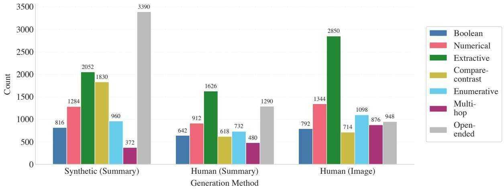  
Table 6: Description of ViDoRe V3 public corpora. ∗Number of queries is without translations   
Figure 10: Query type distribution by generation method.

<table><tr><td>Model alias</td><td>Full model name</td><td>Reference</td></tr><tr><td>Qwen3-8B</td><td>Qwen3-Embedding-8B</td><td>Zhang et al. (2025)</td></tr><tr><td>Jina-v4</td><td>jina-embeddings-v4</td><td>Günther et al. (2025)</td></tr><tr><td>Qwen3-0.6B</td><td>Qwen3-Embedding-0.6B</td><td>Zhang et al. (2025)</td></tr><tr><td>LFM2-350M</td><td>LFM2-ColBERT-350M</td><td>Liquid AI (2025)</td></tr><tr><td>BGE-M3</td><td>BGE-M3</td><td>Chen et al. (2024)</td></tr><tr><td>BM25S</td><td>BM25S</td><td>Lù (2024)</td></tr><tr><td>ColEmbed-3B-v2</td><td>llama-nemoretriever-colembed-3b-v2</td><td>Xu et al. (2025)</td></tr><tr><td>ColNomic-7B</td><td>colnomic-embed-multimodal-7b</td><td>Nomic Team (2025)</td></tr><tr><td>ColEmbed-3B</td><td>llama-nemoretriever-colembed-3b-v1</td><td>Xu et al. (2025)</td></tr><tr><td>ColNomic-3B</td><td>colnomic-embed-multimodal-3b</td><td>Nomic Team (2025)</td></tr><tr><td>ColEmbed-1B</td><td>llama-nemoretriever-colembed-1b-v1</td><td>Xu et al. (2025)</td></tr><tr><td>ColQwen2.5</td><td>colqwen2.5-v0.2</td><td>Faysse et al. (2025)</td></tr><tr><td>Nomic-7B</td><td>nomic-embed-multimodal-7b</td><td>Nomic Team (2025)</td></tr><tr><td>ColQwen2</td><td>colqwen2-v1.0</td><td>Faysse et al. (2025)</td></tr><tr><td>Nomic-3B</td><td>nomic-embed-multimodal-7b</td><td>Nomic Team (2025)</td></tr><tr><td>ColPali</td><td>colpali-v1.3</td><td>Faysse et al. (2025)</td></tr><tr><td>Mxbai Edge 32M</td><td>mxbai-edge-colbert-v0-32m</td><td>Takehi et al. (2025)</td></tr><tr><td>GTE-ModernColBERT</td><td>GTE-ModernColBERT-v1</td><td>Chaffin (2025)</td></tr><tr><td>ColModernVBERT</td><td>colmodernvbert</td><td>Teiletche et al. (2025)</td></tr><tr><td>ColSmol-256M</td><td>colSmol-256M</td><td>Marafioti et al. (2025)</td></tr></table>

Table 8: Retriever reference table. Model aliases used in Tables 1, 9, and 10 are mapped to their HuggingFace model name and citation.

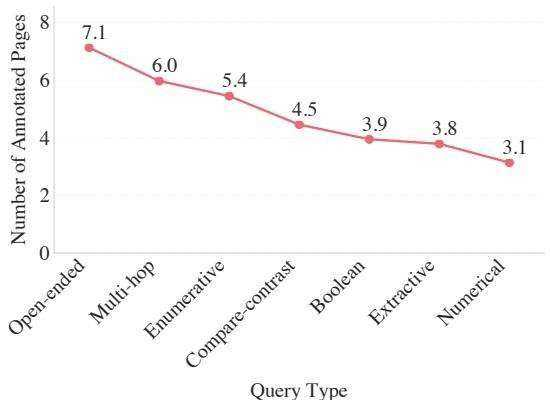  
Figure 11: Average number of annotated pages by query type.

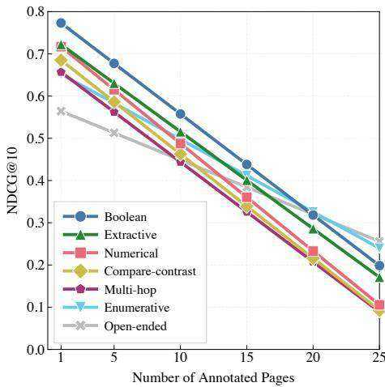  
Figure 12: ColEmbed-3B-v2 NDCG $@$ 10 by number of annotated pages and query type.

Performance by Query Generation Source Table 14 reports $\mathrm { N D C G } @ 1 0$ of ColEmbed-3B-v2 stratified by query type and generation source. Queries generated with full page image access (Human+Image) consistently yield the highest scores, as annotators can anchor queries directly to visible content. Synthetic and human blind-contextual queries ( $S D G + s$ Summary and Human+Summary) score similarly, with a mean difference of 0.044 $\mathrm { N D C G } @ 1 0 .$ , confirming that the synthetic pipeline does not introduce a simplicity bias.

Table 9: English-only retrieval performance $\mathbf { ( N D C G } @ \mathbf { 1 0 ) }$ ). ⋆: single-vector models. Results are computed on the English queries of the English datasets.   

<table><tr><td>Model</td><td>Size (B)</td><td>C.S.</td><td>Nucl.</td><td>Fin.</td><td>Phar.</td><td>H.R.</td><td>Ind.</td><td>Tele.</td><td>Average</td></tr><tr><td>Textual Retrievers</td><td></td><td></td><td></td><td></td><td></td><td></td><td></td><td></td><td></td></tr><tr><td>Jina-v4</td><td>3</td><td>67.3</td><td>48.2</td><td>56.5</td><td>59.0</td><td>58.8</td><td>45.8</td><td>61.0</td><td>56.7</td></tr><tr><td>Qwen3-8B</td><td>8</td><td>73.5</td><td>42.2</td><td>54.8</td><td>62.4</td><td>52.3</td><td>45.3</td><td>66.0</td><td>56.6</td></tr><tr><td>LFM2-350M</td><td>0.35</td><td>70.6</td><td>45.4</td><td>48.3</td><td>62.1</td><td>53.2</td><td>47.9</td><td>63.8</td><td>55.9</td></tr><tr><td>Mxbai Edge 32M</td><td>0.03</td><td>68.0</td><td>44.4</td><td>48.2</td><td>62.5</td><td>52.7</td><td>47.1</td><td>61.9</td><td>55.0</td></tr><tr><td>BM25S</td><td>-</td><td>64.7</td><td>45.9</td><td>49.9</td><td>56.9</td><td>49.6</td><td>45.6</td><td>58.3</td><td>53.0</td></tr><tr><td>Qwen3-0.6B</td><td>0.6</td><td>70.5</td><td>39.7</td><td>51.5</td><td>57.4</td><td>46.2</td><td>42.4</td><td>59.7</td><td>52.3</td></tr><tr><td>GTE-ModernColBERT</td><td>0.15</td><td>63.6</td><td>41.7</td><td>39.8</td><td>62.0</td><td>46.2</td><td>44.6</td><td>59.7</td><td>51.1</td></tr><tr><td>BGE-M3</td><td>0.57</td><td>63.6</td><td>34.3</td><td>43.9</td><td>54.7</td><td>45.3</td><td>39.0</td><td>54.3</td><td>47.9</td></tr><tr><td>Visual Retrievers</td><td></td><td></td><td></td><td></td><td></td><td></td><td></td><td></td><td></td></tr><tr><td>ColEmbed-3B-v2</td><td>3</td><td>78.6</td><td>52.9</td><td>69.1</td><td>67.6</td><td>65.4</td><td>56.8</td><td>71.7</td><td>66.0</td></tr><tr><td>ColEmbed-3B</td><td>3</td><td>77.8</td><td>53.4</td><td>69.5</td><td>66.9</td><td>64.9</td><td>57.0</td><td>69.4</td><td>65.6</td></tr><tr><td>ColEmbed-1B</td><td>1</td><td>75.5</td><td>52.2</td><td>67.0</td><td>66.2</td><td>64.5</td><td>56.1</td><td>68.7</td><td>64.3</td></tr><tr><td>Jina-v4</td><td>3</td><td>74.2</td><td>52.4</td><td>66.1</td><td>65.2</td><td>64.6</td><td>55.9</td><td>68.7</td><td>63.9</td></tr><tr><td>ColNomic-7B</td><td>7</td><td>78.2</td><td>48.2</td><td>63.1</td><td>64.6</td><td>62.9</td><td>54.2</td><td>69.6</td><td>63.0</td></tr><tr><td>ColNomic-3B</td><td>3</td><td>75.5</td><td>45.5</td><td>63.0</td><td>63.7</td><td>62.6</td><td>52.8</td><td>68.6</td><td>61.7</td></tr><tr><td>ColQwen2.5</td><td>3</td><td>75.2</td><td>42.9</td><td>61.2</td><td>60.9</td><td>59.2</td><td>49.4</td><td>65.3</td><td>59.2</td></tr><tr><td>Nomic-7B</td><td>7</td><td>70.9</td><td>42.3</td><td>57.6</td><td>63.8</td><td>55.9</td><td>48.5</td><td>62.0</td><td>57.3</td></tr><tr><td>ColQwen2</td><td>2</td><td>73.5</td><td>44.1</td><td>50.9</td><td>58.1</td><td>54.7</td><td>49.8</td><td>63.2</td><td>56.3</td></tr><tr><td>ColPali</td><td>7</td><td>72.5</td><td>38.1</td><td>43.3</td><td>57.7</td><td>53.3</td><td>47.0</td><td>59.2</td><td>53.0</td></tr><tr><td>Nomic-3B</td><td>3</td><td>62.1</td><td>37.2</td><td>53.3</td><td>59.2</td><td>51.9</td><td>41.1</td><td>57.2</td><td>51.7</td></tr><tr><td>ColModernVBERT</td><td>0.25</td><td>59.7</td><td>42.0</td><td>50.4</td><td>56.6</td><td>47.0</td><td>43.9</td><td>55.2</td><td>50.7</td></tr><tr><td>ColSmol-256M</td><td>0.25</td><td>57.4</td><td>36.5</td><td>47.7</td><td>51.4</td><td>46.0</td><td>38.5</td><td>47.5</td><td>46.4</td></tr></table>

<table><tr><td>Model</td><td>Size (B)</td><td>Phys.</td><td>Ener.</td><td>Fin.</td><td>Average</td></tr><tr><td>Textual Retrievers</td><td></td><td></td><td></td><td></td><td></td></tr><tr><td>Jina-v4</td><td>3</td><td>44.0</td><td>63.4</td><td>44.8</td><td>50.7</td></tr><tr><td>Qwen3-8B</td><td>8</td><td>45.8</td><td>60.2</td><td>37.6</td><td>47.9</td></tr><tr><td>Qwen3-0.6B</td><td>0.6</td><td>43.8</td><td>54.9</td><td>28.5</td><td>42.4</td></tr><tr><td>BGE-M3</td><td>0.57</td><td>38.3</td><td>53.1</td><td>28.4</td><td>39.9</td></tr><tr><td>BM25S</td><td>-</td><td>39.8</td><td>57.4</td><td>35.9</td><td>44.4</td></tr><tr><td>Visual Retrievers</td><td></td><td></td><td></td><td></td><td></td></tr><tr><td>ColEmbed-3B-v2</td><td>3</td><td>48.2</td><td>67.5</td><td>48.2</td><td>54.6</td></tr><tr><td>ColNomic-7b</td><td></td><td>48.5</td><td>67.0</td><td>47.9</td><td>54.5</td></tr><tr><td>ColNomic-3b</td><td>3</td><td>48.5</td><td>67.9</td><td>46.8</td><td>54.4</td></tr><tr><td>Jina-v4</td><td>3</td><td>46.8</td><td>66.7</td><td>48.6</td><td>54.0</td></tr><tr><td>ColEmbed-3B</td><td>3</td><td>46.6</td><td>66.3</td><td>48.9</td><td>53.9</td></tr><tr><td>ColEmbed-1B</td><td>1</td><td>44.7</td><td>64.6</td><td>47.8</td><td>52.4</td></tr><tr><td>ColQwen2.5</td><td>3</td><td>47.8</td><td>62.3</td><td>43.6</td><td>51.2</td></tr><tr><td>Nomic-7B*</td><td>7</td><td>45.6</td><td>61.6</td><td>41.3</td><td>49.5</td></tr><tr><td>ColQwen2</td><td>3</td><td>43.9</td><td>55.6</td><td>26.5</td><td>42.0</td></tr><tr><td>Nomic-3B*</td><td>3</td><td>43.6</td><td>56.4</td><td>34.4</td><td>44.8</td></tr><tr><td>ColPali</td><td>7</td><td>43.2</td><td>50.5</td><td>23.6</td><td>39.1</td></tr></table>

Table 10: French-only retrieval performance (NDCG@10). ⋆: single-vector models. Results are computed on the French queries of the French datasets.

Performance by content type $\mathrm { N D C G } @ 1 0$ by content type in Table 15 show that retrieval is more challenging for visual content, with Image performing 10pp below Text. However, content type and query type are correlated in our benchmark: for instance, tables appear in numerical queries 2.2 $\times$ more often than the baseline, while images are over-represented in open-ended queries (Figure 13). Since numerical queries are easier than open-ended ones, we test whether the effect of content type is a byproduct of query type confounding. We fit an additive model that predicts performance as the sum of independent query-type and content-type effects. Figure 14 shows the residuals which measure deviation from this baseline. We see that most residuals are below 5pp, indicating that the two factors combine additively without significant interaction.

Table 11: Performance comparison of retrieval modalities $( { \bf F 1 } @ { \bf 1 0 } )$ on Jina-v4. Evaluation is performed using the multimodal retriever Jina-v4. The Hybrid method combines the top-5 visual and top-5 textual matches, subsequently removing duplicates. The final row reports the average number of unique pages remaining in the hybrid set. The Hybrid setup constantly outperforms both textual and visual retrieval.   

<table><tr><td></td><td colspan="7">English Datasets</td><td colspan="3">French Datasets</td><td></td></tr><tr><td>Modality</td><td>C.S.</td><td>Nucl.</td><td>Fin.</td><td>Phar.</td><td>H.R.</td><td>Ind.</td><td>Tel.</td><td>Phys.</td><td>Ener.</td><td>Fin.</td><td>Avg.</td></tr><tr><td>Visual</td><td>39.4</td><td>25.5</td><td>28.4</td><td>27.5</td><td>30.0</td><td>21.4</td><td>31.4</td><td>26.6</td><td>25.2</td><td>22.9</td><td>27.8</td></tr><tr><td>Textual</td><td>35.4</td><td>23.1</td><td>24.5</td><td>24.2</td><td>27.4</td><td>16.5</td><td>29.0</td><td>25.8</td><td>23.9</td><td>20.4</td><td>25.0</td></tr><tr><td>Hybrid</td><td>43.0</td><td>27.7</td><td>30.9</td><td>29.7</td><td>32.6</td><td>22.2</td><td>35.5</td><td>26.5</td><td>29.8</td><td>24.3</td><td>30.2</td></tr><tr><td>Avg. # Pages for hybrid</td><td>6.96</td><td>7.38</td><td>7.77</td><td>7.40</td><td>7.29</td><td>7.77</td><td>7.09</td><td>7.26</td><td>6.97</td><td>7.61</td><td>7.35</td></tr></table>

Table 12: ColEmbed-3B-v2 NDCG@10 by query language.   

<table><tr><td>Query Language</td><td>NDCG@10</td></tr><tr><td>English</td><td>60.8</td></tr><tr><td>French</td><td>59.8</td></tr><tr><td>Portuguese</td><td>59.6</td></tr><tr><td>Spanish</td><td>59.6</td></tr><tr><td>Italian</td><td>59.1</td></tr><tr><td>German</td><td>57.9</td></tr></table>

Table 13: Linear regression analysis of NDCG $@$ 10 decay with number of annotated pages, by query type. The slope $a$ represents performance sensitivity to retrieval context size, while the intercept $b$ represents intrinsic difficulty at minimum context size.   

<table><tr><td>Query Type</td><td>Slope a</td><td>Intercept b</td><td>R2</td></tr><tr><td>Boolean</td><td>-0.0239</td><td>0.797</td><td>0.101</td></tr><tr><td>Numerical</td><td>-0.0255</td><td>0.742</td><td>0.059</td></tr><tr><td>Extractive</td><td>-0.0230</td><td>0.745</td><td>0.084</td></tr><tr><td>Compare-contrast</td><td>-0.0247</td><td>0.710</td><td>0.117</td></tr><tr><td>Enumerative</td><td>-0.0172</td><td>0.669</td><td>0.080</td></tr><tr><td>Multi-hop</td><td>-0.0237</td><td>0.680</td><td>0.114</td></tr><tr><td>Open-ended</td><td>-0.0129</td><td>0.577</td><td>0.057</td></tr></table>

Table 14: ColEmbed-3B-v2 NDCG $@ 1 0$ by query type and generation source. $\mathbf { S D G } + \mathbf { S u m } .$ : synthetic blindcontextual; Human $\mathbf { \Gamma } + \mathbf { S u m } { \mathrm { : } }$ : human blind-contextual; Human+Img:: human with full page image access.   

<table><tr><td>Query Type</td><td>SDG+ Sum.</td><td>Human+ Sum.</td><td>Human+ Img.</td></tr><tr><td>Boolean</td><td>0.615</td><td>0.692</td><td>0.801</td></tr><tr><td>Compare-Contrast</td><td>0.573</td><td>0.514</td><td>0.743</td></tr><tr><td>Open-Ended</td><td>0.447</td><td>0.459</td><td>0.657</td></tr><tr><td>Extractive</td><td>0.568</td><td>0.623</td><td>0.743</td></tr><tr><td>Enumerative</td><td>0.449</td><td>0.559</td><td>0.697</td></tr><tr><td>Numerical</td><td>0.592</td><td>0.659</td><td>0.732</td></tr><tr><td>Multi-Hop</td><td>0.398</td><td>0.378</td><td>0.688</td></tr><tr><td>Mean</td><td>0.521</td><td>0.565</td><td>0.726</td></tr></table>

<table><tr><td>Content type</td><td>NDCG@10</td><td>Content type count</td></tr><tr><td>Text</td><td>59.3</td><td>17244</td></tr><tr><td>Chart</td><td>56.3</td><td>2364</td></tr><tr><td>Infographic</td><td>55.2</td><td>2814</td></tr><tr><td>Table</td><td>53.9</td><td>6480</td></tr><tr><td>Other</td><td>50.8</td><td>492</td></tr><tr><td>Image</td><td>49.3</td><td>1140</td></tr><tr><td>Mixed</td><td>45.1</td><td>1164</td></tr></table>

Table 15: ColEmbed-3B-v2 NDCG $@ 1 0$ by content type. Content type is labeled on each annotated page based on the nature of the query-relevant content delimited by the bounding boxes. One page may be tagged with several content types if it contains multiple relevant sections of distinct nature. The Mixed type corresponds to annotations encompassing several content types.

# G VLM Filtering Effect on Query Distribution

Table 16 reports the recall/precision trade-off that motivated the choice of Qwen2.5-VL-32B-Instruct as the pre-filtering model.

To assess whether VLM pre-filtering introduces distributional bias, we compare query type, query format, and page modality distributions before and after the filtering step.

Table 17 shows that filtering causes minimal shifts across query types (all $| \Delta | \leq 3 \% )$ , with the exception of Open-Ended queries $( - 5 . 4 \% )$ , which reflects the correct removal of overly vague queries. Table 18 shows similarly small shifts across query formats. Table 19 shows that the modality distribution of relevant pages is close to the source documents, confirming that complex visual content is not systematically excluded. The slight decrease in graphical elements use occurs because semanti-

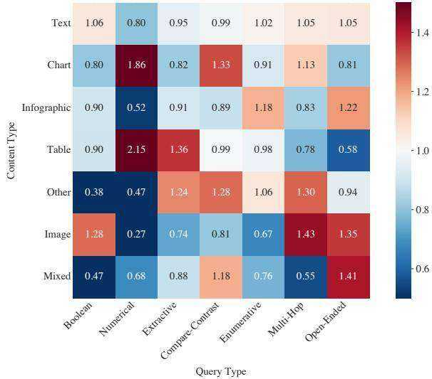  
Figure 13: Lift of query types by content type. Each cell shows the ratio of observed query type frequency to baseline frequency for a given content type. Values ${ > } 1$ indicate over-representation (e.g., tables appear $2 . 1 5 \times$ more in numerical queries than expected), while values $< 1$ indicate under-representation.

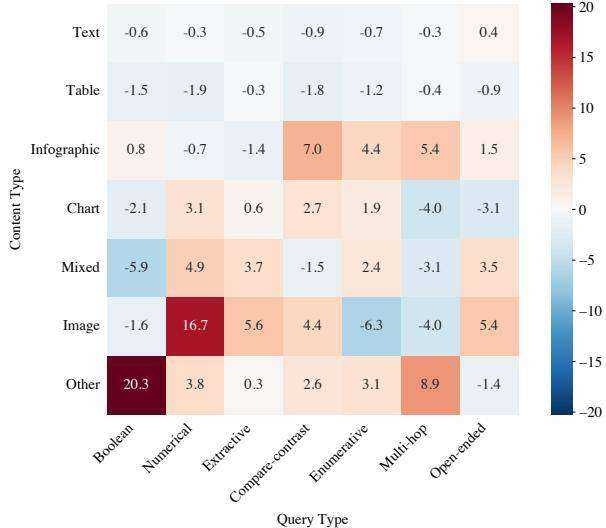  
Figure 14: Residuals from additive performance model. Each cell shows the difference between observed ${ \mathrm { N D C G } } \ @ 1 0$ and the value predicted by an additive model of query type and content type main effects. Values near zero (white) indicate no interaction; positive values (red) indicate better-than-expected performance for that combination; negative values (blue) indicate worse-than-expected.

Table 16: VLM pre-filtering model selection. Evaluated on 697 human-annotated query–page pairs from ViDoRe v2 (Macé et al., 2025) (103 positives, 594 negatives). We selected Qwen2.5-VL-32B as a high-recall sieve to avoid discarding ${ \sim } 2 5 \%$ of relevant documents, leaving final relevance judgments to human annotators.   

<table><tr><td>Model</td><td>Recall</td><td>Precision</td></tr><tr><td>Qwen2.5-VL-32B</td><td>98%</td><td>32%</td></tr><tr><td>Gemini-2.5-Flash</td><td>78%</td><td>81%</td></tr></table>

cally irrelevant decorative items, such as logos, are naturally not targeted by queries.   

<table><tr><td>Query Type</td><td>Before (%)</td><td>After (%)</td><td>∆</td></tr><tr><td>Boolean</td><td>13.88</td><td>16.07</td><td>+2.20</td></tr><tr><td>Compare-Contrast</td><td>13.73</td><td>13.25</td><td>-0.47</td></tr><tr><td>Enumerative</td><td>10.31</td><td>10.16</td><td>-0.15</td></tr><tr><td>Extractive</td><td>17.17</td><td>20.11</td><td>+2.94</td></tr><tr><td>Multi-Hop</td><td>8.27</td><td>8.06</td><td>-0.21</td></tr><tr><td>Numerical</td><td>6.32</td><td>7.42</td><td>+1.10</td></tr><tr><td>Open-Ended</td><td>30.33</td><td>24.93</td><td>-5.41</td></tr></table>

Table 17: Query type distribution before and after VLM filtering.   
Table 18: Query format distribution before and after VLM filtering.   

<table><tr><td>Query Format</td><td>Before (%)</td><td>After (%)</td><td>∆</td></tr><tr><td>Instruction</td><td>31.32</td><td>30.50</td><td>−0.83</td></tr><tr><td>Keyword</td><td>20.00</td><td>17.51</td><td>-2.49</td></tr><tr><td>Question</td><td>48.67</td><td>51.99</td><td>+3.32</td></tr></table>

<table><tr><td>Source</td><td>Text</td><td>Table</td><td>Graphical</td></tr><tr><td>Relevant Pages</td><td>55.52%</td><td>21.20%</td><td>23.28%</td></tr><tr><td>Original Docs</td><td>54.10%</td><td>15.81%</td><td>30.09%</td></tr></table>

Table 19: Modality distribution for relevant pages vs. original documents. The proportion of text, table, and graphical elements is preserved after filtering, confirming that complex visual content is not systematically excluded.

# H Bounding box annotations

Inter-annotator agreement Table 20 shows IoU and F1 scores between human annotations, to detail results of Section 3.3.

Validation on high-agreement pages To further characterize model grounding performance, we restrict evaluation to query–page pairs with high interannotator agreement (mean pairwise $\mathrm { I o U } \geq 0 . 7 )$ .

Table 20: Inter-annotator agreement metrics on bounding box annotations.   

<table><tr><td></td><td colspan="7">English Datasets</td><td colspan="3">French Datasets</td><td></td></tr><tr><td>Metric</td><td>C.S.</td><td>Nucl.</td><td>Fin.</td><td>Phar.</td><td>H.R.</td><td>Ind.</td><td>Tele.</td><td>Phys.</td><td>Ener.</td><td>Fin.</td><td>Average</td></tr><tr><td>IoU</td><td>0.500</td><td>0.476</td><td>0.462</td><td>0.615</td><td>0.474</td><td>0.502</td><td>0.526</td><td>0.443</td><td>0.470</td><td>0.503</td><td>0.497</td></tr><tr><td>F1</td><td>0.608</td><td>0.594</td><td>0.569</td><td>0.720</td><td>0.594</td><td>0.611</td><td>0.637</td><td>0.540</td><td>0.569</td><td>0.581</td><td>0.602</td></tr></table>

On this subset, Qwen3-VL-30B-A3B-Instruct and Gemini 3 Pro achieve both substantially higher than full-set scores, yet still well below human performance (21). This confirms that visual grounding is a genuine open challenge in current models.

Table 21: Model grounding performance comparison between the full evaluation set and the high-agreement subset (mean pairwise $\mathrm { I o U } \geq 0 . 7 $ .   

<table><tr><td>Model</td><td>Evaluation Set</td><td>F1</td><td>IoU</td></tr><tr><td>Qwen3-VL-30B-A3B-Instruct</td><td>Full Set</td><td>0.089</td><td></td></tr><tr><td></td><td>High-Agreement</td><td>0.311</td><td>0.262</td></tr><tr><td>Gemini 3 Pro</td><td>Full Set</td><td>0.065</td><td></td></tr><tr><td></td><td>High-Agreement</td><td>0.208</td><td>0.155</td></tr></table>

Bounding box predictions Figure 27 shows the prompt used to generate final answers with inline bounding boxes for visual grounding, and Figure 15 reports bounding box localization F1 scores by dataset.

# I Final answer evaluation

Evaluation setup Generated final answers are evaluated in a pass $@ 1$ setting using GPT 5.2 with medium reasoning effort as the LLM judge. The judge compares each generated answer against the ground-truth annotation and returns a binary correctness label. The answer generation and judge prompts are shown in Figure 25 and Figure 24 respectively. We evaluated Gemini 3 Pro with low thinking effort, GPT-5 with medium reasoning effort, as well as the thinking version of Qwen3-VL-235B-A22B.

To assess the reliability of our judge, we conducted 5 independent evaluation runs on a fixed set of Gemini $3 \mathrm { P r o }$ outputs. Individual run scores showed minimal fluctuation (mean $7 2 . 0 9 \%$ , $\sigma =$ $0 . 2 2 \% )$ and high internal consistency (Krippendorff’s $\alpha = 0 . 9 1 $ ), confirming that the judge is consistent given a fixed context.

End-to-End Pipeline Stability While the judge demonstrates high consistency on fixed inputs, the full evaluation pipeline introduces a second layer of variability: the model’s generation process. To quantify the end-to-end variance under rigorous conditions, we performed 5 independent runs. For computational efficiency, we restricted this stress test to the most challenging corpus in each language: Industrial Maintenance (English) and $F i$ nance (French).

We measured an average score of $6 5 . 7 4 \%$ with a standard deviation of $0 . 9 4 \%$ . Crucially, the evaluation signal remains robust against generative noise, achieving a Krippendorff’s $\alpha$ of 0.80. This agreement confirms that the end-to-end results are statistically reliable even when subjected to the most difficult evaluation scenarios.

Easy/hard query filtering To classify queries by difficulty, we prompt a panel of 6 LLMs to answer each query without access to any corpus context. We select GPT-5-nano, GPT-5-mini, GPT-5, Qwen3-VL-30B-A3B, Gemini 2.5 Flash, and Gemini $2 . 5 \ \mathrm { P r o }$ to span different model families and capability levels. Each model receives only the query text and is asked to provide a direct answer with the prompt in Figure 23. Answers are evaluated for correctness using the same GPT-5.2 judge described above. A query is labeled easy if at least one model answers correctly, and hard otherwise. Table 22 reports per-model accuracy and the resulting proportion of easy queries for each dataset. The distribution varies substantially across domains: knowledge-intensive datasets such as Computer Science and Physics have over $85 \%$ easy queries, while domain-specific datasets such as Finance and Energy contain fewer than $35 \%$ easy queries, reflecting the specialized nature of their content.

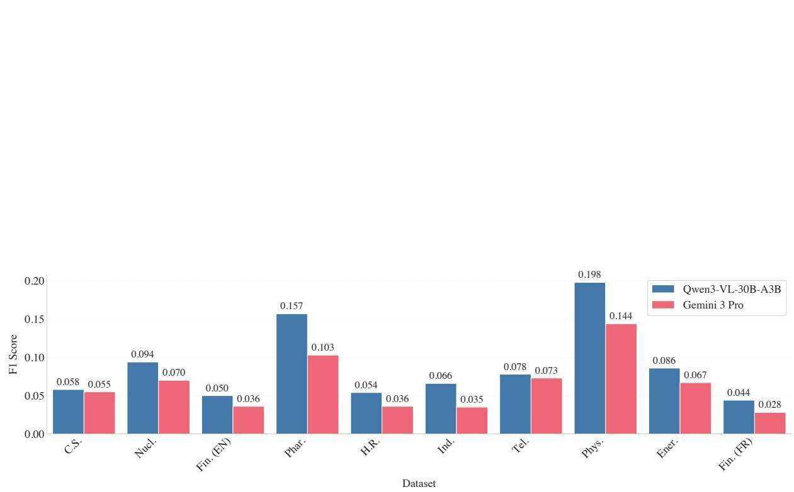  
Figure 15: Model bounding box localization performance. Each F1 score measures the zone-based overlap between model-generated bounding boxes and human annotations, using the annotator yielding the highest F1.

Table 22: Percentage of queries correctly answered by LLMs without corpus context. A panel of 6 LLMs is asked to answer the queries of the 8 public datasets without access to any corpus context. Queries correctly answered by at least one of the 6 models are classified as easy queries, while the rest are labeled as hard. Easy queries account for $4 8 . 6 \%$ of all the queries.   

<table><tr><td></td><td colspan="5">English Datasets</td><td colspan="3">French Datasets</td><td></td></tr><tr><td>Model</td><td>C.S.</td><td>Fin.</td><td>Phar.</td><td>H.R.</td><td>Ind.</td><td>Phys.</td><td>Ener.</td><td>Fin.</td><td>Total</td></tr><tr><td>GPT-5-nano</td><td>74.4</td><td>7.4</td><td>30.5</td><td>12.9</td><td>15.6</td><td>74.2</td><td>14.0</td><td>9.1</td><td>29.8</td></tr><tr><td>GPT-5-mini</td><td>79.1</td><td>13.3</td><td>37.4</td><td>17.6</td><td>20.5</td><td>80.1</td><td>13.6</td><td>13.1</td><td>34.3</td></tr><tr><td>GPT-5</td><td>76.3</td><td>25.2</td><td>50.8</td><td>29.9</td><td>32.2</td><td>80.5</td><td>26.0</td><td>22.2</td><td>42.9</td></tr><tr><td>Qwen3-VL-30B-A3B</td><td>60.9</td><td>3.9</td><td>19.2</td><td>6.3</td><td>9.9</td><td>60.9</td><td>6.8</td><td>4.4</td><td>21.5</td></tr><tr><td>Gemini 2.5 Flash</td><td>66.1</td><td>8.7</td><td>30.8</td><td>13.5</td><td>15.9</td><td>63.6</td><td>14.9</td><td>13.1</td><td>28.3</td></tr><tr><td>Gemini 2.5 Pro</td><td>70.2</td><td>16.8</td><td>29.4</td><td>15.4</td><td>23.7</td><td>63.9</td><td>20.5</td><td>20.0</td><td>32.9</td></tr><tr><td>Easy queries (%)</td><td>86.5</td><td>31.7</td><td>57.1</td><td>36.5</td><td>38.9</td><td>86.4</td><td>32.5</td><td>30.0</td><td>48.6</td></tr></table>

# J Visual grounding examples

# L Prompts

Qualitative analysis reveals distinct failure modes. Gemini frequently produces off-by-one page indexing errors: the predicted coordinates would correctly localize the target content if applied to an adjacent page. The two models also differ in box granularity: Gemini tends to draw tight boxes around individual elements (e.g., a single table cell or text line), whereas Qwen3-VL generates larger boxes encompassing entire sections or paragraphs, more closely matching human annotation patterns. Figures 16 and 17 illustrate these tendencies across four dataset pages: Qwen3-VL’s bounding boxes are comparatively wide and encompass entire page elements (pages (a), (c), and (d)), while Gemini 3 Pro’s visual grounding is more precise (pages (b) and (c)). This difference in granularity partially explains Qwen3-VL’s higher F1 scores, as broader boxes are more likely to overlap with the groundtruth zones used in our evaluation. Both models exhibit errors and omissions: in page (b), the chart is not labeled by Qwen3-VL, and in page (d), Gemini 3 Pro predicts incorrect bounding boxes for the bottom table while Qwen3-VL provides grounding for the wrong table.

# K Instructions given to Annotators

Query Generation Figure 18 details step-bystep instructions to annotators to generate queries from summaries and images.

Query-Page Relevancy linking Figure 19 details the step-by-step instructions provided to annotators for assessing page relevance, identifying content modalities, and localizing evidence via bounding boxes. Table 23 gives the definitions of relevancy scores used by the human annotators.

Table 23: Relevance definitions used for page-level annotations.   

<table><tr><td>Score</td><td>Label</td><td>Definition</td></tr><tr><td>2</td><td>Fully Relevant</td><td>The page contains the complete answer.</td></tr><tr><td>1</td><td>Critically Relevant</td><td>The page contains facts or information required to an- swer the query, though ad- ditional information is re-</td></tr><tr><td>0</td><td>Not Relevant</td><td>quired. Provides no information relevant to the query.</td></tr></table>

All the prompts used for both dataset generation and evaluations are detailed from Figure 20 to Figure 27.

# THE GOLDMAN SACHS GROUP, INC, AND SUBSIDIARIES Management's Discussion and Analysis

# Notes to consolidated financial statements

Corporate Treasury is responsible for our aggregated interest rate risk. including assessing ad monitoring Ea and ve sensitivity, and interest rate risk stress tests and assumptions

Risk, which is part of our second line of defense and reports to monitoring and managing our interest rate risk (including EaR and EVE sensitivity) by providing independent firmwide oversight and challenge across our global businesses.

Stress Testing. Stress testing is a method of determining the effect of various hypothetical stress scenarios. We use stress tests to examine risks of specific portfolios. as well as the potential impact of our significant risk exposures. We use a variety of stress testing techniques to calculate the potential lass from a wide range of market moves on our portfolios. including firmwide stress tests, sensitivity analysis and scenario analysis. The results of our various stress tests are analyzed together for risk management purposes. See "Overview and Structure of Risk Management" for information about firmwide stress tests.

Sensitivity analysis is used to quantify the impact of a market move in a single risk factor across all positions (e.g., equity prices or credit spreads? using a variety of defined market shocks, ranging from thase that could be expected over a oneday time harizon up to those that could take many months to occur. We also use sensitivity analysis to quantify the impact of the default of any single entity. which captures the risk of large or concentrated exposures.

Scenario analysis is used to quantify the impact of a specified event. including how the event impacts multiple risk factors simultaneouslv. For example, for sovereian stress testing we calculate potential direct exposure associated with our soverei positon  wel s the coresponding deb euity a cuency expasures asociate wihur on-soveri When conducting scenario analysis, we often consider a number of possible outcomes for each scenario, ranging from moderate to severely adverse market impacts. In addition, these stress tests are constructed using both historical events and forward-looking hypothetical scenarios.

Unlike VaR measures, which have an implied probability because they are calculated at a specified confidence level. scenarios will occur. Instead. stress testing is used to model both moderate and more extreme moves in underlying marke factors. When estimating potential loss. we generally assume that our positions cannot be reduced or hedced (althouah experience demonstrates that we are generally able to do so)

# Limits

We use market risk limits at various levels to manage the size of our market exposures. These limits are set based on VaR EaR and on a range of stress tests relevant to our exposures See "Overview and Structure of Risk Management" for information about the limit approval process.

Limits are monitored by Corporate Treasury and Risk. Risk is responsible for identifying and escalating to senor management and/or the appropriate risk committee, on a timely basis. instances where limits have been exceeded (e.g.. due to positional changes or changes in market conditions. such as increased volatilities or changes in correlations). Such instances are remediated by a reduction in the positions we hold and/or a temporary or permanent increase to the limit. if wrranted.

# Metrics

We analyze VaR at the firmwide level and a variety or more detailed levels. including by risk category. business an region. Diversification effect in the tables below represents the difference between total VaR and the sum of the VaRs for the Four risk categories. This effect arises because the four marke risk categories are not perfectly correlated. Substantially al positions in VaR are included within Global Banking & Markets.

<table><tr><td colspan="3">The table below presents our average daily VaR.</td></tr><tr><td></td><td colspan="2"></td></tr><tr><td></td><td colspan="2">Yeor Ended December 2024</td></tr><tr><td>in metons Categories</td><td></td><td>202</td></tr><tr><td>eterest rates</td><td>81 $</td><td>96</td></tr><tr><td>iquity prices</td><td>37</td><td>29</td></tr><tr><td>Currekyrates</td><td>26</td><td>24</td></tr><tr><td>corvnodily pricms</td><td>19</td><td>19</td></tr><tr><td>piversification efflect</td><td>(71)</td><td>(69</td></tr><tr><td>Tatal</td><td></td><td>92 $</td><td></td></tr></table>

Our average daily VaR decreased to \$92 million in 2024 from offset by increased exposures. The total decrease wa primarily driven by a decrease in the interest rates category •. !

# Note 27 - Regulatory capital

well-capitalized standards, for the Firm as a consolidated financial holding company. The  establishes simila minimu apal requirements and standards for the Firm's principal IDi subsidiary. PMorgan Chase Bank, N.A.

internationally active U.S. bank holding companies and banks. including the Firm and JPMorgan Chase Bank, N.A. Under the rules currently in effect, two comprehensive approaches are prescribed for calculating RWA: a standardized approach ("Basel III Standardized"), and an advanced approach ("Basel Ill Advanced"]. For each of these risk-based capital ratios. the capital adequacy of the Firm and JMorgan Chase Bank, N.A. is evaluated against the lower of the Standardized or Advanced approaches compared to their respective requlatary capital ratio requirements.

The capital rules under Basel III establish minimum capital ratios and overall capital adequacy standards for large and

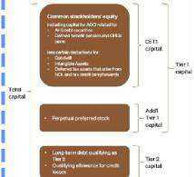  
The three components of regulatory capital under the Basel rules and their primary drivers are as ilustrated below

Under the risk-based capital and leverage-based guidelines of the Federal Reserve, JPMorgan Chase & Co. is required to maintain minimum ratios for CeT1 capital Tier 1 capital Total capital, Tier 1 leverage and the SLR. Failure to meet these minimum requirements could cause the Federal Reserve to take action. PMorgan Chase Bank, N.A. is also subject to these capital requirements established by its primary regulators

The following table presents the risk-based regulatory capital ratio reguirements and well-capitalized ratips to which the Firm and on Cha Bn .  bc   Dec, 204 and 2023.

<table><tr><td></td><td colspan="2">St ecadined capital</td><td colspan="2">Advanced capiltal ration reouirements</td><td colspan="2">Well-capitalized ratics</td></tr><tr><td></td><td>DHC</td><td>IDPO</td><td>BH4CIN4</td><td>IDI</td><td>BHCK</td><td>ID</td></tr><tr><td colspan="7">Risk-based capital ratios</td></tr><tr><td>CET1 capital</td><td>12.3 %</td><td>7.0 %</td><td>11.5 %</td><td>7.0 %</td><td>NA</td><td>6.5 %</td></tr><tr><td>Tier 1 capital</td><td>13.8</td><td>8.5</td><td>13.6</td><td>6.5</td><td>6.0 %</td><td>8.0</td></tr><tr><td>Total capital</td><td>15.8</td><td>10.5</td><td>15.6</td><td>10.5</td><td>10.0</td><td>10.0</td></tr></table>

NTebbov  asdefnd b  gulat issd y te Fel subject

C T en    hag  . ua Merhod  plus a 3. SCB for Basel  Standndle ratios and a fixed 2.5%

114% 12.9%, and 14.95% respectively: the Basel  adyanced CET1. Ter 1. and Tal capital rati reuirements appicable to the Fir were 11.0% 12.5%. an

issued by the Federal Reserve   
issued under the FiC Imonevement Act.

Total capital ratio requirements include a fixed capital censervatien buffer Chase Bank, N.A. is not subject to the GSiB surcharge

The following table presents the leverage-based regulatory capita ratio requirements and well-capitalized ratios to which the Firm and IPMorgan Chase Bank. N.A. were subiect as of December 31. 2024 and 2023.

<table><tr><td></td><td colspan="2">cartal ratioi</td><td colspan="2">Well-capitalized ratios</td></tr><tr><td></td><td>BHC</td><td>IDI</td><td>BHC8)</td><td>IDI</td></tr><tr><td>Leverage-based capital ratios</td><td></td><td></td><td></td><td></td></tr><tr><td>Tier 1 leverage</td><td>4.0 %</td><td>4.0 %</td><td>NA</td><td>5.0 %</td></tr><tr><td></td><td>.</td><td>6.0</td><td>NA</td><td>6.0</td></tr></table>

(a) Represents minimum SUR requirement of 3.0%, as well as supplementary leveroge buffer reeuirements of 2.0% end 3.0% for BHC and JPMergan Chose Bani. N.A. respectively.   
(b)The Federal Reserue's requations do not establish well-capitalized thresholds fo

Te bond  e uat s y Reserve, OCC and FoiC and te which the Flin and JMorgan Chase Bank, N.A. are subject.

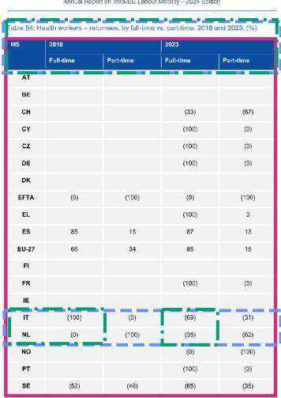  
Moter Nictances arc detined as notoralo who hove ow erMatny Source EU-LFS 2024, custom extraction by Mileu

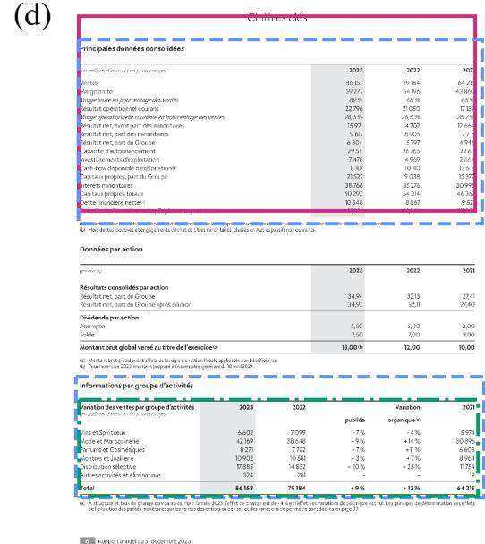  
Figure 16: Visual grounding comparative examples for Qwen3-VL-30B-A3B. Each panel shows a document page with Qwen3-VL’s predicted bounding boxes (solid magenta) and human bounding boxes (dashed blue and green, one color per annotator). Corresponding datasets and queries: (a) finance_en: What was the average daily Value at Risk (VaR) for Goldman Sachs during 2024?, (b) finance_en: List the 3 components of regulatory capital under Basel III, and determine the role of each component., (c) hr_en: Analyze how full-time employment among returning health workers evolved in the Netherlands and Italy from 2018 to 2023, and describe the differences in their employment trends., (d) finance_fr: Croissance Mode Maroquinerie vs Vins Spiritueux 2023 performance

# THE GOLDMAN SACHS GROUP, INC, AND SUBSIDIARIES Management's Discussion and Analysis

# Notes to consolidated financial statements

Corporate Treasury is responsible for our aggregated interest rate risk. including assessing ad monitoring Ea and ve sensitivity, and interest rate risk stress tests and assumptions

Risk, which is part of our second line of defense and reports to monitoring and managing our interest rate risk (including EaR and EVE sensitivity) by providing independent firmwide oversight and challenge across our global businesses.

Stress Testing. Stress testing is a method of determining the effect of various hypothetical stress scenarios. We use stress tests to examine risks of specific portfolios. as well as the potential impact of our significant risk exposures. We use a variety of stress testing techniques to calculate the potential lass from a wide range of market moves on our portfolios. including firmwide stress tests, sensitivity analysis and scenario analysis. The results of our various stress tests are analyzed together for risk management purposes. See "Overview and Structure of Risk Management" for information about firmwide stress tests.

Sensitivity analysis is used to quantify the impact of a market move in a single risk factor across all positions (e.g., equity prices or credit spreads? using a variety of defined market shocks, ranging from thase that could be expected over a oneday time harizon up to those that could take many months to occur. We also use sensitivity analysis to quantify the impact of the default of any single entity. which captures the risk of large or concentrated exposures.

Scenario analysis is used to quantify the impact of a specified event. including how the event impacts multiple risk factors simultaneouslv. For example, for sovereian stress testing we calculate potential direct exposure associated with our sovere poston  wel s the coresponding debeuity a cuency expasures asociate wihur on-soveri When conducting scenario analysis, we often consider a number of possible outcomes for each scenario, ranging from moderate to severely adverse market impacts. In addition, these stress tests are constructed using both historical events and forward-looking hypothetical scenarios.

Unlike VaR measures, which have an implied probability because they are calculated at a specified confidence level. scenarios will occur. Instead. stress testing is used to model both moderate and more extreme moves in underlying marke factors. When estimating potential loss. we generally assume that our positions cannot be reduced or hedced (althouah experience demonstrates that we are generally able to do so)

# Limits

We use market risk limits at various levels to manage the size of our market exposures. These limits are set based on VaR EaR and on a range of stress tests relevant to our exposures See "Overview and Structure of Risk Management" for information about the limit approval process.

Limits are monitored by Corporate Treasury and Risk. Risk is responsible for identifying and escalating to senor management and/or the appropriate risk committee, on a timely basis. instances where limits have been exceeded (e.g.. due to positional changes or changes in market conditions. such as increased volatilities or changes in correlations). Such instances are remediated by a reduction in the positions we wrranted.

# Metrics

We analyze VaR at the firmwide level and a variety of more detailed levels. including by risk category. business and region. Diversification effect in the tables below represents the difference between total VaR and the sum of the VaRs for the four risk categories. This effect arises because the four market risk categories are not perfectly correlated. Substantially all positions in VaR are included within Global Banking & Markets.

The table below presents ur average daily VaR. .   

<table><tr><td></td><td colspan="2">Yeor Unded December</td></tr><tr><td>s in mitons</td><td>2024</td><td>202</td></tr><tr><td>Categories</td><td></td><td></td></tr><tr><td>Interest rates</td><td>81 $</td><td>96</td></tr><tr><td>Fquity prices</td><td>37</td><td>29</td></tr><tr><td>Currency rates</td><td>26</td><td>24</td></tr><tr><td>Commodily prioes</td><td>19</td><td>19</td></tr><tr><td>Diversification efect</td><td>(71)</td><td>(69</td></tr><tr><td>Total</td><td></td><td></td></tr></table>

Dur averae daily V decreased to \$2 million in 2024 fron offset by increased exposures. The total decrease wa actiall.effset bu.an increase in.the.eavit.nrices.categer

# Note 27 - Regulatory capital

well-capitalized standards, for the Firm as a consolidated financial holding company. The  establishes simila minimu apal requirements and standards for the Firm's principal IDi subsidiary. PMorgan Chase Bank, N.A.

The capital rules under Basel III establish minimum capital ratios and overall capital adequacy standards for large and

internationally active U.S. bank holding companies and banks. including the Firm and JPMorgan Chase Bank, N.A. Under the rules currently in effect, two comprehensive approaches are prescribed for calculating BwA: a standardized annroach ("Basel p

Standardized"), and an advanced approach ("Basel Ill Advanced"] For each of these risk-based capital ratios. the capital adequacy of the Firm and JMorgan Chase Bank, N.A. is evaluated against the their respective requlatary capital rati requirements

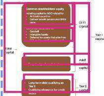  
rules and their primary drivers are as illustrated below:

Under the risk-based capital and leverage-based guidelines of the Federal Reserve, JPMorgan Chase & Co. is required to maintain minimum ratios for CeT1 capital Tier 1 capital Total capital, Tier 1 leverage and the SLR. Failure to meet these minimum requirements could cause the Federal Reserve to take action. JPMorgan Chase Bank, N.A. is also subject to these capital requirements established by its primary regulators.

The following table presents the risk-based regulatory capital ratio reguirements and well-capitalized ratips to which the Firm and on Cha Bn .  bc   Dec, 204 and 2023.

<table><tr><td></td><td colspan="2">St ecadined capital</td><td colspan="2">Advancecd capiltal ratio reouirements</td><td colspan="2">Well-capitalized ratics</td></tr><tr><td></td><td>DHC</td><td>IDPO</td><td>BH4CIN4</td><td>IDI</td><td>BHCK</td><td>ID</td></tr><tr><td colspan="7">Risk-based capital ratios</td></tr><tr><td>CET1 capital</td><td>12.3 %</td><td>7.0 %</td><td>11.5 %</td><td>7.0 %</td><td>NA</td><td>6.5 %</td></tr><tr><td>Tier 1 capital</td><td>13.8</td><td>8.5</td><td>13.6</td><td>6.5</td><td>6.0 %</td><td>8.0</td></tr><tr><td>Total capital</td><td>15.8</td><td>10.5</td><td>15.6</td><td>10.5</td><td>10.0</td><td>10.0</td></tr></table>

NTebbov  asdefnd b  gulat issd y te Fel subject

C T en    hag  . ua Merhod  plus a 3. SCB for Basel  Standndle ratios and a fixed 2.5%

C 114% 12.9%, and 14.95% respectively: the Basel  adyanced CET1. Ter 1. and Tal capital rati reuirements appicable to the Fir were 11.0% 12.5%. an

issued by the Federal Reserve   
issued under the FiC Imonevement Act.

Total capital ratio requirements include a fixed capital censervatien buffer Chase Bank, N.A. is not subject to the GSiB surcharge

The following table presents the leverage-based regulatory capita ratio requirements and well-capitalized ratios to which the Firm and IPMorgan Chase Bank. N.A. were subiect as of December 31. 2024 and 2023.

<table><tr><td></td><td colspan="2">cartal ratioi</td><td colspan="2">Well-capitalized ratios</td></tr><tr><td></td><td>BHC</td><td>IDI</td><td>BHC8)</td><td>IDI</td></tr><tr><td>Leverage-based capital ratios</td><td></td><td></td><td></td><td></td></tr><tr><td>Tier 1 leverage</td><td>4.0 %</td><td>4.0 %</td><td>NA</td><td>5.0 %</td></tr><tr><td></td><td>.</td><td>6.0</td><td>NA</td><td>6.0</td></tr></table>

N Te bbov sdfnd  e guat isd y e l subject.

(a) Represents minimum SUR requirement of 3.0%, as well as supplementary leveroge buffer reeuirements of 2.0% end 3.0% for BHC and JPMergan Chose Bani. N.A. respectively.   
(b)The Federal Reserue's requations do not establish well-capitalized thresholds fo these measures for BHCs.

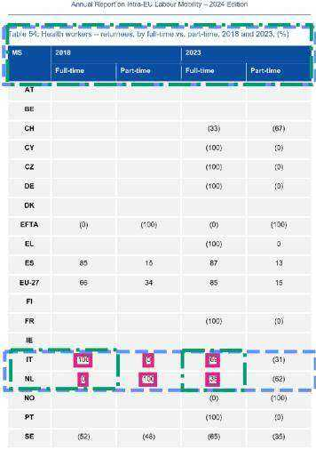  
Moter Nietamces arc detined as notocalo who hove ow erMatny Source EU-LFS 2024, custom extraction by Milkeu   
Figure 17: Visual grounding comparative examples for Gemini 3 Pro. Each panel shows a document page with Gemini’s predicted bounding boxes (solid magenta) and human bounding boxes (dashed blue and green, one color per annotator). Corresponding datasets and queries: (a) finance_en: What was the average daily Value at Risk (VaR) for Goldman Sachs during 2024?, (b) finance_en: List the 3 components of regulatory capital under Basel III, and determine the role of each component., (c) hr_en: Analyze how full-time employment among returning health workers evolved in the Netherlands and Italy from 2018 to 2023, and describe the differences in their employment trends., (d) finance_fr: Croissance Mode Maroquinerie vs Vins Spiritueux 2023 performance

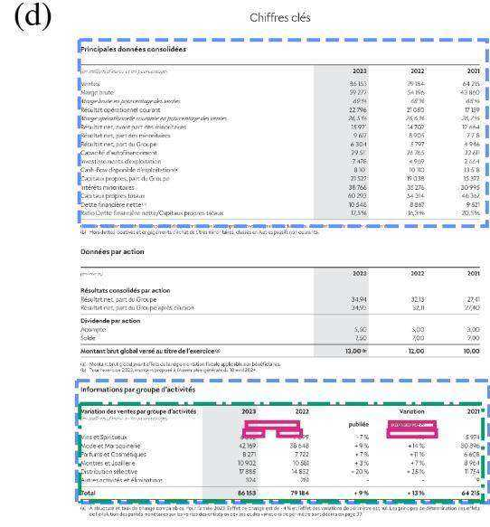

# Step 1

The annotator will be provided with content(text summary or image(s)) and a list of instructions on the queries that are expected.

# Step 2 Read and analyse the content.

# # Step 3

The annotator writes a series of queries that can, supposedly, be answered by the summarized content. It is okay if the information needed to answer the question is in other parts of the document or not explicitly written in the summary.

- If the summary is not adapted to a specific type or format of questions, the annotato - They should follow the number of queries asked for each category. - They should follow the expected type of queries provided and the format.

In this task, the annotator will be provided with a query and pages that are supposed to be relevant to answer the query. The annotator’s goal is to rate the relevance in answerability of each page with respect to the query.

Step 1: Review the query and pages to get an understanding of the content and domain # Step 2: Rate the query quality. - If adheres to guidelines $>$ Good (1) - If doesn’t adhere to guidelines> Poor(0) - If the query is Poor quality, skip the task.

# Step 3:

For each page, rate the relevance with respect to the query   
If page completely answer query $>$ Fully Relevant(2)   
- If page contains information required to answer the query $>$ Critically Relevant(1)   
- If page contains no relevant information $>$ Not Relevant(0)   
# Step 4: - For each page, annotate the modalities in which the relevant information is located concerning the query-page link, relevant information can be located in multiple modalities at the same time:   
Modality : [“text”, “table”, “chart”, infographic”, “image”, “other”] - If relevance score $= ~ 0$ , modality may be “N/A”

- For each page, draw bounding boxes around the relevant text/chart/image/infographic (if any) - If relevance score $= ~ 0$ , do not draw a bounding box

# Step 6: - Repeat steps 3, 4 and 5 for all pages # Step 7: - Propose an answer to the query, given the relevant pages. - If the query is not answerable, rate it as “unanswerable”

<mission>

You are an assistant specialized in visual document understanding tasks. You will be given a context, summarizing the content of a section or multiple document sections. Your goal is to carefully analyze the context and to solve a series of tasks related to its content. You are tasked with generating query-answer pairs. Your queries will be used to simulate a user unfamiliar with the specific content of the page, and who is looking for information in a large knowledge base through a search engine. The user does not have access to the document and is looking for information that can be present in any document in the knowledge base.

</mission> <definitions>

- A query is said to be fully answerable if the page contains a precise and complete answer to the query.

- A query is said to be partially answerable if the page contains relevant information that is directly related to the query but some key information is missing and must be retrieved in other pages or documents in order to give a precise and complete answer.

- An open-ended query is an explanatory or descriptive query that synthesizes information; may be broad in scope and focused on qualitative aspects of the summary

- A compare-contrast query is a query that requires comparing and/or contrasting multiple entities o topics that are closely related to each other

- An enumerative query is a query that asks to list all examples that possess a common property, optionally requesting details about the specifics of each example.

- A numerical query is a query that asks for a specific number or calculated number given a summary.   
The query should require more than simply reading numbers directly from the page.

oolean query is a yes/no query that may involve multiple steps of reasoning.

- An extractive query is a clear and specific query that can be answered using only a specific piece of information.

- A multi-hop query is a complex query that requires retrieving and integrating information from multiple sources or steps to produce a complete answer.

- A question query is a complete sentence that ends with a question mark, typically used to seek specific information or clarification.

- A keyword query is a brief, often fragmented phrase or set of terms used to search or filter information, without forming a full grammatical sentence.

- An instruction query is a directive that describes a task to be performed on the documents, often in the form of a command or request.

</definitions> <rules> <queries>

- Generate queries only in {{ language $\} \}$ .

- Make queries diverse, natural, and plausible for someone unfamiliar with the document. - Each query must be standalone; do not reference “the page”, “the table”, “the figure”, “the document”, “the text”, “the table of contents”, etc.

- Rephrase; avoid copying wording from the source so semantic matching, not surface matching, is tested.

- You may include queries about relationships or trends often shown in tables/figures/graphs, but never refer to a specific table/figure.

- Avoid overly generic queries that apply to any document.   
- Keep each query concise ({{ length $\} \}$ words).   
- When appropriate, write multi-hop queries that integrate information across the provided pages. </queries>   
</rules>   
<instructions> Used Documents: {{ document_names }}   

   
{{summary}}   

   
Using the provided context, generate a {{ difficulty $\} \}$ , $\{ \{$ reasoning_type $\} \}$ , $\{ \{$ answerability $\} \}$ query. The query should be {{ query_type $\} \}$ using the provided context and have the format of a {{ query_format $\} \}$ query.   
The query should be self-sufficient and related to the context.   
</instructions>

<mission>

You are an assistant specialized in visual document understanding tasks. You will be given a document page by page and a question. Your goal is to carefully analyze the page and say if it is related to the question's answer. You are tasked with generating question-page affiliation as well as the question answer if it exists in the page.

<definitions>

- A question is said to be fully answerable if the corresponding page contains a precise and complete answer to the question.

- A question is said to be partially answerable if the corresponding page content is necessary to answer the question but some key information is missing.

- A question is said to be unanswerable if the corresponding page contains information related to the question's topic or domain but upon closer inspection does not contain information that is useful to answer the question. Or if the page has no link whatsoever with the query. </definitions>

<rules>

- Be sure to put the relevance (and only that) between the tags <relevance>...</relevance>. The possible values are:

<relevance>fully answerable</relevance>, <relevance>partially answerable</relevance> <relevance>unanswerable</relevance>.

- Be very careful when doing your page affiliation. Only say a page is relevant when it really is. </page_affiliation>

<answers>

- You must generate the answer between the tags <answer>...</answer>. Between these tags, you should only put the answer to the question.

- You must generate answers in the following language: {language} - Your answers should be complete sentences.

Return if the following question is "fully answerable" "partially answerable" or "unanswerable" based on the content of the page between the tags <relevance> ... </relevance>.

</instructions>

You are given a set of document pages (images), a query, and a list of one or more proposed answers.

Query :

{{ query }}

Proposed Answers:

{{ answers }}

Your task is to carefully analyze the provided pages, the query, and the proposed answers. You must return a single, syntactically correct JSON object with the following structure: \`json

{ "reasoning": "<string>", "information_in_pages": <true or false>, "answer_correctness": [<true or false>, ...], "reformulated_answer": "<string>"   
}

Instructions for each field:

- reasoning: Explain the logic for each boolean in the \`answer_correctness\` list. For each proposed answer, state why it is correct or incorrect, citing specific evidence from the document pages.

- information_in_pages: Set to \`true\` if the information needed to definitively answer the query is present in the pages. Otherwise, set to \`false\`.

- answer_correctness: A list of booleans, corresponding to each proposed answer in the original order. Use \`true\` if the answer is verifiably correct based on the pages and \`false\` otherwise.

- reformulated_answer: A single string containing the most precise and correct answer to the query, derived only from information in the pages. If any of the proposed answers are correct, use them as a basis for synthesizing this improved answer. The reformulation must be concise and factual.

Important rules:   
- Base your entire analysis strictly on the content of the provided document pages. Do not use outside knowledge.

- Do not invent, infer, or assume information that is not explicitly stated in the pages.

- Always provide a string for the \`reformulated_answer\`, even if no correct answer can be formed from the text.

- Your final output must be only the JSON object.

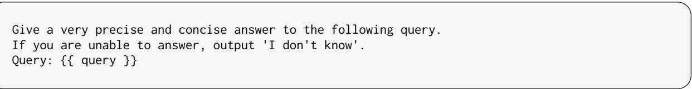  
Figure 22: Prompt used to merge human annotators answers   
Figure 23: Easy/hard query filtering prompt

You are an expert judge evaluating the accuracy of a test answer against a gold-standard true answer. Your goal is to determine if the test answer captures the essential "core information."

### Evaluation Criteria:

- Correct: The test answer contains all core information of the true answer. Minor omissions of non-essential details or the addition of minor, non-contradictory information should still be marked as "Correct."   
- Partially Correct: The test answer captures some of the core information, but suffers from significant omissions or includes substantial extra information that was not requested or present in the true answer.   
- Incorrect: The test answer is fundamentally wrong, contradicts the true answer, or misses the core information entirely.

### Input Data: Query: {{ query }}

True Answer: {{ true_answer} }

Test Answer: {{ test_answer }}

### Output Format:   
Provide a very brief explanation for your judgment. You must output your final response in a JSON format with two fields: "explanation" and "judgment" (which must be "Correct", "Partially Correct", or "Incorrect").

  
Figure 24: Judge prompt used for end to end evaluation   
Figure 25: Answer generation prompt used for end to end evaluation   
Figure 26: Query translation from English to French prompt

English text to translate: {{ query }}

Translate the English text above to French.   
Make sure you follow the format of the English text. Don't change acronyms.   
Follow the following json schema. # Role and Objective   
- Serve as an expert in document analysis and visual grounding.   
- Given a query and multiple document page images, provide a natural language answer with inline grounding references.

# Instructions

- Analyze all provided pages to answer the query comprehensively. - For each piece of information used in your answer, provide visual grounding by including bounding box coordinates of all the sections of the document that help answer the query. - Use this format to include the list of all bounding boxes of image N: <bboxes image="N">[[x_{min}, y_{min}, x_{max}, y_{max}], ...]</bboxes>

- image="N" specifies the $\boldsymbol { \theta }$ -indexed page number ( $\scriptstyle { 0 = 1 }$ first page, $1 =$ second page, etc.)   
- Include bounding boxes inline in your answer, immediately after mentioning the relevant information   
- A given page may contain multiple non-contiguous sections that help answer the query. In this case, you must output the list of the bounding boxes of all these sections.   
- You must group all the bounding boxes of a given page into a single   
<bboxes image="N">...</bboxes> tag.

# Grounding Principles

- DO NOT output more than 5 bounding boxes per page.   
- Adjacent logical units must be enclosed in a single, continuous bounding box.   
- Return multiple bounding boxes only if information is clearly independent and separated by significant non-relevant content.

# Output Format

- Provide a natural language answer to the query.   
Embed grounding tags directly inline where relevant information is discussed. Example: "The valuation technique described on page 1   
<bboxes image $= " 0 " > [ [ 1 2 0$ , 450, 890, 670], [100, 800, 330, 960]]</bboxes> uses discounted cash flow analysis."