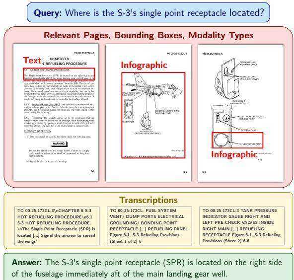
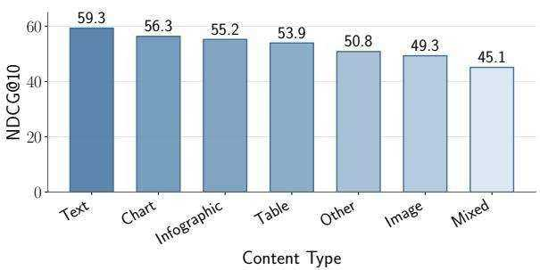
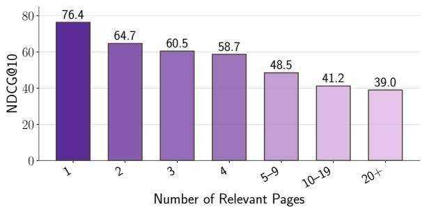

# ViDoRe V3: A Comprehensive Evaluation of Retrieval Augmented Generation in Complex Real-World Scenarios

António Loison\* † Quentin Macé∗1,3 Antoine Edy∗1   
Victor Xing1 Tom Balough2 Gabriel Moreira2 Bo Liu2 Manuel Faysse3† Céline Hudelot3 Gautier Viaud1   
1Illuin Technology 2NVIDIA 3CentraleSupélec, Paris-Saclay {quentin.mace, antoine.edy, gautier.viaud}@illuin.tech‡

# Abstract

Retrieval-Augmented Generation (RAG) pipelines must address challenges beyond simple single-document retrieval, such as interpreting visual elements (tables, charts, images), synthesizing information across documents, and providing accurate source grounding. Existing benchmarks fail to capture this complexity, often focusing on textual data, single-document comprehension, or evaluating retrieval and generation in isolation. We introduce ViDoRe V3, a comprehensive multimodal RAG benchmark featuring multi-type queries over visually rich document corpora. It covers 10 datasets across diverse professional domains, comprising 26,000 document pages paired with 3,099 human-verified queries, each available in 6 languages. Through 12,000 hours of human annotation effort, we provide high-quality annotations for retrieval relevance, bounding box localization, and verified reference answers. Our evaluation of state-of-the-art RAG pipelines reveals that visual retrievers outperform textual ones, late-interaction models and textual reranking substantially improve performance, and hybrid or purely visual contexts enhance answer generation quality. However, current models still struggle with non-textual elements, open-ended queries, and fine-grained visual grounding. To encourage progress in addressing these challenges, the benchmark is released under a commercially permissive license1.

# 1 Introduction

Retrieval-Augmented Generation (RAG) (Lewis et al., 2021) has become the dominant paradigm for knowledge-intensive NLP tasks (Gao et al., 2024; Fan et al., 2024). Yet practical deployments introduce complexities that academic benchmarks often overlook when focusing on singledocument textual retrieval. First, documents encode critical information in visual elements such as tables, charts, and images designed for human interpretation, which text-only pipelines often ignore (Abootorabi et al., 2025; Cho et al., 2024a). Second, user queries often require open-ended synthesis, comparison, and reasoning over scattered information, not simple factoid lookup (Tang and Yang, 2024; Conti et al., 2025; Thakur et al., 2025). Third, trustworthy systems must ground responses to specific source locations (e.g., bounding boxes), to mitigate hallucinations (Gao et al., 2023; Ma et al., 2024b).

  
Figure 1: ViDoRe V3 sample. Each query is annotated with the relevant pages, a document-grounded answer, bounding boxes localizing supporting evidence and modality labels for each bounding box. Documents are provided in image, text and PDF formats.

Existing benchmarks leave these requirements only partially addressed. Early Visual Document Understanding (VDU) benchmarks focus on singlepage comprehension, ignoring the complexity of large document corpora (Mathew et al., 2021b). Recent retrieval-centric benchmarks do not evaluate generation quality and grounding (Faysse et al., 2025; Günther et al., 2025). Some multimodal datasets attempt to bridge this gap but rely on extractive, short-answer tasks that fail to exercise complex reasoning (Cho et al., 2024b), or lack multilingual diversity and fine-grained visual grounding (Peng et al., 2025).

To address these limitations, we introduce ViDoRe V3, a benchmark designed for complex and realistic end-to-end RAG evaluation on visually rich document corpora. Our contributions are:

1. A Human Annotation Methodology for Realistic Queries We propose an annotation protocol for generating diverse queries and fine-grained query-page annotations. By restricting annotator access to document content during query formulation, we capture authentic search behaviors and mitigate bias toward simple extractive queries. Vision-Language Model (VLM) filtering combined with human expert verification enables efficient, highquality annotation at scale.

2. The ViDoRe V3 Benchmark Applying this methodology to 10 industry-relevant document corpora, we build ViDoRe V3, a multilingual RAG benchmark comprising 26,000 pages and 3,099 queries, each available in 6 languages. Two datasets are held out as a private test set to mitigate overfitting. The benchmark is fully integrated into the MTEB ecosystem and leaderboard2 (Muennighoff et al., 2023), and the public datasets are released under a commercially permissive license.

3. Comprehensive Evaluation and Insights Leveraging our granular annotations, we benchmark state-of-the-art models on (i) retrieval accuracy by modality and language, (ii) answer quality across diverse retrieval pipeline configurations, and (iii) visual grounding fidelity. Our analysis surfaces actionable findings for RAG practitioners.

# 2 Related Work

Component-Level Benchmarks (VDU and Retrieval) VDU has traditionally relied on singlepage datasets like DocVQA (Mathew et al., 2021b), alongside domain-specialized variants (Mathew et al., 2021a; Zhu et al., 2022; Wang et al., 2024). These ignore the multi-page context inherent to RAG. Recent work evaluating bounding-box source grounding (Yu et al., 2025b) proposes singlepage and multi-page tasks but does not address the retrieval component. Conversely, the emergence of late-interaction visual retrievers (Ma et al., 2024a; Faysse et al., 2025; Yu et al., 2025a; Xu et al., 2025) spurred the creation of retrieval-centric visual benchmarks like Jina-VDR (Günther et al., 2025) and ViDoRe V1&V2 (Faysse et al., 2025; Macé et al., 2025), but none of these benchmarks jointly evaluate retrieval and answer generation.

End-to-End Multimodal RAG While recent textual RAG benchmarks now capture complex user needs like reasoning or summarizing (Thakur et al., 2025; Tang and Yang, 2024; Su et al., 2024), multimodal evaluation often remains limited to single page queries (Faysse et al., 2025). Multi-page datasets like DUDE (Van Landeghem et al., 2023), M3DocRAG (Cho et al., 2024a), ViDoSeek (Wang et al., 2025) or Real-MM-RAG (Wasserman et al., 2025) prioritize extractive retrieval, lacking the diversity of queries encountered in realistic settings. UniDocBench (Peng et al., 2025) represents a concurrent effort that similarly addresses diverse query types and provides comparative evaluation across multiple RAG paradigms. While this benchmark offers valuable contributions, it relies on synthetically generated queries via knowledge-graph traversal, is restricted to English documents, and constrains grounding annotations to parsed document elements. In contrast, our benchmark offers several complementary strengths: fully human-verified annotations, a cross-lingual setup, free-form bounding box annotations, and a more systematic evaluation of individual visual RAG pipeline components.

# 3 Benchmark Creation

We design the benchmark to mirror the diversity of information retrieval situations in large-scale realistic environments. To enable pipeline-agnostic evaluation of the 3 core RAG components (retrieval, generation and grounding), while avoiding limitations of synthetic benchmarks, we employ a rigorous three-stage human-in-the-loop annotation process involving document collection, query generation and grounded query answering (Figure 2).

# 3.1 Document Collection

We curate 10 diverse corpora by manually selecting openly-licensed documents from governmental, educational, and industry sources, focusing on English and French documents (7 and 3 corpora respectively). The corpora span Finance, Computer Science, Energy, Pharmaceuticals, Human

  
Figure 2: Overview of the benchmark creation process. Queries are sourced from 3 streams: human extractive (using raw pages), human blind contextual (using summaries to mitigate extractive bias), and synthetic blind contextual. For each query, a VLM pre-filtered subset of candidate pages is labeled by 1–3 human annotators that perform relevance scoring, bounding box localization and answer generation. A final response aggregation combines annotator answers into a single answer.

Resources, Industrial Maintenance, Telecom, and Physics. Each features domain-specific terminology and document structures representative of realistic retrieval tasks (details in Table 6).

# 3.2 Query Generation

Query Taxonomy To evaluate document visual retrieval systems across diverse realistic scenarios, we develop a query taxonomy with two orthogonal dimensions: Query Type, defining the user’s information need, and Query Format, describing the query’s syntactic structure. This dual-axis classification enables more nuanced performance analysis than benchmarks focusing solely on interrogative extractive queries. We define 7 Query Types: openended, extractive, numerical, multi-hop, comparecontrast, boolean, and enumerative, and 3 Query Formats: question, keyword, and instruction.

Context Preparation We further ensure query diversity by pulling summaries from a heterogeneous set of contexts during the generation process. Two types of input contexts are used: specific document sections that target local information retrieval and cross-section summaries that target multi-document context retrieval. These summaries are produced through a refined process inspired by ViDoRe V2 (Macé et al., 2025). First, the text is extracted from PDFs using Docling (Auer et al., 2024) along with image descriptions. Then, summaries are generated with Qwen3- 235B-Instruct (Qwen Team, 2025) from each document section. They are clustered to group similar summaries together using Qwen3-Embedding-0.6B (Zhang et al., 2025) as embedder, UMAP (McInnes et al., 2020) for dimension reduction and HDBSCAN (Campello et al., 2013) for clustering. Additionally, cross-section summaries are produced by synthesizing the summaries of 2 to 3 randomly selected sections per cluster. From this pool of summaries, a final subset is curated to maintain a strict balance between single-section and cross-section summaries. The selection also ensures an even distribution across section modalities (text, images, and tables) as defined by the Docling element classification.

Synthetic Query Generation Queries are generated from the summaries using a first synthetic generation pipeline based on Qwen3-235B. For each summary, a prompt is constructed by sampling a query type and format at random, together with variable attributes such as length and difficulty, in order to promote diversity. The generated queries are subsequently evaluated by the same LLM acting as an automatic judge, which filters outputs according to 4 criteria: information richness, domain relevance, clarity and adherence to query type/format. Finally, $50 \%$ of the retained queries are rephrased to further enhance linguistic variance. This pipeline is implemented using NeMo Data Designer (NeMo Data Designer Team, 2025) to facilitate generation scaling.

Human Query Writing Human annotators are provided 2 kinds of contexts: synthetic summaries or specific PDF pages. They are tasked with generating one query following a specific query type and format and one query of their choice that is most adapted to the context provided.

# 3.3 Answer Detection and Generation

Queries are filtered and linked to relevant pages using a hybrid pipeline of VLM pre-filtering and human annotation. It is followed by human answer annotation and visual grounding.

Query-Page Linking Given the scale of our corpora, manual verification of each page relevance for each query is intractable. We therefore adopt a twostage annotation pipeline. First, Qwen2.5-VL-32B-Instruct (Bai et al., 2025) pre-filters candidate pages by assessing whether each page image is relevant to the query. Queries whose answers span more than 30 flagged pages are discarded. Human annotators then review the remaining query-page pairs, evaluating query quality and rating page relevance on a three-point scale (Not Relevant, Critically Relevant, Fully Relevant). We selected Qwen2.5-VL-32B-Instruct for its high recall, prioritizing coverage over precision and leaving final relevance judgments entirely to human annotators (see Appendix G for details and distributional validation).

Relevant Page Selection To ensure annotation quality, each task is completed by multiple annotators and reviewed by annotation supervisors. Since

VLM pre-filtering biases the distribution toward relevant pages, we report Gwet’s AC2, as it remains stable under prevalence skew, at 0.760 (see Section D for dataset-level breakdowns). Given this strong but imperfect agreement, we implement a tiered review process: extractive queries require at least one annotator and one reviewer, while more complex non-extractive queries require at least two annotators and one reviewer. A page is retained as relevant if marked by either (i) one annotator and one reviewer, or (ii) at least two annotators.

Answer Generation For each selected query, annotators were tasked with writing an answer based on the pages they marked as relevant. Given that different annotators might have different answer interpretations and tend not to be exhaustive in their answers, we use Qwen2.5-VL-32B-Instruct to generate a final answer based on the relevant page images marked by the annotators and their answers. To validate that this aggregation faithfully preserves annotator intent, we evaluated the VLMaggregated answer against individual annotator responses using a GPT-5.2 judge to assess factual consistency. The aggregated answer matched the exact informational content (with minor paraphrasing) of at least one annotator’s response in $8 6 . 3 \%$ of cases, confirming the VLM predominantly acts as a selector. For the remaining $1 3 . 7 \%$ of divergent cases, manual review of a random subset showed the aggregated answer was judged superior in most cases, either by merging complementary information from two incomplete responses or by correcting verifiable factual errors in individual annotations.

Bounding Boxes and Modality Types For each relevant page, annotators delineate bounding boxes around content supporting the query and attribute a modality type to each bounding box: Text, Table, Chart, Infographic, Image, Mixed or Other. Because multiple valid interpretations of bounding boxes can exist, we perform a consistency study to evaluate inter-annotator agreement and establish a human performance upper bound for the task.

We compute inter-annotator agreement on the subset of query-page pairs labeled by two or three annotators. For each annotator, we merge all their bounding boxes into a single zone. We then compare zones across annotators by measuring pixellevel overlap, reporting Intersection over Union (IoU) and F1 score (Dice coefficient). When three annotators label the same sample, we average over all pairwise comparisons.

Across all 10 datasets, we observe an average IoU of 0.50 and F1 of 0.60. These moderate agreement scores reflect the inherent subjectivity of the task: annotators typically agreed on the relevant content but differed in granularity (Appendix J), with some marking tight bounds around specific content while others included surrounding context. Section 4.3 describes how our evaluation methodology accounts for this ambiguity and how model scores should be interpreted relative to this human ceiling.

Quality Control The annotation was conducted by a curated pool of 76 domain-qualified experts with native-level language proficiency. Quality control was performed by 13 senior annotators with enhanced domain knowledge and extensive annotation experience. Detailed protocols regarding the annotator pool and training are provided in Appendix C.

# 3.4 Final Query Distribution

We conducted a final human review to remove lowquality queries and resolve labeling ambiguities. Figure 3 shows the resulting distribution. Extractive queries predominate due to human annotator preference, followed by open-ended queries from targeted sampling. Multi-hop queries were the hardest to scale, suggesting a need for dedicated pipelines. Figure 4 details page modalities; while text is most prevalent, visual elements like tables, charts, and infographics are well-represented.

  
Figure 3: Query Type Distribution per Domain

# 3.5 Dataset Release and Distribution

We extend the benchmark to rigorously assess cross-lingual retrieval. While source documents are maintained in English and French, we use Qwen3-235B-Instruct to provide translations in 6 languages: English, French, Spanish, German, Italian, and Portuguese. This configuration challenges models to bridge the semantic gap between the query language and the document language, a critical requirement for modern RAG systems.

  
Figure 4: Content Type Distribution per Domain

Finally, to ensure the integrity of evaluation and mitigate data contamination (which was shown to be a major preoccupation for Information Retrieval (Liu et al., 2025)), we adopt a split-release strategy. 8 datasets are made public to facilitate research, while 2 are retained as private hold-out sets. This enables blind evaluation, ensuring that performance metrics reflect true generalization rather than overfitting to public samples.

# 4 Experiments and Results

Using our benchmark, we conduct extensive evaluations across all 3 components of RAG pipelines. We assess textual and visual retrievers and rerankers on retrieval performance, evaluate leading VLMs and LLMs on their ability to generate accurate answers from various retrieved contexts, and test VLMs on bounding box generation for visual grounding. From these results, we compile practical insights for RAG practitioners.

# 4.1 Retrieval

We evaluate a large panel of visual and textual retrievers on page-level retrieval ability. Visual retrievers are given page images, while textual retrievers process the Markdown text of each page processed by the NeMo Retriever extraction service3 (NVIDIA Ingest Development Team,

Table 1: Retrieval performance $\mathbf { ( N D C G } @ \mathbf { 1 0 ) }$ across the benchmark. Best results per category in bold. ⋆: single-vector models. Following MTEB conventions, the average score is a macro-average over all datasets. Full model names and references are found in Table 8.   

<table><tr><td></td><td></td><td colspan="7">English Datasets</td><td colspan="3">French Datasets</td><td></td></tr><tr><td>Model</td><td>Size (B)</td><td>C.S.</td><td>Nucl.</td><td>Fin.</td><td>Phar.</td><td>H.R.</td><td>Ind.</td><td>Tel.</td><td>Phys.</td><td>Ener.</td><td>Fin.</td><td>Avg.</td></tr><tr><td>Textual Retrievers</td><td></td><td></td><td></td><td></td><td></td><td></td><td></td><td></td><td></td><td></td><td></td><td></td></tr><tr><td>Qwen3-8B</td><td>8</td><td>71.7</td><td>39.0</td><td>49.4</td><td>59.2</td><td>47.6</td><td>40.4</td><td>62.8</td><td>45.6</td><td>58.9</td><td>35.8</td><td>51.0</td></tr><tr><td>Jina-v4</td><td>3</td><td>64.3</td><td>44.3</td><td>48.4</td><td>54.9</td><td>52.8</td><td>38.4</td><td>56.3</td><td>43.6</td><td>60.1</td><td>41.3</td><td>50.4</td></tr><tr><td>LFM2-350M</td><td>0.35</td><td>63.5</td><td>37.8</td><td>39.0</td><td>56.4</td><td>43.5</td><td>34.4</td><td>56.9</td><td>41.8</td><td>47.0</td><td>28.2</td><td>44.9</td></tr><tr><td>Qwen3-0.6B*</td><td>0.6</td><td>66.4</td><td>32.8</td><td>42.7</td><td>50.6</td><td>37.7</td><td>31.6</td><td>55.7</td><td>43.3</td><td>51.3</td><td>25.8</td><td>43.8</td></tr><tr><td>BGE-M3</td><td>0.57</td><td>58.0</td><td>30.2</td><td>39.8</td><td>52.0</td><td>42.4</td><td>28.5</td><td>51.6</td><td>35.9</td><td>49.8</td><td>25.2</td><td>41.3</td></tr><tr><td>BM25S</td><td>-</td><td>28.7</td><td>17.4</td><td>17.6</td><td>27.3</td><td>12.8</td><td>15.6</td><td>33.3</td><td>14.8</td><td>21.9</td><td>14.0</td><td>20.3</td></tr><tr><td>Visual Retrievers</td><td></td><td></td><td></td><td></td><td></td><td></td><td></td><td></td><td></td><td></td><td></td><td></td></tr><tr><td>ColEmbed-3B-v2</td><td>3</td><td>77.1</td><td>50.7</td><td>64.2</td><td>66.0</td><td>62.3</td><td>51.7</td><td>69.7</td><td>47.0</td><td>64.9</td><td>44.4</td><td>59.8</td></tr><tr><td>Jina-v4</td><td>3</td><td>71.8</td><td>50.0</td><td>59.3</td><td>63.1</td><td>59.5</td><td>50.4</td><td>64.8</td><td>46.6</td><td>64.0</td><td>46.1</td><td>57.6</td></tr><tr><td>ColNomic-7B</td><td>7</td><td>76.2</td><td>45.0</td><td>56.6</td><td>62.3</td><td>58.7</td><td>50.1</td><td>67.2</td><td>48.3</td><td>64.0</td><td>45.5</td><td>57.4</td></tr><tr><td>ColEmbed-3B</td><td>3</td><td>75.2</td><td>49.1</td><td>60.9</td><td>63.7</td><td>58.7</td><td>47.1</td><td>67.0</td><td>45.1</td><td>62.1</td><td>43.8</td><td>57.3</td></tr><tr><td>ColNomic-3B</td><td>3</td><td>72.7</td><td>42.1</td><td>56.3</td><td>61.1</td><td>57.3</td><td>47.4</td><td>64.5</td><td>47.5</td><td>65.0</td><td>44.3</td><td>55.8</td></tr><tr><td>ColEmbed-1B</td><td>1</td><td>71.3</td><td>47.3</td><td>58.9</td><td>62.6</td><td>57.0</td><td>46.6</td><td>64.7</td><td>44.1</td><td>60.9</td><td>42.4</td><td>55.6</td></tr><tr><td>ColQwen2.5</td><td>3</td><td>72.3</td><td>38.1</td><td>52.3</td><td>57.9</td><td>51.2</td><td>41.3</td><td>61.3</td><td>45.9</td><td>59.7</td><td>39.1</td><td>51.9</td></tr><tr><td>Nomic-7B</td><td>7</td><td>66.6</td><td>36.7</td><td>48.8</td><td>58.9</td><td>46.2</td><td>37.9</td><td>57.8</td><td>44.2</td><td>57.5</td><td>36.0</td><td>49.0</td></tr><tr><td>ColQwen2</td><td>2</td><td>68.6</td><td>35.7</td><td>39.0</td><td>52.2</td><td>45.1</td><td>38.3</td><td>57.4</td><td>41.6</td><td>48.8</td><td>20.0</td><td>44.7</td></tr><tr><td>Nomic-3B</td><td>3</td><td>58.5</td><td>32.2</td><td>44.2</td><td>55.3</td><td>43.3</td><td>33.2</td><td>53.7</td><td>42.0</td><td>51.4</td><td>28.9</td><td>44.3</td></tr><tr><td>ColPali</td><td>7</td><td>65.3</td><td>32.9</td><td>34.4</td><td>53.1</td><td>44.8</td><td>35.6</td><td>54.0</td><td>41.7</td><td>47.1</td><td>21.8</td><td>43.1</td></tr></table>

2024). The results reported in Table 1 corroborate findings from existing document retrieval benchmarks (Faysse et al., 2025; Günther et al., 2025): for a given parameter count, visual retrievers outperform textual retrievers, and late interaction methods score higher than dense methods.

We analyze ColEmbed-3B-v2, the bestperforming retriever we evaluated across query type, content modality, and query language. A breakdown by query generation source is provided in Appendix E (Table 14).

Performance is aligned with query complexity Figure 5 shows that performance is inversely correlated with query complexity: simple query types such as Boolean and Numerical score significantly higher than Open-ended and Multi-hop queries. Question formulations consistently outperform Instruction and Keyword formats across nearly all categories, underscoring the need for improved handling of these query structures.

Visual Content and multi-page queries are hardest for retrievers Figure 6 highlights that queries involving visual content like tables or images tend to be more difficult. The Mixed content type scores the lowest, which suggests that integrating information across different modalities within a single page remains a challenge. Additionally, we observe a consistent decline in performance as the number of annotated pages increases (Figure 7), suggesting that retriever effectiveness decreases when aggregating information from multiple sources is required.

  
Figure 5: ColEmbed-3B-v2 NDCG@10 by query type and format.

  
Figure 6: ColEmbed-3B-v2 NDCG $@ 1 0$ by modality.

  
Figure 7: ColEmbed-3B-v2 NDCG $@$ 10 by number of annotated pages.

Cross-language queries degrade performance Retrieval performance is 2–3 points higher in monolingual settings (Table 9 and Table 10) than crosslingual settings (Table 1), showing that models need to better adapt to these settings.

Textual rerankers outperform visual ones We evaluate the impact of adding a reranker to the textual and visual pipelines of the Jina-v4 retriever. We select zerank-2 (Zero Entropy, 2025) and jina-reranker- $\mathbf { \partial } \cdot \mathbf { m } 0$ (Jina AI, 2025) as two of the leading textual and visual rerankers to date. Results in Table 2 reveal a significant disparity in reranking efficacy between modalities. While the visual retriever initially outperforms the textual base, the textual reranker yields substantial gains $( + 1 3 . 2 \ \mathrm { N D C G } @ 1 0 )$ , enabling the textual pipeline to achieve the highest overall retrieval performance. In contrast, the visual reranker provides only a marginal average improvement of $+ 0 . 2$ and degrades performance in 4 datasets, underscoring the need for better multilingual visual rerankers.

# 4.2 Final Answer Generation

We evaluate end-to-end answer quality by providing LLMs and VLMs with queries and their corresponding retrieved pages, examining the effects of retrieval pipeline selection, context modality, and generation model choice (Table 3). For this evaluation, we use the best-performing textual and visual retrieval pipelines. We additionally establish an upper bound using an oracle pipeline that supplies the model with ground-truth annotated pages.

In the hybrid configuration, we concatenate the top-5 results from the visual retriever (images) with the top-5 results from the textual retriever (text), without removing duplicates; the retrieval performance is detailed in Table 11. We also consider a hybrid oracle setup, which provides the model with all the ground-truth pages in both modalities.

The correctness of generated answers is assessed against the ground truth final answer by an LLM judge (details in Appendix I). Private datasets are omitted to maintain their integrity.

Some benchmark queries involve general knowledge manageable by LLMs without retrieval. To prevent memorization from confounding our assessment of the RAG pipeline, we stratify queries by difficulty based on parametric knowledge. A query is categorized as easy if any model in a 6- LLM panel answers it correctly without context; otherwise, it is labeled hard. Overall, $4 8 . 6 \%$ of queries are easy (see Table 22 for details).

Visual context helps generation With a fixed Gemini 3 Pro generator, image-based context outperforms text-based context on the hard subset by 2.4 and 2.8 percentage points for the oracle and ColEmbed-3B-v2 pipelines, respectively (Table 3). This confirms that preserving the visual content of document pages provides better grounding for complex answer generation.

Hybrid retrieval yields the best performance on challenging queries The hybrid pipeline achieves $5 4 . 7 \%$ accuracy on hard queries, surpassing both the strongest textual $( 5 2 . 1 \% )$ and visual $( 5 4 . 5 \% )$ baselines. This complementary effect suggests that text and image representations capture different aspects of document content, and their combination can provide more robust evidence for downstream generation.

Hard queries expose the limits of parametric knowledge in current models Even with oracle context, performance on hard queries lags behind easy queries by more than 10 percentage points. This gap suggests that the multi-step reasoning and long-context synthesis required for difficult queries remain challenging for current models. While the models we evaluate achieve comparable overall scores, their relative ranking may shift when parametric knowledge is less of an advantage, as shown by GPT 5.2 outperforming Gemini $3 \mathrm { P r o }$ on easy queries but trailing on hard ones.

ViDoRe V3 leaves significant room for future retriever improvements The 10-point gap between the best non-oracle result $( 5 4 . 7 \% )$ and the image oracle $( 6 4 . 7 \% )$ on hard queries underscores substantial opportunities for improving the retrieval pipeline. Moreover, even with oracle contexts, Gemini 3 Pro performance remains modest, indicating that generation models still struggle to fully exploit the provided information.

Table 2: Retrieval performance $\left( \mathbf { N D C G } @ \mathbf { 1 0 } \right)$ of retriever $^ +$ reranker pipelines.   

<table><tr><td></td><td colspan="7">English Datasets</td><td colspan="3">French Datasets</td><td></td></tr><tr><td>Model</td><td>C.S.</td><td>Nucl.</td><td>Fin.</td><td>Phar.</td><td>H.R.</td><td>Ind.</td><td>Tel.</td><td>Phys.</td><td>Ener.</td><td>Fin.</td><td>Avg.</td></tr><tr><td>Textual pipeline</td><td></td><td></td><td></td><td></td><td></td><td></td><td></td><td></td><td></td><td></td><td></td></tr><tr><td>Jina-v4textual</td><td>64.3</td><td>44.3</td><td>48.4</td><td>54.9</td><td>52.8</td><td>38.4</td><td>56.3</td><td>43.6</td><td>60.1</td><td>41.3</td><td>50.4</td></tr><tr><td>+ zerank-2</td><td>82.1 17.8</td><td>53.5 ↑9.2</td><td>69.2 ↑20.8</td><td>66.2 ↑ 11.3</td><td>66.5 .13.7</td><td>53.2 14.8</td><td>71.5 15.2</td><td>48.2 ↑4.6</td><td>71.5 11.4</td><td>53.7 12.4</td><td>63.6 ↑ 13.2</td></tr><tr><td>Visual pipeline</td><td></td><td></td><td></td><td></td><td></td><td></td><td></td><td></td><td></td><td></td><td></td></tr><tr><td>Jina-v4visual</td><td>71.8</td><td>50.0</td><td>59.3</td><td>63.1</td><td>59.5</td><td>50.4</td><td>64.8</td><td>46.6</td><td>64.0</td><td>46.1</td><td>57.6</td></tr><tr><td>+ jina-reranker-m0</td><td>76.7 ↑4.9</td><td>50.8 ↑0.8</td><td>59.2 ↓0.1</td><td>65.4 ↑2.3</td><td>56.05 ↓3.5</td><td>50.9 ↑0.5</td><td>70.8 ↑6.0</td><td>46.9 ↑0.3</td><td>61.7. 12.3</td><td>39.8 6.3</td><td>57.8 ↑0.2</td></tr></table>

Table 3: End-to-end evaluation of final answer generation. We report the percentage of correct final answers as determined by an LLM judge across the 8 public datasets. "Oracle" rows represent the upper-bound performance using gold-standard contexts. Average Easy and Average Hard denote performance stratified by query difficulty. For each column, the best result is bolded and the best non-oracle result is underlined.   

<table><tr><td></td><td></td><td></td><td colspan="5">English Datasets</td><td colspan="5">French Datasets</td><td></td></tr><tr><td>Retrieval pipeline</td><td>Context modality</td><td>Generation model</td><td>C.S.</td><td>Fin.</td><td>Phar.</td><td>H.R.</td><td>Ind.</td><td>Phys.</td><td>Ener.</td><td>Fin.</td><td>Avg. Hard</td><td>Avg. Easy</td><td>Avg. Global</td></tr><tr><td rowspan="3">Oracle</td><td>Text</td><td rowspan="2">Gemini 3 Pro</td><td>80.9</td><td>70.2</td><td>71.4</td><td>72.3</td><td>66.4</td><td>71.2</td><td>69.2</td><td>62.8</td><td>62.3</td><td>79.3</td><td>70.6</td></tr><tr><td>Image</td><td>86.5</td><td>70.6</td><td>76.1</td><td>71.1</td><td>68.2</td><td>74.5</td><td>69.8</td><td>64.1</td><td>64.7</td><td>79.7</td><td>72.6</td></tr><tr><td>Hybrid</td><td></td><td>86.0</td><td>68.9</td><td>73.4</td><td>70.4</td><td>65.4</td><td>69.2</td><td>69.5</td><td>62.8</td><td>63.4</td><td>77.5</td><td>70.7</td></tr><tr><td>Jina-v4text. + zerank-2</td><td>Text</td><td>Gemini 3 Pro</td><td>80.9</td><td>66.0</td><td>59.9</td><td>63.2</td><td>60.4</td><td>69.2</td><td>64.9</td><td>54.7</td><td>52.1</td><td>75.5</td><td>64.9</td></tr><tr><td>Jina-v4text. + zerank-2 &amp; ColEmbed-3B-v2</td><td>Hybrid</td><td>Gemini 3 Pro</td><td>85.1</td><td>65.0</td><td>65.9</td><td>64.8</td><td>59.4</td><td>69.9</td><td>62.7</td><td>52.8</td><td>54.7</td><td>76.6</td><td>65.7</td></tr><tr><td rowspan="5">ColEmbed-3B-v2</td><td rowspan="5">Text</td><td>Gemini 3 Pro</td><td>82.3</td><td>62.5</td><td>61.0</td><td>62.9</td><td>56.2</td><td>64.9</td><td>62.3</td><td>49.4</td><td>51.7</td><td>73.0</td><td>62.7</td></tr><tr><td>Kimi K2</td><td>81.4</td><td>56.6</td><td>59.1</td><td>55.7</td><td>55.8</td><td>73.8</td><td>60.4</td><td>43.1</td><td>44.6</td><td>74.3</td><td>60.7</td></tr><tr><td>Gemini 3 Pro</td><td>83.3</td><td>67.3</td><td>62.9</td><td>65.4</td><td>57.2</td><td>67.9</td><td>64.3</td><td>47.8</td><td>54.5</td><td>74.1</td><td>64.5</td></tr><tr><td>Gemini 3 Flash</td><td>80.9</td><td>64.1</td><td>63.5</td><td>63.8</td><td>55.1</td><td>68.2</td><td>63.3</td><td>47.8</td><td>50.3</td><td>74.4</td><td>63.3</td></tr><tr><td>GPT-5.2 Qwen3-VL-235B</td><td>86.5</td><td>59.5</td><td>68.1 64.0</td><td>66.0 60.7</td><td>61.5 57.2</td><td>76.5 71.9</td><td>66.2 59.7</td><td>49.1 44.4</td><td>54.1 51.0</td><td>78.1 74.1</td><td>66.7 63.0</td></tr></table>

# 4.3 Visual Grounding

Beyond generating correct answers, it is highly desirable for RAG pipelines to identify where in the source documents the answer originates, enabling users to verify the grounding of the query answer. We therefore evaluate the ability of LLMs to generate accurate bounding boxes within their final answer. Among the few LLM families with visual grounding capabilities, we select Qwen3- VL-30B-A3B-Instruct and Gemini 3 Pro for evaluation. For each query, we provide the model with the candidate pages shown to the human annotators and prompt it to answer the query while inserting inline bounding boxes in XML format <bboxes image $\varepsilon ^ { \prime \prime } \mathsf { N } ^ { \prime \prime } >$ ... </bboxes> to delimit relevant content (full instructions in Appendix H).

We use the bounding boxes produced by the human annotators as our ground truth. Since each query may have 1–3 human annotators, we evaluate VLM predictions independently against each annotator using the same zone-based methodology as the inter-annotator consistency analysis (Section 3.3), and report the highest F1 score. This best-match strategy reflects the inherent subjectivity of evidence selection: annotators may legitimately highlight different regions to support the same answer, and a model should not be penalized for matching any valid interpretation.

Visual grounding lags human performance Inter-annotator agreement on evidence localization reaches an F1 of 0.602, whereas the bestperforming models achieve markedly lower scores: 0.089 for Qwen3-VL-30B-A3B-Instruct and 0.065 for Gemini 3 Pro, underlining substantial room for improvement on this task. A page-level analysis (Table 4) reveals that on pages where humans provided bounding boxes, both models annotated the same page only $16 \mathrm { - } 1 7 \%$ of the time, while $2 6 -$ $27 \%$ of human-annotated pages received no model annotation at all, highlighting recall as the primary bottleneck. Per-domain results and qualitative analysis appear in Appendix H and J.

Table 4: Page-level bounding box agreement between models and human annotators. Each page is classified by whether the model and human both annotated it, both left it unannotated, or only one provided annotations.   

<table><tr><td>Category</td><td>Outcome</td><td>Qwen3-VL-30B-A3B</td><td>Gemini 3 Pro</td></tr><tr><td rowspan="2">Agreement</td><td>Both annotated</td><td>17 %</td><td>16 %</td></tr><tr><td>Neither annotated</td><td>46 %</td><td>49 %</td></tr><tr><td rowspan="2">Discrepancy</td><td>Model only</td><td>10 %</td><td>7 %</td></tr><tr><td>Human only</td><td>26 %</td><td>27 %</td></tr></table>

# 5 Conclusion

This work introduces ViDoRe V3, a humanannotated RAG benchmark that evaluates crosslingual retrieval, final answer generation, and visual grounding on large industry-relevant document corpora. We design a human-in-the-loop annotation methodology, deployed in a 12,000-hour annotation campaign, that produces diverse realistic queries paired with relevant pages, bounding boxes, and reference answers. Evaluating state-of-the-art RAG pipelines, we find that visual retrievers outperform textual ones, late interaction and textual reranking yield substantial gains, and visual context improves answer generation quality. Looking ahead, ViDoRe V3 highlights several concrete research directions for practical multimodal RAG. Retriever models still struggle on cross-lingual and open-ended queries requiring visual interpretation, while VLMs need improvement in answer generation from multi-page contexts as well as accurate visual grounding. By providing a rigorous framework for evaluating these limitations, ViDoRe V3 serves as a catalyst for the development of more robust, intelligent document understanding models.

# Limitations

Language coverage While our benchmark is multilingual, it is restricted to English and French source documents and queries in 6 high-resource Western European languages. Future iterations of the benchmark should include a more diverse set of language families and non-Latin scripts to mitigate this bias.

Document distribution bias Our benchmark focuses on publicly available long-form document corpora, representing one specific mode of existing document distribution. For example, enterprise RAG may need to handle a wider variety of document types, often in private repositories, that include noisy, short-form types such as emails, support tickets, or scanned handwritten notes that are not represented in our source documents.

Human annotation Annotations for open-ended reasoning and visual grounding inherently contain a degree of subjectivity. We acknowledge that for complex exploratory queries, multiple valid retrieval paths and answer formulations may exist outside of our annotated ground truths.

# Ethical considerations

Annotator Welfare and Compensation. Human annotation was conducted by the creators of the benchmark and a single external annotation vendor. Multiple established vendors were evaluated with respect to the annotation protocol and relevant ethical considerations, and one vendor was selected based on demonstrated compliance with these criteria. Annotators were recruited from the vendor’s existing workforce in accordance with the demographic requirements described in the Annotator Pool and Selection section (Section C) and were compensated at rates designed to provide fair pay based on geographic location and required skill sets. The data were curated such that annotators were not exposed to harmful or offensive content during the annotation process. The use of human annotators was limited to standard annotation and verification tasks for benchmark construction and did not constitute human-subjects research; accordingly, the data collection protocol was determined to be exempt from formal ethics review.

Data Licensing and Privacy. All documents included in the benchmark were manually selected from governmental, educational, and enterprise websites that met open license criteria. The annotations were collected in order not to contain any private or personally identifiable information and are GDPR-compliant. The benchmark is released under a commercially permissive license to facilitate broad research adoption while respecting the intellectual property rights of original document creators.

Linguistic and Geographic Bias. We acknowledge that our benchmark is restricted to English and French source documents and queries in 6 highresource Western European languages. This limitation may inadvertently favor RAG systems optimized for these languages and does not reflect the full diversity of practical document retrieval scenarios globally. We encourage future work to extend evaluation to underrepresented language families and non-Latin scripts.

Environmental Impact. The creation of this benchmark required substantial computational resources for VLM pre-filtering, synthetic query generation, and model evaluation. We report these costs to promote transparency: approximately 12,000 hours of human annotation effort and extensive GPU compute for model inference across our evaluation suite. Specifically, the compute totaled 3,000 hours on NVIDIA H100 GPUs on a low emission energy grid, with an estimated environmental impact of $2 0 0 \mathrm { k g } \mathrm { C O _ { 2 } e }$ .

# Acknowledgments

This work was conducted with contributions from NVIDIA. We thank all the people that allowed this work to happen, in particular Eric Tramel, Benedikt Schifferer, Mengyao Xu and Radek Osmulski, Erin Potter and Hannah Brandon. Crucially, we thank the dedicated team of annotators for their essential efforts.

It was carried out within the framework of the LIAGORA "LabCom", a joint laboratory supported by the French National Research Agency (ANR) and established between ILLUIN Technology and the MICS laboratory of CentraleSupelec. The benchmark was partially created using HPC resources from IDRIS with grant AD011016393.

# Detailed Contributions

Benchmark Design Loison, Macé, Edy, Moreira and Liu designed the benchmark.

Data and Annotation Loison and Macé developed the synthetic data generation pipeline. Loison generated the queries, while Macé predicted links between queries and pages. Loison, Macé, and Balough defined annotation guidelines; Balough coordinated the annotation campaign. Macé and Edy managed final answer merging. Loison, Macé, Edy, Xing, and Balough reviewed the final annotations.

Evaluation Macé, Edy and Loison conceptualized the evaluations. Macé and Loison worked on retrieval evaluation, with Moreira focusing on the evaluation of ColEmbed models. Edy led the end-to-end evaluation, reranking analysis, and visualization. Macé and Edy integrated the results into the MTEB leaderboard. Xing led bounding box evaluations and result analysis.

Writing and Supervision The manuscript was written by Loison, Macé, Xing, and Edy. Senior supervision and strategic guidance were provided by Xing, Faysse, Liu, Hudelot, and Viaud, with Faysse closely advising on project direction and planning.