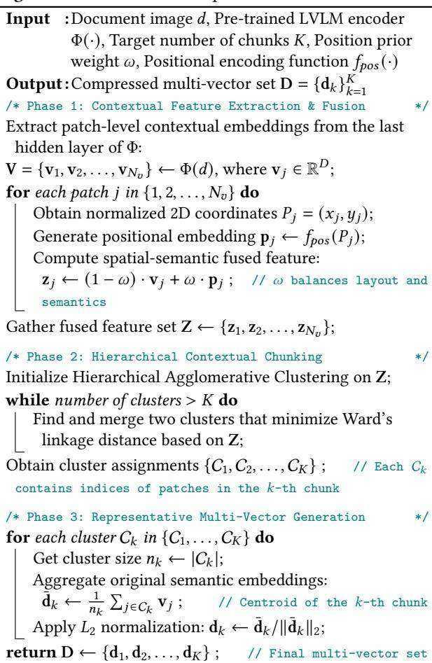
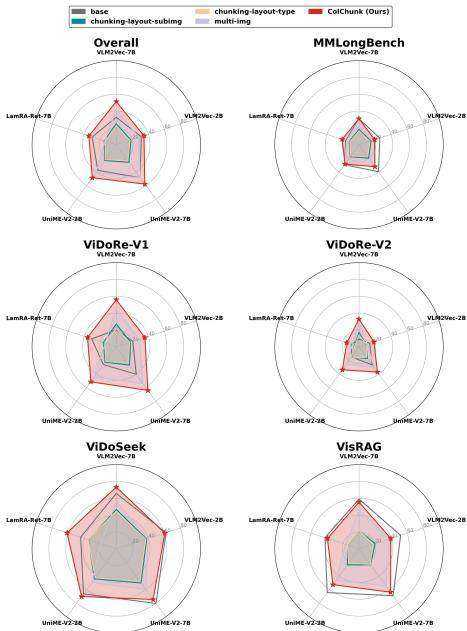
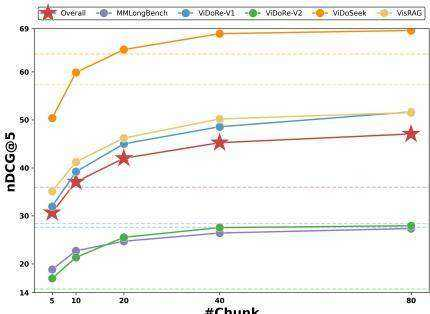
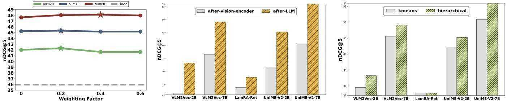

# Visual Late Chunking: An Empirical Study of Contextual Chunking for Efficient Visual Document Retrieval

Yibo $\mathbf { Y a n } ^ { 1 , 2 , 3 }$ , Mingdong $\mathbf { O u } ^ { 2 }$ , Yi Cao2, Jiahao $\mathbf { H u o } ^ { 1 , 2 }$ , $\mathbf { X } \mathbf { i n } \mathbf { Z o u } ^ { 1 , 3 }$ , Shuliang $\mathbf { L i u } ^ { 1 , 3 }$ , James Kwok3, Xuming Hu1,3,∗ 1Hong Kong University of Science and Technology (Guangzhou), 2Alibaba Cloud Computing, 3Hong Kong University of Science and Technology

# Abstract

Multi-vector models dominate Visual Document Retrieval (VDR) due to their fine-grained matching capabilities, but their high storage and computational costs present a major barrier to practical deployment. In this paper, we propose ColChunk, a plug-and-play framework that introduces multimodal late chunking to construct efficient, contextualized multi-vectors. Unlike existing pruning or fixed-token approaches, ColChunk employs hierarchical clustering on patch-level embeddings, fused with a 2D position prior to ensure spatial-semantic coherence. This adaptive grouping allows for a content-aware representation that preserves global context while drastically reducing the vector count. Evaluations across 24 VDR datasets demonstrate ColChunk achieves over a $9 0 \%$ reduction in storage requirements while simultaneously delivering a 9-point average improvement in $\scriptstyle \mathrm { n D C G } ( { \overline { { a } } } ) 5$ across representative single-vector models. ColChunk provides a practical solution for balancing retrieval accuracy and efficiency in visual document systems.

# Keywords

Visual Document Retrieval, Multi-Vector Retrieval, Efficiency

In Proceedings of Make sure to enter the correct conference title from your rights confirmation email (Conference acronym ’XX). https: //doi.org/XXXXXXX.XXXXXXX

# 1 Introduction

Visual Document Retrieval (VDR) has emerged as a critical task in information retrieval, aimed at identifying relevant documents from massive corpora based on both textual content and visual layout [4, 6, 40]. Currently, the state-of-the-art paradigm is dominated by multi-vector architectures, epitomized by ColPali [5]. These models represent each document page as a collection of patch-level embeddings, a strategy that perfectly aligns with the nature of visual documents where semantic information is densely packed and spatially distributed. By allowing “late interaction” between query terms and document patches, multi-vector models preserve fine-grained details that are often lost in coarse-grained singlevector representations [13, 16, 30, 31].

Despite their superior retrieval accuracy, multi-vector VDR models face a significant bottleneck: storage efficiency [15, 29, 32, 33]. Storing thousands of embeddings per page leads to prohibitive memory costs in large-scale applications. To mitigate this, several optimization routes have been explored. ❶ Merging-based schemes, such as Light-ColPali [20], group similar tokens to reduce count [1, 2, 22], yet often suffer from unstable performance due to oversimplified aggregation. ❷ Pruning-based methods, like DocPruner [43], discard “redundant” tokens [10, 14, 36, 41], but their performance degrades sharply under high compression ratios as critical context is lost. $\otimes$ More recently, approaches like MetaEmbed [39] and CausalEmbed [11] introduce additional trainable “summary” tokens. However, these often require expensive re-training and lack the flexibility to adapt to varying document complexities, as they rely on a fixed number of learned latent representations.

A potential solution lies in the concept of “late chunking,” proposed by Günther et al. [8] and recently popularized in text embedding research [3, 25, 37]. In the text domain, late chunking leverages long-context models to generate token-level embeddings first, applying pooling only at the final stage to ensure each chunk embedding is richly contextualized. Inspired by this, we argue that a similar “multimodal late chunking” is essential for VDR. However, while text chunking is inherently sequential, visual documents are non-linear and spatial. Our motivation is to move beyond rigid or learned tokens and instead construct contextualized multi-vectors that are content-aware, allowing the number of chunks to be dynamically set to balance efficiency and semantic richness.

Therefore, we propose ColChunk, a novel paradigm for constructing contextualized multi-vectors specifically designed for visual documents. ColChunk overcomes the limitations of previous methods by performing hierarchical clustering on the semantic embeddings of the final transformer layer. By grouping tokens with similar semantic signatures into adaptive chunks and applying pooling, we generate a condensed set of multi-vectors for MaxSim-based retrieval. Crucially, to integrate the document’s spatial structure, we incorporate a position prior. By fusing 2D positional encodings with semantic embeddings during the clustering process, ColChunk ensures that the resulting chunks are both semantically coherent and spatially contiguous. This training-free approach retains global context while enabling a content-sensitive representation.

We conduct extensive experiments across 24 VDR datasets, adapting ColChunk to five representative single-vector models. The results are compelling: by using only 40 multi-vectors per page, a reduction of over $9 0 \%$ compared to original multi-vector counts (e.g., avg 768 in ColQwen2.5 [5]), we achieve an average improvement of 9 points in $\mathrm { n D C G } @ 5$ compared to the base single-vector models. This demonstrates that ColChunk serves as a flexible “plugand-play” enhancement, bridging the gap between efficient singlevector models and high-performance multi-vector mechanisms while deeply respecting the characteristics of visual documents.

Our contributions are summarized as follows:

❶ Novel Paradigm: We are the first to migrate the concept of late chunking to the visual document domain, addressing the critical storage bottleneck of current multi-vector VDR models.

$\otimes$ Training-free Flexibility: We propose a clustering-based framework with a spatial-semantic position prior that can be seamlessly applied to various models without additional training.

$\otimes$ Superior Trade-off: The extensive experiment demonstrate ColChunk achieves a superior trade-off between performance and efficiency, providing a foundation for real-world deployment.

# 2 Related Work

VDR is essential for accessing information in visually rich documents where semantic meaning is derived from both textual content and spatial layout [40, 42]. Traditional pipelines rely on OCR to extract text, but they often struggle to preserve structural integrity and fail on non-textual elements like tables and charts [27, 45]. While the era of Large Vision-Language Models (LVLMs) has introduced end-to-end single-vector models to bypass OCR (e.g., DSE [19], GME [46], UniSE [18]), these models suffer from significant information loss by compressing complex, high-resolution pages into a single coarse-grained representation. Consequently, multi-vector architectures, pioneered by ColPali [5], have redefined the SOTA through late interaction [13], with subsequent research focusing on enhancing performance via model architecture (e.g., ModernVBERT [34]), data synthesis (e.g., Nemotron ColEmbed V2 [26]), and training objectives (e.g., jina-embeddings-v4 [9]). Despite their superior accuracy, these models face a severe efficiency bottleneck due to the prohibitive storage of maintaining thousands of patch-level embeddings per page. To mitigate this footprint, current research generally follows three paradigms: pruning redundant embeddings (e.g., DocPruner [43]), merging similar tokens via pooling or clustering (e.g., Light-ColPali [20]), or introducing learnable summary tokens (e.g., MetaEmbed [39]). In this context, ColChunk addresses these limitations by migrating the concept of late chunking to the visual domain through spatial-semantic aware clustering.

# 3 Methodology

# 3.1 Task Formulation

The task of VDR is to identify the most relevant document page $d$ from a corpus $c$ for a given textual query $q$ . We follow the multivector retrieval paradigm, utilizing an LVLM-based encoder $\Phi ( \cdot )$ to map inputs into a continuous embedding space.

Formally, a query $q$ is encoded into a set of $N _ { q }$ token-level embeddings Q = {q?? }??????=1 , where each $\mathbf { q } _ { i } \in \mathbb { R } ^ { D }$ . Similarly, a document page $d$ , processed as an image, is represented by a set of $N _ { v }$ patch-level contextual embeddings $\mathbf { V } = \{ \mathbf { v } _ { j } \} _ { j = 1 } ^ { N _ { v } }$ , where ${ \bf v } _ { j } \in \mathbb { R } ^ { D }$ . The relevance score $S ( q , d )$ is computed using the late interaction mechanism:

$$
S ( q , d ) = \sum _ { i = 1 } ^ { N _ { q } } \frac { N _ { v } } { j = 1 } \frac { \mathbf { q } _ { i } ^ { \top } \mathbf { v } _ { j } } { \| \mathbf { q } _ { i } \| \| \mathbf { v } _ { j } \| } .
$$

We aim to construct a condensed multi-vector set $\mathbf { D } = \{ \mathbf { d } _ { k } \} _ { k = 1 } ^ { K }$ with size $K \ll N _ { v }$ (e.g., $K = 4 0$ ), minimizing storage overhead while preserving retrieval precision through spatial-semantic coherence.

# Algorithm 1: ColChunk Compression Workflow

# 3.2 The ColChunk Framework

ColChunk is an offline compression framework designed to transform patch-level embeddings into a streamlined yet semantically potent set of chunk embeddings. Given the set of $N _ { v }$ contextualized patch embeddings $\mathbf { V } = \{ \mathbf { v } _ { j } \} _ { j = 1 } ^ { N _ { v } }$ where ${ \bf v } _ { j } \in \mathbb { R } ^ { D }$ , extracted from an LVLM encoder, ColChunk constructs a multi-vector representation via three sequential stages as shown in Algorithm 1.

3.2.1 Spatial-Semantic Feature Integration. The semantics of visual documents are intrinsically tied to their spatial layout. To ensure that the subsequent clustering process is layout-aware, we map the 2D coordinates of each patch into the embedding space. For each patch $j \in \{ 1 , \ldots , N _ { v } \}$ , its position in the normalized coordinate system is defined as $P _ { j } = ( x _ { j } , y _ { j } )$ . We apply a 2D sinusoidal encoding function $f _ { p o s } : \mathbb { R } ^ { 2 }  \mathbb { R } ^ { D }$ to derive the positional embedding $\mathbf { p } _ { j } \in \mathbb { R } ^ { D }$ . The enhanced feature $\mathbf { z } _ { j } \in \mathbb { R } ^ { D }$ is then formed by fusing the semantic embedding $\mathbf { v } _ { j }$ with the positional embedding $\mathbf { p } _ { j }$ via a weighting factor $\omega \in [ 0 , 1 ] \colon \mathbf { z } _ { j } = \left( 1 - \omega \right) \cdot \mathbf { v } _ { j } + \omega \cdot \mathbf { p } _ { j } ,$ where $\omega$ serves as a hyperparameter to balance the influence of semantic similarity and spatial proximity during clustering.

3.2.2 Hierarchical Contextual Chunking. ColChunk implements content-aware partitioning through Hierarchical Agglomerative

  
Figure 1: The performance comparison of ColChunk on five VDR benchmarks across five single-vector retrieval models.

Clustering (HAC). we define an assignment function $\mathcal { A } : \{ 1 , \ldots , N _ { v } \} $ $\left\{ 1 , \ldots , K \right\}$ that partitions the $N _ { v }$ patches into $K$ disjoint chunks $\{ C _ { 1 } , C _ { 2 } , \ldots , C _ { K } \}$ , where $C _ { k } = \{ j \ | \ \mathcal { A } ( j ) = k \}$ .

A key characteristic of ColChunk is that the number of tokens assigned to each chunk is adaptive, denoted as $n _ { k } = | C _ { k } |$ , satisfying $\begin{array} { r } { \bar { \sum _ { k = 1 } ^ { K } n _ { k } } = N _ { v } } \end{array}$ . This non-uniformity allows the framework to dynamically adapt to document elements of varying scales. For example, a small $n _ { k }$ (e.g., $n _ { k } \approx 4$ ) may represent sparse elements such as a page number or an isolated icon; whereas a large $n _ { k }$ (e.g., $n _ { k } ~ \approx ~ 1 2 0 )$ typically corresponds to a dense text paragraph or a complex graphical region. By utilizing Ward’s linkage criterion to minimize intra-cluster variance, ColChunk ensures that each chunk is both spatially contiguous and semantically coherent.

3.2.3 Representative Multi-Vector Generation. Following the cluster assignment, we generate the final document multi-vector set $\mathbf { D } \in \mathbb { R } ^ { K \times D }$ by aggregating the original semantic embeddings $\mathbf { v } _ { j }$ (excluding the positional prior ${ \bf p } _ { j }$ to avoid geometric bias in retrieval). For the $k$ -th chunk, the representative embedding $\mathbf { d } _ { k } \in \mathbb { R } ^ { D }$ is calculated as: $\begin{array} { r } { \mathbf { d } _ { k } = \mathrm { N o r m } \left( \frac { 1 } { n _ { k } } \sum _ { j \in C _ { k } } \mathbf { v } _ { j } \right) } \end{array}$ , where $\operatorname { N o r m } ( { \cdot } )$ denotes $L _ { 2 }$ normalization operator. The resulting set $\mathbf { D } = \{ \mathbf { d } _ { k } \} _ { k = 1 } ^ { K }$ serves as final efficient index. Since each ${ \bf d } _ { k }$ is derived from late hidden states that have already integrated global context, the representation preserves fine-grained details even at a high compression $\%$ .

# 3.3 Theoretical Foundation

The efficacy of ColChunk can be understood through the Information Bottleneck (IB) principle [35]. Given a document $d$ and query $q$ the information flow forms a Markov chain $q  d  \mathbf { E } _ { \mathrm { p a t c h } }  \mathbf { C } .$ The Data Processing Inequality implies $I ( q ; \mathbf { C } ) \leq I ( q ; \mathbf { E } _ { \mathrm { p a t c h } } )$ , posing the challenge of minimizing information loss during compression. The IB objective is to find a compressed representation C by solving $\mathrm { { m i n } } _ { \mathrm { { C } } } [ I ( { \bf C } ; { \bf E } _ { \mathrm { p a t c h } } ) - \beta I ( { \bf C } ; q ) ]$ . Since $q$ is unknown at indexing time, we use the document’s spatial-semantic structure $d _ { \mathrm { s t r u c t } }$ as a tractable proxy for $q$ , reformulating the objective as $\mathrm { m i n c } \left[ I ( \mathbf { C } ; \mathbf { E } _ { \mathrm { p a t c h } } ) - \beta I ( \mathbf { C } ; d _ { \mathrm { s t r u c t } } ) \right]$ . ColChunk approximates this optimization in a training-free manner. The clustering and pooling stage, $g : { \mathbf { E } } _ { \mathrm { p a t c h } } \mapsto { \mathbf { C } } ,$ , acts as a quantizer that minimizes $I ( { \bf C } ; { \bf E } _ { \mathrm { p a t c h } } )$ by grouping $N$ patches into $k$ centroids. The spatial-semantic fusion stage maximizes the “relevance” term $I ( { \bf C } ; d _ { \mathrm { s t r u c t } } )$ by ensuring that the clustering operates on features F that encode both semantics and spatial layout. This forces the resulting chunks C to preserve the document’s salient structural information.

  
Figure 2: The comparison of the average performance of ColChunk across different chunk size. The dash lines refer to the base results.

# 4 Experiment

# 4.1 Experimental Setup

Benchmarks & Evaluation. We evaluate ColChunk across five prominent VDR benchmarks encompassing a total of 24 datasets: ViDoRe-V1 [5], ViDoRe-V2 [23], VisRAG [44], ViDoSeek [38], and MMLongBench [21]. To demonstrate the robustness of ColChunk, we conduct comprehensive verification on five representative singlevector models: VLM2Vec-2B/7B [12], LamRA-Ret [17], and UniME-V2-2B/7B [7]. We employ nDCG@5 as our primary metric.

Baselines. We compare ColChunk against three categories of baselines: (I) Base, representing the original single-vector models without multi-vector expansion; (II) Multi-img, where all subimages extracted via parsing are simultaneously fed into the singlevector models, leveraging their native multi-image input support; and (III) Late-chunking-layout, which performs semantic chunking on the last-layer tokens based on explicit layout parsing boundaries. The layout-aware category is further split into two variants: late-chunking-layout-type, which merges tokens of the same content type (e.g., text blocks, tables), and late-chunking-layout-subimg, which aggregates tokens within each sub-image. While these baselines rely on explicit, parsing-heavy segmentations, ColChunk offers a more streamlined, implicit chunking paradigm that achieves context preservation without requiring rigid layout constraints.

Implementation Details. To ensure a fair comparison, our entire evaluation pipeline is built upon MMEB framework [24]. For baselines requiring explicit document structure, we utilize MinerU2.5 [28] as the layout parsing engine to extract sub-images, bounding boxes, and content types. All experiments are conducted on a computing cluster equipped with NVIDIA A100 (80GB) GPUs.

# 4.2 Experimental Analysis

4.2.1 Main Result. As illustrated in Figure 1, ColChunk significantly enhances the retrieval efficacy of existing single-vector models by introducing an efficient late interaction mechanism. For example, ColChunk achieves a substantial performance leap across all tested backbones, notably elevating the overall average score of VLM2Vec-7B from 32.74 to 51.32, a relative improvement of nearly $5 7 \%$ . This gain is attributed to the contextualized multi-vector representation, which preserves fine-grained local semantic features that are typically collapsed in single-vector compression. Second, implicit semantic chunking within the embedding space proves superior to explicit layout-based partitioning that relies on external parsing engines. On ViDoRe-V1 benchmark with VLM2Vec-7B, ColChunk (55.89) significantly outperforms the layout-type (21.63) and layout-subimg (27.12) baselines. This suggests that explicit parsing often introduces noise or arbitrarily severs semantic continuity, whereas our hierarchical clustering adaptively identifies optimal semantic boundaries, ensuring higher representational integrity. Finally, ColChunk exhibits remarkable robustness and model-agnostic generalizability across diverse architectures. For instance, while LamRA-Ret-7B suffers a drastic performance drop when processing multi-image inputs (dropping to 14.28), ColChunk consistently recovers and boosts its overall performance to 34.21.

  
Figure 3: The comparison of the overall performance of ColChunk: (Left): with different weighting factors (different color indicates different chunk size, dash lines refer to average base results, and stars refer to the best results); (Middle): with different chunking positions (after vision encoder vs. after LLM backbone) across five models; (Right): with different clustering methods (k-means vs. hierarchical) across five models.

4.2.2 Scaling Analysis. As depicted in Figure 2, increasing the number of chunks consistently improves retrieval performance, but the gains exhibit diminishing returns, suggesting a highly efficient performance-to-storage trade-off at moderate chunk sizes. For instance, on UniME-V2-7B, increasing the chunk size from 10 to 40 yields a significant 7.0-point gain in overall score (from 50.67 to 57.67), whereas doubling it again to 80 provides a smaller 2.03- point improvement. This pattern indicates while a larger number of chunks better preserves fine-grained document details, a moderate number (e.g., 40) is sufficient to capture the most salient semantic regions, with further increases yielding marginal benefits. Besides, using an overly small number of chunks can be detrimental, leading to performance degradation even below that of the original singlevector baseline. Specifically, when using only 5 chunks, VLM2Vec-2B’s overall score drops to 21.96, a significant 9.22-point decrease from its base performance of 31.18. This is likely because extreme compression forces the merging of semantically disparate regions, leading to over-generalized chunk embeddings that obscure critical information more than the original global embedding.

# 4.2.3 Ablation & Hyperparameter Study.

Effect of weighting factor. The weighting factor $\omega$ plays a crucial role in balancing spatial contiguity and semantic coherence, with a moderate spatial constraint (typically around $\omega = 0 . 2$ ) yielding the best retrieval performance. As illustrated in Figure 3 (Left), for UniME-V2-2B with $K = 8 0$ , introducing $\omega = 0 . 2$ increases the overall score from 49.64 to 51.40; similarly, VLM2Vec-2B at $K = 4 0$ achieves its peak performance of 34.80 at $\omega = 0 . 2$ , whereas a further increase to $\omega = 0 . 6$ results in a decline to 34.37. This suggests that while 2D positional priors help maintain the structural integrity of chunks, an excessive weight may overshadow the semantic features.

Effect of chunking location. Performing ColChunk at the output of the LLM backbone is significantly more effective than at the vision encoder stage, as the former leverages the high-level semantic context essential for precise document retrieval. As illustrated in Figure 3 (Middle), for UniME-V2-7B, applying chunking after the LLM backbone achieves a peak overall score of 55.99, while performing it after vision encoder leads to a sharp decline to 40.66, even underperforming the single-vector base (48.41). Such results indicate LLM’s transformer layers are crucial for injecting global context into patch embeddings, and premature chunking at the vision encoder likely discards fine-grained information before its semantic relationship with the rest of document is fully established.

Effect of clustering method. Hierarchical agglomerative clustering (HAC) proves more effective than k-means for generating contextual chunks, consistently yielding superior retrieval performance. As shown in Figure 3 (Right), this superiority is evident on UniME-V2-7B, where HAC achieves an overall score of 55.99, outperforming k-means (50.88) by a 5.11-point margin. This performance discrepancy likely arises because HAC’s ability to form clusters of arbitrary shapes and sizes is better suited for capturing the non-uniform structure of visual document elements, unlike $\mathbf { k }$ -means which produces more uniformly sized, spherical clusters.

# 5 Conclusion

In this paper, we introduced ColChunk, a novel paradigm for efficient VDR. By adapting the concept of late chunking to the multimodal domain, we effectively addressed the storage bottleneck inherent in multi-vector architectures. Specifically, ColChunk leverages HAC combined with a spatial position prior to generate contextualized representations. Extensive experiment across 24 VDR datasets confirm that our method significantly outperforms compression baselines, achieving a superior trade-off between retrieval quality and computational overhead. We believe ColChunk can establishe a solid foundation for deploying advanced multimodal retrieval models in large-scale, real-world environments.

