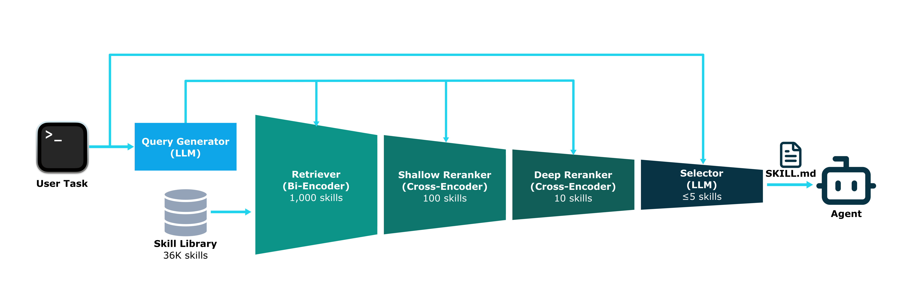

# SkillFlow

AI agents are increasingly capable, but discovering the right tool or workflow for a given task remains a bottleneck. SkillFlow addresses this by providing a scalable retrieval system over a corpus of ~36K agent skills crawled from online marketplaces. Given a natural-language task description, it returns the most relevant skills through a multi-stage pipeline: vector search, cross-encoder reranking, and LLM-based selection.



## Requirements

- Python 3.12+
- CUDA GPU recommended for index building (CPU works but slower)
- `OPENAI_API_KEY` for LLM-based query generation and selection

## Quick Start

**Step 1.** Set up your OpenAI API key:

```bash
echo "OPENAI_API_KEY=sk-..." > .env
```

**Step 2.** Install dependencies and download the skill corpus:

```bash
uv sync
cd data && bash scripts/setup-data.sh && cd ..
```

Alternatively, crawl the corpus yourself with `uv run python -m skill_crawler crawl` (see [Corpus](#corpus)).

**Step 3.** Build the index and search:

```bash
uv run python -m skill_flow.cli build-index       # ~90s on GPU
uv run python -m skill_flow.cli search --query "write unit tests for FastAPI"
```

## Architecture

| Stage | Candidates |
|-------|------------|
| 1 — Retrieval (bi-encoder + FAISS) | 36K → 1000 |
| 2 — Reranking (cross-encoder on full SKILL.md) | 1000 → 100 |
| 3 — Deep Reranking (cross-encoder, higher content limit) | 100 → 10 |
| 4 — Selection (LLM binary filter) | 10 → 5 |

All stages are independently configurable via `skill_flow/config/default.json` and require `OPENAI_API_KEY` in `.env` for LLM-based query generation and selection.

## Corpus

The skill corpus lives in `data/skills/` (gitignored, ~2.9 GB). Each skill is a bundle containing a SKILL.md file with YAML frontmatter for metadata along with associated files.

**Option A — Download pre-crawled corpus** (recommended for reproducing paper results):

```bash
cd data && bash scripts/setup-data.sh
```

**Option B — Crawl from scratch:**

```bash
uv run python -m skill_crawler crawl              # crawl all sources
uv run python -m skill_crawler crawl --dry-run    # preview without downloading
uv run python -m skill_crawler status             # check sync state
```

## Project Structure

```
skill-flow/
├── skill_crawler/       # Data acquisition (crawl SkillsMP → data/skills/)
├── skill_flow/          # Core retrieval (index, search, rerank, select, eval)
├── benchmark/           # Harbor-based agent evaluation framework
├── analysis/            # Ablation comparisons, failure analysis, paper asset generation
├── mcp_servers/         # MCP server implementations for live retrieval
├── data/skills/         # Crawled corpus (~36K SKILL.md files, gitignored)
├── outputs              # All outputs (indices, search results, evaluation logs)
└── tests/               # Test suite (80% coverage threshold)
```

## Citation

```bibtex
@article{li2026skillflowscalableefficientagent,
  title={SkillFlow: Scalable and Efficient Agent Skill Retrieval System}, 
  author={Fangzhou Li and Pagkratios Tagkopoulos and Ilias Tagkopoulos},
  year={2026},
  eprint={2504.06188},
  archivePrefix={arXiv},
  primaryClass={cs.AI},
  url={https://arxiv.org/abs/2504.06188}, 
}
```
