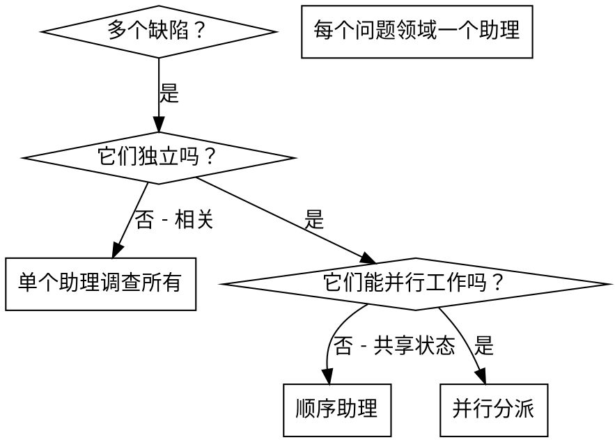

# 分派并行研究助理

## 概述

当你遇到多个不相关的缺陷（不同的验证章节，不同的子系统，不同的逻辑漏洞）时，按顺序调查它们浪费时间。每个调查都是独立的，可以并行进行。

**核心原则：** 为每个独立的问题领域分派一个助理。让他们并发工作。

## 何时使用



**使用当：**
- 3+ 个章节验证失败，原因各异
- 多个子论点独立崩溃
- 每个问题都可以在不需要其他上下文的情况下理解
- 调查之间没有共享状态

**不要使用当：**
- 缺陷是相关的（修复一个可能修复其他）
- 需要理解完整的系统状态
- 助理会互相干扰

## 模式

### 1. 识别独立领域

按损坏的内容分组缺陷：
- 章节 A 验证：工具审批流程
- 章节 B 验证：批量完成行为
- 章节 C 验证：中止功能

每个领域都是独立的——修复工具审批不影响中止验证。

### 2. 创建聚焦的助理任务

每个助理获得：
- **具体范围：** 一个验证文件或子系统
- **明确目标：** 使这些验证通过
- **约束：** 不要更改其他文稿
- **预期输出：** 发现和修复的摘要

### 3. 并行分派

```typescript
// 在 Claude Code / AI 环境中
Task("修复 agent-tool-abort.test.ts 失败")
Task("修复 batch-completion-behavior.test.ts 失败")
Task("修复 tool-approval-race-conditions.test.ts 失败")
// 所有三个并发运行
```

### 4. 审查和整合

当助理返回时：
- 阅读每个摘要
- 验证修复不冲突
- 运行完整验证套件
- 整合所有变更

## 助理提示词结构

好的助理提示词是：
1. **聚焦** - 一个清晰的问题领域
2. **自包含** - 理解问题所需的所有背景
3. **输出具体** - 助理应该返回什么？

```markdown
修复 src/agents/agent-tool-abort.test.ts 中的 3 个验证失败：

1. "应中止部分输出捕获的工具" - 预期消息中有 'interrupted at'
2. "应处理混合完成和中止的工具" - 快速工具中止而不是完成
3. "应正确跟踪 pendingToolCount" - 预期 3 个结果但得到 0 个

这些是时序/竞态条件问题。你的任务：

1. 阅读验证文件并理解每个测试验证什么
2. 识别根源 - 时序问题还是实际逻辑漏洞？
3. 修复方式：
   - 用基于事件的等待替换任意超时
   - 如果发现中止实施中的漏洞则修复
   - 如果测试了变更的行为，调整预期

不要只是增加超时 - 找到真正的问题。

返回：你发现的内容和修复内容的摘要。
```

## 常见错误

**❌ 太宽泛：** “修复所有验证” - 助理会迷路
**✅ 具体：** “修复 agent-tool-abort.test.ts” - 聚焦范围

**❌ 无背景：** “修复竞态条件” - 助理不知道在哪里
**✅ 背景：** 粘贴错误消息和验证名称

**❌ 无约束：** 助理可能重构一切
**✅ 约束：** “不要更改正文”或“仅修复验证”

**❌ 模糊输出：** “修好了” - 你不知道改了什么
**✅ 具体：** “返回根源和变更的摘要”

## 何时 不 使用

**相关缺陷：** 修复一个可能修复其他 - 先一起调查
**需要完整背景：** 理解需要看到整个系统
**探索性调试：** 你还不知道什么坏了
**共享状态：** 助理会干扰（编辑相同文件，使用相同资源）

## 真实示例

**场景：** 重大重构后 3 个文件中有 6 个验证失败

**失败：**
- agent-tool-abort.test.ts: 3 个失败（时序问题）
- batch-completion-behavior.test.ts: 2 个失败（工具未执行）
- tool-approval-race-conditions.test.ts: 1 个失败（执行计数 = 0）

**决定：** 独立领域 - 中止逻辑 与 批量完成 分离 与 竞态条件 分离

**分派：**
```
助理 1 → 修复 agent-tool-abort.test.ts
助理 2 → 修复 batch-completion-behavior.test.ts
助理 3 → 修复 tool-approval-race-conditions.test.ts
```

**结果：**
- 助理 1: 用基于事件的等待替换超时
- 助理 2: 修复事件结构漏洞（threadId 位置错误）
- 助理 3: 添加等待异步工具执行完成

**整合：** 所有修复独立，无冲突，全套通过

**节省时间：** 3 个问题并行解决 vs 顺序解决

## 关键收益

1. **并行化** - 多个调查同时发生
2. **聚焦** - 每个助理范围狭窄，跟踪背景少
3. **独立性** - 助理不互相干扰
4. **速度** - 1 倍时间解决 3 个问题

## 验证

助理返回后：
1. **审查每个摘要** - 理解改了什么
2. **检查冲突** - 助理是否编辑了相同代码？
3. **运行完整套件** - 验证所有修复协同工作
4. **抽查** - 助理可能会犯系统性错误
