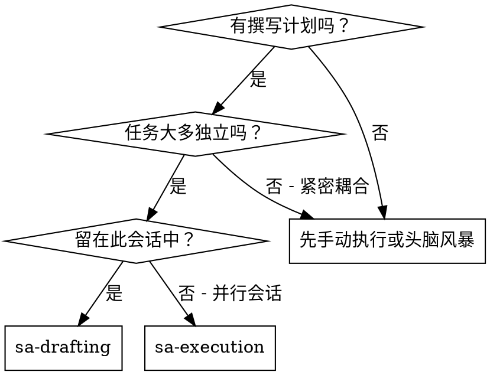
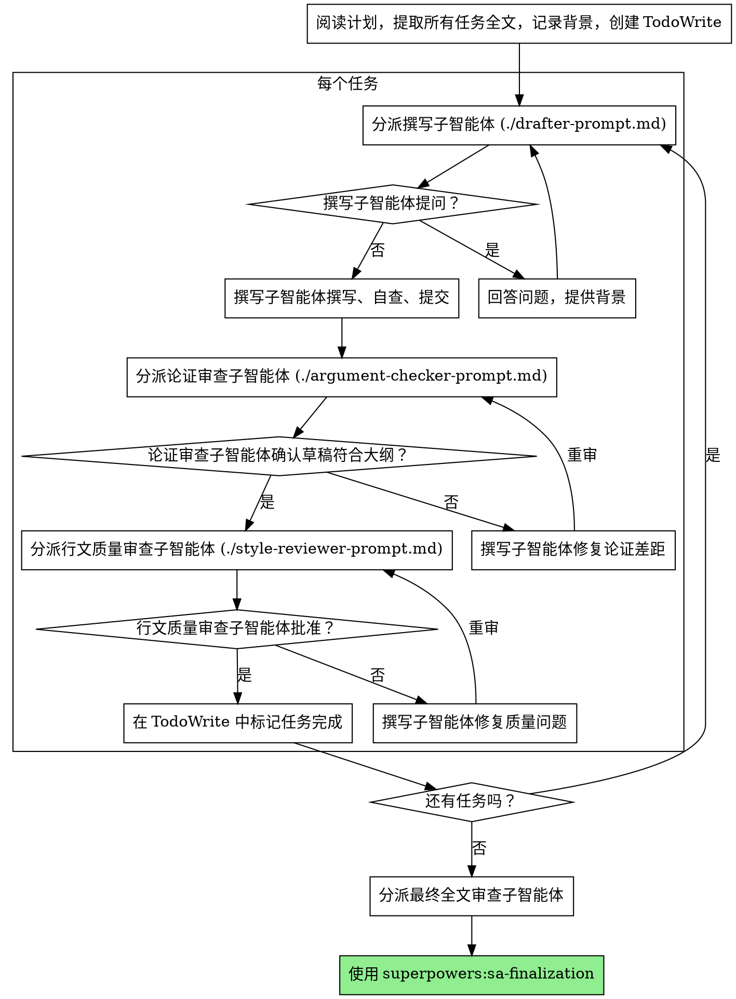

# 子智能体驱动写作

通过为每个任务分派新的子智能体来执行计划，并在每个任务后进行两阶段审查：首先是论证合规性审查，然后是行文质量审查。

**核心原则：** 每个任务使用新鲜的子智能体 + 两阶段审查（先论证后行文）= 高质量、快速迭代。

## 何时使用

**对比 执行计划 (并行会话):**
- 同一会话（无上下文切换）
- 每个任务使用新鲜的子智能体（无上下文污染）
- 每个任务后的两阶段审查：先论证合规，再行文质量
- 更快的迭代（任务之间无需人工介入）

## 流程

## 提示词模板

- `./drafter-prompt.md` - 分派撰写子智能体
- `./argument-checker-prompt.md` - 分派论证合规审查子智能体
- `./style-reviewer-prompt.md` - 分派行文质量审查子智能体

## 优势

**对比 手动执行:**
- 子智能体自然遵循 ADW (论证驱动写作)
- 每个任务新鲜背景（无混淆）
- 并行安全（子智能体不干扰）
- 子智能体可以提问（工作前和工作中）

**对比 执行计划:**
- 同一会话（无移交）
- 持续进展（无等待）
- 自动审查检查点

**质量门控:**
- 移交前自查捕捉问题
- 两阶段审查：先论证合规，再行文质量
- 审查循环确保修复有效
- 论证合规防止过度/不足论证
- 行文质量确保草稿结构良好

## 危险信号

**绝不:**
- 跳过审查（论证合规 或 行文质量）
- 在问题未修复时继续
- 并行分派多个撰写子智能体（冲突）
- 让子智能体阅读计划文件（应提供全文）
- 跳过场景设置背景（子智能体需要了解任务位置）
- 忽略子智能体问题（先回答再让他们继续）
- 接受“差不多”的论证合规（审查员发现问题 = 未完成）
- 跳过审查循环（审查员发现问题 = 撰写者修复 = 再次审查）
- 让撰写者自查取代实际审查（两者都需要）
- **在论证合规 ✅ 之前开始行文质量审查**（顺序错误）
- 在任一审查有未决问题时移动到下一个任务

**如果子智能体提问:**
- 清晰完整地回答
- 如果需要提供额外背景
- 不要催促他们进入撰写

**如果审查员发现问题:**
- 撰写者（同一子智能体）修复它们
- 审查员再次审查
- 重复直到批准
- 不要跳过重审

**如果子智能体任务失败:**
- 分派修复子智能体并给出具体指令
- 不要尝试手动修复（上下文污染）

## 集成

**所需工作流技能:**
- **superpowers:sa-planning** - 创建此技能执行的计划
- **superpowers:sa-peer_review** - 审查子智能体的同行评审模板
- **superpowers:sa-finalization** - 所有任务后的完成开发

**子智能体应使用:**
- **superpowers:sa-writing** - 子智能体为每个任务遵循 ADW (论证驱动写作)

**替代工作流:**
- **superpowers:sa-execution** - 用于并行会话而不是同一会话执行
