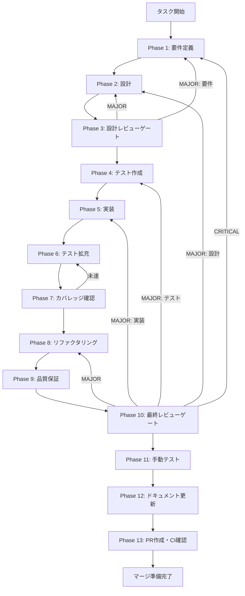

# メインタスク仕様書テンプレート

> **Progressive Disclosure**
> - 読み込みタイミング: ワークフロー初期化時（init-artifacts.js実行後）
> - 読み込み条件: index.mdメインタスク仕様書を生成するとき
> - 使用スキーマ: schemas/task-definition.json, schemas/artifact-definition.json
> - 出力先: docs/30-workflows/{{FEATURE_NAME}}/index.md

このテンプレートは、Phase 1からPhase 13までの全フェーズを含むタスク実行仕様書を生成するためのもの。

---

## 変数一覧

| 変数名 | 説明 | 例 |
| ------ | ---- | -- |
| `{{TASK_ID}}` | タスク識別子 | `task-20260106-search-replace` |
| `{{TASK_NAME}}` | タスク名（ケバブケース） | `search-replace-ui-implementation` |
| `{{FEATURE_NAME}}` | 機能名（ケバブケース） | `search-replace-ui` |
| `{{TASK_CATEGORY}}` | タスク分類 | `要件/改善/バグ修正/リファクタリング/セキュリティ/パフォーマンス` |
| `{{TARGET_FEATURE}}` | 対象機能 | `検索・置換機能` |
| `{{PRIORITY}}` | 優先度 | `高/中/低` |
| `{{SCALE}}` | 見積もり規模 | `大規模/中規模/小規模` |
| `{{CREATED_DATE}}` | 作成日（ISO形式） | `2026-01-06` |
| `{{USER_INSTRUCTION}}` | ユーザーの元の指示文 | （そのまま記載） |
| `{{TASK_PURPOSE}}` | タスクの目的 | （詳細に記述） |
| `{{TASK_BACKGROUND}}` | タスクの背景 | （詳細に記述） |
| `{{FINAL_GOAL}}` | 最終ゴール | （具体的な最終状態） |
| `{{SUBTASK_COUNT}}` | サブタスク数 | `15` |

---

## 配置先

```
docs/30-workflows/{{FEATURE_NAME}}/index.md
```

---

## テンプレート本体

```markdown
# {{FEATURE_NAME}} - タスク実行仕様書

## ユーザーからの元の指示

```
{{USER_INSTRUCTION}}
```

## メタ情報

| 項目         | 内容                              |
| ------------ | --------------------------------- |
| タスクID     | {{TASK_ID}}                       |
| タスク名     | {{TASK_NAME}}                     |
| 分類         | {{TASK_CATEGORY}}                 |
| 対象機能     | {{TARGET_FEATURE}}                |
| 優先度       | {{PRIORITY}}                      |
| 見積もり規模 | {{SCALE}}                         |
| ステータス   | 未実施                            |
| 作成日       | {{CREATED_DATE}}                  |

---

## タスク概要

### 目的

{{TASK_PURPOSE}}
<!-- このタスクで達成すべき目的を詳細に記述 -->

### 背景

{{TASK_BACKGROUND}}
<!-- このタスクが必要になった背景・コンテキストを詳細に記述 -->

### 最終ゴール

{{FINAL_GOAL}}
<!-- 達成すべき具体的な最終状態 -->

### 成果物一覧

| 種別         | 成果物                   | 配置先                            |
| ------------ | ------------------------ | --------------------------------- |
| 機能         | {{FEATURE_ARTIFACT}}     | `packages/*/src/{{FEATURE_PATH}}` |
| テスト       | {{TEST_ARTIFACT}}        | `packages/*/src/**/*.test.ts`     |
| ドキュメント | {{DOC_ARTIFACT}}         | `outputs/phase-*/`                |
| PR           | GitHub Pull Request      | GitHub UI                         |

---

## 参照ファイル

本仕様書のコマンド選定は以下を参照：

- `docs/00-requirements/master_system_design.md` - システム要件
- `.claude/skills/aiworkflow-requirements/references/` - システム仕様

---

## タスク分解サマリー

| ID     | フェーズ   | サブタスク名 | 責務   | 依存 |
| ------ | ---------- | ------------ | ------ | ---- |
| T-01-1 | Phase 1    | {{SUBTASK_NAME}} | {{SUBTASK_RESPONSIBILITY}} | - |
| T-02-1 | Phase 2    | {{SUBTASK_NAME}} | {{SUBTASK_RESPONSIBILITY}} | T-01 |
| T-03-1 | Phase 3    | {{SUBTASK_NAME}} | {{SUBTASK_RESPONSIBILITY}} | T-02 |
| T-04-1 | Phase 4    | {{SUBTASK_NAME}} | {{SUBTASK_RESPONSIBILITY}} | T-03 |
| T-05-1 | Phase 5    | {{SUBTASK_NAME}} | {{SUBTASK_RESPONSIBILITY}} | T-04 |
| T-06-1 | Phase 6    | {{SUBTASK_NAME}} | {{SUBTASK_RESPONSIBILITY}} | T-05 |
| T-07-1 | Phase 7    | {{SUBTASK_NAME}} | {{SUBTASK_RESPONSIBILITY}} | T-06 |
| T-08-1 | Phase 8    | {{SUBTASK_NAME}} | {{SUBTASK_RESPONSIBILITY}} | T-07 |
| T-09-1 | Phase 9    | {{SUBTASK_NAME}} | {{SUBTASK_RESPONSIBILITY}} | T-08 |
| T-10-1 | Phase 10   | {{SUBTASK_NAME}} | {{SUBTASK_RESPONSIBILITY}} | T-09 |
| T-11-1 | Phase 11   | {{SUBTASK_NAME}} | {{SUBTASK_RESPONSIBILITY}} | T-10 |
| T-12-1 | Phase 12   | {{SUBTASK_NAME}} | {{SUBTASK_RESPONSIBILITY}} | T-11 |
| T-13-1 | Phase 13   | {{SUBTASK_NAME}} | {{SUBTASK_RESPONSIBILITY}} | T-12 |

**総サブタスク数**: {{SUBTASK_COUNT}}個

---

## 実行フロー図



---

## Phase一覧

| Phase | 名称 | 仕様書 | ステータス |
| ----- | ---- | ------ | ---------- |
| 1 | 要件定義 | [phase-1-requirements.md](phase-1-requirements.md) | 未実施 |
| 2 | 設計 | [phase-2-design.md](phase-2-design.md) | 未実施 |
| 3 | 設計レビューゲート | [phase-3-design-review.md](phase-3-design-review.md) | 未実施 |
| 4 | テスト作成 | [phase-4-test-creation.md](phase-4-test-creation.md) | 未実施 |
| 5 | 実装 | [phase-5-implementation.md](phase-5-implementation.md) | 未実施 |
| 6 | テスト拡充 | [phase-6-test-expansion.md](phase-6-test-expansion.md) | 未実施 |
| 7 | カバレッジ確認 | [phase-7-coverage-check.md](phase-7-coverage-check.md) | 未実施 |
| 8 | リファクタリング | [phase-8-refactoring.md](phase-8-refactoring.md) | 未実施 |
| 9 | 品質保証 | [phase-9-quality.md](phase-9-quality.md) | 未実施 |
| 10 | 最終レビューゲート | [phase-10-final-review.md](phase-10-final-review.md) | 未実施 |
| 11 | 手動テスト | [phase-11-manual-test.md](phase-11-manual-test.md) | 未実施 |
| 12 | ドキュメント更新 | [phase-12-documentation.md](phase-12-documentation.md) | 未実施 |
| 13 | PR作成 | [phase-13-pr-creation.md](phase-13-pr-creation.md) | 未実施 |

---

## テストカバレッジ目標

### ユニットテスト

| 指標 | 最低基準 | 推奨基準 |
| ---- | -------- | -------- |
| Line Coverage | 80% | 90% |
| Branch Coverage | 60% | 70% |
| Function Coverage | 80% | 90% |

### 結合テスト

| 指標 | 目標 |
| ---- | ---- |
| APIエンドポイント | 100% |
| モジュール間インターフェース | 100% |
| 正常系シナリオ | 100% |
| 異常系シナリオ | 80%+ |
| 外部連携ポイント | 100% |

---

## 統合テスト連携（Phase 1〜11で必須）

各Phaseで以下の統合テスト連携アクションを実施すること:

| Phase | 統合テスト連携アクション |
| ----- | ------------------------ |
| 1 | 接続要件（API/認証/データフロー）を要件に明記 |
| 2 | 統合ポイント/契約（API・スキーマ）を設計に反映 |
| 3 | 統合テスト観点のレビューゲートを実施 |
| 4 | 統合テストシナリオを全カテゴリで作成 |
| 5 | フロント/バック接続の実装とテスト支援コード整備 |
| 6 | 統合テストの拡充（全カテゴリのカバレッジ向上） |
| 7 | 統合テストの再実行とゲート判定 |
| 8 | リファクタ後の統合テスト継続成功を確認 |
| 9 | 品質保証で統合テスト結果を確認 |
| 10 | 最終レビューで統合テスト結果を確認 |
| 11 | 手動統合テスト（UI/API接続）を確認 |

---

## Phase完了時の必須アクション

**各Phase完了時に以下を必ず実行すること:**

1. **タスク100%実行**: Phase内で指定された全タスクを完全に実行
2. **成果物確認**: 全ての必須成果物が生成されていることを検証
3. **実行記録**: 実行タスクの結果を記録
4. **artifacts.json更新**: Phase完了ステータスを更新
5. **Phase末端の実行確認**: 各タスクを100%実行し、各タスクを完遂した旨を必ず明記

```bash
# Phase完了時の検証コマンド
node .claude/skills/task-specification-creator/scripts/validate-phase-output.js docs/30-workflows/{{FEATURE_NAME}} --phase {{PHASE_NUMBER}}

# Phase完了・成果物登録
node .claude/skills/task-specification-creator/scripts/complete-phase.js \
  --workflow docs/30-workflows/{{FEATURE_NAME}} --phase {{PHASE_NUMBER}} --artifacts "..."
```

---

## 使用方法

1. ユーザー要求を分析
2. タスクID・タスク名を生成
3. `{{変数}}` を実際の値で置換
4. タスク分解サマリーを作成
5. 各Phaseの詳細を `references/phase-templates.md` から展開
6. `docs/30-workflows/{{FEATURE_NAME}}/index.md` に出力
7. 各Phase仕様書を `phase-N-*.md` として出力
```

---

## 出力ファイル構成

```
docs/30-workflows/{{FEATURE_NAME}}/
├── index.md                      # メインタスク仕様書
├── artifacts.json                # 成果物管理JSON
├── phase-1-requirements.md       # Phase 1: 要件定義
├── phase-2-design.md             # Phase 2: 設計
├── phase-3-design-review.md      # Phase 3: 設計レビューゲート
├── phase-4-test-creation.md      # Phase 4: テスト作成
├── phase-5-implementation.md     # Phase 5: 実装
├── phase-6-test-expansion.md     # Phase 6: テスト拡充
├── phase-7-coverage-check.md     # Phase 7: カバレッジ確認
├── phase-8-refactoring.md        # Phase 8: リファクタリング
├── phase-9-quality.md            # Phase 9: 品質保証
├── phase-10-final-review.md      # Phase 10: 最終レビューゲート
├── phase-11-manual-test.md       # Phase 11: 手動テスト
├── phase-12-documentation.md     # Phase 12: ドキュメント更新
├── phase-13-pr-creation.md       # Phase 13: PR作成
└── outputs/                      # 各Phase出力ディレクトリ
    ├── phase-1/
    ├── phase-2/
    └── ...
```
