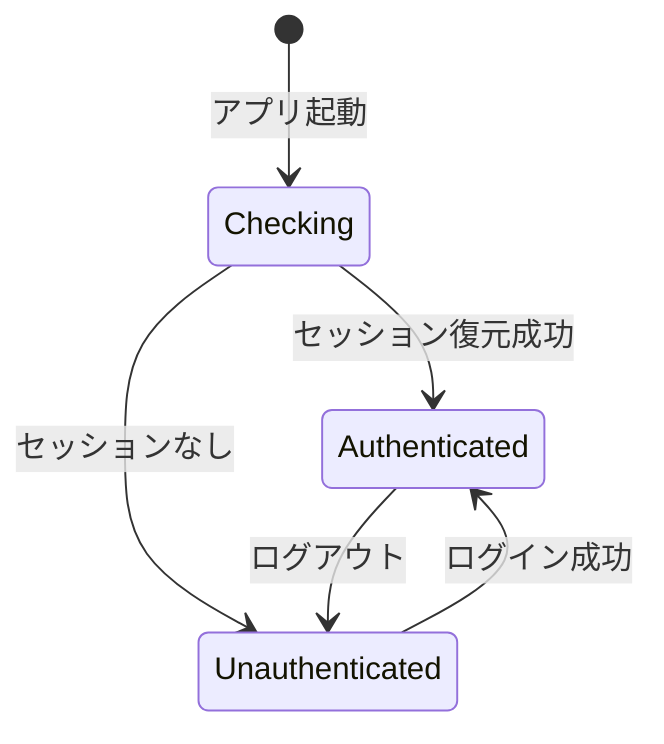

# 認証・セキュリティ アーキテクチャ設計

> 本ドキュメントは統合システム設計仕様書の一部です。
> 管理: .claude/skills/aiworkflow-requirements/

---

## 認証アーキテクチャ（Supabase + Electron）

### 認証基盤

| 項目             | 技術選定                | 説明                            |
| ---------------- | ----------------------- | ------------------------------- |
| 認証サービス     | Supabase Auth           | OAuth 2.0 PKCE フロー対応       |
| 対応プロバイダー | Google, GitHub, Discord | ソーシャルログイン              |
| トークン管理     | Electron SafeStorage    | OS キーチェーンによる暗号化保存 |
| セッション管理   | Supabase Session        | JWT ベース、自動リフレッシュ    |

### プロセス間責務分離

| プロセス     | 責務                                        | ファイル                            |
| ------------ | ------------------------------------------- | ----------------------------------- |
| Main Process | Supabase 連携、トークン管理、IPC ハンドラー | authHandlers.ts, profileHandlers.ts |
| Preload      | contextBridge による安全な API 公開         | preload/index.ts                    |
| Renderer     | 認証状態管理（Zustand）、UI                 | authSlice.ts, AccountSection.tsx    |

### カスタムプロトコル認証フロー（実装済み）

**詳細フロー**:

```
1. Renderer: login(provider) 呼び出し
2. Main: Supabase OAuth URL 生成、外部ブラウザで開く
3. ブラウザ: OAuth 認証完了
4. Supabase: aiworkflow://auth/callback#access_token=xxx にリダイレクト
5. Main: カスタムプロトコルでコールバック受信（app.on('open-url')）
6. Main: URLからaccess_token/refresh_tokenを抽出
7. Main: Refresh TokenをsafeStorage.encryptString()で暗号化
8. Main: 暗号化トークンをelectron-storeに保存
9. Main → Renderer: auth:state-changed イベント送信
10. Renderer: Zustand storeの認証状態を更新
```

**実装ファイル**:

- `apps/desktop/src/main/index.ts:105-188` - カスタムプロトコル処理
- `apps/desktop/src/main/infrastructure/secureStorage.ts` - トークン暗号化
- `apps/desktop/src/main/ipc/authHandlers.ts` - IPCハンドラー
- `apps/desktop/src/renderer/store/slices/authSlice.ts` - 状態管理

**セキュリティ考慮事項**:

| 項目                | 実装状況    | 説明                       |
| ------------------- | ----------- | -------------------------- |
| contextIsolation    | ✅ 有効     | main/index.ts:54           |
| nodeIntegration     | ✅ 無効     | main/index.ts:55           |
| sandbox             | ✅ 有効     | main/index.ts:53           |
| IPC Validation      | ✅ 実装済み | authHandlers.ts:77,145,187 |
| Refresh Token暗号化 | ✅ 実装済み | secureStorage.ts           |
| State parameter検証 | ❌ 未実装   | DEBT-SEC-001               |
| PKCE実装            | ❌ 未実装   | DEBT-SEC-002               |

### IPCチャネル（認証）

| チャネル                | 方向            | 用途                 |
| ----------------------- | --------------- | -------------------- |
| `auth:login`            | Renderer → Main | OAuth ログイン開始   |
| `auth:logout`           | Renderer → Main | ログアウト           |
| `auth:get-session`      | Renderer → Main | セッション取得       |
| `auth:refresh`          | Renderer → Main | トークンリフレッシュ |
| `auth:check-online`     | Renderer → Main | オンライン状態確認   |
| `auth:state-changed`    | Main → Renderer | 認証状態変更通知     |
| `profile:get`           | Renderer → Main | プロフィール取得     |
| `profile:update`        | Renderer → Main | プロフィール更新     |
| `profile:get-providers` | Renderer → Main | 連携プロバイダー一覧 |
| `profile:link-provider` | Renderer → Main | 新規プロバイダー連携 |

### 認証UIコンポーネント

| コンポーネント | 層       | 責務                                   | ファイル                                   | テストカバレッジ    |
| -------------- | -------- | -------------------------------------- | ------------------------------------------ | ------------------- |
| AuthGuard      | HOC      | 認証状態によるルーティング制御         | components/AuthGuard/index.tsx             | 100% (67/67 tests)  |
| useAuthState   | hook     | 認証状態取得ロジック                   | components/AuthGuard/hooks/useAuthState.ts | 100%                |
| getAuthState   | util     | 状態判定純粋関数                       | components/AuthGuard/utils/getAuthState.ts | 100% (5/5 tests)    |
| LoadingScreen  | molecule | 認証確認中のローディング画面表示       | components/AuthGuard/LoadingScreen.tsx     | 100%                |
| AuthView       | view     | ログイン画面表示（OAuthボタン配置）    | views/AuthView/index.tsx                   | -                   |
| AccountSection | organism | アカウント設定UI（プロフィール・連携） | components/organisms/AccountSection/       | 93% (115/115 tests) |
| ProviderIcon   | atom     | OAuthプロバイダーアイコン表示          | components/atoms/ProviderIcon/index.tsx    | 100%                |

### 認証状態遷移



**状態と表示の対応**:

| 状態            | AuthGuard表示内容 | 説明                   |
| --------------- | ----------------- | ---------------------- |
| checking        | LoadingScreen     | セッション確認中       |
| authenticated   | children          | 認証済み（メインUI）   |
| unauthenticated | AuthView          | 未認証（ログイン画面） |

### 技術的負債

ログイン機能復旧プロジェクト（2025-12-22完了）で発見された技術的負債:

| ID            | 項目                          | 深刻度 | 優先度 | 工数    | 説明                                                                                         |
| ------------- | ----------------------------- | ------ | ------ | ------- | -------------------------------------------------------------------------------------------- |
| DEBT-SEC-001  | State parameter検証           | Medium | Medium | 2-3時間 | CSRF攻撃対策として、OAuth認証開始時にstateパラメータを生成・保存し、コールバック時に検証する |
| DEBT-SEC-002  | PKCE実装                      | Medium | Low    | 3-4時間 | OAuth 2.1準拠のため、code_verifier/code_challenge生成と検証を実装する                        |
| DEBT-SEC-003  | カスタムプロトコルURL詳細検証 | Low    | Low    | 1-2時間 | aiworkflow://スキーム確認のみでなく、パス検証とクエリパラメータ検証を追加する                |
| DEBT-CODE-001 | 構造化ログ追加                | Low    | Low    | 2時間   | エラーログにタイムスタンプ・コンテキストを含める構造化ログを実装する                         |
| DEBT-CODE-002 | エラーメッセージ一元管理      | Low    | Low    | 1時間   | エラーメッセージを定数ファイルに一元管理する                                                 |

**対応方針**: 次のスプリントで計画的に対応する。現在の実装でも基本的なセキュリティ要件は満たしている。

---

## セキュリティアーキテクチャ

### レイヤー別セキュリティ

| レイヤー           | セキュリティ対策                                   |
| ------------------ | -------------------------------------------------- |
| API層              | 認証・認可チェック、レート制限、入力バリデーション |
| アプリケーション層 | ビジネスルールに基づくアクセス制御                 |
| インフラ層         | 暗号化通信、機密情報の安全な保存                   |
| データ層           | パラメータ化クエリ、最小権限の原則                 |

### 認証フロー

**Web（Discord OAuth）**:

1. ユーザーがDiscordログインボタンをクリック
2. Discord認可画面でユーザーが許可
3. コールバックでアクセストークン取得
4. セッションCookie発行
5. 以降のリクエストはセッションで認証

**Local Agent（APIキー）**:

1. 環境変数にAGENT_SECRET_KEYを設定
2. リクエストヘッダーにキーを含めて送信
3. サーバー側でキーを検証
4. 一致しない場合は401エラー

### データ保護

| 対象              | 保護方法                                 |
| ----------------- | ---------------------------------------- |
| APIキー（DB保存） | AES-256-GCMで暗号化後に保存              |
| セッション        | HttpOnly、Secure、SameSite属性付きCookie |
| 通信              | TLS 1.3による暗号化                      |
| ローカルファイル  | Electron safeStorage APIを使用           |

---

## RAGパイプラインアーキテクチャ

### 型定義モジュール構造

RAGパイプラインの型定義は4ファイル構成で実装される。

| ファイル   | 責務                                     | 依存関係             |
| ---------- | ---------------------------------------- | -------------------- |
| types.ts   | TypeScript型定義（エンティティ、構成型） | branded.ts のみ      |
| schemas.ts | Zodスキーマ定義（実行時バリデーション）  | types.ts, branded.ts |
| utils.ts   | ユーティリティ関数（ベクトル演算、変換） | types.ts             |
| index.ts   | バレルエクスポート（モジュールAPI統一）  | 上記3ファイル        |

**実装場所**: `packages/shared/src/types/rag/chunk/`

### 型安全性の保証

| 機構              | 説明                                                |
| ----------------- | --------------------------------------------------- |
| Branded Types     | ID型の厳格化（ChunkId, EmbeddingId等）              |
| readonly修飾子    | イミュータブルなエンティティ設計                    |
| Zodバリデーション | 実行時型安全性（UUID形式、範囲、SHA-256ハッシュ等） |
| TypeScript Strict | 厳格な型チェック（noImplicitAny, strictNullChecks） |

### CONV-03-01基礎型との統合

| 基礎型                         | チャンク・埋め込みモジュールでの利用 |
| ------------------------------ | ------------------------------------ |
| Timestamped                    | ChunkEntity, EmbeddingEntity で継承  |
| WithMetadata                   | ChunkEntity, EmbeddingEntity で継承  |
| FileId, ConversionId (Branded) | チャンクの親ファイル参照に使用       |
| RAGError (エラーハンドリング)  | ユーティリティ関数のエラー処理に使用 |

### 設計原則

| 原則          | 説明                                                  |
| ------------- | ----------------------------------------------------- |
| DRY           | 共通定数・ヘルパー関数の一元管理                      |
| 不変性        | readonly修飾子によるデータ変更防止                    |
| 純粋関数      | 副作用のないユーティリティ関数                        |
| テスト容易性  | TDD実装により99.53%カバレッジを達成                   |
| Single Source | 型定義とZodスキーマの二重定義を避け、スキーマから導出 |

### FTS5全文検索アーキテクチャ

RAGシステムのコア機能として、SQLite FTS5による高速全文検索を実装する。

#### アーキテクチャパターン

**External Content Table Pattern**を採用し、データ重複を回避しながらFTS5の高速検索を実現。

| コンポーネント         | 役割                                | 実装場所                   |
| ---------------------- | ----------------------------------- | -------------------------- |
| chunksテーブル         | チャンクデータ本体（Content Table） | `schema/chunks.ts`         |
| chunks_fts仮想テーブル | FTS5検索インデックス                | `schema/chunks-fts.ts`     |
| トリガー               | INSERT/UPDATE/DELETE時の自動同期    | マイグレーションSQL        |
| 検索クエリ             | BM25スコアリング + 3種の検索モード  | `queries/chunks-search.ts` |

#### 検索モード

| 検索モード     | 用途                     | FTS5構文例                        |
| -------------- | ------------------------ | --------------------------------- |
| キーワード検索 | 複数キーワードのOR検索   | `TypeScript JavaScript`           |
| フレーズ検索   | 完全一致（語順保持）     | `"typed superset"`                |
| NEAR検索       | 近接検索（距離指定可能） | `NEAR("JavaScript" "library", 5)` |

#### スコアリング方式

**BM25 + Sigmoid正規化**により0-1スケールの関連度スコアを提供：

```
正規化スコア = 1 / (1 + exp(-scale_factor * bm25_score))
```

| パラメータ   | デフォルト値 | 説明                   |
| ------------ | ------------ | ---------------------- |
| scale_factor | 0.3          | スコア分布の調整       |
| スコア範囲   | 0.0 - 1.0    | 高い値ほど関連度が高い |

#### 同期方式

**トリガーベースの自動同期**により、chunksテーブルとchunks_fts仮想テーブルの整合性を保証：

| 操作   | トリガー          | 処理内容                                  |
| ------ | ----------------- | ----------------------------------------- |
| INSERT | chunks_fts_insert | chunks_ftsにrowid, content, contextを挿入 |
| UPDATE | chunks_fts_update | chunks_ftsのcontent, contextを更新        |
| DELETE | chunks_fts_delete | chunks_ftsから該当rowidを削除             |

#### トークナイザー設定

**unicode61トークナイザー**により日本語・英語の混在テキストに対応：

| 設定       | 値                              | 説明                         |
| ---------- | ------------------------------- | ---------------------------- |
| tokenize   | `unicode61 remove_diacritics 2` | Unicode正規化 + 分音記号除去 |
| 日本語対応 | ✅ ひらがな、カタカナ、漢字     | 文字単位でトークン化         |
| 英語対応   | ✅ 単語単位                     | スペース区切りで分割         |

#### 性能特性

| 指標               | 実測値（3チャンク） | 目標（10,000チャンク） |
| ------------------ | ------------------- | ---------------------- |
| キーワード検索速度 | < 10ms              | < 100ms                |
| フレーズ検索速度   | < 10ms              | < 100ms                |
| NEAR検索速度       | < 10ms              | < 150ms                |
| インデックスサイズ | 微小                | データサイズの15-20%   |

**参照ドキュメント**:

- 詳細設計: `docs/30-workflows/rag-conversion-system/requirements-chunks-fts5.md`
- スキーマ設計: `docs/30-workflows/rag-conversion-system/design-chunks-schema.md`
- FTS5設計: `docs/30-workflows/rag-conversion-system/design-chunks-fts5.md`
- 検索設計: `docs/30-workflows/rag-conversion-system/design-chunks-search.md`

---

## 関連ドキュメント

- [プロジェクト概要](./01-overview.md)
- [ディレクトリ構造](./04-directory-structure.md)
- [コアインターフェース仕様](./06-core-interfaces.md)
- [エラーハンドリング仕様](./07-error-handling.md)
- [データベース設計](./15-database-design.md)
- [セキュリティガイドライン](./17-security-guidelines.md)
