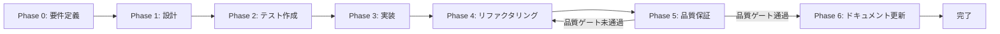

# タスクワークフロー フェーズ定義

> 本ドキュメントは統合システム設計仕様書の一部です。
> 管理: .claude/skills/aiworkflow-requirements/

---

## フェーズ構造

すべてのタスクは以下のフェーズ構造に従う。各フェーズ内で責務が複数ある場合は、サブタスク番号を分岐させる（例: T-00-1, T-00-2, T-00-3）。

### Phase 0: 要件定義

| 項目     | 内容                                                            |
| -------- | --------------------------------------------------------------- |
| ID接頭辞 | `T-00`                                                          |
| 目的     | タスクの目的、スコープ、受け入れ基準を明文化                    |
| 分割基準 | 機能領域ごと / ステークホルダーごと / 非機能要件ごと            |
| 成果物   | `docs/30-workflows/{{機能名}}/task-step{{N}}-{{要件定義名}}.md` |
| 参照     | `.claude/agents/agent_list.md` から要件分析系エージェントを選定 |

#### Phase 0 サブタスク出力テンプレート

```markdown
### {{ID}}: {{名称}}

#### 目的
{{目的の詳細説明}}

#### 背景
{{このサブタスクが必要な背景}}

#### 責務（単一責務）
{{このサブタスクが担う唯一の責務}}

#### 実行コマンド
{{コマンド}} {{オプション}}

#### 使用エージェント
- **エージェント**: {{エージェント名}}
- **選定理由**: {{選定理由}}
- **参照**: `.claude/agents/agent_list.md`

#### 活用スキル
| スキル名 | 活用方法 |
| -------- | -------- |
| {{スキル名}} | {{活用方法}} |

#### 成果物
| 成果物 | パス | 内容 |
| ------ | ---- | ---- |
| {{名称}} | {{パス}} | {{内容}} |

#### 完了条件
- [ ] {{条件}}

#### 依存関係
- **前提**: {{前提サブタスク}}
- **後続**: {{後続サブタスク}}
```

### Phase 1: 設計

| 項目     | 内容                                                              |
| -------- | ----------------------------------------------------------------- |
| ID接頭辞 | `T-01`                                                            |
| 目的     | 要件を実現可能な構造に落とし込む                                  |
| 分割基準 | 設計領域ごと / コンポーネントごと / レイヤーごと                  |
| 成果物   | `docs/30-workflows/{{機能名}}/task-step{{N+1}}-{{設計名}}.md`     |
| 参照     | `.claude/agents/agent_list.md` から設計系エージェントを選定       |

### Phase 2: テスト作成 (TDD: Red)

| 項目     | 内容                                                                  |
| -------- | --------------------------------------------------------------------- |
| ID接頭辞 | `T-02`                                                                |
| 目的     | 期待される動作を検証するテストを実装より先に作成                      |
| 分割基準 | テスト種別ごと / 機能ごと / レイヤーごと                              |
| 検証     | テストを実行してRed（失敗）を確認                                     |
| 成果物   | `docs/30-workflows/{{機能名}}/task-step{{N+2}}-{{テスト設計名}}.md`   |
| 参照     | `.claude/agents/agent_list.md` からテスト系エージェントを選定         |

#### TDD検証: Red状態確認

```bash
{{テスト実行コマンド}}
```

- [ ] テストが失敗することを確認（Red状態）

### Phase 3: 実装 (TDD: Green)

| 項目     | 内容                                                              |
| -------- | ----------------------------------------------------------------- |
| ID接頭辞 | `T-03`                                                            |
| 目的     | テストを通すための最小限の実装を行う                              |
| 分割基準 | 機能ごと / レイヤーごと / コンポーネントごと                      |
| 検証     | テストを実行してGreen（成功）を確認                               |
| 成果物   | `docs/30-workflows/{{機能名}}/task-step{{N+3}}-{{実装名}}.md`     |
| 参照     | `.claude/agents/agent_list.md` から実装系エージェントを選定       |

#### TDD検証: Green状態確認

```bash
{{テスト実行コマンド}}
```

- [ ] テストが成功することを確認（Green状態）

### Phase 4: リファクタリング (TDD: Refactor)

| 項目     | 内容                                                                      |
| -------- | ------------------------------------------------------------------------- |
| ID接頭辞 | `T-04`                                                                    |
| 目的     | 動作を変えずにコード品質を改善                                            |
| 分割基準 | 改善領域ごと / レイヤーごと / コンポーネントごと                          |
| 検証     | テストを再実行して継続成功を確認                                          |
| 成果物   | `docs/30-workflows/{{機能名}}/task-step{{N+4}}-{{リファクタリング名}}.md` |
| 参照     | `.claude/agents/agent_list.md` から品質系エージェントを選定               |

#### TDD検証: 継続Green確認

```bash
{{テスト実行コマンド}}
```

- [ ] リファクタリング後もテストが成功することを確認

### Phase 5: 品質保証

| 項目     | 内容                                                                    |
| -------- | ----------------------------------------------------------------------- |
| ID接頭辞 | `T-05`                                                                  |
| 目的     | 定義された品質基準をすべて満たすことを検証                              |
| 分割基準 | 検証種別ごと（テスト実行、Lint、型チェック、セキュリティ等）            |
| 成果物   | `docs/30-workflows/{{機能名}}/task-step{{N+5}}-{{レポート名}}.md`       |
| 参照     | `.claude/agents/agent_list.md` からQA/セキュリティ系エージェントを選定  |

### Phase 6: ドキュメント更新

| 項目         | 内容                                                          |
| ------------ | ------------------------------------------------------------- |
| ID接頭辞     | `T-06`                                                        |
| 目的         | 実装内容をシステム要件ドキュメントに反映（概要のみ）          |
| 前提条件     | Phase 5の品質ゲートをすべて通過していること                   |
| 更新対象     | `.claude/skills/aiworkflow-requirements/specs/` 配下の関連ドキュメント |
| 成果物       | 更新されたシステム要件ドキュメント                            |
| 実行コマンド | `/ai:update-all-docs`                                         |
| 参照         | `.claude/agents/agent_list.md` からtechnical-writerエージェントを選定 |

#### 更新判断基準

| 変更内容                          | 更新対象ドキュメント        |
| --------------------------------- | --------------------------- |
| 新しいエンティティ/テーブルの追加 | 05-architecture.md          |
| 新しいAPIエンドポイントの追加     | 08-api-design.md            |
| 新しい機能プラグインの追加        | 11-plugin-development.md    |
| 新しい環境変数の追加              | 13-environment-variables.md |
| アーキテクチャの変更              | 05-architecture.md          |
| ディレクトリ構造の変更            | 04-directory-structure.md   |
| 非機能要件の変更                  | 02-non-functional-requirements.md |

#### 更新原則

- **概要のみ記載**: 詳細な実装説明は不要
- **必要十分**: システム構築に必要不可欠な情報のみ追記
- **構造維持**: 既存ドキュメントの構造・フォーマットを維持
- **Single Source of Truth**: 重複記載禁止

### フェーズ遷移図



---

## 出力テンプレート

### ファイル配置

```
docs/30-workflows/{{機能名}}/task-step{{N}}-{{機能名}}.md
```

### テンプレート構造

タスク実行仕様書は以下の構造を持つ：

1. **ユーザーからの元の指示** - 元の指示文をそのまま記載
2. **タスク概要** - 目的、背景、最終ゴール、成果物一覧
3. **参照ファイル** - コマンド・エージェント・スキル選定の参照先
4. **タスク分解サマリー** - 全サブタスクの一覧表
5. **実行フロー図** - Mermaidによるフロー可視化
6. **各フェーズの詳細** - Phase 0〜5の各サブタスク詳細
7. **品質ゲートチェックリスト** - 完了条件のチェック項目
8. **リスクと対策** - リスク分析と対応方針
9. **前提条件** - タスク実行の前提
10. **備考** - 技術的制約、参考資料
