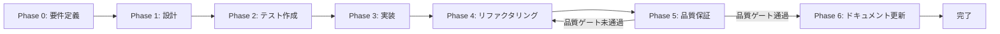

# タスク実行仕様書生成ガイド

> 本ドキュメントは統合システム設計仕様書の一部です。
> 管理: .claude/skills/aiworkflow-requirements/

---

## 概要

本ドキュメントは、複雑なタスクを単一責務の原則に基づいて分解し、各サブタスクに最適なスラッシュコマンド・エージェント・スキルの組み合わせを選定するためのガイドラインを定義する。

### 目的

ユーザーから与えられた複雑なタスクを分解し、以下を実現する：

- 単一責務の原則に基づいたサブタスク分割
- 各サブタスクに最適なコマンド・エージェント・スキルの選定
- そのまま実行可能な仕様書ドキュメントの生成
- TDDサイクル（Red→Green→Refactor）の組み込み
- 品質ゲートの明確化

### 成果物配置

生成された仕様書は以下のパスに配置する：

```
docs/30-workflows/{{機能名}}/task-step{{N}}-{{機能名}}.md
```

---

## ドキュメント構成

| ドキュメント     | ファイル                                             | 説明                                           |
| ---------------- | ---------------------------------------------------- | ---------------------------------------------- |
| フェーズ定義     | [task-workflow-phases.md](./task-workflow-phases.md) | Phase 0〜6の詳細定義とテンプレート             |
| ルール・選定基準 | [task-workflow-rules.md](./task-workflow-rules.md)   | 品質ゲート、コマンド・エージェント・スキル選定 |

---

## フェーズ構造（概要）

すべてのタスクは以下のフェーズ構造に従う。詳細は [task-workflow-phases.md](./task-workflow-phases.md) を参照。

| フェーズ                                  | ID接頭辞 | 目的                                         |
| ----------------------------------------- | -------- | -------------------------------------------- |
| Phase 0: 要件定義                         | `T-00`   | タスクの目的、スコープ、受け入れ基準を明文化 |
| Phase 1: 設計                             | `T-01`   | 要件を実現可能な構造に落とし込む             |
| Phase 2: テスト作成 (TDD: Red)            | `T-02`   | 期待される動作を検証するテストを先行作成     |
| Phase 3: 実装 (TDD: Green)                | `T-03`   | テストを通すための最小限の実装               |
| Phase 4: リファクタリング (TDD: Refactor) | `T-04`   | 動作を変えずにコード品質を改善               |
| Phase 5: 品質保証                         | `T-05`   | 定義された品質基準をすべて満たすことを検証   |
| Phase 6: ドキュメント更新                 | `T-06`   | 実装内容をシステム要件ドキュメントに反映     |

### フェーズ遷移図



---

## 品質ゲート（概要）

次フェーズに進む前に満たすべき品質基準。詳細は [task-workflow-rules.md](./task-workflow-rules.md) を参照。

- 機能検証: 全テスト成功（ユニット、統合、E2E）
- コード品質: Lintエラーなし、型エラーなし、フォーマット適用済み
- テスト網羅性: カバレッジ基準達成（60%以上）
- セキュリティ: 脆弱性スキャン完了、重大な脆弱性なし

---

## 出力テンプレート

### ファイル配置

```
docs/30-workflows/{{機能名}}/task-step{{N}}-{{機能名}}.md
```

### テンプレート構造

タスク実行仕様書は以下の構造を持つ：

1. **ユーザーからの元の指示** - 元の指示文をそのまま記載
2. **タスク概要** - 目的、背景、最終ゴール、成果物一覧
3. **参照ファイル** - コマンド・エージェント・スキル選定の参照先
4. **タスク分解サマリー** - 全サブタスクの一覧表
5. **実行フロー図** - Mermaidによるフロー可視化
6. **各フェーズの詳細** - Phase 0〜5の各サブタスク詳細
7. **品質ゲートチェックリスト** - 完了条件のチェック項目
8. **リスクと対策** - リスク分析と対応方針
9. **前提条件** - タスク実行の前提
10. **備考** - 技術的制約、参考資料

---

## 実行時のコマンド・エージェント・スキル

### 本ドキュメント作成に使用するコマンド

| コマンド       | 用途                                                            |
| -------------- | --------------------------------------------------------------- |
| `/sc:workflow` | PRDと機能要件から構造化された実装ワークフローを生成             |
| `/sc:document` | コンポーネント、関数、API、機能の重点的文書生成                 |
| `/sc:design`   | システムアーキテクチャ、API、コンポーネントインターフェース設計 |

### 本ドキュメント作成に使用するエージェント

| エージェント           | 用途                                                   |
| ---------------------- | ------------------------------------------------------ |
| `technical-writer`     | 使いやすさとアクセシビリティに重点を置いた技術文書作成 |
| `requirements-analyst` | 曖昧なプロジェクトアイデアを具体的な仕様に変換         |
| `system-architect`     | スケーラブルシステムアーキテクチャ設計                 |

### 本ドキュメント作成に使用するスキル

タスク実行仕様書の生成には、プロジェクト固有のスキル定義（`.claude/skills/skill_list.md`）を参照する。

---

## 完了タスク

### タスク: task-specification-creator Phase 12テンプレート強化（2026-01-22完了）

| 項目       | 内容                                         |
| ---------- | -------------------------------------------- |
| タスクID   | TSC-PHASE12-IMPROVE-002                      |
| 完了日     | 2026-01-22                                   |
| ステータス | **完了**                                     |
| 対象スキル | `.claude/skills/task-specification-creator/` |
| バージョン | v7.6.0                                       |

#### 改善内容

1. **Phase 12-2セクション強化**
   - `spec-update-workflow.md`への参照リンク追加
   - 2ステップ実行プロセスの明示化（Step 1: 完了記録、Step 2: 仕様更新）
   - 判断基準テーブルをテンプレート内に埋め込み

2. **完了条件チェックリストの明示化**
   - Phase 12-2の3ステップを個別チェック項目として追加
   - 見落とし防止のため`【Phase 12-2 Step 1】`等のプレフィックス付与

3. **フォールバック手順セクション追加**
   - スクリプト不在時の代替手順を明記
   - `generate-documentation-changelog.js`等の手動実行ガイド

#### 成果物

| 成果物                     | パス                                                                      |
| -------------------------- | ------------------------------------------------------------------------- |
| phase-templates.md（更新） | `.claude/skills/task-specification-creator/references/phase-templates.md` |
| SKILL.md（更新）           | `.claude/skills/task-specification-creator/SKILL.md`                      |

---

### タスク: task-specification-creator Phase 12改善（2026-01-22完了）

| 項目       | 内容                                         |
| ---------- | -------------------------------------------- |
| タスクID   | TSC-PHASE12-IMPROVE-001                      |
| 完了日     | 2026-01-22                                   |
| ステータス | **完了**                                     |
| 対象スキル | `.claude/skills/task-specification-creator/` |
| バージョン | v7.5.0                                       |

#### 改善内容

1. **Phase 12 Task 2の2ステップ化**
   - Step 1: タスク完了記録（必須 - 全タスク共通）
   - Step 2: システム仕様更新（条件付き）

2. **documentation-changelog.md自動生成スクリプト追加**
   - `scripts/generate-documentation-changelog.js` 新規作成
   - artifacts.jsonとgit diffから自動生成

3. **spec-update-workflow.md明確化**
   - 2種類の更新アクション（完了記録 vs 仕様更新）を明確に分離
   - 判断フローチャートを全体フローに更新

#### 成果物

| 成果物                          | パス                                                                                    |
| ------------------------------- | --------------------------------------------------------------------------------------- |
| SKILL.md（更新）                | `.claude/skills/task-specification-creator/SKILL.md`                                    |
| spec-update-workflow.md（更新） | `.claude/skills/task-specification-creator/references/spec-update-workflow.md`          |
| 自動生成スクリプト（新規）      | `.claude/skills/task-specification-creator/scripts/generate-documentation-changelog.js` |

---

## 残課題（未タスク）

以下のタスクは未実施として認識されており、タスク仕様書が作成済み。

| タスクID             | タスク名                           | 優先度 | 発見元                                          | タスク仕様書                                                                    |
| -------------------- | ---------------------------------- | ------ | ----------------------------------------------- | ------------------------------------------------------------------------------- |
| TASK-3-1-B           | SkillExecutor IPC Handler統合      | 高     | TASK-3-1-A完了時（blocks）                      | `docs/30-workflows/unassigned-task/task-3-1-B-skillexecutor-ipc-integration.md` |
| TASK-SKILL-PERF-TEST | SkillExecutor パフォーマンステスト | 低     | TASK-3-1-A Phase 11推奨事項                     | `docs/30-workflows/unassigned-task/task-skillexecutor-performance-testing.md`   |
| SKILL-E2E-001        | スキルインポートE2Eテスト          | 中     | Phase 11（手動テスト検証）推奨事項              | `docs/30-workflows/unassigned-task/task-skill-import-e2e-testing.md`            |
| TSC-AUTOMATION-001   | Phase 12自動化スクリプト拡充       | 低     | skill-import-persistence-bugfix実施時           | `docs/30-workflows/unassigned-task/task-phase12-automation-enhancement.md`      |
| UT-008               | Chat History UI Components         | 中     | Phase 12（UT-006完了後の後続タスク）            | `docs/30-workflows/unassigned-task/task-chat-history-ui-components.md`          |
| UT-009               | Chat History Additional Use Cases  | 中     | Phase 12（api-chat-history.md 未実装Use Cases） | `docs/30-workflows/unassigned-task/task-chat-history-additional-usecases.md`    |

### 未タスク管理ルール

- 未タスクは `docs/30-workflows/unassigned-task/` に配置
- タスク完了時は取り消し線でマークし、完了タスクセクションに移動
- 優先度「高」のタスクから順に実施

---

## 関連ドキュメント

- [プロジェクト概要](./overview.md)
- [非機能要件](./quality-requirements.md)
- [アーキテクチャ設計](./architecture-overview.md)
- [プラグイン開発手順](./plugin-development.md)
- [task-specification-creator SKILL.md](../../task-specification-creator/SKILL.md)

---

## 変更履歴

| バージョン | 日付       | 変更内容                                                                                  |
| ---------- | ---------- | ----------------------------------------------------------------------------------------- |
| 1.0.0      | 2026-01-20 | 初版作成                                                                                  |
| 1.1.0      | 2026-01-22 | task-specification-creator Phase 12改善完了記録追加                                       |
| 1.2.0      | 2026-01-22 | 残課題（未タスク）セクション追加、未タスク2件（E2Eテスト、自動化拡充）登録                |
| 1.3.0      | 2026-01-22 | task-specification-creator v7.6.0完了記録追加（Phase 12テンプレート強化）                 |
| 1.4.0      | 2026-01-22 | 未タスク追加: UT-008 Chat History UI Components, UT-009 Chat History Additional Use Cases |
| 1.5.0      | 2026-01-25 | 未タスク追加: TASK-3-1-B (IPC Handler統合), TASK-SKILL-PERF-TEST (パフォーマンステスト)   |
