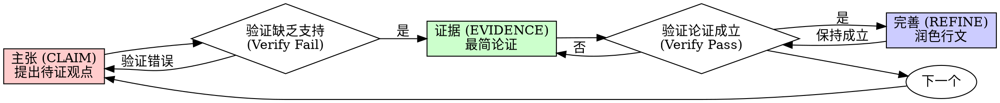

# 论证驱动写作 (Argument-Driven Writing, ADW)

## 概述

先写出缺乏支持的主张（检验失败）。看它缺乏证据。撰写最简内容以提供支持。

**核心原则：** 如果你没有先确认主张缺乏支持，你就不知道你是否在论证正确的东西。

**违反规则的字面意思就是违反学术严谨的精神。**

## 铁律

```
没有先行的待证主张，就不写正文
(NO PRODUCTION TEXT WITHOUT A UNSUPPORTED CLAIM FIRST)
```

在提出主张之前写正文？删除它。重新开始。

**无例外：**
- 不要保留它作为“参考”
- 不要在寻找证据时“调整”它
- 不要看它
- 删除意味着删除

从主张开始重新撰写。句号。

## 主张-证据-完善 (Claim-Evidence-Refine)



### 主张 (CLAIM) - 提出待证观点

写出一个你想要论证但目前文中尚未建立的观点。

<Good>
```markdown
<!-- 待证主张 -->
本节将论证：算法 A 在处理稀疏数据时优于算法 B。
现状检查：当前草稿中未包含相关对比数据或理论推导。
```
清晰的目标，测试真实的行为，单一焦点
</Good>

<Bad>
```markdown
<!-- 待证主张 -->
写关于算法 A 的东西。
```
模糊的目标，没有明确的验证标准
</Bad>

### 验证缺乏支持 (Verify CLAIM) - 看它失败

**强制性。绝不跳过。**

阅读当前草稿。

确认：
- 确实没有支持该主张的证据或论述
- 缺乏支持是因为还没写（而不是因为写错了地方）

**如果主张已成立？** 你在做重复工作。修改主张。

### 证据 (EVIDENCE) - 最简论证

撰写最简单的段落来支持该主张。

<Good>
```markdown
根据表 3 的实验结果，在稀疏度为 90% 的数据集上，算法 A 的收敛速度比算法 B 快 15%。这归因于算法 A 采用了更高效的索引机制...
```
足以支持主张即可
</Good>

<Bad>
```markdown
算法 A 是一种伟大的算法，由 Smith 等人于 2020 年提出。它不仅快，而且... [两页无关背景]
```
过度撰写，偏离核心主张
</Bad>

不要添加额外的论点，不要重写其他部分，或者“改进”超出主张范围的内容。

### 验证论证成立 (Verify EVIDENCE) - 看它通过

**强制性。**

阅读新写的段落。

确认：
- 主张现在得到了充分支持
- 逻辑连贯
- 没有引入新的逻辑漏洞

### 完善 (REFINE) - 润色

仅在验证通过后：
- 优化措辞
- 提高清晰度
- 调整衔接

保持主张成立。不要添加新行为。

### 重复

下一个主张，下一个循环。

## 为什么顺序很重要

**“我会先写，然后再检查逻辑”**

先写后查通常会产生偏见。你会检查你写了什么，而不是你需要论证什么。你验证的是你记得的论据，而不是发现缺失的论据。

先提出主张迫使你在撰写之前发现逻辑缺口。

**“我已经手动检查了所有逻辑”**

手动检查是临时的。你认为你检查了所有内容，但是：
- 没有记录你检查了什么
- 修改草稿时无法重跑检查
- 压力下容易忘记

**“删除 X 小时的工作是浪费”**

沉没成本谬误。时间已经过去了。你现在的选择：
- 删除并用 ADW 重写（X 小时，高置信度）
- 保留并事后修补（30 分钟，低置信度，可能有逻辑漏洞）

“浪费”是保留你无法信任的草稿。没有经过验证的草稿是学术债务。

## 常见借口

| 借口 | 现实 |
|--------|---------|
| “太简单了不用验证” | 简单的逻辑也会出错。验证只需 30 秒。 |
| “我以后再检查” | 后检查 = “这写了什么？” 先检查 = “这应该写什么？” |
| “删除 X 小时是浪费” | 沉没成本。保留未验证的草稿是债务。 |
| “保留作为参考” | 你会照抄的。那就是后检查。删除意味着删除。 |
| “需要先探索” | 可以。扔掉探索稿，用 ADW 重新开始。 |
| “难以验证 = 论点不清” | 倾听验证。难以验证 = 难以理解。 |

## 危险信号 - 停止并重新开始

- 先写正文
- 写完后才检查逻辑
- 主张立即成立（也就是已经写过了）
- 无法解释为什么主张缺乏支持
- 以后再补检查
- 合理化“就这一次”
- “我已经想清楚了”
- “以后检查也是一样的”

**所有这些都意味着：删除草稿。用 ADW 重新开始。**

## 验证清单

在标记工作完成之前：

- [ ] 每个新论点都有对应的待证主张
- [ ] 在撰写之前确认了主张缺乏支持
- [ ] 撰写了最简内容以支持主张
- [ ] 所有主张都得到支持
- [ ] 没有引入新的逻辑矛盾

无法勾选所有框？你跳过了 ADW。重新开始。
