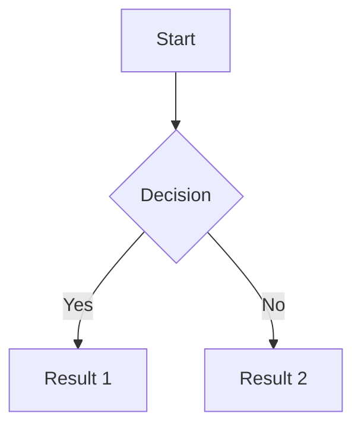
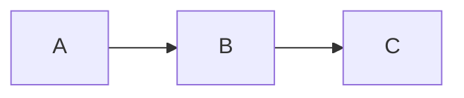
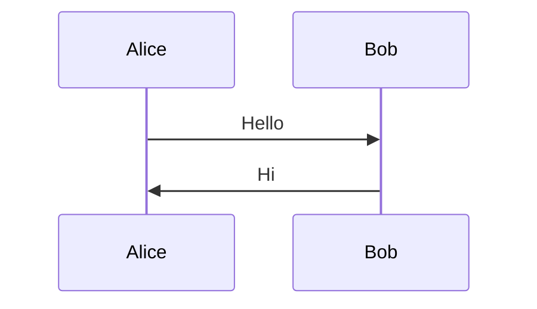
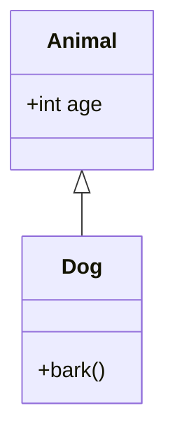
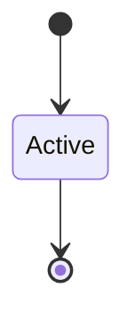
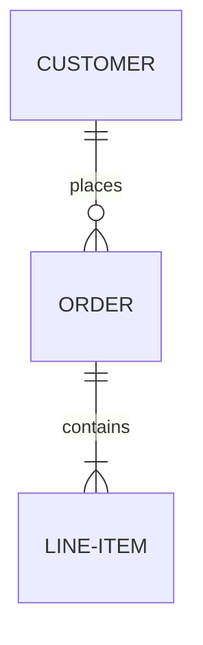
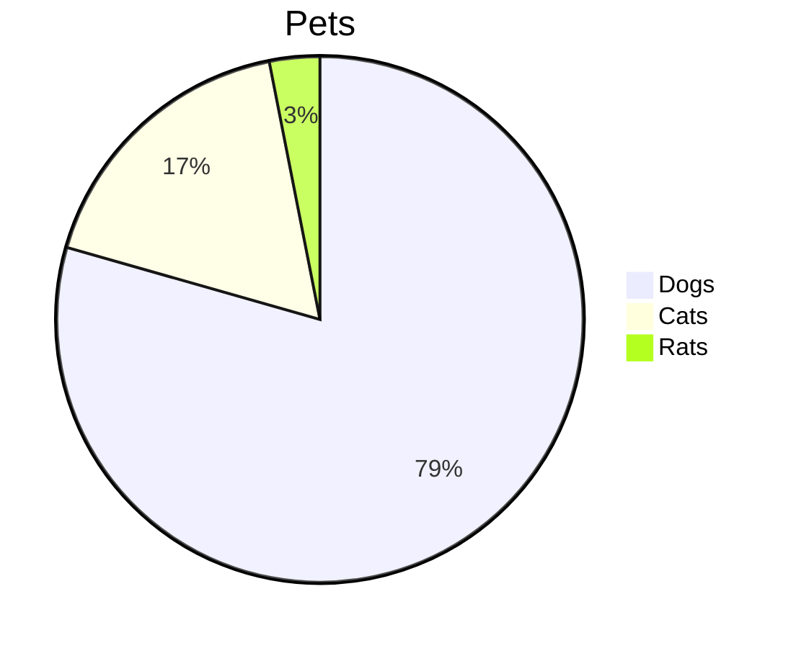
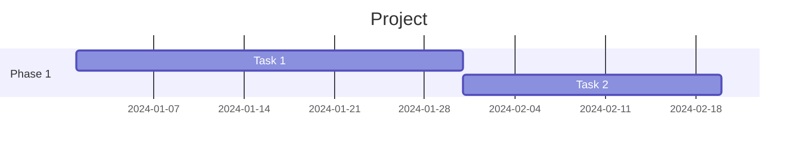
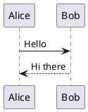
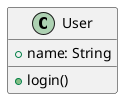

# Slidev Diagrams

Mermaid and PlantUML diagram integration.

## Mermaid Diagrams

Use fenced code blocks with `mermaid` language.
````markdown

````

### Mermaid Options

Pass options as an object after the language identifier.
````markdown

````

Common options:
- `theme` - Mermaid theme ('default', 'neutral', 'dark', 'forest')
- `scale` - Diagram scale factor

### Diagram Types

Mermaid supports many diagram types:
````markdown







````

### Configure Mermaid

Create `setup/mermaid.ts` for global configuration:
````typescript
import { defineMermaidSetup } from '@slidev/types'

export default defineMermaidSetup(() => {
  return {
    theme: 'forest',
    themeVariables: {
      primaryColor: '#4a9eff',
    },
  }
})
````

## PlantUML Diagrams

Use fenced code blocks with `plantuml` language.
````markdown

````

PlantUML requires an external server. By default, Slidev uses the public PlantUML server.

### PlantUML Options
````markdown

````

### Configure PlantUML Server

Set a custom server in headmatter:
````yaml
---
plantUmlServer: https://www.plantuml.com/plantuml
---
````

Or use a local server for offline use:
````yaml
---
plantUmlServer: http://localhost:8080
---
````

## Click Animations in Diagrams

Mermaid diagrams do NOT support v-click animations directly. To animate diagram elements, split into multiple slides or use multiple diagrams with v-click:
````markdown
<v-click>


</v-click>

<v-click>


</v-click>
````